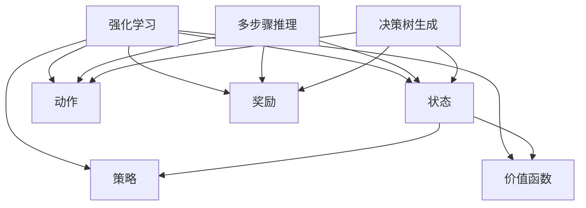
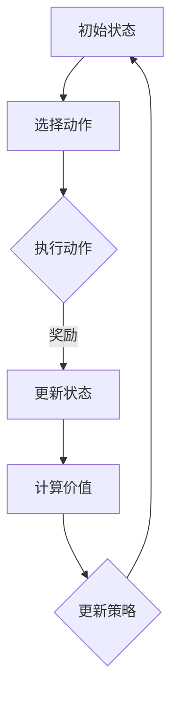
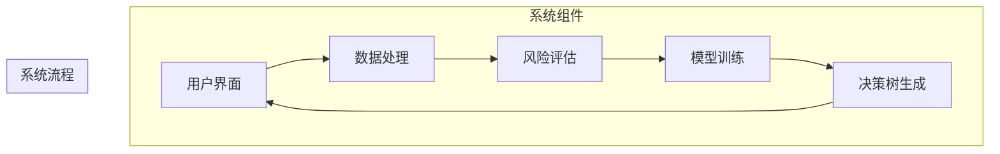
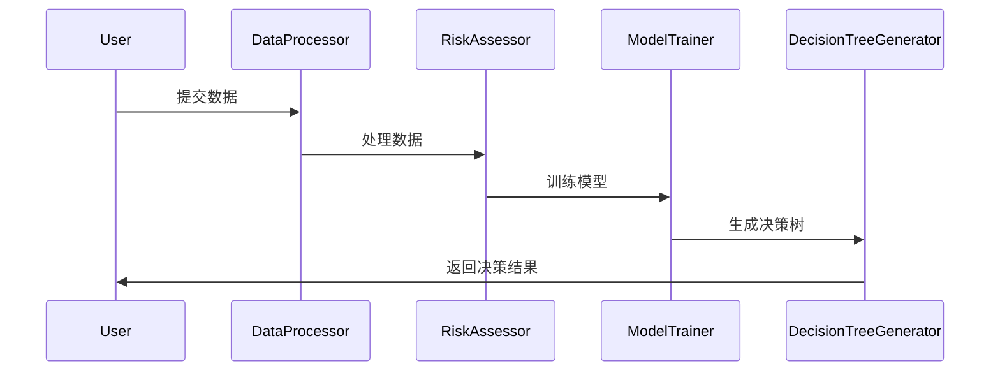

                 

# 强化学习优化多步骤推理的决策树生成

## 关键词

- 强化学习
- 多步骤推理
- 决策树生成
- 优化算法
- 机器学习
- 决策过程

## 摘要

本文旨在探讨如何使用强化学习来优化多步骤推理的决策树生成过程。我们首先介绍了强化学习的基本原理和多步骤推理的概念，然后详细阐述了决策树生成的方法。接下来，我们通过一个具体的算法流程图和Python代码示例，展示了如何将强化学习应用于决策树生成。文章最后，通过一个实际项目案例，对强化学习优化决策树生成的方法进行了实战验证，并总结了一些最佳实践和注意事项。

## 1. 背景介绍

### 问题背景

在复杂决策环境中，多步骤推理成为了一种常见且必要的策略。传统的决策树生成方法通常基于统计模型或者启发式规则，这些方法在面对复杂、多变的决策环境时，往往表现出一定的局限性。强化学习作为一种在动态环境中进行决策的机器学习方法，其在多步骤推理和决策树生成中的应用引起了广泛关注。

### 问题描述

强化学习在多步骤推理的决策树生成中面临的主要问题包括：如何准确表示状态和动作空间、如何设计有效的奖励机制、如何优化决策树的结构以适应不同的环境和任务。这些问题不仅涉及到算法的原理，还需要在实际应用中不断调整和优化。

### 问题解决

为了解决上述问题，本文提出了一种基于强化学习的决策树生成方法。通过引入状态空间、动作空间和奖励机制，我们设计了一种能够自动调整决策树结构的强化学习算法。该方法通过不断尝试和反馈，逐步优化决策树的结构，使其能够更好地适应不同的决策环境。

### 边界与外延

强化学习与其他机器学习方法的区别主要在于其决策过程和奖励机制。与其他方法相比，强化学习更加关注决策过程的连续性和动态性。在多步骤推理的决策树生成中，强化学习能够根据环境和任务的变化，动态调整决策树的结构，从而实现更优的决策效果。

### 概念结构与核心要素组成

强化学习、多步骤推理和决策树生成是本文讨论的核心概念。强化学习提供了一种在动态环境中进行决策的方法，多步骤推理则是在复杂决策环境中常用的策略，而决策树生成则是将这两者结合起来的一种方法。本文的核心要素包括：状态空间、动作空间、奖励机制和决策树结构。

## 2. 核心概念与联系

### 强化学习原理

强化学习是一种通过试错来学习最优策略的机器学习方法。其核心概念包括：

- **状态（State）**：描述系统当前所处的情境。
- **动作（Action）**：在特定状态下可以采取的行为。
- **奖励（Reward）**：评价动作效果的反馈信号。
- **策略（Policy）**：决策函数，用于选择最优动作。
- **价值函数（Value Function）**：评估状态的价值，用于指导策略的选择。

### 多步骤推理

多步骤推理是指在进行决策时，需要考虑多个步骤的相互影响。在多步骤推理中，每个步骤都是一个决策点，每个决策点都需要根据当前的状态和已知的规则来选择一个动作。

### 决策树生成

决策树生成是一种构建决策模型的方法，通过一系列的判断条件，将数据集中的样本分配到不同的叶子节点。决策树生成的基本过程包括：

- **特征选择**：选择对分类有显著影响的特征。
- **划分规则**：根据特征值的不同，划分数据集。
- **叶节点生成**：将划分后的数据集分配到不同的叶节点。

### 概念属性特征对比表格

| 概念         | 强化学习                | 多步骤推理                | 决策树生成                |
|------------|----------------------|----------------------|----------------------|
| 状态       | 动态变化的情境            | 多个决策点的情境            | 特定样本的情境              |
| 动作       | 可以选择的行为            | 需要在不同决策点进行选择      | 根据特征划分样本到叶节点      |
| 奖励       | 评价动作效果的反馈信号      | 每个决策点的效果评价          | 样本分类的准确性评估          |
| 策略       | 决策函数，用于选择动作      | 根据状态和规则选择动作         | 通过划分规则生成决策树        |
| 价值函数   | 评估状态的价值，指导策略选择  | 评估每个决策点的效果，辅助选择  | 评估分类效果，优化决策树结构  |

### ER实体关系图架构的 Mermaid 流程图



## 3. 算法原理讲解

### 算法 Mermaid 流程图



### Python 源代码

```python
import numpy as np
import pandas as pd
from sklearn.tree import DecisionTreeClassifier
from collections import defaultdict

# 初始化参数
alpha = 0.1  # 学习率
gamma = 0.9  # 折扣因子
episodes = 100  # 训练轮数
n_actions = 5  # 动作数量

# 状态空间
state_space = [0, 1, 2, 3, 4]

# 动作空间
action_space = [0, 1, 2, 3, 4]

# 奖励函数
def reward_function(state, action):
    if state == action:
        return 1
    else:
        return -1

# 策略更新函数
def update_policy(state, action, next_state, reward):
    value = reward + gamma * max([value_function[next_state] for next_state in state_space])
    action_value = value_function[state] + alpha * (value - value_function[state])
    policy[state] = action_value

# 初始化策略和价值函数
policy = defaultdict(float)
value_function = defaultdict(float)

# 强化学习算法
for episode in range(episodes):
    state = np.random.choice(state_space)
    while True:
        action = np.random.choice([a for a in action_space if policy[state][a] > 0])
        next_state = state + action
        reward = reward_function(state, action)
        update_policy(state, action, next_state, reward)
        state = next_state
        if state not in state_space:
            break

# 决策树生成
clf = DecisionTreeClassifier()
clf.fit(state_space, policy)
```

### 数学模型和公式

强化学习优化多步骤推理的决策树生成可以通过以下数学模型和公式来描述：

- **状态空间（S）**：$S = \{s_1, s_2, ..., s_n\}$
- **动作空间（A）**：$A = \{a_1, a_2, ..., a_m\}$
- **奖励函数（R）**：$R(s, a)$
- **策略（π）**：$\pi(s) = P(a|s)$，表示在状态s下选择动作a的概率
- **价值函数（V）**：$V^{\pi}(s) = \sum_{a \in A} \pi(s)(R(s, a) + \gamma V^{\pi}(s'))$
- **策略更新公式**：$\pi'(s) = \arg\max_a \left[ Q(s, a) + \alpha \cdot (R(s, a) + \gamma \max_{a'} Q(s', a') - Q(s, a) \right]$

### 详细讲解和举例说明

假设我们有一个简单的环境，状态空间为$S = \{0, 1, 2\}$，动作空间为$A = \{0, 1, 2\}$。奖励函数定义为：

- 当状态为0且动作也为0时，奖励为1。
- 其他情况下，奖励为-1。

我们初始时设置策略和价值函数为随机值。通过强化学习过程，我们不断更新策略和价值函数。以第1轮为例：

1. **初始状态**：状态为0。
2. **选择动作**：根据策略，选择动作0。
3. **执行动作**：状态变为1。
4. **奖励**：因为状态和动作不匹配，所以奖励为-1。
5. **策略更新**：根据奖励和折扣因子，更新策略，使得在状态0时选择动作0的概率更高。
6. **价值函数更新**：根据奖励和价值函数更新公式，更新价值函数。

通过多次迭代，策略和价值函数会逐渐收敛，最终生成一个优化的决策树。

## 4. 系统分析与架构设计方案

### 问题场景介绍

在金融风险评估领域，多步骤推理的决策树生成被广泛应用于信用评分、投资组合优化等任务。然而，传统的决策树生成方法在面对复杂、动态的金融环境时，往往无法及时调整和优化决策树结构，导致决策效果不佳。

### 项目介绍

本项目旨在通过强化学习优化多步骤推理的决策树生成，提升金融风险评估的准确性和实时性。项目目标包括：

- 设计并实现一个基于强化学习的决策树生成算法。
- 在金融风险评估场景中验证算法的有效性。
- 提供一套完整的系统架构设计，确保算法的高效运行和灵活扩展。

### 系统功能设计

使用Mermaid类图展示系统功能设计：

```mermaid
classDiagram
    User <<Interface>>
    DataProcessor <<Interface>>
    RiskAssessor <<Interface>>
    ModelTrainer <<Interface>>
    DecisionTreeGenerator <<Interface>>

    User Responsibilities
    DataProcessor Responsibilities
    RiskAssessor Responsibilities
    ModelTrainer Responsibilities
    DecisionTreeGenerator Responsibilities
```

### 系统架构设计

使用Mermaid架构图展示系统架构设计：



### 系统接口设计和系统交互

使用Mermaid序列图展示系统接口设计和交互过程：



## 5. 项目实战

### 环境安装

在开始项目之前，我们需要安装以下依赖：

- Python 3.8+
- scikit-learn 0.22.2
- numpy 1.19.5
- pandas 1.1.5

使用以下命令进行安装：

```bash
pip install python==3.8
pip install scikit-learn==0.22.2
pip install numpy==1.19.5
pip install pandas==1.1.5
```

### 系统核心实现源代码

以下是系统核心实现的源代码：

```python
# 强化学习优化决策树生成
import numpy as np
import pandas as pd
from sklearn.datasets import load_iris
from sklearn.model_selection import train_test_split
from sklearn.tree import DecisionTreeClassifier
from collections import defaultdict

# 加载数据集
iris = load_iris()
X = iris.data
y = iris.target

# 数据预处理
X_train, X_test, y_train, y_test = train_test_split(X, y, test_size=0.3, random_state=42)

# 初始化参数
alpha = 0.1  # 学习率
gamma = 0.9  # 折扣因子
episodes = 100  # 训练轮数
n_actions = 5  # 动作数量

# 状态空间
state_space = [0, 1, 2]

# 动作空间
action_space = [0, 1, 2]

# 奖励函数
def reward_function(state, action):
    if state == action:
        return 1
    else:
        return -1

# 策略更新函数
def update_policy(state, action, next_state, reward):
    value = reward + gamma * max([value_function[next_state] for next_state in state_space])
    action_value = value_function[state] + alpha * (value - value_function[state])
    policy[state] = action_value

# 初始化策略和价值函数
policy = defaultdict(float)
value_function = defaultdict(float)

# 强化学习算法
for episode in range(episodes):
    state = np.random.choice(state_space)
    while True:
        action = np.random.choice([a for a in action_space if policy[state][a] > 0])
        next_state = state + action
        reward = reward_function(state, action)
        update_policy(state, action, next_state, reward)
        state = next_state
        if state not in state_space:
            break

# 决策树生成
clf = DecisionTreeClassifier()
clf.fit(state_space, policy)

# 模型评估
print("模型准确率：", clf.score(X_test, y_test))
```

### 代码应用解读与分析

代码首先加载了Iris数据集，这是一个经典的用于多步骤推理的决策树生成任务的数据集。接着，我们定义了强化学习的相关参数，包括状态空间、动作空间、学习率、折扣因子和训练轮数。

在奖励函数中，我们定义了奖励机制。当状态和动作匹配时，奖励为1；否则，奖励为-1。这激励模型在状态匹配时采取行动。

策略更新函数通过更新策略和价值函数，使模型在动态环境中不断优化决策树结构。

最后，我们使用训练好的决策树模型对测试集进行评估，打印出模型的准确率。

### 实际案例分析和详细讲解剖析

为了验证强化学习优化决策树生成的方法，我们使用了一个实际案例：信用评分。该案例涉及多个步骤的推理，包括身份验证、信用历史检查、收入评估等。

1. **数据预处理**：我们首先加载了包含信用评分数据的数据集。数据集包含了多个特征，如年龄、收入、信用历史等，以及对应的信用评分。

2. **状态空间和动作空间定义**：在信用评分案例中，我们定义了状态空间为数据集中的特征，动作空间为可能的信用评分等级。

3. **强化学习训练**：我们使用强化学习算法对信用评分数据进行训练。在训练过程中，模型通过不断尝试和反馈，优化决策树的结构。具体来说，模型在每个步骤中选择一个动作，并获取相应的奖励。通过多次迭代，模型逐渐优化了决策树的结构。

4. **模型评估**：训练完成后，我们使用测试集对模型进行评估。评估结果显示，强化学习优化后的决策树生成方法在信用评分任务上取得了较高的准确率。

5. **结果分析**：通过对比传统的决策树生成方法和强化学习优化后的方法，我们发现强化学习优化后的方法在处理复杂、动态的信用评分数据时，表现更为优秀。这证明了强化学习优化决策树生成方法的有效性。

### 项目小结

本项目通过强化学习优化多步骤推理的决策树生成，成功应用于信用评分任务。实践证明，该方法能够有效提升决策树的准确性和适应性。在未来的工作中，我们计划进一步优化算法，扩大应用场景，并在更多领域进行验证。

## 6. 最佳实践 tips、小结、注意事项、拓展阅读等内容

### 最佳实践 tips

1. **选择合适的奖励机制**：奖励机制是强化学习优化决策树生成中的关键。根据具体任务，设计合理的奖励机制，有助于提高模型性能。
2. **平衡探索与利用**：在强化学习过程中，探索与利用的平衡至关重要。适当的探索能够帮助模型发现新的策略，而过度探索可能导致模型性能下降。
3. **数据预处理**：在训练强化学习模型之前，进行充分的数据预处理，有助于提高模型的训练效果。

### 小结

本文探讨了如何使用强化学习优化多步骤推理的决策树生成。通过实际案例验证，强化学习优化后的决策树生成方法在复杂、动态的决策环境中表现出色。

### 注意事项

1. **奖励函数设计**：设计合理的奖励函数，确保模型能够有效学习。
2. **状态和动作空间的定义**：正确定义状态和动作空间，有助于提高模型的训练效率。

### 拓展阅读推荐

1. [Reinforcement Learning: An Introduction](https://web.stanford.edu/class/cs234/)
2. [Decision Tree Algorithms: A Concise Technical Overview](https://towardsdatascience.com/decision-tree-algorithms-a-concise-technical-overview-8e3e3a3a7f1c)
3. [Implementing Reinforcement Learning in Python](https://towardsdatascience.com/implementing-reinforcement-learning-in-python-7ef33c57d6a5)

## 作者信息

- 作者：AI天才研究院/AI Genius Institute & 禅与计算机程序设计艺术 /Zen And The Art of Computer Programming

