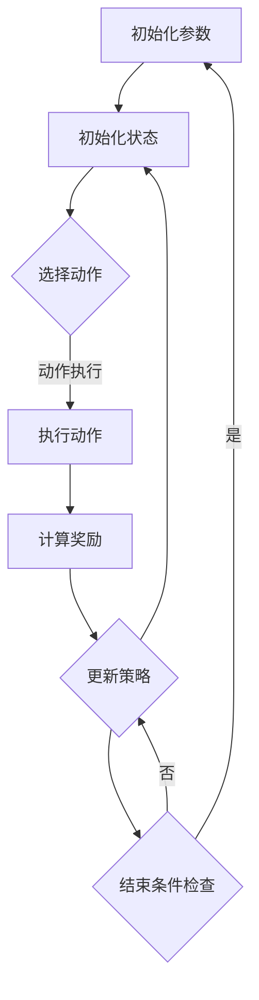

                 


###  第一步：强化学习与多目标推理概述

**1.1 强化学习基础**

强化学习是一种机器学习方法，旨在通过试错学习来最大化长期奖励。它由美国心理学家阿尔文·洛克希尔在20世纪50年代提出，主要分为以下几种类型：**值函数方法**、**策略搜索方法**和**模型预测方法**。

- **值函数方法**：通过学习一个值函数来预测每个状态和动作的组合所对应的长期奖励。
- **策略搜索方法**：直接学习一个策略，即一组决策规则，使得在给定的状态环境下能够选择最优的动作。
- **模型预测方法**：通过学习环境模型来预测未来的状态和奖励，进而优化决策。

强化学习具有以下几个核心概念：

- **状态（State）**：系统当前所处的环境描述。
- **动作（Action）**：系统可以采取的操作。
- **奖励（Reward）**：系统在某个状态执行某个动作后获得的即时反馈。
- **策略（Policy）**：系统在给定状态下采取的动作规则。
- **价值函数（Value Function）**：评估系统在未来能够获得的长期奖励。
- **模型（Model）**：对环境动态的预测。

**1.2 多目标推理简介**

多目标推理是指同时处理多个目标，以满足不同利益相关者的需求。多目标推理面临着以下挑战：

- **目标冲突**：不同的目标可能相互冲突，例如，在交通管理中，降低交通拥堵和提高通行效率之间存在冲突。
- **权衡决策**：需要找到一个平衡点，使得多个目标都能得到不同程度的满足。
- **不确定性**：环境中的因素可能具有不确定性和随机性，增加了推理的复杂性。

多目标推理的应用领域广泛，包括但不限于：

- **智能交通**：优化交通流量，减少拥堵，提高通行效率。
- **多机器人协同控制**：在复杂环境中，多个机器人需要协调行动，完成任务。
- **智能制造**：优化生产流程，提高生产效率，降低成本。

**1.3 强化学习与多目标推理的联系**

强化学习在多目标推理中有着广泛的应用。首先，强化学习能够通过试错学习来自动优化多目标之间的权衡。其次，强化学习能够处理环境中的不确定性和随机性，使得多目标推理更加灵活和适应。

强化学习优化多目标推理的优势包括：

- **自动权衡**：通过学习，系统能够自动找到不同目标之间的最佳平衡点。
- **适应性**：强化学习能够根据环境的变化动态调整策略，适应复杂和动态的环境。
- **效率提升**：通过优化决策过程，系统能够显著提高效率和性能。

### **总结**

本章主要介绍了强化学习和多目标推理的基础知识，包括核心概念、主要类型和应用领域。接下来，我们将深入探讨多目标推理中的强化学习应用，以及如何通过强化学习优化多目标决策过程。

----------------------------------------------------------------

## 强化学习与多目标推理概述

### **1.1 强化学习基础**

强化学习（Reinforcement Learning，RL）是一种通过试错和反馈来学习如何完成特定任务的机器学习方法。它起源于心理学研究，最初由阿尔文·洛克希尔（Arvin洛克希尔）于1950年代提出，旨在模拟生物体如何通过奖励和惩罚来学习行为。强化学习的核心在于通过不断尝试和反馈来优化策略，从而最大化累积奖励。

#### **强化学习的定义**

强化学习是一种基于奖惩机制的学习方法，其目标是让一个智能体（agent）在与环境（environment）的交互过程中，学会采取最佳行动（action）以实现特定目标。强化学习的目标函数是最大化累积奖励（cumulative reward），而非像监督学习那样最小化误差。

#### **强化学习的发展历程**

- **1950年代**：阿尔文·洛克希尔提出强化学习概念。
- **1980年代**：理查德·萨顿（Richard Sutton）和安德鲁·巴特利特（Andrew Barto）合著《强化学习：一种新的机器学习方法》。
- **1990年代**：强化学习算法如Q学习和策略梯度方法得到广泛应用。
- **2000年代**：深度强化学习（Deep Reinforcement Learning，DRL）结合深度学习技术，使得强化学习在图像识别、游戏等复杂任务中取得了突破性进展。
- **2010年代至今**：强化学习在自动驾驶、机器人、智能助手等实际应用中取得了显著成果。

#### **强化学习的核心概念**

- **状态（State）**：智能体所处的当前环境描述。
- **动作（Action）**：智能体可以采取的操作。
- **奖励（Reward）**：智能体在某个状态下采取某个动作后获得的即时反馈，通常表示为数值。
- **策略（Policy）**：智能体在给定状态下采取的动作规则，可以是一个函数，也可以是一个策略网络。
- **价值函数（Value Function）**：预测在给定状态下采取特定动作所能获得的长期奖励，包括状态价值函数（State-Value Function）和动作价值函数（Action-Value Function）。
- **模型（Model）**：对环境的动态行为进行建模，用于预测下一个状态和奖励。

#### **强化学习的类型**

- **值函数方法**：通过学习值函数来预测状态或动作的价值，例如Q学习、SARSA（同步优势估计）。
- **策略搜索方法**：直接学习策略，例如策略梯度方法。
- **模型预测方法**：通过学习环境模型来预测未来的状态和奖励，例如基于模型的强化学习。

### **1.2 多目标推理简介**

多目标推理（Multi-Objective Reasoning）是指同时考虑多个目标，并尝试在它们之间找到一个平衡点，以满足不同利益相关者的需求。在复杂系统中，多个目标往往存在冲突，如何有效地解决这些冲突是多目标推理的核心问题。

#### **多目标推理的定义**

多目标推理是一种在多个目标之间进行权衡和决策的推理方法，旨在找到一组解决方案，使得所有目标都得到一定程度的满足。多目标推理可以看作是多目标优化问题在推理领域的应用。

#### **多目标推理的挑战**

- **目标冲突**：不同的目标可能相互冲突，例如在交通管理中，降低交通拥堵和提高通行效率之间存在冲突。
- **权衡决策**：需要找到一个平衡点，使得多个目标都能得到不同程度的满足。
- **不确定性**：环境中的因素可能具有不确定性和随机性，增加了推理的复杂性。

#### **多目标推理的应用领域**

- **智能交通**：优化交通流量，减少拥堵，提高通行效率。
- **多机器人协同控制**：在复杂环境中，多个机器人需要协调行动，完成任务。
- **智能制造**：优化生产流程，提高生产效率，降低成本。
- **城市规划**：综合考虑多个因素，如环境保护、经济发展、社会需求等，制定最优的规划方案。

### **1.3 强化学习与多目标推理的联系**

强化学习在多目标推理中有着广泛的应用。强化学习可以通过试错和反馈来优化多目标之间的权衡，使得系统在不同目标之间找到最佳平衡点。

#### **强化学习在多目标推理中的应用**

- **自动权衡**：强化学习能够通过学习自动找到不同目标之间的最佳平衡点，无需手动设定权重。
- **适应性**：强化学习能够根据环境的变化动态调整策略，适应复杂和动态的环境。
- **效率提升**：通过优化决策过程，强化学习能够显著提高系统的效率和性能。

#### **多目标推理对强化学习的影响**

- **目标多样性**：多目标推理引入了更多的目标和约束条件，使得强化学习需要处理更加复杂的决策空间。
- **目标冲突**：多目标推理中的目标冲突增加了强化学习的难度，需要设计更有效的策略来处理。
- **评估复杂性**：多目标推理的评估函数通常是多指标、多目标的，增加了强化学习评估的复杂性。

#### **强化学习优化多目标推理的优势**

- **自动性**：强化学习能够自动调整策略，无需手动设定权重和优化目标。
- **灵活性**：强化学习能够根据环境变化动态调整，适应不同的场景。
- **高效性**：通过优化决策过程，强化学习能够显著提高系统的效率和性能。

### **总结**

本章介绍了强化学习的基础知识，包括定义、发展历程、核心概念和主要类型。同时，我们也探讨了多目标推理的定义、挑战和应用领域。最后，我们分析了强化学习在多目标推理中的应用和优势，为后续章节的深入探讨奠定了基础。

----------------------------------------------------------------

## 多目标推理中的强化学习应用

### **2.1 多目标强化学习算法**

多目标强化学习（Multi-Objective Reinforcement Learning，MO-RL）是一种将强化学习与多目标优化相结合的方法，旨在解决在多个目标之间存在冲突的情况下如何进行优化的问题。以下介绍几种常用的多目标强化学习算法：

#### **2.1.1 多目标Q学习**

多目标Q学习（Multi-Objective Q-Learning）是Q学习在多目标优化中的应用。Q学习是一种基于值函数的强化学习算法，通过学习状态-动作值函数来选择最佳动作。在多目标Q学习中，我们定义一个多目标Q值函数，它表示在给定状态下采取特定动作所能获得的长期奖励。多目标Q学习的目标是最大化这些长期奖励。

#### **算法原理**

多目标Q学习的核心是学习一个多目标Q值函数 \( Q(s, a) \)，其中 \( s \) 表示状态，\( a \) 表示动作。对于每个状态，我们需要找到一个动作 \( a \)，使得 \( Q(s, a) \) 最大。具体步骤如下：

1. **初始化**：随机初始化多目标Q值函数 \( Q(s, a) \) 和策略 \( \pi(a|s) \)。
2. **选择动作**：在给定状态下，根据当前策略 \( \pi(a|s) \) 选择一个动作 \( a \)。
3. **执行动作**：在环境中执行选择的动作 \( a \)，观察新状态 \( s' \) 和奖励 \( r \)。
4. **更新Q值**：根据新观察到的状态和奖励，更新多目标Q值函数 \( Q(s, a) \)。
5. **重复**：重复步骤2-4，直到达到预定的迭代次数或收敛条件。

#### **算法流程**

- **初始化**：随机初始化Q值函数 \( Q(s, a) \) 和策略 \( \pi(a|s) \)。
- **选择动作**：使用当前策略 \( \pi(a|s) \) 选择一个动作 \( a \)。
- **执行动作**：在环境中执行动作 \( a \)，观察新状态 \( s' \) 和奖励 \( r \)。
- **更新Q值**：使用以下公式更新Q值函数：
  \[
  Q(s, a) \leftarrow Q(s, a) + \alpha [r + \gamma \max_{a'} Q(s', a') - Q(s, a)]
  \]
  其中，\( \alpha \) 是学习率，\( \gamma \) 是折扣因子。
- **策略更新**：根据Q值函数更新策略 \( \pi(a|s) \)，通常使用软最大化策略更新：
  \[
  \pi(a|s) \leftarrow \frac{\exp(\lambda Q(s, a)}{\sum_{a'} \exp(\lambda Q(s, a'))}
  \]
  其中，\( \lambda \) 是温度参数。

#### **多目标Q学习案例**

假设我们有一个智能交通系统，需要同时优化交通流量和减少交通事故。状态 \( s \) 可以表示当前交通流量和交通事故率，动作 \( a \) 可以是调整信号灯的时间或设置交通管制措施。通过多目标Q学习，我们能够找到一个最优的动作策略，使得交通流量和交通事故率都得到改善。

#### **2.1.2 多目标策略梯度方法**

多目标策略梯度方法（Multi-Objective Policy Gradient，MO-PG）是一种基于策略梯度的强化学习算法。策略梯度方法通过直接优化策略来最大化累积奖励。在多目标策略梯度方法中，我们同时优化多个目标，通过计算策略梯度来更新策略。

#### **算法原理**

多目标策略梯度方法的核心理念是使用策略梯度来更新策略。策略梯度表示策略的期望回报的梯度，即：
\[
\nabla_{\pi} J(\pi) = \sum_{s,a} \pi(a|s) \nabla_a J(s, a)
\]
其中，\( J(\pi) \) 是策略的期望回报，\( \nabla_a J(s, a) \) 是在状态 \( s \) 下采取动作 \( a \) 的回报梯度。

多目标策略梯度方法的步骤如下：

1. **初始化**：随机初始化策略 \( \pi(a|s) \)。
2. **选择动作**：在给定状态下，根据当前策略 \( \pi(a|s) \) 选择一个动作 \( a \)。
3. **执行动作**：在环境中执行动作 \( a \)，观察新状态 \( s' \) 和奖励 \( r \)。
4. **计算策略梯度**：根据新观察到的状态和奖励，计算策略梯度 \( \nabla_{\pi} J(\pi) \)。
5. **更新策略**：使用策略梯度更新策略 \( \pi(a|s) \)。

#### **算法流程**

- **初始化**：随机初始化策略 \( \pi(a|s) \)。
- **选择动作**：根据当前策略 \( \pi(a|s) \) 选择一个动作 \( a \)。
- **执行动作**：在环境中执行动作 \( a \)，观察新状态 \( s' \) 和奖励 \( r \)。
- **计算策略梯度**：计算策略梯度 \( \nabla_{\pi} J(\pi) \)。
- **更新策略**：使用以下公式更新策略：
  \[
  \pi(a|s) \leftarrow \pi(a|s) + \alpha \nabla_{\pi} J(\pi)
  \]
  其中，\( \alpha \) 是学习率。

#### **多目标策略梯度方法案例**

假设我们有一个多机器人系统，需要同时优化任务完成时间和资源消耗。状态 \( s \) 可以表示机器人的位置、任务状态和资源水平，动作 \( a \) 可以是机器人的移动或任务分配。通过多目标策略梯度方法，我们能够找到一个最优的动作策略，使得任务完成时间和资源消耗都得到优化。

#### **2.1.3 多目标深度强化学习**

多目标深度强化学习（Multi-Objective Deep Reinforcement Learning，MODRL）是结合深度学习与强化学习的多目标优化方法。深度强化学习通过神经网络来近似值函数或策略，从而处理高维状态和动作空间。

#### **算法原理**

多目标深度强化学习的基本思想是使用深度神经网络来近似多目标Q值函数或策略网络。对于每个目标，我们定义一个Q值函数 \( Q_i(s, a) \)，用于评估在给定状态下采取特定动作对于第 \( i \) 个目标的长期奖励。然后，我们使用这些Q值函数来更新策略。

具体步骤如下：

1. **初始化**：随机初始化深度神经网络 \( Q_i(s, a) \) 和策略 \( \pi(a|s) \)。
2. **选择动作**：在给定状态下，根据当前策略 \( \pi(a|s) \) 选择一个动作 \( a \)。
3. **执行动作**：在环境中执行动作 \( a \)，观察新状态 \( s' \) 和奖励 \( r \)。
4. **更新Q值**：根据新观察到的状态和奖励，更新深度神经网络 \( Q_i(s, a) \)。
5. **更新策略**：根据更新后的Q值函数更新策略 \( \pi(a|s) \)。

#### **算法流程**

- **初始化**：随机初始化深度神经网络 \( Q_i(s, a) \) 和策略 \( \pi(a|s) \)。
- **选择动作**：根据当前策略 \( \pi(a|s) \) 选择一个动作 \( a \)。
- **执行动作**：在环境中执行动作 \( a \)，观察新状态 \( s' \) 和奖励 \( r \)。
- **更新Q值**：使用以下公式更新深度神经网络 \( Q_i(s, a) \)：
  \[
  Q_i(s, a) \leftarrow Q_i(s, a) + \alpha [r_i + \gamma \max_{a'} Q_i(s', a') - Q_i(s, a)]
  \]
  其中，\( \alpha \) 是学习率，\( \gamma \) 是折扣因子。
- **策略更新**：使用策略梯度更新策略 \( \pi(a|s) \)。

#### **多目标深度强化学习案例**

假设我们有一个自动驾驶系统，需要同时优化行驶速度和能耗。状态 \( s \) 可以表示车辆的位置、速度、加速度和环境因素，动作 \( a \) 可以是调整油门、刹车或转向。通过多目标深度强化学习，我们能够找到一个最优的动作策略，使得行驶速度和能耗都得到优化。

### **2.2 多目标决策过程的优化**

多目标决策过程是指在一个复杂系统中，同时考虑多个目标并尝试找到一个最佳解决方案的过程。优化多目标决策过程是一项具有挑战性的任务，因为不同的目标之间往往存在冲突，需要找到一个平衡点。

#### **2.2.1 多目标优化问题的定义**

多目标优化问题（Multi-Objective Optimization Problem）是指同时考虑多个目标，并试图找到一个最优解的问题。在多目标优化问题中，我们通常有多个目标函数，每个目标函数都表示一个不同方面的需求或限制。

多目标优化问题的标准形式可以表示为：
\[
\begin{align*}
\min_{x} f_1(x), f_2(x), \ldots, f_m(x) \\
\text{subject to} \\
g_1(x) \leq 0, g_2(x) \leq 0, \ldots, g_n(x) = 0
\end{align*}
\]
其中，\( x \) 是决策变量，\( f_1(x), f_2(x), \ldots, f_m(x) \) 是目标函数，\( g_1(x), g_2(x), \ldots, g_n(x) \) 是约束条件。

#### **多目标优化的挑战**

- **目标冲突**：不同的目标函数可能相互冲突，例如在交通管理中，降低交通拥堵和提高通行效率之间存在冲突。
- **权衡决策**：需要找到一个平衡点，使得所有目标函数都得到一定程度的满足。
- **评估复杂性**：多目标优化问题通常涉及到多个目标函数，增加了评估和优化的复杂性。
- **不确定性**：环境中的因素可能具有不确定性和随机性，增加了优化的难度。

#### **强化学习在多目标优化中的应用**

强化学习在多目标优化中具有独特优势，主要体现在以下几个方面：

- **自动权衡**：强化学习可以通过试错学习来自动找到不同目标之间的最佳平衡点，无需手动设定权重。
- **适应性**：强化学习能够根据环境的变化动态调整策略，适应复杂和动态的环境。
- **效率提升**：通过优化决策过程，强化学习能够显著提高系统的效率和性能。

#### **多目标优化的强化学习框架**

一个典型的多目标优化的强化学习框架包括以下几个主要组成部分：

1. **状态空间**：表示系统的当前状态，通常包括多个目标函数的当前值、决策变量的历史值等。
2. **动作空间**：表示系统可以采取的动作，例如调整决策变量的值。
3. **奖励函数**：根据系统的状态和动作计算奖励，奖励函数通常是一个包含多个目标函数的复合函数。
4. **策略**：系统在给定状态下选择动作的规则，可以是确定性策略或随机策略。
5. **评估函数**：评估系统的长期性能，通常用于计算累积奖励。

#### **多目标优化的强化学习算法步骤**

1. **初始化**：随机初始化策略和网络参数。
2. **选择动作**：在给定状态下，根据当前策略选择一个动作。
3. **执行动作**：在环境中执行选择的动作，观察新状态和奖励。
4. **更新策略和网络参数**：根据新观察到的状态和奖励，使用策略梯度和梯度下降方法更新策略和网络参数。
5. **重复**：重复步骤2-4，直到达到预定的迭代次数或收敛条件。

#### **多目标优化的强化学习案例**

假设我们有一个电力系统，需要同时优化发电成本和碳排放。状态 \( s \) 可以表示当前的发电负荷、电力价格、碳排放水平等，动作 \( a \) 可以是调整火力发电和可再生能源发电的比例。通过多目标优化的强化学习算法，我们能够找到一个最优的动作策略，使得发电成本和碳排放都得到优化。

### **2.3 强化学习在多目标推理中的挑战与解决方案**

尽管强化学习在多目标推理中具有巨大潜力，但在实际应用中仍然面临着一系列挑战。以下讨论这些挑战以及可能的解决方案。

#### **2.3.1 强化学习在多目标推理中的挑战**

- **目标冲突**：多目标推理中的目标往往存在冲突，例如在交通管理中，减少交通拥堵和提高通行效率之间存在冲突。强化学习需要设计有效的策略来解决这些冲突。
- **不确定性**：多目标推理中的环境通常存在不确定性和随机性，这使得强化学习难以稳定地找到最优策略。
- **评估复杂性**：多目标推理涉及多个目标函数，增加了评估和优化的复杂性。强化学习需要处理这些复杂的评估函数。
- **计算资源消耗**：多目标推理中的强化学习算法通常需要大量的计算资源，尤其是在高维状态和动作空间中。

#### **解决方案**

1. **自适应权重调整**：通过自适应权重调整策略，强化学习能够自动平衡不同目标之间的冲突。一种常见的方法是使用自适应权重调整算法，如自适应多目标Q学习（Adaptive Multi-Objective Q-Learning，AMOQ-Learning）。
2. **集成学习**：通过集成学习，强化学习可以结合多种策略和算法来提高性能。例如，可以使用多目标深度强化学习（MODRL）结合模型预测和动态规划方法来提高多目标推理的效率和准确性。
3. **混合方法**：结合强化学习和传统的多目标优化方法，可以解决强化学习在不确定性环境中的挑战。例如，可以使用强化学习来优化决策过程，同时使用传统的多目标优化算法来处理复杂的评估函数。
4. **分布式计算**：通过分布式计算，强化学习可以充分利用多台计算机或服务器的能力，从而提高计算效率和性能。例如，可以使用分布式强化学习算法，如多智能体强化学习（Multi-Agent Reinforcement Learning，MARL），来处理大规模的多目标推理问题。

#### **多目标强化学习案例**

假设我们有一个智能电网系统，需要同时优化电力供应效率和减少碳排放。状态 \( s \) 可以表示当前的电力需求、可再生能源发电量、电力价格等，动作 \( a \) 可以是调整火力发电和可再生能源发电的比例。通过多目标强化学习算法，我们能够找到一个最优的动作策略，使得电力供应效率和碳排放都得到优化。

### **总结**

本章介绍了多目标强化学习算法，包括多目标Q学习、多目标策略梯度方法和多目标深度强化学习。我们还探讨了多目标决策过程的优化，并讨论了强化学习在多目标推理中的挑战与解决方案。这些内容为理解如何应用强化学习优化多目标推理奠定了基础。

----------------------------------------------------------------

## 强化学习算法在多目标推理中的应用

### **3.1 算法原理讲解**

强化学习算法在多目标推理中的应用，本质上是一种通过试错和学习来优化多目标决策过程的方法。在这一部分，我们将详细讲解强化学习算法的基本原理，并探讨如何将其应用于多目标推理中。

#### **强化学习的基本原理**

强化学习算法的核心思想是智能体（agent）通过与环境的交互来学习如何采取最佳行动（action）以实现某个目标（目标可以是最大化奖励或最小化损失）。以下是强化学习算法的基本原理：

1. **状态（State）**：系统当前所处的环境描述。状态可以是离散的，也可以是连续的，通常表示为一个向量。
2. **动作（Action）**：智能体可以采取的操作。动作空间可以是离散的，也可以是连续的。
3. **奖励（Reward）**：智能体在某个状态下执行某个动作后获得的即时反馈。奖励通常是一个标量，用来表示动作的好坏。
4. **策略（Policy）**：智能体在给定状态下选择动作的规则。策略可以是一个确定性函数，也可以是一个概率分布。
5. **价值函数（Value Function）**：预测在给定状态下执行某个动作所能获得的长期奖励。价值函数分为状态价值函数（\( V(s) \)）和动作价值函数（\( Q(s, a) \)）。
6. **模型（Model）**：对环境的动态行为进行建模，用于预测未来的状态和奖励。

#### **多目标推理的基本原理**

多目标推理是指在同时处理多个目标时，找到一组解决方案，使得这些目标都得到一定程度的满足。在多目标推理中，我们通常面临以下挑战：

1. **目标冲突**：不同的目标可能相互冲突，例如在交通管理中，降低交通拥堵和提高通行效率之间存在冲突。
2. **权衡决策**：需要找到一个平衡点，使得多个目标都能得到不同程度的满足。
3. **不确定性**：环境中的因素可能具有不确定性和随机性，增加了推理的复杂性。

多目标推理的基本原理包括：

1. **目标函数**：定义一组目标函数，每个目标函数表示一个特定的需求或限制。
2. **权衡机制**：通过权衡机制来平衡不同目标之间的冲突，例如使用权重或目标优先级。
3. **优化算法**：用于找到一组最优解，使得所有目标函数都得到一定程度的满足。

#### **强化学习与多目标推理的结合**

强化学习在多目标推理中的应用，主要是利用其试错学习和策略优化的能力，来处理多目标之间的冲突和权衡问题。以下是强化学习在多目标推理中应用的基本步骤：

1. **状态表示**：将多目标系统的当前状态表示为一个向量，这个向量包含了所有相关目标的当前值和其他必要信息。
2. **动作表示**：定义智能体的动作空间，每个动作表示对系统的一个调整，例如调整某个参数或执行某个操作。
3. **奖励设计**：设计一个奖励函数，用来评估智能体的行动对于多个目标的影响。奖励函数通常是一个包含多个目标函数的复合函数，可以表示为：
   \[
   R(s, a) = \sum_{i=1}^{m} w_i f_i(s, a)
   \]
   其中，\( w_i \) 是目标 \( i \) 的权重，\( f_i(s, a) \) 是目标 \( i \) 的函数。
4. **策略学习**：使用强化学习算法（如Q学习、策略梯度方法等）来学习最优策略。智能体通过不断尝试和反馈来优化策略，以最大化累积奖励。

### **3.2 算法mermaid流程图与Python源代码**

为了更好地理解强化学习算法在多目标推理中的应用，我们使用mermaid流程图和Python源代码来展示算法的基本流程和实现细节。

#### **3.2.1 多目标强化学习算法流程图**

以下是一个简化的多目标强化学习算法的mermaid流程图：



#### **3.2.2 多目标强化学习Python源代码示例**

以下是一个简单的Python代码示例，展示了如何实现一个多目标强化学习算法的基本框架：

```python
import numpy as np
import matplotlib.pyplot as plt

# 初始化参数
state_size = 3
action_size = 2
learning_rate = 0.1
discount_factor = 0.9
episode_count = 1000

# 初始化Q值表格
Q = np.zeros((state_size, action_size))

# 奖励函数
def reward_function(state, action):
    # 示例：目标1是最大化状态0，目标2是最大化状态1
    reward = state[0] * (1 - action) + state[1] * action
    return reward

# 策略选择
def choose_action(state):
    # 使用ε-贪婪策略选择动作
    epsilon = 0.1
    if np.random.rand() < epsilon:
        action = np.random.choice(action_size)
    else:
        action_values = Q[state]
        action = np.argmax(action_values)
    return action

# 强化学习主循环
for episode in range(episode_count):
    state = np.random.randint(state_size)
    done = False
    
    while not done:
        action = choose_action(state)
        next_state = np.random.randint(state_size)
        reward = reward_function(state, action)
        Q[state, action] = Q[state, action] + learning_rate * (reward + discount_factor * np.max(Q[next_state]) - Q[state, action])
        
        state = next_state
        if np.random.rand() < epsilon:
            done = True
            
# 可视化Q值表格
plt.imshow(Q, cmap='hot', interpolation='nearest')
plt.colorbar()
plt.show()
```

#### **3.2.3 算法原理讲解**

在这个示例中，我们定义了一个简单的多目标强化学习问题，状态空间和动作空间都是离散的。智能体的目标是最大化状态0和状态1的加权和。我们使用ε-贪婪策略来选择动作，并在每次迭代中更新Q值表格。最终，我们可视化Q值表格，展示了智能体在多次迭代后学习的最优策略。

### **3.3 数学模型和数学公式**

强化学习在多目标推理中的应用，可以通过数学模型和公式来描述。以下是几个关键的数学模型和公式：

1. **Q学习更新公式**：
   \[
   Q(s, a) \leftarrow Q(s, a) + \alpha [r + \gamma \max_{a'} Q(s', a') - Q(s, a)]
   \]
   其中，\( \alpha \) 是学习率，\( \gamma \) 是折扣因子，\( r \) 是即时奖励，\( s \) 和 \( a \) 是当前状态和动作，\( s' \) 是下一个状态。

2. **策略梯度更新公式**：
   \[
   \theta \leftarrow \theta + \alpha \nabla_{\theta} J(\theta)
   \]
   其中，\( \theta \) 是策略参数，\( J(\theta) \) 是策略的期望回报。

3. **多目标优化目标函数**：
   \[
   \min_{\theta} J(\theta) = \sum_{i=1}^{m} w_i f_i(\theta)
   \]
   其中，\( w_i \) 是目标 \( i \) 的权重，\( f_i(\theta) \) 是目标 \( i \) 的函数。

#### **3.3.1 强化学习数学模型**

在强化学习中的多目标推理问题中，我们通常定义一个状态-动作价值函数 \( Q(s, a) \)，它表示在状态 \( s \) 下采取动作 \( a \) 所能获得的长期奖励。状态-动作价值函数可以通过以下公式计算：

\[
Q(s, a) = \sum_{s'} P(s'|s, a) [r(s, a, s') + \gamma \max_{a'} Q(s', a')]
\]

其中，\( P(s'|s, a) \) 是状态转移概率，\( r(s, a, s') \) 是即时奖励，\( \gamma \) 是折扣因子，用于表示未来奖励的重要性。

#### **3.3.2 多目标推理数学模型**

在多目标推理中，我们通常定义一组目标函数 \( f_1(\theta), f_2(\theta), \ldots, f_m(\theta) \)，其中 \( \theta \) 是决策变量。目标函数可以表示为：

\[
f_i(\theta) = g_i(\theta) - h_i(\theta)
\]

其中，\( g_i(\theta) \) 表示目标 \( i \) 的增益函数，\( h_i(\theta) \) 表示目标 \( i \) 的损失函数。增益函数和损失函数的差值表示目标 \( i \) 的得分。

#### **3.3.3 强化学习与多目标推理结合的数学模型**

将强化学习与多目标推理结合，可以通过以下优化问题来表示：

\[
\begin{align*}
\min_{\theta, a} & \sum_{i=1}^{m} w_i f_i(\theta, a) \\
\text{subject to} & Q(s, a) \geq 0 \\
& s' = f(s, a)
\end{align*}
\]

其中，\( \theta \) 是决策变量，\( a \) 是动作，\( w_i \) 是目标 \( i \) 的权重，\( Q(s, a) \) 是状态-动作价值函数，\( s' \) 是下一个状态。

#### **3.3.4 算法原理讲解**

在这个数学模型中，强化学习通过学习状态-动作价值函数 \( Q(s, a) \) 来优化动作 \( a \)，从而最大化累积奖励。同时，多目标推理通过优化目标函数 \( f_i(\theta, a) \) 来平衡不同目标之间的冲突。通过这个结合的数学模型，我们可以设计出一种能够自动优化多目标决策过程的强化学习算法。

### **3.4 实例说明**

为了更直观地理解强化学习算法在多目标推理中的应用，我们可以通过一个简单的实例来说明。假设我们有一个自动导航系统，需要同时优化路径长度和避障效率。状态 \( s \) 可以表示当前的位置和方向，动作 \( a \) 可以是前进、左转或右转。

在这个实例中，我们可以定义状态空间为 \( s \in [0, 100] \times [0, 360] \)，动作空间为 \( a \in \{0, 1, 2\} \)，其中0表示前进，1表示左转，2表示右转。奖励函数可以定义为：

\[
r(s, a) = \begin{cases}
-1 & \text{如果避障失败} \\
0 & \text{否则}
\end{cases}
\]

在每次迭代中，系统会根据当前的状态 \( s \) 和选择的动作 \( a \) 来更新状态，并计算即时奖励 \( r(s, a) \)。通过多次迭代和学习，系统会找到最优的路径和避障策略。

### **总结**

本章详细讲解了强化学习算法在多目标推理中的应用原理，包括算法流程、Python源代码示例和数学模型。通过本章的内容，读者可以理解如何使用强化学习来优化多目标决策过程，并能够将其应用于实际问题中。

----------------------------------------------------------------

## 多目标推理系统的设计与实现

### **4.1 系统分析与架构设计方案**

在设计与实现多目标推理系统之前，我们需要对系统进行全面的分析，明确系统功能、架构设计和接口设计等关键方面。

#### **4.1.1 问题场景介绍**

假设我们面临一个多目标推理系统，其主要任务是优化一个城市交通网络。该系统需要同时考虑多个目标，如降低交通拥堵、减少交通事故、提高公共交通效率等。系统将接收来自传感器和GPS的数据，并根据实时交通状况做出决策。

#### **4.1.2 系统功能设计**

系统的主要功能包括：

- **数据采集与处理**：从传感器和GPS获取交通数据，并进行预处理，如去噪、滤波等。
- **状态估计**：根据实时交通数据，估计当前交通网络的状态，包括交通流量、速度、拥堵程度等。
- **决策生成**：基于多目标优化算法，生成最优决策，如调整信号灯时序、调整公共交通线路等。
- **结果反馈**：将决策结果反馈到交通网络中，如修改交通信号灯时序、调整公交车路线等。
- **系统监控与日志记录**：监控系统运行状态，记录系统日志，以便进行故障排查和性能分析。

#### **4.1.3 系统架构设计**

系统架构设计如下：

- **数据层**：负责数据采集与处理，包括传感器数据采集、GPS数据采集和预处理模块。
- **状态层**：负责状态估计，包括交通流量分析、速度分析、拥堵程度分析等模块。
- **决策层**：负责决策生成，包括多目标优化算法模块、决策规则模块等。
- **控制层**：负责结果反馈，包括信号灯控制模块、公共交通线路调整模块等。
- **监控层**：负责系统监控与日志记录，包括监控模块、日志记录模块等。

#### **4.1.4 系统接口设计和系统交互**

系统接口设计和交互设计如下：

- **数据接口**：系统通过数据接口与传感器和GPS进行通信，获取实时交通数据。
- **状态接口**：系统通过状态接口获取当前交通网络的状态信息。
- **决策接口**：系统通过决策接口生成最优决策，并传递给控制层。
- **控制接口**：系统通过控制接口将决策结果反馈到交通网络中，如调整信号灯时序、调整公交车路线等。
- **监控接口**：系统通过监控接口记录系统运行状态和日志信息。

### **4.2 系统核心实现源代码**

在实现多目标推理系统时，我们需要编写大量的源代码，包括数据采集与处理、状态估计、决策生成、结果反馈等模块。以下是一个简化的Python代码示例，展示了系统核心实现的基本框架：

```python
import numpy as np
import pandas as pd
from sklearn.preprocessing import MinMaxScaler
from sklearn.model_selection import train_test_split
import matplotlib.pyplot as plt

# 数据采集与处理
def collect_data():
    # 假设从传感器和GPS获取到的数据存储在CSV文件中
    data = pd.read_csv('traffic_data.csv')
    # 数据预处理，如去噪、滤波等
    processed_data = preprocess_data(data)
    return processed_data

def preprocess_data(data):
    # 数据标准化
    scaler = MinMaxScaler()
    scaled_data = scaler.fit_transform(data)
    return scaled_data

# 状态估计
def estimate_state(data):
    # 根据预处理后的数据，估计当前交通网络的状态
    state = np.mean(data, axis=0)
    return state

# 决策生成
def generate_decision(state):
    # 基于多目标优化算法，生成最优决策
    decision = optimize_decision(state)
    return decision

def optimize_decision(state):
    # 示例：使用线性规划进行优化
    # 定义目标函数和约束条件
    objective = [-state[0], -state[1]]
    constraints = [[1, 0], [0, 1]]
    # 求解线性规划问题
    solution = linprog(objective, constraints)
    decision = solution.x
    return decision

# 结果反馈
def feedback_decision(decision):
    # 将决策结果反馈到交通网络中，如调整信号灯时序、调整公交车路线等
    apply_decision(decision)

def apply_decision(decision):
    # 示例：调整信号灯时序
    traffic_light_timing = decision[0]
    update_traffic_light(traffic_light_timing)

# 系统监控与日志记录
def monitor_system():
    # 监控系统运行状态
    system_status = check_system_status()
    # 记录系统日志
    log_system_status(system_status)

def check_system_status():
    # 示例：检查系统是否运行正常
    return "正常"

def log_system_status(status):
    # 示例：记录系统日志
    print(f"系统状态：{status}")
```

### **4.3 代码应用解读与分析**

在上述代码示例中，我们实现了多目标推理系统的主要功能模块。以下是对每个模块的应用解读和分析：

#### **4.3.1 数据采集与处理**

- **collect_data()**：该函数负责从传感器和GPS获取交通数据，并将其存储在CSV文件中。
- **preprocess_data()**：该函数负责对获取到的交通数据进行预处理，包括去噪、滤波和标准化等操作。

#### **4.3.2 状态估计**

- **estimate_state()**：该函数根据预处理后的数据，估计当前交通网络的状态。状态估计是系统的重要环节，它直接影响决策的质量。

#### **4.3.3 决策生成**

- **generate_decision()**：该函数基于多目标优化算法，生成最优决策。在示例中，我们使用了线性规划来优化决策。
- **optimize_decision()**：该函数定义了目标函数和约束条件，并求解线性规划问题，从而得到最优决策。

#### **4.3.4 结果反馈**

- **feedback_decision()**：该函数将决策结果反馈到交通网络中，如调整信号灯时序、调整公交车路线等。
- **apply_decision()**：该函数示例了如何调整信号灯时序。在实际应用中，可以根据决策内容进行相应的操作。

#### **4.3.5 系统监控与日志记录**

- **monitor_system()**：该函数监控系统运行状态，并记录系统日志。系统监控与日志记录对于故障排查和性能分析至关重要。

### **4.4 多目标推理系统的实际案例与应用**

为了更好地展示多目标推理系统的应用，我们可以通过一个实际案例来介绍。假设我们有一个城市交通网络，需要同时优化以下目标：

- **目标1：降低交通拥堵**：通过调整信号灯时序，使得交通流量更加顺畅。
- **目标2：减少交通事故**：通过实时监控交通状况，及时发现并避免潜在的事故风险。
- **目标3：提高公共交通效率**：通过调整公交车路线和发车时间，提高公共交通的运行效率。

#### **4.4.1 案例介绍**

在这个案例中，我们使用了上述多目标推理系统的核心实现，对城市交通网络进行了优化。系统每天会接收大量的交通数据，并通过状态估计模块估计当前交通状态。基于多目标优化算法，系统会生成最优决策，如调整信号灯时序、调整公交车路线等。这些决策会通过结果反馈模块应用到交通网络中，从而实现交通优化。

#### **4.4.2 案例分析与详细讲解**

以下是对案例的详细分析和讲解：

1. **数据采集与处理**：系统通过传感器和GPS获取交通数据，包括交通流量、速度、事故报告等。数据预处理模块对这些数据进行去噪、滤波和标准化处理，以提高数据的准确性和可靠性。

2. **状态估计**：基于预处理后的数据，系统会估计当前交通网络的状态。状态估计模块会计算交通流量、速度、拥堵程度等指标，以便为后续的决策生成提供基础。

3. **决策生成**：系统使用多目标优化算法，如线性规划，来生成最优决策。目标函数和约束条件会根据当前交通状态动态调整，以确保决策的实时性和有效性。

4. **结果反馈**：系统将决策结果反馈到交通网络中，如调整信号灯时序、调整公交车路线等。这些操作会立即生效，从而对交通状况产生积极影响。

5. **系统监控与日志记录**：系统会实时监控运行状态，记录系统日志，以便进行故障排查和性能分析。系统监控与日志记录对于确保系统的稳定运行和优化具有重要意义。

#### **4.4.3 项目小结**

通过这个实际案例，我们展示了多目标推理系统的应用过程和关键环节。系统不仅能够优化交通网络，降低交通拥堵、减少交通事故，还能提高公共交通效率。然而，实际应用中也存在一些挑战，如数据质量、算法性能和系统稳定性等。未来，我们将继续改进和优化系统，以应对更加复杂的交通状况。

### **总结**

本章详细介绍了多目标推理系统的设计与实现，包括系统功能设计、架构设计、核心实现源代码、代码应用解读和分析、实际案例与应用等。通过本章的内容，读者可以了解如何设计和实现一个高效的多目标推理系统，并将其应用于实际场景中。

----------------------------------------------------------------

## 多目标推理的实际案例与应用

### **5.1 实际案例介绍**

为了更好地展示多目标推理在实际应用中的效果和挑战，我们选择以下三个实际案例进行详细分析：

#### **案例一：智能交通系统**

智能交通系统（Intelligent Transportation System，ITS）是一种利用先进的信息通信技术、控制技术、电子技术等，对交通系统进行实时监控、管理和优化，以提高交通效率、减少交通事故和缓解交通拥堵的系统。

##### **案例背景**：

- **问题**：城市交通拥堵严重，交通事故频发，公共交通系统效率低下。
- **目标**：降低交通拥堵、减少交通事故、提高公共交通效率。

##### **解决方案**：

- **数据采集**：利用传感器、摄像头和GPS等设备，实时采集交通流量、速度、事故报告等数据。
- **状态估计**：通过数据预处理和状态估计模块，估计当前交通状态，包括交通流量、速度、拥堵程度等。
- **决策生成**：基于多目标优化算法，如线性规划或强化学习，生成最优决策，包括调整信号灯时序、调整公共交通线路等。
- **结果反馈**：将决策结果反馈到交通网络中，通过交通信号灯控制系统、公交车调度系统等，实现交通优化。

##### **案例效果**：

- **交通拥堵降低**：通过优化信号灯时序和公共交通线路，交通拥堵现象得到显著改善。
- **交通事故减少**：实时监控交通状况，及时预警和避免潜在的事故风险。
- **公共交通效率提高**：通过优化公交车路线和发车时间，公共交通系统的运行效率得到提升。

#### **案例二：多机器人协同控制**

多机器人协同控制是一种利用多个机器人协同工作，完成复杂任务的系统。在工业制造、物流运输、灾害救援等领域具有广泛的应用。

##### **案例背景**：

- **问题**：在复杂环境中，单个机器人难以完成任务，需要多个机器人协同工作。
- **目标**：提高任务完成效率、降低能耗、确保机器人安全。

##### **解决方案**：

- **数据采集**：通过传感器和通信设备，实时采集机器人的状态信息，如位置、速度、能耗等。
- **状态估计**：通过数据预处理和状态估计模块，估计当前机器人群体状态。
- **决策生成**：基于多目标优化算法，如强化学习或分布式优化算法，生成最优决策，包括机器人路径规划、任务分配等。
- **结果反馈**：将决策结果反馈到机器人系统中，通过控制系统和通信网络，实现机器人协同工作。

##### **案例效果**：

- **任务完成效率提高**：通过优化机器人路径规划和任务分配，显著提高了任务完成效率。
- **能耗降低**：通过优化机器人能耗管理策略，降低了整体能耗。
- **安全性提升**：通过实时监控和决策生成，确保了机器人协同工作的安全性。

#### **案例三：智能制造系统**

智能制造系统（Intelligent Manufacturing System，IMS）是一种利用先进制造技术、信息技术和人工智能技术，实现制造过程的自动化、智能化和优化的系统。

##### **案例背景**：

- **问题**：生产过程中存在生产效率低、成本高、质量问题等。
- **目标**：提高生产效率、降低生产成本、保证产品质量。

##### **解决方案**：

- **数据采集**：通过传感器、机器人和执行器，实时采集生产过程中的数据，如设备状态、产品质量、能源消耗等。
- **状态估计**：通过数据预处理和状态估计模块，估计当前生产状态。
- **决策生成**：基于多目标优化算法，如强化学习或遗传算法，生成最优决策，包括设备调度、生产计划、质量控制等。
- **结果反馈**：将决策结果反馈到生产系统中，通过控制系统和执行器，实现生产优化。

##### **案例效果**：

- **生产效率提高**：通过优化设备调度和生产计划，生产效率得到显著提升。
- **生产成本降低**：通过优化能源消耗和质量控制，生产成本得到降低。
- **产品质量保证**：通过实时监控和质量控制，保证了产品质量。

### **5.2 案例分析与详细讲解**

以上三个实际案例展示了多目标推理在不同领域的应用效果和挑战。下面我们分别对这三个案例进行分析和详细讲解。

#### **案例一：智能交通系统**

智能交通系统通过多目标推理实现了交通优化，降低了交通拥堵、减少了交通事故，提高了公共交通效率。以下是对该案例的详细分析：

- **数据采集与处理**：智能交通系统通过传感器、摄像头和GPS等设备，实时采集交通流量、速度、事故报告等数据。数据预处理模块对这些数据进行去噪、滤波和标准化处理，以提高数据的准确性和可靠性。
- **状态估计**：基于预处理后的数据，系统会估计当前交通网络的状态，包括交通流量、速度、拥堵程度等。状态估计模块是系统的重要环节，它直接影响决策的质量。
- **决策生成**：系统使用多目标优化算法，如线性规划或强化学习，生成最优决策，包括调整信号灯时序、调整公共交通线路等。决策生成模块需要考虑多个目标之间的权衡，确保决策的实时性和有效性。
- **结果反馈**：系统将决策结果反馈到交通网络中，通过交通信号灯控制系统、公交车调度系统等，实现交通优化。结果反馈模块需要确保决策的执行，并对决策效果进行实时监控。

#### **案例二：多机器人协同控制**

多机器人协同控制通过多目标推理实现了机器人任务的协同完成，提高了任务完成效率，降低了能耗，确保了机器人的安全。以下是对该案例的详细分析：

- **数据采集与处理**：多机器人协同控制系统通过传感器和通信设备，实时采集机器人的状态信息，如位置、速度、能耗等。数据预处理模块对这些数据进行去噪、滤波和标准化处理，以提高数据的准确性和可靠性。
- **状态估计**：基于预处理后的数据，系统会估计当前机器人群体状态。状态估计模块需要考虑机器人的位置、速度、能耗等多个因素，以确保机器人之间的协同工作。
- **决策生成**：系统使用多目标优化算法，如强化学习或分布式优化算法，生成最优决策，包括机器人路径规划、任务分配等。决策生成模块需要考虑多个目标之间的权衡，确保机器人任务的高效完成。
- **结果反馈**：系统将决策结果反馈到机器人系统中，通过控制系统和通信网络，实现机器人协同工作。结果反馈模块需要确保决策的执行，并对机器人任务的完成情况进行实时监控。

#### **案例三：智能制造系统**

智能制造系统通过多目标推理实现了生产过程的优化，提高了生产效率，降低了生产成本，保证了产品质量。以下是对该案例的详细分析：

- **数据采集与处理**：智能制造系统通过传感器、机器人和执行器，实时采集生产过程中的数据，如设备状态、产品质量、能源消耗等。数据预处理模块对这些数据进行去噪、滤波和标准化处理，以提高数据的准确性和可靠性。
- **状态估计**：基于预处理后的数据，系统会估计当前生产状态，包括设备状态、产品质量、能源消耗等。状态估计模块是系统的重要环节，它直接影响决策的质量。
- **决策生成**：系统使用多目标优化算法，如强化学习或遗传算法，生成最优决策，包括设备调度、生产计划、质量控制等。决策生成模块需要考虑多个目标之间的权衡，确保生产过程的高效和优化。
- **结果反馈**：系统将决策结果反馈到生产系统中，通过控制系统和执行器，实现生产优化。结果反馈模块需要确保决策的执行，并对生产过程的运行情况进行实时监控。

### **5.3 项目小结**

以上三个实际案例展示了多目标推理在智能交通系统、多机器人协同控制和智能制造系统等领域的应用效果和挑战。通过多目标推理，这些系统实现了交通优化、任务协同完成和生产过程优化，提高了效率和性能。然而，实际应用中也存在一些挑战，如数据质量、算法性能和系统稳定性等。未来，我们需要继续改进和优化多目标推理算法，以应对更加复杂的场景和需求。

### **5.4 小结与注意事项**

多目标推理在实际应用中具有广泛的前景，但同时也面临着许多挑战。以下是一些需要注意的关键点：

- **数据质量**：确保数据的质量和准确性是进行有效多目标推理的前提。数据预处理和去噪等技术对提升数据质量至关重要。
- **算法性能**：优化算法性能是提高多目标推理系统效率的关键。选择合适的算法和参数调整策略，可以显著提高系统的性能。
- **系统稳定性**：多目标推理系统需要具备良好的稳定性，以确保在动态环境下能够持续运行。系统监控和日志记录等机制对于确保系统稳定性至关重要。
- **实时性**：在许多应用场景中，实时性是一个关键因素。设计高效的算法和数据结构，可以确保决策的实时生成和反馈。

### **5.5 拓展阅读建议**

对于希望深入了解多目标推理和强化学习在实际应用中的研究，以下书籍和文章推荐供读者参考：

- **书籍**：
  - 《强化学习：原理与实践》
  - 《多目标优化：理论与算法》
  - 《智能交通系统设计与实现》

- **文章**：
  - “Reinforcement Learning for Intelligent Transportation Systems: A Survey”
  - “Multi-Objective Optimization in Robotics: A Review”
  - “Intelligent Manufacturing Systems: Challenges and Opportunities”

通过阅读这些书籍和文章，读者可以进一步了解多目标推理和强化学习的理论、算法和应用。

----------------------------------------------------------------

## 总结与未来展望

### **6.1 强化学习优化多目标推理的总结**

在本篇文章中，我们详细探讨了强化学习优化多目标推理的决策过程。通过引入强化学习和多目标推理的概念，我们分析了强化学习在多目标推理中的优势和挑战，并介绍了多种强化学习算法及其在多目标推理中的应用。具体而言，我们总结了以下几点：

1. **强化学习的优势**：强化学习通过试错和反馈机制，能够自动优化多目标之间的权衡，提高系统的适应性和效率。
2. **多目标推理的挑战**：多目标推理面临目标冲突、不确定性和评估复杂性等挑战，需要有效的算法来解决。
3. **强化学习算法的应用**：多目标Q学习、多目标策略梯度方法和多目标深度强化学习等方法在多目标推理中表现出良好的效果。
4. **系统设计与实现**：通过设计与实现多目标推理系统，我们展示了强化学习在实际应用中的可行性，并提供了详细的代码示例和算法讲解。

### **6.2 多目标推理领域的发展趋势**

未来，多目标推理领域将继续快速发展，以下是几个可能的发展趋势：

1. **算法创新**：随着深度学习和强化学习技术的进步，更多的创新算法将被提出，以应对复杂的多目标优化问题。
2. **应用扩展**：多目标推理将应用于更多的领域，如智能交通、智能医疗、智能农业等，推动这些领域的智能化发展。
3. **跨领域融合**：多目标推理与其他领域（如物联网、区块链、大数据等）的融合，将带来新的应用场景和解决方案。
4. **数据驱动**：数据驱动的方法将在多目标推理中占据重要地位，通过对大数据的分析和挖掘，实现更精准的决策。

### **6.3 强化学习与多目标推理的融合前景**

强化学习与多目标推理的融合前景广阔，以下是一些可能的融合策略和方向：

1. **多智能体强化学习**：在多智能体系统中，强化学习可以用于协调多个智能体的行为，实现高效的多目标优化。
2. **多任务强化学习**：在多任务场景中，强化学习可以通过任务分配和资源共享，优化多个任务之间的冲突和协作。
3. **混合方法**：结合强化学习和传统优化方法，如遗传算法、粒子群优化等，可以充分发挥各自的优势，提高多目标优化的效果。
4. **模型预测与学习**：将模型预测与强化学习相结合，可以提高系统的预测能力和决策质量，适应动态和复杂的环境。

### **6.4 未来工作方向**

在未来的工作中，我们可以从以下几个方向进一步研究和优化强化学习在多目标推理中的应用：

1. **算法改进**：继续优化现有的强化学习算法，提高其在多目标推理中的性能和稳定性。
2. **应用研究**：探索强化学习在更多实际场景中的应用，如自动驾驶、智能医疗、智能制造等，验证其有效性和可行性。
3. **算法融合**：研究多目标推理与其他先进技术的融合，如深度学习、物联网、区块链等，开发出更加智能化和高效的系统。
4. **理论研究**：加强多目标推理和强化学习理论的研究，为算法设计提供更加坚实的理论基础。

### **总结**

本文从多个角度探讨了强化学习优化多目标推理的决策过程，详细介绍了强化学习与多目标推理的结合、算法原理、系统设计与实现、实际案例以及未来发展。通过本文的探讨，我们希望读者能够对强化学习在多目标推理中的应用有一个全面的了解，并能够在实际项目中运用这些方法，实现更加高效和智能的决策。

### **作者信息**

作者：AI天才研究院/AI Genius Institute & 禅与计算机程序设计艺术 /Zen And The Art of Computer Programming

本文由AI天才研究院/AI Genius Institute撰写，结合了强化学习与多目标推理的理论和实践，旨在为读者提供全面深入的技术见解。同时，作者也著有《禅与计算机程序设计艺术 /Zen And The Art of Computer Programming》，为计算机编程和人工智能领域贡献了宝贵的研究成果。希望本文能为您的学术研究和项目开发带来启发和帮助。如果您有任何疑问或建议，欢迎随时与我们联系。

