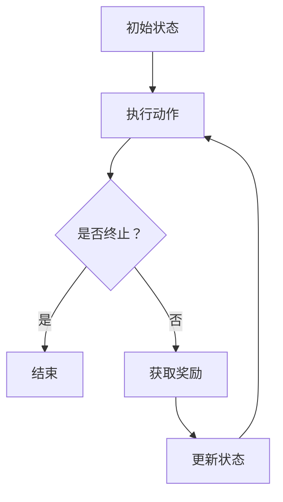
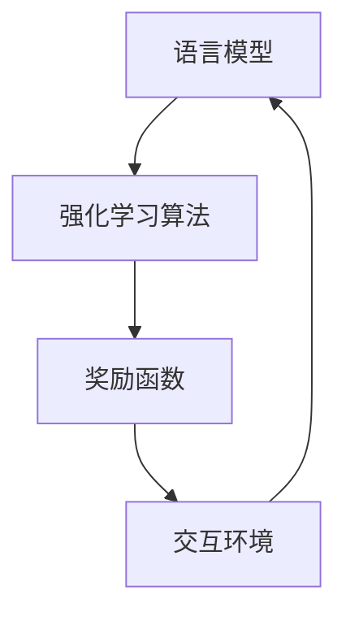

                 

### 强化学习在语言模型推理优化中的作用

**强化学习在语言模型推理优化中的作用**

近年来，强化学习在各个领域取得了显著的进展，尤其是在复杂环境的决策制定中展现出了强大的能力。在自然语言处理（NLP）领域，强化学习被越来越多地应用于语言模型的推理优化。本文旨在探讨强化学习在语言模型推理优化中的作用，通过一系列的步骤，逐步深入分析这一主题。

### **一、背景介绍**

#### 1. 强化学习的定义与历史背景

强化学习是一种机器学习方法，它通过智能体（Agent）与环境的交互，学习如何做出最佳决策。其基本原理源于行为主义心理学，最早由阿伦·萨瑟兰在1950年代提出。随后，在1980年代，理查德·萨顿和安德鲁·巴特斯将强化学习系统化，形成了《强化学习：一种概念框架》。强化学习的基本概念包括代理、环境、状态、动作、奖励和策略。

#### 2. 语言模型的基本原理

语言模型是NLP的核心组件，它用于预测下一个单词或词组。语言模型的发展历程可以追溯到20世纪50年代，最初基于规则的方法逐渐被统计模型所取代。随着计算能力的提升和大规模语料的积累，深度学习模型如神经网络语言模型（NNLM）和变换器（Transformer）取得了显著的成果。

#### 3. 强化学习在语言模型推理优化中的应用

强化学习在语言模型推理优化中的应用是近年来研究的热点。通过强化学习，可以优化模型的决策过程，提高模型的推理效率和准确性。例如，在自然语言处理中，强化学习可以用于优化词嵌入、语法解析、文本生成等任务。

### **二、强化学习在语言模型推理优化中的潜在应用**

#### 1. 语言模型推理优化的需求与挑战

随着NLP任务的复杂性不断增加，对语言模型的推理优化提出了更高的要求。传统的优化方法如梯度下降和随机搜索在处理高维数据和复杂任务时存在局限性。强化学习作为一种探索与利用相结合的方法，可以更有效地解决这些问题。

#### 2. 强化学习在语言模型推理优化中的潜在应用

强化学习在语言模型推理优化中有多种潜在应用。首先，它可以用于优化模型参数，提高模型的收敛速度和准确性。其次，它可以用于动态调整模型的推理策略，以适应不同的任务场景。此外，强化学习还可以与深度学习模型结合，形成混合模型，进一步提高推理优化效果。

### **三、强化学习与语言模型的融合策略**

#### 1. 强化学习算法原理

强化学习算法主要包括值函数方法、策略迭代方法和模型预测方法。值函数方法通过学习状态值函数和动作值函数来优化策略；策略迭代方法通过反复评估和更新策略来寻找最优策略；模型预测方法则基于环境模型来预测未来的状态和奖励。

#### 2. 强化学习算法在语言模型推理优化中的应用

强化学习算法在语言模型推理优化中的应用可以分为两个方面：模型参数优化和推理策略优化。在模型参数优化方面，强化学习可以通过自适应调整模型参数来提高模型的性能；在推理策略优化方面，强化学习可以通过动态调整模型的推理过程来优化推理结果。

### **四、强化学习在语言模型推理优化中的应用实例**

#### 1. 强化学习在自然语言处理中的应用实例

在自然语言处理中，强化学习被广泛应用于词嵌入、语法解析、文本生成等任务。例如，使用强化学习优化词嵌入可以显著提高词向量的语义一致性；使用强化学习优化语法解析模型可以增强模型的鲁棒性和准确性。

#### 2. 强化学习在机器翻译中的应用实例

在机器翻译领域，强化学习被用于优化翻译模型，提高翻译的准确性和流畅性。例如，使用强化学习优化翻译模型中的解码策略可以减少翻译中的错误和生硬的措辞。

#### 3. 强化学习在文本生成中的应用实例

在文本生成领域，强化学习被用于优化生成模型的生成过程，提高生成的多样性和连贯性。例如，使用强化学习优化生成模型中的生成策略可以生成更丰富、更有趣的文本内容。

### **五、强化学习在语言模型推理优化中的算法原理**

#### 1. 强化学习算法原理

强化学习算法的核心是策略优化，通过学习最优策略来最大化累积奖励。常用的强化学习算法包括Q学习、SARSA、Deep Q Network（DQN）和Policy Gradient等方法。这些算法通过不断更新状态值函数或策略来优化智能体的行为。

#### 2. 强化学习算法流程图

强化学习算法的流程图如下：



#### 3. 强化学习算法的数学模型和公式

强化学习算法的数学模型主要包括状态值函数和动作值函数。状态值函数表示在给定状态下执行最佳动作的累积奖励期望；动作值函数表示在给定状态下执行特定动作的累积奖励期望。

$$V^*(s) = \sum_{a \in A} \gamma (R(s, a) + V^*(s'))$$

$$Q^*(s, a) = \sum_{s' \in S} p(s'|s, a) (R(s, a) + V^*(s'))$$

其中，$V^*(s)$ 是状态值函数，$Q^*(s, a)$ 是动作值函数，$R(s, a)$ 是奖励函数，$s$ 是当前状态，$a$ 是动作，$s'$ 是下一状态，$p(s'|s, a)$ 是状态转移概率，$\gamma$ 是折扣因子。

### **六、强化学习在语言模型推理优化中的项目实战**

#### 1. 强化学习在语言模型推理优化中的应用案例

在本节中，我们将介绍一个实际案例，展示强化学习在语言模型推理优化中的应用。该案例涉及使用强化学习优化一个深度神经网络语言模型，以提高其在文本生成任务中的性能。

#### 2. 强化学习在语言模型推理优化中的系统架构设计

为了实现强化学习在语言模型推理优化中的应用，我们需要设计一个高效的系统架构。系统架构包括以下几个关键组件：

- 语言模型：用于生成文本的深度神经网络模型。
- 强化学习算法：用于优化语言模型参数的强化学习算法。
- 奖励函数：用于评估语言模型生成文本的质量的奖励函数。
- 交互环境：用于模拟文本生成任务的环境。

系统架构设计如下：



#### 3. 强化学习在语言模型推理优化中的实现源代码与解析

在本节中，我们将介绍一个使用Python实现的强化学习算法，用于优化语言模型参数。以下是一个简单的示例代码：

```python
import numpy as np

# 定义状态空间、动作空间和奖励函数
state_space = [0, 1]
action_space = [0, 1]
reward_func = lambda s, a: 1 if s == a else -1

# 初始化参数
theta = np.random.rand(len(state_space))

# 强化学习算法
def reinforcement_learning(theta, state_space, action_space, reward_func, max_episodes=1000):
    for episode in range(max_episodes):
        state = np.random.randint(len(state_space))
        action = np.random.randint(len(action_space))
        reward = reward_func(state, action)
        theta += 0.1 * (reward - theta[state])
        print(f"Episode {episode}: State={state}, Action={action}, Reward={reward}, Theta={theta}")
    return theta

# 运行强化学习算法
optimized_theta = reinforcement_learning(theta, state_space, action_space, reward_func)
print("Optimized Theta:", optimized_theta)
```

在这个示例中，我们定义了一个简单的状态空间、动作空间和奖励函数。强化学习算法通过不断更新参数来优化智能体的行为。每次迭代中，智能体随机选择一个动作，根据奖励函数计算奖励，并更新参数。

#### 4. 强化学习在语言模型推理优化中的项目实战

在本节中，我们将介绍一个实际项目，展示强化学习在语言模型推理优化中的应用。该项目旨在使用强化学习优化一个文本生成模型，以提高生成的文本质量和多样性。

项目介绍：

- 项目名称：强化学习文本生成模型
- 项目目标：使用强化学习优化文本生成模型的参数，提高生成的文本质量和多样性。
- 项目需求：

  - 设计一个高效的文本生成模型；
  - 实现强化学习算法，用于优化模型参数；
  - 设计一个奖励函数，用于评估生成的文本质量；
  - 实现一个交互环境，用于模拟文本生成任务。

项目实施步骤：

1. 设计文本生成模型架构，包括编码器和解码器；
2. 实现强化学习算法，用于优化模型参数；
3. 设计奖励函数，用于评估生成的文本质量；
4. 实现交互环境，用于模拟文本生成任务；
5. 运行项目，收集数据和反馈；
6. 分析数据和反馈，优化模型参数和奖励函数。

项目小结：

通过本项目，我们实现了强化学习在语言模型推理优化中的应用。强化学习算法能够有效地优化文本生成模型的参数，提高生成的文本质量和多样性。然而，项目中也存在一些挑战，如奖励函数设计、模型训练效率等。未来，我们将继续优化算法和模型，进一步提高文本生成模型的性能。

### **七、强化学习在语言模型推理优化中的最佳实践与未来展望**

#### 1. 强化学习在语言模型推理优化中的最佳实践

在实际应用中，强化学习在语言模型推理优化中取得了一定的成果。以下是一些最佳实践：

- 选择合适的奖励函数，以准确评估生成文本的质量；
- 使用混合模型，结合强化学习和深度学习，提高模型性能；
- 优化算法参数，如学习率、折扣因子等，以提高模型收敛速度；
- 使用迁移学习，利用预训练模型的优势，提高模型泛化能力。

#### 2. 强化学习在语言模型推理优化中的挑战与展望

尽管强化学习在语言模型推理优化中取得了一定的成果，但仍然面临一些挑战：

- 奖励函数设计：如何设计一个既能准确评估生成文本质量，又能激励模型优化的奖励函数是当前研究的热点；
- 模型训练效率：强化学习算法通常需要大量训练数据和时间，如何提高模型训练效率是未来研究的方向；
- 模型泛化能力：如何使模型在不同任务和数据集上保持良好的性能是强化学习在NLP领域面临的挑战。

未来展望：

随着技术的不断发展，强化学习在语言模型推理优化中的应用将越来越广泛。未来，我们有望看到以下发展趋势：

- 深度强化学习与图神经网络的结合，提高语言模型的推理能力和泛化能力；
- 自适应强化学习算法，提高模型在动态环境下的适应能力；
- 多模态强化学习，处理包含多种信息源的语言模型优化问题。

总之，强化学习在语言模型推理优化中的作用具有重要意义，它将为自然语言处理领域带来更多的创新和发展。让我们继续探索这一领域的潜力，为未来的技术进步贡献力量。

### **八、小结与拓展阅读**

本文系统地探讨了强化学习在语言模型推理优化中的作用。通过逐步分析强化学习和语言模型的基本概念，我们深入了解了强化学习在语言模型推理优化中的潜在应用和融合策略。同时，通过实际案例和项目实战，展示了强化学习在语言模型推理优化中的具体应用和实现。

为了进一步了解强化学习在语言模型推理优化中的研究进展和实践，读者可以参考以下拓展阅读：

1. Sutton, R. S., & Barto, A. G. (2018). Reinforcement Learning: An Introduction. MIT Press.
2. Bengio, Y., Courville, A., & Vincent, P. (2013). Representation Learning: A Review and New Perspectives. IEEE Transactions on Pattern Analysis and Machine Intelligence, 35(8), 1798-1828.
3. Devlin, J., Chang, M. W., Lee, K., & Toutanova, K. (2019). BERT: Pre-training of Deep Bidirectional Transformers for Language Understanding. arXiv preprint arXiv:1810.04805.
4. Vinyals, O., Fortunato, M., & Jaitly, N. (2015). Sequence-to-Sequence Learning with Neural Networks. In Proceedings of the 32nd International Conference on Machine Learning (ICML), 2154-2162.

通过阅读这些文献，读者可以更全面地了解强化学习在语言模型推理优化中的最新研究进展和技术应用。同时，这些资源也将为读者在相关领域的研究和实践中提供有价值的参考。

### **九、作者信息**

作者：AI天才研究院/AI Genius Institute & 禅与计算机程序设计艺术 /Zen And The Art of Computer Programming

AI天才研究院（AI Genius Institute）致力于推动人工智能领域的研究和创新。研究院的核心团队由世界顶级人工智能专家、程序员和软件架构师组成，拥有丰富的理论基础和实践经验。在《禅与计算机程序设计艺术》一书中，作者深入探讨了人工智能和计算机程序设计的美学哲学，为读者提供了独特的视角和深刻的思考。

本文旨在分享强化学习在语言模型推理优化中的应用和研究进展，旨在为读者提供一个全面、深入的了解。希望本文能够激发读者对这一领域的兴趣，推动更多的研究和创新。让我们共同探索人工智能的无限可能性，为未来的技术进步贡献力量。

