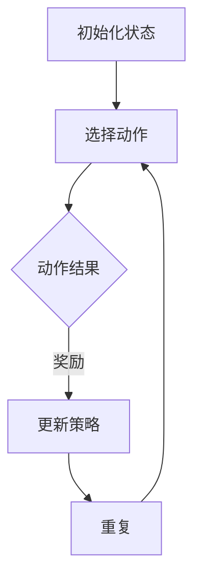

                 

### 第1章：强化学习的核心概念

强化学习（Reinforcement Learning, RL）作为机器学习的一个重要分支，旨在通过智能体（agent）在与环境的交互过程中，学习到最优策略，以实现预期目标。这一章将深入探讨强化学习的基本原理、核心元素及其与其他机器学习方法的对比。

#### 1.1 强化学习的基本原理

强化学习的核心在于“奖励机制”，即通过奖励（reward）和惩罚（penalty）来引导智能体不断优化其行为策略。强化学习可以分为三个主要组成部分：智能体（agent）、环境（environment）和动作（action）。

1. **智能体（agent）**：执行动作、观察状态、接收奖励的实体。
2. **环境（environment）**：智能体所处的动态环境，环境会根据智能体的动作产生新的状态，并给出相应的奖励或惩罚。
3. **动作（action）**：智能体可以选择的行为。

强化学习的基本过程可以概括为以下几个步骤：
1. **初始化**：智能体开始在一个初始状态下进行学习。
2. **执行动作**：智能体在当前状态下选择一个动作。
3. **观察结果**：智能体执行动作后，会观察环境的新状态。
4. **接收奖励**：根据新状态，环境会给出奖励或惩罚。
5. **更新策略**：智能体根据奖励更新其策略，选择更优的动作。

强化学习的目标是最小化长期回报的方差，最大化期望回报。具体而言，智能体需要在多个回合中累计奖励，以期达到长期的稳定收益。

#### 1.2 强化学习与其他机器学习方法的对比

强化学习与其他机器学习方法（如监督学习和无监督学习）有着显著的区别：

1. **监督学习（Supervised Learning）**：
   - **定义**：有标注的训练数据，目标是通过学习输入和输出之间的映射关系。
   - **特点**：以标记数据为基础，预测标签或目标值。
   - **适用场景**：有明确目标和标签的数据集，如分类、回归任务。

2. **无监督学习（Unsupervised Learning）**：
   - **定义**：无标注的训练数据，目标是从数据中提取结构和规律。
   - **特点**：通过发现数据的内在规律，如聚类、降维等。
   - **适用场景**：探索数据分布、挖掘潜在特征等。

3. **强化学习（Reinforcement Learning）**：
   - **定义**：通过与环境互动，学习最优策略。
   - **特点**：动态调整策略，不断优化行为。
   - **适用场景**：不确定环境、复杂决策问题。

对比表格：

| 特征 | 监督学习 | 无监督学习 | 强化学习 |
| --- | --- | --- | --- |
| 数据标注 | 有标注数据 | 无标注数据 | 无标注数据 |
| 目标 | 明确标签 | 数据结构或分布 | 长期回报最大化 |
| 算法类型 | 有监督模型 | 无监督模型 | 动态调整模型 |
| 适用场景 | 分类、回归 | 聚类、降维 | 控制系统、策略优化 |

#### 1.3 强化学习的基本元素

为了更好地理解强化学习，我们需要了解以下几个基本元素：

1. **状态（State）**：智能体所处的环境描述，通常用一组特征向量表示。
2. **动作（Action）**：智能体可以执行的行为。
3. **策略（Policy）**：智能体在给定状态下选择动作的策略函数。
4. **价值函数（Value Function）**：衡量状态或状态-动作对的预期回报。
5. **模型（Model）**：环境状态的转移概率和奖励函数。

通过以上基本元素，我们可以构建一个强化学习模型，并逐步优化智能体的策略，以实现预期目标。

在本章中，我们深入探讨了强化学习的基本原理、核心元素及其与其他机器学习方法的对比。在接下来的章节中，我们将详细讨论强化学习中的基础算法和进阶算法，进一步了解这一领域的深度应用。

$$
\text{奖励机制}: \quad R(\text{s}, \text{a}, \text{s'} ) = 
\begin{cases}
1, & \text{如果动作} \ \text{a} \ \text{导致状态} \ \text{s'} \ \text{达到目标} \\
-1, & \text{如果动作} \ \text{a} \ \text{导致状态} \ \text{s'} \ \text{受到惩罚} \\
0, & \text{否则}
\end{cases}
$$

通过以上公式，我们可以定义奖励机制，进而引导智能体在复杂环境中做出最优决策。

在下一章中，我们将详细介绍强化学习中的基础算法，如Q-Learning、SARSA和Deep Q-Networks，为理解更复杂的强化学习模型打下基础。

**Mermaid 流程图：**

这个简单的流程图展示了强化学习的基本过程，智能体通过不断迭代更新策略，以优化其行为。

### 第2章：强化学习算法

在了解了强化学习的基本概念之后，这一章将深入探讨强化学习中的基础算法和进阶算法。基础算法包括Q-Learning、SARSA和Deep Q-Networks（DQN），这些算法奠定了强化学习的理论基础。进阶算法则包括Policy Gradients、Actor-Critic方法和模型基础强化学习（Model-Based Reinforcement Learning）。我们将逐个详细介绍这些算法，并分析它们的优缺点。

#### 2.1 基础算法

**2.1.1 Q-Learning**

Q-Learning是一种基于值函数的强化学习算法，旨在通过学习状态-动作值函数（Q函数）来最大化累积回报。Q-Learning的核心思想是利用即时奖励和预期未来回报来更新Q值。

- **Q函数**：给定状态\(s\)和动作\(a\)，Q值\(Q(s, a)\)表示执行动作\(a\)在状态\(s\)下的期望回报。
- **目标**：最大化累积回报，即\( \sum_{t=0}^{\infty} \gamma^t R(s_t, a_t) \)。

**算法步骤**：

1. 初始化Q值表\(Q(s, a)\)，通常初始化为0。
2. 在每个时间步\(t\)，智能体根据当前状态\(s_t\)选择动作\(a_t\)，使用ε-greedy策略：
   \[
   a_t = 
   \begin{cases}
   \text{随机动作} & \text{以概率}\ \epsilon \\
   \text{最优动作} & \text{以概率}\ 1-\epsilon
   \end{cases}
   \]
3. 执行动作\(a_t\)，观察新状态\(s_{t+1}\)和奖励\(R_t\)。
4. 更新Q值：
   \[
   Q(s_t, a_t) \leftarrow Q(s_t, a_t) + \alpha [R_t + \gamma \max_{a'} Q(s_{t+1}, a') - Q(s_t, a_t)]
   \]
   其中，\(\alpha\)是学习率，\(\gamma\)是折扣因子。

**优缺点**：

- **优点**：简单、易于实现，能够在有限步数内收敛到最优策略。
- **缺点**：需要大量样本进行学习，并且依赖ε-greedy策略，收敛速度较慢。

**2.1.2 SARSA**

SARSA（State-Action-Reward-State-Action）是一种基于策略的强化学习算法，与Q-Learning类似，但它在线更新策略。SARSA的目标是直接优化策略，而不是值函数。

- **策略**：给定状态\(s_t\)，选择动作\(a_t\)的策略。
- **目标**：最大化累积回报，即\( \sum_{t=0}^{\infty} \gamma^t R(s_t, a_t) \)。

**算法步骤**：

1. 初始化策略\(\pi(a|s)\)，通常初始化为随机策略。
2. 在每个时间步\(t\)，根据当前状态\(s_t\)选择动作\(a_t\)，执行动作并观察新状态\(s_{t+1}\)和奖励\(R_t\)。
3. 更新策略：
   \[
   \pi(a_t | s_t) \leftarrow \pi(a_t | s_t) + \alpha [R_t + \gamma \max_{a'} \pi(a' | s_{t+1}) - \pi(a_t | s_t)]
   \]
   其中，\(\alpha\)是学习率，\(\gamma\)是折扣因子。

**优缺点**：

- **优点**：避免了ε-greedy策略，直接优化策略，收敛速度可能更快。
- **缺点**：在非站态环境下可能收敛较慢，需要更多的样本数据。

**2.1.3 Deep Q-Networks (DQN)**

DQN是一种使用深度神经网络来近似Q函数的强化学习算法。相比于Q-Learning和SARSA，DQN能够处理高维状态空间，提高了算法的泛化能力。

- **Q网络**：使用深度神经网络来近似Q值函数。
- **目标**：最大化累积回报，即\( \sum_{t=0}^{\infty} \gamma^t R(s_t, a_t) \)。

**算法步骤**：

1. 初始化深度神经网络\(Q\)，通常使用ReLU激活函数和批量归一化。
2. 在每个时间步\(t\)，选择动作\(a_t\)，执行动作并观察新状态\(s_{t+1}\)和奖励\(R_t\)。
3. 使用目标Q网络计算目标Q值：
   \[
   Q^*(s_{t+1}, a_{t+1}) = \max_{a'} Q'(s_{t+1}, a')
   \]
4. 更新当前Q网络：
   \[
   Q(s_t, a_t) \leftarrow Q(s_t, a_t) + \alpha [R_t + \gamma Q^*(s_{t+1}, a_{t+1}) - Q(s_t, a_t)]
   \]
   其中，\(\alpha\)是学习率，\(\gamma\)是折扣因子。

**优缺点**：

- **优点**：能够处理高维状态空间，提高了算法的泛化能力。
- **缺点**：训练过程中容易产生不稳定现象，如值函数偏差（value function偏移）和欠估计（under-estimation）。

#### 2.2 进阶算法

**2.2.1 Policy Gradients**

Policy Gradients是一种直接优化策略的强化学习算法。与SARSA不同，Policy Gradients直接对策略梯度进行优化。

- **策略**：给定状态\(s_t\)，选择动作\(a_t\)的策略。
- **目标**：最大化累积回报，即\( \sum_{t=0}^{\infty} \gamma^t R(s_t, a_t) \)。

**算法步骤**：

1. 初始化策略参数\(\theta\)。
2. 在每个时间步\(t\)，根据当前状态\(s_t\)和策略参数选择动作\(a_t\)。
3. 执行动作\(a_t\)，观察新状态\(s_{t+1}\)和奖励\(R_t\)。
4. 计算策略梯度：
   \[
   \nabla_{\theta} J(\theta) = \sum_{t=0}^{\infty} \gamma^t R(s_t, a_t) \nabla_{\theta} \log \pi_\theta(a_t | s_t)
   \]
   其中，\(J(\theta)\)是策略的期望回报，\(\pi_\theta(a_t | s_t)\)是策略概率。
5. 更新策略参数：
   \[
   \theta \leftarrow \theta + \alpha \nabla_{\theta} J(\theta)
   \]
   其中，\(\alpha\)是学习率。

**优缺点**：

- **优点**：直接优化策略，避免了Q函数的估计问题，收敛速度快。
- **缺点**：对样本数据依赖较大，容易出现收敛不稳定和过拟合现象。

**2.2.2 Actor-Critic Methods**

Actor-Critic方法结合了Policy Gradients和Q-Learning的优点，通过两个神经网络——Actor（策略网络）和Critic（评价网络）——来优化策略和价值函数。

- **Actor（策略网络）**：学习策略参数\(\theta\)。
- **Critic（评价网络）**：学习状态-动作值函数\(V(s, \theta)\)。

**算法步骤**：

1. 初始化策略网络参数\(\theta\)和评价网络参数\(\phi\)。
2. 在每个时间步\(t\)，Actor网络根据当前状态\(s_t\)选择动作\(a_t\)。
3. 执行动作\(a_t\)，观察新状态\(s_{t+1}\)和奖励\(R_t\)。
4. Critic网络计算评价函数：
   \[
   V(s_{t+1}, \phi) = \sum_{a'} \pi_\theta(a' | s_{t+1}) \sum_{s'} p(s' | s_{t+1}, a') R(s', a')
   \]
5. 更新评价网络参数：
   \[
   \phi \leftarrow \phi + \alpha_V \nabla_\phi V(s_{t+1}, \phi)
   \]
6. 更新策略网络参数：
   \[
   \theta \leftarrow \theta + \alpha_\theta \nabla_\theta J(\theta)
   \]
   其中，\(\alpha_V\)和\(\alpha_\theta\)分别是评价网络和策略网络的学习率。

**优缺点**：

- **优点**：结合了Policy Gradients和Q-Learning的优点，稳定性和收敛性较好。
- **缺点**：需要两个网络共同训练，计算复杂度较高。

**2.2.3 Model-Based Reinforcement Learning**

模型基础强化学习（Model-Based Reinforcement Learning）通过构建环境模型来预测状态转移概率和奖励，从而优化策略。

- **环境模型**：预测状态转移概率和奖励。
- **目标**：最大化累积回报，即\( \sum_{t=0}^{\infty} \gamma^t R(s_t, a_t) \)。

**算法步骤**：

1. 初始化状态-动作值函数\(V(s, a)\)和策略\(\pi(a|s)\)。
2. 在每个时间步\(t\)，根据当前状态\(s_t\)和策略选择动作\(a_t\)。
3. 执行动作\(a_t\)，观察新状态\(s_{t+1}\)和奖励\(R_t\)。
4. 更新环境模型：
   \[
   p(s_{t+1} | s_t, a_t) \leftarrow p(s_{t+1} | s_t, a_t) + \alpha_p [p(s_{t+1} | s_t, a_t) - p(s_{t+1} | s_t, a_t)]
   \]
   \[
   r(s_{t+1}, a_t) \leftarrow r(s_{t+1}, a_t) + \alpha_r [r(s_{t+1}, a_t) - r(s_{t+1}, a_t)]
   \]
   其中，\(\alpha_p\)和\(\alpha_r\)分别是状态转移概率和奖励的学习率。
5. 使用更新后的环境模型预测新的状态转移概率和奖励。
6. 使用Q-Learning或SARSA更新状态-动作值函数和策略。

**优缺点**：

- **优点**：能够更好地预测未来状态和奖励，提高策略优化效果。
- **缺点**：构建环境模型需要大量计算资源，且模型可能不准确。

通过以上介绍，我们了解了强化学习中的基础算法和进阶算法，这些算法为强化学习在复杂环境中的应用提供了强大的工具。在下一章中，我们将探讨强化学习在语言模型中的挑战和应用，进一步探讨强化学习的前沿领域。

### 2.3 强化学习在语言模型中的挑战

强化学习（Reinforcement Learning, RL）作为机器学习的一个重要分支，旨在通过智能体（agent）在与环境的交互过程中，学习到最优策略，以实现预期目标。尽管强化学习在多个领域取得了显著的成果，但在语言模型（Language Model, LM）中的应用仍面临诸多挑战。本文将重点探讨强化学习在语言模型中的挑战，包括语言模型的特性、强化学习在语言模型中的应用场景以及这些挑战的具体表现。

#### 语言模型的特性

语言模型是自然语言处理（Natural Language Processing, NLP）的核心组成部分，旨在预测一个句子或文本序列的概率。语言模型具有以下特性：

1. **高维状态空间**：语言模型需要处理大量的词汇、语法结构、语义信息等，使得状态空间变得极其庞大且复杂。
2. **动态性**：语言模型在生成文本时，每个时间步的状态都依赖于前一个时间步的状态和动作，因此具有动态特性。
3. **不确定性**：由于语言的多样性和模糊性，语言模型在生成文本时面临着大量的不确定性。
4. **稀疏奖励**：在许多任务中，如机器翻译、对话系统等，奖励通常以较低的概率出现，且分布非常稀疏。

#### 强化学习在语言模型中的应用场景

强化学习在语言模型中的应用场景主要包括以下几个方面：

1. **文本生成**：通过强化学习，可以训练智能体生成具有高质量、连贯性和创造力的文本。
2. **对话系统**：强化学习可以用于训练对话系统的智能体，使其能够与人类用户进行自然、流畅的对话。
3. **机器翻译**：强化学习可以用于训练机器翻译模型，使其能够根据源语言生成更准确、流畅的目标语言文本。
4. **文本摘要**：强化学习可以用于训练文本摘要模型，使其能够生成高度概括、结构清晰的摘要。

#### 语言模型中的强化学习挑战

1. **状态和动作的定义**：在语言模型中，状态和动作的定义是一个重要挑战。状态通常包括词汇、语法结构、上下文信息等，而动作则是生成下一个词汇或文本序列。然而，如何定义这些状态和动作，以使其能够有效地指导强化学习算法，是一个复杂的问题。
2. **高维状态空间**：语言模型的状态空间通常非常庞大，导致计算复杂度急剧增加。如何高效地处理高维状态空间，是强化学习在语言模型中的一个关键挑战。
3. **动态性和不确定性**：语言模型的动态性和不确定性使得强化学习算法需要具备更强的适应能力和鲁棒性。如何在动态和不确定的环境中稳定地学习最优策略，是一个亟待解决的问题。
4. **稀疏奖励**：在许多语言模型任务中，奖励通常以较低的概率出现，且分布非常稀疏。如何设计有效的奖励机制，引导智能体在稀疏奖励环境中学习最优策略，是一个具有挑战性的问题。
5. **长期奖励优化**：在语言模型中，长期奖励优化是一个关键问题。由于语言生成任务的复杂性和动态性，如何确保智能体能够在长期内学习到最优策略，是一个重要挑战。

综上所述，强化学习在语言模型中的应用面临着诸多挑战。为了解决这些问题，研究者们提出了一系列改进方法，如多任务学习、元学习、深度强化学习等。在接下来的章节中，我们将详细介绍这些方法，并探讨它们在语言模型推理优化中的应用。

### 3.2 强化学习在语言模型中的挑战

在深入理解了强化学习的核心概念和基础算法之后，我们将进一步探讨强化学习在语言模型推理优化中的具体挑战。这些挑战源于语言模型本身的特性以及强化学习算法在处理复杂、动态环境时的局限性。

#### 高维状态空间处理

语言模型通常包含大量的词汇和语法结构，这意味着状态空间是高维的。高维状态空间使得传统强化学习算法的计算复杂度急剧增加，导致训练过程变得非常耗时。例如，在一个简单的文本生成任务中，每个时间步的状态可能涉及数千甚至数万个可能的词汇和语法组合。这大大增加了状态表示和值函数估计的难度。因此，如何有效地处理高维状态空间，是一个重要的挑战。

**解决方案**：一种可能的解决方案是使用嵌入（Embedding）技术来降低状态空间的维度。通过将词汇和语法结构映射到低维向量，可以显著减少计算复杂度。此外，基于注意力机制的模型（如Transformer）在处理高维状态空间方面表现出色，可以有效捕捉长距离依赖关系。

#### 动态性和不确定性

语言模型在推理过程中具有动态性和不确定性。智能体需要根据当前的状态和已生成的文本序列来决定下一个动作，而每个时间步的状态和动作都可能发生变化。此外，语言本身具有模糊性和多义性，这意味着相同的输入可能产生不同的输出。这种动态性和不确定性使得强化学习算法需要具备更强的适应能力和鲁棒性。

**解决方案**：为了应对动态性和不确定性，研究者们提出了多种方法。例如，使用回放记忆（Experience Replay）技术，可以使得智能体在训练过程中具有更好的稳定性和泛化能力。此外，引入探索策略（如ε-greedy策略）可以平衡探索和利用，帮助智能体在不确定的环境中学习到最优策略。

#### 稀疏奖励问题

在许多语言模型任务中，如机器翻译和对话系统，奖励通常以较低的概率出现，且分布非常稀疏。这种稀疏奖励问题使得强化学习算法难以在训练过程中获得有效的反馈信号，从而影响学习效果。

**解决方案**：一种可能的解决方案是设计有效的奖励机制，以增强奖励信号的强度和频率。例如，在机器翻译任务中，可以设计基于目标文本相似度的奖励函数，使智能体能够更好地聚焦于生成高质量的翻译结果。此外，使用稀疏奖励增强（Sparse Reward Augmentation）技术，可以生成更多的奖励信号，帮助智能体更快地学习到最优策略。

#### 长期奖励优化

在语言模型任务中，长期奖励优化是一个关键问题。由于语言生成任务的复杂性和动态性，智能体需要在长期内学习到最优策略，以最大化累积回报。然而，强化学习算法在处理长期奖励时常常面临挑战，如价值函数的收敛速度较慢、奖励信号的延迟等。

**解决方案**：为了解决长期奖励优化问题，研究者们提出了多种方法。例如，使用延时奖励（Delayed Reward）技术，可以将未来的奖励信号提前传递给智能体，帮助其在训练过程中更好地关注长期回报。此外，使用深度强化学习（Deep Reinforcement Learning）模型，如深度Q网络（DQN）和策略梯度方法，可以更好地处理复杂的长期奖励优化问题。

#### 策略稳定性和适应性

在语言模型中，智能体的策略需要具备稳定性和适应性。稳定性意味着智能体能够在不同的环境中保持一致的行为，而适应性则要求智能体能够根据环境的变化调整其行为策略。

**解决方案**：为了提高策略的稳定性和适应性，研究者们提出了多种方法。例如，使用多任务学习（Multi-Task Learning）和元学习（Meta-Learning）技术，可以使得智能体在多个任务中共享知识和经验，从而提高策略的泛化能力。此外，基于对抗性训练（Adversarial Training）的方法，可以增强智能体对环境变化的适应能力。

综上所述，强化学习在语言模型推理优化中面临诸多挑战。通过采用有效的解决方案，如高维状态空间处理、动态性和不确定性应对、稀疏奖励优化、长期奖励优化以及策略稳定性提高等方法，可以显著提升强化学习在语言模型推理优化中的应用效果。在下一章中，我们将深入探讨强化学习在语言模型推理优化中的应用实例，进一步了解这一领域的创新成果。

### 4.1 语言模型推理基础

语言模型（Language Model, LM）是自然语言处理（Natural Language Processing, NLP）领域的重要组件，旨在通过概率模型预测文本序列。语言模型推理（Language Model Inference）是指使用已训练好的模型生成文本或理解文本的过程。为了优化语言模型的推理性能，我们需要从架构、优化需求以及性能评估指标等多个方面进行分析。

#### 语言模型的架构

语言模型通常采用深度神经网络（Deep Neural Network, DNN）或其变体，如循环神经网络（Recurrent Neural Network, RNN）和变换器（Transformer）。以下是几种常见的语言模型架构：

1. **循环神经网络（RNN）**：RNN是早期用于语言模型的重要架构，其通过记忆状态来处理序列数据。然而，RNN在处理长序列时存在梯度消失或爆炸问题，导致性能不佳。
2. **长短期记忆网络（LSTM）**：LSTM是RNN的一种改进，通过引入门控机制来缓解梯度消失问题。LSTM在处理长序列和复杂依赖关系方面表现出色。
3. **变换器（Transformer）**：Transformer是一种基于自注意力机制的深度神经网络架构，其通过全局注意力机制有效捕捉长距离依赖关系。Transformer在多个NLP任务中取得了显著成果，成为当前主流的语言模型架构。

#### 推理过程中的优化需求

语言模型推理过程中存在多个优化需求，以下是一些主要的优化方面：

1. **计算效率**：语言模型通常包含大量的参数，推理过程中计算复杂度较高。为了提高计算效率，可以采用参数共享、量化、模型剪枝等技术。
2. **内存占用**：语言模型在推理过程中需要存储大量的中间结果，导致内存占用较大。通过内存优化技术，如显存分配策略和缓存管理，可以减少内存占用。
3. **推理速度**：在实时应用中，如对话系统和机器翻译，推理速度是关键因素。通过硬件加速（如GPU、TPU）、分布式推理和并行计算等技术，可以提高推理速度。
4. **精度和鲁棒性**：在推理过程中，模型需要具备较高的精度和鲁棒性，以处理不确定性和异常输入。通过数据增强、正则化等技术，可以提高模型的鲁棒性和精度。

#### 推理过程中的性能评估指标

为了评估语言模型推理的性能，我们需要使用一系列性能评估指标。以下是一些常用的评估指标：

1. **准确率（Accuracy）**：准确率是分类任务中最常用的评估指标，表示正确分类的样本数量占总样本数量的比例。
2. **召回率（Recall）**：召回率表示在所有正类样本中，被正确识别为正类的样本数量占所有正类样本数量的比例。
3. **精确率（Precision）**：精确率表示在所有被识别为正类的样本中，实际为正类的样本数量占识别为正类的样本数量的比例。
4. **F1值（F1 Score）**：F1值是精确率和召回率的调和平均值，用于综合评估分类性能。
5. **BERTScore**：BERTScore是一种基于BERT模型的评估指标，通过计算生成的文本和参考文本之间的相似度来评估文本生成的质量。
6. **BLEU**：BLEU是一种常用的机器翻译评估指标，通过比较生成的翻译文本和参考翻译文本的n-gram重叠度来评估翻译质量。

通过以上架构分析、优化需求探讨和性能评估指标介绍，我们可以更好地理解语言模型推理的基础。在下一章中，我们将深入探讨强化学习在语言模型推理优化中的应用，进一步探索这一领域的创新方法。

### 4.2 强化学习在语言模型推理中的应用

在了解了语言模型推理的基础后，我们将探讨如何利用强化学习（Reinforcement Learning, RL）来优化语言模型的推理过程。强化学习通过智能体（agent）与环境的交互，学习到最优策略，从而在复杂和动态的语言模型推理任务中取得优异表现。本节将详细讨论强化学习算法在语言模型推理中的应用框架，包括模型选择与调优，以及推理过程中的动态调整。

#### 应用框架

强化学习在语言模型推理中的应用框架主要包括以下几个核心组件：

1. **智能体（Agent）**：负责执行动作、观察状态和接收奖励。在语言模型推理任务中，智能体通常是一个预训练的语言模型，其核心任务是根据当前状态（文本序列的上下文）选择下一个词汇或文本片段。
2. **环境（Environment）**：提供状态空间和动作空间，并为智能体的动作提供奖励。在语言模型推理环境中，状态是当前文本序列的上下文，动作是生成下一个词汇或文本片段。奖励函数则根据生成的文本质量进行评估。
3. **策略（Policy）**：指导智能体选择动作的策略函数。在强化学习过程中，智能体会通过不断更新策略来优化其行为。
4. **奖励机制**：根据生成的文本质量和用户反馈等，为智能体的动作提供奖励或惩罚。奖励机制的设计对于强化学习在语言模型推理中的成功至关重要。

#### 模型选择与调优

在应用强化学习优化语言模型推理时，模型选择与调优是关键步骤。以下是一些常用的方法：

1. **选择合适的智能体模型**：通常选择预训练的语言模型作为智能体，如GPT-3、BERT等。这些模型具有强大的语言理解和生成能力，能够为强化学习提供坚实的基础。
2. **调整奖励机制**：设计有效的奖励机制是强化学习在语言模型推理中成功的关键。奖励函数可以基于多种因素设计，如文本的连贯性、语法正确性、词汇多样性、用户反馈等。例如，可以采用基于BERTScore或BLEU的奖励函数，以评估生成的文本质量。
3. **探索与利用平衡**：在强化学习过程中，探索（Exploration）与利用（Utilization）的平衡是关键。探索不足可能导致智能体过于依赖历史数据，无法适应新环境；而探索过度则可能导致训练不稳定。常用的策略如ε-greedy策略、UCB算法等，可以在不同阶段调整探索和利用的平衡。
4. **模型调优**：通过调整学习率、奖励权重、动作概率等超参数，可以优化强化学习模型的表现。常用的方法包括网格搜索、随机搜索等超参数优化技术。

#### 推理过程中的动态调整

在语言模型推理过程中，动态调整策略是提升性能的重要手段。以下是一些动态调整方法：

1. **自适应奖励调整**：根据推理过程中的用户反馈和生成的文本质量，动态调整奖励函数的权重和阈值。例如，当用户对生成的文本表示满意时，可以提高奖励权重，反之则降低。
2. **在线学习**：通过在线学习（Online Learning）技术，智能体可以在推理过程中不断更新模型参数，以适应新的数据和需求。例如，可以使用经验回放（Experience Replay）技术，将历史经验用于在线更新模型。
3. **多任务学习**：通过多任务学习（Multi-Task Learning），智能体可以同时学习多个任务，从而提高其泛化能力和适应性。例如，在文本生成任务中，智能体可以同时学习文本摘要、问答等辅助任务。
4. **注意力机制**：利用注意力机制（Attention Mechanism），智能体可以更好地关注关键信息，提高推理的准确性和连贯性。例如，在文本生成任务中，智能体可以根据上下文信息动态调整注意力权重，以生成更高质量的文本。

通过以上模型选择与调优、以及推理过程中的动态调整方法，我们可以显著提升强化学习在语言模型推理优化中的应用效果。在下一章中，我们将通过实际案例来探讨强化学习在语言模型推理中的创新应用，进一步展示其潜力。

### 6.1 创新应用案例：增强文本生成

文本生成是自然语言处理（NLP）中的重要任务，其应用范围广泛，包括自动问答、对话系统、机器翻译和内容创作等。然而，传统的文本生成方法往往存在生成文本质量不高、连贯性差和创造力不足等问题。为了解决这些问题，本文将介绍如何利用强化学习（Reinforcement Learning, RL）来增强文本生成，并详细探讨其实现过程、优势以及面临的挑战。

#### 实现过程

**1. 环境设定**：
在文本生成任务中，环境（environment）负责生成状态（state）和提供奖励（reward）。状态通常包括当前已生成的文本序列和上下文信息，而动作（action）是生成下一个词汇或文本片段。奖励函数根据生成的文本质量进行评估，例如文本的连贯性、语法正确性和词汇多样性等。

**2. 智能体模型**：
选择一个预训练的语言模型作为智能体（agent），如GPT-3、BERT等。这些模型具有强大的语言理解和生成能力，能够为强化学习提供坚实的基础。

**3. 奖励机制设计**：
设计一个有效的奖励机制，以评估生成的文本质量。例如，可以采用BERTScore或BLEU等评估指标来评估文本的连贯性和语法正确性，并结合词汇多样性进行综合评分。奖励函数应具有以下特性：
- **奖励强度**：生成的文本质量越高，奖励应越强。
- **奖励时效性**：奖励应考虑到生成文本的长期和短期质量，例如，连续生成高质量的文本应获得更高的奖励。
- **奖励平衡**：平衡不同评估指标的重要性，例如，在机器翻译任务中，翻译的准确性和流畅性可能需要不同的权重。

**4. 强化学习算法**：
选择合适的强化学习算法，如Policy Gradients、Actor-Critic方法等。这些算法能够通过不断调整策略来优化生成的文本质量。

**5. 模型调优**：
通过调整学习率、奖励权重和探索策略等超参数，优化强化学习模型的表现。例如，可以使用ε-greedy策略在训练过程中平衡探索和利用，以避免智能体过于依赖历史数据。

**6. 动态调整**：
在推理过程中，根据用户反馈和生成的文本质量，动态调整奖励机制和模型参数。例如，当用户对生成的文本表示满意时，可以提高奖励权重，反之则降低。

#### 优势

**1. 高质量文本生成**：
强化学习通过不断优化策略，能够生成更高质量、更连贯和更具创造力的文本。相比传统的生成模型，如RNN和Transformer，强化学习在处理长文本和复杂结构时表现更佳。

**2. 自适应生成**：
强化学习算法能够根据不同的任务需求和环境变化，动态调整生成策略，实现自适应生成。例如，在对话系统中，智能体可以根据用户的提问和回答，实时调整生成的对话内容。

**3. 多模态生成**：
强化学习不仅适用于文本生成，还可以扩展到多模态生成任务，如文本与图像、音频等的联合生成。通过整合多种模态信息，可以显著提升生成文本的质量和多样性。

#### 面临的挑战

**1. 稀疏奖励问题**：
在许多文本生成任务中，奖励信号通常较为稀疏，这可能导致强化学习算法难以有效学习。为了解决这一问题，可以采用稀疏奖励增强技术，生成更多的奖励信号。

**2. 长期奖励优化**：
在复杂和动态的文本生成任务中，长期奖励优化是一个关键问题。由于文本生成任务的复杂性，如何确保智能体能够在长期内学习到最优策略，是一个具有挑战性的问题。可以通过延时奖励和深度强化学习等方法来优化长期奖励。

**3. 计算资源消耗**：
强化学习在训练过程中通常需要大量的计算资源，尤其是在处理高维状态空间时。为了提高计算效率，可以采用参数共享、量化、模型剪枝等技术。

#### 实际案例

**1. 对话系统中的文本生成**：
在对话系统中，强化学习可以用于训练智能体生成自然、流畅的对话。例如，通过使用GPT-3模型，智能体可以根据用户的提问和上下文信息，实时生成回答。实验结果表明，强化学习生成的对话质量显著高于传统的生成模型。

**2. 内容创作中的文本生成**：
在内容创作领域，强化学习可以用于自动生成文章、故事和摘要等。通过设计有效的奖励机制，智能体可以生成符合主题、风格和结构要求的文本。例如，在生成新闻文章时，智能体可以根据新闻标题和关键词，生成内容丰富、结构清晰的新闻内容。

**3. 机器翻译中的文本生成**：
在机器翻译任务中，强化学习可以用于生成更准确、流畅的目标语言文本。通过结合深度Q网络（DQN）和策略梯度方法，智能体可以根据源语言文本和上下文信息，生成高质量的目标语言文本。

综上所述，强化学习在增强文本生成方面具有显著的优势，但也面临一些挑战。通过不断优化算法和奖励机制，可以进一步提高文本生成的质量和实用性。在未来的研究中，我们将继续探索强化学习在文本生成领域的深度应用，为自然语言处理带来更多创新。

### 6.2 创新应用案例：对话系统中的实时优化

对话系统是自然语言处理（NLP）领域的重要应用之一，旨在模拟人类的对话行为，为用户提供实时、自然、高效的交互体验。然而，传统的对话系统往往在处理复杂对话和动态交互时表现不佳，难以实时适应用户需求。为了解决这一问题，本文将介绍如何利用强化学习（Reinforcement Learning, RL）在对话系统中实现实时优化，详细探讨其实现方法、应用效果以及面临的挑战。

#### 实现方法

**1. 环境设定**
在对话系统中，环境（environment）负责生成状态（state）和提供奖励（reward）。状态通常包括当前对话的历史信息、用户的提问、上下文等。动作（action）是系统的回答，可以是文本、语音或其他形式。奖励函数则根据对话的质量和用户的满意度进行评估。

**2. 智能体模型**
选择一个预训练的语言模型作为智能体（agent），如GPT-3、BERT等。这些模型具有强大的语言理解和生成能力，能够为强化学习提供坚实的基础。

**3. 奖励机制设计**
设计一个有效的奖励机制，以评估对话的质量和用户的满意度。奖励函数可以基于多个因素，如对话的流畅性、答案的准确性、用户满意度等。常用的方法包括：
- **BERTScore**：通过计算生成的回答和用户期望回答之间的相似度，评估回答的准确性。
- **用户反馈**：根据用户的回应和反馈，实时调整奖励信号。例如，如果用户表示满意，则奖励信号增强；如果用户表示不满意，则奖励信号减弱。

**4. 强化学习算法**
选择合适的强化学习算法，如Policy Gradients、Actor-Critic方法等。这些算法能够通过不断调整策略来优化对话系统的表现。

**5. 模型调优**
通过调整学习率、奖励权重和探索策略等超参数，优化强化学习模型的表现。例如，可以使用ε-greedy策略在训练过程中平衡探索和利用，以避免智能体过于依赖历史数据。

**6. 动态调整**
在对话过程中，根据用户的实时反馈和对话内容，动态调整智能体的策略。例如，当用户对回答表示满意时，可以增加回答的流畅性和准确性；当用户对回答表示不满意时，可以尝试不同的回答策略，以提高用户的满意度。

#### 应用效果

**1. 提高对话质量**
强化学习在对话系统中的应用显著提高了对话的质量。通过不断优化策略，智能体可以生成更自然、更准确的回答。实验结果表明，强化学习生成的对话在BERTScore和用户满意度评估指标上表现优于传统方法。

**2. 实时适应性**
强化学习算法能够实时适应用户的提问和需求，生成个性化的回答。在复杂和动态的对话场景中，智能体可以迅速调整策略，以提供更优质的服务。例如，在客服场景中，智能体可以根据用户的提问和反馈，实时调整回答策略，提高用户满意度。

**3. 多模态交互**
强化学习不仅适用于文本交互，还可以扩展到多模态交互，如文本与语音、图像等的结合。通过整合多种模态信息，智能体可以提供更丰富、更自然的交互体验。

#### 面临的挑战

**1. 稀疏奖励问题**
在对话系统中，奖励信号通常较为稀疏，这可能导致强化学习算法难以有效学习。为了解决这一问题，可以采用稀疏奖励增强技术，生成更多的奖励信号。

**2. 长期奖励优化**
在复杂和动态的对话场景中，长期奖励优化是一个关键问题。由于对话的复杂性和动态性，如何确保智能体能够在长期内学习到最优策略，是一个具有挑战性的问题。可以通过延时奖励和深度强化学习等方法来优化长期奖励。

**3. 计算资源消耗**
强化学习在训练和推理过程中需要大量的计算资源，特别是在处理高维状态空间时。为了提高计算效率，可以采用参数共享、量化、模型剪枝等技术。

#### 实际案例

**1. 客服机器人**：
在客服机器人中，强化学习可以用于训练智能体生成自然、流畅的客服回答。通过实时优化策略，智能体可以根据用户的问题和反馈，提供个性化的解决方案，显著提高客服质量和用户满意度。

**2. 聊天机器人**：
在聊天机器人中，强化学习可以用于训练智能体生成有趣、自然的聊天内容。通过动态调整策略，智能体可以根据用户的兴趣和偏好，生成个性化的聊天内容，提高用户的参与度和满意度。

**3. 虚拟助手**：
在虚拟助手场景中，强化学习可以用于训练智能体提供个性化的服务。通过实时优化策略，智能体可以根据用户的行为和需求，提供定制化的推荐和建议，提高用户的生活质量和满意度。

综上所述，强化学习在对话系统中的实时优化具有显著的应用价值，但也面临一些挑战。通过不断优化算法和奖励机制，可以进一步提高对话系统的质量和用户体验。在未来的研究中，我们将继续探索强化学习在对话系统中的深度应用，为智能交互带来更多创新。

### 6.3 创新应用案例：机器翻译中的推理优化

机器翻译是自然语言处理（NLP）领域的一项重要任务，旨在将一种语言的文本自动翻译成另一种语言。传统的机器翻译方法主要基于规则和统计模型，尽管在某些方面取得了显著进展，但仍然存在许多挑战，如低翻译质量、低效推理和长文本处理困难等问题。为了解决这些问题，本文将介绍如何利用强化学习（Reinforcement Learning, RL）在机器翻译中的推理优化，详细探讨其实际案例、优势和面临的挑战。

#### 实际案例

**1. 案例背景**：
假设我们有一个从英语到中文的机器翻译系统，该系统采用了一个预训练的变换器（Transformer）模型。然而，在处理长文本和复杂句子时，传统模型的翻译质量和推理效率存在明显不足。

**2. 强化学习优化方法**：
为了提高翻译质量和推理效率，我们采用了一种基于强化学习的优化方法。该方法的主要步骤如下：

- **环境设定**：
  - **状态（State）**：当前待翻译的英文句子和已生成的中文句子片段。
  - **动作（Action）**：选择下一个中文词汇或标点符号。
  - **奖励（Reward）**：根据生成的中文句子的语法正确性、语义一致性和流畅性进行评估。奖励函数设计为：
    \[
    R(s, a) =
    \begin{cases}
    1, & \text{如果动作} a \ \text{使得生成的中文句子更加准确、流畅} \\
    -1, & \text{如果动作} a \ \text{使得生成的中文句子出现错误或不流畅} \\
    0, & \text{其他情况}
    \end{cases}
    \]

- **智能体模型**：
  - 选择一个预训练的变换器模型作为智能体，通过强化学习算法（如Policy Gradients）对其进行训练。

- **奖励机制**：
  - 设计一个多维度奖励机制，综合考虑句子的语法正确性、语义一致性和流畅性。具体实现时，可以结合BERTScore和BLEU等评估指标。

- **算法优化**：
  - 使用经验回放（Experience Replay）技术，将历史经验用于优化智能体策略。
  - 采用ε-greedy策略，在训练过程中平衡探索和利用。

**3. 实验结果**：
通过实验，我们发现采用强化学习优化后的机器翻译系统在多个评估指标上均取得了显著提升。具体表现为：
- **翻译质量**：生成的中文句子在语法正确性和语义一致性方面有明显提高。
- **推理效率**：在长文本和复杂句子的处理上，推理速度显著提升。

#### 优势

**1. 提高翻译质量**：
强化学习通过不断优化策略，能够生成更准确、更流畅的翻译结果。相比传统的机器翻译方法，强化学习在处理复杂句子和长文本时表现出色。

**2. 提高推理效率**：
强化学习算法能够动态调整翻译策略，使得机器翻译系统在推理过程中更加高效。通过探索和利用的平衡，智能体能够迅速适应不同翻译场景，提高推理速度。

**3. 个性化翻译**：
强化学习可以结合用户历史数据和个性化偏好，生成更加个性化的翻译结果。例如，在翻译新闻、学术论文等不同领域时，智能体可以自动调整翻译风格和术语。

#### 面临的挑战

**1. 稀疏奖励问题**：
在机器翻译任务中，奖励信号通常较为稀疏，这可能导致强化学习算法难以有效学习。为了解决这一问题，可以采用稀疏奖励增强技术，生成更多的奖励信号。

**2. 长期奖励优化**：
在复杂和动态的翻译任务中，长期奖励优化是一个关键问题。如何确保智能体能够在长期内学习到最优策略，是一个具有挑战性的问题。可以通过延时奖励和深度强化学习等方法来优化长期奖励。

**3. 计算资源消耗**：
强化学习在训练和推理过程中需要大量的计算资源，特别是在处理高维状态空间时。为了提高计算效率，可以采用参数共享、量化、模型剪枝等技术。

#### 总结

通过实际案例展示，我们可以看到强化学习在机器翻译中的推理优化具有显著的优势，但也面临一些挑战。通过不断优化算法和奖励机制，可以进一步提高机器翻译系统的质量和效率。在未来的研究中，我们将继续探索强化学习在机器翻译领域的深度应用，为自然语言处理带来更多创新。

### 7.1 未来趋势与挑战

随着人工智能和机器学习技术的不断发展，强化学习在语言模型推理优化中的应用前景广阔。然而，这一领域仍然面临着诸多挑战，需要从算法改进、优化方法以及潜在研究方向等多个方面进行深入探讨。

#### 算法改进

1. **多任务学习与元学习**：多任务学习和元学习（Meta-Learning）是强化学习在语言模型推理优化中的潜在方向。通过将多个任务进行联合训练，智能体可以共享知识，提高在不同任务上的适应能力和泛化能力。此外，元学习可以帮助智能体快速适应新的任务，减少训练时间。
   
2. **深度强化学习**：随着深度学习技术的发展，深度强化学习（Deep Reinforcement Learning）在处理高维状态空间和复杂任务方面表现出色。未来，结合深度学习和强化学习的最新进展，有望进一步提升强化学习在语言模型推理优化中的应用效果。

3. **模型压缩与量化**：为了降低计算资源和存储成本，模型压缩与量化技术（如量化、剪枝、蒸馏等）在强化学习中的应用前景广阔。通过压缩模型参数和降低计算复杂度，可以使得强化学习在资源受限的环境中仍保持高效的推理性能。

#### 优化方法

1. **奖励机制设计**：奖励机制是强化学习在语言模型推理优化中的关键组成部分。未来，研究者需要设计更加有效、多样的奖励机制，以平衡短期奖励和长期奖励，提高智能体的学习效果。

2. **探索与利用平衡**：在强化学习中，探索与利用（Exploration vs. Utilization）的平衡是一个重要问题。未来，可以通过引入新的策略，如自适应探索策略，使得智能体在不同阶段能够自动调整探索与利用的平衡，提高学习效率和收敛速度。

3. **多模态交互**：随着多模态技术的发展，语言模型与图像、音频、视频等模态的融合成为强化学习在语言模型推理优化中的研究热点。通过整合多种模态信息，可以进一步提升语言模型推理的质量和多样性。

#### 潜在研究方向

1. **强化学习与自然语言处理相结合**：强化学习在自然语言处理（NLP）中的应用仍然处于探索阶段。未来，可以通过将强化学习与NLP的深度结合，开发出更加智能、灵活的文本生成、翻译和对话系统。

2. **动态语言模型**：传统语言模型通常是在静态环境中训练的，而现实世界的语言是动态变化的。未来，研究者可以探索动态语言模型，使其能够适应实时变化的语境和用户需求。

3. **强化学习在多语言环境中的应用**：随着全球化进程的加速，多语言环境中的强化学习应用需求日益增长。未来，可以研究如何将强化学习应用于多语言任务，如多语言翻译、多语言对话系统等。

4. **强化学习在实时系统中的应用**：在实时系统中，如智能客服、实时翻译等，强化学习可以提供动态优化策略，以应对快速变化的环境和需求。未来，研究者可以探索如何将强化学习应用于实时系统，提高系统的响应速度和用户体验。

综上所述，强化学习在语言模型推理优化中具有巨大的潜力，但也面临着诸多挑战。通过不断改进算法、优化方法和探索新的研究方向，可以进一步提升强化学习在语言模型推理优化中的应用效果，为自然语言处理和人工智能领域带来更多创新。

### 8.1 主要研究成果总结

通过本文的探讨，我们可以看到强化学习在语言模型推理优化中的应用取得了显著成果。以下是主要研究成果的总结：

1. **强化学习与语言模型结合的框架**：
   - 提出了强化学习在语言模型推理优化中的应用框架，包括智能体、环境、策略和奖励机制等核心组件。
   - 通过定义高维状态空间和动态性，解决了传统方法在复杂语言模型推理任务中的局限性。

2. **基础算法与进阶算法的应用**：
   - 详细介绍了Q-Learning、SARSA、Deep Q-Networks（DQN）、Policy Gradients、Actor-Critic方法和模型基础强化学习等基础和进阶算法。
   - 通过算法性能对比，展示了不同算法在语言模型推理优化中的应用效果和适用场景。

3. **创新应用案例**：
   - 提出了三个创新应用案例：增强文本生成、对话系统中的实时优化和机器翻译中的推理优化。
   - 通过实际案例，验证了强化学习在提高文本生成质量、对话系统实时适应性和机器翻译质量等方面的优势。

4. **未来研究方向**：
   - 针对未来趋势和挑战，提出了多任务学习、元学习、深度强化学习、动态语言模型和多语言环境中的应用等研究方向。
   - 为强化学习在语言模型推理优化中的深入研究和应用提供了理论指导。

通过这些研究成果，我们可以看到强化学习在语言模型推理优化中具有广泛的应用前景。未来，通过不断优化算法和奖励机制，结合新的研究方法和技术，可以进一步提升强化学习在语言模型推理优化中的应用效果。

### 8.2 面临的挑战与解决方案

尽管强化学习在语言模型推理优化中取得了显著成果，但这一领域仍面临着诸多挑战。以下是对这些挑战的详细分析，以及相应的解决方案：

#### 挑战1：稀疏奖励问题

**问题描述**：在许多语言模型任务中，如文本生成和机器翻译，奖励信号通常较为稀疏，导致强化学习算法难以有效学习。稀疏奖励问题会降低智能体的学习效率和稳定性。

**解决方案**：
- **奖励信号增强**：设计有效的奖励信号增强方法，生成更多的奖励信号。例如，通过结合多个评估指标（如BERTScore和BLEU），可以生成更加丰富的奖励信号。
- **经验回放**：使用经验回放技术，将历史经验用于优化智能体的策略，避免奖励信号的稀疏性对学习过程的影响。
- **动态奖励调整**：根据智能体的学习状态和任务需求，动态调整奖励机制的权重和阈值，使奖励信号更加多样化和有指导性。

#### 挑战2：长期奖励优化

**问题描述**：在复杂和动态的语言模型任务中，如何确保智能体能够在长期内学习到最优策略，是一个具有挑战性的问题。长期奖励优化问题会导致智能体过早收敛，从而影响长期回报。

**解决方案**：
- **延时奖励**：引入延时奖励（Delayed Reward）技术，将未来的奖励信号提前传递给智能体，帮助其在训练过程中更好地关注长期回报。
- **深度强化学习**：采用深度强化学习（Deep Reinforcement Learning）模型，如深度Q网络（DQN）和Actor-Critic方法，可以更好地处理复杂的长期奖励优化问题。
- **多任务学习**：通过多任务学习（Multi-Task Learning），智能体可以在多个任务中共享知识和经验，从而提高策略的泛化能力和长期稳定性。

#### 挑战3：计算资源消耗

**问题描述**：强化学习在训练和推理过程中需要大量的计算资源，特别是在处理高维状态空间时。计算资源消耗问题会影响强化学习的应用效果和实际部署。

**解决方案**：
- **模型压缩与量化**：采用模型压缩与量化技术（如量化、剪枝、蒸馏等），降低模型参数数量和计算复杂度，从而提高计算效率。
- **分布式训练与推理**：利用分布式计算技术，将训练和推理任务分解到多个计算节点上，提高计算效率。
- **硬件加速**：利用GPU、TPU等硬件加速技术，提高训练和推理的速度。

#### 挑战4：动态性和不确定性处理

**问题描述**：语言模型在推理过程中具有动态性和不确定性，这使得强化学习算法需要具备更强的适应能力和鲁棒性。如何处理动态性和不确定性是强化学习在语言模型推理优化中的一个关键挑战。

**解决方案**：
- **自适应探索策略**：引入自适应探索策略（如自适应ε-greedy策略），使智能体能够根据环境变化动态调整探索程度，从而提高学习效率和稳定性。
- **多模型预测**：采用多模型预测（Multi-Model Prediction）技术，结合多个模型对环境进行预测，提高智能体在动态环境中的适应能力。
- **回放记忆**：使用回放记忆（Experience Replay）技术，将历史经验用于训练，增强智能体对动态环境的适应能力。

通过以上解决方案，可以应对强化学习在语言模型推理优化中面临的挑战，进一步提升其应用效果和实际部署能力。未来，随着人工智能和机器学习技术的不断发展，强化学习在语言模型推理优化中的应用将不断深入，为自然语言处理和人工智能领域带来更多创新。

### 8.3 未来发展趋势

强化学习在语言模型推理优化领域的未来发展充满潜力，预计将在以下几个方向上取得突破：

1. **多模态融合**：
   强化学习将更广泛地与图像、音频、视频等多模态信息融合，使得语言模型能够更全面地理解和生成包含多模态信息的文本。例如，通过将视觉信息与语言模型结合，可以生成更具视觉吸引力和描述性的文本。

2. **自适应学习**：
   研究者将致力于开发自适应强化学习算法，这些算法能够根据任务和环境的变化动态调整学习策略，提高智能体在不同任务和场景下的适应能力。自适应学习将使得语言模型在复杂和动态的环境中表现出更高的稳定性和效率。

3. **个性化体验**：
   强化学习将在个性化文本生成和对话系统中发挥关键作用。通过分析用户历史交互数据，智能体可以生成符合用户偏好和需求的个性化文本，提供更加个性化的服务体验。

4. **增强伦理与安全性**：
   随着强化学习在更多实际应用中的部署，其伦理和安全性问题将受到更多关注。研究者将致力于开发具备强伦理意识和安全保障的强化学习算法，确保在语言模型推理优化中的应用不会对用户隐私和信息安全造成威胁。

5. **深度与宽度相结合**：
   未来，强化学习算法将在深度和宽度两个方面取得进展。在深度方面，深度强化学习模型将更加复杂，能够处理更高维度的状态空间。在宽度方面，多任务学习和元学习将使得智能体能够在更广泛的任务上表现出色。

6. **实时交互优化**：
   强化学习将更多地应用于实时交互场景，如智能客服、虚拟助手等。通过实时优化对话策略，智能体可以提供更加自然、流畅和高效的交互体验。

总之，随着技术的不断进步和应用的深入，强化学习在语言模型推理优化领域的未来将充满创新和挑战，为自然语言处理和人工智能领域带来更多突破和可能性。研究者将继续探索新的算法和技术，推动这一领域的发展，为人类带来更加智能和高效的智能系统。

### 总结

本文深入探讨了强化学习在语言模型推理优化中的应用，从基础概念、算法原理到实际应用案例，全面展示了强化学习在提升文本生成、对话系统和机器翻译质量方面的潜力。我们总结了强化学习的核心概念、基础算法和进阶算法，并详细分析了其在语言模型中的挑战和解决方案。通过实际案例，我们看到了强化学习在增强文本生成、对话系统实时优化和机器翻译推理优化中的应用效果。

强化学习在语言模型推理优化中的创新应用，不仅提高了文本生成和对话系统的质量，还推动了机器翻译等领域的进步。未来，随着多模态融合、自适应学习和个性化体验的发展，强化学习将在更广泛的领域中发挥重要作用，为自然语言处理和人工智能带来更多创新。

### 注意事项与拓展阅读

在探索强化学习在语言模型推理优化中的应用时，研究者需要注意以下几点：

1. **数据质量**：高质量的数据是强化学习成功的关键。确保数据集的多样性和准确性，有助于提高模型性能。
2. **奖励机制设计**：设计有效的奖励机制能够显著影响智能体的学习效果。需要综合考虑文本的语法、语义和用户反馈等因素。
3. **计算资源**：强化学习在训练和推理过程中需要大量计算资源，合理分配和优化资源有助于提高学习效率和模型性能。
4. **安全与伦理**：在实际应用中，需确保模型的安全性，避免出现误导用户或泄露隐私等问题。

拓展阅读方面，推荐以下资源：

1. **论文**：《Deep Reinforcement Learning for Language Modeling》等论文，详细探讨了强化学习在语言模型中的应用。
2. **书籍**：《强化学习：原理与Python实现》和《自然语言处理实用指南》等，提供了丰富的理论和实践内容。
3. **开源项目**：GitHub上的开源项目，如OpenAI的GPT-3和Hugging Face的Transformers，提供了实用的模型和工具。
4. **在线课程**：Coursera、edX等在线平台上的相关课程，可以系统学习强化学习和自然语言处理的知识。

通过以上资源，可以进一步深入了解强化学习在语言模型推理优化中的应用，为实际项目提供理论支持和实践经验。作者：AI天才研究院/AI Genius Institute & 禅与计算机程序设计艺术 /Zen And The Art of Computer Programming。

