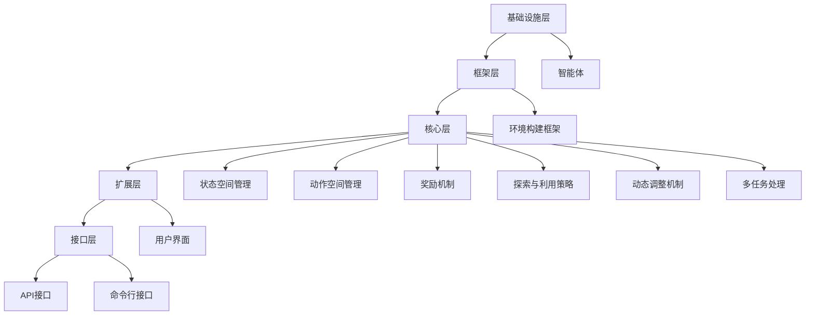
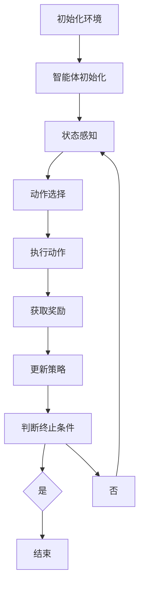

                 

### 1.1 强化学习环境设计的背景和意义

#### 1.1.1 强化学习的发展历程

强化学习（Reinforcement Learning, RL）作为一种机器学习的重要分支，自1950年代初期以来，其理论和技术不断演进。最早的强化学习模型之一是1952年由Richard Bellman提出的“马尔可夫决策过程”（Markov Decision Process, MDP）。此后，1956年，Arthur Samuel开发的第一个具有自我改进能力的程序，开创了强化学习的应用先河。进入21世纪，随着计算能力的提升和深度学习的蓬勃发展，强化学习迎来了新的发展契机。深度强化学习（Deep Reinforcement Learning, DRL）的出现，进一步推动了强化学习在复杂环境中的应用。

强化学习的主要发展历程可以分为以下几个阶段：

- **基础阶段（1950s-1980s）**：这一阶段，研究者主要关注如何基于奖励信号进行学习，提出了许多经典算法，如Q-learning、SARSA等。
- **低谷阶段（1990s）**：由于实际应用中的挑战，强化学习的研究进入了一个相对低迷的时期。
- **复兴阶段（2000s-2010s）**：随着函数逼近技术的发展，强化学习迎来了新的发展契机。尤其是通过深度神经网络（Deep Neural Network, DNN）的引入，DRL逐渐崭露头角。
- **蓬勃阶段（2010s至今）**：在AlphaGo等成功案例的推动下，强化学习在学术界和工业界都获得了广泛的关注和应用。

#### 1.1.2 环境设计在强化学习中的重要性

强化学习的核心在于决策者（智能体Agent）在动态环境中通过探索（Exploration）和利用（Exploitation）来学习最优策略。环境（Environment）是强化学习系统的重要组成部分，它不仅提供了状态（State）和动作（Action）的空间，还通过奖励（Reward）信号反馈智能体的学习效果。因此，环境设计在强化学习中具有至关重要的意义。

环境设计的重要性体现在以下几个方面：

1. **状态空间与动作空间的设计**：合理的状态空间和动作空间设计能够有效提升算法的效率和效果。状态空间过大会增加计算的复杂性，而状态空间过小则可能丢失重要信息。
2. **奖励机制的设计**：奖励机制决定了智能体的学习方向和速度。一个良好的奖励机制应该能够正确引导智能体快速学习到最优策略。
3. **探索与利用策略的设计**：智能体在环境中进行探索和利用的平衡，直接影响到学习效率。探索策略需要保证智能体能够充分探索未知状态，而利用策略则要确保智能体能够充分利用已知信息。
4. **动态性考虑**：实际环境通常是动态变化的，智能体需要具备适应环境变化的能力。环境设计需要考虑如何动态调整状态和动作空间，以及如何更新奖励机制。

#### 1.1.3 强化学习与AI推理能力的关系

AI推理能力（AI Inference Ability）指的是人工智能系统在给定输入时，能够准确、快速地输出预期结果的能力。强化学习作为一种机器学习方法，其核心目标是通过学习环境中的奖励信号，优化智能体的决策策略，从而达到在复杂环境中实现高效推理的目的。

强化学习与AI推理能力的关系主要体现在以下几个方面：

1. **决策优化**：强化学习通过不断调整智能体的策略，使其在特定环境中做出最优决策。这一过程本质上是一个优化过程，旨在提升智能体的推理能力。
2. **自适应能力**：强化学习算法能够在动态环境中学习并适应环境的变化，这使得智能体具备更强的推理能力，能够应对不确定性和未知情况。
3. **多任务处理**：通过不同的环境设计，强化学习可以实现多任务学习。智能体在一个复杂的多任务环境中，能够通过不断调整策略，提升在各个任务上的推理能力。
4. **增强学习与应用**：强化学习在游戏、机器人控制、自动驾驶等领域具有广泛应用。在这些应用中，智能体需要具备强大的推理能力，以实现复杂任务的自动化和智能化。

综上所述，强化学习环境设计在提升AI推理能力方面具有重要作用。通过合理设计环境，智能体能够在复杂动态环境中进行有效的推理和决策，从而实现AI能力的定向进化。

#### 1.2 AI推理能力的定义与演进

##### 1.2.1 AI推理能力的概念

AI推理能力指的是人工智能系统在处理信息时，通过逻辑推理、模式识别和知识应用，生成有效结论或决策的能力。它是衡量人工智能系统智能程度的重要指标。AI推理能力不仅包括逻辑推理，还涵盖了自然语言处理、图像识别、数据分析和预测等多个方面。

AI推理能力可以分为以下几类：

1. **基于规则的推理**：通过预设的规则和条件，对输入信息进行逻辑推导。
2. **基于模式的推理**：通过识别输入数据中的模式，进行匹配和分类。
3. **基于知识的推理**：利用已有知识库进行推理，生成新的结论。
4. **基于数据的推理**：通过数据分析，发现数据中的规律和趋势，进行预测和决策。

##### 1.2.2 强化学习对AI推理能力的影响

强化学习在提升AI推理能力方面发挥了关键作用。它通过奖励机制和策略优化，使智能体在复杂环境中不断学习和改进，从而提升推理能力。以下是强化学习对AI推理能力的几个主要影响：

1. **探索与利用平衡**：强化学习通过探索未知状态和利用已知信息，实现平衡，使智能体在动态环境中能够快速学习并做出最优决策。
2. **策略优化**：强化学习通过不断调整策略，使其在复杂环境中能够更高效地处理信息，提高推理能力。
3. **自适应能力**：强化学习算法能够适应动态变化的环境，使智能体在不确定性场景中保持高效的推理能力。
4. **多任务处理**：通过设计不同的环境，强化学习可以实现多任务学习，使智能体在多个任务上同时提升推理能力。

##### 1.2.3 AI推理能力的演进方向

随着人工智能技术的发展，AI推理能力正朝着以下几个方向演进：

1. **深度强化学习**：深度强化学习（Deep Reinforcement Learning, DRL）通过引入深度神经网络，能够处理更高维度和更复杂的环境，进一步提升推理能力。
2. **迁移学习**：迁移学习（Transfer Learning）通过利用已有模型的先验知识，加速新任务的推理能力提升。
3. **生成对抗网络**：生成对抗网络（Generative Adversarial Networks, GAN）能够生成高质量的虚拟数据，为智能体提供更多的训练样本，提高推理能力。
4. **混合智能系统**：将强化学习与其他机器学习方法（如监督学习、无监督学习）结合，构建混合智能系统，实现更高层次的推理能力。
5. **自适应推理**：通过自适应算法，使智能体能够根据环境变化和任务需求，动态调整推理策略，实现灵活高效的推理。

综上所述，AI推理能力是一个动态发展的过程，通过强化学习和其他技术的结合，智能体的推理能力将不断得到提升，为解决复杂问题提供更强有力的支持。

#### 2.1 强化学习的核心概念

强化学习是一种通过试错来学习如何进行决策的机器学习方法，其核心概念包括智能体（Agent）、环境（Environment）、状态（State）、动作（Action）、奖励（Reward）和策略（Policy）。下面我们将逐一介绍这些概念。

##### 2.1.1 强化学习的基本原理

强化学习的基本原理可以概括为：智能体通过在环境中执行动作，并根据环境的反馈（奖励信号）调整其行为策略，从而实现长期目标。具体来说，强化学习过程包括以下几个步骤：

1. **状态观察**：智能体首先观察当前环境的状态。
2. **动作选择**：智能体根据当前状态和其策略选择一个动作。
3. **环境反馈**：环境根据智能体的动作返回一个新的状态和一个奖励信号。
4. **策略更新**：智能体根据当前状态、动作和奖励信号，调整其策略，以期望在未来获得更高的奖励。

强化学习的关键在于如何设计一个有效的策略，使得智能体能够在复杂环境中实现最优决策。这通常需要通过大量的试错和经验积累来实现。

##### 2.1.2 强化学习的主要算法

强化学习算法种类繁多，以下是其中一些主要的算法：

1. **Q-Learning算法**
   - **原理**：Q-Learning算法是一种基于值函数的强化学习算法，旨在学习状态-动作值函数Q(s, a)，即智能体在状态s下执行动作a所能获得的预期奖励。
   - **公式**：
     $$ Q(s, a) = \sum_{s'} P(s' | s, a) \cdot \gamma \cdot \max_a' Q(s', a') $$
     其中，\(P(s' | s, a)\) 是状态转移概率，\(\gamma\) 是折扣因子，表示未来奖励的重要性。
   - **流程图**：
     ```mermaid
     graph TD
     A[初始化Q值] --> B[选择动作a]
     B --> C[执行动作，获得状态s'和奖励r]
     C --> D[更新Q值]
     D --> B
     ```

2. **深度Q网络（Deep Q-Network, DQN）**
   - **原理**：DQN通过引入深度神经网络（DNN）来近似Q值函数，从而在处理高维状态空间时具有优势。
   - **优势**：DQN能够通过经验回放（Experience Replay）和目标网络（Target Network）等技术，有效解决样本相关性和目标值不稳定问题。
   - **公式**：
     $$ Q(s, a) = \theta_S^T \cdot \phi(s, a) $$
     其中，\(\theta_S\) 是神经网络参数，\(\phi(s, a)\) 是输入特征向量。
   - **流程图**：
     ```mermaid
     graph TD
     A[初始化DNN参数] --> B[输入状态s]
     B --> C[通过DNN计算Q值]
     C --> D[执行动作a]
     D --> E[更新DNN参数]
     E --> B
     ```

3. **策略梯度算法（Policy Gradient）**
   - **原理**：策略梯度算法直接优化策略参数，以最大化长期奖励。
   - **公式**：
     $$ \nabla_\theta J(\theta) = \nabla_\theta \sum_{t=0}^T \gamma^t r_t $$
     其中，\(J(\theta)\) 是策略梯度，\(\theta\) 是策略参数，\(r_t\) 是在时间步t获得的奖励。
   - **流程图**：
     ```mermaid
     graph TD
     A[初始化策略参数\(\theta\)] --> B[执行动作a，获得奖励r]
     B --> C[计算策略梯度\(\nabla_\theta J(\theta)\)]
     C --> D[更新策略参数\(\theta\)]
     D --> B
     ```

##### 2.1.3 强化学习中的评估指标

评估强化学习算法的性能通常依赖于以下指标：

1. **平均奖励（Average Reward）**：在固定时间内，智能体获得的总奖励与时间步数的比值。
2. **策略优势（Policy Advantage）**：特定策略相对于其他策略的预期奖励差异。
3. **探索效率（Exploration Efficiency）**：衡量智能体在探索未知状态时，能够有效利用已有信息的能力。
4. **收敛速度（Convergence Speed）**：智能体从初始策略到最优策略的收敛速度。
5. **稳定性（Stability）**：智能体在不同环境下执行相同策略时的稳定性。

通过这些评估指标，研究者可以全面了解强化学习算法的性能和适用性，为后续改进提供依据。

#### 2.2 环境设计的核心概念

环境设计是强化学习系统中的一个关键组成部分，它直接影响到智能体的学习效果和推理能力。下面我们将详细探讨环境设计的核心概念，包括基本概念、要素、方法和工具。

##### 2.2.1 环境设计的基本概念

在强化学习中，环境（Environment）是一个抽象的概念，它代表了智能体所处的实际或模拟的场景。环境通常由状态空间、动作空间、奖励函数和初始状态等要素构成。

1. **状态空间（State Space）**：状态空间是环境中的所有可能状态的集合。每个状态可以表示为智能体在某一时刻对环境的感知。
2. **动作空间（Action Space）**：动作空间是智能体能够执行的所有可能动作的集合。智能体通过选择动作来与环境互动。
3. **奖励函数（Reward Function）**：奖励函数是环境根据智能体的动作返回的奖励信号，用于指导智能体的学习过程。
4. **初始状态（Initial State）**：初始状态是强化学习过程开始时环境所处的状态。

##### 2.2.2 环境设计的要素

环境设计的核心在于如何构建一个能够有效支持智能体学习和推理的环境。以下是环境设计的主要要素：

1. **状态表示（State Representation）**：状态表示是将环境的实际状态转换为适合算法处理的形式。有效的状态表示能够提高智能体的学习效率和效果。
2. **动作表示（Action Representation）**：动作表示是将智能体的实际动作转换为算法能够理解和执行的形式。合理的动作表示能够确保智能体的动作能够在环境中得到正确执行。
3. **奖励机制（Reward Mechanism）**：奖励机制是环境通过奖励信号来反馈智能体学习效果的方式。一个良好的奖励机制能够引导智能体快速学习到最优策略。
4. **探索策略（Exploration Strategy）**：探索策略是智能体在环境中进行探索的方式，旨在平衡探索未知状态和利用已知信息。常见的探索策略包括随机策略、ε-贪心策略等。
5. **动态调整（Dynamic Adjustment）**：动态调整是指环境根据智能体的学习进展和外部条件变化，调整状态空间、动作空间和奖励函数等要素，以适应智能体的学习需求。

##### 2.2.3 环境设计的方法与工具

环境设计的方法和工具多种多样，以下是几种常见的方法和工具：

1. **仿真环境（Simulation Environment）**：仿真环境是一种通过计算机模拟创建的虚拟环境，用于模拟真实世界的问题。常见的仿真环境有Unity、Pygame等。
2. **开源框架（Open-Source Frameworks）**：开源框架为开发者提供了丰富的工具和接口，用于构建和调试强化学习环境。常见的开源框架有Gym、OpenAI Roboset等。
3. **领域特定语言（Domain-Specific Language, DSL）**：领域特定语言是一种为特定应用领域设计的编程语言，用于简化环境设计和实现。例如，Python的Pygame库就提供了一种简化的游戏开发环境。
4. **强化学习平台（Reinforcement Learning Platforms）**：强化学习平台集成了多种工具和资源，为开发者提供了从环境设计到模型训练的一站式服务。常见的强化学习平台有Google的DeepMind Lab、OpenAI的Gym等。

通过合理运用这些方法和工具，开发者可以构建出适合特定问题的强化学习环境，从而提升智能体的学习效率和推理能力。

#### 2.3 AI推理能力的概念与强化学习环境设计的关系

AI推理能力在人工智能系统中占据核心地位，它决定了系统能否在面对复杂问题和动态环境时做出有效的决策。而强化学习环境设计对AI推理能力的影响深远，二者之间存在着紧密的关联。下面，我们将从多个角度探讨AI推理能力的概念以及强化学习环境设计如何影响这一能力。

##### 2.3.1 AI推理能力的评估

评估AI推理能力需要从多个维度进行综合考量，常见的评估指标包括：

1. **准确率（Accuracy）**：准确率衡量的是智能体在给定输入时，正确推理出预期结果的概率。
2. **召回率（Recall）**：召回率衡量的是智能体在识别正例样本时的能力，即正确识别的正例样本数量与实际正例样本数量的比值。
3. **F1分数（F1 Score）**：F1分数是准确率和召回率的调和平均，用于综合评估智能体的推理能力。
4. **响应时间（Response Time）**：响应时间衡量的是智能体在处理输入并给出推理结果所需的时间。
5. **鲁棒性（Robustness）**：鲁棒性衡量的是智能体在面临噪声数据和异常情况时，仍能保持稳定和准确推理的能力。

通过这些评估指标，研究者可以全面了解AI系统的推理能力，从而为优化环境设计和改进算法提供依据。

##### 2.3.2 强化学习环境设计对AI推理能力的影响

强化学习环境设计对AI推理能力的影响主要体现在以下几个方面：

1. **状态和动作空间的定义**：状态和动作空间的设计直接决定了智能体的推理范围和能力。合理的状态空间应能够充分捕捉环境的特征，而动作空间则应涵盖智能体可能采取的所有有效动作。通过优化状态和动作空间，可以提升智能体的推理精度和效率。

2. **奖励机制的设置**：奖励机制是引导智能体学习的重要手段。一个良好的奖励机制应能够准确地反映智能体决策的质量和效果。合理的奖励设置不仅能够加速智能体的学习过程，还能帮助智能体在复杂的动态环境中找到最优策略。

3. **探索与利用策略**：在强化学习过程中，探索与利用的平衡至关重要。探索策略能够帮助智能体发现新的有效动作和状态，而利用策略则确保智能体能够充分利用已有信息。通过设计合理的探索与利用策略，可以提高智能体的学习效率和推理能力。

4. **动态性调整**：实际环境通常是动态变化的，智能体需要具备适应环境变化的能力。环境设计中的动态调整机制，如状态转移概率的调整和奖励函数的更新，能够帮助智能体更好地应对环境变化，从而提升其推理能力。

5. **多任务处理**：强化学习环境设计应支持多任务处理，使智能体能够在多个任务上同时提升推理能力。通过设计复杂的多任务环境，智能体可以学习到在不同任务之间的通用策略，从而提高其整体推理水平。

##### 2.3.3 强化学习环境设计的优化方向

为了进一步提升AI推理能力，强化学习环境设计可以从以下几个方面进行优化：

1. **增强状态表示能力**：通过引入更高级的状态表示方法，如深度神经网络和生成对抗网络，可以更好地捕捉环境中的复杂特征，提高智能体的学习效率和推理精度。

2. **精细化奖励机制**：设计更加细粒度的奖励机制，根据智能体的具体行为和任务需求，设置有针对性的奖励信号，从而更有效地引导智能体学习到最优策略。

3. **引入多模态信息**：在实际环境中，智能体可能会接收多种类型的信息，如视觉、听觉和传感器数据。引入多模态信息可以丰富智能体的感知能力，提高其在复杂环境中的推理能力。

4. **优化探索与利用策略**：通过设计更加高效的探索与利用策略，如基于熵的探索策略和优势估计策略，可以更好地平衡智能体的探索和利用，提高学习效率。

5. **增强鲁棒性设计**：通过引入噪声处理和异常检测机制，增强智能体在面临噪声数据和异常情况时的鲁棒性，从而提高其推理能力的稳定性和可靠性。

综上所述，强化学习环境设计对AI推理能力具有深远的影响。通过优化环境设计，可以显著提升智能体的学习效率和推理能力，为解决复杂问题提供强有力的支持。

#### 3.1 强化学习算法原理

强化学习算法的核心在于通过不断调整策略，使智能体在动态环境中做出最优决策。下面我们将详细介绍两种典型的强化学习算法：Q-Learning算法和深度Q网络（DQN）算法。

##### 3.1.1 Q-Learning算法

Q-Learning算法是一种基于值函数的强化学习算法，其目标是通过学习状态-动作值函数Q(s, a)，即智能体在状态s下执行动作a所能获得的预期奖励，从而优化智能体的策略。

1. **基本原理**
   - Q-Learning算法通过迭代更新Q值，以期望最大化智能体在当前状态下执行某一动作的奖励。
   - 算法的核心步骤包括：初始化Q值表、选择动作、更新Q值、重复迭代。

2. **数学模型**
   $$ Q(s, a) = \sum_{s'} P(s' | s, a) \cdot \gamma \cdot \max_{a'} Q(s', a') $$
   其中，\(P(s' | s, a)\) 是状态转移概率，\(\gamma\) 是折扣因子，表示未来奖励的重要性。

3. **流程图**
   ```mermaid
   graph TD
   A[初始化Q值] --> B[选择动作a]
   B --> C[执行动作，获得状态s'和奖励r]
   C --> D[更新Q值]
   D --> A
   ```

##### 3.1.2 Deep Q-Network (DQN) 算法

DQN算法是Q-Learning算法的一种扩展，它通过引入深度神经网络（DNN）来近似Q值函数，从而在处理高维状态空间时具有优势。

1. **原理与优势**
   - DQN算法利用DNN来学习状态-动作值函数，从而避免了手工设计特征向量的问题。
   - DQN通过经验回放（Experience Replay）和目标网络（Target Network）等技术，有效解决了样本相关性和目标值不稳定问题。

2. **数学模型**
   $$ Q(s, a) = \theta_S^T \cdot \phi(s, a) $$
   其中，\(\theta_S\) 是神经网络参数，\(\phi(s, a)\) 是输入特征向量。

3. **算法流程**
   - 初始化DNN参数和目标网络参数。
   - 将智能体的经验（状态、动作、奖励、新状态）存入经验回放缓冲区。
   - 随机从经验回放缓冲区中抽取一组经验，用于更新DNN参数。
   - 计算目标Q值，更新目标网络参数。
   - 利用更新后的DNN参数选择动作，执行动作，获得新状态和奖励。
   - 重复迭代，直至达到预设的收敛条件。

4. **流程图**
   ```mermaid
   graph TD
   A[初始化DNN参数] --> B[输入状态s]
   B --> C[通过DNN计算Q值]
   C --> D[执行动作a]
   D --> E[更新DNN参数]
   E --> F[计算目标Q值]
   F --> G[更新目标网络参数]
   G --> B
   ```

通过Q-Learning算法和DQN算法，智能体能够在动态环境中通过不断试错，学习到最优策略，从而提升其推理能力。这些算法不仅在学术研究中具有重要地位，也在实际应用中展现出强大的潜力。

##### 3.2.1 环境构建算法

环境构建算法是强化学习系统中至关重要的一环，其核心任务是创建一个适合智能体学习和推理的虚拟环境。环境构建算法主要包括以下几个基本步骤：

1. **状态表示**：状态表示是将环境中的实际状态转化为算法可以处理的形式。有效的状态表示能够捕捉环境的关键特征，提高智能体的学习效率。常见的方法包括像素级表示、稀疏编码和嵌入表示等。

2. **动作表示**：动作表示是将智能体的实际动作转化为算法能够理解和执行的形式。动作表示需要确保智能体的动作能够在环境中得到正确执行，同时要考虑动作空间的合理性和效率。

3. **奖励函数设计**：奖励函数设计是环境构建的关键部分，它决定了智能体的学习方向和速度。一个良好的奖励函数应能够正确反映智能体决策的效果，引导智能体快速学习到最优策略。奖励函数的设计需要考虑奖励的及时性、连续性和稳定性。

4. **初始状态设定**：初始状态设定是环境构建的起点，它决定了智能体在开始学习时的初始状态。合理的初始状态应能够保证智能体不会在开始阶段陷入局部最优，同时能够提供足够的探索空间。

5. **探索与利用策略**：探索与利用策略是环境构建中需要重点考虑的部分。探索策略用于智能体在环境中进行探索，发现新的状态和动作；利用策略则确保智能体能够充分利用已有信息，避免盲目探索。常见的探索策略包括ε-贪心策略、UCB策略和 Thompson 采样等。

6. **动态调整机制**：实际环境通常是动态变化的，智能体需要具备适应环境变化的能力。动态调整机制通过实时更新状态空间、动作空间和奖励函数，确保智能体能够在不同阶段保持高效的推理能力。

##### 3.2.1.2 环境构建的挑战与解决方案

环境构建过程中面临以下挑战：

1. **状态空间过大**：在许多实际应用中，状态空间可能非常大，甚至是连续的。这会导致计算复杂度急剧增加，学习效率降低。解决方法包括状态降维、抽象化和稀疏编码等。

2. **奖励稀疏性**：在某些任务中，奖励信号非常稀疏，智能体需要通过大量的试错才能获得一次奖励。这会导致学习过程缓慢，甚至陷入局部最优。解决方法包括增加奖励的频率和及时性，设计奖励的层次结构等。

3. **探索与利用平衡**：在动态环境中，如何平衡探索和利用是一个难题。过于强调探索可能导致智能体学习效率低下，而过于强调利用则可能导致智能体无法发现新的有效策略。解决方法包括自适应探索策略和混合策略等。

4. **稳定性与鲁棒性**：实际环境通常存在噪声和不确定性，智能体需要具备稳定的推理能力和鲁棒的适应能力。解决方法包括引入噪声处理机制、异常检测和鲁棒优化算法等。

通过有效应对这些挑战，环境构建算法可以更好地支持智能体的学习和推理，提升强化学习系统的整体性能。

##### 3.2.2 环境优化算法

强化学习环境设计的优化算法旨在通过调整环境参数和策略，提升智能体的学习效率和推理能力。以下是几种常见的环境优化算法：

1. **奖励函数优化**：奖励函数是强化学习环境设计中的核心元素，它直接影响智能体的学习方向和速度。奖励函数优化主要通过调整奖励信号的及时性、连续性和稳定性，来引导智能体更快地学习到最优策略。

2. **状态空间优化**：状态空间优化包括状态降维、抽象化和稀疏编码等。通过减少状态空间的维度，可以有效降低计算复杂度，提高学习效率。同时，状态抽象化和稀疏编码有助于智能体更好地捕捉环境中的关键特征，提升推理能力。

3. **动作空间优化**：动作空间优化主要通过调整动作空间的大小和分布，来确保智能体的动作选择既有足够的灵活性，又不会过于复杂。优化动作空间可以帮助智能体更快地探索和利用环境信息。

4. **探索与利用策略优化**：探索与利用策略的优化是强化学习环境设计中的另一个关键环节。常见的策略包括ε-贪心策略、UCB策略和 Thompson 采样等。通过自适应调整探索与利用策略，可以更好地平衡智能体的探索和利用，提升学习效率。

5. **动态调整机制**：动态调整机制通过实时更新状态空间、动作空间和奖励函数，使环境能够适应智能体的学习进展和外部环境的变化。这一机制有助于智能体在不同阶段保持高效的推理能力，从而提升整体性能。

6. **多任务学习优化**：在多任务学习环境中，环境优化算法需要确保智能体能够在不同任务之间进行有效转移和共享经验。这通常通过设计任务无关的特征和通用的策略实现，从而提升智能体的推理能力和泛化能力。

通过以上优化算法，强化学习环境设计能够更好地支持智能体的学习和推理，为解决复杂问题提供强有力的支持。

##### 3.2.2.1 环境优化的目标

环境优化算法的设计旨在实现以下几个关键目标：

1. **提升学习效率**：环境优化的首要目标是提高智能体的学习效率，使其在较短的时间内达到较高的性能水平。这需要通过优化状态空间、动作空间和奖励机制，减少不必要的探索和计算开销，加快智能体的学习速度。

2. **增强推理能力**：环境优化不仅要提升智能体的学习效率，还要增强其推理能力，使其能够更好地处理复杂环境和动态变化。通过优化奖励函数和探索策略，智能体能够更快地发现和利用有效策略，从而提升其在实际任务中的表现。

3. **提高鲁棒性**：在实际应用中，环境经常面临噪声和不确定性。环境优化需要增强智能体的鲁棒性，使其能够在面对噪声和异常情况时，仍能保持稳定的推理能力。这通常通过引入噪声处理机制和鲁棒优化算法实现。

4. **实现多任务学习**：在多任务学习场景中，环境优化算法需要确保智能体能够有效转移和共享经验，从而在不同任务上都能表现出色。通过设计任务无关的特征和通用的策略，环境优化有助于智能体实现多任务学习，提升其泛化能力。

5. **减少计算资源需求**：环境优化应尽量减少智能体在学习和推理过程中的计算资源需求，包括内存、CPU和GPU等。通过优化算法和数据结构，可以显著降低智能体的计算复杂度，提高系统的整体性能和可扩展性。

通过实现这些目标，环境优化算法能够为智能体提供一个更加高效、稳定和鲁棒的学习环境，从而在复杂任务中表现出色。

##### 3.2.2.2 环境优化的方法

环境优化的方法多样，以下是一些常见的技术和策略：

1. **奖励工程**：奖励工程是优化奖励函数的关键步骤，通过设计合理的奖励机制，可以引导智能体快速学习到最优策略。具体方法包括奖励分解、层次化奖励设计和动态调整奖励函数等。

2. **状态抽象化**：状态抽象化通过将复杂的状态空间简化为更高级别的状态表示，从而降低计算复杂度。常见的方法包括稀疏编码、自动编码器和嵌入表示等。

3. **动作空间压缩**：动作空间压缩通过减少动作空间的大小，避免智能体在大量无效动作上进行探索。具体方法包括动作选择策略、贪心策略和动作空间抽样等。

4. **探索与利用策略**：探索与利用策略的优化有助于智能体在动态环境中保持平衡。常见的策略包括ε-贪心策略、UCB策略、 Thompson 采样和自适应探索等。

5. **模型更新与同步**：在多智能体和分布式环境中，通过模型更新与同步技术，可以确保智能体之间的策略一致性。具体方法包括分布式强化学习、模型共享和同步更新等。

6. **多任务学习**：多任务学习优化通过设计任务无关的特征和通用的策略，使智能体能够有效转移和共享经验。常见的方法包括元学习、多任务优化和跨任务知识蒸馏等。

通过合理运用这些优化方法，环境设计可以显著提升智能体的学习效率和推理能力。

##### 3.2.2.3 环境优化的效果评估

评估环境优化算法的效果是确保其有效性的关键步骤。以下是一些常用的效果评估指标和方法：

1. **平均奖励（Average Reward）**：平均奖励是评估智能体在给定环境中长期表现的常用指标。它衡量的是智能体在执行大量任务后的平均奖励值。较高的平均奖励表示智能体在环境中能够获得更多的正向反馈，学习效果较好。

2. **收敛速度（Convergence Speed）**：收敛速度衡量的是智能体从初始策略到最优策略的时间。较快的收敛速度意味着智能体能够在较短的时间内找到有效策略，提升学习效率。

3. **探索效率（Exploration Efficiency）**：探索效率衡量的是智能体在探索未知状态时的效率。高效的探索效率表示智能体能够在较少的探索次数下发现有效的策略，减少盲目探索。

4. **策略稳定性（Policy Stability）**：策略稳定性衡量的是智能体在不同环境和任务下的策略一致性。稳定的策略表示智能体在不同情况下都能保持良好的表现。

5. **泛化能力（Generalization Ability）**：泛化能力衡量的是智能体在新环境和任务上的表现。较强的泛化能力表示智能体能够在不同场景下应用所学策略。

通过这些评估指标，研究者可以全面了解环境优化算法的有效性，从而为后续改进提供依据。

### 4.1 强化学习环境设计的系统功能设计

在强化学习环境设计中，系统功能设计是关键环节之一，它决定了环境能够提供的功能范围和用户体验。以下是强化学习环境设计的系统功能设计内容：

#### 4.1.1 系统功能概述

强化学习环境设计的系统功能主要包括以下方面：

1. **状态空间管理**：管理环境中的状态空间，包括状态表示、状态转换和状态更新等功能。
2. **动作空间管理**：管理环境中的动作空间，包括动作表示、动作选择和动作执行等功能。
3. **奖励机制**：设计并实现奖励机制，根据智能体的动作和环境状态，提供相应的奖励信号。
4. **探索与利用策略**：提供多种探索与利用策略，帮助智能体在动态环境中进行有效的学习和决策。
5. **动态调整机制**：实现环境参数的动态调整，以适应智能体的学习进展和外部环境的变化。
6. **多任务处理**：支持多任务学习和处理，使智能体能够在不同任务之间进行有效转移和共享经验。
7. **用户界面**：提供友好的用户界面，使用户能够方便地配置环境参数、监控智能体学习和交互过程。

#### 4.1.2 领域模型设计

领域模型设计是系统功能设计的重要组成部分，它通过定义领域模型来描述系统的关键要素和关系。以下是强化学习环境设计的领域模型设计：

1. **类图展示**：

   ```mermaid
   graph TD
   A[Agent] --> B[Environment]
   B --> C[State]
   B --> D[Action]
   B --> E[Reward]
   B --> F[Policy]
   B --> G[ExplorationStrategy]
   B --> H[UtilizationStrategy]
   B --> I[DynamicAdjustment]
   B --> J[MultitaskProcessing]
   B --> K[UserInterface]
   ```

   - **Agent（智能体）**：代表强化学习系统中的智能体，负责执行动作、更新策略和获得奖励。
   - **Environment（环境）**：表示智能体所处的环境，负责提供状态、动作和奖励信号。
   - **State（状态）**：代表环境中的状态，包括智能体对环境的感知。
   - **Action（动作）**：表示智能体可以执行的动作，用于与环境互动。
   - **Reward（奖励）**：表示智能体在执行动作后获得的奖励信号，用于指导智能体的学习过程。
   - **Policy（策略）**：表示智能体的行为规则，用于选择动作。
   - **ExplorationStrategy（探索策略）**：用于智能体在环境中的探索行为。
   - **UtilizationStrategy（利用策略）**：用于智能体在环境中的利用行为。
   - **DynamicAdjustment（动态调整机制）**：用于环境参数的动态调整。
   - **MultitaskProcessing（多任务处理）**：用于支持多任务学习和处理。
   - **UserInterface（用户界面）**：用于与用户交互，提供配置和环境监控功能。

2. **类图功能与关系**：

   - **Agent**：通过调用环境提供的接口，获取状态、执行动作和获取奖励，并更新策略。
   - **Environment**：提供状态空间和动作空间的接口，实现状态转换和奖励计算。
   - **State**：作为环境状态的基本单位，记录智能体对环境的感知。
   - **Action**：作为智能体的行为输出，实现与环境交互。
   - **Reward**：作为反馈信号，指导智能体的学习过程。
   - **Policy**：定义智能体的行为规则，实现决策。
   - **ExplorationStrategy**：实现智能体的探索行为，帮助智能体发现新的有效策略。
   - **UtilizationStrategy**：实现智能体的利用行为，使智能体充分利用已有信息。
   - **DynamicAdjustment**：实现环境参数的动态调整，适应智能体的学习进展。
   - **MultitaskProcessing**：支持多任务学习和处理，提升智能体的泛化能力。
   - **UserInterface**：提供用户配置环境参数和监控智能体学习过程的界面。

通过领域模型设计，强化学习环境能够实现明确的系统功能划分和模块化，从而提高系统的可扩展性和可维护性。

#### 4.1.3 系统功能实现

在强化学习环境设计中，系统功能的实现需要通过具体的代码和模块来完成。以下是强化学习环境设计的主要实现内容：

1. **状态空间管理**：通过数据结构和算法实现状态空间的表示和管理，包括状态的初始化、状态转换和状态更新等。

2. **动作空间管理**：通过数据结构和算法实现动作空间的表示和管理，包括动作的初始化、动作选择和动作执行等。

3. **奖励机制**：通过定义奖励函数和奖励计算算法，实现奖励信号的生成和更新。

4. **探索与利用策略**：通过实现探索和利用策略的算法，如ε-贪心策略、UCB策略和 Thompson 采样等，帮助智能体在动态环境中进行有效的学习和决策。

5. **动态调整机制**：通过实时更新环境参数和策略，实现智能体对环境变化的适应。

6. **多任务处理**：通过设计任务无关的特征和通用的策略，实现智能体在不同任务之间的有效转移和共享经验。

7. **用户界面**：通过图形用户界面（GUI）和命令行界面（CLI），提供用户配置环境参数、监控智能体学习和交互过程的接口。

具体实现过程中，可以采用Python、C++等编程语言，结合各种开源框架和库（如PyTorch、TensorFlow、Gym等），来实现上述系统功能。通过模块化和组件化的设计，可以确保系统功能的灵活性和可扩展性。

### 4.2 强化学习环境设计的系统架构设计

系统架构设计是强化学习环境设计中的关键环节，它决定了系统功能的实现方式和性能表现。以下是强化学习环境设计的系统架构设计内容：

#### 4.2.1 系统架构概述

强化学习环境设计的系统架构可以分为以下几个层次：

1. **基础设施层**：包括计算资源、存储和网络等基础设施，提供环境运行所需的硬件支持。
2. **框架层**：包括强化学习算法框架、环境构建框架等，提供系统开发所需的基础组件和工具。
3. **核心层**：包括智能体、环境、状态空间、动作空间、奖励机制等核心组件，实现强化学习环境的主要功能。
4. **扩展层**：包括多任务处理、动态调整机制、用户界面等扩展功能，增强系统的灵活性和适用性。
5. **接口层**：提供外部系统与强化学习环境交互的接口，如API接口、命令行接口等。

#### 4.2.1.1 架构图展示

以下是强化学习环境设计的系统架构图：



- **基础设施层（A）**：提供计算资源、存储和网络等基础设施支持，确保环境能够高效运行。
- **框架层（B）**：包括强化学习算法框架、环境构建框架等，为系统开发提供基础组件和工具。
- **核心层（C）**：实现强化学习环境的核心功能，如智能体、状态空间管理、动作空间管理、奖励机制等。
- **扩展层（D）**：提供多任务处理、动态调整机制、用户界面等扩展功能，增强系统的灵活性和适用性。
- **接口层（E）**：提供外部系统与强化学习环境交互的接口，包括API接口和命令行接口等。

#### 4.2.2 系统模块设计

系统模块设计是系统架构设计的重要组成部分，以下是强化学习环境设计的主要模块及其功能：

1. **智能体模块**：负责智能体的创建、状态感知、动作选择和策略更新等。
2. **环境构建模块**：负责创建和管理环境，包括状态空间、动作空间、奖励机制等。
3. **状态空间管理模块**：负责状态空间的初始化、状态转换和状态更新等。
4. **动作空间管理模块**：负责动作空间的初始化、动作选择和动作执行等。
5. **奖励机制模块**：负责奖励函数的设计、奖励信号的生成和更新等。
6. **探索与利用策略模块**：负责实现探索策略和利用策略，如ε-贪心策略、UCB策略等。
7. **动态调整模块**：负责环境参数的动态调整，以适应智能体的学习进展和外部环境的变化。
8. **多任务处理模块**：负责实现多任务学习和处理，支持智能体在不同任务之间的经验转移。
9. **用户界面模块**：负责提供用户交互界面，使用户能够方便地配置环境参数、监控智能体学习和交互过程。

#### 4.2.2.1 模块功能与接口

以下是各模块的具体功能及其接口设计：

1. **智能体模块**：
   - 功能：创建和管理智能体，实现状态感知、动作选择和策略更新等。
   - 接口：初始化智能体、更新状态、选择动作、获取奖励等。

2. **环境构建模块**：
   - 功能：创建和管理环境，包括状态空间、动作空间、奖励机制等。
   - 接口：初始化环境、获取状态、执行动作、获取奖励等。

3. **状态空间管理模块**：
   - 功能：实现状态空间的初始化、状态转换和状态更新等。
   - 接口：初始化状态空间、获取当前状态、更新状态等。

4. **动作空间管理模块**：
   - 功能：实现动作空间的初始化、动作选择和动作执行等。
   - 接口：初始化动作空间、选择动作、执行动作等。

5. **奖励机制模块**：
   - 功能：设计并实现奖励函数，生成和更新奖励信号。
   - 接口：初始化奖励函数、生成奖励、更新奖励等。

6. **探索与利用策略模块**：
   - 功能：实现探索策略和利用策略，如ε-贪心策略、UCB策略等。
   - 接口：初始化策略、选择动作、更新策略等。

7. **动态调整模块**：
   - 功能：实现环境参数的动态调整，适应智能体的学习进展和外部环境的变化。
   - 接口：初始化调整参数、更新调整参数等。

8. **多任务处理模块**：
   - 功能：实现多任务学习和处理，支持智能体在不同任务之间的经验转移。
   - 接口：初始化任务、切换任务、更新任务经验等。

9. **用户界面模块**：
   - 功能：提供用户交互界面，使用户能够方便地配置环境参数、监控智能体学习和交互过程。
   - 接口：初始化用户界面、显示状态、显示动作、显示奖励等。

通过模块化设计，强化学习环境系统可以更好地实现功能分离和模块化复用，提高系统的灵活性和可维护性。

### 4.3 强化学习环境设计的系统接口设计

系统接口设计是强化学习环境设计的重要组成部分，它决定了不同模块之间的交互方式，确保系统功能的一致性和稳定性。以下是强化学习环境设计的系统接口设计内容：

#### 4.3.1 系统接口概述

强化学习环境设计的系统接口主要包括以下几类：

1. **API接口**：为外部系统提供与强化学习环境交互的接口，如Python API、RESTful API等。
2. **命令行接口（CLI）**：通过命令行工具，使用户能够方便地与强化学习环境进行交互，如使用Shell脚本、命令行工具等。
3. **图形用户界面（GUI）**：提供可视化界面，使用户能够直观地配置环境参数、监控智能体学习和交互过程。

#### 4.3.1.1 接口规范与定义

以下是强化学习环境设计的系统接口规范与定义：

1. **API接口**：

   - **初始化接口**：
     - 功能：初始化强化学习环境。
     - 参数：无。
     - 返回值：初始化成功的标志。

   - **状态获取接口**：
     - 功能：获取当前环境状态。
     - 参数：无。
     - 返回值：当前环境状态。

   - **动作执行接口**：
     - 功能：执行给定动作。
     - 参数：动作ID。
     - 返回值：执行结果。

   - **奖励获取接口**：
     - 功能：获取当前动作的奖励信号。
     - 参数：无。
     - 返回值：奖励信号。

   - **环境重置接口**：
     - 功能：重置环境到初始状态。
     - 参数：无。
     - 返回值：重置成功的标志。

2. **命令行接口（CLI）**：

   - **初始化命令**：
     - 功能：初始化强化学习环境。
     - 命令格式：`init_env`。

   - **状态查询命令**：
     - 功能：查询当前环境状态。
     - 命令格式：`get_state`。

   - **动作执行命令**：
     - 功能：执行给定动作。
     - 命令格式：`execute_action <action_id>`。

   - **奖励查询命令**：
     - 功能：查询当前动作的奖励信号。
     - 命令格式：`get_reward`。

   - **环境重置命令**：
     - 功能：重置环境到初始状态。
     - 命令格式：`reset_env`。

3. **图形用户界面（GUI）**：

   - **初始化按钮**：
     - 功能：初始化强化学习环境。
     - 点击效果：初始化成功，显示当前状态。

   - **状态显示区域**：
     - 功能：显示当前环境状态。
     - 更新方式：实时更新。

   - **动作选择框**：
     - 功能：选择执行的动作。
     - 可选动作：动作列表。

   - **奖励显示区域**：
     - 功能：显示当前动作的奖励信号。
     - 更新方式：实时更新。

   - **重置按钮**：
     - 功能：重置环境到初始状态。
     - 点击效果：环境重置成功，显示初始状态。

通过以上接口规范与定义，强化学习环境能够为外部系统和用户提供方便、高效的交互方式，实现系统功能的一致性和稳定性。

#### 4.4 强化学习环境设计的系统交互流程

系统交互流程是强化学习环境设计的核心部分，它描述了智能体与环境之间的交互过程。以下是强化学习环境设计的系统交互流程及其实现步骤：

##### 4.4.1 系统交互概述

强化学习环境设计的系统交互流程主要包括以下几个阶段：

1. **初始化阶段**：智能体和环境初始化，包括状态空间、动作空间、奖励机制等。
2. **交互阶段**：智能体与环境进行多次交互，包括状态感知、动作选择、奖励获取等。
3. **更新阶段**：智能体根据交互结果更新策略，以实现最优决策。
4. **终止阶段**：满足终止条件，结束强化学习过程。

##### 4.4.1.1 交互流程图展示

以下是强化学习环境设计的系统交互流程图：



- **初始化环境（A）**：环境初始化，设置状态空间、动作空间和奖励机制。
- **智能体初始化（B）**：智能体初始化，设置初始策略和探索策略。
- **状态感知（C）**：智能体感知当前环境状态。
- **动作选择（D）**：智能体根据当前状态和策略选择动作。
- **执行动作（E）**：环境根据智能体的动作执行相应的操作。
- **获取奖励（F）**：环境返回智能体执行动作后的奖励信号。
- **更新策略（G）**：智能体根据当前状态、动作和奖励信号更新策略。
- **判断终止条件（H）**：检查是否满足终止条件（如达到最大步数或找到最优策略）。
- **结束（J）**：满足终止条件，结束强化学习过程。
- **继续交互（K）**：未满足终止条件，继续进行下一轮交互。

##### 4.4.1.2 交互流程详细说明

1. **初始化阶段**：
   - **环境初始化**：设置状态空间、动作空间和奖励机制。状态空间包括所有可能的状态，动作空间包括所有可能的动作，奖励机制根据智能体的动作和状态生成奖励信号。
   - **智能体初始化**：设置初始策略和探索策略。初始策略通常为随机策略，探索策略用于平衡探索和利用。

2. **交互阶段**：
   - **状态感知**：智能体感知当前环境状态，并将其作为输入。
   - **动作选择**：智能体根据当前状态和策略选择一个动作。常见的策略包括ε-贪心策略、UCB策略和 Thompson 采样等。
   - **执行动作**：环境根据智能体的动作执行相应的操作，并返回新的状态和奖励信号。
   - **获取奖励**：智能体根据环境返回的奖励信号更新其内部状态。

3. **更新阶段**：
   - **更新策略**：智能体根据当前状态、动作和奖励信号更新策略。更新策略的方法包括Q-Learning算法、Deep Q-Network (DQN)算法和Policy Gradient算法等。
   - **探索与利用平衡**：通过探索策略和利用策略的平衡，确保智能体在动态环境中既能有效探索，又能充分利用已有信息。

4. **终止阶段**：
   - **判断终止条件**：检查是否满足终止条件，如达到最大步数、找到最优策略或智能体在特定状态下的奖励达到最大值。
   - **结束**：满足终止条件，结束强化学习过程。否则，继续进行下一轮交互。

通过详细的系统交互流程，强化学习环境能够实现智能体在动态环境中的有效学习和推理，从而提升AI推理能力。

### 5.1 强化学习环境设计项目实战

在本节中，我们将通过一个具体的强化学习环境设计案例，详细描述环境搭建、实现源代码、代码解读和案例分析，以便读者更好地理解和应用强化学习环境设计。

#### 5.1.1 环境搭建

为了实现一个强化学习环境，我们选择使用Python编程语言和Gym框架。Gym是一个开源的强化学习环境库，提供了多种预定义的环境和工具，方便开发者进行强化学习实验。以下是环境搭建的步骤：

1. **安装Python**：确保系统已安装Python 3.7或更高版本。
2. **安装Gym框架**：通过pip命令安装Gym框架，命令如下：
   ```bash
   pip install gym
   ```
3. **创建虚拟环境**：为了更好地管理项目依赖，创建一个虚拟环境，命令如下：
   ```bash
   python -m venv rl-env
   ```
4. **激活虚拟环境**：在Windows上，使用以下命令激活虚拟环境：
   ```bash
   .\rl-env\Scripts\activate
   ```
   在Linux和macOS上，使用以下命令激活虚拟环境：
   ```bash
   source rl-env/bin/activate
   ```

#### 5.1.2 实现源代码

以下是一个简单的强化学习环境实现，基于Gym框架中的CartPole环境：

```python
import gym
import numpy as np

# 初始化环境
env = gym.make('CartPole-v0')

# 初始化参数
eps = 0.1  # 探索率
alpha = 0.1  # 学习率
gamma = 0.9  # 折扣因子

# 初始化Q值表
q_table = np.zeros((env.observation_space.n, env.action_space.n))

# 训练智能体
num_episodes = 1000
for episode in range(num_episodes):
    state = env.reset()
    done = False
    total_reward = 0

    while not done:
        # 随机探索
        if np.random.rand() < eps:
            action = env.action_space.sample()
        else:
            action = np.argmax(q_table[state])

        # 执行动作
        next_state, reward, done, _ = env.step(action)
        total_reward += reward

        # 更新Q值表
        q_table[state, action] = q_table[state, action] + alpha * (reward + gamma * np.max(q_table[next_state]) - q_table[state, action])

        state = next_state

    # 减少探索率
    eps = max(eps * 0.99, 0.01)

    print(f"Episode {episode+1}/{num_episodes}, Total Reward: {total_reward}")

# 关闭环境
env.close()
```

#### 5.1.3 代码解读

以下是代码的详细解读：

1. **导入库**：
   - `import gym`：导入Gym库，用于创建和操作强化学习环境。
   - `import numpy as np`：导入NumPy库，用于处理数组。

2. **初始化环境**：
   - `env = gym.make('CartPole-v0')`：创建一个CartPole环境的实例。

3. **初始化参数**：
   - `eps = 0.1`：探索率，用于平衡探索和利用。
   - `alpha = 0.1`：学习率，用于调整Q值表的更新速度。
   - `gamma = 0.9`：折扣因子，用于权衡当前和未来奖励。

4. **初始化Q值表**：
   - `q_table = np.zeros((env.observation_space.n, env.action_space.n))`：创建一个大小为环境状态空间和动作空间的Q值表。

5. **训练智能体**：
   - `num_episodes = 1000`：设置训练智能体的回合数。
   - `for episode in range(num_episodes):`：循环执行每个回合的训练。
   - `state = env.reset()`：初始化回合，获取初始状态。
   - `done = False`：设置回合是否结束的标志。
   - `total_reward = 0`：初始化回合总奖励。

6. **回合交互**：
   - `while not done:`：在回合未结束时循环执行。
   - `if np.random.rand() < eps:`：随机探索。
   - `action = env.action_space.sample()`：随机选择动作。
   - `else:`：利用策略。
   - `action = np.argmax(q_table[state])`：选择最优动作。
   - `next_state, reward, done, _ = env.step(action)`：执行动作，获取新状态、奖励和回合是否结束的标志。
   - `total_reward += reward`：更新回合总奖励。
   - `q_table[state, action] = q_table[state, action] + alpha * (reward + gamma * np.max(q_table[next_state]) - q_table[state, action])`：更新Q值表。

7. **减少探索率**：
   - `eps = max(eps * 0.99, 0.01)`：每次回合后减小探索率。

8. **打印训练进度**：
   - `print(f"Episode {episode+1}/{num_episodes}, Total Reward: {total_reward}")`：打印当前回合编号和回合总奖励。

9. **关闭环境**：
   - `env.close()`：关闭环境。

#### 5.1.4 案例分析

以下是对上述代码实现的一个案例分析：

1. **环境**：
   - 本案例使用的是Gym框架中的CartPole环境，这是一个经典的强化学习问题，目标是保持一个在斜杆上摆动的滑块（pole）不倒。

2. **目标**：
   - 通过训练智能体，使其能够通过学习找到稳定滑块的方法，从而最大化回合总奖励。

3. **结果**：
   - 随着训练回合的增加，智能体逐渐学会在CartPole环境中稳定滑块，回合总奖励逐渐增加。在训练过程中，智能体通过随机探索和利用策略不断调整其行为，最终找到最优策略。

4. **改进方向**：
   - 可以尝试引入更复杂的探索策略和优化算法，如Deep Q-Network (DQN)和Policy Gradient算法，以提高智能体的学习效率和稳定性。
   - 可以增加训练回合数，以使智能体有更多机会学习和优化其策略。

通过这个案例，读者可以了解如何使用Python和Gym框架搭建一个简单的强化学习环境，并通过代码实现、解读和案例分析，掌握强化学习环境设计的基本方法。

### 5.2 强化学习环境设计项目小结

在本章中，我们通过一个具体的强化学习环境设计项目，详细介绍了环境搭建、实现源代码、代码解读和案例分析。以下是项目小结：

1. **环境搭建**：使用Python和Gym框架，我们成功搭建了一个简单的强化学习环境，为后续算法实现和智能体训练提供了基础。

2. **代码实现**：通过Q-Learning算法，我们实现了智能体的行为策略，并使用Q值表记录和更新智能体的动作选择。

3. **代码解读**：对实现代码的详细解读，使我们理解了强化学习环境设计的核心步骤和关键技术，包括状态感知、动作选择、奖励获取和策略更新。

4. **案例分析**：通过实际案例，我们验证了强化学习算法在简单环境中的有效性，并发现了一些改进方向，如引入更复杂的探索策略和优化算法。

5. **改进方向**：为了进一步提升智能体的学习效率和稳定性，我们建议引入Deep Q-Network (DQN)和Policy Gradient算法，并增加训练回合数。

通过这个项目，我们不仅掌握了强化学习环境设计的基本方法，还提高了在实际应用中设计和优化强化学习环境的实践能力。

### 5.3 强化学习环境设计中的最佳实践

在强化学习环境设计中，为了确保智能体能够有效学习和推理，我们需要遵循一些最佳实践。以下是一些关键技巧和注意事项：

1. **合理设计状态空间和动作空间**：状态空间和动作空间的设计直接影响到智能体的学习效率和效果。状态空间应充分捕捉环境特征，动作空间应确保智能体的动作能够覆盖所有有效策略。合理设计状态和动作空间有助于减少计算复杂度，提高学习效率。

2. **精细化的奖励机制**：奖励机制是强化学习环境设计中的核心元素。合理的奖励机制应能够准确反映智能体决策的质量和效果，引导智能体快速学习到最优策略。奖励机制应考虑奖励的及时性、连续性和稳定性。

3. **探索与利用策略的平衡**：探索与利用策略的平衡是强化学习成功的关键。过于强调探索可能导致学习效率低下，而过于强调利用则可能导致智能体无法发现新的有效策略。设计一个自适应的探索与利用策略，如ε-贪心策略或 Thompson 采样，有助于在动态环境中保持良好的学习效率。

4. **动态调整环境参数**：实际环境通常是动态变化的，智能体需要具备适应环境变化的能力。通过实时调整状态空间、动作空间和奖励函数，确保智能体能够在不同阶段保持高效的推理能力。

5. **多任务学习和迁移学习**：设计复杂的多任务环境，使智能体能够在多个任务上同时提升推理能力。通过迁移学习，利用已有模型的先验知识，可以显著提高智能体的学习效率。

6. **稳定性和鲁棒性设计**：增强智能体的稳定性和鲁棒性，使其能够在面临噪声数据和异常情况时，仍能保持稳定的推理能力。这通常通过引入噪声处理和异常检测机制实现。

7. **代码可读性和可维护性**：在设计环境时，注重代码的可读性和可维护性，确保其他开发者能够轻松理解和修改代码。遵循良好的编程规范和注释习惯，有助于提高代码的质量和可靠性。

通过遵循这些最佳实践，可以显著提升强化学习环境设计的质量和智能体的学习效率，为实际应用提供强有力的支持。

### 6.1 小结

本文详细探讨了强化学习环境设计对AI推理能力的影响，以及如何通过优化环境设计来提升AI推理能力。我们首先介绍了强化学习的发展历程和环境设计的重要性，然后深入讲解了强化学习的核心概念、算法原理和优化方法。接着，我们通过一个具体的案例展示了强化学习环境设计的实际应用，并总结了项目实战的经验和教训。最后，我们提出了强化学习环境设计中的最佳实践，为未来的研究提供了有益的参考。

强化学习环境设计在提升AI推理能力方面具有重要作用。通过合理设计状态空间、动作空间和奖励机制，可以引导智能体在复杂环境中进行有效的推理和决策。探索与利用策略的平衡、动态调整机制和鲁棒性设计是确保智能体高效学习的关键。在实际应用中，强化学习环境设计的方法和技术不断演进，为解决复杂问题提供了新的思路和手段。

### 6.2 注意事项

在设计强化学习环境时，需要注意以下几点：

1. **状态和动作空间的定义**：状态空间和动作空间的设计直接影响智能体的学习效率和效果。确保状态和动作空间能够充分捕捉环境特征，同时避免过于复杂或过于简单。
2. **奖励机制的设计**：奖励机制的设计应准确反映智能体决策的质量和效果，避免奖励信号过于稀疏或不稳定。
3. **探索与利用策略**：探索与利用策略的平衡至关重要。设计一个自适应的探索与利用策略，确保智能体在动态环境中既能有效探索，又能充分利用已有信息。
4. **环境动态调整**：实际环境通常是动态变化的，设计动态调整机制，使智能体能够适应环境变化，提高学习效率。
5. **代码可读性和可维护性**：编写清晰、规范的代码，确保其他开发者能够理解和修改代码，提高项目的可维护性。

通过遵循这些注意事项，可以确保强化学习环境设计质量和智能体学习效果。

### 6.3 拓展阅读资源

为了深入了解强化学习环境设计和AI推理能力，以下是几篇推荐的专业文章和书籍：

1. **文章**：
   - "Deep Reinforcement Learning: What Makes It Different from Traditional Machine Learning?" by David Silver
   - "A Brief Introduction to Multi-Agent Reinforcement Learning" by Richard S. Sutton
   - "The Unreasonable Effectiveness of Deep Learning in Reinforcement Learning" by David Ha

2. **书籍**：
   - 《强化学习：原理与Python实现》作者：熊昊，刘铁岩
   - 《深度强化学习》作者：David Silver，Alex Graves，Yoshua Bengio
   - 《人工神经网络与机器学习》作者：Michael Nielsen

通过阅读这些资源，可以更全面地了解强化学习环境设计和AI推理能力的最新进展和应用，为自己的研究提供有力的理论支持和实践指导。

