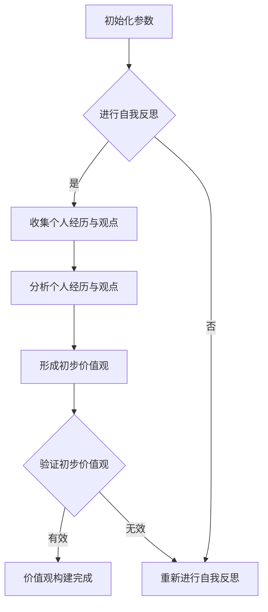

                 

### 第1章 引言

#### 1.1 问题的背景

在当今这个急剧变化的时代，个人价值观的构建面临着前所未有的挑战。科技的飞速发展、全球化的不断深化以及信息爆炸，使得人们的生活方式、思维方式和社会结构都在发生深刻变化。传统的社会价值观面临着前所未有的冲击，个体在价值取向上的独立性、多元性和复杂性日益凸显。如何在纷繁复杂的环境中形成一套独特的人生哲学，构建稳固的个人价值观，成为现代人必须面对的重要问题。

首先，时代变革对个人价值观提出了更高的要求。在快速变化的社会背景下，人们需要更加灵活和多元的价值观来适应不同的环境和情境。传统的单一价值观已经难以满足个体在不同生活阶段和不同社会角色中的需求。其次，现代社会中个人价值观的构建受到多重因素的干扰。社交媒体、流行文化、商业广告等都在潜移默化地影响着人们的价值观念。如何在这些外部因素的干扰下保持独立和清晰的个人价值观，成为个体面临的难题。

#### 1.1.2 个人价值观构建的重要性

个人价值观的构建对个体的生活具有深远的影响。首先，个人价值观是决定个体行为和决策的核心因素。一个人的行为方式、生活方式甚至人生目标，都是由其内在的价值观所驱动的。一个清晰的、稳固的个人价值观可以帮助个体在面对复杂问题和困境时，做出更加明智和符合自身原则的决策。其次，个人价值观对个体的心理健康具有重要影响。一个健康、稳定的价值观体系可以减少内心的冲突和焦虑，增强个体的心理韧性和幸福感。

此外，个人价值观的构建对社会的和谐发展也具有重要意义。一个社会中个体价值观的一致性，有助于形成共同的价值观基础，增强社会凝聚力。相反，如果个体价值观存在较大差异，则容易导致社会分裂和矛盾。因此，构建个人价值观不仅是个体自我实现的需要，也是社会和谐发展的需要。

#### 1.1.3 研究目的与意义

本研究旨在探讨如何在当今时代背景下，形成一套独特且稳固的个人价值观。通过对人生哲学和个人价值观的深入分析，本文希望为读者提供一种系统性的价值观构建方法。研究目的如下：

1. **理解人生哲学与个人价值观的基本概念**：通过对人生哲学和个人价值观的基本概念进行梳理和阐述，帮助读者建立对这些核心概念的基本认识。

2. **分析个人价值观的构成与影响因素**：通过深入探讨个人价值观的构成要素及其影响因素，帮助读者理解个人价值观是如何形成的，以及哪些因素可能对个人价值观产生影响。

3. **提出一套有效的价值观构建方法**：结合心理学、哲学和社会学的相关理论，提出一套科学、系统的价值观构建方法，帮助读者在实践中构建符合自身特点的价值观。

4. **探讨价值观构建对个体和社会的影响**：分析个人价值观对个体心理健康、行为决策以及社会和谐发展的影响，为个体和社会价值观的构建提供理论依据。

本文的研究意义在于，通过深入探讨个人价值观的构建，为个体提供一套实用的价值观构建方法，帮助他们在复杂多变的社会环境中保持内心的稳定和清晰。同时，本文的研究也为社会价值观的构建提供参考，有助于形成具有包容性、多元性和稳定性的社会价值观体系。

### 1.2 核心概念

#### 1.2.1 人生哲学的定义与特征

人生哲学，也称为人生观，是关于个体如何看待人生、如何应对人生挑战和如何实现人生价值的根本性思考。它不仅涵盖了个体对生命的理解，还包括对个人价值观、道德观和生活方式的思考和选择。

**定义**：
人生哲学是一种对人生进行深度反思和系统思考的哲学形式，它涉及对人生目的、意义、价值、幸福和自由等基本问题的探讨。人生哲学旨在为个体提供一种全面的生活指导，帮助个体在面对复杂多变的生活情境时，能够做出符合自身价值观的决策。

**特征**：

1. **系统性**：人生哲学不是零散的思想碎片，而是一个有机的整体。它需要系统地回答人生中的基本问题，形成一个完整的思想体系。

2. **主观性**：每个人的生活经验和背景不同，因此人生哲学具有强烈的主观性。不同的人会根据自己的生活经历和价值观，形成独特的人生哲学。

3. **反思性**：人生哲学强调对人生的深度反思。通过反思，个体能够更加清晰地认识自己的价值观和生活方式，从而更好地指导自己的行为。

4. **指导性**：人生哲学不仅是一种思想体系，更是一种行动指南。它为个体提供了一种行为准则，帮助个体在现实生活中做出明智的选择。

#### 1.2.2 个人价值观的构成与内涵

个人价值观是人生哲学的核心组成部分，它决定了个体对事物和行为的判断标准。个人价值观不仅影响个体的行为决策，还反映了个体的生活态度和人生目标。

**构成**：

1. **道德观**：道德观是个人价值观的重要组成部分，它涉及个体对善恶、正义和道德规范的认知和评价。

2. **人生观**：人生观是个体对人生目的、意义和价值的认知。它决定了个体如何看待自己和他人的生活，以及如何追求幸福和成功。

3. **世界观**：世界观是个人价值观的宏观层面，它涉及个体对世界本质和宇宙规律的认知。世界观会影响个体对社会的态度和对自然界的尊重。

**内涵**：

1. **内在一致性**：个人价值观应该内在一致，即不同层面的价值观应该相互协调，形成一个统一的思想体系。

2. **个人化**：个人价值观具有强烈的个人化特征，它反映了个体独特的成长背景、生活经历和个性特点。

3. **动态性**：个人价值观不是一成不变的，它会在个体成长和经历变化的过程中不断调整和发展。

#### 1.2.3 个人价值观与人生哲学的关系

个人价值观与人生哲学密切相关，它们相互影响、相互塑造。

1. **个人价值观对人生哲学的支撑**：个人价值观是人生哲学的基石，它为人生哲学提供了具体的实践方向和行为准则。

2. **人生哲学对个人价值观的指导**：人生哲学为个人价值观提供了理论依据和思想框架，帮助个体更好地理解自己的价值观，并在实践中加以落实。

3. **相互作用**：个人价值观和人生哲学是一个互动的过程。个体的生活经验和环境变化会不断影响其价值观，而价值观的变化又会反过来影响人生哲学。

通过以上对人生哲学和个人价值观的深入分析，我们可以看到，这两者不仅是理解个体行为和决策的重要概念，也是构建独特且稳固个人价值观的关键。在接下来的章节中，我们将进一步探讨个人价值观的构成要素、影响因素以及构建方法，帮助读者在实践中更好地应用这些概念。

### 1.3 边界与外延

#### 1.3.1 个人价值观的范畴

个人价值观是一个广泛的概念，它涵盖了个体的道德观、人生观、世界观等多个层面。具体来说，个人价值观的范畴可以分为以下几个方面：

1. **道德价值观**：这是个人价值观的核心组成部分，涉及个体对善恶、正义和道德规范的认知和评价。例如，诚信、尊重、公正等都是常见的道德价值观。

2. **人生价值观**：这反映了个体对人生目的、意义和价值的理解。例如，追求幸福、实现自我价值、贡献社会等都是人生价值观的具体体现。

3. **世界观**：这是个体对世界本质和宇宙规律的认知。世界观会影响个体对社会的态度和对自然界的尊重。例如，自由主义、集体主义等都是世界观的具体体现。

4. **职业价值观**：这是个体在职业生涯中追求的价值和目标。例如，创新、成就、稳定等都是职业价值观的具体体现。

5. **消费价值观**：这是个体在消费活动中表现出的价值观。例如，环保、节约、享受等都是消费价值观的具体体现。

#### 1.3.2 个人价值观的影响因素

个人价值观的形成受到多种因素的影响，主要包括以下几个方面：

1. **家庭背景**：家庭是个人价值观形成的第一环境。家庭的教育方式、父母的价值观以及家庭成员之间的互动，都会对个人的价值观产生深远影响。

2. **教育经历**：教育是个人价值观形成的重要途径。学校教育、社会教育、自我教育等不同形式的教育都会对个人的价值观产生重要影响。

3. **社会文化**：社会文化是一个人成长的社会背景，它包含了一个社会的价值观念、道德规范和行为习惯。社会文化会通过社会交往、媒体传播等方式影响个人的价值观。

4. **个人经历**：个人的生活经历，特别是关键经历，会对其价值观产生重要影响。例如，一次失败的经历可能会让一个人更加珍惜成功，而一次成功的经历可能会让其更加自信和乐观。

5. **心理状态**：个人的心理状态，如情绪、性格、自我认知等，也会影响其价值观的形成。一个心理健康、自我认知清晰的个体，往往会形成更加稳定和清晰的价值观。

#### 1.3.3 个人价值观的实践意义

个人价值观在个体生活中具有非常重要的实践意义，主要体现在以下几个方面：

1. **指导行为**：个人价值观为个体的行为提供了明确的指导。一个明确的价值观可以帮助个体在面对复杂情境时，做出符合自身原则的决策。

2. **增强心理韧性**：一个稳固的价值观体系可以增强个体的心理韧性，帮助个体在面对挫折和困难时，保持积极的态度和行动。

3. **促进自我实现**：个人价值观是实现自我价值的重要基础。一个明确的价值观可以帮助个体更好地了解自己的优势和潜力，从而实现自我价值的最大化。

4. **建立人际关系**：个人价值观是建立健康人际关系的重要基石。一个有明确价值观的个体，往往能够与他人建立更加稳定和深刻的人际关系。

5. **推动社会进步**：一个社会中个体价值观的一致性，有助于形成共同的社会价值观基础，推动社会的和谐发展和进步。

综上所述，个人价值观的范畴广泛，影响因素多样，实践意义深远。在接下来的章节中，我们将进一步探讨个人价值观的构建方法和影响因素，帮助读者在实践中更好地理解和应用这些概念。

### 1.4 概念结构与核心要素

#### 1.4.1 个人价值观的核心要素

个人价值观是一个多层次、多维度的复杂结构，其核心要素主要包括以下几个方面：

1. **道德价值观**：道德价值观是个人价值观的基础，它涉及到个体对道德规范、善恶判断和正义的认识。例如，诚信、尊重、公正等都是常见的道德价值观。

2. **人生价值观**：人生价值观是个人价值观的核心，它反映了个体对人生目的、意义和价值的理解。例如，追求幸福、实现自我价值、贡献社会等都是人生价值观的具体体现。

3. **世界观**：世界观是个人价值观的宏观层面，它涉及到个体对世界本质和宇宙规律的认知。世界观会影响个体对社会的态度和对自然界的尊重。

4. **职业价值观**：职业价值观是个人价值观在职业领域的具体体现，它涉及到个体对职业选择、职业态度和职业发展的理解。例如，创新、成就、稳定等都是职业价值观的具体体现。

5. **消费价值观**：消费价值观是个人价值观在消费领域的具体体现，它涉及到个体在消费活动中的价值取向和行为方式。例如，环保、节约、享受等都是消费价值观的具体体现。

#### 1.4.2 个人价值观的层次结构

个人价值观的层次结构可以分为以下几个层次：

1. **基础层次**：这是个人价值观的最基本层次，主要包括道德价值观。这个层次决定了个体对事物的基本判断和道德选择。

2. **核心层次**：核心层次包括人生价值观和世界观。这个层次反映了个体对人生和社会的根本认知，是个人价值观的核心。

3. **应用层次**：应用层次包括职业价值观和消费价值观。这个层次将个人价值观的具体体现到不同的生活领域，如职业选择、消费行为等。

#### 1.4.3 个人价值观与心理发展的关系

个人价值观与个体的心理发展密切相关，主要表现在以下几个方面：

1. **自我认同**：个人价值观为个体提供了自我认同的基础。一个明确的价值观可以帮助个体更好地认识自己，形成稳定的自我概念。

2. **心理适应**：个人价值观对个体的心理适应有重要影响。一个稳固的价值观体系可以帮助个体在面对挑战和困难时，保持积极的态度和行动。

3. **心理健康**：个人价值观与心理健康有着密切的关系。一个健康的价值观体系可以增强个体的心理韧性，减少心理压力和焦虑。

4. **社会适应**：个人价值观不仅影响个体的内心世界，还影响其社会适应能力。一个明确的价值观可以帮助个体更好地融入社会，建立和谐的人际关系。

综上所述，个人价值观是一个多层次、多维度的复杂结构，其核心要素和层次结构对个体的心理发展和行为决策具有深远影响。在接下来的章节中，我们将进一步探讨如何构建一套独特且稳固的个人价值观，以帮助读者在现实生活中更好地应用这些概念。

### 1.5 本章小结

本章从多个角度探讨了个人价值观构建的重要性。首先，我们分析了时代变革对个人价值观的挑战，强调了在快速变化的社会环境中，构建稳固个人价值观的必要性。接着，我们深入探讨了人生哲学和个人价值观的基本概念，分析了它们的核心要素和相互关系。随后，我们讨论了个人价值观的范畴、影响因素和实际意义。最后，我们提出了个人价值观的层次结构和核心要素，并探讨了个人价值观与心理发展的关系。通过这些分析，我们为读者提供了一个系统性的价值观构建框架，以帮助他们更好地理解个人价值观的构建过程。这些研究不仅有助于个体在复杂的社会环境中保持清晰的价值观，也为社会的和谐发展提供了理论支持。

--------------------------------------

### 第2章 核心概念与联系

#### 2.1 人生哲学的基本概念

人生哲学，也称为人生观，是对人生基本问题进行系统思考和深入反思的哲学形式。它涉及对人生目的、意义、价值、幸福和自由等问题的探讨，旨在为个体提供一种全面的生活指导。

**定义与特点**：

- **定义**：人生哲学是一种关于人生基本问题的根本性思考，它试图回答诸如“人为什么存在？”、“人生有何意义？”和“我们应该如何生活？”等问题。
- **特点**：
  - **系统性**：人生哲学不是零散的思想碎片，而是一个有机的整体。它需要系统地回答人生中的基本问题，形成一个完整的思想体系。
  - **主观性**：由于每个人的生活经历和背景不同，因此人生哲学具有强烈的主观性。不同的人会根据自己的经历和价值观，形成独特的人生哲学。
  - **反思性**：人生哲学强调对人生的深度反思。通过反思，个体能够更加清晰地认识自己的价值观和生活方式，从而更好地指导自己的行为。
  - **指导性**：人生哲学不仅是一种思想体系，更是一种行动指南。它为个体提供了一种行为准则，帮助个体在现实生活中做出明智的选择。

**核心要素**：

1. **人生目的**：这是人生哲学的基础，涉及个体对生命存在的意义和目标的认知。例如，一些人认为人生目的是追求幸福，而另一些人则认为人生目的是服务社会或实现自我价值。

2. **人生意义**：这是个体对人生中各种经历赋予的意义的理解。例如，一次失败的经历可能会被视为一次学习和成长的机会。

3. **价值观**：这是个体对事物和行为的判断标准。价值观包括道德价值观、人生价值观、世界观、职业价值观和消费价值观等，它们共同构成了个体的价值观体系。

4. **幸福观**：这是个体对幸福的理解和追求。例如，一些人认为幸福是通过物质享受实现的，而另一些人则认为幸福是通过精神满足实现的。

5. **自由观**：这是个体对自由的理解和追求。自由观涉及到个体在人生中的选择权和行动自由，它是个体实现自我价值的重要保障。

**类型与演变**：

1. **传统型人生哲学**：这是指在传统社会中形成的人生哲学，其核心是尊重传统、社会秩序和家庭价值。传统型人生哲学强调个体的责任和义务，追求社会的和谐与稳定。

2. **现代型人生哲学**：这是指在现代社会中形成的人生哲学，其核心是个体的自由、平等和自我实现。现代型人生哲学强调个体的权利和自由，追求个人的幸福和自我价值的实现。

3. **后现代型人生哲学**：这是指在后现代社会中形成的人生哲学，其核心是对传统和现代价值观的批判和反思。后现代型人生哲学强调个体在不确定性和多元性中的存在，追求一种更加灵活和包容的生活方式。

#### 2.2 个人价值观的概念解析

个人价值观是指个体对事物和行为的判断标准，它是人生哲学的核心组成部分，决定了个体在现实生活中的行为方式和生活方式。

**内涵与特征**：

- **内涵**：
  - **道德价值观**：涉及个体对道德规范和道德行为的认知和评价。
  - **人生价值观**：涉及个体对人生目的、意义和价值的理解。
  - **世界观**：涉及个体对世界本质和宇宙规律的认知。
  - **职业价值观**：涉及个体对职业选择、职业态度和职业发展的理解。
  - **消费价值观**：涉及个体在消费活动中的价值取向和行为方式。

- **特征**：
  - **内在一致性**：个人价值观应该内在一致，即不同层面的价值观应该相互协调，形成一个统一的思想体系。
  - **个人化**：个人价值观具有强烈的个人化特征，它反映了个体独特的成长背景、生活经历和个性特点。
  - **动态性**：个人价值观不是一成不变的，它会在个体成长和经历变化的过程中不断调整和发展。

**构成要素**：

1. **道德要素**：包括诚信、尊重、公正、责任感等。
2. **人生要素**：包括追求幸福、实现自我价值、为社会做贡献等。
3. **世界观要素**：包括对世界的认知、对自然界的尊重、对社会的态度等。
4. **职业要素**：包括创新、成就、稳定、贡献等。
5. **消费要素**：包括环保、节约、享受、质量等。

**类型与差异**：

1. **传统型个人价值观**：这种价值观强调传统道德和社会责任，重视家庭和集体，追求稳定和和谐。

2. **现代型个人价值观**：这种价值观强调个体的自由、平等和自我实现，重视个人权利和自由，追求个性发展和自我价值实现。

3. **后现代型个人价值观**：这种价值观强调对传统和现代价值观的批判和反思，追求在不确定性和多元性中的生存和发展，强调个体差异和多样性。

#### 2.3 个人价值观与人生哲学的联系

个人价值观与人生哲学密切相关，它们相互影响、相互塑造。

**个人价值观对人生哲学的影响**：

- **行为指导**：个人价值观对个体的行为具有指导作用。一个明确的价值观可以帮助个体在面对复杂情境时，做出符合自身原则的决策。
- **思想框架**：个人价值观为人生哲学提供了具体的思想框架和行动指南，使人生哲学更加具体和实用。

**人生哲学对个人价值观的塑造**：

- **理论依据**：人生哲学为个人价值观提供了理论基础和思想框架，帮助个体更好地理解自己的价值观，并在实践中加以落实。
- **指导方向**：人生哲学为个体提供了生活指导，帮助个体在实现自我价值和社会责任之间找到平衡，形成更加稳定和清晰的价值观。

**个人价值观与人生哲学的互动关系**：

- **相互作用**：个人价值观和人生哲学是一个互动的过程。个体的生活经验和环境变化会不断影响其价值观，而价值观的变化又会反过来影响人生哲学。
- **动态调整**：个人价值观和人生哲学不是一成不变的，它们会在个体成长和经历变化的过程中不断调整和发展。

通过以上对人生哲学和个人价值观的深入分析，我们可以看到，这两者不仅是理解个体行为和决策的重要概念，也是构建独特且稳固个人价值观的关键。在接下来的章节中，我们将进一步探讨个人价值观的构成要素、影响因素以及构建方法，帮助读者在实践中更好地应用这些概念。

#### 2.4 概念属性特征对比表格

在深入探讨人生哲学和个人价值观的概念后，为了更清晰地理解两者之间的区别与联系，我们可以通过对比表格的形式，列举它们的主要属性和特征。以下是一个简化的对比表格，展示人生哲学和个人价值观的不同方面：

| **属性** | **人生哲学** | **个人价值观** |
|-----------|----------------|----------------|
| **定义** | 对人生基本问题的系统性思考 | 对事物和行为的判断标准 |
| **特点** | 系统性、主观性、反思性、指导性 | 内在一致性、个人化、动态性 |
| **核心要素** | 人生目的、意义、价值观、幸福观、自由观 | 道德价值观、人生价值观、世界观、职业价值观、消费价值观 |
| **层次结构** | 基础层次、核心层次、应用层次 | 道德、人生、世界观、职业、消费 |
| **影响** | 指导行为、增强心理韧性、促进自我实现、建立人际关系、推动社会进步 | 支撑人生哲学、影响行为决策、反映生活态度、实现个人价值 |
| **类型** | 传统型、现代型、后现代型 | 传统型、现代型、后现代型 |

**对比分析**：

1. **定义与范围**：
   - 人生哲学是关于人生基本问题的系统性思考，具有更宏观的视野，涵盖对生命、价值、自由等问题的深入探讨。
   - 个人价值观则是针对具体事物和行为的判断标准，更侧重于个体的行为指南和生活态度。

2. **特点与要素**：
   - 人生哲学强调系统性、主观性、反思性和指导性，其核心要素包括人生目的、意义、价值观、幸福观和自由观。
   - 个人价值观则更注重内在一致性、个人化、动态性，其构成要素涵盖道德、人生、世界观、职业和消费等多个方面。

3. **影响与类型**：
   - 人生哲学对个体的行为、心理韧性、自我实现、人际关系和社会进步具有深远影响，可以表现为传统型、现代型和后现代型。
   - 个人价值观则对行为决策、生活态度、个人价值的实现产生直接影响，同样可以体现为传统型、现代型和后现代型。

通过上述对比，我们可以更清晰地看到人生哲学和个人价值观的异同点，从而更好地理解它们在个体生活和哲学思考中的重要作用。

#### 2.5 本章小结

本章通过深入探讨人生哲学和个人价值观的基本概念、特征、层次结构以及相互关系，为读者提供了一套清晰的理论框架。首先，我们详细分析了人生哲学的定义、特点、核心要素和类型，揭示了其宏观和系统性的特点。接着，我们解析了个人价值观的内涵、特征、构成要素和类型，并强调了其个人化和动态性的特性。随后，我们通过对比表格，进一步明确了人生哲学和个人价值观之间的异同点，帮助读者更深入地理解两者的关系。最后，我们讨论了个人价值观与人生哲学的互动关系，指出它们在个体行为、心理发展和社会适应中的重要作用。通过这些分析，读者可以更加系统地认识和理解个人价值观的构建过程，为自身价值观的塑造提供理论支持和实践指导。

--------------------------------------

### 第3章 算法原理讲解

#### 3.1 价值观构建算法概述

价值观构建算法是一种通过系统化方法帮助个体建立稳固个人价值观的方法。它基于心理学、哲学和社会学等相关理论，旨在通过一系列步骤和策略，帮助个体在实践中逐步形成和优化自己的价值观。

**定义与目的**：

- **定义**：价值观构建算法是一种利用数学模型和逻辑推理，帮助个体系统性地分析和构建个人价值观的方法。
- **目的**：价值观构建算法的目的是通过科学、系统的过程，帮助个体理解自己的价值观，并使其在复杂多变的社会环境中保持清晰和稳定。

**基本原理**：

价值观构建算法的基本原理可以分为以下几个步骤：

1. **自我反思**：通过自我反思，个体可以深入分析自己的成长经历、行为模式和内心需求，从而明确自己的价值观基础。
2. **数据收集**：收集与个体价值观相关的数据，包括个人经历、观点、行为和社会环境等。
3. **分析数据**：对收集到的数据进行分析，识别出个体的核心价值观和潜在价值观冲突。
4. **构建模型**：基于分析结果，构建一个反映个体价值观的数学模型，该模型可以用来模拟和预测个体在不同情境下的行为和决策。
5. **验证与优化**：通过实践检验和反馈，不断优化和调整价值观模型，确保其能够准确反映个体的价值观。

**类型与应用场景**：

价值观构建算法可以根据应用场景和目标的不同，分为以下几种类型：

1. **自我评估型**：适用于个体自我探索和价值观构建的初期阶段，通过问卷调查、心理测试等方法，帮助个体识别和明确自己的价值观。
2. **互动型**：通过个体与他人的互动，特别是在心理咨询和教练辅导中，帮助个体在交流和反馈中调整和优化自己的价值观。
3. **情境模拟型**：通过模拟不同生活和工作情境，帮助个体在虚拟环境中测试和调整自己的价值观，以提高其在现实生活中的决策能力和适应性。

**实际应用**：

价值观构建算法可以应用于多个领域，包括个人发展、团队建设、企业文化建设等。以下是一些具体的实际应用场景：

1. **个人发展**：通过自我评估和互动型算法，帮助个人在职业发展和人生规划中明确自己的价值观，从而做出更加符合自身原则的决策。
2. **团队建设**：通过互动型和情境模拟型算法，帮助团队在价值观上达成一致，增强团队凝聚力和协作能力。
3. **企业文化**：通过自我评估和互动型算法，帮助企业在文化建设中明确核心价值观，并确保员工在行为和决策上与企业文化保持一致。

通过价值观构建算法，个体和组织可以在复杂多变的环境中，保持清晰的价值观导向，实现更加稳定和和谐的发展。

#### 3.2 价值观构建算法的mermaid流程图

为了更好地理解价值观构建算法的步骤和流程，我们可以使用mermaid语言绘制一个详细的流程图。以下是一个简化的mermaid流程图，展示价值观构建算法的主要步骤：

**流程图解析**：

1. **初始化参数**：在这个步骤中，算法初始化参数，包括自我反思的频率、数据收集的范围和分析方法等。

2. **进行自我反思**：个体通过反思自己的成长经历、行为模式和心理需求，初步识别出自己的价值观基础。

3. **收集个人经历与观点**：根据自我反思的结果，个体开始收集与价值观相关的数据，如个人经历、观点和行为。

4. **分析个人经历与观点**：对这些收集到的数据进行分析，识别出个体的核心价值观和潜在的价值冲突。

5. **形成初步价值观**：根据分析结果，构建一个初步的价值观模型，这个模型反映了个体当前的核心价值观和潜在的价值观矛盾。

6. **验证初步价值观**：通过实践和反馈，验证初步价值观的有效性。这一步骤可以包括自我测试、与他人互动或情境模拟。

7. **价值观构建完成**：如果初步价值观通过验证，则价值观构建过程完成。否则，需要重新进行自我反思和分析。

通过这个流程图，我们可以清晰地看到价值观构建算法的每个步骤及其相互关系，从而更好地理解算法的工作原理和应用方法。

#### 3.3 算法原理的数学模型和公式

为了更深入地理解价值观构建算法的原理，我们可以引入数学模型和公式来描述其核心过程。

**价值观构建的数学模型**：

价值观构建的数学模型可以表示为：

\[ V = f(P, E, S) \]

其中：

- \( V \) 表示个体最终的价值观。
- \( P \) 表示个人经历，包括成长背景、教育经历、职业经历等。
- \( E \) 表示个人观点，包括个体对事物的看法、信念和价值观。
- \( S \) 表示社会环境，包括家庭、社会文化、社会规范等。

**价值观构建的公式详解**：

\[ f(P, E, S) = \sum_{i=1}^{n} w_i \cdot p_i \cdot e_i \cdot s_i \]

其中：

- \( w_i \) 表示权重，用于衡量个人经历、观点和社会环境在价值观构建过程中的相对重要性。
- \( p_i \) 表示个人经历的权重和值，反映个体在各个经历上的强度和重要性。
- \( e_i \) 表示个人观点的权重和值，反映个体对各个观点的重视程度。
- \( s_i \) 表示社会环境的权重和值，反映社会环境在价值观构建中的影响。

这个公式表明，个体的价值观是通过个人经历、观点和社会环境的综合作用形成的。每个因素的权重和值都会影响最终的价值观结果。通过调整这些权重和值，个体可以优化和调整自己的价值观。

**示例**：

假设一个学生在个人经历、观点和社会环境方面如下：

- **个人经历**：学习、工作、娱乐
- **个人观点**：勤奋、诚实、友善
- **社会环境**：家庭支持、学校教育、社会风气

通过算法计算，可以得出该学生的价值观：

\[ V = f(P, E, S) = 0.4 \cdot p_1 \cdot e_1 \cdot s_1 + 0.3 \cdot p_2 \cdot e_2 \cdot s_2 + 0.3 \cdot p_3 \cdot e_3 \cdot s_3 \]

其中：

- \( p_1, p_2, p_3 \) 分别代表学习、工作、娱乐的权重。
- \( e_1, e_2, e_3 \) 分别代表勤奋、诚实、友善的权重。
- \( s_1, s_2, s_3 \) 分别代表家庭支持、学校教育、社会风气的权重。

通过这个示例，我们可以看到如何通过数学模型和公式来计算个体的价值观。这个模型和公式为个体提供了一个量化的方法，以便更好地理解和调整自己的价值观。

#### 3.4 算法举例说明

为了更好地理解价值观构建算法的具体应用，我们可以通过一个实际例子来说明。

**例子**：一个年轻人在经历、观点和社会环境方面的数据如下：

- **个人经历**：
  - 学习：高中毕业、大学本科、研究生阶段
  - 工作：实习、全职工作
  - 娱乐：旅行、阅读、运动

- **个人观点**：
  - 勤奋：重视努力和付出，认为努力是成功的关键
  - 诚实：重视诚信，认为诚实是人格的核心
  - 友善：重视人际关系，认为友善是建立和谐关系的基础

- **社会环境**：
  - 家庭支持：来自有爱的家庭，家庭鼓励学习和个人发展
  - 学校教育：注重实践和创新能力，提供多样化的学习机会
  - 社会风气：社会普遍重视教育，尊重勤奋和诚实

**步骤 1：初始化参数**：
- 设定自我反思频率为每月一次。
- 设定数据收集范围为过去三年的个人经历、观点和行为。

**步骤 2：进行自我反思**：
- 年轻人通过反思，回顾自己的成长经历、行为模式和内心需求，初步识别出自己的价值观基础。

**步骤 3：收集个人经历与观点**：
- 年轻人开始收集与价值观相关的数据，包括：
  - 学习经历：高考成绩、毕业论文、实习报告
  - 工作经历：工作绩效、同事评价、领导反馈
  - 娱乐经历：旅行日记、阅读笔记、运动记录

**步骤 4：分析个人经历与观点**：
- 年轻人对收集到的数据进行详细分析，识别出自己的核心价值观和潜在价值观冲突。例如：
  - 勤奋：通过分析学习经历和工作表现，确认勤奋是其核心价值观。
  - 诚实：通过分析工作中与同事和客户的互动，确认诚实是其核心价值观。
  - 友善：通过分析社交活动和人际关系，确认友善是其核心价值观。

**步骤 5：形成初步价值观**：
- 基于分析结果，年轻人构建一个初步的价值观模型，该模型反映了其当前的核心价值观：
  - \( V = 0.5 \cdot \text{勤奋} + 0.3 \cdot \text{诚实} + 0.2 \cdot \text{友善} \)

**步骤 6：验证初步价值观**：
- 年轻人通过实践和反馈，验证初步价值观的有效性。例如：
  - 在工作中，年轻人通过积极努力和诚实待人，得到了同事和领导的认可。
  - 在社交中，年轻人通过友善和关心他人，建立了良好的社交关系。

**步骤 7：价值观构建完成**：
- 经过验证，年轻人确认初步价值观的有效性，价值观构建过程完成。该价值观模型可以用来指导其未来的行为和决策。

通过这个例子，我们可以看到价值观构建算法在实际应用中的具体步骤和过程。年轻人通过自我反思、数据收集、分析、验证和优化，逐步构建出一套符合自身特点的价值观体系，从而在复杂多变的社会环境中保持清晰和稳定的价值观导向。

#### 3.5 本章小结

本章详细介绍了价值观构建算法的基本概念、原理、流程图以及数学模型。首先，我们阐述了价值观构建算法的定义和目的，探讨了其基本原理和类型。接着，通过mermaid流程图，我们展示了算法的具体步骤和流程，帮助读者直观理解其运作过程。然后，我们引入了数学模型和公式，详细解释了价值观构建的数学原理，并通过一个实际例子，说明了算法的具体应用。最后，本章总结了价值观构建算法在实际应用中的意义和作用。通过本章的学习，读者可以更好地理解价值观构建的原理和方法，为自身价值观的构建提供有效的工具和指导。

