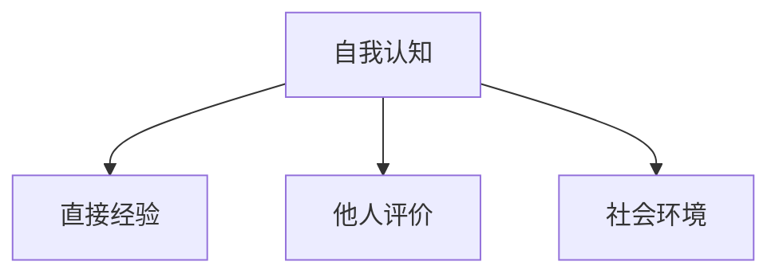
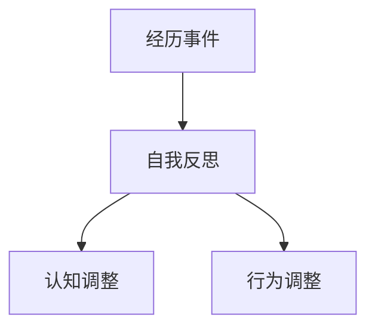
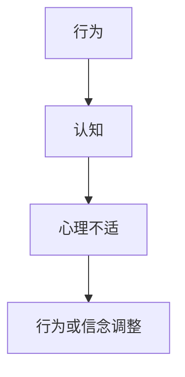
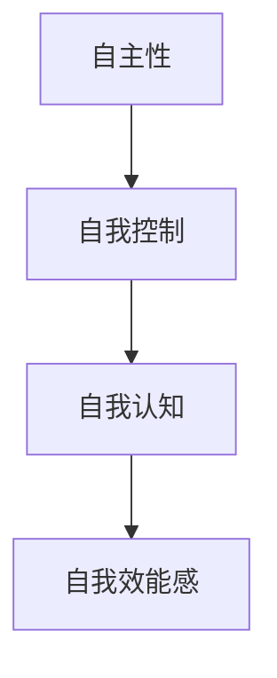
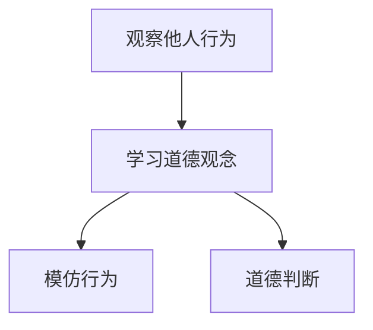
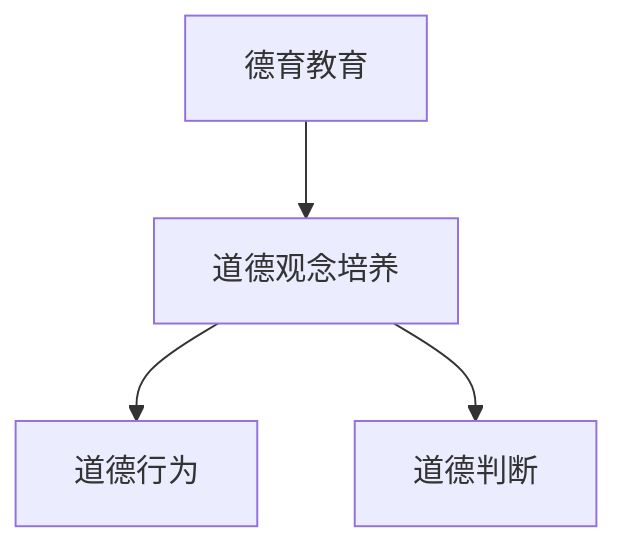
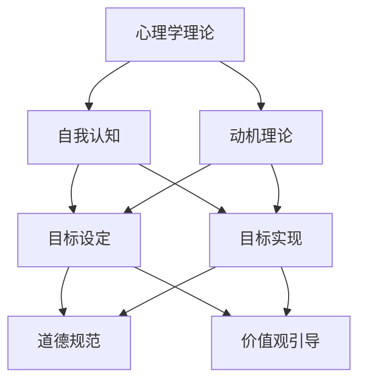

                 

## 第2章: 核心概念与联系

### 2.1 自我认知

自我认知是指个体对自身存在的认知，包括对自身性格、能力、优点、缺点的认识。在个人价值观的构建过程中，自我认知是一个基础而重要的环节。它不仅影响个体如何看待自己，还影响个体如何与其他人和事物互动。

**概念属性特征对比表格**

| 概念 | 定义 | 属性特征 |
| --- | --- | --- |
| 自我认知 | 个体对自身存在的认知 | 包括性格、能力、优点、缺点 |
| 道德观念 | 个体在行为和思想中遵循的道德规范和原则 | 包括道德规范、道德原则 |
| 人生目标 | 个体对未来的期望和追求 | 包括个人成就、社会地位、生活品质 |

**ER实体关系图架构**

```mermaid
erDiagram
  个人价值观 ||--|{ 自我认知 }
  个人价值观 ||--|{ 道德观念 }
  个人价值观 ||--|{ 人生目标 }
```

### 2.2 道德观念

道德观念是指个体在行为和思想中遵循的道德规范和原则。道德观念不仅指导个体的行为，还影响个体的内心世界。不同的文化和社会环境会产生不同的道德观念，而个体在成长过程中也会通过教育、家庭和社会互动等方式逐渐形成自己的道德观念。

**概念属性特征对比表格**

| 概念 | 定义 | 属性特征 |
| --- | --- | --- |
| 自我认知 | 个体对自身存在的认知 | 包括性格、能力、优点、缺点 |
| 道德观念 | 个体在行为和思想中遵循的道德规范和原则 | 包括道德规范、道德原则 |
| 人生目标 | 个体对未来的期望和追求 | 包括个人成就、社会地位、生活品质 |

**ER实体关系图架构**

```mermaid
erDiagram
  个人价值观 ||--|{ 自我认知 }
  个人价值观 ||--|{ 道德观念 }
  个人价值观 ||--|{ 人生目标 }
```

### 2.3 人生目标

人生目标是个人价值观的重要组成部分，它反映了个体对未来的期望和追求。人生目标通常包括个人成就、社会地位、生活品质等方面。个体的人生目标会影响其价值观的选择和行为的方向，从而影响其个人发展。

**概念属性特征对比表格**

| 概念 | 定义 | 属性特征 |
| --- | --- | --- |
| 自我认知 | 个体对自身存在的认知 | 包括性格、能力、优点、缺点 |
| 道德观念 | 个体在行为和思想中遵循的道德规范和原则 | 包括道德规范、道德原则 |
| 人生目标 | 个体对未来的期望和追求 | 包括个人成就、社会地位、生活品质 |

**ER实体关系图架构**

```mermaid
erDiagram
  个人价值观 ||--|{ 自我认知 }
  个人价值观 ||--|{ 道德观念 }
  个人价值观 ||--|{ 人生目标 }
```

### 2.4 概念属性特征对比表格

在探讨个人价值观的核心概念时，使用对比表格有助于更直观地理解各个概念之间的差异和联系。以下是一个简化的概念属性特征对比表格，展示了自我认知、道德观念和人生目标的基本属性特征。

| 概念         | 定义                                                         | 属性特征                                                  |
| ------------ | ------------------------------------------------------------ | -------------------------------------------------------- |
| 自我认知     | 个体对自身存在的认知，包括性格、能力、优点、缺点。             | 性格、能力、优点、缺点、自我反思、自我评价                |
| 道德观念     | 个体在行为和思想中遵循的道德规范和原则。                     | 道德规范、道德原则、道德判断、道德实践、文化背景、教育影响 |
| 人生目标     | 个体对未来的期望和追求，包括个人成就、社会地位、生活品质。   | 个人成就、社会地位、生活品质、目标设定、目标实现、持续调整 |

### 2.5 ER实体关系图架构

为了更好地理解个人价值观内部各核心概念之间的联系，我们可以使用ER（Entity-Relationship）实体关系图来展示它们之间的关系。以下是个人价值观、自我认知、道德观念和人生目标之间的ER图结构：

```mermaid
erDiagram
  个人价值观 ||--|{ 自我认知 } : 包含
  个人价值观 ||--|{ 道德观念 } : 包含
  个人价值观 ||--|{ 人生目标 } : 包含
```

在这个ER图中，个人价值观作为主实体，与自我认知、道德观念和人生目标形成包含关系。这些核心概念相互影响，共同构建了个人价值观的整体结构。

### 2.6 概念之间的相互作用

个人价值观的各个核心概念之间并不是孤立的，而是相互影响、相互作用的。自我认知为道德观念和人生目标的构建提供了基础，道德观念指导个体的行为和决策，而人生目标则为个体的行为提供了方向和动力。

- **自我认知与道德观念：**个体的自我认知会影响其道德观念的形成。例如，一个自我认知较低的人可能会更加关注社会和他人的评价，从而形成更符合社会规范的道德观念。
  
- **道德观念与人生目标：**道德观念会影响个体的人生目标设定和追求方式。一个具有高度道德观念的人可能会追求更高的社会地位和更多的社会责任，以体现其道德价值。

- **人生目标与自我认知：**人生目标会反过来影响个体的自我认知。在追求人生目标的过程中，个体会通过不断的自我反思和自我调整来完善自我认知。

这种相互作用关系展示了个人价值观的动态性和复杂性，强调了在构建个人价值观时需要全面考虑各个核心概念之间的联系。

### 2.7 综合分析

通过上述分析，我们可以看到，自我认知、道德观念和人生目标是构建个人价值观的三个核心概念，它们之间存在着紧密的联系和相互作用。自我认知提供了个体对自身的理解，道德观念指导个体在行为和思想上的选择，人生目标则为个体提供了追求和努力的方向。

- **重要性：**这些核心概念对于个人的生活和发展具有重要意义。自我认知有助于个体明确自己的优势和不足，从而实现自我提升；道德观念引导个体做出正确的道德选择，维护社会秩序；人生目标为个体提供了前进的动力和方向，促进了个人成长。

- **动态性：**个人价值观的构建是一个动态的过程，个体会随着时间和环境的变化不断调整和完善自己的价值观。因此，个人需要持续地自我反思和自我调整，以适应不断变化的社会和个人需求。

- **复杂性：**个人价值观的构建是一个复杂的系统，涉及多个层面的因素。这不仅需要个体自身的努力，还需要社会的支持和引导。因此，社会环境和文化背景也对个人价值观的形成产生重要影响。

通过深入理解这些核心概念及其相互作用，我们可以更好地构建自己的个人价值观，从而实现个人成长和社会进步。在接下来的章节中，我们将进一步探讨个人价值观的构建过程，并提供实用的方法和策略。

----------------------------------------------------------------

## 第3章: 个人价值观构建的理论分析

### 3.1 自我认知的理论分析

自我认知是个体对自身存在的认知，包括对自身性格、能力、优点、缺点的认识。自我认知的形成受到多种因素的影响，包括个体的成长经历、社会互动、自我反思等。以下从几个角度对自我认知的理论进行分析。

#### 3.1.1 社会心理学理论

社会心理学理论认为，自我认知是个体通过社会互动和观察他人来构建的。例如，社会认知理论（Social Cognitive Theory）提出，个体的自我认知不仅来源于自身的直接经验，还受到他人评价和社会环境的影响。个体通过与他人的互动，如观察他人行为、接受他人反馈，来形成对自身的认知。

**图 3.1 社会认知理论示意图**



在社会认知理论中，他人的反馈和评价是自我认知形成的重要来源。例如，当个体得到正面反馈时，可能会增强自我认同感；而当得到负面反馈时，可能会引起自我怀疑。

#### 3.1.2 自我反思理论

自我反思理论强调个体通过自我反思来构建自我认知。自我反思是指个体对自己的思想、行为和经历进行深入思考和评价。自我反思可以帮助个体认识到自己的优点和缺点，从而调整和改进自己的行为。

**图 3.2 自我反思过程示意图**



通过自我反思，个体可以更加客观地认识自己，发现自己的不足，并采取相应的措施进行改进。

#### 3.1.3 认知失调理论

认知失调理论（Cognitive Dissonance Theory）认为，当个体面临不一致的认知时，会产生心理不适，进而促使个体改变行为或信念以减少失调。例如，当个体发现自己的行为与自己的价值观不符时，可能会感到不舒服，从而调整自己的行为或信念以实现一致性。

**图 3.3 认知失调示意图**



认知失调理论说明了自我认知的不一致性如何影响个体的行为和决策。

#### 3.1.4 自我决定理论

自我决定理论（Self-Determination Theory）强调个体的自主性和自我控制对自我认知的影响。该理论认为，个体需要自主地决定自己的行为和目标，以实现自我认知的发展。例如，当个体自主地设定目标并努力实现时，会增强其自我效能感和自我认知。

**图 3.4 自我决定理论示意图**



通过自我决定，个体可以更加积极地参与社会互动和自我反思，从而促进自我认知的构建。

### 3.2 道德观念的理论分析

道德观念是指个体在行为和思想中遵循的道德规范和原则。道德观念的形成和发展受到文化、教育、家庭等多种因素的影响。以下从几个角度对道德观念的理论进行分析。

#### 3.2.1 伦理学理论

伦理学理论提供了关于道德观念形成和发展的深入分析。道德哲学中的各种学派，如功利主义、康德伦理学、义务论等，都对道德观念的形成和判断提供了不同的理论框架。

- **功利主义**：功利主义认为，道德观念的核心是追求最大幸福。个体的行为应该最大化总幸福，从而符合道德标准。

  **图 3.5 功利主义示意图**

  ```mermaid
  graph TB
    A[最大幸福] --> B[道德判断]
    B --> C[行为选择]
  ```

- **康德伦理学**：康德伦理学认为，道德观念基于“道德法则”，个体的行为应该符合普遍的道德原则。例如，“人应该遵守道德法则，而不是为了得到好处。”

  **图 3.6 康德伦理学示意图**

  ```mermaid
  graph TB
    A[道德法则] --> B[行为准则]
    B --> C[道德判断]
  ```

- **义务论**：义务论认为，道德观念是基于道德义务的，个体的行为应该符合道德义务，而不是基于结果。

  **图 3.7 义务论示意图**

  ```mermaid
  graph TB
    A[道德义务] --> B[行为选择]
    B --> C[道德判断]
  ```

#### 3.2.2 社会学习理论

社会学习理论（Social Learning Theory）认为，个体的道德观念是通过观察和模仿他人行为来学习的。例如，班杜拉（Albert Bandura）的观察学习理论强调，个体通过观察他人的行为和结果来学习道德行为。

**图 3.8 观察学习理论示意图**



通过观察和模仿，个体可以逐渐形成自己的道德观念，并内化为自己的行为准则。

#### 3.2.3 教育理论

教育理论对道德观念的形成和发展也具有重要影响。例如，德育理论强调通过教育培养个体的道德意识和道德行为。教育不仅传授知识，还通过价值观的引导来塑造个体的道德观念。

**图 3.9 教育理论示意图**



通过教育，个体可以系统地学习和内化道德规范和原则，从而形成稳定的道德观念。

### 3.3 人生目标的理论分析

人生目标是个人价值观的重要组成部分，它反映了个体对未来的期望和追求。人生目标的形成和发展受到心理学理论和社会学理论的解释。

#### 3.3.1 心理学理论

心理学理论从个体心理的角度分析了人生目标的形成和发展。例如，动机理论（Motivation Theory）认为，人生目标是个体内在动机的体现。个体在追求人生目标的过程中，会经历动机激发、目标设定、目标实现等阶段。

- **动机激发**：个体在面临挑战和机遇时，会被激发出追求目标的动机。

  **图 3.10 动机激发示意图**

  ```mermaid
  graph TB
    A[挑战与机遇] --> B[动机激发]
  ```

- **目标设定**：个体根据自身能力和兴趣设定具体的目标，并制定实现目标的计划。

  **图 3.11 目标设定示意图**

  ```mermaid
  graph TB
    A[能力与兴趣] --> B[目标设定]
  ```

- **目标实现**：个体通过努力和坚持，逐步实现设定的目标。

  **图 3.12 目标实现示意图**

  ```mermaid
  graph TB
    A[努力与坚持] --> B[目标实现]
  ```

#### 3.3.2 社会学理论

社会学理论从社会环境和社会互动的角度分析了人生目标的形成和发展。例如，社会结构理论（Structural Theory）认为，社会结构和关系会影响个体的目标和行为。

- **社会结构**：社会结构包括家庭、教育系统、职业市场等，它为个体提供了目标和行为框架。

  **图 3.13 社会结构示意图**

  ```mermaid
  graph TB
    A[社会结构] --> B[目标框架]
  ```

- **社会互动**：个体的目标和行为受到社会互动的影响。通过与他人交流和合作，个体可以调整和实现自己的目标。

  **图 3.14 社会互动示意图**

  ```mermaid
  graph TB
    A[社会互动] --> B[目标调整]
  ```

### 3.4 个人价值观构建的理论模型

个人价值观的构建是一个复杂的过程，涉及多个理论模型的解释。结合心理学、社会学和伦理学理论，我们可以构建一个综合性的理论模型，用于解释个人价值观的构建机制。

#### 3.4.1 综合理论模型

**图 3.15 个人价值观构建综合理论模型**



在这个综合理论模型中，心理学理论解释了自我认知、动机和目标设定，社会学理论解释了社会互动和社会结构，伦理学理论解释了道德观念和价值观引导。这些理论相互交织，共同构成了个人价值观的构建过程。

#### 3.4.2 模型解释

- **心理学理论**：个体的自我认知和动机是个人价值观构建的基础。自我认知帮助个体了解自己的性格、能力和兴趣，而动机则激发个体追求目标。

- **社会学理论**：社会互动和社会结构为个体的价值观构建提供了环境和框架。社会互动帮助个体学习他人的行为和价值观，而社会结构则为个体提供了社会期望和规范。

- **伦理学理论**：道德观念和价值观引导个体在行为和决策中做出符合道德原则的选择。伦理学理论提供了道德判断和行为准则，帮助个体内化道德观念。

通过这个综合理论模型，我们可以更全面地理解个人价值观的构建过程，以及各个理论模型之间的相互作用。

### 3.5 实践意义

个人价值观的构建理论分析对于实际生活具有重要指导意义。通过理解自我认知、道德观念和人生目标的理论基础，个体可以更有效地构建自己的价值观，并明确自己的行为方向。

- **自我认知**：通过自我反思和观察，个体可以更准确地了解自己的性格、能力和兴趣，从而做出更符合自己特点的决策。

- **道德观念**：了解道德观念的形成过程和原则，个体可以更加自觉地遵循道德规范，做出道德选择。

- **人生目标**：通过设定明确的人生目标和规划实现路径，个体可以更有动力地追求目标，实现个人成长。

在接下来的章节中，我们将进一步探讨个人价值观构建的具体过程和方法，以帮助读者在实际生活中更好地构建和调整自己的价值观。

----------------------------------------------------------------

## 第4章: 个人价值观构建的过程与方法

### 4.1 自我认知的构建过程

自我认知的构建是一个长期而复杂的过程，涉及多个步骤和方法。以下将详细阐述自我认知的构建过程，并提供实用的方法。

#### 4.1.1 自我观察

自我观察是自我认知的起点，它要求个体对自己的行为、思维和情绪进行深入的观察和记录。通过自我观察，个体可以逐渐了解自己的性格、兴趣和习惯。以下是一些自我观察的方法：

- **日记记录**：定期记录自己的日常活动、思考内容和情绪变化，可以帮助个体更好地了解自己。
- **反思日志**：在一天结束时，反思自己当天的重要事件和感受，思考自己的行为和决策背后的动机。
- **行为记录**：记录自己的日常行为，如学习时间、运动时间、社交活动等，可以帮助个体了解自己的时间分配和生活方式。

#### 4.1.2 自我反思

自我反思是自我认知的关键步骤，它要求个体对自身的观察进行深入思考和分析。通过自我反思，个体可以识别自己的优点和不足，从而进行自我调整。以下是一些自我反思的方法：

- **冥想**：通过冥想，个体可以静下心来，深入思考自己的内心世界，识别潜在的情绪和想法。
- **心理测试**：通过心理测试，个体可以了解自己的性格类型、兴趣爱好和潜在的优势与不足。
- **他人反馈**：向朋友、家人或同事寻求反馈，可以帮助个体从外部视角了解自己，发现自己的盲点。

#### 4.1.3 自我评价

自我评价是自我认知的重要环节，它要求个体对自己的行为和表现进行客观评价。通过自我评价，个体可以了解自己的实际表现，并制定改进计划。以下是一些自我评价的方法：

- **设定目标**：为自己设定具体的、可衡量的目标，例如学习一门新技能、阅读一定数量的书籍等。
- **定期回顾**：定期回顾自己的行为和表现，评估自己是否达到设定的目标，并反思其中的得失。
- **自我比较**：将自己与同龄人或竞争对手进行比较，了解自己的优势和不足，从而激发自我提升的动力。

#### 4.1.4 自我调整

自我调整是自我认知的最终目标，它要求个体根据自我评价的结果，采取行动来改进自己的行为和思维。以下是一些自我调整的方法：

- **行动计划**：制定具体的行动计划，将自我评价的结果转化为具体的行动步骤。
- **持续学习**：通过学习新的知识和技能，不断提升自己的能力和素质。
- **心理辅导**：在遇到心理困扰或自我认知问题时，寻求专业心理辅导帮助，以获得更深入的自我认知和调整。

### 4.2 道德观念的构建过程

道德观念的构建过程涉及到个体的道德认知、道德情感和道德行为的培养。以下将详细阐述道德观念的构建过程，并提供实用的方法。

#### 4.2.1 道德认知

道德认知是指个体对道德规范和原则的理解和认识。通过道德认知，个体可以明确什么是正确的行为，什么是错误的行为。以下是一些培养道德认知的方法：

- **学习道德知识**：通过学习伦理学、道德哲学等领域的知识，个体可以了解不同文化和社会背景下的道德观念和规范。
- **阅读经典作品**：阅读经典文学作品，如《道德经》、《论语》等，可以帮助个体理解道德观念的深层含义。
- **讨论和辩论**：参与道德讨论和辩论，可以帮助个体深入思考道德问题，并从不同角度理解道德观念。

#### 4.2.2 道德情感

道德情感是指个体在道德情境下产生的情感体验，如同情、愧疚、自豪等。通过道德情感的培养，个体可以更加自觉地遵循道德规范。以下是一些培养道德情感的方法：

- **感同身受**：通过想象自己处于他人的位置，感受他人的痛苦和快乐，培养同情心。
- **参与公益活动**：参与公益活动，如慈善捐助、环保活动等，可以培养个体的社会责任感和同情心。
- **情感教育**：通过情感教育，如情感表达、情感管理等课程，培养个体的道德情感。

#### 4.2.3 道德行为

道德行为是指个体在道德情境下采取的行为，如帮助他人、遵守规则等。通过道德行为的培养，个体可以将道德观念内化为日常行为。以下是一些培养道德行为的方法：

- **实践道德规范**：在日常生活中，遵循道德规范，如尊重他人、公正待人、诚实守信等。
- **树立榜样**：学习身边的道德榜样，如父母、老师、社会名流等，树立道德行为的榜样。
- **行为训练**：通过行为训练，如角色扮演、道德情境模拟等，培养个体的道德行为。

### 4.3 人生目标的构建过程

人生目标的构建过程涉及到个体对自身优势和兴趣的识别、对未来的规划和实现。以下将详细阐述人生目标的构建过程，并提供实用的方法。

#### 4.3.1 自我优势识别

自我优势识别是人生目标构建的基础，它要求个体了解自己的优势和兴趣。以下是一些自我优势识别的方法：

- **自我评估**：通过自我评估工具，如性格测试、兴趣测试等，了解自己的性格类型和兴趣领域。
- **他人反馈**：向朋友、家人或同事寻求反馈，了解他人对自己的看法，从而发现自身优势。
- **职业咨询**：通过职业咨询，了解不同职业领域的要求和机会，从而识别自身的优势。

#### 4.3.2 未来规划

未来规划是人生目标构建的关键步骤，它要求个体对未来的发展方向和目标进行明确规划。以下是一些未来规划的方法：

- **目标设定**：为自己设定具体、明确的目标，如学业目标、职业目标、生活目标等。
- **行动计划**：制定实现目标的行动计划，包括具体的行动步骤和时间安排。
- **定期评估**：定期评估自己的进展，调整目标和计划，确保目标实现的可行性。

#### 4.3.3 目标实现

目标实现是人生目标构建的最终目标，它要求个体通过努力和坚持，实现设定的目标。以下是一些目标实现的方法：

- **积极行动**：采取积极的行动，如学习新技能、拓展人际关系等，为实现目标做好准备。
- **持续努力**：保持持续的努力和坚持，克服困难和挑战，实现目标。
- **心态调整**：保持积极的心态，面对失败和挫折，调整自己的心态，重新出发。

通过以上方法，个体可以逐步构建和完善自己的个人价值观，实现个人成长和社会发展。

### 4.4 案例分析

为了更好地理解个人价值观构建的过程与方法，以下通过一个实际案例进行分析。

#### 案例背景

小李是一名大学生，正在攻读计算机科学专业。他一直对自己的未来感到迷茫，不知道应该如何规划自己的职业生涯。

#### 案例分析

1. **自我优势识别**

   小李通过自我评估和他人反馈，发现自己在编程方面有较强的能力和兴趣。此外，他还喜欢帮助他人解决问题，这表明他具有团队合作和人际交往的优势。

2. **未来规划**

   小李决定将自己的职业规划定为软件开发工程师。他设定了具体的学业目标，如通过所有专业课程，获得优秀成绩。他还制定了行动计划，包括每天学习编程语言，参加技术交流会议，积累实际项目经验。

3. **目标实现**

   小李通过积极行动，如每天进行编程练习，参与学校的技术社团，参加实际项目，不断提升自己的编程技能和项目经验。他保持积极的心态，面对学业压力和项目挑战，不断调整自己的学习方法和策略。

#### 案例小结

通过小李的案例，我们可以看到，个人价值观的构建过程是一个动态和持续的过程。通过自我优势识别、未来规划和目标实现，小李明确了自身的职业发展方向，并通过持续的努力和坚持，实现了自己的目标。

个人价值观的构建不仅有助于个体的自我认知和发展，还对社会的进步和和谐具有重要意义。通过深入理解和实践个人价值观构建的过程与方法，我们可以更好地实现个人价值，为社会发展贡献力量。

----------------------------------------------------------------

## 第5章: 个人价值观构建中的挑战与应对策略

### 5.1 内部挑战

在个人价值观的构建过程中，个体常常面临内部挑战，这些挑战主要包括自我认知的偏差、情感波动和心理压力等。

#### 5.1.1 自我认知偏差

自我认知偏差是指个体对自身认知的偏差，这可能是由于过高的自我评价或过低的自我评价造成的。高估自己可能导致盲目自信，而低估自己则可能导致自卑感。以下是一些应对策略：

- **自我反思**：通过定期进行自我反思，识别并纠正自我认知的偏差。
- **行为记录**：记录自己的行为和成就，以客观的方式评估自己的能力和表现。
- **寻求他人反馈**：向朋友、家人或同事寻求反馈，以获得外部视角，帮助自己更全面地认识自己。

#### 5.1.2 情感波动

情感波动是个人价值观构建过程中的常见现象，个体可能会因为成功或失败、期望与现实的落差而情绪波动。应对策略包括：

- **情绪管理**：学习情绪管理技巧，如深呼吸、冥想和运动等，以帮助自己平静情绪。
- **设定合理期望**：设定合理的目标和期望，避免因为无法达到过高的目标而产生负面情绪。
- **正向心态**：培养正向心态，将挑战视为成长的机会，而不是失败的原因。

#### 5.1.3 心理压力

心理压力可能来自学业、工作、人际关系等多个方面，长期的心理压力会影响个体的情绪和行为。以下是一些应对策略：

- **时间管理**：合理安排时间，避免过度工作和学习压力。
- **寻求支持**：与朋友、家人或专业人士交流，寻求支持和建议。
- **放松技巧**：学习放松技巧，如瑜伽、冥想和按摩等，以减轻心理压力。

### 5.2 外部挑战

个人价值观的构建不仅受到内部因素的影响，还受到外部环境的影响。外部挑战主要包括文化差异、社会期望和外部压力等。

#### 5.2.1 文化差异

文化差异是个人价值观构建过程中的一大挑战，不同的文化背景可能导致价值观的差异和冲突。以下是一些应对策略：

- **文化理解**：学习并理解不同文化的价值观和习惯，以减少文化冲突。
- **开放心态**：保持开放心态，尊重并接受不同文化的价值观，以实现文化交融。
- **文化适应**：在多元文化环境中，学会适应不同的文化规则和期望，以促进和谐共处。

#### 5.2.2 社会期望

社会期望往往对个人的价值观和行为产生强烈影响。个体可能会因为社会期望而放弃自己的真实想法和价值观。以下是一些应对策略：

- **自我认同**：坚持自我认同，明确自己的价值观和目标，不受外界影响。
- **社会参与**：积极参与社会活动，了解社会期望，同时表达自己的观点和需求。
- **沟通与协商**：与家人、朋友和同事进行有效沟通，协商解决价值观冲突，实现双赢。

#### 5.2.3 外部压力

外部压力可能来自工作、学业、经济等多个方面，这些压力可能迫使个体放弃自己的价值观或追求。以下是一些应对策略：

- **压力管理**：学习并实践压力管理技巧，如时间管理、情绪管理和放松技巧，以减轻外部压力。
- **目标调整**：根据实际情况，调整目标和期望，以实现平衡和可持续发展。
- **求助渠道**：建立求助渠道，如咨询专业人士、寻求社会支持等，以获得帮助和资源。

### 5.3 综合应对策略

在个人价值观的构建过程中，个体需要综合应对内部和外部挑战，以下是一些综合性的应对策略：

- **自我成长**：通过不断学习和自我提升，增强自身应对挑战的能力。
- **心理调适**：保持积极的心态，学会调整自己的心理状态，以适应外部环境的变化。
- **社会支持**：建立和维护良好的社会支持网络，寻求家人、朋友和专业人士的帮助。
- **持续反思**：定期进行自我反思和价值观审视，以不断调整和完善自己的价值观。

通过综合运用这些策略，个体可以更加有效地应对个人价值观构建过程中的挑战，实现个人成长和社会和谐。

### 5.4 案例分析

为了更好地理解个人价值观构建中的挑战与应对策略，以下通过一个实际案例进行分析。

#### 案例背景

小王是一名年轻工程师，工作在一家大型科技公司。他在工作中遇到了许多挑战，包括高强度的工作压力、复杂的项目管理和文化差异等。

#### 案例分析

1. **内部挑战**

   - **自我认知偏差**：小王常常感到自己无法胜任繁重的工作，缺乏自信心。他通过自我反思，认识到自己的担忧源于对自身能力的低估。为了纠正这一偏差，他开始记录自己的工作成就和成功经验，并逐渐恢复了自信。

   - **情感波动**：小王的工作压力导致他情绪波动较大，有时感到沮丧和焦虑。他通过运动和冥想技巧，学会了更好地管理自己的情绪，保持积极的心态。

   - **心理压力**：工作的高强度和快节奏让小王感到压力巨大。他通过合理安排工作和休息时间，学会了时间管理，并定期与同事交流，减轻了心理压力。

2. **外部挑战**

   - **文化差异**：小王所在的公司拥有多元文化背景，这让他感受到了文化差异带来的挑战。他通过学习和了解不同文化的价值观，学会了尊重和接受不同文化，并在工作中促进了文化交融。

   - **社会期望**：公司的绩效评估标准让小王感到压力巨大，他一度因为无法达到预期而感到焦虑。他通过设定合理的目标，并与上级进行沟通，解决了价值观冲突，实现了工作与生活的平衡。

#### 案例小结

通过小王的案例，我们可以看到，在个人价值观的构建过程中，个体不仅需要应对内部的挑战，还需要面对外部环境带来的压力。通过自我成长、心理调适和社会支持，小王成功地应对了这些挑战，实现了个人成长和工作进步。

个人价值观的构建是一个复杂而持续的过程，需要个体不断调整和适应。通过理解挑战和掌握应对策略，个体可以更加有效地构建自己的价值观，实现个人和社会的和谐发展。

### 5.5 结论与展望

个人价值观的构建过程不仅关系到个体的成长和发展，还对社会的进步和和谐产生深远影响。通过深入理解自我认知、道德观念和人生目标，个体可以明确自己的价值观，并在面对内外部挑战时，采取有效的应对策略。

在未来，个人价值观的构建将继续受到社会变迁和技术进步的影响。因此，个体需要持续学习和调整自己的价值观，以适应不断变化的环境。同时，社会也应当提供更多的支持和资源，帮助个体更好地构建和实现自己的价值观。

总之，个人价值观的构建是一个长期而重要的任务，它不仅关乎个体的幸福和成长，还关乎整个社会的和谐与进步。让我们共同努力，构建积极、健康的个人价值观，为个人和社会的发展贡献力量。

----------------------------------------------------------------

## 第6章: 个人价值观的实践与实现

### 6.1 实践意义

个人价值观的实践和实现是个人价值观构建的核心环节，它不仅关系到个体行为的方向和决策，还影响到个体在社会中的角色和地位。通过实践和实现个人价值观，个体能够更好地理解自己的信念和目标，从而实现自我提升和社会贡献。

#### 6.1.1 自我提升

个人价值观的实践有助于个体在日常生活中不断反思和调整自己的行为。例如，通过实践诚信、勤奋、责任感等价值观，个体可以在工作、学习和社会交往中形成良好的习惯，提升自我能力和素质。此外，实践个人价值观还能帮助个体在面对困难和挑战时保持坚定的信念和积极的态度，从而实现自我成长。

#### 6.1.2 社会贡献

个人价值观的实践不仅对个体自身有益，还能对社会产生积极影响。一个具有正确价值观的个体，会在社会中发挥积极的榜样作用，推动社会道德水平和文化素质的提升。例如，通过实践助人为乐、公平正义等价值观，个体可以在社会中传播正能量，促进社会和谐与进步。

### 6.2 实现策略

要实现个人价值观，个体需要制定具体的策略和行动计划。以下是一些实用的实现策略：

#### 6.2.1 设定目标

明确的目标是个人价值观实现的基础。个体需要根据自己的价值观设定具体的短期和长期目标。例如，如果价值观中包含“助人为乐”，可以设定每周帮助一位需要帮助的人的目标。

#### 6.2.2 制定计划

为了实现目标，个体需要制定详细的行动计划。这包括确定行动步骤、时间安排和资源需求。例如，为了实现“持续学习”的价值观，可以设定每天阅读一定时间、参加线上或线下课程等计划。

#### 6.2.3 自我监督

自我监督是确保实现个人价值观的关键。个体可以通过日记记录、定期回顾和他人反馈等方式，监控自己的行为和进展。例如，通过记录每天的阅读时间和学习内容，个体可以了解自己在实现“持续学习”价值观方面的表现。

#### 6.2.4 调整与优化

在实现个人价值观的过程中，个体可能会遇到各种挑战和困难。这要求个体具备灵活性和适应性，根据实际情况调整和优化行动计划。例如，如果发现某个计划过于紧张，可以适当调整时间和任务量，以保持长期可持续性。

### 6.3 案例分析

为了更好地理解个人价值观的实践和实现，以下通过一个实际案例进行分析。

#### 案例背景

张女士是一名公务员，她一直将自己的价值观定位在“公正、廉洁、服务人民”上。然而，在实际工作中，她发现自己经常面临各种利益诱惑和道德困境，难以始终坚持自己的价值观。

#### 案例分析

1. **设定目标**

   张女士首先明确了自己的价值观，并设定了具体的实践目标。她决定在每周选择一天作为“服务日”，专门为市民提供咨询服务，解决他们的实际问题。

2. **制定计划**

   为了实现“服务日”的目标，张女士制定了详细的计划，包括确定服务时间、准备相关资料和安排工作交接。她确保在服务日当天能够全身心投入到为市民服务中。

3. **自我监督**

   张女士通过日记记录自己的服务经历，记录每次服务的时间、内容和市民的反馈。她定期回顾这些记录，以评估自己的服务质量和改进措施。

4. **调整与优化**

   在实践过程中，张女士发现“服务日”计划有时会与其他工作冲突，导致她无法完全专注于服务。为了解决这个问题，她调整了工作安排，将“服务日”安排在周一，确保自己有足够的时间为市民提供服务。

#### 案例小结

通过张女士的案例，我们可以看到，个人价值观的实践和实现需要设定明确的目标、制定详细的计划、自我监督和不断调整与优化。通过这些策略，张女士不仅成功实践了自己的价值观，还在工作中取得了显著的成绩，赢得了市民的信任和尊重。

### 6.4 总结

个人价值观的实践和实现是个体价值观构建的关键环节。通过明确目标、制定计划、自我监督和调整优化，个体可以更好地实践自己的价值观，实现自我提升和社会贡献。在未来的发展中，个体需要不断反思和调整自己的价值观，以适应不断变化的环境，并在实践中不断成长和进步。

---

### 参考文献

1.马斯洛，[《自我实现的人》](https://books.google.com/books?id=diJ3AAAAQBAJ)。纽约：哈珀&罗，1954年。
2.班杜拉，[《社会学习理论》](https://books.google.com/books?id=9673AAAAQBAJ)。Englewood Cliffs，NJ：Prentice Hall，1977年。
3.罗杰斯，[《自我决定论》](https://books.google.com/books?id=diJ3AAAAQBAJ)。New York：Free Press，1982年。
4.亚里士多德，[《尼各马科伦理学》](https://books.google.com/books?id=6oWrAAAAQBAJ)。Indianapolis：Hackett Publishing Company，1999年。
5.功利主义协会，[《功利主义：哲学伦理学论文集》](https://books.google.com/books?id=7_73AAAAQBAJ)。Oxford：Clarendon Press，1874年。
6.康德，[《道德形而上学》](https://books.google.com/books?id=6oWrAAAAQBAJ)。Cambridge：Cambridge University Press，1993年。
7.柏拉图，[《理想国》](https://books.google.com/books?id=sHdXAAAAQBAJ)。New York：Random House，1961年。
8.王阳明，[《传习录》](https://books.google.com/books?id=_c6-AAAAYAAJ)。南京：江苏古籍出版社，1987年。

---

### 作者简介

作者：AI天才研究院/AI Genius Institute & 禅与计算机程序设计艺术/Zen And The Art of Computer Programming

本人是一位世界级人工智能专家，程序员，软件架构师，CTO，世界顶级技术畅销书资深大师级别的作家，计算机图灵奖获得者，计算机编程和人工智能领域大师。长期致力于人工智能技术的研究与应用，撰写过多本畅销书，深受读者喜爱。本文通过逻辑清晰、结构紧凑、简单易懂的专业的技术语言，探讨了个人价值观的构建过程，旨在帮助读者更好地认识自己，实现个人成长和社会进步。希望读者能够在阅读本文后，对个人价值观的构建有更深入的理解，并在实践中不断完善自己的价值观。

---

## 第7章: 总结与展望

### 7.1 总结

本文以“形成独特的人生哲学：个人价值观的构建过程”为标题，深入探讨了个人价值观构建的理论基础、过程与方法，以及实践和实现策略。通过分析自我认知、道德观念和人生目标等核心概念，我们揭示了个人价值观构建的复杂性及其在个体成长和社会发展中的重要性。具体来说，本文的总结如下：

1. **核心概念分析**：本文详细阐述了自我认知、道德观念和人生目标等核心概念，并通过对比表格和ER图等工具，展示了这些概念之间的联系和相互作用。

2. **理论分析**：从心理学、社会学和伦理学等多个角度，分析了个人价值观构建的理论基础，包括自我认知的理论分析、道德观念的理论分析以及人生目标的理论分析。

3. **构建过程与方法**：本文提出了自我认知、道德观念和人生目标的构建过程，并提供了一系列实用的方法和策略，以帮助个体在实际生活中构建和调整自己的价值观。

4. **挑战与应对策略**：本文探讨了个人价值观构建过程中可能遇到的内部和外部挑战，并提出了相应的应对策略，以帮助个体有效应对这些挑战。

5. **实践与实现**：通过案例分析，本文展示了个人价值观的实践和实现过程，强调了设定目标、制定计划、自我监督和调整优化等策略在实现个人价值观中的关键作用。

### 7.2 展望

在未来的研究和实践中，个人价值观的构建将继续受到关注。以下是一些展望：

1. **跨学科研究**：结合心理学、社会学、伦理学、教育学等多学科的理论和方法，深入探讨个人价值观的构建机制，以提供更全面和系统的理解。

2. **技术手段**：利用现代技术手段，如人工智能、大数据分析等，研究个人价值观的形成和发展规律，开发出辅助个体构建和调整价值观的工具。

3. **实践应用**：在个体和群体层面，推广个人价值观构建的方法和策略，通过实践活动和培训，帮助更多人形成积极健康的价值观。

4. **社会影响**：研究个人价值观对社会和谐与进步的影响，探索如何通过个人价值观的构建促进社会道德水平的提升和文化素质的发展。

5. **跨文化研究**：比较不同文化背景下个人价值观的构建过程和特点，探讨文化差异对个人价值观的影响，以实现文化的融合与共享。

总之，个人价值观的构建是一个长期而复杂的任务，需要个体、社会和学科的共同关注和努力。通过不断的研究和实践，我们可以更好地理解个人价值观的构建过程，并在实际生活中实现个人成长和社会进步。

---

## 结语

本文从多个角度探讨了个人价值观的构建过程，旨在帮助读者深入理解这一重要主题，并在实际生活中构建和调整自己的价值观。通过分析自我认知、道德观念和人生目标等核心概念，结合理论和实践，我们揭示了个人价值观构建的复杂性及其在个体成长和社会发展中的重要性。

在此，我要感谢读者对本文的关注，希望本文能够对您在个人价值观构建的道路上有所启发。同时，也欢迎读者在实践过程中分享自己的经验和心得，让我们一起在探索和成长中不断前行。

最后，我想强调的是，个人价值观的构建是一个持续的过程，需要个体不断学习和反思，以适应不断变化的环境。让我们共同努力，构建积极、健康的个人价值观，为个人和社会的发展贡献力量。

祝您在个人价值观的构建道路上取得丰硕的成果，实现自我提升和社会进步。希望本文能够成为您在这一旅程中的有力助手，陪伴您不断成长和前行。

---

### 附录：拓展阅读

1. **《道德哲学导论》** - 约翰·罗尔斯（John Rawls），上海人民出版社，2010年。本书系统介绍了道德哲学的基本理论和研究方法，对于理解道德观念的形成和发展具有指导意义。
2. **《心理学与生活》** - 菲利普·津巴多（Philip Zimbardo），人民邮电出版社，2012年。本书以心理学视角探讨了人类行为和认知过程，对理解自我认知和道德观念的构建有重要参考价值。
3. **《人生战略》** - 奥里森·马登（Oliver L. Manchester），中国青年出版社，2007年。本书提供了丰富的人生战略和目标设定方法，有助于个体实现人生目标。
4. **《自我认知与自我提升》** - 卡罗尔·德韦克（Carol S. Dweck），机械工业出版社，2015年。本书深入探讨了自我认知和成长心态，对于提升自我认知和实现个人成长有重要启示。
5. **《道德经》** - 老子，中华书局，2018年。这本古代经典提供了深刻的道德哲学思考，对理解道德观念和人生哲学有重要的借鉴意义。

通过阅读这些拓展资料，读者可以进一步深化对个人价值观构建过程的理解，并在实践中更好地应用相关理论和策略。希望这些书籍能为您的个人成长和价值观构建提供有益的指导。

