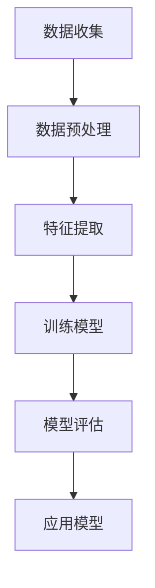
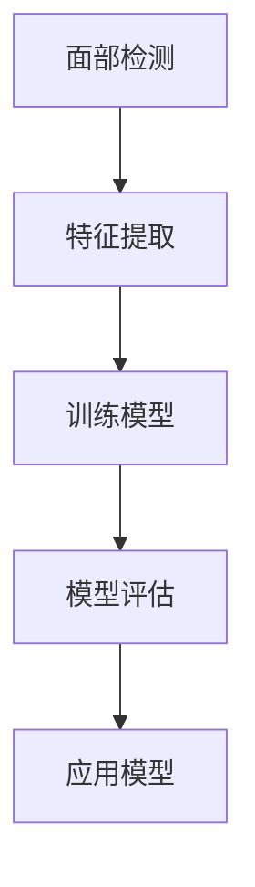
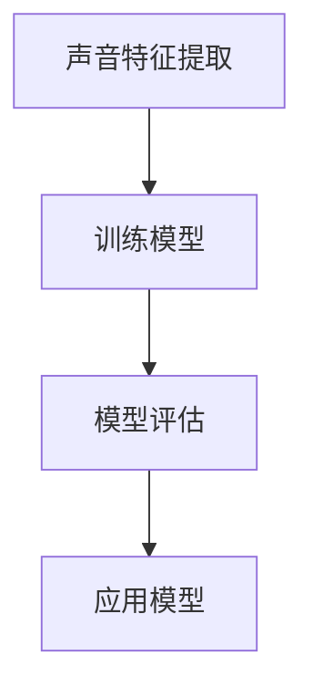
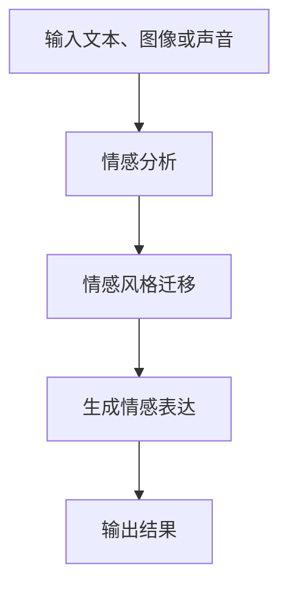
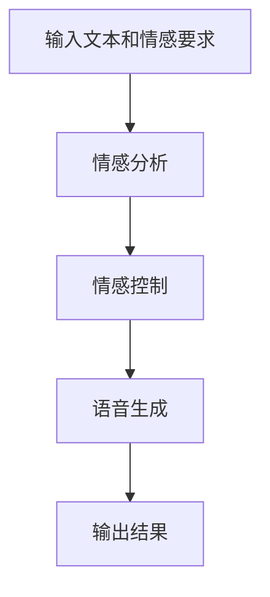

                 

# 情感智能研发实验室：提升人机交互的前沿研究

## 关键词
- 情感智能
- 人机交互
- 研发实验室
- 深度学习
- 伦理问题

## 摘要
本文将探讨情感智能研发实验室在提升人机交互方面的前沿研究。通过分析情感智能的定义、重要性以及其在人机交互中的应用，本文将介绍情感智能技术的基础和前沿算法，探讨其在实际应用中的挑战和解决方案。此外，还将讨论情感智能研发中的伦理问题，以及实验室的建设和未来发展趋势。希望通过本文的探讨，能够为相关领域的研究者和开发者提供有价值的参考。

## 第一部分：情感智能概述与背景研究

### 1.1 情感智能的概念与重要性

情感智能（Emotional Intelligence，简称EQ）是指个体识别、理解、管理和运用情感信息的能力。它不仅涵盖了情感认知，如识别自己的情绪状态和他人情绪状态，还包括情感运用，如运用情感信息解决问题和建立人际关系。

情感智能的重要性在于它对人类行为和心理健康的影响。研究表明，高情商的人更容易在工作和生活中取得成功。情感智能可以帮助个体更好地处理压力、改善人际关系、提高工作效率，甚至在决策过程中起到关键作用。

在人机交互领域，情感智能的应用越来越受到重视。随着人工智能技术的发展，机器越来越能够理解并模拟人类的情感表达，从而实现更自然、更人性化的交互体验。例如，智能客服系统可以通过情感分析识别用户的情绪，并给出恰当的回应；教育机器人可以根据学生的情感状态调整教学策略，提高学习效果。

### 1.2 情感智能与人类行为的关系

情感智能与人类行为的关系密切。研究表明，情感智能对个体的社交能力、情绪调节能力和认知能力都有显著影响。具体来说：

- **社交能力**：高情商的人更容易建立和维持良好的人际关系，因为他们能够敏锐地捕捉他人的情绪，并做出适当的反应。
- **情绪调节能力**：情感智能有助于个体更好地处理负面情绪，如焦虑、抑郁等。通过情感认知和运用，个体可以有效地调节情绪，减少情绪对工作和生活的影响。
- **认知能力**：情感智能与认知能力相互作用，共同影响个体的信息处理能力和创造力。研究表明，高情商的人更容易在复杂情境下做出理性决策。

### 1.3 人机交互中的情感智能挑战

尽管情感智能在人机交互中具有巨大潜力，但实际应用中仍面临诸多挑战。以下是人机交互中情感智能的主要挑战：

- **情感识别难题**：如何准确识别用户的情感状态，尤其是当用户的情感表达不够明显或含糊时。
- **情感反馈**：如何生成自然、贴切的情感反馈，使机器能够理解并回应用户的情感需求。
- **个性化服务**：如何根据用户的情感状态提供个性化的服务，提高用户体验。

在接下来的章节中，我们将详细探讨情感智能技术的基础、前沿算法以及在实际应用中的解决方案。

## 第二部分：情感智能技术基础

### 2.1 情感分析技术

情感分析（Sentiment Analysis）是情感智能技术的核心组成部分，它旨在通过自然语言处理技术，从文本中自动识别和提取情感信息。情感分析技术通常可以分为以下几类：

- **文本情感分析**：通过分析文本中的情感词汇、语法结构和上下文，识别文本的情感倾向，如正面、负面或中性。
- **面部表情识别**：通过分析图像或视频中的面部表情，识别个体的情感状态。
- **声音情感识别**：通过分析语音信号中的情感特征，如音调、语速和语调，识别个体的情感状态。

文本情感分析是情感智能技术的重要组成部分。其基本原理如下：

1. **数据收集**：首先需要收集大量的情感标注数据，这些数据包括文本、图像和声音等。
2. **特征提取**：从原始数据中提取与情感相关的特征，如情感词汇、语法结构和上下文信息。
3. **情感分类**：使用机器学习算法，如支持向量机（SVM）、朴素贝叶斯（NB）和深度学习模型，对文本进行情感分类。

以下是一个简单的文本情感分析流程：

在特征提取阶段，常用的特征包括：

- **词频**：文本中每个词汇出现的次数。
- **词向量**：将文本转化为向量表示，如Word2Vec、GloVe等。
- **句法特征**：文本的语法结构，如句子的主谓宾结构。

在模型评估阶段，常用的指标包括准确率（Accuracy）、召回率（Recall）和F1分数（F1 Score）。

### 2.2 面部表情识别

面部表情识别是通过分析图像或视频中的面部特征，识别个体的情感状态。其基本原理如下：

1. **面部检测**：首先需要检测图像或视频中的面部区域。
2. **特征提取**：从面部区域中提取与情感相关的特征，如眼睛、嘴巴和面部的运动。
3. **情感分类**：使用机器学习算法，如支持向量机（SVM）、卷积神经网络（CNN）等，对面部特征进行情感分类。

以下是一个简单的面部表情识别流程：

在特征提取阶段，常用的特征包括：

- **几何特征**：面部各个器官的位置和形状。
- **运动特征**：面部器官的运动轨迹和速度。
- **纹理特征**：面部皮肤的颜色和纹理。

在模型评估阶段，常用的指标包括准确率（Accuracy）、召回率（Recall）和F1分数（F1 Score）。

### 2.3 声音情感识别

声音情感识别是通过分析语音信号中的情感特征，识别个体的情感状态。其基本原理如下：

1. **声音特征提取**：从原始语音信号中提取与情感相关的特征，如音调、语速、语调和音量。
2. **情感分类**：使用机器学习算法，如支持向量机（SVM）、长短期记忆网络（LSTM）等，对声音特征进行情感分类。

以下是一个简单的声音情感识别流程：

在特征提取阶段，常用的特征包括：

- **音调**：声音的频率。
- **语速**：说话的快慢。
- **语调**：声音的起伏。
- **音量**：声音的强度。

在模型评估阶段，常用的指标包括准确率（Accuracy）、召回率（Recall）和F1分数（F1 Score）。

通过文本情感分析、面部表情识别和声音情感识别，情感智能技术能够帮助机器更好地理解人类的情感状态，从而实现更自然、更人性化的交互体验。在接下来的章节中，我们将探讨情感智能的前沿算法研究。

## 第三部分：前沿情感智能算法研究

### 3.1 情感识别算法

情感识别算法是情感智能技术的核心，旨在从文本、图像和声音中识别情感状态。以下是几种常用的情感识别算法：

#### 3.1.1 传统机器学习算法

传统机器学习算法，如支持向量机（SVM）、朴素贝叶斯（NB）和逻辑回归（LR），在情感识别任务中有着广泛的应用。这些算法的优点在于简单、高效，且易于实现。然而，它们的性能受限于特征提取和假设条件。

以下是一个简单的情感识别算法流程：

在特征提取阶段，可以使用词频（TF）、词向量（Word2Vec、GloVe）和句法特征（语法结构）等。在模型评估阶段，可以使用准确率（Accuracy）、召回率（Recall）和F1分数（F1 Score）等指标。

#### 3.1.2 深度学习算法

深度学习算法，如卷积神经网络（CNN）、循环神经网络（RNN）和变压器（Transformer），在情感识别任务中展现了强大的性能。这些算法通过多层网络结构自动学习特征表示，能够处理复杂的情感信息。

以下是一个简单的情感识别算法流程：

在特征提取阶段，可以使用卷积神经网络（CNN）提取文本、图像和声音的特征。在模型评估阶段，可以使用准确率（Accuracy）、召回率（Recall）和F1分数（F1 Score）等指标。

#### 3.1.3 情感生成算法

情感生成算法旨在根据给定的文本、图像和声音，生成相应的情感表达。这种算法在个性化服务、虚拟现实和影视制作等领域有重要应用。

以下是一个简单的情感生成算法流程：

在情感分析阶段，可以使用情感识别算法分析输入的情感状态。在情感风格迁移阶段，可以使用风格迁移算法（如CycleGAN、StyleGAN）将输入的情感风格迁移到目标情感上。在生成情感表达阶段，可以使用文本生成模型（如GPT-2、GPT-3）、图像生成模型（如GAN、VGG）和声音生成模型（如WaveNet、Tacotron）。

### 3.2 情感生成算法

情感生成算法在个性化服务和虚拟现实等领域有重要应用。以下是一些常用的情感生成算法：

#### 3.2.1 情感风格迁移

情感风格迁移是指将一种情感风格迁移到另一种情感上。这种算法在个性化服务和影视制作中有着广泛应用。

以下是一个简单的情感风格迁移算法流程：

在情感分析阶段，可以使用情感识别算法分析输入的情感状态。在情感风格迁移阶段，可以使用循环一致性损失（Cycle Consistency Loss）和对抗性损失（Adversarial Loss）等优化目标训练风格迁移模型。在生成情感表达阶段，可以使用生成对抗网络（GAN）或变分自编码器（VAE）等模型。

#### 3.2.2 语音合成中的情感控制

语音合成中的情感控制是指根据给定的文本和情感要求，生成相应的情感语音。这种算法在智能客服、虚拟助手和影视配音等领域有重要应用。

以下是一个简单的语音合成中的情感控制算法流程：

在情感分析阶段，可以使用情感识别算法分析输入的情感状态。在情感控制阶段，可以使用声学模型（如WaveNet、Tacotron）和文本到语音转换（Text-to-Speech，TTS）模型，根据情感要求调整语音的音调、语速和语调等。在语音生成阶段，可以使用声学模型和文本到语音转换模型生成情感语音。

通过情感识别算法和情感生成算法的结合，情感智能技术能够实现从情感分析到情感生成的完整流程，为人机交互带来更多可能性。在接下来的章节中，我们将探讨情感智能在人机交互中的应用案例。

## 第四部分：情感智能在人机交互中的应用案例

### 4.1 智能客服系统

智能客服系统是情感智能在商业领域的重要应用之一。通过情感分析技术，智能客服系统能够识别用户的情感状态，并给出适当的回应，从而提升用户体验。以下是智能客服系统的一个典型应用场景：

- **用户咨询**：用户通过聊天窗口向客服系统咨询产品相关问题。
- **情感识别**：客服系统通过文本情感分析技术，识别用户的情感状态，如满意、不满、愤怒等。
- **情感回应**：根据用户的情感状态，客服系统生成相应的情感回应，如安慰、道歉、鼓励等。
- **用户反馈**：用户对客服回应进行评价，客服系统根据用户反馈调整情感回应策略。

### 4.2 教育领域的情感智能应用

情感智能在教育领域也有广泛应用，特别是在个性化教育和智能辅导系统中。通过情感分析技术，教育系统能够了解学生的学习状态和情感需求，从而提供个性化的学习支持和辅导。以下是教育领域的一个典型应用场景：

- **学生互动**：学生通过在线平台进行学习互动，如观看教学视频、参与讨论等。
- **情感识别**：教育系统通过面部表情识别和声音情感识别技术，识别学生的学习状态和情感需求，如焦虑、困惑、自信等。
- **学习支持**：根据学生的情感状态，教育系统提供适当的学习支持，如调整学习内容、提供心理辅导等。
- **学习反馈**：学生对自己的学习效果进行评价，教育系统根据反馈调整学习支持策略。

### 4.3 健康护理与陪伴机器人

健康护理与陪伴机器人是情感智能在健康护理领域的重要应用。通过情感分析技术，机器人能够识别用户的情感状态，提供情感支持和陪伴服务。以下是健康护理与陪伴机器人的一个典型应用场景：

- **用户互动**：用户与机器人进行日常交流，如聊天、游戏、散步等。
- **情感识别**：机器人通过面部表情识别和声音情感识别技术，识别用户的情感状态，如孤独、沮丧、快乐等。
- **情感回应**：根据用户的情感状态，机器人提供相应的情感回应，如安慰、鼓励、陪伴等。
- **用户反馈**：用户对机器人的情感回应进行评价，机器人根据反馈调整情感回应策略。

通过这些应用案例，我们可以看到情感智能技术在提升人机交互方面的巨大潜力。在接下来的章节中，我们将探讨情感智能研发中的伦理问题。

## 第五部分：情感智能研发中的伦理问题

### 5.1 情感数据分析的隐私保护

随着情感智能技术的发展，情感数据分析在许多应用中变得越来越普遍。然而，这种技术的普及也引发了一系列隐私保护问题。以下是情感数据分析中常见的隐私保护挑战：

- **数据收集与存储**：在情感数据分析过程中，往往需要收集用户的个人数据，如文本、图像和声音。这些数据的收集和处理需要严格遵守隐私保护法规，确保用户数据的安全和隐私。
- **数据共享与使用**：在数据共享和使用的环节，需要明确数据的使用范围和目的，避免数据被滥用或泄露。
- **算法透明性**：情感分析算法的透明性是隐私保护的关键。算法的设计和实现需要遵循透明原则，使用户能够了解算法的工作机制和潜在影响。

### 5.2 情感智能的偏见与歧视

情感智能技术的应用也可能导致偏见和歧视。以下是情感智能偏见与歧视的几个方面：

- **情感识别偏见**：情感分析算法可能因为训练数据的不均衡或偏差，导致对某些群体或情感状态的识别不准确。
- **情感反馈偏见**：情感智能系统在生成情感反馈时，可能因为算法设计或数据源的偏见，对某些用户或情感状态给予不公平的待遇。
- **社会影响**：情感智能的偏见和歧视可能导致社会不公平，加剧某些群体的歧视和边缘化。

### 5.3 伦理审查与监管

为了解决情感智能研发中的伦理问题，需要建立有效的伦理审查和监管机制。以下是几个方面的建议：

- **伦理审查委员会**：建立专门的伦理审查委员会，对情感智能研发项目进行伦理评估和监督。
- **法规制定**：制定相关法律法规，明确情感智能技术的应用范围和隐私保护要求。
- **透明披露**：情感智能技术的研发和应用需要公开透明，使公众了解技术的潜在风险和影响。

通过有效的伦理审查和监管，可以确保情感智能技术的健康发展，避免潜在的社会问题。在接下来的章节中，我们将探讨情感智能研发实验室的建设和运营。

## 第六部分：情感智能研发实验室建设与运营

### 6.1 实验室建设概述

情感智能研发实验室是一个集中研究、开发和测试情感智能技术的平台。以下是实验室建设的几个关键方面：

- **团队构建**：实验室需要拥有一支跨学科的技术团队，包括人工智能专家、数据科学家、心理学家和工程师等。
- **硬件设施**：实验室需要配备高性能的计算设备和传感器，以支持大规模数据分析和实验。
- **软件平台**：实验室需要搭建完善的软件平台，包括数据收集、处理、分析和可视化工具。
- **项目管理**：实验室需要建立完善的项目管理流程，确保项目进度和质量。

### 6.2 技术团队构建

技术团队是情感智能研发实验室的核心。以下是构建技术团队的几个关键步骤：

- **人才招聘**：通过招聘会、社交媒体和专业论坛等渠道，吸引具有相关背景和技能的人才。
- **培训和培养**：定期举办培训课程和研讨会，提升团队成员的专业能力和技术水平。
- **团队协作**：建立高效的团队协作机制，确保团队成员能够紧密合作，共同推进项目。

### 6.3 实验室管理策略

实验室管理策略对于确保实验室的稳定运行和项目成功至关重要。以下是几个关键的管理策略：

- **目标明确**：制定明确的研究目标和项目计划，确保实验室工作方向一致。
- **资源配置**：合理分配资源，确保项目所需的资金、设备和技术支持。
- **风险管理**：识别项目风险，并制定相应的风险应对策略。
- **质量控制**：建立完善的质量控制机制，确保项目的质量和可靠性。

通过有效的实验室建设和管理策略，情感智能研发实验室能够为情感智能技术的发展提供强有力的支持。在接下来的章节中，我们将探讨情感智能研发的未来趋势与展望。

## 第七部分：情感智能研发的未来趋势与展望

### 7.1 技术发展趋势

随着人工智能和机器学习技术的不断发展，情感智能技术也在不断进步。以下是情感智能技术的一些发展趋势：

- **多模态情感分析**：未来的情感智能技术将能够同时分析文本、图像和声音等多种模态的信息，提供更全面和精准的情感识别。
- **个性化情感服务**：情感智能技术将更加注重个性化服务，根据用户的情感状态提供定制化的情感支持和互动体验。
- **增强现实与虚拟现实**：情感智能技术将在增强现实（AR）和虚拟现实（VR）领域发挥重要作用，提供更自然和沉浸式的交互体验。
- **边缘计算与物联网**：情感智能技术将应用到边缘设备和物联网（IoT）领域，实现实时情感分析和智能响应。

### 7.2 应用前景

情感智能技术在各个领域都有广泛的应用前景：

- **智能客服**：通过情感智能技术，智能客服系统能够提供更自然和人性化的服务，提高客户满意度。
- **心理健康**：情感智能技术可以用于心理健康领域，通过分析用户情感状态，提供个性化的心理辅导和干预。
- **教育**：情感智能技术可以应用于个性化教育，根据学生情感状态调整教学策略，提高学习效果。
- **健康护理**：情感智能技术可以帮助健康护理机器人更好地理解患者的情感需求，提供更贴心的陪伴服务。

### 7.3 未来挑战与机遇

尽管情感智能技术有着广泛的应用前景，但未来仍面临诸多挑战：

- **技术挑战**：情感识别的准确性、算法的稳定性和效率等仍然是需要解决的问题。
- **伦理挑战**：情感智能技术的隐私保护、偏见和歧视等问题需要得到有效解决。
- **监管挑战**：随着情感智能技术的广泛应用，需要建立有效的监管机制，确保技术发展符合社会伦理和法律法规。

未来，情感智能技术将不断推动人机交互的发展，带来更多便利和创新。在解决挑战的同时，我们也需要抓住机遇，推动情感智能技术的广泛应用，为社会带来更多的价值。

## 结语

情感智能研发实验室在提升人机交互方面有着重要的研究价值。通过分析情感智能的概念、技术基础和前沿算法，我们可以看到情感智能技术在提高交互自然性和人性化方面的巨大潜力。然而，情感智能技术也面临诸多挑战，如隐私保护、偏见和歧视等。未来，我们需要在技术创新和伦理监管方面取得突破，推动情感智能技术的健康发展。感谢您的阅读，希望本文能够为您的科研工作提供有益的参考。

## 作者信息

作者：AI天才研究院/AI Genius Institute & 禅与计算机程序设计艺术 /Zen And The Art of Computer Programming

