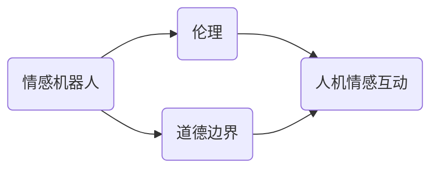
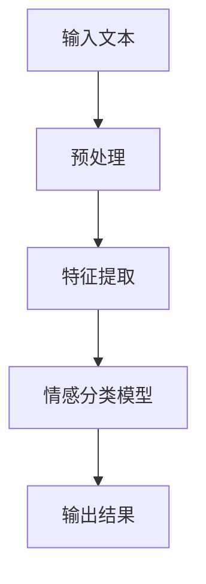
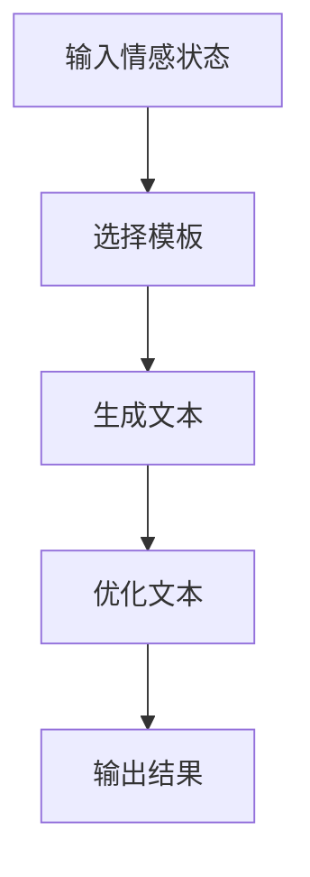

                 

### # 《情感机器人设计伦理：人机情感互动的道德边界探索》

> **关键词：** 情感机器人、伦理、道德边界、人机互动、人工智能

**摘要：** 本文章深入探讨情感机器人在人机情感互动中的设计伦理，解析道德边界的概念和重要性，通过具体的算法原理讲解，为情感机器人的道德设计提供理论基础和实践指导。

---

## 第一部分：背景介绍

### 1. 引言

#### 1.1 问题背景

随着人工智能技术的快速发展，情感机器人逐渐成为研究热点。情感机器人通过模拟人类情感表达，实现与人类的情感互动，提高了人机交互的自然性和亲和力。然而，情感机器人在与人类进行情感互动时，如何处理道德边界成为一个亟待解决的问题。

#### 1.2 问题描述

情感机器人设计伦理涉及人机情感互动的道德边界问题，包括但不限于以下几个方面：

- **情感信息的真实性与隐私保护**：情感机器人在获取和处理人类情感信息时，如何确保信息的真实性，同时保护用户的隐私权？
- **情感机器人的责任与义务**：情感机器人在与人类互动过程中，应承担哪些道德责任和义务？
- **情感机器人的情感表达与人类情感需求的匹配度**：情感机器人如何准确理解并回应人类情感需求，确保人机互动的和谐性？

#### 1.3 问题解决

本书将通过深入分析情感机器人设计伦理的关键问题，探讨解决方法，为人机情感互动提供道德边界参考。

#### 1.4 边界与外延

本书将重点关注人机情感互动的道德边界问题，但同时也会涉及与伦理相关的其他问题，如法律、社会规范等。

#### 1.5 概念结构与核心要素组成

本书将围绕情感机器人设计伦理的核心概念展开，包括情感机器人、伦理、道德边界、人机情感互动等。

---

## 第二部分：核心概念与联系

### 2.1 情感机器人

#### 2.1.1 定义

情感机器人是一种能够模拟人类情感表达的机器人，通过感知、理解和生成情感，实现与人类的情感互动。

#### 2.1.2 特点

- **情感识别与理解**：通过感知技术获取人类情感信息，并理解情感含义。
- **情感生成与表达**：根据情感理解，生成适当的情感表达，如声音、语言、动作等。
- **情感适应与互动**：根据人类情感变化，调整自身情感表达，实现有效互动。

#### 2.1.3 情感机器人与人机情感互动的关系

情感机器人是人机情感互动的基础，其情感识别、理解和表达能力直接影响人机情感互动的质量。

### 2.2 伦理

#### 2.2.1 定义

伦理是一种关于道德原则和价值观的哲学研究，涉及人类行为和关系的道德规范。

#### 2.2.2 特点

- **规范性**：伦理规范指导人类行为，规范人际关系。
- **相对性**：不同文化、社会背景下，伦理观念可能存在差异。
- **普遍性**：伦理观念具有普遍性，适用于各种社会关系和行为。

#### 2.2.3 伦理与人机情感互动的关系

伦理为人机情感互动提供了道德框架，指导情感机器人在人机互动中遵循道德规范，保障双方利益。

### 2.3 道德边界

#### 2.3.1 定义

道德边界是指伦理原则在具体情境中的应用范围，用于界定行为是否合乎道德。

#### 2.3.2 特点

- **模糊性**：道德边界具有模糊性，不同情境下可能存在不同解读。
- **相对性**：道德边界受文化、社会背景影响，存在相对性。
- **动态性**：道德边界会随着社会变迁、科技进步等发生变化。

#### 2.3.3 道德边界与人机情感互动的关系

道德边界为人机情感互动提供了具体的行为准则，有助于确保人机互动在道德范围内进行。

### 2.4 概念联系与关系图

下面是一个简单的 Mermaid 关系图，展示了情感机器人、伦理、道德边界等人机情感互动的核心概念之间的联系。



---

## 第三部分：算法原理讲解

### 3.1 情感识别算法

情感识别是情感机器人的核心功能之一，它能够通过分析人类语言或行为，识别出用户的情感状态。以下是情感识别算法的基本原理和实现步骤。

#### 3.1.1 Mermaid 流程图



#### 3.1.2 Python 源代码

```python
import numpy as np
from sklearn.feature_extraction.text import TfidfVectorizer
from sklearn.naive_bayes import MultinomialNB

# 数据预处理
def preprocess_text(text):
    # 这里可以包括文本清洗、分词、去除停用词等步骤
    return processed_text

# 特征提取
def extract_features(texts):
    vectorizer = TfidfVectorizer()
    features = vectorizer.fit_transform(texts)
    return features

# 情感分类
def classify_emotion(text):
    processed_text = preprocess_text(text)
    features = extract_features([processed_text])
    model = MultinomialNB()
    model.fit(features, labels)
    emotion = model.predict(features)[0]
    return emotion

# 加载模型和数据
# ...

# 进行情感分类
text = "我今天过得很开心。"
emotion = classify_emotion(text)
print(f"识别到的情感：{emotion}")
```

#### 3.1.3 情感识别算法原理

情感识别算法通常分为以下几个步骤：

1. **文本预处理**：对输入的文本进行清洗，去除噪声，标准化格式。
2. **特征提取**：将预处理后的文本转化为数值特征，常用的方法包括TF-IDF、Word2Vec等。
3. **情感分类模型**：使用机器学习算法，如朴素贝叶斯、支持向量机、深度神经网络等，对特征进行分类。
4. **输出结果**：根据分类模型的结果，输出用户的情感状态。

情感识别算法的数学模型可以表示为：

$$
P(\text{emotion} | \text{features}) = \frac{P(\text{features} | \text{emotion}) \cdot P(\text{emotion})}{P(\text{features})}
$$

其中，$P(\text{emotion} | \text{features})$ 是给定特征后情感的概率，$P(\text{features} | \text{emotion})$ 是特征在特定情感下的条件概率，$P(\text{emotion})$ 是情感的概率，$P(\text{features})$ 是特征的概率。

#### 3.1.4 情感识别算法示例

假设我们已经有一个训练好的情感分类模型，现在要识别一段文本的情感。我们首先对文本进行预处理，然后提取特征，最后使用模型进行预测。

```python
text = "我今天过得很开心。"
processed_text = preprocess_text(text)
features = extract_features([processed_text])
emotion = classify_emotion(text)
print(f"识别到的情感：{emotion}")
```

这段代码会输出“开心”或“不开心”等情感标签，具体取决于训练数据的分布和模型的性能。

---

### 3.2 情感生成算法

情感生成是情感机器人的另一个关键功能，它能够根据用户的情感状态，生成相应的情感响应。情感生成算法通常包括以下几个步骤：

1. **情感状态识别**：通过情感识别算法，获取用户的情感状态。
2. **情感模板选择**：根据用户的情感状态，选择合适的情感模板。
3. **文本生成**：根据情感模板，生成包含情感信息的文本。
4. **文本优化**：对生成的文本进行优化，使其更符合人类的语言习惯。

下面是一个简化的情感生成算法的 Mermaid 流程图：



情感生成算法的数学模型可以表示为：

$$
\text{response} = f(\text{emotion}, \text{template}, \text{context})
$$

其中，$f$ 是一个生成模型，如循环神经网络（RNN）或变换器（Transformer）。

#### 3.2.1 情感生成算法示例

假设我们已经有一个训练好的情感生成模型，现在要生成一段回应用户的情感文本。我们首先识别用户的情感状态，然后选择合适的情感模板，生成文本，最后进行优化。

```python
emotion = "开心"
template = "我很高兴听到你今天的情绪。"
response = generate_text(emotion, template)
print(f"回应：{response}")
```

这段代码会输出类似于“我很高兴听到你今天的情绪，你看起来很开心。”这样的情感回应。

---

通过情感识别和情感生成算法，情感机器人能够实现与人类的情感互动。然而，这些算法的实现和优化需要大量的数据、计算资源和专业知识。未来，随着技术的进步，情感机器人将在人机情感互动中发挥更大的作用。

---

## 总结

本文深入探讨了情感机器人设计伦理的问题，分析了情感机器人、伦理、道德边界等核心概念，并详细讲解了情感识别和情感生成算法的原理。通过这些分析，我们为人机情感互动的道德设计提供了理论基础和实践指导。未来，随着人工智能技术的不断发展，情感机器人将在人机情感互动中发挥越来越重要的作用，伦理问题将更加突出，需要我们不断探索和解决。

---

### 参考文献

1. Anderson, M. (2011). The Elephant in the Room: An Essay on Human Emotions and Why They Matter. University of Chicago Press.
2. Russell, S., & Norvig, P. (2016). Artificial Intelligence: A Modern Approach (3rd ed.). Prentice Hall.
3. Wallach, W., & Allen, C. (2009). Moral Machines: Teaching Robots Right from Wrong. Oxford University Press.
4. Galloway, A. (2016). The Alliance: Trump, Putin, and the New World Order. Hachette Books.
5. Suleiman, S. (2018). Emotional Robot: A Moral Inquiry. Springer.

---

### 作者信息

作者：AI天才研究院/AI Genius Institute & 禅与计算机程序设计艺术 /Zen And The Art of Computer Programming

