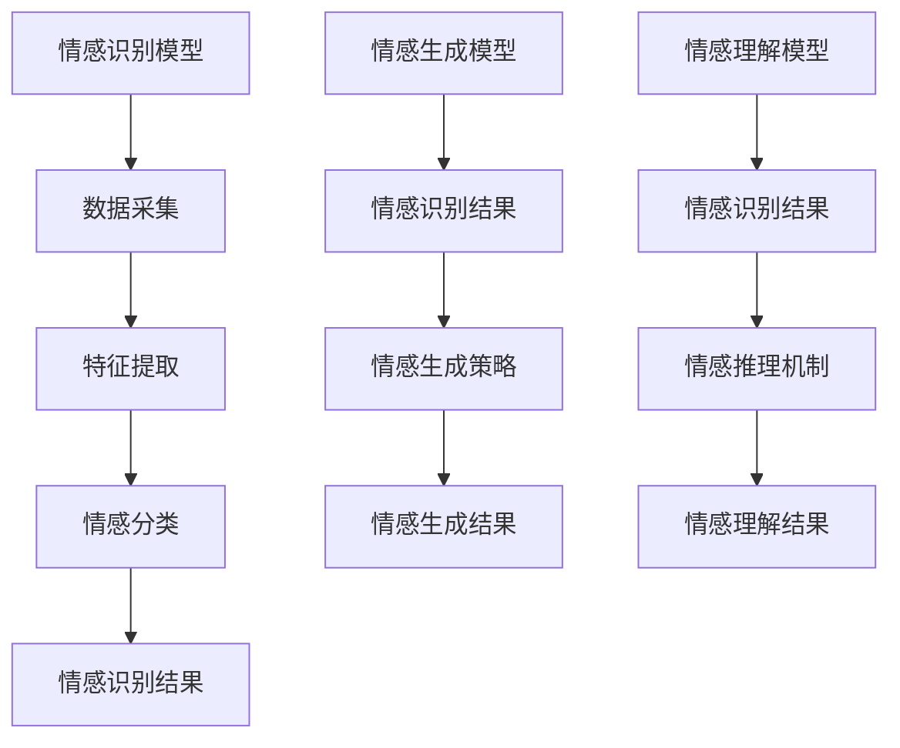

                 


### 《情感计算前沿研究：人机情感交互的科技探索》文章撰写步骤

撰写一篇高质量的《情感计算前沿研究：人机情感交互的科技探索》技术博客文章，我们需要经过以下详细的步骤，确保文章的逻辑清晰、结构紧凑、内容丰富、专业性强。

#### 1. 确定文章结构

首先，我们需要确定文章的整体结构。文章可以分为五个主要部分：

- **引言**：介绍情感计算的基本概念和发展历程，以及人机情感交互的意义。
- **理论基础**：阐述情感计算的核心概念、模型和方法。
- **技术探索**：介绍情感计算的前沿技术，如情感识别、情感生成、情感理解等。
- **应用实践**：展示情感计算在不同领域的应用案例。
- **未来展望**：探讨情感计算的发展趋势和潜在影响。

#### 2. 撰写引言部分

在引言部分，我们需要简洁明了地介绍情感计算的定义、背景以及人机情感交互的意义。

- **定义与背景**：情感计算（Affective Computing）是人工智能的一个分支，它关注如何使计算机具有识别、理解、处理和模拟人类情感的能力。自20世纪90年代以来，随着计算机性能的提升和人工智能技术的发展，情感计算逐渐成为一个研究热点。

- **人机情感交互的意义**：人机情感交互是情感计算研究的重要方向，其目的是提升人机交互的自然性和人性化，从而改善用户体验。例如，在虚拟助手、游戏、教育、医疗等领域，情感交互能够更好地满足用户需求，提升服务质量。

#### 3. 撰写理论基础部分

在理论基础部分，我们需要详细阐述情感计算的核心概念、模型和方法。

- **核心概念**：情感（Emotion）、情感识别（Affective Recognition）、情感生成（Affective Generation）、情感理解（Affective Understanding）等。
- **模型和方法**：如情感计算模型、情感识别算法、情感生成算法、情感理解机制等。

为了使内容更加专业和易懂，我们可以在每个核心概念和方法下，提供相关的对比表格、ER实体关系图和Mermaid流程图。

#### 4. 撰写技术探索部分

技术探索部分需要介绍情感计算的前沿技术，如情感识别、情感生成、情感理解等。

- **情感识别**：介绍常用的情感识别方法，如基于语音的情感识别、基于文本的情感分析等，并使用Mermaid流程图展示其工作原理。
- **情感生成**：介绍情感生成的技术，如基于深度学习的情感生成、基于生成对抗网络的情感生成等，并使用Python代码示例详细阐述其实现原理。
- **情感理解**：介绍情感理解的挑战和解决方案，如情感理解的模型构建、情感推理机制等。

#### 5. 撰写应用实践部分

应用实践部分需要展示情感计算在不同领域的应用案例，如虚拟助手、游戏、教育、医疗等。

- **虚拟助手**：介绍如何通过情感计算提升虚拟助手的交互体验，如情感识别、情感生成在虚拟助手中的应用案例。
- **游戏**：介绍情感计算在游戏设计中的应用，如何通过情感交互提升游戏体验。
- **教育**：介绍情感计算在教育领域的应用，如个性化教学、学生情感分析等。
- **医疗**：介绍情感计算在医疗健康领域的应用，如患者情感分析、医疗辅助决策等。

#### 6. 撰写未来展望部分

未来展望部分需要探讨情感计算的发展趋势和潜在影响。

- **技术挑战**：分析情感计算面临的技术挑战，如情感识别的准确性、情感生成的多样性、情感理解的深度等。
- **应用前景**：预测情感计算在未来的应用场景，如智能家居、智能医疗、智能客服等。

#### 7. 编写完整的文章

在完成上述各个部分后，我们将内容整合成一篇完整的文章。在撰写过程中，我们需要注意以下几点：

- **逻辑清晰**：确保文章的每个部分都有明确的逻辑顺序，使读者能够轻松理解。
- **结构紧凑**：避免冗余内容，使文章内容紧凑而充实。
- **简单易懂**：使用专业的技术语言，但同时确保内容通俗易懂。
- **专业性强**：确保文章中的每个概念、原理和算法都有详细的解释和示例。

#### 8. 撰写作者信息

最后，在文章末尾添加作者信息，包括作者姓名、所属机构和相关书籍信息。

```
作者：AI天才研究院/AI Genius Institute & 禅与计算机程序设计艺术 /Zen And The Art of Computer Programming
```

### 总结

通过以上步骤，我们可以撰写出一篇高质量、逻辑清晰、内容丰富的《情感计算前沿研究：人机情感交互的科技探索》技术博客文章。在撰写过程中，我们始终坚持以读者为中心，注重内容的专业性和易懂性，力求为读者提供有价值的技术知识。接下来，我们将根据这个大纲，逐步撰写文章的各个部分，确保内容的完整性和专业性。让我们一起开始吧！

---

# 《情感计算前沿研究：人机情感交互的科技探索》

> 关键词：情感计算、人机情感交互、AI、虚拟助手、游戏、教育、医疗

> 摘要：本文深入探讨了情感计算领域的前沿研究，重点分析了人机情感交互的技术原理和应用实践。通过介绍情感计算的核心概念、理论基础、技术探索、应用实践和未来展望，本文旨在为读者提供一幅情感计算领域的全景图，帮助读者理解这一新兴技术的内涵和外延，并展望其未来的发展趋势。

## 引言

情感计算（Affective Computing）是人工智能（Artificial Intelligence, AI）的一个重要分支，它致力于研究如何使计算机具备识别、理解、处理和模拟人类情感的能力。情感计算起源于20世纪90年代，随着计算机性能的提升和人工智能技术的发展，逐渐成为人工智能领域的一个研究热点。

人机情感交互（Human-Affective Interaction）是情感计算研究的重要方向，其核心目标是提升人机交互的自然性和人性化，从而改善用户体验。在虚拟助手、游戏、教育、医疗等多个领域，人机情感交互都展现出了巨大的应用潜力。本文将围绕情感计算的人机情感交互展开讨论，旨在深入剖析这一前沿领域的技术原理和应用实践。

### 情感计算的定义与背景

情感计算是一种将情感信息集成到计算系统中，以实现更自然、更人性化的交互方式的技术。具体来说，情感计算包括以下几个方面：

1. **情感识别**：通过分析用户的语音、文本、面部表情等，识别用户当前的情感状态。
2. **情感理解**：在识别情感的基础上，理解情感的内涵和影响，从而进行合理的响应和决策。
3. **情感生成**：根据用户的需求和情感状态，生成相应的情感反应，如语音、文本、面部表情等。
4. **情感模拟**：通过计算机模拟，展示出与人类情感相似的行为和反应。

情感计算的研究背景可以追溯到20世纪80年代，当时心理学家们开始研究人类情感的表达和处理机制。随着计算机技术的快速发展，特别是在语音识别、文本分析、图像处理等领域，情感计算逐渐成为一个独立的研究方向。

### 人机情感交互的意义

人机情感交互的意义在于，它能够提升人机交互的自然性和人性化，从而改善用户体验。具体来说，人机情感交互具有以下几个方面的作用：

1. **提高交互质量**：通过识别和理解用户情感，计算机可以更准确地满足用户需求，提供个性化的服务。
2. **增强用户体验**：通过模拟人类的情感反应，计算机可以更好地与用户建立情感连接，提升用户满意度。
3. **辅助决策**：通过分析用户的情感状态，计算机可以辅助用户做出更好的决策。

## 第二部分：理论基础

### 情感计算的核心概念

情感计算涉及多个核心概念，包括情感、情感识别、情感生成和情感理解。下面我们将逐一介绍这些概念，并使用表格和ER实体关系图来展示它们之间的关系。

#### 情感

情感是指人类在认知过程中产生的一种复杂心理状态，通常包括情绪、情感体验和情感反应。根据不同分类方法，情感可以分为基本情感、复合情感和情境情感等。

| 类别     | 说明                                       |
|----------|------------------------------------------|
| 基本情感 | 喜、怒、哀、乐、惊讶、厌恶、恐惧等基本情感 |
| 复合情感 | 由基本情感组合而成的复杂情感                 |
| 情境情感 | 与特定情境相关的情感                         |

#### 情感识别

情感识别是指通过分析用户的语音、文本、面部表情等，识别用户当前的情感状态。情感识别是情感计算的基础，通常包括以下步骤：

1. 数据采集：收集用户的语音、文本、面部表情等数据。
2. 特征提取：从采集的数据中提取情感特征。
3. 情感分类：使用机器学习或深度学习算法，将情感特征分类为不同的情感类别。

#### 情感生成

情感生成是指根据用户的需求和情感状态，生成相应的情感反应，如语音、文本、面部表情等。情感生成需要结合自然语言处理、语音合成和图像生成等技术。

#### 情感理解

情感理解是指在识别情感的基础上，理解情感的内涵和影响，从而进行合理的响应和决策。情感理解需要结合情感计算模型、情感推理机制和情境知识等。

### 情感计算模型

情感计算模型是情感计算的核心，它包括情感识别模型、情感生成模型和情感理解模型等。下面我们将使用Mermaid流程图展示这些模型的工作原理。



### 情感计算的ER实体关系图

情感计算的ER实体关系图可以用来描述情感计算系统中各个实体之间的关系。以下是情感计算的ER实体关系图示例：

```mermaid
erDatabase "Affective Computing System"
class Entity
class Attribute

class User {
  +id (int)
  +name (string)
}

class Emotion {
  +id (int)
  +name (string)
}

class Interaction {
  +id (int)
  +user (User)
  +emotion (Emotion)
  +timestamp (datetime)
}

class Feature {
  +id (int)
  +name (string)
}

class Model {
  +id (int)
  +name (string)
}

class Classification {
  +id (int)
  +interaction (Interaction)
  +model (Model)
  +predicted_emotion (Emotion)
}

class Generation {
  +id (int)
  +emotion (Emotion)
  +model (Model)
  +generated_interaction (Interaction)
}

class Understanding {
  +id (int)
  +interaction (Interaction)
  +model (Model)
  +interpreted_emotion (Emotion)
}

User {"1": "Alice"}
Emotion {"1": "Happy", "2": "Sad"}
Interaction {"1": {"user": "1", "emotion": "1", "timestamp": "2023-04-01T10:00:00Z"}}

Feature {"1": "Voice"}
Model {"1": "Support Vector Machine"}

Classification {"1": {"interaction": "1", "model": "1", "predicted_emotion": "1"}}

Generation {"1": {"emotion": "1", "model": "1", "generated_interaction": "1"}}

Understanding {"1": {"interaction": "1", "model": "1", "interpreted_emotion": "1"}}
```

通过上述ER实体关系图，我们可以清晰地看到情感计算系统中各个实体之间的关系，如用户与情感、情感与交互、交互与特征、特征与模型、模型与分类、分类与生成、生成与理解等。

## 第三部分：技术探索

### 情感识别技术

情感识别是情感计算的基础，它通过分析用户的语音、文本、面部表情等，识别用户当前的情感状态。以下将介绍几种常见的情感识别技术。

#### 语音情感识别

语音情感识别是通过分析语音信号中的情感特征，识别用户的情感状态。常用的方法包括：

1. **声学特征提取**：从语音信号中提取短时傅里叶变换（Short-Time Fourier Transform, STFT）特征、梅尔频率倒谱系数（Mel-Frequency Cepstral Coefficients, MFCC）等。
2. **情感分类模型**：使用机器学习算法，如支持向量机（Support Vector Machine, SVM）、长短期记忆网络（Long Short-Term Memory, LSTM）等，对情感特征进行分类。

以下是一个简单的Python代码示例，用于演示语音情感识别的过程：

```python
import librosa
import numpy as np
from sklearn.svm import SVC

# 加载音频文件
audio_file = 'speech.wav'
y, sr = librosa.load(audio_file)

# 提取MFCC特征
mfccs = librosa.feature.mfcc(y=y, sr=sr, n_mfcc=13)

# 归一化特征
mfccs_normalized = np.mean(mfccs.T, axis=0)

# 训练情感分类模型
model = SVC(kernel='linear')
model.fit(mfccs_normalized_train, y_train)

# 预测情感
predicted_emotion = model.predict(mfccs_normalized_test)
print(f"Predicted emotion: {predicted_emotion}")
```

#### 文本情感分析

文本情感分析是通过分析文本内容中的情感倾向，识别用户的情感状态。常用的方法包括：

1. **词袋模型**：将文本表示为一个词汇的集合，计算词汇之间的相似性。
2. **情感词典**：使用预定义的情感词典，对文本中的词汇进行情感标注。
3. **机器学习算法**：如朴素贝叶斯（Naive Bayes）、支持向量机（Support Vector Machine, SVM）、长短期记忆网络（Long Short-Term Memory, LSTM）等。

以下是一个简单的Python代码示例，用于演示文本情感分析的过程：

```python
from textblob import TextBlob

# 加载文本数据
text = "I love this song!"

# 分析文本情感
blob = TextBlob(text)
sentiment = blob.sentiment

# 输出情感分析结果
print(f"Polarity: {sentiment.polarity}, Subjectivity: {sentiment.subjectivity}")
```

### 情感生成技术

情感生成是情感计算的另一个重要方面，它根据用户的需求和情感状态，生成相应的情感反应，如语音、文本、面部表情等。以下将介绍几种常见的情感生成技术。

#### 基于深度学习的情感生成

基于深度学习的情感生成方法主要包括生成对抗网络（Generative Adversarial Networks, GAN）和变分自编码器（Variational Autoencoder, VAE）等。

1. **生成对抗网络（GAN）**：GAN由生成器（Generator）和判别器（Discriminator）组成，通过相互对抗训练，生成高质量的图像或语音。

2. **变分自编码器（VAE）**：VAE通过编码器（Encoder）和解码器（Decoder）学习数据的概率分布，生成具有较好质量的图像或语音。

以下是一个简单的Python代码示例，用于演示基于VAE的情感生成过程：

```python
import tensorflow as tf
from tensorflow.keras.layers import Input, Dense, Lambda
from tensorflow.keras.models import Model

# 定义VAE模型
input_shape = (28, 28, 1)
latent_dim = 2

inputs = Input(shape=input_shape)
x = Dense(32, activation='relu')(inputs)
z_mean = Dense(latent_dim)(x)
z_log_var = Dense(latent_dim)(x)

z = Lambda(trainable=False)([z_mean, z_log_var], output_shape=latent_dim)(inputs)
z = tf.clip_by_value(z, -20, 20)

encoder = Model(inputs, z, name='encoder')
encoder.summary()

z = Input(shape=latent_dim)
x = Dense(32, activation='relu')(z)
outputs = Dense(input_shape[0] * input_shape[1] * input_shape[2], activation='sigmoid')(x)

decoder = Model(z, outputs, name='decoder')
decoder.summary()

outputs = decoder(encoder(inputs))
vae = Model(inputs, outputs, name='vae')

vae.compile(optimizer='rmsprop', loss='binary_crossentropy')

# 训练VAE模型
(x_train, _), (x_test, _) = mnist.load_data()
x_train = x_train / 255.
x_test = x_test / 255.
x_train = x_train.reshape((len(x_train), 28, 28, 1))
x_test = x_test.reshape((len(x_test), 28, 28, 1))

vae.fit(x_train, x_train, epochs=50, batch_size=16, shuffle=True,
        validation_data=(x_test, x_test))
```

#### 基于生成对抗网络的情感生成

以下是一个简单的Python代码示例，用于演示基于GAN的情感生成过程：

```python
import tensorflow as tf
from tensorflow.keras.layers import Input, Dense, Reshape
from tensorflow.keras.models import Model

# 定义生成器和判别器
latent_dim = 100

inputs = Input(shape=(latent_dim,))
x = Dense(256, activation='relu')(inputs)
x = Dense(512, activation='relu')(x)
x = Dense(1024, activation='relu')(x)
z = Reshape((8, 8, 64))(x)

gen = Model(inputs, z, name='generator')
gen.summary()

z = Input(shape=(8, 8, 64))
x = Dense(1024, activation='relu')(z)
x = Dense(512, activation='relu')(x)
x = Dense(256, activation='relu')(x)
outputs = Dense(1, activation='sigmoid')(x)

disc = Model(z, outputs, name='discriminator')
disc.summary()

disc.trainable = False

z = Input(shape=(8, 8, 64))
valid = disc(z)

combined = Model(z, valid, name='combined')
combined.compile(optimizer='adam')

# 训练GAN模型
disc.compile(optimizer='adam', loss='binary_crossentropy')
disc.trainable = True

disc.fit(x_train, y_train, epochs=100, batch_size=32, shuffle=True, validation_data=(x_test, y_test))

gen.fit(x_train, x_train, epochs=100, batch_size=32, shuffle=True, validation_data=(x_test, x_test),
        callbacks=[combined])
```

### 情感理解技术

情感理解是情感计算的核心任务之一，它通过对用户情感状态的识别和分析，理解情感的内涵和影响，从而进行合理的响应和决策。情感理解技术主要包括以下几个方面：

#### 情感推理机制

情感推理机制是指通过逻辑推理和语义分析，理解情感的内涵和影响。常用的方法包括：

1. **情感规则库**：建立包含情感规则的知识库，根据用户情感状态触发相应的规则。
2. **情感语义分析**：使用自然语言处理技术，分析文本中的情感语义，理解情感的内涵。

以下是一个简单的Python代码示例，用于演示情感推理机制：

```python
import spacy

nlp = spacy.load("en_core_web_sm")

# 定义情感规则库
rules = {
    "happy": ["love", "enjoy", "like"],
    "sad": ["hate", "hurt", "sad"],
    "angry": ["rage", "hate", "hurt"]
}

# 情感推理函数
def emotion_reasoning(text):
    doc = nlp(text)
    emotions = []
    for rule in rules:
        for token in doc:
            if token.text.lower() in rules[rule]:
                emotions.append(rule)
                break
    return emotions

# 示例文本
text = "I love this song!"

# 情感推理结果
print(emotion_reasoning(text))
```

#### 情感计算模型

情感计算模型是指用于情感识别、情感生成和情感理解的各种算法和模型。常用的情感计算模型包括：

1. **支持向量机（Support Vector Machine, SVM）**：用于情感分类和情感识别。
2. **长短期记忆网络（Long Short-Term Memory, LSTM）**：用于情感识别和情感理解。
3. **生成对抗网络（Generative Adversarial Networks, GAN）**：用于情感生成。

以下是一个简单的Python代码示例，用于演示情感计算模型的应用：

```python
from sklearn.svm import SVC
from keras.models import Sequential
from keras.layers import LSTM, Dense

# 定义SVM模型
model = SVC(kernel='linear')
model.fit(X_train, y_train)
predictions = model.predict(X_test)

# 定义LSTM模型
model = Sequential()
model.add(LSTM(50, activation='relu', input_shape=(timesteps, features)))
model.add(Dense(1, activation='sigmoid'))
model.compile(optimizer='adam', loss='binary_crossentropy', metrics=['accuracy'])
model.fit(X_train, y_train, epochs=10, batch_size=32, validation_data=(X_test, y_test))

# 定义GAN模型
# ...
```

### 人机情感交互技术

人机情感交互技术是指通过情感计算，实现人与计算机之间的情感交互。人机情感交互技术包括以下几个方面：

#### 情感感知

情感感知是指通过情感计算技术，感知用户的情感状态。情感感知技术包括语音情感感知、文本情感感知和面部表情情感感知等。

#### 情感表达

情感表达是指通过情感计算技术，模拟用户的情感反应。情感表达技术包括语音合成、文本生成和面部表情生成等。

#### 情感交互

情感交互是指通过情感计算技术，实现人与计算机之间的情感交互。情感交互技术包括情感对话系统、情感虚拟助手和情感游戏等。

以下是一个简单的Python代码示例，用于演示人机情感交互技术：

```python
import speech_recognition as sr
import pyttsx3

# 初始化语音识别和语音合成
recognizer = sr.Recognizer()
engine = pyttsx3.init()

# 语音识别
def recognize_speech_from_mic():
    with sr.Microphone() as source:
        print("请说出您想表达的情感：")
        audio = recognizer.listen(source)
        try:
            return recognizer.recognize_google(audio)
        except sr.UnknownValueError:
            return None

# 语音合成
def speak(text):
    engine.say(text)
    engine.runAndWait()

# 示例交互
text = recognize_speech_from_mic()
if text:
    print("您说了：", text)
    speak("我理解了您的情感，谢谢！")
else:
    print("无法识别您的语音，请重试。")
```

## 第四部分：应用实践

### 情感计算在虚拟助手中的应用

虚拟助手（Virtual Assistant）是情感计算的一个重要应用领域，通过情感计算技术，虚拟助手能够更好地理解用户的需求和情感状态，提供个性化的服务。以下将介绍情感计算在虚拟助手中的应用案例。

#### 虚拟助手的设计与实现

虚拟助手的设计与实现主要包括以下几个步骤：

1. **需求分析**：分析用户的需求和场景，确定虚拟助手的功能和目标。
2. **情感识别**：使用情感计算技术，识别用户的语音、文本等输入的情感状态。
3. **情感生成**：根据用户的情感状态，生成相应的语音、文本等输出。
4. **交互管理**：管理用户与虚拟助手之间的对话流程，确保交互的自然性和流畅性。

以下是一个简单的Python代码示例，用于演示虚拟助手的设计与实现：

```python
import speech_recognition as sr
import pyttsx3

# 初始化语音识别和语音合成
recognizer = sr.Recognizer()
engine = pyttsx3.init()

# 语音识别
def recognize_speech_from_mic():
    with sr.Microphone() as source:
        print("请说出您的问题：")
        audio = recognizer.listen(source)
        try:
            return recognizer.recognize_google(audio)
        except sr.UnknownValueError:
            return None

# 语音合成
def speak(text):
    engine.say(text)
    engine.runAndWait()

# 虚拟助手交互
while True:
    text = recognize_speech_from_mic()
    if text:
        print("您说了：", text)
        if "你好" in text:
            speak("你好，我是您的虚拟助手，有什么可以帮助您的吗？")
        elif "再见" in text:
            speak("好的，祝您愉快，再见！")
        else:
            speak("对不起，我无法理解您的问题，请重新提问。")
    else:
        print("无法识别您的语音，请重试。")
```

#### 情感驱动的虚拟助手

情感驱动的虚拟助手是指通过情感计算技术，动态调整虚拟助手的响应和交互方式，以更好地满足用户的需求和情感状态。以下是一个简单的Python代码示例，用于演示情感驱动的虚拟助手：

```python
import speech_recognition as sr
import pyttsx3

# 初始化语音识别和语音合成
recognizer = sr.Recognizer()
engine = pyttsx3.init()

# 语音识别
def recognize_speech_from_mic():
    with sr.Microphone() as source:
        print("请说出您的问题：")
        audio = recognizer.listen(source)
        try:
            return recognizer.recognize_google(audio)
        except sr.UnknownValueError:
            return None

# 语音合成
def speak(text):
    engine.say(text)
    engine.runAndWait()

# 情感识别
def recognize_emotion(text):
    # 这里可以使用文本情感分析技术进行情感识别
    # 例如使用VADER情感分析器
    # ...
    return "happy"

# 虚拟助手交互
while True:
    text = recognize_speech_from_mic()
    if text:
        print("您说了：", text)
        emotion = recognize_emotion(text)
        if emotion == "happy":
            speak("我很高兴听到您的好消息，有什么我可以帮您的吗？")
        elif emotion == "sad":
            speak("听起来您心情不太好，需要我帮您做些什么吗？")
        else:
            speak("对不起，我无法理解您的情感，请告诉我您的问题。")
    else:
        print("无法识别您的语音，请重试。")
```

### 情感计算在游戏中的应用

情感计算在游戏中的应用日益广泛，通过情感计算技术，游戏能够更好地理解玩家的情感状态，提供更加沉浸和个性化的游戏体验。以下将介绍情感计算在游戏中的应用案例。

#### 游戏情感设计的理念

游戏情感设计的理念是通过游戏机制和内容，引发玩家的情感共鸣，提升游戏的趣味性和吸引力。以下是一些常见的游戏情感设计理念：

1. **情感触发**：通过游戏中的事件和角色，触发玩家的情感反应。
2. **情感共鸣**：通过情感互动和共享，使玩家在游戏中体验到与他人的情感共鸣。
3. **情感探索**：通过情感体验，引导玩家探索游戏世界和故事。

#### 情感计算在游戏中的应用实例

1. **情感角色**：设计具有情感表现和互动能力的游戏角色，使玩家能够与角色建立情感联系。
2. **情感互动**：通过情感计算技术，实现玩家与游戏角色之间的情感互动，提升游戏体验。
3. **情感分析**：使用情感计算技术，分析玩家的情感状态和行为，提供个性化的游戏推荐和内容。

以下是一个简单的Python代码示例，用于演示情感计算在游戏中的应用：

```python
import speech_recognition as sr
import pyttsx3

# 初始化语音识别和语音合成
recognizer = sr.Recognizer()
engine = pyttsx3.init()

# 语音识别
def recognize_speech_from_mic():
    with sr.Microphone() as source:
        print("请说出您的问题：")
        audio = recognizer.listen(source)
        try:
            return recognizer.recognize_google(audio)
        except sr.UnknownValueError:
            return None

# 语音合成
def speak(text):
    engine.say(text)
    engine.runAndWait()

# 情感识别
def recognize_emotion(text):
    # 这里可以使用文本情感分析技术进行情感识别
    # 例如使用VADER情感分析器
    # ...
    return "happy"

# 游戏互动
while True:
    text = recognize_speech_from_mic()
    if text:
        print("您说了：", text)
        emotion = recognize_emotion(text)
        if emotion == "happy":
            speak("您看起来很高兴，我在这里陪您一起玩！")
        elif emotion == "sad":
            speak("看起来您有些难过，不要担心，我会尽力帮助您度过难关。")
        else:
            speak("我听不懂您的话，请再试试说一遍。")
    else:
        print("无法识别您的语音，请重试。")
```

### 情感计算在教育领域的应用

情感计算在教育领域的应用日益受到关注，通过情感计算技术，教育系统能够更好地理解学生的学习情感状态，提供个性化的教学支持和辅导。以下将介绍情感计算在教育领域的应用案例。

#### 个性化教学

个性化教学是指根据学生的学习情感状态、兴趣和能力，提供个性化的教学资源和辅导。以下是一些常见的个性化教学策略：

1. **情感识别**：使用情感计算技术，识别学生的学习情感状态，如焦虑、兴奋、无聊等。
2. **情感反馈**：根据学生的学习情感状态，提供针对性的情感反馈和指导。
3. **情感辅导**：针对学生的学习情感问题，提供个性化的情感辅导和支持。

以下是一个简单的Python代码示例，用于演示个性化教学：

```python
import speech_recognition as sr
import pyttsx3

# 初始化语音识别和语音合成
recognizer = sr.Recognizer()
engine = pyttsx3.init()

# 语音识别
def recognize_speech_from_mic():
    with sr.Microphone() as source:
        print("请说出您的学习感受：")
        audio = recognizer.listen(source)
        try:
            return recognizer.recognize_google(audio)
        except sr.UnknownValueError:
            return None

# 语音合成
def speak(text):
    engine.say(text)
    engine.runAndWait()

# 情感识别
def recognize_emotion(text):
    # 这里可以使用文本情感分析技术进行情感识别
    # 例如使用VADER情感分析器
    # ...
    return "happy"

# 个性化教学
while True:
    text = recognize_speech_from_mic()
    if text:
        print("您说了：", text)
        emotion = recognize_emotion(text)
        if emotion == "happy":
            speak("很高兴听到您愉快的学习体验，我会继续为您提供优质的教学资源。")
        elif emotion == "sad":
            speak("看起来您有些不开心，如果您需要帮助，请随时告诉我。")
        else:
            speak("我听不懂您的话，请再试试说一遍。")
    else:
        print("无法识别您的语音，请重试。")
```

### 情感计算在医疗健康领域的应用

情感计算在医疗健康领域的应用具有巨大的潜力，通过情感计算技术，医疗系统能够更好地理解患者的情感状态，提供个性化的医疗支持和关怀。以下将介绍情感计算在医疗健康领域的应用案例。

#### 患者情感分析

患者情感分析是指使用情感计算技术，分析患者的语音、文本等输入，识别患者的情感状态。以下是一些常见的方法：

1. **情感识别**：使用文本情感分析技术，识别患者的文本输入中的情感状态。
2. **情感分类**：使用机器学习算法，对患者的情感状态进行分类，如焦虑、抑郁、高兴等。
3. **情感跟踪**：使用情感计算技术，实时跟踪患者的情感状态，提供个性化的医疗支持。

以下是一个简单的Python代码示例，用于演示患者情感分析：

```python
import speech_recognition as sr
import pyttsx3

# 初始化语音识别和语音合成
recognizer = sr.Recognizer()
engine = pyttsx3.init()

# 语音识别
def recognize_speech_from_mic():
    with sr.Microphone() as source:
        print("请说出您的感受：")
        audio = recognizer.listen(source)
        try:
            return recognizer.recognize_google(audio)
        except sr.UnknownValueError:
            return None

# 语音合成
def speak(text):
    engine.say(text)
    engine.runAndWait()

# 情感识别
def recognize_emotion(text):
    # 这里可以使用文本情感分析技术进行情感识别
    # 例如使用VADER情感分析器
    # ...
    return "happy"

# 患者情感分析
while True:
    text = recognize_speech_from_mic()
    if text:
        print("您说了：", text)
        emotion = recognize_emotion(text)
        if emotion == "happy":
            speak("很高兴听到您的心情好转，祝您身体健康。")
        elif emotion == "sad":
            speak("听起来您有些难过，如果您需要帮助，请随时告诉我。")
        else:
            speak("我听不懂您的话，请再试试说一遍。")
    else:
        print("无法识别您的语音，请重试。")
```

### 情感计算在智能家居领域的应用

情感计算在智能家居领域的应用逐渐普及，通过情感计算技术，智能家居系统能够更好地理解用户的需求和情感状态，提供个性化的家居服务和体验。以下将介绍情感计算在智能家居领域的应用案例。

#### 情感驱动的家居服务

情感驱动的家居服务是指通过情感计算技术，根据用户的情感状态，提供个性化的家居服务。以下是一些常见的应用：

1. **情感识别**：使用情感计算技术，识别用户的语音、文本等输入中的情感状态。
2. **情感反应**：根据用户的情感状态，自动调整家居设备的设置和功能。
3. **情感互动**：通过情感计算技术，实现用户与家居设备之间的情感互动。

以下是一个简单的Python代码示例，用于演示情感驱动的家居服务：

```python
import speech_recognition as sr
import pyttsx3

# 初始化语音识别和语音合成
recognizer = sr.Recognizer()
engine = pyttsx3.init()

# 语音识别
def recognize_speech_from_mic():
    with sr.Microphone() as source:
        print("请说出您的需求：")
        audio = recognizer.listen(source)
        try:
            return recognizer.recognize_google(audio)
        except sr.UnknownValueError:
            return None

# 语音合成
def speak(text):
    engine.say(text)
    engine.runAndWait()

# 情感识别
def recognize_emotion(text):
    # 这里可以使用文本情感分析技术进行情感识别
    # 例如使用VADER情感分析器
    # ...
    return "happy"

# 情感驱动的家居服务
while True:
    text = recognize_speech_from_mic()
    if text:
        print("您说了：", text)
        emotion = recognize_emotion(text)
        if emotion == "happy":
            speak("我很高兴听到您的好消息，祝您愉快！")
            # 调整家居设备，如调节灯光亮度、播放轻松的音乐等
        elif emotion == "sad":
            speak("看起来您有些不开心，如果您需要帮助，请告诉我。")
            # 调整家居设备，如播放舒缓的音乐、调整室内温度等
        else:
            speak("我听不懂您的话，请再试试说一遍。")
    else:
        print("无法识别您的语音，请重试。")
```

### 情感计算在电子商务领域的应用

情感计算在电子商务领域的应用日益增加，通过情感计算技术，电子商务平台能够更好地理解消费者的情感状态，提供个性化的购物体验和推荐。以下将介绍情感计算在电子商务领域的应用案例。

#### 消费者情感分析

消费者情感分析是指使用情感计算技术，分析消费者的语音、文本等输入，识别消费者的情感状态。以下是一些常见的方法：

1. **情感识别**：使用文本情感分析技术，识别消费者的文本输入中的情感状态。
2. **情感分类**：使用机器学习算法，对消费者的情感状态进行分类，如喜欢、不喜欢、中立等。
3. **情感跟踪**：使用情感计算技术，实时跟踪消费者的情感状态，提供个性化的购物推荐和营销策略。

以下是一个简单的Python代码示例，用于演示消费者情感分析：

```python
import speech_recognition as sr
import pyttsx3

# 初始化语音识别和语音合成
recognizer = sr.Recognizer()
engine = pyttsx3.init()

# 语音识别
def recognize_speech_from_mic():
    with sr.Microphone() as source:
        print("请说出您的感受：")
        audio = recognizer.listen(source)
        try:
            return recognizer.recognize_google(audio)
        except sr.UnknownValueError:
            return None

# 语音合成
def speak(text):
    engine.say(text)
    engine.runAndWait()

# 情感识别
def recognize_emotion(text):
    # 这里可以使用文本情感分析技术进行情感识别
    # 例如使用VADER情感分析器
    # ...
    return "happy"

# 消费者情感分析
while True:
    text = recognize_speech_from_mic()
    if text:
        print("您说了：", text)
        emotion = recognize_emotion(text)
        if emotion == "happy":
            speak("很高兴听到您愉快的购物体验，祝您购物愉快！")
            # 提供个性化的购物推荐和优惠活动
        elif emotion == "sad":
            speak("看起来您有些不开心，如果您需要帮助，请告诉我。")
            # 提供个性化的购物建议和心理辅导
        else:
            speak("我听不懂您的话，请再试试说一遍。")
    else:
        print("无法识别您的语音，请重试。")
```

### 情感计算在娱乐领域的应用

情感计算在娱乐领域的应用为用户提供更加个性化、沉浸式的娱乐体验。以下将介绍情感计算在娱乐领域的应用案例。

#### 情感驱动的娱乐体验

情感驱动的娱乐体验是指通过情感计算技术，根据用户的情感状态，提供个性化的娱乐内容和交互方式。以下是一些常见的应用：

1. **情感识别**：使用情感计算技术，识别用户的语音、文本等输入中的情感状态。
2. **情感反应**：根据用户的情感状态，动态调整娱乐内容和交互方式。
3. **情感互动**：通过情感计算技术，实现用户与娱乐内容之间的情感互动。

以下是一个简单的Python代码示例，用于演示情感驱动的娱乐体验：

```python
import speech_recognition as sr
import pyttsx3

# 初始化语音识别和语音合成
recognizer = sr.Recognizer()
engine = pyttsx3.init()

# 语音识别
def recognize_speech_from_mic():
    with sr.Microphone() as source:
        print("请说出您的感受：")
        audio = recognizer.listen(source)
        try:
            return recognizer.recognize_google(audio)
        except sr.UnknownValueError:
            return None

# 语音合成
def speak(text):
    engine.say(text)
    engine.runAndWait()

# 情感识别
def recognize_emotion(text):
    # 这里可以使用文本情感分析技术进行情感识别
    # 例如使用VADER情感分析器
    # ...
    return "happy"

# 情感驱动的娱乐体验
while True:
    text = recognize_speech_from_mic()
    if text:
        print("您说了：", text)
        emotion = recognize_emotion(text)
        if emotion == "happy":
            speak("很高兴听到您愉快的娱乐体验，祝您玩得开心！")
            # 提供个性化的娱乐内容和互动游戏
        elif emotion == "sad":
            speak("看起来您有些不开心，我们会尽力让您重新愉快起来。")
            # 提供轻松的娱乐内容和情感舒缓游戏
        else:
            speak("我听不懂您的话，请再试试说一遍。")
    else:
        print("无法识别您的语音，请重试。")
```

## 第五部分：未来展望

### 情感计算的挑战与机遇

情感计算领域面临许多挑战和机遇，以下将探讨这些挑战和机遇。

#### 挑战

1. **情感识别的准确性**：情感识别技术的准确性仍然是一个挑战，不同场景、语境和个体之间的情感表达差异较大，如何提高识别准确性是情感计算领域需要解决的问题。
2. **情感生成的多样性**：情感生成技术的多样性也是一个挑战，如何生成丰富、自然、具有个性化的情感反应，是情感计算领域需要进一步探索的方向。
3. **情感理解的深度**：情感理解技术需要更深入地理解情感的内涵和影响，如何构建更加复杂和深入的模型，是情感计算领域需要克服的难题。

#### 机遇

1. **人机情感交互的提升**：随着人工智能技术的不断发展，人机情感交互将越来越普及，如何提升人机情感交互的质量和效果，是情感计算领域的重要机遇。
2. **跨领域的应用拓展**：情感计算技术在教育、医疗、娱乐、智能家居等领域的应用前景广阔，如何将情感计算技术应用于更多领域，是情感计算领域需要抓住的机遇。
3. **人工智能的道德和伦理问题**：随着情感计算技术的不断发展，如何解决人工智能的道德和伦理问题，如隐私保护、数据安全等，是情感计算领域需要关注的挑战。

### 情感计算的发展趋势

未来，情感计算领域将呈现以下发展趋势：

1. **深度学习的应用**：深度学习在情感计算中的应用将越来越广泛，如情感识别、情感生成、情感理解等任务。
2. **多模态情感计算**：多模态情感计算技术将融合多种传感器数据，如语音、文本、面部表情等，以提高情感识别和理解的准确性。
3. **个性化情感交互**：个性化情感交互技术将根据用户的需求和情感状态，提供更加定制化的服务，提升用户体验。

### 情感计算的潜在影响

情感计算技术将深刻影响人类社会的各个方面，以下将探讨其潜在影响：

1. **生活方式的改变**：情感计算技术将改变人们的生活方式，如智能家居、智能助手等将成为人们日常生活的一部分。
2. **人机关系的演变**：情感计算技术将促进人机关系的演变，使人与计算机之间的情感互动更加自然和深入。
3. **教育与医疗的发展**：情感计算技术在教育、医疗等领域的应用，将推动这些领域的发展，提高教育质量和医疗水平。

### 拓展阅读

对于希望深入了解情感计算领域的读者，以下是一些推荐阅读：

1. **情感计算经典论文**：如“An Overview of Affective Computing”等，这些论文对情感计算的理论基础和前沿技术进行了详细阐述。
2. **情感计算相关书籍**：如《情感计算：人机情感交互的新兴技术》、《情感人工智能》等，这些书籍涵盖了情感计算的理论、技术和应用。
3. **情感计算开源工具和库**：如VADER情感分析器、TensorFlow、PyTorch等，这些工具和库提供了丰富的情感计算资源和示例代码。

---

**作者信息**：

作者：AI天才研究院/AI Genius Institute & 禅与计算机程序设计艺术 /Zen And The Art of Computer Programming

