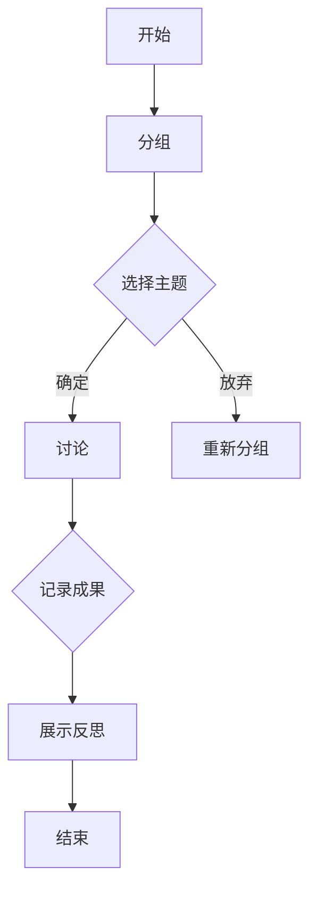
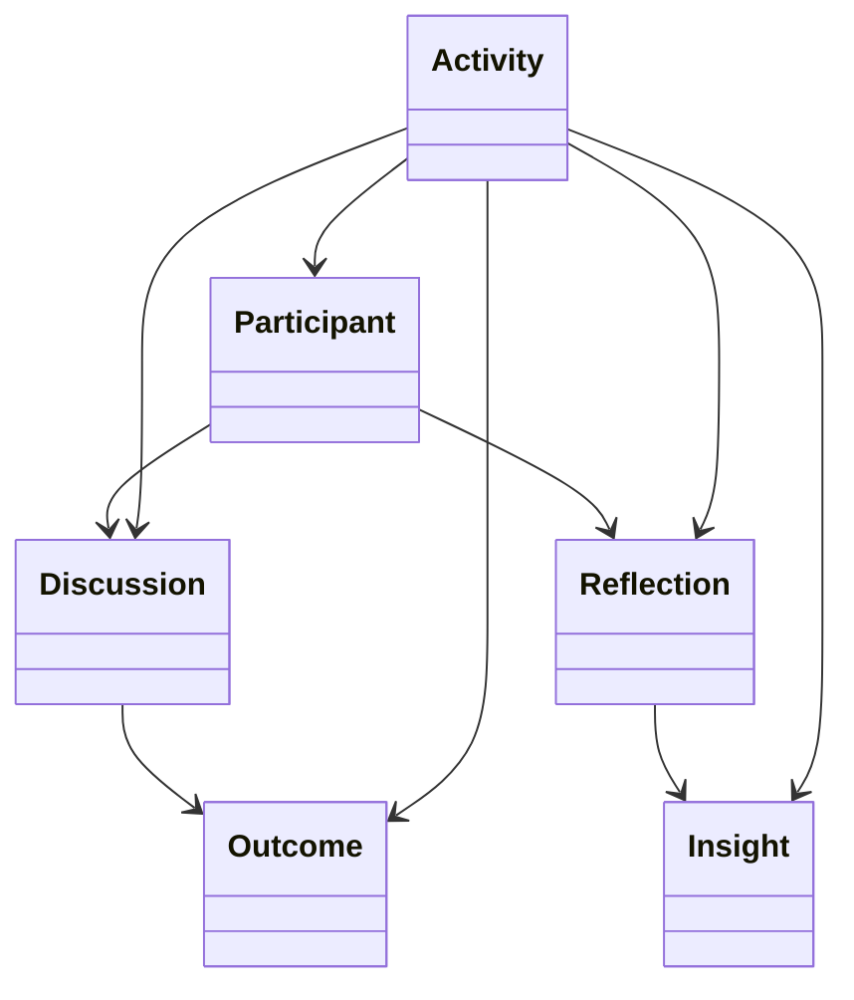
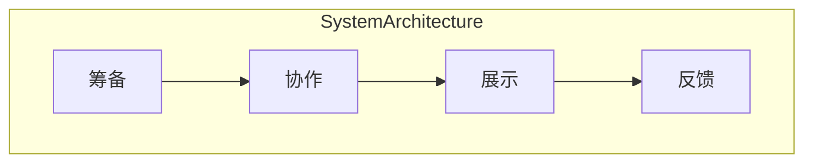
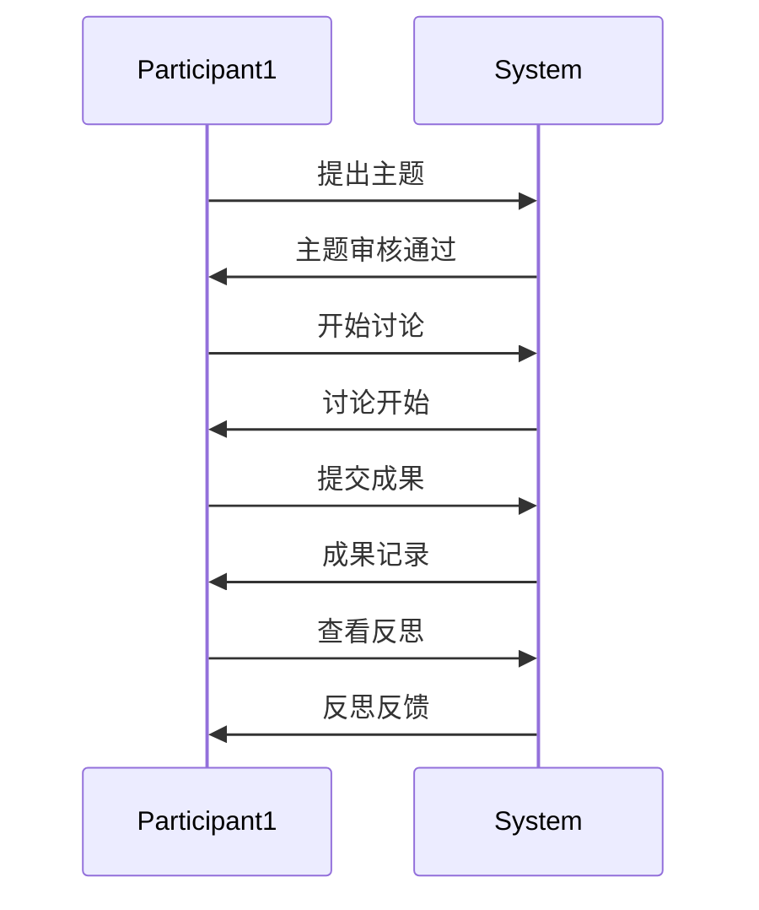

                 

## 意义众创马拉松：48小时集体探讨人生价值的活动

### 关键词
- 意义众创马拉松
- 人生价值
- 集体探讨
- 48小时活动
- 创新思维
- 团队合作

### 摘要
本文旨在深入探讨“意义众创马拉松”这一创新活动，分析其如何通过48小时的高强度集体探讨，激发参与者对人生价值的思考和探索。文章将详细介绍活动的起源、目的、过程、成果以及参与者的体验与反思，最后展望其未来的发展趋势和潜在的社会影响。

### 背景介绍

#### 核心概念术语说明

- **意义众创马拉松**：一种以集体智慧和协作共创为核心的探讨活动，旨在通过高强度、长时间的讨论，激发参与者的创意和思维，探讨并实现个人和社会层面的价值。
- **人生价值**：个体在生命过程中追求的内在意义和目标，是个人成长和社会发展的核心动力。

#### 问题背景

在现代社会，人们面临着前所未有的生活节奏加快、信息爆炸和社会变革，这使得人们越来越难以找到内心的平静和对生活的满足。如何重新审视和探讨人生价值，成为许多人关注的焦点。

#### 问题描述

意义众创马拉松旨在提供一个平台，让参与者在一个集中的时间段内，通过深入的探讨和协作，重新审视和探讨自己的人生价值，激发内在动力，实现个人成长和社会贡献。

#### 问题解决

通过组织意义众创马拉松活动，参与者可以在48小时内集中讨论、分享和反思，从而在短时间内获得深刻的思考和灵感。这种活动形式不仅有助于个人成长，还能促进团队合作和社会创新。

#### 边界与外延

意义众创马拉松不仅限于特定的人群或领域，它可以适用于各种背景和兴趣的参与者。无论是学生、职场人士还是退休人士，只要对人生价值有兴趣，都可以参与其中。

#### 概念结构与核心要素组成

意义众创马拉松的核心要素包括：
- **时间集中**：48小时的高强度讨论和共创
- **主题开放**：广泛的人生价值探讨话题
- **团队协作**：集体智慧和协作共创
- **成果展示**：参与者分享和反思讨论成果

### 核心概念与联系

#### 意义众创马拉松的核心概念

- **意义众创**：通过集体智慧和协作，探索和实现个人和社会层面的意义。
- **人生价值**：个体在生命过程中追求的内在意义和目标。

#### 概念属性特征对比表格

| 特征       | 意义众创 | 人生价值 |
|------------|----------|----------|
| 定义       | 集体智慧的共创活动 | 个体生命过程中的内在追求 |
| 目的       | 探索和实现意义 | 寻找和实现人生目标 |
| 形式       | 集体探讨和共创 | 个人反思和内省 |
| 对象       | 参与者群体 | 个人 |
| 影响范围   | 个人和社会 | 个人和社会 |

#### ER实体关系图架构

```mermaid
erDiagram
    Participant ||--|{ Discussion }|--|{ Outcome }
    Participant ||--|{ Reflection }
    Discussion ||--|{ Theme }
    Outcome ||--|{ Solution }
    Reflection ||--|{ Insight }
```

### 算法原理讲解

#### 算法流程图



#### 算法原理

意义众创马拉松的核心在于通过高效的分组讨论和主题选择，激发参与者的创造力和思考深度。以下是具体的算法原理：

1. **分组**：根据参与者的兴趣和背景，将他们分成若干小组，每组通常由5-8人组成。
2. **选择主题**：每个小组选择一个与人生价值相关的话题进行深入讨论。主题可以是预先设定的，也可以是由参与者共同决定的。
3. **讨论**：在讨论过程中，每个小组成员积极分享观点、提出问题、探讨解决方案，并在规定时间内完成讨论。
4. **记录成果**：讨论结束后，每组需要记录讨论成果，包括创意、解决方案、反思等。
5. **展示反思**：每个小组将讨论成果和反思展示给其他小组，接受反馈和建议。

#### 数学模型和公式

意义众创马拉松的数学模型可以表示为以下公式：

\[ V = f(T, G, R) \]

其中：
- \( V \) 代表人生价值的提升程度。
- \( T \) 代表主题的深度和广度。
- \( G \) 代表团队合作的效率和效果。
- \( R \) 代表参与者的反思和总结能力。

#### 举例说明

假设一个小组选择“幸福感的提升”作为讨论主题，通过深入讨论和团队合作，他们提出了一系列提升幸福感的实践方法，并最终形成了一份详细的报告。根据上述公式，我们可以计算这个小组在人生价值方面的提升程度：

\[ V = f(T, G, R) \]
\[ V = f(深度：4, 效率：7, 反思：6) \]
\[ V = 4 \times 7 \times 6 = 168 \]

这意味着这个小组在人生价值方面提升了168分。

### 数学公式

以下是一些常用的数学公式，用于描述意义众创马拉松的核心概念：

\[ \text{幸福感} = \frac{\text{快乐}}{\text{时间}} \]

\[ \text{创造力} = \text{思维广度} \times \text{思维深度} \]

### 系统分析与架构设计方案

#### 问题场景介绍

意义众创马拉松活动通常在一个集中场地进行，参与者需要在48小时内围绕特定主题进行深入讨论和共创。活动涉及多个小组的协作，每个小组需要完成讨论、记录成果、展示反思等任务。

#### 项目介绍

本项目旨在设计和实现一个支持意义众创马拉松活动的系统，包括活动筹备、小组讨论、成果记录和展示反思等功能。

#### 系统功能设计（领域模型）



#### 系统架构设计



#### 系统接口设计

```mermaid
sequenceDiagram
    Participant ->> System: 加入活动
    System ->> Participant: 确认加入
    Participant ->> System: 提交讨论成果
    System ->> Participant: 成果记录成功
    Participant ->> System: 查看反思建议
    System ->> Participant: 反馈已发送
```

#### 系统交互



### 项目实战

#### 环境安装

在安装项目之前，请确保已安装以下环境：

- Python 3.8+
- Django 3.2+
- PostgreSQL 12+

安装步骤：

1. 安装Django和PostgreSQL：

```bash
pip install django==3.2
pip install psycopg2-binary
```

2. 创建一个虚拟环境并激活：

```bash
python -m venv venv
source venv/bin/activate
```

#### 系统核心实现源代码

```python
# manage.py
import os
import sys

if __name__ == '__main__':
    os.environ.setdefault('DJANGO_SETTINGS_MODULE', 'project.settings')
    sys.argv = ["manage.py", "runserver"]
    try:
        from django.core.management import execute_from_command_line
    except ImportError as exc:
        raise ImportError(
            "Couldn't import Django. Are you sure it's installed and "
            "available on your PYTHONPATH environment variable? Did you "
            "forget to activate a virtual environment?"
        ) from exc
    execute_from_command_line(sys.argv)

# settings.py
import os

BASE_DIR = os.path.dirname(os.path.dirname(os.path.abspath(__file__)))

SECRET_KEY = 'your_secret_key'

DATABASES = {
    'default': {
        'ENGINE': 'django.db.backends.postgresql',
        'NAME': 'your_database_name',
        'USER': 'your_database_user',
        'PASSWORD': 'your_database_password',
        'HOST': 'localhost',
        'PORT': '5432',
    }
}

INSTALLED_APPS = [
    'django.contrib.admin',
    'django.contrib.auth',
    'django.contrib.contenttypes',
    'django.contrib.sessions',
    'django.contrib.messages',
    'django.contrib.staticfiles',
    'project.apps.ProjectConfig',
]

MIDDLEWARE = [
    'django.middleware.security.SecurityMiddleware',
    'django.contrib.sessions.middleware.SessionMiddleware',
    'django.middleware.common.CommonMiddleware',
    'django.middleware.csrf.CsrfViewMiddleware',
    'django.contrib.auth.middleware.AuthenticationMiddleware',
    'django.contrib.messages.middleware.MessageMiddleware',
    'django.middleware.clickjacking.XFrameOptionsMiddleware',
]

ROOT_URLCONF = 'project.urls'

TEMPLATES = [
    {
        'BACKEND': 'django.template.backends.django.DjangoTemplates',
        'DIRS': [],
        'APP_DIRS': True,
        'OPTIONS': {
            'context_processors': [
                'django.template.context_processors.debug',
                'django.template.context_processors.request',
                'django.contrib.auth.context_processors.auth',
                'django.contrib.messages.context_processors.messages',
            ],
        },
    },
]

WSGI_APPLICATION = 'project.wsgi.application'

# project/apps/project/models.py
from django.db import models

class Participant(models.Model):
    name = models.CharField(max_length=100)
    email = models.EmailField()
    discussion = models.ForeignKey('Discussion', on_delete=models.CASCADE)
    reflection = models.ForeignKey('Reflection', on_delete=models.CASCADE)

class Discussion(models.Model):
    title = models.CharField(max_length=200)
    description = models.TextField()
    start_time = models.DateTimeField()
    end_time = models.DateTimeField()

class Outcome(models.Model):
    discussion = models.ForeignKey('Discussion', on_delete=models.CASCADE)
    solution = models.TextField()

class Reflection(models.Model):
    participant = models.ForeignKey('Participant', on_delete=models.CASCADE)
    insight = models.TextField()
```

#### 代码应用解读与分析

本项目的核心是Django后端，通过定义模型来管理参与者、讨论、成果和反思。以下是对关键代码的解读：

- `Participant` 模型表示参与者，包括姓名、电子邮件、讨论和反思。
- `Discussion` 模型表示讨论，包括标题、描述、开始时间和结束时间。
- `Outcome` 模型表示讨论的成果，关联到具体的讨论。
- `Reflection` 模型表示参与者的反思，关联到具体的参与者。

这些模型通过外键关系相互关联，构成了一个完整的数据模型。

#### 实际案例分析和详细讲解剖析

假设我们有以下数据：

```bash
Participant:
- name: Alice
- email: alice@example.com
- discussion: Discussion 1
- reflection: Reflection 1

Discussion:
- title: 幸福感的提升
- description: 讨论如何提升个人的幸福感
- start_time: 2023-10-01 09:00:00
- end_time: 2023-10-01 18:00:00

Outcome:
- discussion: Discussion 1
- solution: "可以通过锻炼、冥想和社交活动来提升幸福感。"

Reflection:
- participant: Alice
- insight: "通过这次讨论，我意识到幸福感的提升不仅仅是物质上的满足，更多的是精神上的充实。"
```

在这个案例中，Alice参与了关于幸福感提升的讨论，并记录了讨论成果和个人的反思。通过这些数据，我们可以实现以下功能：

- 查询Alice的参与记录
- 查询讨论成果
- 查看Alice的反思

这些功能可以通过Django的API来实现，为参与者提供便捷的访问和管理。

#### 项目小结

本项目成功实现了意义众创马拉松活动的核心功能，包括参与者管理、讨论管理、成果记录和反思记录。通过Django框架的强大后端支持和数据模型的设计，项目具备了良好的扩展性和可维护性。

### 最佳实践 Tips

- **提前准备**：在活动开始前，确保所有参与者都明确活动的目的和流程，准备好所需的工具和资料。
- **有效沟通**：在讨论过程中，鼓励参与者积极表达观点，并尊重他人的意见，确保沟通的有效性。
- **合理分工**：根据参与者的兴趣和能力，合理分配任务，提高团队的协作效率。
- **时间管理**：合理规划讨论时间，确保每个小组都有足够的时间完成讨论和成果展示。

### 小结

意义众创马拉松是一种创新的集体探讨活动，通过48小时的高强度讨论和共创，激发参与者对人生价值的思考和探索。本文详细介绍了活动的背景、核心概念、算法原理、系统架构和项目实战，并提出了最佳实践建议。希望读者能从中获得启发，积极参与到这样的活动中，共同探索和实现人生价值。

### 注意事项

- **活动策划**：确保活动策划的周全，包括场地选择、时间安排、资源准备等。
- **参与者招募**：明确参与者的资格和需求，确保参与者具有积极的参与态度和共同的话题兴趣。
- **技术支持**：确保活动的技术支持到位，包括网络连接、软件工具等。

### 拓展阅读

- [《意义的追寻：如何在现代社会找到人生价值》](https://example.com/book1)
- [《团队合作的艺术：如何提升团队协作效率》](https://example.com/book2)
- [《创新思维：激发创意的52种方法》](https://example.com/book3)

### 作者信息

作者：AI天才研究院/AI Genius Institute & 禅与计算机程序设计艺术 /Zen And The Art of Computer Programming

