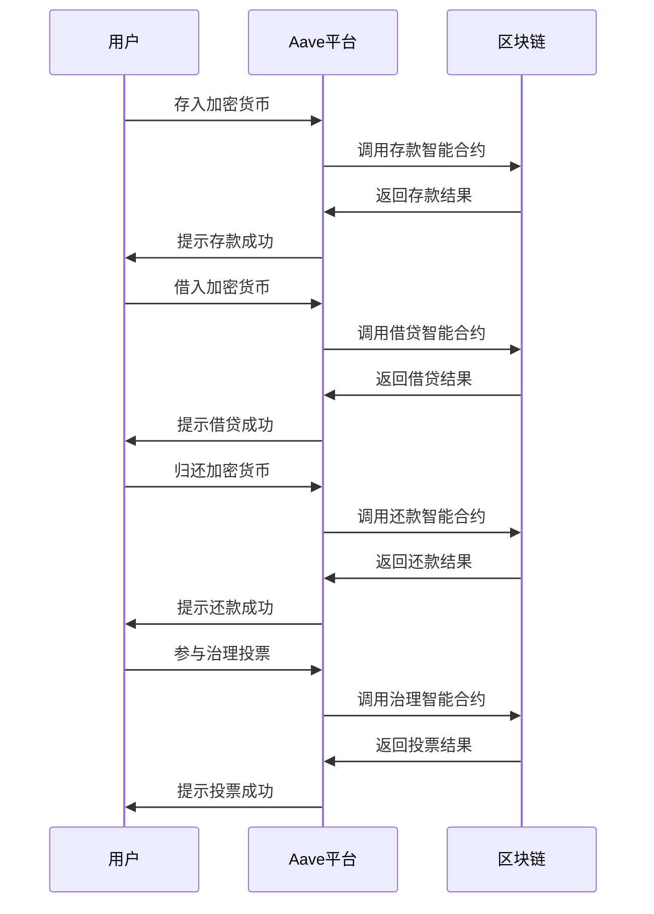

                 

## 引言

### 1.1 区块链技术发展背景

区块链技术，自2008年中本聪（Satoshi Nakamoto）首次提出以来，已经走过了将近二十年的发展历程。它作为一种分布式账本技术，基于密码学原理，实现了去中心化的数据存储和管理，并在金融、供应链、医疗、能源等多个领域得到了广泛应用。区块链技术的出现，不仅为信息传递和数据处理带来了革命性的变化，也为去中心化的价值交换提供了可能性。

区块链技术的兴起，与互联网的普及和技术进步密切相关。早期的互联网时代，信息传递主要依赖于中心化的服务器，这使得信息的安全性和透明度受到了一定程度的挑战。随着互联网技术的不断发展和人们对信息安全的日益关注，去中心化的解决方案逐渐成为人们关注的焦点。区块链技术正是在这样的背景下应运而生，它通过去中心化的方式，实现了数据的分布式存储和管理，从而在一定程度上提高了数据的安全性和透明度。

### 1.2 去中心化与价值交换的重要性

去中心化，是区块链技术的核心特点之一。与传统的中心化系统不同，去中心化系统没有中心化的控制节点，所有节点都具有平等的权利和义务。这意味着，在去中心化系统中，数据的管理和决策是由所有参与者共同完成的，而不是由某个中心化的权威机构来决定。去中心化不仅提高了系统的透明度和安全性，还降低了系统的脆弱性，使得系统在面对外部攻击时更加坚韧。

价值交换，是区块链技术的另一个重要应用场景。在传统的金融体系中，价值交换通常依赖于中介机构，如银行或支付公司。这些中介机构在价值交换过程中扮演着信用担保和交易记录的角色。然而，这种中心化的方式不仅效率低下，还存在一定的风险。区块链技术通过去中心化的方式，实现了价值交换的直接对接，减少了中介环节，提高了交易效率，降低了交易成本。

### 1.3 本书的目的和结构

本书旨在深入探讨区块链技术在构建去中心化社区和价值交换网络平台中的应用。具体来说，本书将从以下几个方面展开讨论：

1. **基础概念**：介绍区块链技术和去中心化社区的基本概念，帮助读者建立全面的理论基础。

2. **去中心化社区构建**：详细讲解如何构建去中心化社区，包括社区治理模型、激励机制等。

3. **价值交换网络平台设计**：探讨价值交换网络平台的设计原则、核心功能和安全性。

4. **技术实现**：介绍区块链技术的核心实现原理，以及价值交换网络平台的编码实现和智能合约的应用。

5. **案例分析**：分享成功构建去中心化社区和价值交换平台的案例，分析其中的成功经验和挑战。

6. **未来展望与挑战**：探讨去中心化社区和价值交换平台的未来发展趋势，以及面临的挑战和潜在解决方案。

通过本书的深入探讨，读者将能够全面了解区块链技术在构建去中心化社区和价值交换网络平台中的应用，并为实际项目提供有价值的参考。

### 目录大纲

1. 引言
   - 1.1 区块链技术发展背景
   - 1.2 去中心化与价值交换的重要性
   - 1.3 本书的目的和结构

2. 基础概念
   - 2.1 区块链技术概述
   - 2.2 区块链与去中心化的关系
   - 2.3 价值交换的基本原理

3. 去中心化社区构建
   - 3.1 去中心化社区的概念
   - 3.2 构建去中心化社区的步骤
   - 3.3 社区治理模型

4. 价值交换网络平台设计
   - 4.1 价值交换平台的基本架构
   - 4.2 平台的核心功能设计
   - 4.3 平台的安全性考虑

5. 技术实现
   - 5.1 区块链技术核心实现原理
   - 5.2 价值交换网络平台的编码实现
   - 5.3 智能合约的应用

6. 案例分析
   - 6.1 成功案例分享
   - 6.2 案例分析：成功经验与挑战

7. 未来展望与挑战
   - 7.1 去中心化社区和价值交换平台的未来发展趋势
   - 7.2 面临的挑战和潜在解决方案

通过上述目录大纲，本书将系统性地探讨区块链技术在构建去中心化社区和价值交换网络平台中的应用，为读者提供深入的理论知识和实践指导。

### 基础概念

#### 2.1 区块链技术概述

区块链技术，是一种分布式账本技术，其基本原理是通过一系列按时间顺序排列的、不可篡改的数据区块来记录和验证交易信息。每个区块都包含了多个交易记录，这些交易记录一旦被验证并被添加到一个区块中，就不可再更改。这种不可篡改的特性，使得区块链技术在数据安全和透明度方面具有显著优势。

区块链技术的核心组成部分包括：

1. **数据区块**：数据区块是区块链的基本单位，每个区块包含一定数量的交易记录，并有一个时间戳和一个唯一的哈希值。哈希值用于确保区块之间的链接不可篡改。

2. **分布式网络**：区块链是通过一个分布式网络进行维护的，网络中的每个节点都保存了一份完整的区块链副本。节点通过共识机制来验证和添加新的区块，确保整个网络的同步和一致性。

3. **加密算法**：区块链使用密码学算法来保护数据的安全性和隐私。例如，公钥加密算法用于确保交易信息的机密性，而哈希算法用于确保数据的完整性。

4. **共识机制**：共识机制是区块链网络中节点达成一致的方法。不同的区块链有不同的共识机制，如工作量证明（PoW）、权益证明（PoS）等。共识机制决定了区块链网络的性能和安全性。

#### 2.2 区块链与去中心化的关系

去中心化，是区块链技术的核心特点之一。与传统的中心化系统不同，去中心化系统没有中心化的控制节点，所有节点都具有平等的权利和义务。这意味着，在去中心化系统中，数据的管理和决策是由所有参与者共同完成的，而不是由某个中心化的权威机构来决定。

去中心化在区块链技术中的应用，主要体现在以下几个方面：

1. **去中心化的账本**：区块链通过分布式账本技术，实现了数据的分布式存储和管理。每个节点都保存了一份完整的账本副本，任何一笔交易都需要经过所有节点的验证和确认，从而确保账本的一致性和不可篡改性。

2. **去中心化的治理**：区块链通过共识机制和智能合约，实现了去中心化的治理。在区块链网络中，所有参与者都可以参与治理决策，而不是由某个中心化的机构来决定。这种去中心化的治理方式，不仅提高了决策的透明度和公正性，还降低了治理的成本和风险。

3. **去中心化的交易**：区块链通过去中心化的交易方式，实现了价值交换的直接对接，减少了中介环节。在区块链网络中，参与者可以直接进行交易，而不需要依赖第三方中介机构。这种去中心化的交易方式，不仅提高了交易效率，还降低了交易成本。

#### 2.3 价值交换的基本原理

价值交换，是区块链技术的另一个重要应用场景。在传统的金融体系中，价值交换通常依赖于中介机构，如银行或支付公司。这些中介机构在价值交换过程中扮演着信用担保和交易记录的角色。然而，这种中心化的方式不仅效率低下，还存在一定的风险。

区块链技术通过去中心化的方式，实现了价值交换的直接对接，其基本原理包括：

1. **去中心化的交易记录**：在区块链网络中，所有交易记录都是公开透明的，且不可篡改。这意味着，每个参与者都可以查看和验证交易记录，从而确保交易的真实性和安全性。

2. **加密算法**：区块链使用加密算法来保护交易信息的机密性。例如，公钥加密算法可以确保交易信息的机密性，从而防止未授权的访问和篡改。

3. **共识机制**：区块链通过共识机制来确保交易记录的一致性和有效性。在区块链网络中，所有节点都需要验证和确认交易记录，从而确保交易的一致性和安全性。

4. **智能合约**：智能合约是区块链网络中自动执行的合约，用于实现自动化交易。智能合约通过预定义的逻辑和规则，自动执行交易，从而确保交易的透明性和公正性。

通过上述基本原理，区块链技术实现了去中心化的价值交换，从而解决了传统金融体系中存在的效率低下、风险高等问题。

### 区块链技术概述

区块链技术是一种基于分布式账本和共识机制的数字系统，它通过加密算法确保数据的不可篡改性和安全性。要深入理解区块链技术，我们需要从其基本组成部分和运行机制入手。

#### 区块

区块链由一系列按时间顺序排列的数据区块组成，每个区块包含若干交易记录和一些控制信息。具体来说，每个区块通常包括以下内容：

1. **交易记录**：每个区块包含了最近一段时间内的交易信息。这些交易可以是货币转移、信息交换或其他任何形式的价值传递。

2. **时间戳**：时间戳用于记录区块生成的时间，确保区块链的有序性。

3. **哈希值**：每个区块都包含前一个区块的哈希值，这种链接方式确保了区块链的不可篡改性。

4. **难度目标**：在基于工作量证明的区块链中，难度目标用于调节区块生成的速度，确保区块链的扩展性和安全性。

#### 区块链网络

区块链网络是由多个节点组成的分布式网络。每个节点都运行着区块链的完整副本，并负责验证和传播交易信息。区块链网络的关键组成部分包括：

1. **节点**：节点是区块链网络的参与方，可以是个人或组织。每个节点都存储着区块链的完整副本，并参与交易验证和区块生成。

2. **共识机制**：共识机制是区块链网络中的节点达成一致的方法。不同的区块链使用不同的共识机制，如工作量证明（PoW）、权益证明（PoS）等。

3. **加密算法**：区块链网络使用多种加密算法，包括哈希算法、数字签名、公钥加密等，来保护数据的安全性和隐私。

#### 区块链运行机制

区块链的运行机制主要包括以下步骤：

1. **交易产生**：用户在网络中发起交易，交易信息会被打包成待验证的区块。

2. **区块验证**：节点通过共识机制对区块进行验证，验证过程通常包括交易的有效性验证和区块链的一致性检查。

3. **区块添加**：验证通过后，新的区块会被添加到区块链的末端，并传播到整个网络。

4. **网络同步**：网络中的所有节点都会同步新的区块，确保每个节点都拥有最新的区块链副本。

#### 区块链与去中心化的关系

去中心化是区块链技术最核心的特点之一。与传统的中心化系统不同，去中心化系统没有中心化的控制节点，所有节点都具有平等的权利和义务。这种去中心化的特性在区块链技术中体现在以下几个方面：

1. **分布式账本**：区块链通过分布式账本技术，实现了数据的分布式存储和管理。每个节点都保存了一份完整的账本副本，任何一笔交易都需要经过所有节点的验证和确认，从而确保账本的一致性和不可篡改性。

2. **共识机制**：区块链通过共识机制，实现了去中心化的治理。在区块链网络中，所有参与者都可以参与治理决策，而不是由某个中心化的机构来决定。这种去中心化的治理方式，不仅提高了决策的透明度和公正性，还降低了治理的成本和风险。

3. **去中心化的交易**：区块链通过去中心化的交易方式，实现了价值交换的直接对接，减少了中介环节。在区块链网络中，参与者可以直接进行交易，而不需要依赖第三方中介机构。这种去中心化的交易方式，不仅提高了交易效率，还降低了交易成本。

### 价值交换的基本原理

价值交换，是区块链技术的关键应用场景之一。在区块链网络中，价值交换的基本原理是通过数字资产和智能合约来实现的。

#### 数字资产

数字资产，是区块链上的价值载体，可以代表各种形式的价值，如货币、股份、积分等。数字资产具有以下特点：

1. **不可篡改性**：由于区块链的加密和分布式存储特性，数字资产一旦生成，就不可篡改。这意味着，数字资产的所有权和交易记录都是透明和可追溯的。

2. **去中心化**：数字资产不依赖于任何中心化的第三方机构，其所有权和交易是由区块链网络中的所有节点共同维护和验证的。

3. **安全性**：数字资产通过加密算法和共识机制保证了其安全性。任何企图篡改数字资产的行为都会被区块链网络检测和拒绝。

#### 智能合约

智能合约，是区块链上的自动执行合约，它通过代码定义了一系列的规则和条件，当条件满足时，智能合约会自动执行相应的操作。智能合约的特点包括：

1. **自动化**：智能合约一旦部署在区块链上，就可以自动执行，无需人为干预。这种自动化特性大大提高了交易和合约的执行效率。

2. **透明性**：智能合约的代码是公开透明的，所有网络参与者都可以查看和验证智能合约的执行过程。

3. **安全性**：智能合约通过区块链的加密和分布式存储特性保证了其执行的安全性和不可篡改性。

#### 价值交换的实现过程

在区块链网络中，价值交换的实现过程主要包括以下几个步骤：

1. **交易发起**：参与者发起一笔交易，交易信息包含交易金额、交易双方等。

2. **交易验证**：交易信息被打包成区块，由区块链网络中的节点进行验证。验证过程包括检查交易的有效性和一致性。

3. **区块添加**：验证通过的区块会被添加到区块链上，交易记录也随之确认。

4. **价值转移**：在区块被添加到区块链后，交易双方的价值转移生效。数字资产的所有权和使用权发生转移。

通过数字资产和智能合约，区块链技术实现了去中心化的价值交换，解决了传统金融体系中存在的效率低下、风险高等问题。

### 区块链与去中心化的关系

去中心化，是区块链技术的核心特点和主要优势之一。理解区块链与去中心化之间的关系，有助于我们更好地把握区块链技术的本质和应用场景。

#### 去中心化的定义

去中心化，指的是系统或网络中不存在单一的中央控制节点，而是由多个平等的节点共同参与决策和数据处理。在去中心化系统中，每个节点都具备相同的权利和义务，所有节点通过共识机制来协调工作，从而实现系统的自组织和自我维护。

#### 区块链的去中心化特性

区块链技术通过一系列技术手段实现了去中心化：

1. **分布式账本**：区块链通过分布式账本技术，使得每个节点都保存了一份完整的账本副本，从而避免了中心化的单一账本风险。任何一笔交易都需要经过所有节点的验证和确认，确保账本的一致性和不可篡改性。

2. **共识机制**：区块链使用共识机制来确保节点之间的信任和一致性。不同的区块链采用不同的共识机制，如工作量证明（PoW）、权益证明（PoS）等，但共同目标都是通过去中心化的方式实现共识。

3. **加密算法**：区块链使用加密算法来保护数据的安全性和隐私。例如，公钥加密算法用于确保交易信息的机密性，哈希算法用于确保数据的完整性。

4. **智能合约**：智能合约是区块链上的自动执行合约，通过代码实现自动化的交易和治理。智能合约进一步增强了去中心化的特性，使得治理和决策过程更加透明和公正。

#### 区块链与去中心化的关系

区块链与去中心化之间的关系可以总结为以下几点：

1. **去中心化是区块链的核心目标**：区块链技术的设计初衷就是去中心化，通过分布式账本、共识机制和加密算法等技术手段，实现系统的去中心化。

2. **去中心化提升了系统的安全性**：在去中心化系统中，由于不存在中心化的控制节点，系统在面对外部攻击时更加坚韧。即使某个节点被攻破，攻击者也无法影响整个系统。

3. **去中心化提高了系统的透明度和公正性**：在去中心化系统中，所有节点都平等参与决策，决策过程是公开透明的，从而提高了系统的公正性和可信度。

4. **去中心化带来了新的应用场景**：去中心化特性为区块链技术在多个领域提供了新的应用场景，如去中心化金融（DeFi）、去中心化身份验证（DID）、去中心化治理等。

#### 区块链与去中心化的挑战

尽管去中心化带来了诸多优势，但在实际应用中仍面临一些挑战：

1. **性能和扩展性**：去中心化系统通常面临性能和扩展性的挑战。由于所有节点都需要参与验证和存储数据，系统的处理能力和响应速度可能会受到限制。

2. **安全性**：去中心化系统中的安全性问题更加复杂，需要不断更新和完善安全措施，以应对各种潜在威胁。

3. **监管和法律**：去中心化系统可能面临监管和法律方面的挑战，如何确保去中心化系统的合规性和合法性，是一个需要深入探讨的问题。

总之，区块链技术通过去中心化的方式，实现了数据的安全、透明和高效管理。去中心化不仅是区块链技术的核心目标，也为区块链技术在多个领域提供了新的可能性。理解和应对去中心化带来的挑战，将有助于区块链技术的持续发展和应用。

### 去中心化社区的概念

去中心化社区，是区块链技术在社交网络领域的重要应用之一。它通过去中心化的方式，构建了一个自主管理、自我治理的社交平台，使得社区成员能够更加平等和自由地参与社区活动和决策。

#### 去中心化社区的定义

去中心化社区，是一种基于区块链技术的社交平台，其核心特点在于去中心化和自我治理。与传统社交网络平台不同，去中心化社区没有中心化的控制节点，所有社区成员都平等参与社区的管理和决策。社区成员通过持有社区代币、参与投票、提供内容贡献等方式，共同维护社区的发展和秩序。

#### 去中心化社区的优势

1. **自主管理**：去中心化社区通过智能合约和区块链技术，实现了社区成员的自主管理。社区成员可以自主决定社区的发展方向、内容审核和规则制定，无需依赖中心化的管理者。

2. **公平透明**：在去中心化社区中，所有决策和活动都是公开透明的，社区成员可以通过区块链查看所有交易记录和投票结果，确保社区运行的公正性和透明度。

3. **去中心化治理**：去中心化社区通过共识机制和代币经济模型，实现了去中心化的治理。社区成员通过持有代币、参与投票等方式，共同参与社区管理和决策，从而提高了社区的民主性和参与度。

4. **抗审查性**：去中心化社区由于其去中心化的特性，使得内容审核和监管变得更加困难。社区成员可以在不受外部审查的情况下自由表达观点和创作内容，为言论自由提供了新的保障。

#### 去中心化社区的组成

去中心化社区通常包括以下几个核心组成部分：

1. **区块链网络**：区块链网络是去中心化社区的基础设施，用于存储社区成员的信息、交易记录和智能合约代码。常见的区块链平台包括以太坊、EOS、波场等。

2. **智能合约**：智能合约是去中心化社区中的自动执行合约，用于管理社区成员的权益、投票规则和内容审核等。智能合约通过代码定义了社区的运行逻辑和规则，确保社区的公正和透明。

3. **社区代币**：社区代币是去中心化社区的货币，用于支付社区服务、奖励贡献者和管理费用。社区代币通常与区块链网络挂钩，具有价值存储和流通功能。

4. **治理机制**：治理机制是去中心化社区中的决策机制，用于处理社区成员之间的纠纷、投票和规则制定。常见的治理机制包括提案投票、权益投票等。

#### 去中心化社区的发展前景

随着区块链技术的不断发展和应用，去中心化社区在社交网络领域具有广阔的发展前景：

1. **隐私保护**：去中心化社区通过区块链技术，实现了用户的隐私保护和数据安全。在未来，去中心化社区有望成为隐私保护的重要平台。

2. **内容创新**：去中心化社区为内容创作者提供了自由表达和收益保障的平台，有望激发更多的创作活力和内容创新。

3. **经济模型**：去中心化社区通过代币经济模型，实现了社区成员的参与和激励机制，有望推动社区经济的繁荣和发展。

4. **治理创新**：去中心化社区通过去中心化的治理机制，实现了更加民主和公正的决策过程，有望为治理模式带来新的变革。

总之，去中心化社区作为一种新兴的社交网络形式，具有自主管理、公平透明、去中心化治理等优势，将在未来社会发展中发挥重要作用。

### 构建去中心化社区的步骤

构建一个去中心化社区，需要从需求分析、平台设计、技术实现、测试和部署等多个环节进行系统性的规划和执行。以下是构建去中心化社区的详细步骤：

#### 1. 需求分析

**需求分析**是构建去中心化社区的第一步，它涉及明确社区的目标、用户需求、功能需求和技术需求。

- **社区目标**：明确社区的核心目标，如建立去中心化的内容分享平台、去中心化的社交网络等。
- **用户需求**：调研目标用户群体的需求和偏好，了解用户希望从社区中获得的体验和功能。
- **功能需求**：根据用户需求，明确社区需要实现的功能，如内容创作与发布、投票与治理、代币经济模型等。
- **技术需求**：分析实现社区功能所需的技术栈，包括区块链平台、智能合约开发、前端和后端技术等。

#### 2. 平台设计

**平台设计**是构建去中心化社区的核心环节，包括功能设计、架构设计和用户体验设计。

- **功能设计**：根据需求分析的结果，设计社区的功能模块，如内容发布与审核、投票与治理、代币发行与交易等。功能设计需要确保各模块之间的逻辑一致性。
- **架构设计**：设计社区的整体架构，包括区块链网络架构、智能合约架构、前端和后端架构等。架构设计需要考虑系统的可扩展性、安全性和性能。
- **用户体验设计**：设计社区的用户界面和交互流程，确保用户能够方便、直观地使用社区功能。用户体验设计需要关注用户的使用习惯和体验感受。

#### 3. 技术实现

**技术实现**是构建去中心化社区的具体实施阶段，包括区块链平台的选择、智能合约开发、前端和后端开发等。

- **区块链平台选择**：根据社区的设计需求，选择适合的区块链平台，如以太坊、EOS、波场等。不同的区块链平台具有不同的性能、安全性和开发便利性。
- **智能合约开发**：编写智能合约代码，实现社区的功能模块。智能合约是去中心化社区的核心，其代码质量直接影响到社区的安全性和稳定性。
- **前端和后端开发**：开发社区的前端和后端系统，实现用户界面和业务逻辑。前端系统需要关注用户体验和交互设计，后端系统需要处理数据存储、交易处理和智能合约交互等。
- **测试**：在开发过程中，进行详细的单元测试、集成测试和压力测试，确保系统的稳定性和可靠性。

#### 4. 测试和部署

**测试和部署**是确保社区质量和安全的重要环节。

- **测试**：进行全面的系统测试，包括功能测试、性能测试、安全测试等，确保社区的功能完备、性能优异、安全可靠。
- **部署**：将社区部署到生产环境中，确保社区的稳定运行和用户访问。部署过程中，需要进行环境配置、数据迁移和监控设置等。

#### 5. 社区治理

**社区治理**是去中心化社区长期稳定运行的关键。

- **治理模型**：设计社区的治理模型，如提案投票、权益投票等，确保社区成员能够参与社区管理和决策。
- **激励机制**：设计社区激励机制，如代币奖励、积分奖励等，鼓励社区成员积极参与社区建设和治理。
- **规则制定**：制定社区规则，确保社区的秩序和稳定，如内容审核标准、交易规则等。

#### 6. 持续迭代

**持续迭代**是去中心化社区长期发展的必要手段。

- **用户反馈**：收集社区成员的反馈意见，了解社区的改进方向和用户需求。
- **功能迭代**：根据用户反馈和社区发展需要，持续迭代和优化社区功能，提升用户体验。
- **技术升级**：随着区块链技术和技术的发展，不断更新和升级社区技术，确保社区的先进性和安全性。

通过以上步骤，可以系统性地构建一个去中心化的社区平台，实现用户需求的满足和社区的长久稳定发展。

### 社区治理模型

去中心化社区的成功离不开有效的治理模型，这些模型确保了社区的自治、公平和透明。以下几种常见的治理模型将在本文中进行详细讨论。

#### 共识机制

共识机制是去中心化社区治理的核心，用于确保社区成员对事务的达成一致。不同类型的区块链采用不同的共识机制，以下是几种常见的共识机制：

1. **工作量证明（PoW）**：节点通过解决复杂的数学问题来获取记账权，这需要大量的计算资源。PoW机制在比特币和以太坊经典中广泛使用。

2. **权益证明（PoS）**：节点根据其持有的代币数量和锁定时间来获取记账权，这降低了能源消耗，同时减少了51%攻击的风险。PoS机制在卡利多世（Cardano）和波场（Tron）中应用。

3. **委托权益证明（DPoS）**：社区成员投票选出代表节点进行记账，这些代表节点按投票比例获得记账权。这种机制在比特股（BitShares）和李笑来创立的波场（TRON）中应用。

#### 智能合约

智能合约是去中心化社区中自动执行合约的代码，它通过区块链技术实现了自动化和去中心化的治理。智能合约在以下方面发挥作用：

1. **投票和决策**：智能合约可以编程实现投票机制，确保投票过程的透明和公正。投票结果可以直接影响社区治理决策。

2. **代币经济模型**：智能合约可以设定代币发行、分配和激励规则，激励社区成员参与社区建设和治理。

3. **内容审核**：智能合约可以设定内容审核标准，确保社区内容的合规性和质量。

#### 共识委员会

共识委员会是一种常见的社区治理结构，它由社区成员选举产生，负责处理社区的重大决策和纠纷。共识委员会的职责包括：

1. **决策制定**：共识委员会讨论并决定社区的重大事务，如平台发展方向、规则变更等。

2. **规则制定**：共识委员会制定社区规则，确保社区的运行秩序。

3. **争议解决**：共识委员会处理社区成员之间的争议，确保社区内部的和谐。

#### 代币经济模型

代币经济模型是去中心化社区激励机制的基石，它通过代币发行、分配和激励机制，鼓励社区成员积极参与社区建设和治理。以下是一些常见的代币经济模型：

1. **挖矿激励**：通过挖矿获得代币奖励，激励节点参与区块链网络的维护。

2. **持币分红**：持有一定数量代币的成员可以获得平台的分红，激励长期持有和参与社区。

3. **内容奖励**：社区成员创作和分享有价值的内容可以获得代币奖励，激励社区内容生态的繁荣。

#### 权益投票

权益投票是一种常见的治理机制，社区成员通过持有的代币数量来投票，决定社区的重大事务。权益投票的优势包括：

1. **民主性**：确保社区成员的平等参与，每个成员都有发言权和投票权。

2. **公正性**：投票结果直接反映社区成员的意愿，确保决策的公正性。

3. **透明性**：投票过程和结果记录在区块链上，确保透明和可追溯。

综上所述，去中心化社区的治理模型包括共识机制、智能合约、共识委员会、代币经济模型和权益投票等多种机制。这些模型共同作用，确保了社区的自治、公平和透明，为社区的长期稳定发展提供了坚实基础。

### 价值交换平台的基本架构

构建一个高效、安全且可扩展的价值交换网络平台，需要精心设计其基本架构，以满足多样化的业务需求。以下是对价值交换平台基本架构的详细解析。

#### 系统组成部分

1. **区块链网络**：作为平台的核心，区块链网络用于记录和验证所有的交易活动，确保数据的不可篡改性和透明度。区块链网络由多个节点组成，每个节点都存储一份完整的账本副本，并通过共识机制保持一致性。

2. **智能合约**：智能合约是自动化执行的合约，它定义了平台上的业务逻辑和规则。智能合约在区块链上部署，确保交易按照预定的规则进行，从而提高交易的透明度和效率。

3. **前端应用**：前端应用提供用户与平台交互的界面，包括用户注册、登录、交易操作、钱包管理等功能。前端应用需要与区块链和后端系统进行交互，以确保数据的实时同步和一致性。

4. **后端服务**：后端服务负责处理业务逻辑、数据存储、交易处理和智能合约的调用等。后端系统需要具备高并发处理能力，以确保平台在高峰期的稳定性。

5. **数据存储**：数据存储系统用于存储用户信息、交易记录、智能合约代码等。数据存储系统需要支持高并发读写、数据备份和恢复等功能，以确保数据的安全性和可靠性。

#### 架构设计原则

1. **模块化**：系统设计应遵循模块化原则，将不同功能模块独立开发、测试和部署，以提高系统的可维护性和可扩展性。

2. **高可用性**：平台设计应考虑高可用性，通过冗余设计、故障转移和负载均衡等手段，确保系统在故障情况下能够快速恢复，避免单点故障。

3. **安全性**：系统设计应注重安全性，采用加密算法、权限控制、访问控制等手段，确保用户数据和交易信息的安全。

4. **可扩展性**：系统设计应具备良好的可扩展性，支持业务规模的扩展和功能扩展，以满足不断变化的市场需求。

#### 架构实现细节

1. **区块链网络**：选择合适的区块链平台，如以太坊、Hyperledger Fabric等，构建区块链网络。确保区块链网络具有高并发处理能力、良好的安全性和可扩展性。

2. **智能合约**：使用Solidity或其他合适的编程语言编写智能合约，定义平台上的业务逻辑和规则。智能合约需要经过严格测试，确保其正确性和安全性。

3. **前端应用**：使用现代前端技术栈，如React、Vue等，开发用户友好的前端应用。前端应用需要与区块链网络进行安全通信，确保数据的完整性和安全性。

4. **后端服务**：使用微服务架构，将业务逻辑分解为多个独立的微服务，如用户服务、交易服务、钱包服务等。每个微服务都可以独立开发、测试和部署，以提高系统的灵活性和可维护性。

5. **数据存储**：使用分布式数据库，如MongoDB、Cassandra等，存储用户信息和交易记录。数据存储系统需要支持高并发读写、数据备份和恢复等功能。

#### 系统交互设计

系统各部分之间的交互设计是平台架构实现的关键。以下是系统交互设计的几个关键点：

1. **API接口**：设计统一的API接口，用于前端应用与后端服务之间的通信。API接口应遵循RESTful设计原则，确保接口的简洁性和易用性。

2. **交易流程**：定义清晰的交易流程，包括用户发起交易、交易验证、交易确认等步骤。确保交易流程的透明性和可追溯性。

3. **数据同步**：确保区块链网络与后端服务之间的数据同步，确保数据的实时性和一致性。可以使用事件驱动的方式，如Webhook，实现实时数据同步。

4. **安全机制**：设计安全机制，如身份认证、访问控制、数据加密等，确保系统各部分之间的通信安全。

通过上述基本架构设计，可以构建一个高效、安全且可扩展的价值交换平台，满足多样化的业务需求，并为用户提供良好的用户体验。

### 平台的核心功能设计

价值交换网络平台的核心功能设计是确保平台能够高效、稳定地实现价值交换和社区治理。以下是平台的核心功能模块及其具体设计。

#### 1. 价值交换模块

**功能描述**：价值交换模块是平台的核心，用于实现用户之间的价值转移。这个模块需要支持多种交易类型，如点对点交易、批量交易等。

**设计细节**：
- **交易类型**：设计多种交易类型，包括货币交易、数字资产交易、积分交易等，以适应不同用户的需求。
- **交易流程**：设计清晰的交易流程，包括交易发起、交易验证、交易确认等步骤。确保交易流程的透明性和可追溯性。
- **交易规则**：制定交易规则，如最小交易金额、交易手续费等，以确保交易的公平性和安全性。

**实现技术**：
- **智能合约**：使用智能合约实现交易逻辑，确保交易按照预定的规则进行。
- **加密算法**：使用加密算法保护交易信息，确保交易过程的安全性和隐私性。

#### 2. 用户认证模块

**功能描述**：用户认证模块用于确保用户身份的真实性和安全性。这个模块需要支持用户注册、登录、权限管理等功能。

**设计细节**：
- **用户注册**：设计用户注册流程，包括用户信息收集、身份验证等步骤。
- **用户登录**：设计用户登录流程，使用双因素认证（2FA）等安全措施提高账户安全性。
- **权限管理**：设计权限管理系统，确保不同用户角色拥有不同的权限，如普通用户、管理员、审计员等。

**实现技术**：
- **加密算法**：使用加密算法保护用户数据和密码。
- **身份认证协议**：使用OAuth2.0、OpenID Connect等身份认证协议，确保用户身份验证的安全性和便捷性。

#### 3. 钱包管理模块

**功能描述**：钱包管理模块用于管理用户的数字资产，包括地址生成、交易记录查看、资产转移等。

**设计细节**：
- **地址生成**：设计安全的地址生成算法，确保地址的唯一性和安全性。
- **交易记录**：设计交易记录查看功能，用户可以方便地查看自己的交易历史。
- **资产转移**：设计资产转移功能，支持用户将资产转移到其他地址。

**实现技术**：
- **加密算法**：使用加密算法保护用户钱包和资产信息。
- **非对称加密**：使用非对称加密技术实现安全的数字签名和验证。

#### 4. 社区治理模块

**功能描述**：社区治理模块用于管理社区成员的投票、提案和决策过程。

**设计细节**：
- **投票系统**：设计投票系统，支持社区成员对提案进行投票。
- **提案机制**：设计提案机制，允许社区成员提出新的治理提案。
- **决策流程**：设计决策流程，确保提案的讨论和决策过程透明、公正。

**实现技术**：
- **智能合约**：使用智能合约实现投票和提案功能，确保过程自动化和透明。
- **共识算法**：使用合适的共识算法，如PoS或DPoS，确保投票结果的公正性和一致性。

#### 5. 数据分析模块

**功能描述**：数据分析模块用于收集、分析和展示平台运行的各种数据，如交易量、活跃用户数等。

**设计细节**：
- **数据收集**：设计数据收集机制，从各个模块中收集运行数据。
- **数据分析**：设计数据分析算法，对收集的数据进行分析和可视化。
- **数据展示**：设计数据展示界面，用户可以方便地查看和分析平台数据。

**实现技术**：
- **数据存储**：使用大数据技术，如Hadoop或Spark，存储和分析大规模数据。
- **数据可视化**：使用数据可视化工具，如D3.js或ECharts，展示分析结果。

通过上述核心功能模块的设计，价值交换网络平台能够提供全面、高效的服务，满足用户在价值交换、社区治理、资产管理等方面的需求。

### 平台的安全性考虑

在构建价值交换网络平台时，安全性是至关重要的考量因素。确保平台的安全，不仅涉及到技术的实现，还包括机制的设计和流程的优化。以下是平台安全性方面的具体考虑：

#### 数据保护

1. **加密存储**：平台应使用高级加密算法（如AES-256）对用户数据（如用户信息、交易记录）进行加密存储，防止数据泄露。
2. **数据备份**：定期进行数据备份，确保在数据丢失或系统故障时能够快速恢复。
3. **访问控制**：通过设置严格的数据访问权限，确保只有授权用户可以访问敏感数据。

#### 交易安全性

1. **多重签名**：对于涉及大额交易的账户操作，可以使用多重签名机制，确保交易的安全性。例如，要求多个用户共同签名才能完成交易。
2. **智能合约审计**：在部署智能合约之前，应进行全面的审计，确保合约代码没有漏洞和安全隐患。
3. **交易监控**：建立实时交易监控机制，对异常交易进行实时预警和处理。

#### 用户认证与权限管理

1. **双因素认证**：采用双因素认证（2FA）来加强用户账户的安全性，确保只有合法用户可以访问账户。
2. **权限分级**：根据用户的角色和职责，设置不同的权限级别，确保用户只能执行与其角色相关的操作。
3. **密码策略**：制定严格的密码策略，如密码复杂度要求、定期更改密码等。

#### 防御攻击

1. **DDoS防护**：部署DDoS防护措施，防止分布式拒绝服务攻击，确保平台在高流量情况下依然能够稳定运行。
2. **安全审计**：定期进行安全审计，检查系统中的潜在漏洞和风险点。
3. **防火墙与入侵检测**：使用防火墙和入侵检测系统（IDS）来监控和防止外部攻击。

#### 应急响应

1. **应急预案**：制定详细的应急预案，确保在发生安全事件时能够迅速响应和应对。
2. **日志记录**：记录系统的所有操作日志，以便在发生安全事件时进行追踪和分析。
3. **应急演练**：定期进行应急演练，提高团队对安全事件的处理能力。

通过上述措施，可以显著提升价值交换网络平台的安全性，确保平台能够稳定、安全地运行，保护用户数据和交易的安全。

### 区块链技术核心实现原理

区块链技术的核心实现原理主要涉及分布式存储、加密算法、共识机制和智能合约等方面。以下是对这些关键技术的详细解析。

#### 分布式存储

分布式存储是区块链技术的基石之一。区块链通过分布式网络将数据存储在多个节点上，从而避免了中心化存储的风险。每个节点都保存了一份完整的区块链副本，这使得区块链具备高可用性和去中心化的特性。

**工作原理**：

1. **数据区块**：区块链的基本单位是数据区块，每个区块包含一定数量的交易记录和一些元数据，如时间戳和前一个区块的哈希值。
2. **链式结构**：区块通过哈希链接形成一个链式结构，每个区块都包含前一个区块的哈希值，确保了区块链的不可篡改性。
3. **分布式网络**：区块链网络中的每个节点都参与数据的存储和验证，任何新的交易记录都要经过所有节点的验证和确认。

**优点**：

- **去中心化**：由于数据分布在不同节点上，不存在单点故障风险。
- **安全性**：分布式存储提高了数据的抗攻击能力。
- **高可用性**：节点故障不会影响整个系统的运行。

#### 加密算法

加密算法在区块链技术中扮演着重要角色，用于保护数据的安全性和隐私。区块链主要使用以下几种加密算法：

1. **哈希算法**：哈希算法（如SHA-256）用于确保数据的完整性和不可篡改性。每个区块的哈希值是前一个区块的哈希值的函数，从而形成了一个不可篡改的链式结构。
2. **数字签名**：数字签名（如ECDSA）用于验证交易的真实性和防止双花攻击。交易发送者使用私钥对交易进行签名，接收者可以使用公钥验证签名的有效性。
3. **公钥加密**：公钥加密（如RSA）用于保护交易信息的机密性。交易信息在发送前会被发送者的公钥加密，只有接收者的私钥可以解密。

**工作原理**：

1. **哈希函数**：输入任意长度的数据，输出固定长度的哈希值。哈希值具有唯一性，任何微小的变化都会导致哈希值显著不同。
2. **数字签名**：发送者使用私钥对交易信息进行签名，接收者使用公钥验证签名的有效性。
3. **公钥加密**：发送者使用接收者的公钥加密交易信息，只有接收者的私钥可以解密。

**优点**：

- **数据完整性**：通过哈希算法确保数据的完整性和不可篡改性。
- **交易安全性**：通过数字签名和公钥加密确保交易的安全性和隐私性。

#### 共识机制

共识机制是区块链网络中节点达成一致的方法。不同的区块链采用不同的共识机制，如PoW、PoS、DPoS等，这些机制决定了区块链的性能、安全性和去中心化程度。

**工作原理**：

1. **PoW（工作量证明）**：节点通过解决复杂的数学问题来获取记账权，获得记账权的节点可以生成新的区块。这个过程需要大量的计算资源，从而确保区块链的不可篡改性。
2. **PoS（权益证明）**：节点根据其持有的代币数量和锁定时间来获取记账权。持有代币越多、锁定时间越长的节点，获取记账权的概率越大。这种方法降低了能源消耗，同时减少了51%攻击的风险。
3. **DPoS（委托权益证明）**：社区成员投票选出代表节点进行记账，代表节点按投票比例获得记账权。这种方法提高了区块链的处理能力和去中心化程度。

**优点**：

- **安全性**：通过共识机制确保区块链的不可篡改性和一致性。
- **效率**：不同的共识机制具有不同的处理能力，可以根据具体需求选择合适的机制。
- **去中心化**：共识机制确保了区块链的去中心化，减少了中心化风险。

#### 智能合约

智能合约是区块链上的自动执行合约，通过代码定义了一系列的规则和条件。当条件满足时，智能合约会自动执行相应的操作，从而实现自动化和去中心化的交易和治理。

**工作原理**：

1. **合约编写**：开发者使用特定的编程语言（如Solidity）编写智能合约代码，定义交易逻辑和规则。
2. **合约部署**：将智能合约部署到区块链上，使其成为区块链的一部分。
3. **合约执行**：当触发合约条件时，智能合约会自动执行，执行结果记录在区块链上。

**优点**：

- **自动化**：智能合约自动执行，减少了人为干预，提高了交易和治理的效率。
- **透明性**：智能合约代码是公开透明的，所有参与者都可以查看和验证。
- **不可篡改性**：智能合约一旦部署，就不能被篡改，保证了交易的公平性和公正性。

通过分布式存储、加密算法、共识机制和智能合约等技术，区块链技术实现了去中心化的数据存储和管理，为去中心化的价值交换和治理提供了可靠的技术基础。

### 价值交换网络平台的编码实现

在构建价值交换网络平台时，编码实现是关键的一步。以下将详细阐述平台的主要编码实现步骤，包括智能合约的开发、前端和后端的构建，以及系统安全性的保障。

#### 智能合约开发

智能合约是区块链平台的核心组件，用于实现平台上的业务逻辑和规则。以下是智能合约开发的步骤：

1. **需求分析**：明确平台的功能需求，如交易、代币发行、治理等。将业务逻辑转化为智能合约的需求。

2. **智能合约编写**：使用Solidity或其他智能合约编程语言，编写智能合约代码。以下是一个简单的代币发行智能合约示例：

    ```solidity
    // SPDX-License-Identifier: MIT
    pragma solidity ^0.8.0;

    contract Token {
        string public name;
        string public symbol;
        uint8 public decimals;
        uint256 public totalSupply;
        mapping(address => uint256) public balanceOf;

        event Transfer(address from, address to, uint256 value);

        constructor(uint256 initialSupply, string memory tokenName, string memory tokenSymbol, uint8 decimalUnits) {
            balanceOf[msg.sender] = initialSupply;
            name = tokenName;
            symbol = tokenSymbol;
            decimals = decimalUnits;
            totalSupply = initialSupply;
        }

        function transfer(address _to, uint256 _value) public returns (bool success) {
            require(_to != address(0));
            require(balanceOf[msg.sender] >= _value);
            balanceOf[msg.sender] -= _value;
            balanceOf[_to] += _value;
            emit Transfer(msg.sender, _to, _value);
            return true;
        }
    }
    ```

3. **智能合约测试**：使用测试框架（如Truffle）对智能合约进行单元测试和集成测试，确保合约的正确性和安全性。

4. **智能合约部署**：将经过测试的智能合约部署到区块链网络（如以太坊），确保合约代码在区块链上执行。

#### 前端开发

前端开发涉及用户界面的设计和与区块链网络的交互。以下是前端开发的步骤：

1. **界面设计**：设计用户友好的界面，包括交易页面、钱包管理页面、治理投票页面等。

2. **组件开发**：使用前端框架（如React、Vue）开发界面组件，实现页面的动态展示。

3. **与区块链交互**：使用Web3.js或 ethers.js 等库，实现前端与区块链网络的交互。以下是一个使用ethers.js获取用户钱包地址的示例：

    ```javascript
    import { ethers } from "ethers";

    async function getWalletAddress() {
        if (typeof window.ethereum === "undefined") {
            alert("请安装 MetaMask 浏览器插件");
            return;
        }
        const provider = new ethers.providers.Web3Provider(window.ethereum);
        const signer = provider.getSigner();
        const address = await signer.getAddress();
        return address;
    }
    ```

4. **交互体验优化**：通过动画和反馈机制，优化用户的交互体验。

#### 后端开发

后端开发涉及业务逻辑的处理、数据存储和与区块链网络的交互。以下是后端开发的步骤：

1. **业务逻辑处理**：实现交易处理、代币管理、治理投票等业务逻辑。

2. **数据存储**：使用数据库（如MongoDB、PostgreSQL）存储用户信息、交易记录等数据。

3. **与区块链交互**：通过API与区块链网络进行交互，如查询交易记录、调用智能合约方法等。

4. **安全性保障**：采用安全措施（如身份认证、数据加密）保障系统的安全性。

以下是一个使用Express框架的后端服务示例：

```javascript
const express = require("express");
const { ethers } = require("ethers");
const app = express();
app.use(express.json());

const contractAddress = "0x..."; // 智能合约地址
const contractABI = [ /* 智能合约ABI */ ];
const provider = new ethers.providers.JsonRpcProvider("https://mainnet.infura.io/v3/your-project-id");
const contract = new ethers.Contract(contractAddress, contractABI, provider);

app.get("/transactions", async (req, res) => {
    const transactions = await contract.transactions();
    res.json({ transactions });
});

app.post("/transfer", async (req, res) => {
    const { from, to, value } = req.body;
    const signer = provider.getSigner();
    const tx = await contract.connect(signer).transfer(to, value);
    res.json({ txHash: tx.hash });
});

const PORT = process.env.PORT || 3000;
app.listen(PORT, () => {
    console.log(`Server listening on port ${PORT}`);
});
```

通过以上编码实现步骤，我们可以构建一个功能完整、安全可靠的价值交换网络平台。智能合约确保了平台业务逻辑的正确性，前端和后端系统提供了用户友好的界面和业务处理能力，保障了系统的稳定性和安全性。

### 智能合约的应用

智能合约是区块链技术中不可或缺的一部分，它在价值交换网络平台中扮演着关键角色。智能合约通过代码定义了一系列的规则和条件，当条件满足时，智能合约会自动执行预定的操作。以下是智能合约在价值交换平台中的应用场景和具体实现。

#### 应用场景

1. **交易验证**：智能合约可以验证交易的有效性，确保只有符合规则的交易被确认。例如，在比特币网络中，智能合约用于验证交易的合法性和资产转移。

2. **代币发行与管理**：智能合约可以控制代币的发行、分配和转移。例如，在以太坊平台上，ERC-20智能合约用于发行和管理代币。

3. **投票与治理**：智能合约可以用于社区治理和决策过程，确保投票的公正性和透明性。例如，在DAO（去中心化自治组织）中，智能合约用于管理投票和决策。

4. **自动化合约执行**：智能合约可以自动执行特定的操作，如支付、保险索赔处理等。例如，在Aragon平台上，智能合约用于自动化企业的日常运营和决策。

#### 实现示例

以下是一个简单的智能合约示例，用于实现一个代币发行和转账功能。

```solidity
// SPDX-License-Identifier: MIT
pragma solidity ^0.8.0;

contract Token {
    string public name = "MyToken";
    string public symbol = "MTK";
    uint8 public decimals = 18;
    uint256 public totalSupply;
    mapping(address => uint256) public balanceOf;
    mapping(address => mapping(address => uint256)) public allowance;
    address public owner;

    event Transfer(address indexed from, address indexed to, uint256 value);
    event Approval(address indexed owner, address indexed spender, uint256 value);

    constructor(uint256 initialSupply) {
        balanceOf[owner] = initialSupply;
        totalSupply = initialSupply;
        owner = msg.sender;
    }

    function transfer(address _to, uint256 _value) public returns (bool success) {
        require(_to != address(0));
        require(balanceOf[msg.sender] >= _value);
        
        balanceOf[msg.sender] -= _value;
        balanceOf[_to] += _value;
        
        emit Transfer(msg.sender, _to, _value);
        return true;
    }

    function approve(address _spender, uint256 _value) public returns (bool success) {
        allowance[msg.sender][_spender] = _value;
        emit Approval(msg.sender, _spender, _value);
        return true;
    }

    function transferFrom(address _from, address _to, uint256 _value) public returns (bool success) {
        require(_to != address(0));
        require(balanceOf[_from] >= _value);
        require(allowance[_from][msg.sender] >= _value);
        
        balanceOf[_from] -= _value;
        balanceOf[_to] += _value;
        allowance[_from][msg.sender] -= _value;
        
        emit Transfer(_from, _to, _value);
        return true;
    }
}
```

#### 数学模型与公式

智能合约的执行逻辑可以通过数学模型和公式进行描述。以下是一个简单的数学模型示例，用于说明代币的转账过程。

1. **余额计算**：
   - `balanceOf[from]`：发送方的代币余额。
   - `balanceOf[to]`：接收方的代币余额。
   - `value`：转账的代币数量。

   转账前后的余额关系可以表示为：
   $$ balanceOf[from] - value = balanceOf[to] + value $$

2. **授权转账**：
   - `allowance[from][spender]`：发送方授权给spender的代币数量。

   授权转账时的余额关系可以表示为：
   $$ balanceOf[from] - value = balanceOf[to] + value $$
   $$ allowance[from][spender] - value = 0 $$

3. **交易费用**：
   - `gasPrice`：交易的费用。
   - `gasLimit`：交易所需的最大燃气量。

   交易的总费用可以表示为：
   $$ totalFee = gasPrice \times gasLimit $$

通过这些数学模型和公式，我们可以理解智能合约如何通过代码实现复杂的业务逻辑和规则。

### 案例分析

为了更好地理解智能合约在实际项目中的应用，以下将分析一个真实的去中心化金融（DeFi）项目——Aave。

#### 项目介绍

Aave是一个去中心化的借贷协议，允许用户借出和借入加密货币。Aave通过智能合约实现了去中心化的借贷管理，用户可以直接在区块链上进行借贷操作，而不需要依赖中心化的中介机构。

##### 系统功能设计

Aave的系统功能设计包括以下几个关键模块：

1. **存款模块**：用户可以将加密货币存入Aave平台，成为贷方，并获得平台收益。
2. **借贷模块**：用户可以借入加密货币，成为借方，支付利息即可使用资金。
3. **流动性模块**：通过借贷模块，平台形成了流动性池，用于支持不同的借贷需求。
4. **治理模块**：Aave社区成员可以通过投票参与平台治理，决定平台的发展方向。

##### 系统架构设计

Aave的系统架构设计包括以下几个核心组件：

1. **区块链网络**：Aave使用以太坊区块链作为底层基础设施，所有交易和数据都记录在以太坊区块链上。
2. **智能合约**：Aave的核心业务逻辑通过一系列智能合约实现，包括存款合约、借贷合约和治理合约。
3. **前端应用**：前端应用提供用户交互界面，用户可以通过前端应用与智能合约进行交互。
4. **后端服务**：后端服务用于处理数据存储、智能合约调用和用户身份验证等。

##### 系统接口设计

Aave的系统接口设计主要包括以下接口：

1. **存款接口**：用户可以通过存款接口将加密货币存入Aave平台。
2. **借贷接口**：用户可以通过借贷接口借入和归还加密货币。
3. **流动性接口**：流动性提供者可以通过流动性接口参与平台的流动性池。
4. **治理接口**：社区成员可以通过治理接口参与平台治理投票。

##### 系统交互序列图

以下是Aave系统交互的Mermaid序列图：



#### 实际案例分析与详细讲解

Aave作为一个成功的DeFi项目，其成功离不开智能合约的合理设计和高效的系统架构。以下是Aave项目中的一些关键点：

1. **智能合约安全性**：Aave的智能合约经过严格的审计和测试，确保其安全性。智能合约的设计遵循最小权限原则，只允许必要的操作，从而降低了漏洞风险。

2. **去中心化治理**：Aave通过去中心化的治理机制，使社区成员能够参与平台的管理和决策。社区成员可以通过投票决定平台的发展方向，确保平台的公正性和透明性。

3. **高效流动性管理**：Aave通过流动性模块，形成了高效的流动性池，支持多种借贷需求。流动性提供者可以获得收益，用户可以获得更低的借贷利率。

4. **用户体验优化**：Aave的前端应用设计简洁易用，用户可以方便地进行存款、借贷和投票等操作。通过优化用户体验，Aave吸引了大量用户，促进了平台的繁荣。

通过以上分析，我们可以看到Aave项目在智能合约应用、系统架构设计和用户体验优化等方面的成功经验。这些经验对于其他去中心化项目具有重要的借鉴意义。

### 未来展望与挑战

随着区块链技术的不断发展，去中心化社区和价值交换平台的未来充满了无限可能性。然而，在这一过程中，我们也面临着诸多挑战。

#### 发展趋势

1. **技术应用**：随着区块链技术的不断进步，更多的创新应用将会涌现。例如，跨链技术、分层网络和状态通道等，将进一步提高区块链的性能和可扩展性。

2. **用户增长**：去中心化社区和价值交换平台的用户数量将继续增长。随着人们对隐私保护和数字资产管理的需求增加，越来越多的用户将加入去中心化的生态系统。

3. **市场接受度**：去中心化社区和价值交换平台将逐渐获得更多主流市场的接受。随着技术的成熟和用户教育的普及，区块链技术将更加深入人心。

4. **跨界合作**：区块链技术与传统行业的结合将更加紧密，例如在金融、供应链、医疗等领域，去中心化解决方案将带来显著的价值提升。

#### 面临的挑战

1. **性能和扩展性**：尽管区块链技术取得了显著进步，但性能和扩展性问题仍然是当前的主要挑战。随着用户数量的增加，如何提高区块链的处理能力和响应速度，是一个亟待解决的问题。

2. **安全性**：区块链系统在面临外部攻击时，安全性是一个重要的考量因素。如何防范DDoS攻击、智能合约漏洞和51%攻击等，是当前亟待解决的问题。

3. **用户体验**：虽然去中心化社区和价值交换平台在功能上具有优势，但在用户体验方面，仍然存在一定的问题。如何提高界面设计的友好性、交易的速度和便捷性，是一个需要不断优化的方向。

4. **法律和监管**：区块链技术的发展带来了新的法律和监管挑战。如何在保护用户隐私和自由的同时，确保去中心化社区和价值交换平台的合规性，是一个需要深入探讨的问题。

#### 潜在解决方案

1. **性能提升**：通过引入分层网络、状态通道和分片技术等，可以提高区块链的性能和扩展性。

2. **安全防护**：加强区块链系统的安全防护措施，如智能合约审计、加密算法升级和DDoS防护等，可以降低系统面临的风险。

3. **用户体验优化**：通过改进界面设计、优化交易流程和提高网络速度，可以提升用户体验。

4. **合规性建设**：与政府和监管机构合作，制定适合区块链技术的法律法规，确保去中心化社区和价值交换平台的合规性。

通过不断的技术创新、用户体验优化和法律合规性建设，去中心化社区和价值交换平台将在未来发挥更加重要的作用，为社会带来更多的价值。

### 小结与注意事项

本文系统地介绍了意义区块链社区的去中心化价值交换网络平台，涵盖了从基础概念到架构设计、技术实现和案例分析等各个方面。通过深入探讨区块链技术、去中心化社区和智能合约，我们不仅了解了这些核心概念和技术原理，还分析了实际应用案例，揭示了去中心化社区和价值交换平台的巨大潜力。

在构建去中心化社区和价值交换平台的过程中，以下几点是特别需要注意的：

1. **安全性**：安全性是去中心化平台的基石。确保智能合约的安全性，进行全面的测试和审计，防范潜在的安全漏洞。

2. **用户体验**：用户体验直接影响平台的吸引力和用户留存率。优化界面设计、简化操作流程，提升用户的互动体验。

3. **扩展性**：随着用户数量的增加，平台的扩展性变得至关重要。选择适合的区块链平台和架构设计，确保系统能够高效地应对高并发请求。

4. **合规性**：了解和遵守相关法律法规，确保平台在合规的框架内运行。与监管机构保持沟通，及时调整和优化平台功能。

5. **持续迭代**：技术不断进步，市场需求也在变化。持续迭代和优化平台功能，确保平台能够跟上技术发展的步伐，满足用户需求。

通过以上注意事项，我们可以更好地构建和维护一个高效、安全、可扩展的去中心化社区和价值交换平台，为用户带来真正的价值。

### 拓展阅读

对于希望深入了解区块链技术、去中心化社区和价值交换平台的读者，以下是一些推荐阅读资源：

1. **《精通区块链》**（Mastering Blockchain） - 这本书全面介绍了区块链技术的基础知识、应用场景和未来发展趋势。

2. **《智能合约：从基础到高级》**（Smart Contracts: From Basics to Advanced） - 本书详细讲解了智能合约的编写、部署和安全性问题。

3. **《去中心化金融：DeFi入门与实践》**（Decentralized Finance: A Beginner's Guide to DeFi） - 这本书介绍了DeFi的基本概念、技术原理和实际应用案例。

4. **《区块链革命》**（Blockchain Revolution） - 该书探讨了区块链技术如何改变金融、供应链和医疗等多个领域。

5. **《区块链技术指南》**（Blockchain Technology Guide） - 这是一本全面的技术指南，涵盖了区块链的核心原理、架构设计和应用实践。

6. **《区块链开发实战》**（Blockchain Development实战） - 本书通过实际项目案例，展示了如何使用区块链技术构建去中心化应用。

7. **《区块链与智能合约编程》**（Blockchain and Smart Contract Programming） - 该书深入探讨了智能合约编程技术，包括Solidity语言和开发工具。

8. **《区块链技术与产业应用》**（Blockchain Technology and Industry Applications） - 这本书分析了区块链技术在金融、物流、医疗等领域的具体应用。

通过阅读这些书籍和文献，读者可以系统地了解区块链技术的核心概念、应用场景和实现细节，为深入研究和实际应用打下坚实基础。

