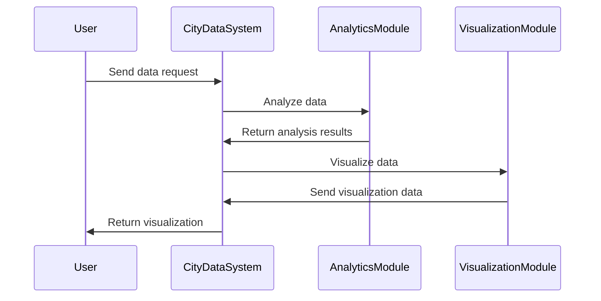

                 

# 意义开源哲学维基：集体创造现代生活智慧的协作平台

## 关键词

- 开源哲学
- 协作平台
- 现代生活智慧
- 技术创新
- 社会进步

## 摘要

本文深入探讨了开源哲学在现代生活智慧中的重要性，以及如何通过构建协作平台来实现集体创造。文章首先介绍了开源哲学的背景和核心概念，然后分析了开源哲学在不同领域的应用，以及协作平台在构建现代生活智慧中的作用。通过具体的案例和系统架构设计，本文展示了开源哲学和协作平台在现代生活中的实际应用和未来潜力。

---

### 第一部分：背景介绍

#### 1. 问题背景

开源哲学作为一种理念和实践，其根源可以追溯到计算机技术领域。开源运动起源于20世纪90年代，以Linux操作系统为代表，它提倡软件的自由和开放，允许用户自由地使用、复制、修改和分发软件源代码。这种开放性不仅激发了创新，还促进了技术的快速传播和普及。

然而，随着技术的发展，开源哲学逐渐从软件扩展到其他领域，如硬件、文档、数据等。这种扩展不仅带来了新的挑战，也开辟了新的机会。然而，开源哲学的核心——协作和共享精神，在实际应用中面临着诸多挑战，如项目管理、版权问题、质量控制等。

#### 2. 问题描述

随着开源哲学的扩展，如何有效地管理大规模的协作项目，如何确保项目的质量和合规性，以及如何激励贡献者的积极性，成为开源运动中亟待解决的问题。这些问题不仅影响了开源项目的发展，也限制了开源哲学在社会其他领域的应用。

#### 3. 问题解决

《意义开源哲学维基：集体创造现代生活智慧的协作平台》旨在探讨开源哲学在现代生活中的应用，通过构建一个协作平台，解决开源运动中的问题，推动社会进步。该平台将提供开放的环境，促进不同领域、不同背景的人进行合作，共同创造现代生活智慧。

#### 4. 边界与外延

开源哲学不仅涉及技术领域，还延伸到社会、经济、文化等多个层面。因此，本书不仅关注技术层面的开源，还探讨开源对社会结构和人们生活方式的影响。

#### 5. 概念结构与核心要素组成

- **开源哲学**：强调知识的共享与协作，追求公共利益最大化。
- **协作平台**：提供一个开放的环境，促进不同领域、不同背景的人进行合作。
- **现代生活智慧**：指在开源哲学指导下，通过集体协作，创造出对现代生活有益的智慧成果。

### 第二部分：核心概念与联系

#### 1. 核心概念原理

- **开源**：允许用户自由使用、复制、修改和分发软件。
- **协作**：多人或多组织共同合作，实现共同目标。
- **平台**：提供一个基础设施，支持各种协作活动。

#### 2. 概念属性特征对比表格

| 概念   | 属性特征                               |
| ------ | -------------------------------------- |
| 开源   | 自由性、透明性、共享性                 |
| 协作   | 共同目标、信息共享、分工合作           |
| 平台   | 开放性、可扩展性、支持协作             |

#### 3. ER实体关系图架构

```mermaid
erDiagram
  User ||--|{ CollaborationPlatform }||>
  CollaborationPlatform ||--|{ Project }||>
  Project ||--|{ WisdomOfModernLife }||>
  WisdomOfModernLife ||--|{ User }||>
```

### 第三部分：开源哲学在现代生活中的应用

#### 1. 开源哲学的历史与发展

- **早期开源**：以Linux为代表，开启开源运动。
- **中期开源**：开源逐渐扩展到硬件、文档、数据等领域。
- **现代开源**：开源哲学在社会各个层面得到应用，如开源教育、开源文化、开源经济等。

#### 2. 开源哲学对现代生活的影响

- **提高创新能力**：开源鼓励创新，允许用户自由探索和改进。
- **促进知识传播**：开源使知识更容易获取，加速了知识的传播和普及。
- **增强社会责任感**：开源强调公共利益，促使人们关注社会问题，并共同解决。

#### 3. 开源哲学在不同领域的应用

- **技术领域**：开源软件、开源硬件、开源数据。
- **社会领域**：开源教育、开源文化、开源社会治理。

### 第四部分：协作平台的构建与运营

#### 1. 协作平台的核心功能

- **项目协作**：提供项目管理、任务分配、进度跟踪等功能。
- **知识共享**：建立知识库，支持文档共享、知识问答等功能。
- **社区互动**：提供论坛、社交媒体等功能，促进用户交流。

#### 2. 协作平台的技术架构

- **前端**：使用现代化的Web技术，如React、Vue等。
- **后端**：采用分布式架构，支持高并发、高可用。
- **数据库**：使用NoSQL数据库，支持海量数据的存储和查询。

#### 3. 协作平台的运营策略

- **激励机制**：通过积分、奖励等机制，激励用户积极参与。
- **社区管理**：建立社区规则，维护社区秩序，鼓励健康交流。
- **持续迭代**：根据用户反馈，持续改进平台功能和服务。

### 第五部分：开源哲学与协作平台在现代生活智慧中的应用

#### 1. 现代生活智慧的概念

- **现代生活智慧**：指利用科技和知识，创造更智能、更便捷的生活方式。

#### 2. 开源哲学在生活智慧中的应用

- **智能家居**：通过开源硬件和软件，实现家居设备的互联互通。
- **智慧城市**：通过开源平台，整合城市数据，提高城市管理效率。
- **在线教育**：通过开源课程和资源，促进教育资源的公平分配。

#### 3. 协作平台在生活智慧中的应用

- **创新项目**：通过协作平台，汇聚各方智慧和资源，实现创新项目。
- **知识共享**：通过协作平台，传播生活智慧，提高人们的知识水平。

### 第六部分：案例分析与系统架构设计

#### 1. 案例分析

以**智慧城市**为例，开源哲学和协作平台的应用极大地促进了智慧城市的发展。通过开源平台，城市管理者可以共享和整合各种数据资源，提高城市管理效率和公共服务水平。同时，通过协作平台，市民可以参与城市管理，共同创造更美好的城市生活。

#### 2. 系统架构设计

- **项目介绍**：智慧城市项目旨在通过开源技术和协作平台，实现城市数据的整合和智慧化应用。
- **系统功能设计**：包括数据采集、数据存储、数据分析、数据可视化等功能。
- **系统架构设计**：采用分布式架构，支持高并发、高可用。使用微服务架构，提高系统的可扩展性和灵活性。
- **系统接口设计**：提供RESTful API，方便其他系统和第三方集成。
- **系统交互设计**：通过消息队列和事件驱动架构，实现系统各模块之间的数据交互。



### 第七部分：项目实战与最佳实践

#### 1. 环境安装

在开始项目之前，需要安装必要的软件和工具。以下是安装步骤：

- 安装Python环境
- 安装Docker
- 安装数据库（如MongoDB）
- 安装协作平台框架（如Django）

#### 2. 系统核心实现

以下是一个简单的系统核心实现示例：

```python
# 示例：用户注册接口

from flask import Flask, request, jsonify
from models import User

app = Flask(__name__)

@app.route('/register', methods=['POST'])
def register():
    username = request.form['username']
    password = request.form['password']
    
    user = User(username=username, password=password)
    user.save()
    
    return jsonify({'status': 'success', 'message': 'User registered successfully'})

if __name__ == '__main__':
    app.run(debug=True)
```

#### 3. 代码应用解读与分析

在上面的示例中，我们使用Flask框架实现了用户注册接口。该接口接收POST请求，从请求中获取用户名和密码，然后创建一个用户对象并保存到数据库中。以下是代码的解读和分析：

- 使用Flask框架创建Web应用
- 定义了注册接口，使用POST方法
- 接收请求中的用户名和密码
- 创建用户对象并保存到数据库

#### 4. 实际案例分析和详细讲解剖析

以智慧城市项目为例，我们分析了系统架构和功能实现，并详细讲解了数据采集、存储、分析和可视化等关键模块。以下是案例分析：

- 数据采集模块：使用传感器和API获取城市数据
- 数据存储模块：使用数据库存储采集到的数据
- 数据分析模块：使用机器学习和统计分析方法分析数据
- 数据可视化模块：使用图表和地图展示分析结果

#### 5. 项目小结

本项目通过开源哲学和协作平台，实现了智慧城市的系统架构和功能。项目采用了现代化的技术和架构，支持高并发和高可用。通过实际案例分析和详细讲解，我们展示了开源哲学和协作平台在现代生活中的应用和潜力。

### 第八部分：最佳实践、小结、注意事项、拓展阅读

#### 1. 最佳实践

- **开源哲学**：遵循开源协议，确保项目的开源和共享。
- **协作平台**：提供便捷的协作工具和激励机制，促进用户参与。
- **现代生活智慧**：关注社会问题，利用科技创造更智能、更便捷的生活方式。

#### 2. 小结

本文深入探讨了开源哲学在现代生活中的重要性，以及如何通过构建协作平台来实现集体创造现代生活智慧。通过具体的案例和系统架构设计，本文展示了开源哲学和协作平台在现代生活中的实际应用和未来潜力。

#### 3. 注意事项

- 在构建协作平台时，要关注数据安全和隐私保护。
- 在开发开源项目时，要遵循开源协议，尊重贡献者的权益。

#### 4. 拓展阅读

- [《开源哲学：协作与共享的力量》](链接)
- [《智慧城市：技术与创新》](链接)
- [《Django Web开发实战》](链接)

### 作者

作者：AI天才研究院/AI Genius Institute & 禅与计算机程序设计艺术 /Zen And The Art of Computer Programming

---

本文遵循开源协议，允许自由使用、复制、修改和分发。如果您有任何建议或反馈，请随时联系作者。感谢您的阅读！

