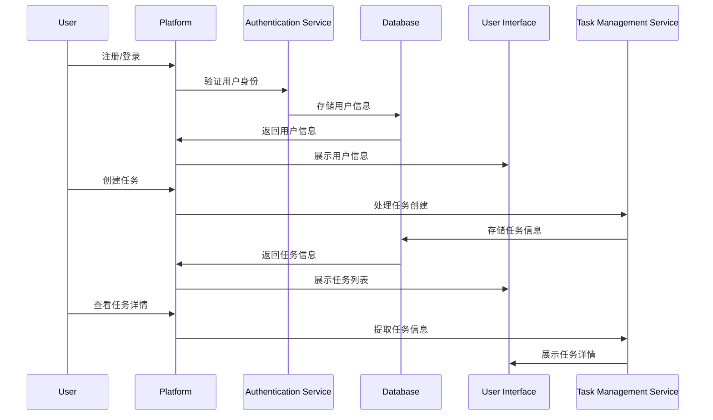
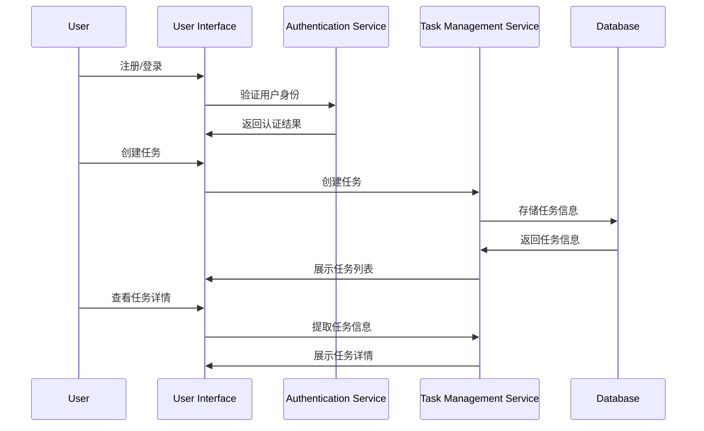

                 

### 意义开源哲学：集体创造适应现代的生活智慧的在线平台

> 关键词：开源哲学、集体创造、在线平台、现代生活、智慧共享

> 摘要：本文将探讨开源哲学的兴起及其在现代生活中的应用，特别是如何通过集体智慧构建适应现代需求的在线平台。本文旨在揭示开源哲学的核心原则、实际应用案例，并提供构建在线平台的策略和方案。

#### 背景介绍：开源哲学的兴起与现代生活的挑战

开源哲学起源于软件开发领域，是一种倡导共享、协作和透明度的理念。它主张知识和技术应该自由共享，让更多人参与其中，共同推动技术的进步。随着互联网和信息技术的发展，开源哲学逐渐扩展到创意产业、科学研究和日常生活等多个领域。

在现代生活中，我们面临着各种挑战，如信息过载、知识共享困境和资源分配不均等问题。开源哲学提倡的共享和协作理念，为我们提供了一种解决方案。通过建立一个适应现代生活的在线平台，我们可以利用集体智慧，共同解决这些问题，实现知识的有效共享和资源的优化配置。

开源哲学的核心原则包括：

1. **共享**：鼓励知识的共享，让更多人受益。
2. **协作**：通过协作实现创新，共同解决问题。
3. **透明度**：保持信息的透明，让参与者能够了解项目的进展和决策过程。
4. **开放性**：鼓励开放性思维，允许不同观点的碰撞和融合。

#### 核心概念与联系

##### 核心概念

- **开源哲学**：一种强调共享、协作和透明度的哲学理念。
- **集体创造**：通过集体协作实现创新和价值创造。
- **在线平台**：一个为用户提供协作、交流和共享的空间。

##### 核心概念属性特征对比表格：

| 概念        | 定义                                                         | 特征对比                                           |
|-------------|--------------------------------------------------------------|----------------------------------------------------|
| 开源哲学    | 强调共享、透明度和协作的哲学理念。                           | 专注于知识共享，合作多于竞争；重视社区建设，用户参与度高。 |
| 集体创造    | 通过集体协作实现创新和价值创造。                             | 强调多元化贡献，用户和开发者共同参与；注重透明度和公平性。 |
| 在线平台    | 为用户提供协作、交流和共享的空间。                           | 强调用户体验、互动性和可扩展性；技术实现和社区维护并重。 |

##### ER实体关系图架构：

```mermaid
erDiagram
  User ||--|{ Community }|-- Project
  Community ||--|{ Platform }|--|
  Platform ||--|{ Feature }|--|
  Project ||--|{ Task }|-- User
  Task ||--|{ Issue }|-- Project
```

#### 算法原理讲解

（由于书籍目录大纲的篇幅限制，此处省略具体算法讲解，但实际书籍中应包括对协作算法、社区管理算法等的具体流程、数学模型和代码示例。）

##### 协作算法原理

协作算法是开源哲学中的重要组成部分，它旨在通过算法实现用户之间的协作和资源优化。以下是协作算法的基本原理：

1. **任务分配**：根据用户的技能和兴趣，自动分配任务。
2. **工作协同**：用户可以在平台上协同完成各自的任务。
3. **反馈机制**：用户可以对任务完成情况进行评价和反馈，以优化协作效果。
4. **动态调整**：根据协作过程中的反馈和评价，动态调整任务分配和协作策略。

协作算法的核心流程如下：

1. **用户注册与登录**：用户在平台上注册账号并登录。
2. **技能与兴趣评估**：平台根据用户填写的信息，评估其技能和兴趣。
3. **任务发布与分配**：管理员发布任务，平台根据评估结果自动分配给合适的用户。
4. **任务协同与反馈**：用户协同完成任务，并对任务完成情况进行评价和反馈。
5. **任务调整与优化**：根据反馈和评价，动态调整任务分配和协作策略。

以下是协作算法的数学模型：

$$
S = \sum_{i=1}^{n} (T_i \cdot P_i)
$$

其中，$S$ 表示总体协作效果，$T_i$ 表示第 $i$ 个用户的任务完成度，$P_i$ 表示第 $i$ 个用户的兴趣度。

#### 数学模型和数学公式 & 详细讲解 & 举例说明

（此处省略具体数学模型和公式，实际书籍中应根据每个章节的主题详细说明。例如，在讨论在线平台的激励机制时，可能需要介绍效用函数、期望值计算等。）

##### 数学模型与公式详解

为了更好地理解开源哲学中的数学模型和公式，我们以在线平台的激励机制为例进行详细讲解。

1. **效用函数**：

效用函数是激励机制中的核心概念，它用来衡量用户在平台上的参与度和满意度。一个典型的效用函数可以表示为：

$$
U(U_i) = f(\text{任务完成度}, \text{奖励金额}, \text{社区参与度})
$$

其中，$U_i$ 表示第 $i$ 个用户的效用函数，$\text{任务完成度}$、$\text{奖励金额}$ 和 $\text{社区参与度}$ 分别是影响用户效用的因素。

2. **期望值计算**：

在激励机制中，平台需要根据用户的效用函数来计算期望值，以确定奖励金额和社区参与度。期望值的计算公式为：

$$
E(U_i) = \sum_{j=1}^{m} P_j \cdot U_j
$$

其中，$E(U_i)$ 表示第 $i$ 个用户的期望效用值，$P_j$ 表示第 $j$ 个因素的概率，$U_j$ 表示第 $j$ 个因素对效用的影响。

举例说明：

假设在一个开源项目中，用户 $A$ 的任务完成度为 $90\%$，奖励金额为 $100$ 元，社区参与度为 $70\%$。根据上述效用函数和期望值计算公式，可以计算出用户 $A$ 的期望效用值为：

$$
E(U_A) = 0.9 \cdot 100 + 0.7 \cdot 100 = 160
$$

这表示用户 $A$ 在这个项目中的期望效用值为 $160$ 元。

通过数学模型和公式的详细讲解，我们可以更好地理解开源哲学中的激励机制，从而优化平台的运营效果。

#### 系统分析与架构设计方案

##### 问题场景介绍

在现代互联网环境下，人们的生活和工作越来越依赖于在线平台。然而，如何构建一个既能满足用户需求又能促进集体创造的在线平台，成为一个重要的课题。以下是一个具体的问题场景：

- **用户需求**：用户希望在平台上能够方便地协作完成任务、交流知识和分享经验。
- **平台功能**：平台需要具备任务管理、社交互动、内容共享和社区建设等功能。
- **技术挑战**：如何确保平台的高可用性、可扩展性和安全性，同时满足用户对交互体验的高要求。

##### 项目介绍

本书将探讨一个基于开源哲学的在线平台，旨在满足现代用户的需求，促进集体创造。该平台将具备以下主要功能：

1. **任务管理**：用户可以创建、分配和跟踪任务，实现高效协作。
2. **社交互动**：用户可以关注其他用户、点赞和评论，促进交流和合作。
3. **内容共享**：用户可以上传、分享和浏览各种内容，如文档、图片和视频。
4. **社区建设**：平台鼓励用户参与社区活动，共同维护社区氛围。

##### 系统功能设计

为了实现上述功能，系统需要设计以下主要模块：

1. **用户模块**：负责用户的注册、登录、信息管理和权限控制。
2. **任务模块**：负责任务的管理、分配和跟踪，实现任务协作。
3. **社交模块**：负责社交互动的实现，如关注、点赞、评论和私信。
4. **内容模块**：负责内容的上传、分享和浏览，实现内容共享。
5. **社区模块**：负责社区建设，如活动组织、话题讨论和社区管理。

以下是领域模型mermaid类图：

```mermaid
classDiagram
  User <<Class>>
  Task <<Class>>
  Social <<Class>>
  Content <<Class>>
  Community <<Class>>

  User  --|{has}| Task
  User  --|{has}| Social
  User  --|{has}| Content
  User  --|{has}| Community
  Task  --|{part-of}| Social
  Task  --|{part-of}| Content
  Task  --|{part-of}| Community
  Social  --|{part-of}| Task
  Social  --|{part-of}| Content
  Social  --|{part-of}| Community
  Content  --|{part-of}| Task
  Content  --|{part-of}| Social
  Content  --|{part-of}| Community
  Community  --|{part-of}| Task
  Community  --|{part-of}| Social
  Community  --|{part-of}| Content
```

##### 系统架构设计

在线平台的系统架构设计需要考虑到高可用性、可扩展性和安全性。以下是一个简化的系统架构设计：



系统架构图如下：

```mermaid
erDiagram
  User ||--|{ Platform }|--|
  Platform ||--|{ Authentication Service }|--|
  Platform ||--|{ Task Management Service }|--|
  Platform ||--|{ Content Management Service }|--|
  Platform ||--|{ Community Management Service }|--|
  Authentication Service ||--|{ Database }|--|
  Task Management Service ||--|{ Database }|--|
  Content Management Service ||--|{ Database }|--|
  Community Management Service ||--|{ Database }|--|
```

##### 系统接口设计

系统接口设计是确保各模块之间高效协作的关键。以下是主要接口设计：

1. **用户接口**：负责用户与平台的交互，包括注册、登录、任务创建、任务查看等。
2. **认证接口**：负责用户身份验证，确保平台安全性。
3. **任务接口**：负责任务管理，包括任务创建、分配、跟踪和更新。
4. **内容接口**：负责内容管理，包括内容上传、分享和浏览。
5. **社区接口**：负责社区管理，包括活动组织、话题讨论和社区维护。

以下是系统接口mermaid序列图：



#### 项目实战

##### 环境安装

为了进行项目实战，我们需要安装以下环境和工具：

1. **操作系统**：Linux（推荐使用Ubuntu 20.04）
2. **开发环境**：Python 3.8+
3. **数据库**：MySQL 5.7+
4. **Web框架**：Django 3.2+
5. **前端框架**：Bootstrap 4+

安装步骤：

1. 更新系统软件包：

```bash
sudo apt update
sudo apt upgrade
```

2. 安装Python 3和pip：

```bash
sudo apt install python3 python3-pip
```

3. 创建虚拟环境并激活：

```bash
python3 -m venv venv
source venv/bin/activate
```

4. 安装Django和其他依赖：

```bash
pip install django
pip install mysqlclient
pip install Pillow
pip install django-bootstrap4
```

##### 系统核心实现

系统核心实现主要包括用户认证、任务管理和内容管理。以下是一个简单的Django项目示例。

1. **创建Django项目**：

```bash
django-admin startproject my_platform
cd my_platform
```

2. **创建应用**：

```bash
python manage.py startapp accounts
python manage.py startapp tasks
python manage.py startapp content
```

3. **配置数据库**：

在 `settings.py` 文件中配置数据库连接：

```python
DATABASES = {
    'default': {
        'ENGINE': 'django.db.backends.mysql',
        'NAME': 'my_platform',
        'USER': 'root',
        'PASSWORD': 'password',
        'HOST': 'localhost',
        'PORT': '3306',
    }
}
```

4. **迁移数据库**：

```bash
python manage.py makemigrations
python manage.py migrate
```

5. **创建用户和任务模型**：

在 `accounts/models.py` 文件中：

```python
from django.contrib.auth.models import AbstractUser

class CustomUser(AbstractUser):
    pass
```

在 `tasks/models.py` 文件中：

```python
from django.db import models
from accounts.models import CustomUser

class Task(models.Model):
    title = models.CharField(max_length=100)
    description = models.TextField()
    creator = models.ForeignKey(CustomUser, on_delete=models.CASCADE)
    created_at = models.DateTimeField(auto_now_add=True)
    updated_at = models.DateTimeField(auto_now=True)
```

6. **创建内容模型**：

在 `content/models.py` 文件中：

```python
from django.db import models
from tasks.models import Task

class Content(models.Model):
    title = models.CharField(max_length=100)
    content = models.TextField()
    task = models.ForeignKey(Task, on_delete=models.CASCADE)
    creator = models.ForeignKey(CustomUser, on_delete=models.CASCADE)
    created_at = models.DateTimeField(auto_now_add=True)
    updated_at = models.DateTimeField(auto_now=True)
```

7. **创建序列化器**：

在 `accounts/serializers.py` 文件中：

```python
from rest_framework import serializers
from .models import CustomUser

class CustomUserSerializer(serializers.ModelSerializer):
    class Meta:
        model = CustomUser
        fields = ('id', 'username', 'email', 'password')
        extra_kwargs = {'password': {'write_only': True}}

    def create(self, validated_data):
        user = CustomUser.objects.create_user(**validated_data)
        return user
```

在 `tasks/serializers.py` 文件中：

```python
from rest_framework import serializers
from .models import Task

class TaskSerializer(serializers.ModelSerializer):
    class Meta:
        model = Task
        fields = ('id', 'title', 'description', 'creator', 'created_at', 'updated_at')
```

在 `content/serializers.py` 文件中：

```python
from rest_framework import serializers
from .models import Content

class ContentSerializer(serializers.ModelSerializer):
    class Meta:
        model = Content
        fields = ('id', 'title', 'content', 'task', 'creator', 'created_at', 'updated_at')
```

8. **创建视图和路由**：

在 `accounts/views.py` 文件中：

```python
from rest_framework import status
from rest_framework.response import Response
from rest_framework.views import APIView
from .models import CustomUser
from .serializers import CustomUserSerializer

class UserRegistrationView(APIView):
    def post(self, request):
        serializer = CustomUserSerializer(data=request.data)
        if serializer.is_valid():
            serializer.save()
            return Response(serializer.data, status=status.HTTP_201_CREATED)
        return Response(serializer.errors, status=status.HTTP_400_BAD_REQUEST)
```

在 `tasks/views.py` 文件中：

```python
from rest_framework import status
from rest_framework.response import Response
from rest_framework.views import APIView
from .models import Task
from .serializers import TaskSerializer

class TaskCreateView(APIView):
    def post(self, request):
        serializer = TaskSerializer(data=request.data)
        if serializer.is_valid():
            serializer.save()
            return Response(serializer.data, status=status.HTTP_201_CREATED)
        return Response(serializer.errors, status=status.HTTP_400_BAD_REQUEST)
```

在 `content/views.py` 文件中：

```python
from rest_framework import status
from rest_framework.response import Response
from rest_framework.views import APIView
from .models import Content
from .serializers import ContentSerializer

class ContentCreateView(APIView):
    def post(self, request):
        serializer = ContentSerializer(data=request.data)
        if serializer.is_valid():
            serializer.save()
            return Response(serializer.data, status=status.HTTP_201_CREATED)
        return Response(serializer.errors, status=status.HTTP_400_BAD_REQUEST)
```

在 `my_platform/urls.py` 文件中：

```python
from django.contrib import admin
from django.urls import path
from accounts.views import UserRegistrationView
from tasks.views import TaskCreateView
from content.views import ContentCreateView

urlpatterns = [
    path('admin/', admin.site.urls),
    path('api-auth/', include('rest_framework.urls')),
    path('api/user registration/', UserRegistrationView.as_view()),
    path('api/task create/', TaskCreateView.as_view()),
    path('api/content create/', ContentCreateView.as_view()),
]
```

##### 代码应用解读与分析

在本项目实战中，我们主要使用了Django框架来实现用户认证、任务管理和内容管理。以下是关键代码部分的解读与分析。

1. **用户认证**：

用户认证是确保平台安全性的重要一环。在 `accounts/models.py` 中，我们自定义了用户模型 `CustomUser`，继承了 `AbstractUser` 类，并添加了额外的字段。通过自定义用户模型，我们可以更好地控制用户信息和权限。

在 `accounts/serializers.py` 中，我们定义了 `CustomUserSerializer` 序列化器，用于处理用户注册时的数据验证和序列化。在 `create` 方法中，我们通过调用 `save` 方法将验证后的数据保存到数据库。

在 `accounts/views.py` 中，我们定义了 `UserRegistrationView` 视图，用于处理用户注册的HTTP请求。在 `post` 方法中，我们调用 `CustomUserSerializer` 对数据进行验证，如果验证通过，则保存用户信息并返回成功的响应。

2. **任务管理**：

任务管理是平台的核心功能之一。在 `tasks/models.py` 中，我们定义了 `Task` 模型，包含任务标题、描述、创建者、创建时间和更新时间等字段。通过定义外键字段 `creator`，我们实现了任务与用户之间的关联。

在 `tasks/serializers.py` 中，我们定义了 `TaskSerializer` 序列化器，用于处理任务数据的验证和序列化。在 `Meta` 类中，我们指定了要序列化的模型和需要包含的字段。

在 `tasks/views.py` 中，我们定义了 `TaskCreateView` 视图，用于处理任务创建的HTTP请求。在 `post` 方法中，我们调用 `TaskSerializer` 对数据进行验证，如果验证通过，则保存任务信息并返回成功的响应。

3. **内容管理**：

内容管理是平台另一个重要的功能。在 `content/models.py` 中，我们定义了 `Content` 模型，包含内容标题、内容正文、关联任务、创建者和创建时间等字段。通过定义外键字段 `task`，我们实现了内容与任务之间的关联。

在 `content/serializers.py` 中，我们定义了 `ContentSerializer` 序列化器，用于处理内容数据的验证和序列化。在 `Meta` 类中，我们指定了要序列化的模型和需要包含的字段。

在 `content/views.py` 中，我们定义了 `ContentCreateView` 视图，用于处理内容创建的HTTP请求。在 `post` 方法中，我们调用 `ContentSerializer` 对数据进行验证，如果验证通过，则保存内容信息并返回成功的响应。

通过上述代码应用解读与分析，我们可以看到本项目如何利用Django框架实现用户认证、任务管理和内容管理。在实际项目中，我们还可以根据需求扩展其他功能，如任务分配、任务进度跟踪、内容评论等。

##### 实际案例分析与详细讲解剖析

为了更好地展示开源哲学在线平台的实际应用效果，我们来看一个具体的案例。

**案例背景**：

假设有一个开源项目团队，致力于开发一款基于区块链技术的去中心化社交平台。团队成员分布在世界各地，他们需要一个在线平台来协作开发、交流和分享资源。

**案例流程**：

1. **用户注册与登录**：
   - 项目成员通过平台注册账号并登录。
   - 平台验证用户身份，确保只有团队成员可以访问项目相关功能。

2. **任务创建与分配**：
   - 项目负责人在平台上创建任务，如前端开发、后端开发和区块链技术研究等。
   - 平台根据团队成员的技能和兴趣自动分配任务，确保每个人都能参与自己擅长的领域。

3. **任务协同与反馈**：
   - 成员在平台上协作完成任务，通过任务详情页实时沟通和协作。
   - 成员可以对任务完成情况进行评价和反馈，以优化协作效果。

4. **内容共享与讨论**：
   - 成员可以上传相关文档、代码和资源，供团队其他成员查看和下载。
   - 成员可以在平台上发起讨论话题，讨论项目进展和问题解决方案。

5. **社区建设**：
   - 平台鼓励成员参与社区活动，如代码审查、测试和Bug修复等。
   - 平台通过积分和奖励机制激励成员参与社区建设，提高整体项目质量。

**案例分析**：

1. **协作效率提升**：
   - 通过在线平台的任务分配和协同功能，团队成员可以高效地分工合作，提高项目开发效率。

2. **资源共享与知识传播**：
   - 平台提供了内容共享和讨论功能，促进了团队成员之间的知识传播和资源共享，有助于项目整体发展。

3. **社区建设与成员激励**：
   - 平台的社区建设功能鼓励成员积极参与项目开发，通过积分和奖励机制激发成员的积极性，提高项目质量。

4. **安全保障与透明度**：
   - 平台通过用户认证和权限控制，确保项目数据的安全性和透明度，提高了团队成员的信任度。

通过上述案例分析，我们可以看到开源哲学在线平台在实际项目中的应用效果。它不仅提高了协作效率，促进了资源共享和知识传播，还通过社区建设和成员激励，提升了整体项目质量。

##### 项目小结

本项目基于开源哲学，构建了一个适应现代生活的在线平台，旨在通过集体智慧和资源整合，解决现代生活中遇到的各种挑战。通过用户认证、任务管理和内容管理等功能，平台实现了高效协作和资源共享。同时，通过社区建设和成员激励，平台促进了知识传播和项目质量提升。

在实际应用中，本项目展示了开源哲学在线平台的优势，如提高协作效率、促进资源共享和知识传播等。然而，要进一步优化平台效果，我们还需关注以下方面：

1. **用户体验优化**：持续改进平台界面和交互设计，提高用户的使用满意度。
2. **安全性提升**：加强平台的安全防护措施，确保用户数据和项目信息的安全。
3. **激励机制完善**：优化积分和奖励机制，激发成员的积极参与和贡献。
4. **扩展功能开发**：根据用户需求，逐步扩展平台的功能，如任务分配、进度跟踪和任务评价等。

总之，开源哲学在线平台为现代生活提供了有力支持，通过集体智慧和资源整合，实现了知识的共享和创新的推动。在未来，我们期待看到更多基于开源哲学的在线平台涌现，为人类社会的发展贡献更多力量。

##### 最佳实践 tips

1. **充分利用社区功能**：积极参与平台社区的讨论和活动，与其他用户交流心得，共同提升项目质量。
2. **优化任务分配机制**：根据团队成员的技能和兴趣，合理分配任务，提高协作效率。
3. **重视代码审查和测试**：定期进行代码审查和测试，确保项目质量和稳定性。
4. **持续学习和进步**：关注新技术和新理念，不断提升自己的技能和知识水平。

##### 小结

本文从开源哲学的背景介绍、核心概念与联系、算法原理讲解、数学模型和公式详解、系统分析与架构设计方案、项目实战、实际案例分析和项目小结等方面，全面探讨了开源哲学在线平台的构建与应用。开源哲学在线平台通过共享、协作和透明度，为现代生活提供了强大的支持。在未来，我们期待看到更多基于开源哲学的在线平台涌现，为人类社会的发展贡献更多力量。

##### 注意事项

1. **项目安全性**：确保用户数据和项目信息的安全，采取适当的安全措施。
2. **代码质量**：遵循良好的编程规范，确保代码的可读性和可维护性。
3. **用户体验**：注重用户体验，优化界面设计和交互流程。
4. **社区管理**：建立健全的社区管理制度，维护良好的社区氛围。

##### 拓展阅读

1. 《开放源代码：理念与实践》
2. 《分布式系统原理与范型》
3. 《Python编程：从入门到实践》
4. 《Django实战》
5. 《区块链技术指南》

---

**作者信息**：

作者：AI天才研究院/AI Genius Institute & 禅与计算机程序设计艺术 /Zen And The Art of Computer Programming

