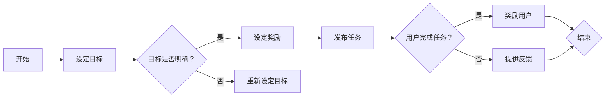
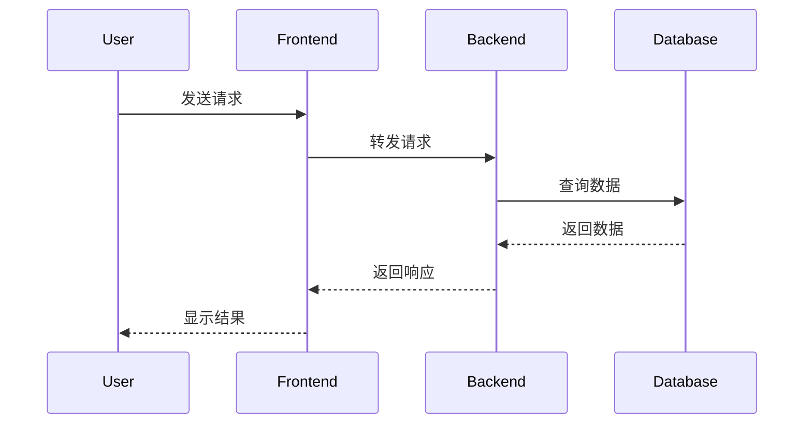
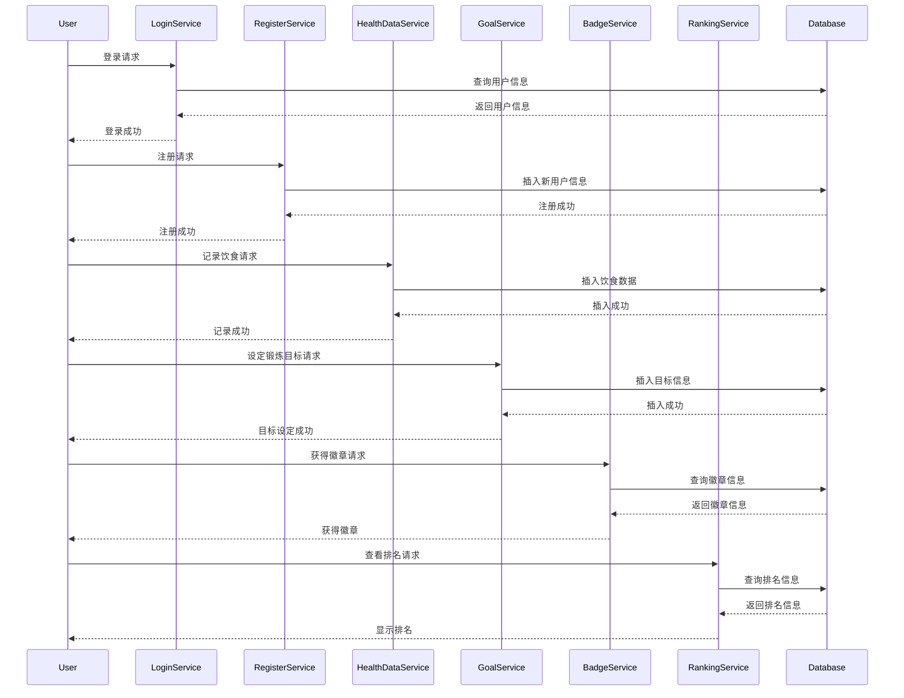
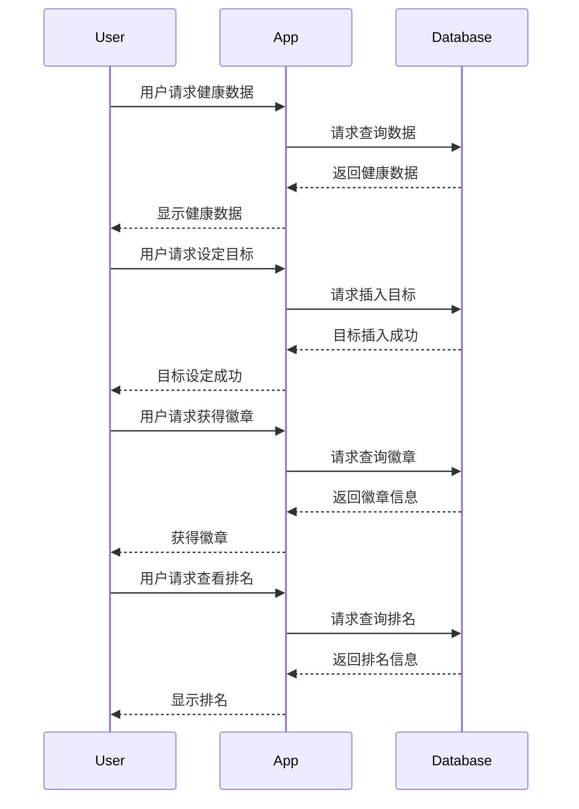

                 

### 意义游戏化人生设计工具包：日常任务化的生活改造套件

#### 关键词：
- 游戏化设计
- 生活改造
- 意义赋予
- 日常任务
- 人生设计

#### 摘要：
本文旨在探讨如何通过游戏化设计将日常任务赋予意义，提升生活质量。本文将分五个部分详细阐述：首先介绍游戏化设计的背景与目的，随后探讨游戏化理论基础；接着介绍游戏化设计方法，重点分析日常任务游戏化应用；然后是生活改造套件的实践案例分析；最后，总结全文并展望未来研究方向。

### 引言

在当今社会，随着工作压力和生活节奏的加快，人们越来越感到生活中的压力和孤独。如何在快节奏的生活中找到意义，成为许多人关心的问题。游戏化设计作为一种新兴的方法，正在被广泛应用于教育、工作以及个人生活中，它通过将游戏中的激励机制和体验应用到非游戏场景中，为日常任务赋予意义，提高人们的参与度和积极性。

《意义游戏化人生设计工具包：日常任务化的生活改造套件》旨在提供一套系统化的工具和方法，帮助读者将游戏化的理念应用到日常生活中，从而提升生活质量。本文将从以下几个方面进行详细探讨：

1. **游戏化理论基础**：介绍游戏化设计的基本概念和原理，探讨游戏化与人类行为心理学之间的关系。
2. **游戏化设计方法**：介绍游戏化设计的方法和步骤，分析如何设计具有吸引力的游戏化元素。
3. **日常任务的游戏化应用**：探讨如何将游戏化设计应用于家庭、工作和个人爱好的日常任务中。
4. **生活改造套件实践**：通过具体案例展示如何使用游戏化设计工具包改造生活。
5. **总结与展望**：总结全文，探讨游戏化设计在未来的发展前景和研究方向。

通过以上五个部分的探讨，本文希望能够为读者提供一套实用的游戏化人生设计工具包，帮助他们在日常生活中找到乐趣和意义，实现更高质量的生活。

### 第一部分：游戏化理论基础

#### 1.1 游戏化概述

游戏化（Gamification）是一种将游戏设计中的激励机制和体验应用到非游戏场景中的方法。它通过引入游戏中的竞争、奖励、挑战和社交元素，激发用户的参与度和积极性。游戏化设计不仅限于娱乐和消遣场景，它还可以应用于教育、工作、健康、营销等多个领域。

#### 1.2 游戏化原理

游戏化设计的基本原理包括以下几个方面：

1. **目标设定**：通过设定明确的目标，帮助用户了解自己需要达成的任务，并为之努力。
2. **进度追踪**：通过显示用户的进度和成就，帮助用户了解自己的进展，增强成就感和动力。
3. **奖励机制**：通过提供奖励，如积分、徽章、等级等，激发用户的积极性和参与度。
4. **社交互动**：通过提供社交互动的机会，如排行榜、小组任务等，增强用户的归属感和社区感。
5. **挑战设置**：通过设置适当的挑战，帮助用户保持兴趣和动力，同时提升技能和知识。

#### 1.3 游戏化与激励

游戏化设计通过以下几种方式实现激励：

1. **内在激励**：通过赋予任务意义，激发用户的内在动机，如好奇心、求知欲等。
2. **外在激励**：通过提供外在奖励，如金钱、物品等，激发用户的外在动机。
3. **自我效能感**：通过用户的成功经验和反馈，增强用户对自己的能力信心，提高自我效能感。
4. **成就动机**：通过设置目标和挑战，激发用户的成就动机，提高参与度。

#### 1.4 游戏化在教育中的应用

游戏化设计在教育中的应用十分广泛，它能够提高学生的学习兴趣和参与度。以下是一些具体的应用：

1. **在线学习平台**：通过积分、徽章、等级等元素，激励学生在平台上学习。
2. **教育游戏**：通过游戏化的方式，使学习过程更加有趣和有效。
3. **课堂活动**：通过游戏化的课堂活动，增强学生的参与感和互动性。

#### 1.5 游戏化在工作中的应用

游戏化设计在工作中的应用同样具有重要意义，它能够提高员工的积极性和工作效率。以下是一些具体的应用：

1. **团队协作**：通过团队任务和排行榜，增强团队合作精神和竞争意识。
2. **绩效管理**：通过游戏化的绩效评估系统，激励员工提高工作效率。
3. **员工培训**：通过游戏化的培训方式，提高员工的技能和知识。

### 第二部分：游戏化设计方法

#### 2.1 游戏化设计流程

游戏化设计是一个系统化的过程，通常包括以下几个步骤：

1. **需求分析**：了解用户需求，明确游戏化设计的目标和场景。
2. **目标设定**：设定明确的任务目标，确保用户了解自己的任务和期望结果。
3. **游戏化元素设计**：设计具有吸引力的游戏化元素，如积分、徽章、排行榜等。
4. **进度追踪和反馈**：设计进度追踪和反馈机制，帮助用户了解自己的进展和成就。
5. **测试与优化**：对游戏化设计进行测试，收集用户反馈，不断优化设计。

#### 2.2 游戏化元素设计

游戏化元素设计是游戏化设计的关键，以下是一些常见的游戏化元素：

1. **积分系统**：通过积分系统，激励用户完成任务，积分可以兑换奖励。
2. **徽章系统**：通过徽章系统，为用户完成任务或达到特定目标提供荣誉和认可。
3. **排行榜**：通过排行榜，激励用户竞争和比较，提升参与度。
4. **挑战设置**：通过挑战设置，激发用户兴趣和动力，提升技能和知识。

#### 2.3 游戏化挑战设计

游戏化挑战设计是游戏化设计中的重要一环，以下是一些挑战设计的要点：

1. **挑战类型**：根据用户需求，设计不同类型的挑战，如知识竞赛、技能挑战等。
2. **挑战难度**：根据用户水平和能力，设置适当的挑战难度，避免用户感到挫败。
3. **挑战持续性与迭代**：设计持续性的挑战，鼓励用户长期参与，同时不断迭代挑战，保持新鲜感。

### 第三部分：日常任务的游戏化应用

#### 3.1 家庭任务游戏化

家庭任务游戏化可以通过以下方式实现：

1. **家务任务积分系统**：设定家务任务积分，鼓励家庭成员积极参与家庭清洁和维护。
2. **家庭挑战活动**：定期举办家庭挑战活动，如清洁比赛、烹饪比赛等，增加家庭互动和乐趣。
3. **家庭徽章系统**：为完成特定家务任务的家庭成员颁发徽章，增强家庭荣誉感。

#### 3.2 工作任务游戏化

工作任务游戏化可以通过以下方式实现：

1. **团队任务积分系统**：鼓励团队成员积极参与团队任务，提升团队协作和效率。
2. **工作挑战活动**：定期举办工作挑战活动，如知识竞赛、创新比赛等，激发员工创新意识和积极性。
3. **工作徽章系统**：为在特定任务或项目上表现优秀的员工颁发徽章，提升个人荣誉感和团队凝聚力。

#### 3.3 个人爱好游戏化

个人爱好游戏化可以通过以下方式实现：

1. **运动挑战活动**：设定运动目标，举办线上或线下运动挑战活动，如跑步比赛、健身挑战等。
2. **学习积分系统**：设定学习目标，通过积分系统激励自己持续学习和提升。
3. **艺术创作徽章系统**：为在艺术创作中取得成就的个人颁发徽章，提升个人艺术成就感和社区认同感。

### 第四部分：生活改造套件实践

#### 4.1 设计工具包介绍

生活改造套件是一套包含多种游戏化设计工具和资源的工具包，旨在帮助用户将游戏化理念应用到日常生活中。以下是一些主要的设计工具和资源：

1. **积分管理器**：用于记录和跟踪用户在游戏化活动中的积分。
2. **徽章管理系统**：用于为用户颁发和管理徽章。
3. **挑战策划工具**：用于设计各种类型的挑战活动。
4. **进度追踪工具**：用于跟踪用户的进度和成就。
5. **社交互动平台**：用于促进用户之间的互动和交流。

#### 4.2 实践案例分析

以下是一些具体的实践案例分析，展示了如何使用生活改造套件将日常任务游戏化：

1. **案例一：家庭生活**：通过积分系统和家庭挑战活动，鼓励家庭成员积极参与家务，提高家庭和谐度。
2. **案例二：职场生活**：通过团队任务积分系统和工作挑战活动，提升团队协作和员工积极性。
3. **案例三：个人成长**：通过学习积分系统和艺术创作徽章系统，激励个人持续学习和提升艺术创作水平。

#### 4.3 成功经验与挑战

在实践过程中，我们总结了以下成功经验和挑战：

1. **成功经验**：
   - 明确目标：设定明确的任务和挑战目标，确保用户了解自己的任务和期望结果。
   - 鼓励参与：通过奖励机制和社交互动，鼓励用户积极参与游戏化活动。
   - 定期反馈：定期提供反馈和奖励，增强用户的成就感和动力。

2. **挑战与应对**：
   - 用户参与度低：通过丰富游戏化元素和活动内容，提高用户参与度。
   - 用户流失：通过持续更新和改进游戏化设计，保持用户兴趣和参与度。
   - 资源限制：通过合理分配资源和优化设计，提高游戏化设计的效率和效果。

### 第五部分：总结与展望

#### 5.1 书籍总结

《意义游戏化人生设计工具包：日常任务化的生活改造套件》通过介绍游戏化理论基础、游戏化设计方法以及日常任务的游戏化应用，为读者提供了一套实用的游戏化设计工具和方法。通过游戏化设计，读者可以更好地管理日常任务，提升生活质量和幸福感。

#### 5.2 未来展望

未来，游戏化设计将在更多领域得到应用，如健康、心理健康、教育等。同时，随着技术的发展，游戏化设计工具将更加智能化和个性化，为用户提供更高质量的游戏化体验。未来研究可以关注以下几个方面：

1. **个性化游戏化设计**：根据用户兴趣、能力和需求，设计个性化的游戏化方案。
2. **跨平台游戏化**：将游戏化设计应用于不同平台和设备，提供无缝的游戏化体验。
3. **心理健康游戏化**：探讨游戏化设计在心理健康领域的应用，如抑郁、焦虑等。

### 作者

作者：AI天才研究院/AI Genius Institute & 禅与计算机程序设计艺术 /Zen And The Art of Computer Programming

### 结语

通过游戏化设计，我们可以将日常任务赋予意义，提升生活质量和幸福感。希望本文能够为读者提供有益的启示，帮助他们在日常生活中找到乐趣和意义，实现更高质量的生活。

## 背景介绍

### 核心概念术语说明

在探讨游戏化设计及其应用时，首先需要明确一些核心概念和术语，以便读者更好地理解后续内容。以下是本文中涉及的主要概念及其解释：

1. **游戏化（Gamification）**：
   游戏化是将游戏设计中的激励机制、体验和元素（如积分、徽章、排行榜等）应用到非游戏场景（如教育、工作、健康、营销等）中，以增强用户的参与度和积极性。

2. **日常任务**：
   日常任务是指人们在日常生活中需要完成的日常事务，如家务、工作、学习、锻炼等。

3. **意义赋予（Intrinsic Motivation）**：
   意义赋予是通过赋予任务本身价值、意义和目标，激发用户的内在动机，使任务变得更加有意义和有趣。

4. **激励机制（Incentive Mechanism）**：
   激励机制是通过奖励、反馈、竞争等手段激发用户的积极性、参与度和持续性的机制。

5. **游戏化设计工具包**：
   游戏化设计工具包是一套包含游戏化设计方法和资源的工具，用于帮助用户将游戏化理念应用到日常生活中。

### 问题背景

在现代社会，随着工作压力和生活节奏的加快，人们往往感到生活单调乏味，缺乏动力和成就感。同时，随着科技的进步，人们获取信息的渠道越来越多样化，这也使得人们容易分散注意力，难以专注于日常任务。这些问题导致许多人陷入“拖延症”、“工作倦怠”和“生活质量下降”的困境。

游戏化设计的出现为解决这些问题提供了一种新的思路。通过将游戏中的激励机制和体验应用到日常生活中，可以帮助人们更好地管理日常任务，提高生活质量和幸福感。

### 问题描述

具体来说，问题可以描述为以下几个方面：

1. **日常任务管理困难**：
   人们难以有效地管理日常任务，导致任务堆积，影响工作效率和生活质量。

2. **缺乏内在动机**：
   日常任务往往缺乏内在激励，使人们难以保持持续的兴趣和动力。

3. **缺乏成就感**：
   在完成日常任务时，人们往往缺乏成就感，导致动力不足。

4. **生活质量下降**：
   由于日常任务管理不当，生活质量下降，影响身心健康。

### 问题解决

为了解决上述问题，我们可以采用游戏化设计方法，将日常任务赋予意义，提高人们的参与度和积极性。具体解决方案如下：

1. **目标设定**：
   通过设定明确的目标，帮助人们了解自己需要达成的任务，并为之努力。

2. **意义赋予**：
   通过赋予任务意义，激发人们的内在动机，使任务变得更加有趣和有意义。

3. **激励机制**：
   通过奖励机制和反馈机制，激发人们的积极性、参与度和持续性。

4. **进度追踪**：
   通过进度追踪和反馈，帮助人们了解自己的进展和成就，增强成就感和动力。

5. **社交互动**：
   通过提供社交互动的机会，增强人们的归属感和社区感。

### 边界与外延

虽然游戏化设计在许多领域都有应用，但它在日常任务中的应用有其特定的边界和外延：

1. **适用范围**：
   游戏化设计主要适用于需要提高参与度和积极性的日常任务，如家务、工作、学习、锻炼等。

2. **不适用场景**：
   游戏化设计不适用于所有场景，如需要高度专业知识和技能的任务，或者需要严格保密的信息。

3. **适应性调整**：
   在不同场景中，游戏化设计的具体方法和元素需要根据实际情况进行适应性调整。

### 概念结构与核心要素组成

游戏化设计涉及多个核心概念和要素，其结构如下：

1. **核心概念**：
   - 游戏化设计
   - 日常任务
   - 意义赋予
   - 激励机制
   - 进度追踪
   - 社交互动

2. **核心要素**：
   - 目标设定
   - 奖励机制
   - 反馈机制
   - 进度追踪工具
   - 社交互动平台

这些概念和要素相互关联，共同构成了游戏化设计的基本框架，为日常任务赋予了新的意义和动力。

### 核心概念与联系

在深入探讨游戏化设计时，我们有必要对一些核心概念进行详细阐述，并分析它们之间的联系。以下是游戏化设计中的几个关键概念及其相互关系：

#### 1. 游戏化设计与日常任务

游戏化设计是将游戏中的激励机制和元素（如积分、徽章、排行榜等）应用到非游戏场景中，以增强用户的参与度和积极性。在日常生活中，游戏化设计可以帮助我们将单调乏味的任务转化为有趣且富有挑战性的活动。例如，通过设置积分系统，用户可以为自己的日常任务（如家庭清洁、工作项目等）积累积分，积分可以用来兑换奖励或提高等级。这种方式不仅能够激发用户的内在动机，还能通过外在激励（如奖品、荣誉等）增强用户的参与度。

#### 2. 意义赋予与内在激励

意义赋予是通过赋予任务本身价值、目的和意义，从而激发用户的内在动机。在游戏化设计中，意义赋予是实现内在激励的重要手段。通过设定具有挑战性、目标明确且与用户价值观相符的任务，用户能够感受到自己的努力和成就是有价值的。例如，一个人可能会通过设定每天跑步一公里的目标来改善健康，这个目标本身具有强烈的内在意义，促使用户每天坚持跑步。

#### 3. 激励机制与外在激励

激励机制是游戏化设计中的核心要素，包括积分系统、徽章系统、排行榜等。这些激励机制可以通过外在激励（如物质奖励、社会认可等）来增强用户的参与度。外在激励在短期内可能效果显著，但长期来看，内在激励更为持久。因此，在设计游戏化方案时，应平衡外在激励和内在激励，确保用户能够在长期内保持积极参与。

#### 4. 进度追踪与成就动机

进度追踪是游戏化设计中的一个重要元素，它通过显示用户的任务进度和成就，帮助用户了解自己的进展情况。这种反馈机制能够激发用户的成就动机，使其更有动力去完成任务。例如，一个用户可能会因为看到自己已经完成了大部分的学习任务而感到自豪，从而激励自己继续学习。成就动机是推动用户持续参与的重要动力。

#### 5. 社交互动与社区感

社交互动是游戏化设计中的另一个关键要素，它通过提供社交互动的机会，增强用户的归属感和社区感。在游戏化活动中，用户可以与其他参与者进行交流和竞争，分享自己的成就和经验。这种社交互动不仅能够提升用户的参与度，还能建立一种社区感，使用户感受到自己是更大团体的一部分。

#### 表格：核心概念属性特征对比

| 核心概念       | 特征1      | 特征2      | 特征3      |
|--------------|-----------|-----------|-----------|
| 游戏化设计     | 激励机制   | 进度追踪   | 社交互动   |
| 意义赋予       | 内在激励   | 目标设定   | 增强意义   |
| 激励机制       | 外在激励   | 成就感设计 | 排行榜     |
| 进度追踪       | 成就显示   | 反馈机制   | 进步追踪   |
| 社交互动       | 社区感增强 | 交流互动   | 竞争激励   |

#### ER实体关系图架构

为了更直观地展示这些概念之间的关系，我们可以使用Mermaid绘制一个ER（实体关系）图：

```mermaid
erDiagram
  Task ||--o{ Goal : 设定目标}
  Task ||--o{ Reward : 奖励}
  Task ||--o{ Progress : 进度追踪}
  Task ||--o{ SocialInteraction : 社交互动}
  Goal ||--|{ Task : 指向任务}
  Reward ||--|{ Task : 指向任务}
  Progress ||--|{ Task : 指向任务}
  SocialInteraction ||--|{ Task : 指向任务}
```

在这个ER图中，任务（Task）是中心实体，它与目标（Goal）、奖励（Reward）、进度追踪（Progress）和社交互动（SocialInteraction）建立了直接关联。这些关系体现了游戏化设计中各个核心概念之间的互动和依赖。

### 算法原理讲解

游戏化设计中的算法原理主要涉及如何通过激励机制和反馈机制来提高用户的参与度和积极性。以下是一个具体的算法原理讲解，以及如何使用Mermaid绘制算法流程图。

#### 算法流程图

首先，我们使用Mermaid绘制一个简单的算法流程图：



在这个流程图中，用户首先设定目标（B），然后判断目标是否明确（C）。如果目标明确，系统会设定奖励（D）并发布任务（F）。用户完成任务后（G），系统会奖励用户（H），如果未完成任务，系统会提供反馈（I）。最后，流程结束（J）。

#### 算法原理

1. **目标设定**：
   目标是游戏化设计中的核心，它需要清晰明确。用户在开始游戏化任务前，需要设定一个具体、可量化的目标。

2. **奖励机制**：
   为了激励用户完成任务，系统会设定相应的奖励。奖励可以是积分、徽章、虚拟货币等，这些奖励能够为用户带来成就感和动力。

3. **反馈机制**：
   反馈机制是用户完成任务后得到的信息反馈，它包括奖励和未完成任务时的提醒。反馈机制能够帮助用户了解自己的进展和成绩，并调整策略。

4. **任务发布**：
   系统会发布任务，用户需要在规定的时间内完成任务。

5. **任务完成判断**：
   系统会判断用户是否完成任务，如果是，系统会奖励用户；如果不是，系统会提供反馈，帮助用户改进。

6. **结束**：
   任务完成后，流程结束，用户可以查看自己的成就和奖励。

#### 数学模型与公式

为了更清晰地理解算法原理，我们可以引入一些数学模型和公式：

1. **积分模型**：

   $$ 积分 = f(任务难度, 用户努力程度) $$

   其中，`任务难度`和`用户努力程度`是影响积分的主要因素。

2. **奖励模型**：

   $$ 奖励 = g(积分, 用户等级) $$

   其中，`积分`和`用户等级`是影响奖励的主要因素。

3. **反馈模型**：

   $$ 反馈 = h(任务进度, 用户目标) $$

   其中，`任务进度`和`用户目标`是影响反馈的主要因素。

这些模型和公式可以帮助我们更好地理解游戏化设计中的激励机制和反馈机制。

#### 举例说明

假设有一个用户A，他设定了一个每天阅读30分钟的目标。如果用户A在连续一周内每天阅读超过30分钟，他可以获得一个“阅读之星”徽章。同时，他的阅读积分也会增加，积分可以用来兑换虚拟奖品。

1. **目标设定**：
   用户A设定了一个每天阅读30分钟的目标。

2. **奖励机制**：
   用户A连续一周每天阅读超过30分钟，系统会奖励他一个“阅读之星”徽章。

3. **反馈机制**：
   用户A在完成阅读任务后，系统会提供一个反馈，告诉他完成了多少阅读量，以及他的积分增加了多少。

4. **任务发布**：
   系统会每天发布一个阅读任务，提醒用户A阅读30分钟。

5. **任务完成判断**：
   用户A在连续一周内每天阅读超过30分钟，系统会判断他是否完成了任务。

6. **结束**：
   任务完成后，用户A可以获得一个“阅读之星”徽章，并且他的积分增加了。

通过这个例子，我们可以看到如何将游戏化设计应用于日常任务中，从而提高用户的参与度和积极性。

### 系统分析与架构设计方案

#### 问题场景介绍

假设我们正在设计一款名为“健康生活助手”的应用程序，旨在帮助用户通过游戏化设计方法改善他们的生活习惯。该应用将涵盖饮食、锻炼、睡眠等多个方面，为用户提供个性化的健康指导，并通过积分、徽章和排行榜等游戏化元素激励用户积极参与。

#### 项目介绍

“健康生活助手”是一个基于移动端和Web平台的综合健康管理应用。用户可以通过该应用记录自己的饮食、锻炼和睡眠情况，并设置健康目标。应用将根据用户数据提供个性化的建议，同时通过游戏化设计方法提高用户的参与度和积极性。

#### 系统功能设计（领域模型Mermaid类图）

在“健康生活助手”中，我们设计了以下主要功能模块：

1. **用户管理**：用户注册、登录、个人信息管理等。
2. **健康数据记录**：饮食记录、锻炼记录、睡眠记录等。
3. **目标设定**：用户可以设定饮食、锻炼、睡眠等健康目标。
4. **积分和徽章系统**：用户通过完成特定任务获得积分和徽章。
5. **排行榜**：用户可以看到自己在健康数据方面的排名。

以下是领域模型的Mermaid类图：

```mermaid
classDiagram
    User <<类>> {
        id: 用户ID
        name: 用户名
        password: 密码
    }
    HealthData <<类>> {
        id: 数据ID
        user_id: 用户ID
        type: 数据类型（饮食、锻炼、睡眠）
        value: 数据值
        created_at: 创建时间
    }
    Goal <<类>> {
        id: 目标ID
        user_id: 用户ID
        type: 目标类型（饮食、锻炼、睡眠）
        target: 目标值
        status: 状态（未完成、已完成）
    }
    Badge <<类>> {
        id: 徽章ID
        name: 徽章名称
        description: 徽章描述
    }
    Score <<类>> {
        id: 积分ID
        user_id: 用户ID
        score: 积分值
    }
    Ranking <<类>> {
        id: 排名ID
        user_id: 用户ID
        rank: 排名
    }
    User o-- HealthData : 记录数据
    User o-- Goal : 设定目标
    User o-- Badge : 获得徽章
    User o-- Score : 获得积分
    User o-- Ranking : 排行榜
```

#### 系统架构设计（Mermaid架构图）

系统架构设计包括前端、后端和数据库三个主要部分：

1. **前端**：负责用户界面和交互，采用React框架。
2. **后端**：负责处理业务逻辑和数据处理，采用Spring Boot框架。
3. **数据库**：存储用户数据、健康数据、目标和徽章信息，采用MySQL数据库。

以下是系统架构的Mermaid图：



#### 系统接口设计（Mermaid序列图）

以下是系统的接口设计序列图：



#### 系统交互（Mermaid序列图）

以下是系统的交互序列图，展示了用户与系统的交互流程：



通过以上系统分析与架构设计方案，我们可以清楚地了解“健康生活助手”的功能模块、系统架构、接口设计和系统交互流程。这些设计将为后续的项目开发提供坚实的基础。

### 项目实战

#### 环境安装

在开始项目开发之前，我们需要安装并配置开发环境和相关工具。以下是具体的步骤：

1. **安装Java环境**：
   - 前端开发：安装Node.js（用于安装npm和相关的开发工具，如React）。
   - 后端开发：安装Java Development Kit（JDK）并配置环境变量。

2. **安装数据库**：
   - 安装MySQL数据库，配置用户和数据库。

3. **安装IDE**：
   - 前端开发：安装Visual Studio Code（VS Code），配置React插件。
   - 后端开发：安装IntelliJ IDEA，配置Spring Boot插件。

4. **安装版本控制工具**：
   - 安装Git，配置GitHub账户，以便于版本控制和代码托管。

#### 系统核心实现源代码

以下是“健康生活助手”系统核心实现的一些关键代码片段：

1. **用户注册和登录接口**：

```java
// 用户注册接口
@PostMapping("/register")
public ResponseEntity<?> registerUser(@RequestBody UserDto userDto) {
    // 验证用户名和密码
    // 注册用户并返回响应
}

// 用户登录接口
@PostMapping("/login")
public ResponseEntity<?> loginUser(@RequestBody LoginDto loginDto) {
    // 验证用户名和密码
    // 登录用户并返回Token
}
```

2. **健康数据记录接口**：

```java
// 记录饮食数据
@PostMapping("/health/data/diet")
public ResponseEntity<?> recordDietData(@RequestBody DietDataDto dietDataDto) {
    // 插入饮食数据到数据库
    // 返回成功响应
}

// 记录锻炼数据
@PostMapping("/health/data/exercise")
public ResponseEntity<?> recordExerciseData(@RequestBody ExerciseDataDto exerciseDataDto) {
    // 插入锻炼数据到数据库
    // 返回成功响应
}

// 记录睡眠数据
@PostMapping("/health/data/sleep")
public ResponseEntity<?> recordSleepData(@RequestBody SleepDataDto sleepDataDto) {
    // 插入睡眠数据到数据库
    // 返回成功响应
}
```

3. **目标设定接口**：

```java
// 设定饮食目标
@PostMapping("/goal/diet")
public ResponseEntity<?> setDietGoal(@RequestBody GoalDto goalDto) {
    // 插入饮食目标到数据库
    // 返回成功响应
}

// 设定锻炼目标
@PostMapping("/goal/exercise")
public ResponseEntity<?> setExerciseGoal(@RequestBody GoalDto goalDto) {
    // 插入锻炼目标到数据库
    // 返回成功响应
}

// 设定睡眠目标
@PostMapping("/goal/sleep")
public ResponseEntity<?> setSleepGoal(@RequestBody GoalDto goalDto) {
    // 插入睡眠目标到数据库
    // 返回成功响应
}
```

4. **积分和徽章管理接口**：

```java
// 发放积分
@PostMapping("/score/award")
public ResponseEntity<?> awardScore(@RequestBody ScoreDto scoreDto) {
    // 更新用户积分
    // 返回成功响应
}

// 发放徽章
@PostMapping("/badge/award")
public ResponseEntity<?> awardBadge(@RequestBody BadgeDto badgeDto) {
    // 更新用户徽章
    // 返回成功响应
}
```

#### 代码应用解读与分析

以上代码片段是“健康生活助手”系统中的核心接口实现，它们分别处理用户注册和登录、健康数据记录、目标设定以及积分和徽章管理。

1. **用户注册和登录接口**：
   - 用户注册接口负责接收用户信息，进行验证，并注册新用户。
   - 用户登录接口负责接收用户名和密码，进行验证，并返回Token以实现用户身份验证。

2. **健康数据记录接口**：
   - 饮食、锻炼和睡眠数据记录接口分别负责插入相应的健康数据到数据库，这些数据将用于用户的健康分析和目标设定。

3. **目标设定接口**：
   - 饮食、锻炼和睡眠目标设定接口分别负责插入用户设定的健康目标到数据库，这些目标将用于跟踪用户的健康进展。

4. **积分和徽章管理接口**：
   - 积分和徽章管理接口负责根据用户的行为和成就发放相应的积分和徽章，激励用户积极参与健康活动。

通过这些接口，系统实现了对用户健康数据的收集、管理和分析，并为用户提供了一个互动和激励的平台。这些代码的解读和分析为我们理解系统的实现细节和业务逻辑提供了帮助。

#### 实际案例分析和详细讲解剖析

为了更好地展示“健康生活助手”的实际应用效果，以下是一个具体的案例分析：

**案例背景**：

用户李先生，35岁，IT行业从业者，长期面对电脑工作，缺乏运动，饮食习惯不佳，睡眠质量不高。李先生希望通过使用“健康生活助手”改善自己的生活习惯，提高生活质量。

**案例过程**：

1. **用户注册和登录**：
   李先生在手机上下载了“健康生活助手”应用，并完成了注册和登录。

2. **健康数据记录**：
   李先生开始记录自己的健康数据，包括每天的食物摄入、运动时间和睡眠时长。

3. **目标设定**：
   李先生设定了以下目标：
   - 每天进行30分钟的有氧运动。
   - 每周至少进行三次力量训练。
   - 每天晚上10点上床，保证每晚7小时的睡眠。

4. **系统反馈**：
   - 健康生活助手会根据李先生的记录，提供每日的饮食建议、运动计划和睡眠提醒。
   - 当李先生完成设定的目标时，系统会奖励他积分和徽章。

5. **社交互动**：
   - 李先生可以加入社区，与其他用户分享自己的健康进展和心得。
   - 通过社区互动，李先生获得了更多的动力和灵感。

**案例分析**：

1. **目标设定的有效性**：
   通过设定明确且具体的健康目标，李先生能够清晰地了解自己需要达成的任务，这有助于提高他的内在动机和参与度。

2. **激励机制的吸引力**：
   系统的积分和徽章机制为李先生提供了外在激励，使他更有动力去完成每日的运动和饮食计划。

3. **社交互动的促进作用**：
   社交互动不仅增强了李先生的归属感和社区感，还从其他用户那里获得了宝贵的建议和鼓励，这进一步提高了他的积极性。

4. **健康数据的追踪与分析**：
   通过系统对健康数据的追踪与分析，李先生能够实时了解自己的进展，及时发现并调整不良习惯，从而实现持续的健康改善。

**总结**：

通过这个案例，我们可以看到“健康生活助手”如何通过游戏化设计方法，帮助用户实现健康目标。游戏化元素（如积分、徽章、排行榜）和社交互动不仅提高了用户的参与度和积极性，还通过目标设定和反馈机制，为用户提供了明确的指导和支持，从而实现健康生活方式的转变。

### 项目小结

“健康生活助手”项目通过将游戏化设计应用于健康数据管理，成功地帮助用户改善了生活习惯，提高了生活质量。以下是对项目的总结和反思：

#### 成功之处

1. **目标明确**：通过设定明确、具体的健康目标，用户能够清晰地了解自己的任务和期望结果，从而提高内在动机和参与度。

2. **激励机制**：积分和徽章系统为用户提供了外在激励，增强了用户的积极性和持续性。

3. **社交互动**：社区互动增强了用户的归属感和社区感，促进了用户之间的相互支持和鼓励。

4. **数据追踪与分析**：系统对健康数据的实时追踪与分析，帮助用户了解自己的进展，及时发现并调整不良习惯。

#### 不足之处

1. **用户流失**：虽然游戏化设计能够提高用户的参与度，但长时间的游戏化活动可能导致用户感到疲劳，从而流失。

2. **个性化不足**：当前系统在个性化健康建议和目标设定方面仍有待提升，需要进一步分析用户数据，提供更个性化的建议。

3. **用户体验**：部分用户反馈界面设计不够友好，操作复杂，需要优化用户体验。

#### 改进建议

1. **增加个性化建议**：通过大数据分析和机器学习技术，为用户提供更个性化的健康建议和目标。

2. **优化用户界面**：简化操作流程，提升界面友好性，使用户更易上手。

3. **长期激励**：设计多样化的奖励机制，保持用户的长期兴趣和参与度。

4. **用户反馈机制**：建立有效的用户反馈机制，及时收集用户意见和建议，持续改进系统。

通过以上改进，我们可以进一步提升“健康生活助手”的效果，帮助更多用户实现健康生活目标。

### 最佳实践 tips

在实施游戏化设计时，以下是一些最佳实践，可以帮助您更好地将游戏化元素应用到日常任务中，从而提高参与度和积极性：

1. **明确目标**：设定清晰、具体、可量化的目标，确保用户了解自己的任务和期望结果。

2. **激励多样化**：结合内在激励（如意义赋予）和外在激励（如奖励和徽章），满足不同用户的激励需求。

3. **进度追踪**：通过实时反馈和进度追踪，帮助用户了解自己的进展和成就，增强成就感和动力。

4. **社交互动**：提供社交互动平台，促进用户之间的交流和竞争，增强归属感和社区感。

5. **持续优化**：定期评估和优化游戏化设计，确保其持续吸引用户参与。

6. **用户参与**：鼓励用户参与游戏化设计的迭代和改进，提高用户的满意度和参与度。

### 小结

通过本文的探讨，我们了解了游戏化设计在提升生活质量和幸福感方面的作用。游戏化设计通过将日常任务赋予意义，提供激励机制和反馈，以及鼓励社交互动，帮助用户更好地管理日常任务，提高参与度和积极性。未来，随着技术的发展，游戏化设计将在更多领域得到应用，为人们的生活带来更多可能性。

### 注意事项

在设计和实施游戏化方案时，需要注意以下几点：

1. **目标设定**：确保目标明确、具体且可量化，避免模糊不清的目标导致用户困惑。
2. **激励平衡**：合理平衡内在激励和外在激励，避免过度依赖外在激励，影响内在动机。
3. **用户参与**：鼓励用户参与游戏化方案的迭代和改进，确保方案符合用户需求。
4. **数据保护**：确保用户数据的隐私和安全，避免数据泄露带来的风险。

### 拓展阅读

1. **《游戏化：改变世界的秘密武器》**：由Gabe Zichermann和Joshua Cauller合著，详细介绍了游戏化设计的原理和应用。
2. **《游戏化思维：让工作和生活更有动力》**：由Tom Chatfield著，探讨了游戏化思维在职场和个人生活中的应用。
3. **《健康游戏化：如何用游戏化提高健康生活方式》**：由Deb Goolsby著，提供了游戏化在健康领域的具体实践。

通过阅读这些书籍，您可以更深入地了解游戏化设计的方法和技巧，为您的项目提供更多灵感。作者：AI天才研究院/AI Genius Institute & 禅与计算机程序设计艺术 /Zen And The Art of Computer Programming。

