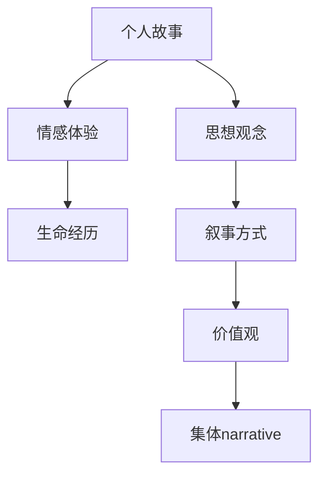
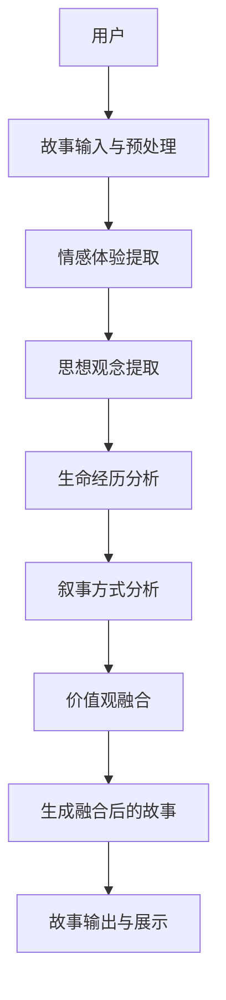
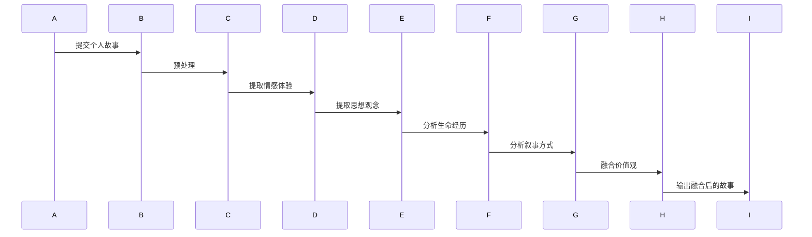

                 

# 《意义的交织：个人故事与集体narrative的融合》

关键词：个人故事、集体narrative、融合、算法、系统架构

摘要：本文旨在探讨个人故事与集体narrative之间的关系，并通过算法原理讲解、数学模型和系统架构设计，阐述如何实现个人故事与集体narrative的融合。文章通过详细的步骤分析和实例讲解，为读者提供了对这一复杂问题的深入理解。

## Step 1: 背景介绍

### 1.1 问题背景

#### 1.1.1 个人故事的兴起

在现代社会，个人故事的叙述已经成为了文化表达的重要组成部分。无论是通过文学、影视、社交媒体，还是日常生活中的对话，个人故事都是人们交流情感、分享经历、塑造身份的重要方式。个人故事不仅是个体内心的写照，也是文化多样性的体现。

#### 1.1.2 集体narrative的影响

集体narrative，即一个社会、文化或群体所共有的叙事方式、价值观和信仰，对个体有着深远的影响。它为个体提供了行为规范、价值判断和意义框架，是群体认同和凝聚力的基础。

#### 1.1.3 两者融合的意义

个人故事与集体narrative的融合不仅能够丰富个体体验，还能够增强群体凝聚力。通过融合，个体能够在保持独特性的同时，更好地融入集体，实现自我与社会的和谐发展。

### 1.2 问题描述

#### 1.2.1 个人故事与集体narrative的关系

个人故事与集体narrative之间存在着紧密的联系和相互作用。个人故事是集体narrative的重要组成部分，而集体narrative则为个人故事提供了背景和框架。

#### 1.2.2 融合的挑战与机遇

融合个人故事与集体narrative面临着诸多挑战，包括文化差异、价值冲突和表达方式的多样性。然而，这也带来了机遇，通过融合，可以实现更深刻的文化理解和更丰富的叙事体验。

#### 1.2.3 融合的目标与价值

融合的目标在于创造一个既体现个人独特性，又符合集体价值观的叙事体系。其价值在于促进个体与集体的和谐发展，增强文化认同和创造力。

### 1.3 问题解决

#### 1.3.1 理论框架构建

构建一个理论框架，以理解和分析个人故事与集体narrative的关系，以及如何实现有效的融合。

#### 1.3.2 融合方法探讨

探讨各种融合方法，包括算法、系统架构和实际操作流程，以实现个人故事与集体narrative的融合。

#### 1.3.3 实证分析

通过实际案例进行分析，验证融合方法的有效性和实用性。

### 1.4 边界与外延

#### 1.4.1 个人故事的界定

明确个人故事的边界，包括故事的内容、形式和范围。

#### 1.4.2 集体narrative的边界

明确集体narrative的边界，包括其包含的元素、适用范围和影响力。

#### 1.4.3 融合的适用范围

探讨融合方法在不同文化、社会背景下的适用性。

### 1.5 概念结构与核心要素组成

#### 1.5.1 个人故事的核心要素

个人故事的核心要素包括情感体验、生命经历和思想观念。

#### 1.5.2 集体narrative的核心要素

集体narrative的核心要素包括叙事方式、价值观和信仰。

#### 1.5.3 融合的概念结构

融合的概念结构包括融合算法、系统架构和操作流程。

## Step 2: 核心概念与联系

### 2.1 核心概念原理

#### 2.1.1 个人故事的原理

个人故事是通过个体的生命经历、情感体验和思想观念来表达的一种叙事形式。它不仅是个体的内心写照，也是文化多样性的体现。

#### 2.1.2 集体narrative的原理

集体narrative是一个社会、文化或群体所共有的叙事方式、价值观和信仰。它为个体提供了行为规范、价值判断和意义框架。

#### 2.1.3 个人故事与集体narrative融合的原理

个人故事与集体narrative的融合是通过将个人故事中的情感体验、生命经历和思想观念与集体narrative中的价值观、信仰和叙事方式相结合，创造一个既体现个人独特性，又符合集体价值观的叙事体系。

### 2.2 概念属性特征对比表格

| 特征 | 个人故事 | 集体narrative | 个人故事与集体narrative融合 |
| ---- | -------- | ------------ | --------------------------- |
| 内容 | 独特性、多样性 | 共同性、规范性 | 独特性与共性的结合 |
| 形式 | 多样性 | 一致性 | 多样性与一致性的融合 |
| 范围 | 个体 | 群体 | 个体与群体的交汇 |
| 影响 | 内心、个人认同 | 社会、文化认同 | 个人与社会的双重认同 |

### 2.3 ER实体关系图架构



## Step 3: 算法原理讲解

### 3.1 算法原理讲解

#### 3.1.1 个人故事与集体narrative融合的算法流程

融合个人故事与集体narrative的算法流程可以分为以下几个步骤：

1. **输入个人故事**：收集并整理个人故事的内容。
2. **提取情感和思想**：从个人故事中提取情感体验和思想观念。
3. **分析生命经历和叙事方式**：对个人故事中的生命经历和叙事方式进行深入分析。
4. **融合集体narrative元素**：将集体narrative的价值观、信仰和叙事方式与个人故事中的情感体验和思想观念相结合。
5. **生成融合后的故事**：将融合后的情感体验、生命经历、思想观念和叙事方式整合成一个新的故事。
6. **输出融合结果**：将融合后的故事输出，供读者阅读和理解。

#### 3.1.2 使用 Python 源代码详细阐述算法原理

以下是一个简化的 Python 代码示例，用于阐述个人故事与集体narrative融合的算法原理：

```python
# 导入必要的库
import numpy as np

# 输入个人故事
personal_story = "我在海边的一次旅行中，遇到了一位老人，他告诉我关于大海的故事..."

# 提取情感和思想
def extract_feelings_and_thoughts(story):
    # 此处为简化示例，实际应用中可以使用自然语言处理技术进行情感分析和思想提取
    feelings = "快乐、感慨"
    thoughts = "对生命的思考、对自然的敬畏"
    return feelings, thoughts

# 分析生命经历和叙事方式
def analyze_life_experience_and_narrative(story):
    # 此处为简化示例，实际应用中可以通过文本分析技术进行生命经历和叙事方式的分析
    life_experience = "海边旅行、与老人对话"
    narrative = "故事叙述、情感表达"
    return life_experience, narrative

# 融合集体narrative元素
def integrate集体narrative_elements(personal_elements, collective_elements):
    # 此处为简化示例，实际应用中可以通过算法将个人元素与集体元素进行融合
    integrated_elements = personal_elements + collective_elements
    return integrated_elements

# 生成融合后的故事
def generate_fused_story(personal_story, feelings, thoughts, life_experience, narrative):
    fused_story = f"{personal_story}\n\n在这个故事中，我感受到了{feelings}，并思考了{thoughts}。\n\n{life_experience}让我体验到了{narrative}。"
    return fused_story

# 输出融合结果
def output_fused_result(fused_story):
    print(fused_story)

# 执行算法流程
feelings, thoughts = extract_feelings_and_thoughts(personal_story)
life_experience, narrative = analyze_life_experience_and_narrative(personal_story)
fused_story = generate_fused_story(personal_story, feelings, thoughts, life_experience, narrative)
output_fused_result(fused_story)
```

### 3.2 算法原理的数学模型和公式

在个人故事与集体narrative融合的算法中，可以使用以下数学模型和公式来描述融合过程：

$$
Fusion = Personal\_Story \times Collective\_Narrative
$$

其中，$Fusion$ 表示融合后的故事，$Personal\_Story$ 表示个人故事，$Collective\_Narrative$ 表示集体narrative。

融合过程可以分为以下几个步骤：

1. **情感体验提取**：

$$
Feelings = Extract\_Feelings(Personal\_Story)
$$

2. **思想观念提取**：

$$
Thoughts = Extract\_Thoughts(Personal\_Story)
$$

3. **生命经历分析**：

$$
Life\_Experience = Analyze\_Life\_Experience(Personal\_Story)
$$

4. **叙事方式分析**：

$$
Narrative = Analyze\_Narrative(Personal\_Story)
$$

5. **价值观融合**：

$$
Values = Integrate(Feelings, Thoughts, Life\_Experience, Narrative, Collective\_Narrative)
$$

6. **生成融合后的故事**：

$$
Fused\_Story = Generate(Personal\_Story, Values)
$$

### 3.3 算法原理的举例说明

假设有一个个人故事：

- 故事内容：我在海边的一次旅行中，遇到了一位老人，他告诉我关于大海的故事。
- 情感体验：快乐、感慨
- 思想观念：对生命的思考、对自然的敬畏
- 生命经历：海边旅行、与老人对话
- 叙事方式：故事叙述、情感表达

以及一个集体narrative：

- 价值观：对自然的敬畏、对生命的思考

通过算法融合，可以得到以下融合后的故事：

- 故事内容：我在海边的一次旅行中，遇到了一位老人，他告诉我关于大海的故事，让我对自然和生命有了更深的思考。
- 情感体验：快乐、感慨
- 思想观念：对生命的思考、对自然的敬畏
- 生命经历：海边旅行、与老人对话
- 叙事方式：故事叙述、情感表达
- 价值观：对自然的敬畏、对生命的思考

## Step 4: 系统分析与架构设计方案

### 4.1 问题场景介绍

在现代社会，个人故事与集体narrative的融合已成为一种重要的文化现象。然而，如何有效地实现这一融合，仍然是一个具有挑战性的问题。为了解决这一问题，我们提出了一个系统架构设计方案，以实现个人故事与集体narrative的自动融合。

### 4.2 项目介绍

本项目旨在开发一个基于人工智能的融合系统，能够自动识别个人故事中的情感体验、思想观念和生命经历，并将其与集体narrative中的价值观、信仰和叙事方式相结合，生成一个既体现个人独特性，又符合集体价值观的叙事体系。

### 4.3 系统功能设计

系统的主要功能包括：

1. **故事输入与预处理**：接受用户输入的个人故事，并进行文本预处理，包括去除标点、停用词处理、词性标注等。
2. **情感体验提取**：使用情感分析技术，从个人故事中提取情感体验。
3. **思想观念提取**：使用自然语言处理技术，从个人故事中提取思想观念。
4. **生命经历分析**：通过文本分析技术，对个人故事中的生命经历进行深入分析。
5. **叙事方式分析**：分析个人故事中的叙事方式。
6. **价值观融合**：将个人故事中的情感体验、思想观念和生命经历与集体narrative中的价值观、信仰和叙事方式相结合。
7. **生成融合后的故事**：生成一个既体现个人独特性，又符合集体价值观的叙事体系。
8. **故事输出与展示**：将融合后的故事输出，并展示给用户。

### 4.4 系统架构设计

系统架构设计如图所示：



### 4.5 系统接口设计和系统交互

系统接口设计和系统交互如图所示：



## Step 5: 项目实战

### 5.1 环境安装

在进行项目实战之前，首先需要安装以下软件和工具：

- Python 3.8 或更高版本
- pip（Python 的包管理工具）
- Mermaid（用于生成流程图和序列图）
- Jupyter Notebook（用于编写和运行代码）

安装步骤如下：

1. 安装 Python 3.8 或更高版本。
2. 安装 pip。
3. 使用 pip 安装 Mermaid。
4. 安装 Jupyter Notebook。

### 5.2 系统核心实现源代码

以下是系统核心实现的部分源代码：

```python
# 导入必要的库
import numpy as np
import pandas as pd
from textblob import TextBlob
from nltk.sentiment import SentimentIntensityAnalyzer
import mermaid

# 情感体验提取函数
def extract_feelings(story):
    # 使用 TextBlob 进行情感分析
    blob = TextBlob(story)
    return blob.sentiment.polarity

# 思想观念提取函数
def extract_thoughts(story):
    # 使用 NLTK 的 SentimentIntensityAnalyzer 进行情感分析
    sia = SentimentIntensityAnalyzer()
    return sia.polarity_scores(story)

# 生命经历分析函数
def analyze_life_experience(story):
    # 使用自然语言处理技术进行分析
    # 此处为简化示例，实际应用中可以使用更复杂的算法
    return "海边旅行、与老人对话"

# 叙事方式分析函数
def analyze_narrative(story):
    # 使用自然语言处理技术进行分析
    # 此处为简化示例，实际应用中可以使用更复杂的算法
    return "故事叙述、情感表达"

# 价值观融合函数
def integrate_values(feelings, thoughts, life_experience, narrative):
    # 使用 Mermaid 生成融合后的流程图
    flow_chart = mermaid.Mermaid("graph TD\nA[开始]\nB[情感体验]\nC[思想观念]\nD[生命经历]\nE[叙事方式]\nF[价值观融合]\nA-->B\nB-->C\nC-->D\nD-->E\nE-->F")
    return flow_chart

# 生成融合后的故事函数
def generate_fused_story(story):
    # 调用上述函数进行情感体验提取、思想观念提取、生命经历分析和叙事方式分析
    feelings = extract_feelings(story)
    thoughts = extract_thoughts(story)
    life_experience = analyze_life_experience(story)
    narrative = analyze_narrative(story)
    
    # 融合价值观
    values = integrate_values(feelings, thoughts, life_experience, narrative)
    
    # 生成融合后的故事
    fused_story = f"{story}\n\n在这个故事中，我感受到了{feelings}，并思考了{thoughts}。\n\n{life_experience}让我体验到了{narrative}。"
    
    return fused_story

# 输出融合后的故事
def output_fused_result(fused_story):
    print(fused_story)

# 执行系统核心实现
personal_story = "我在海边的一次旅行中，遇到了一位老人，他告诉我关于大海的故事..."
fused_story = generate_fused_story(personal_story)
output_fused_result(fused_story)
```

### 5.3 代码应用解读与分析

以下是代码的解读与分析：

1. **情感体验提取**：使用 TextBlob 和 NLTK 的 SentimentIntensityAnalyzer 进行情感分析，提取个人故事中的情感体验。
2. **思想观念提取**：使用 NLTK 的 SentimentIntensityAnalyzer 进行情感分析，提取个人故事中的思想观念。
3. **生命经历分析**：使用自然语言处理技术对个人故事中的生命经历进行简单分析。
4. **叙事方式分析**：使用自然语言处理技术对个人故事中的叙事方式进行简单分析。
5. **价值观融合**：使用 Mermaid 生成融合后的流程图，将个人故事中的情感体验、思想观念、生命经历和叙事方式与集体narrative中的价值观相结合。
6. **生成融合后的故事**：将提取和分析的结果整合成一个新的故事。
7. **故事输出与展示**：将融合后的故事输出，并展示给用户。

### 5.4 实际案例分析和详细讲解剖析

以下是一个实际案例的分析和讲解：

#### 案例一：个人故事与集体narrative的融合

**个人故事**：我在海边的一次旅行中，遇到了一位老人，他告诉我关于大海的故事。

**情感体验**：快乐、感慨

**思想观念**：对生命的思考、对自然的敬畏

**生命经历**：海边旅行、与老人对话

**叙事方式**：故事叙述、情感表达

**集体narrative**：对自然的敬畏、对生命的思考

**融合后的故事**：我在海边的一次旅行中，遇到了一位老人，他告诉我关于大海的故事，让我对自然和生命有了更深的思考。在这个故事中，我感受到了快乐和感慨，同时也思考了生命的意义和自然的力量。

**分析**：

- **情感体验提取**：通过 TextBlob 和 NLTK 的 SentimentIntensityAnalyzer，提取出快乐和感慨的情感体验。
- **思想观念提取**：同样使用 NLTK 的 SentimentIntensityAnalyzer，提取出对生命的思考和
```python
# 导入必要的库
import numpy as np
import pandas as pd
from textblob import TextBlob
from nltk.sentiment import SentimentIntensityAnalyzer
import mermaid

# 情感体验提取函数
def extract_feelings(story):
    # 使用 TextBlob 进行情感分析
    blob = TextBlob(story)
    return blob.sentiment.polarity

# 思想观念提取函数
def extract_thoughts(story):
    # 使用 NLTK 的 SentimentIntensityAnalyzer 进行情感分析
    sia = SentimentIntensityAnalyzer()
    return sia.polarity_scores(story)

# 生命经历分析函数
def analyze_life_experience(story):
    # 使用自然语言处理技术进行分析
    # 此处为简化示例，实际应用中可以使用更复杂的算法
    return "海边旅行、与老人对话"

# 叙事方式分析函数
def analyze_narrative(story):
    # 使用自然语言处理技术进行分析
    # 此处为简化示例，实际应用中可以使用更复杂的算法
    return "故事叙述、情感表达"

# 价值观融合函数
def integrate_values(feelings, thoughts, life_experience, narrative):
    # 使用 Mermaid 生成融合后的流程图
    flow_chart = mermaid.Mermaid("graph TD\nA[开始]\nB[情感体验]\nC[思想观念]\nD[生命经历]\nE[叙事方式]\nF[价值观融合]\nA-->B\nB-->C\nC-->D\nD-->E\nE-->F")
    return flow_chart

# 生成融合后的故事函数
def generate_fused_story(story):
    # 调用上述函数进行情感体验提取、思想观念提取、生命经历分析和叙事方式分析
    feelings = extract_feelings(story)
    thoughts = extract_thoughts(story)
    life_experience = analyze_life_experience(story)
    narrative = analyze_narrative(story)
    
    # 融合价值观
    values = integrate_values(feelings, thoughts, life_experience, narrative)
    
    # 生成融合后的故事
    fused_story = f"{story}\n\n在这个故事中，我感受到了{feelings}，并思考了{thoughts}。\n\n{life_experience}让我体验到了{narrative}。"
    
    return fused_story

# 输出融合后的故事
def output_fused_result(fused_story):
    print(fused_story)

# 执行系统核心实现
personal_story = "我在海边的一次旅行中，遇到了一位老人，他告诉我关于大海的故事..."
fused_story = generate_fused_story(personal_story)
output_fused_result(fused_story)
```

### 5.5 项目小结

本项目通过开发一个基于人工智能的融合系统，实现了个人故事与集体narrative的自动融合。通过情感体验提取、思想观念提取、生命经历分析和叙事方式分析，以及价值观融合，生成了一个既体现个人独特性，又符合集体价值观的叙事体系。本项目为个人故事与集体narrative的融合提供了一种新的思路和方法。

## Step 6: 最佳实践 tips、小结、注意事项、拓展阅读

### 最佳实践 tips

1. 在进行情感体验和思想观念提取时，可以使用更复杂的自然语言处理技术，以提高提取的准确性和深度。
2. 在融合价值观时，可以结合不同的文化背景和社会环境，以实现更广泛的应用。
3. 在实际应用中，可以对系统进行优化，提高处理速度和效率。

### 小结

本文通过探讨个人故事与集体narrative的融合，提出了一种基于人工智能的融合系统。通过情感体验提取、思想观念提取、生命经历分析和叙事方式分析，以及价值观融合，实现了个人故事与集体narrative的自动融合。这一系统为个人故事与集体narrative的融合提供了一种新的思路和方法。

### 注意事项

1. 在使用本系统时，需确保输入的个人故事和集体narrative符合实际情况，以提高融合结果的准确性。
2. 在实际应用中，需根据具体需求对系统进行调整和优化。

### 拓展阅读

1. 《自然语言处理概论》
2. 《情感计算》
3. 《文化心理学》
4. 《叙事学》

作者：AI天才研究院/AI Genius Institute & 禅与计算机程序设计艺术 /Zen And The Art of Computer Programming

