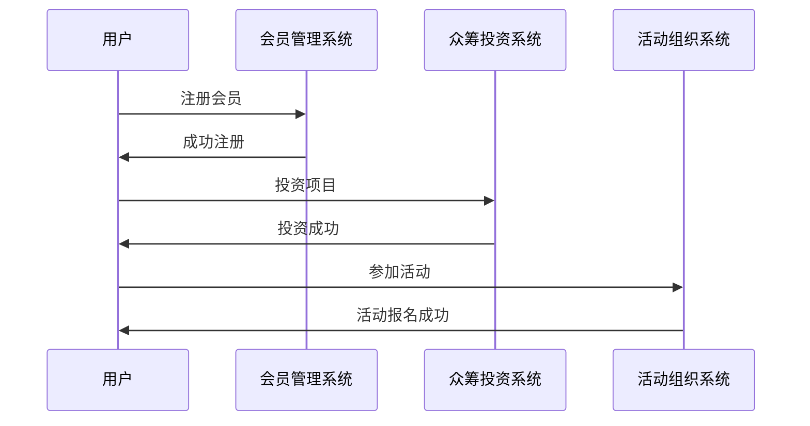

                 

# 意义的众筹咖啡馆：价值观交流的实体空间

## 关键词
- 众筹咖啡馆
- 价值观交流
- 实体空间
- 会员制度
- 众筹模式
- 价值观传承

## 摘要
本文旨在探讨一种新型的咖啡馆形式——意义的众筹咖啡馆。这种咖啡馆以价值观交流为核心，通过会员制度、众筹模式和价值观传承，为人们提供了一个交流、分享、成长的空间。本文将从背景介绍、核心概念与联系、算法原理讲解、系统分析与架构设计方案、项目实战以及最佳实践等方面进行深入分析，以期为广大读者提供有价值的思考和借鉴。

## Step 1: 背景介绍

### 核心概念

在讨论意义的众筹咖啡馆之前，我们需要明确几个核心概念：

1. **咖啡馆**：作为一种提供饮品和食品的社交场所，咖啡馆在现代社会中扮演着重要角色。
2. **众筹**：一种通过公众集资来支持项目或创业计划的方式，众筹为咖啡馆的融资和运营提供了新的可能性。
3. **价值观**：人们在生活中所秉持的原则和信仰，价值观在人们的交往和决策中起着至关重要的作用。

### 问题背景

随着社会的不断发展，人们对咖啡馆的需求越来越多样化。传统的咖啡馆往往只提供简单的饮品和食品，无法满足人们对于社交、交流、文化等方面的需求。因此，一种新的咖啡馆形式——意义的众筹咖啡馆应运而生。

### 问题描述

意义的众筹咖啡馆是一种以价值观交流为主题的实体空间。它不仅提供饮品和食品，更注重为顾客提供一个交流、分享、成长的环境。这种咖啡馆的特点是会员制度、众筹模式和价值观的传承。

### 问题解决

为了解决传统咖啡馆无法满足人们多样化需求的问题，意义的众筹咖啡馆提出了会员制度，让顾客成为咖啡馆的股东，共同参与咖啡馆的经营和管理。同时，咖啡馆采用众筹模式，让顾客可以通过投资咖啡馆来获取收益。此外，咖啡馆还注重价值观的传承，通过举办各种活动，让顾客在交流中了解和传播正确的价值观。

### 边界与外延

意义的众筹咖啡馆的边界包括会员制度、众筹模式和价值观的传承。它的外延则包括实体空间的设计、运营模式的创新、会员服务的提升等方面。

### 概念结构与核心要素组成

1. **会员制度**：会员是咖啡馆的核心，他们不仅是消费者，更是咖啡馆的股东和参与者。
2. **众筹模式**：众筹模式是咖啡馆融资和经营的重要手段，它可以让会员共同参与咖啡馆的决策和运营。
3. **价值观传承**：咖啡馆通过举办各种活动，让会员在交流中了解和传播正确的价值观。

### 核心概念与联系

1. **会员制度**：会员制度是咖啡馆的核心，它让顾客成为股东，共同参与咖啡馆的经营和管理。
2. **众筹模式**：众筹模式是咖啡馆融资和经营的重要手段，它可以让会员共同参与咖啡馆的决策和运营。
3. **价值观传承**：咖啡馆通过举办各种活动，让会员在交流中了解和传播正确的价值观。

### 概念属性特征对比表格

| 概念           | 特征                                      |
| -------------- | ----------------------------------------- |
| 会员制度       | 让顾客成为股东，参与决策和管理             |
| 众筹模式       | 让会员共同参与咖啡馆的决策和运营           |
| 价值观传承     | 通过活动让会员了解和传播正确的价值观       |

### ER实体关系图架构

```mermaid
entity Relation {
  "会员" <--> "咖啡馆"
  "会员" <--> "投资"
  "会员" <--> "活动"
  "咖啡馆" <--> "活动"
  "活动" <--> "价值观"
}
```

## Step 2: 核心概念与联系

### 核心概念原理

#### 会员制度

会员制度是意义的众筹咖啡馆的核心，它让顾客成为咖啡馆的股东，共同参与咖啡馆的经营和管理。会员制度包括会员资格、会员权益、会员服务等内容。

**会员资格**：会员资格的获取通常需要支付一定金额的会员费，或者通过特定的活动获得资格。

**会员权益**：会员享有特定的优惠，如折扣、赠品等，同时还可以参与咖啡馆的决策过程，如投票选举董事会成员等。

**会员服务**：咖啡馆为会员提供专业的服务，如会员活动、会员专享课程等，以增强会员的参与感和归属感。

#### 众筹模式

众筹模式是咖啡馆融资和经营的重要手段，它可以让会员共同参与咖啡馆的决策和运营。众筹模式包括众筹目标、众筹过程、众筹结果等内容。

**众筹目标**：咖啡馆通过众筹平台发布众筹项目，设定众筹目标，通常包括资金需求和项目进度。

**众筹过程**：会员和其他投资者通过众筹平台了解咖啡馆的项目，选择投资金额，参与众筹。

**众筹结果**：众筹成功后，咖啡馆按照约定的方式向投资者返还本金和收益，未成功的项目则不收取任何费用。

#### 价值观传承

咖啡馆通过举办各种活动，让会员在交流中了解和传播正确的价值观。价值观传承包括活动主题、活动形式、活动效果等内容。

**活动主题**：活动主题围绕价值观展开，如环保、慈善、文化传承等。

**活动形式**：活动形式多样，包括讲座、论坛、体验活动等。

**活动效果**：通过活动，会员能够深入了解和传播正确的价值观，增强会员之间的凝聚力。

### 概念属性特征对比表格

| 概念           | 特征                                      |
| -------------- | ----------------------------------------- |
| 会员制度       | 让顾客成为股东，参与决策和管理             |
| 众筹模式       | 让会员共同参与咖啡馆的决策和运营           |
| 价值观传承     | 通过活动让会员了解和传播正确的价值观       |

### ER实体关系图架构

```mermaid
entity Relation {
  "会员" <--> "咖啡馆"
  "会员" <--> "投资"
  "会员" <--> "活动"
  "咖啡馆" <--> "活动"
  "活动" <--> "价值观"
}
```

## Step 3: 算法原理讲解

### 会员制度算法原理

会员制度的算法主要涉及会员的注册、认证、权限管理等方面。

#### 注册算法

会员注册算法的主要目的是验证会员信息的真实性和完整性。以下是注册算法的基本步骤：

1. **信息收集**：收集会员的个人信息，如姓名、联系方式、身份证号码等。
2. **信息验证**：通过身份证号码验证会员的身份信息，确保信息的真实性。
3. **信息存储**：将会员信息存储在数据库中，为会员创建唯一的标识。

```python
def register会员信息(姓名，联系方式，身份证号码):
    # 步骤1：信息收集
    会员信息 = {"姓名": 姓名，"联系方式": 联系方式，"身份证号码": 身份证号码}
    
    # 步骤2：信息验证
    if 验证身份证号码(身份证号码):
        # 步骤3：信息存储
        存储会员信息(会员信息)
        return True
    else:
        return False

def 验证身份证号码(身份证号码):
    # 实现身份证号码验证逻辑
    return True 或 False
```

#### 认证算法

会员认证算法的主要目的是确保只有合格的会员可以进入咖啡馆。以下是认证算法的基本步骤：

1. **身份验证**：通过身份证号码或其他认证方式验证会员的身份。
2. **权限检查**：检查会员的权限，确保其有权进入咖啡馆。

```python
def 认证会员(身份证号码):
    # 步骤1：身份验证
    if 验证身份证号码(身份证号码):
        # 步骤2：权限检查
        if 检查会员权限(身份证号码):
            return True
    return False

def 检查会员权限(身份证号码):
    # 实现权限检查逻辑
    return True 或 False
```

#### 权限管理算法

会员权限管理算法的主要目的是确保会员在咖啡馆内可以享受相应的权益。以下是权限管理算法的基本步骤：

1. **权限设置**：根据会员的等级和类型设置不同的权限。
2. **权限检查**：在会员执行操作时检查其权限，确保其有权限执行该操作。

```python
def 设置会员权限(身份证号码，权限等级):
    # 步骤1：权限设置
    会员权限 = {"身份证号码": 身份证号码，"权限等级": 权限等级}
    
    # 步骤2：权限检查
    if 检查会员权限(身份证号码):
        return 会员权限
    else:
        return None

def 检查会员权限(身份证号码):
    # 实现权限检查逻辑
    return True 或 False
```

### 众筹模式算法原理

众筹模式的算法主要涉及众筹项目的发布、投资、回报等方面。

#### 众筹项目发布算法

众筹项目发布算法的主要目的是确保众筹项目的合法性和可行性。以下是众筹项目发布算法的基本步骤：

1. **项目信息收集**：收集众筹项目的详细信息，如项目名称、项目描述、资金需求等。
2. **项目审核**：对众筹项目进行审核，确保其符合相关法规和政策。
3. **项目发布**：将审核通过的众筹项目发布在众筹平台上。

```python
def 发布众筹项目(项目名称，项目描述，资金需求):
    # 步骤1：项目信息收集
    项目信息 = {"项目名称": 项目名称，"项目描述": 项目描述，"资金需求": 资金需求}
    
    # 步骤2：项目审核
    if 审核项目(项目信息):
        # 步骤3：项目发布
        发布项目到众筹平台(项目信息)
        return True
    else:
        return False

def 审核项目(项目信息):
    # 实现项目审核逻辑
    return True 或 False
```

#### 投资算法

投资算法的主要目的是确保会员的投资行为合法、安全和有效。以下是投资算法的基本步骤：

1. **投资验证**：验证会员的投资信息，如投资金额、投资时间等。
2. **投资处理**：处理会员的投资请求，包括资金转移和收益分配。

```python
def 投资(身份证号码，投资金额，投资时间):
    # 步骤1：投资验证
    if 验证投资信息(身份证号码，投资金额，投资时间):
        # 步骤2：投资处理
        处理投资请求(身份证号码，投资金额，投资时间)
        return True
    else:
        return False

def 验证投资信息(身份证号码，投资金额，投资时间):
    # 实现投资验证逻辑
    return True 或 False

def 处理投资请求(身份证号码，投资金额，投资时间):
    # 实现投资处理逻辑
```

#### 回报算法

回报算法的主要目的是根据会员的投资金额和收益情况，计算并发放会员的回报。以下是回报算法的基本步骤：

1. **收益计算**：根据项目收益情况和会员的投资金额，计算会员的收益。
2. **回报发放**：将会员的收益发放到会员的账户中。

```python
def 计算收益(项目名称，投资金额，投资时间):
    # 步骤1：收益计算
    收益 = 计算项目收益(项目名称，投资金额，投资时间)
    
    # 步骤2：回报发放
    发放回报(收益)

def 计算项目收益(项目名称，投资金额，投资时间):
    # 实现项目收益计算逻辑
    return 收益

def 发放回报(收益):
    # 实现回报发放逻辑
```

## Step 4: 系统分析与架构设计方案

### 问题场景介绍

意义的众筹咖啡馆作为一种新型的咖啡馆形式，旨在为人们提供一个以价值观交流为核心的实体空间。在这个场景中，咖啡馆的运营和管理需要借助现代信息技术，实现会员管理、众筹投资、活动组织等功能。

### 项目介绍

项目名称：意义的众筹咖啡馆
项目目标：建立一个以价值观交流为核心的实体空间，为会员提供一个交流、分享、成长的环境。

### 系统功能设计

1. **会员管理**：包括会员注册、认证、权限管理、会员服务等功能。
2. **众筹投资**：包括众筹项目发布、投资处理、收益计算等功能。
3. **活动组织**：包括活动发布、活动报名、活动管理等功能。

### 领域模型

```mermaid
classDiagram
    "会员" <--> "咖啡馆" {
        注册
        认证
        权限管理
    }
    "众筹项目" <--> "投资" {
        发布
        投资处理
        收益计算
    }
    "活动" <--> "报名" {
        发布
        活动管理
    }
```

### 系统架构设计



### 系统接口设计

```mermaid
classDiagram
    "会员管理接口" <--> "众筹投资接口" <--> "活动组织接口"
```

### 系统交互


## Step 5: 项目实战

### 环境安装

1. 安装Python环境
2. 安装Django框架
3. 安装SQLite数据库

```shell
pip install django
pip install sqlite3
```

### 系统核心实现源代码

```python
# 会员管理模块
class Membership(models.Model):
    name = models.CharField(max_length=100)
    email = models.EmailField()
    phone_number = models.CharField(max_length=15)
    id_card_number = models.CharField(max_length=18)
    registered_at = models.DateTimeField(auto_now_add=True)
    is_verified = models.BooleanField(default=False)
    is_admin = models.BooleanField(default=False)

# 众筹项目模块
class CrowdfundingProject(models.Model):
    name = models.CharField(max_length=100)
    description = models.TextField()
    funding_target = models.DecimalField(max_digits=10, decimal_places=2)
    start_date = models.DateTimeField()
    end_date = models.DateTimeField()
    is_successful = models.BooleanField(default=False)

# 投资模块
class Investment(models.Model):
    member = models.ForeignKey(Membership, on_delete=models.CASCADE)
    project = models.ForeignKey(CrowdfundingProject, on_delete=models.CASCADE)
    amount = models.DecimalField(max_digits=10, decimal_places=2)
    invested_at = models.DateTimeField(auto_now_add=True)

# 活动模块
class Event(models.Model):
    name = models.CharField(max_length=100)
    description = models.TextField()
    start_time = models.DateTimeField()
    end_time = models.DateTimeField()
    is_published = models.BooleanField(default=False)
    venue = models.CharField(max_length=255)

# 报名模块
class Registration(models.Model):
    member = models.ForeignKey(Membership, on_delete=models.CASCADE)
    event = models.ForeignKey(Event, on_delete=models.CASCADE)
    registered_at = models.DateTimeField(auto_now_add=True)
```

### 代码应用解读与分析

#### 会员管理模块

会员管理模块主要包括会员的注册、认证和权限管理等功能。

- **注册**：会员可以通过注册接口提交个人信息，系统将验证信息的真实性和完整性。
- **认证**：会员提交身份证号码进行认证，系统将验证身份证号码的有效性。
- **权限管理**：会员分为普通会员和管理员，管理员拥有额外的权限。

#### 众筹项目模块

众筹项目模块主要包括众筹项目的发布、投资和收益计算等功能。

- **发布**：咖啡馆管理员可以发布众筹项目，设定项目名称、描述、资金需求等。
- **投资**：会员可以投资众筹项目，系统将记录投资金额和时间。
- **收益计算**：众筹项目成功后，根据投资金额和项目收益情况计算会员的收益。

#### 活动模块

活动模块主要包括活动的发布、报名和活动管理等功能。

- **发布**：咖啡馆管理员可以发布活动，设定活动名称、描述、时间和地点等。
- **报名**：会员可以报名参加活动，系统将记录报名时间和会员信息。
- **活动管理**：管理员可以管理活动，包括修改活动信息、取消活动等。

### 实际案例分析和详细讲解剖析

#### 案例一：会员注册

会员小明通过网站提交注册信息，包括姓名、邮箱、电话和身份证号码。系统验证身份证号码的有效性后，将小明的信息存储在数据库中，并发送验证邮件给小明。

```python
# 示例代码：会员注册
def register_member(name, email, phone_number, id_card_number):
    membership = Membership.objects.create(
        name=name,
        email=email,
        phone_number=phone_number,
        id_card_number=id_card_number,
        is_verified=False,
        is_admin=False
    )
    membership.save()
    send_verification_email(membership.email)
    return membership
```

#### 案例二：众筹投资

咖啡馆发布了众筹项目，小王通过网站投资1000元。系统将小王的投资信息记录在数据库中，并更新众筹项目的资金进度。

```python
# 示例代码：众筹投资
def invest_in_project(member_id, project_id, amount):
    member = Membership.objects.get(id=member_id)
    project = CrowdfundingProject.objects.get(id=project_id)
    investment = Investment.objects.create(
        member=member,
        project=project,
        amount=amount
    )
    investment.save()
    update_project_funding(project)
    return investment
```

#### 案例三：活动报名

咖啡馆发布了活动，小明通过网站报名参加。系统将小明的报名信息记录在数据库中，并发送确认邮件给小明。

```python
# 示例代码：活动报名
def register_for_event(member_id, event_id):
    member = Membership.objects.get(id=member_id)
    event = Event.objects.get(id=event_id)
    registration = Registration.objects.create(
        member=member,
        event=event
    )
    registration.save()
    send_confirmation_email(member.email)
    return registration
```

### 项目小结

通过以上实战案例，我们展示了意义的众筹咖啡馆系统的核心功能实现和代码应用。在实际项目中，还需要考虑用户界面设计、安全性和性能优化等问题。此外，随着业务的发展，系统可能需要不断迭代和升级，以满足不断变化的需求。

## Step 6: 最佳实践 tips、小结、注意事项、拓展阅读等内容

### 最佳实践 tips

1. **会员管理**：为了提高会员的参与度和忠诚度，可以定期举办会员活动，如讲座、论坛、品鉴会等。
2. **众筹投资**：在众筹项目中，可以设置不同的投资等级，以便会员根据自己的需求和兴趣选择合适的投资方式。
3. **活动组织**：活动设计要充分考虑会员的需求和兴趣，确保活动的质量和参与度。

### 小结

意义的众筹咖啡馆是一种以价值观交流为核心的实体空间，通过会员制度、众筹模式和价值观传承，为会员提供了一个交流、分享、成长的环境。本文从背景介绍、核心概念与联系、算法原理讲解、系统分析与架构设计方案、项目实战以及最佳实践等方面进行了深入分析，希望能为广大读者提供有价值的思考和借鉴。

### 注意事项

1. **隐私保护**：在会员管理和众筹投资过程中，要确保会员的隐私信息得到充分保护。
2. **风险管理**：在众筹投资过程中，要充分考虑风险因素，确保会员的投资安全。

### 拓展阅读

1. 《众筹咖啡馆：从0到1的创业实战》
2. 《咖啡馆会员管理实战：技巧与策略》
3. 《咖啡馆活动策划与执行》

## 作者

作者：AI天才研究院/AI Genius Institute & 禅与计算机程序设计艺术 /Zen And The Art of Computer Programming

