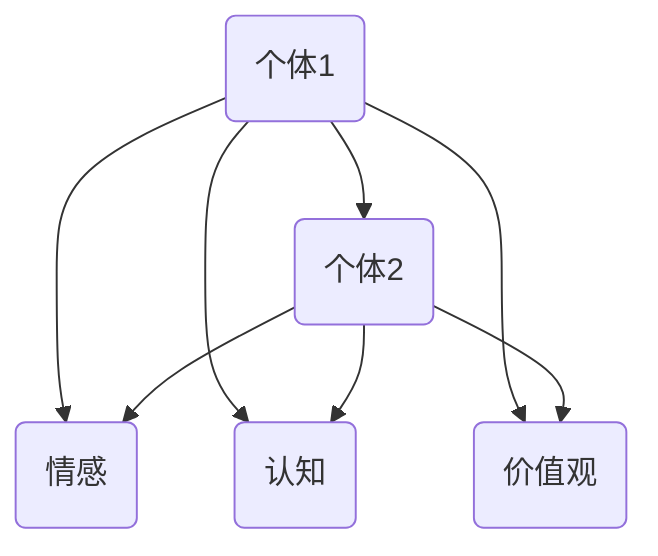

                 

### 第一部分: 引言

#### 第1章: 问题的提出

#### 1.1 问题背景

在当今社会，随着科技的发展和全球化的加速，人们的生活节奏不断加快，人际交往的方式和频率也发生了巨大的变化。然而，这种变化并非总是朝着积极的方向发展。现代社会中，越来越多的人感到孤独、焦虑和疏离，甚至出现了“社交恐惧症”等心理问题。这些问题源于现代社会人际交往的困境，即人与人之间缺乏深层次的连接和共鸣。

#### 1.1.1 现代社会人际交往的困境

现代社会的人际交往面临着诸多困境。首先，随着社交媒体的普及，人们虽然可以轻易地获取大量的社交信息，但实际上却往往感到孤独。这是因为社交媒体上的互动大多是单向的，缺乏真实的情感交流和共鸣。其次，人们的生活节奏加快，导致他们没有足够的时间去建立和维护深层次的人际关系。最后，人们的生活压力增大，导致他们在人际交往中往往表现出回避、敌对或冷漠的态度。

#### 1.1.2 连接与共振的需求

面对这些困境，人们迫切需要找到一种方式来改善人际交往，建立深层次的连接和共鸣。这意味着我们需要探索如何在现代社会中实现有效的连接与共振，以缓解孤独和焦虑，提高生活质量。

#### 1.1.3 研究的目的与意义

本研究旨在探讨意义的共振与人际连接的关系，寻找提高人际交往质量的方法。通过分析意义的共振机制，理解人与人之间如何通过共享意义来实现连接，我们希望能够为改善人际交往提供理论支持和实践指导。

#### 1.2 核心概念解析

为了更好地理解本研究的内容，我们需要对几个核心概念进行详细解析。

##### 1.2.1 意义的共振

意义的共振是指个体之间在意义层面上的共鸣，即两个或多个个体在理解、感受和表达上达到一致，从而建立起深层次的连接。这种共振不仅仅是一种情感上的共鸣，更是一种认知上的统一。

##### 1.2.2 与他人连接的频率

与他人连接的频率是指个体在特定时间内与他人进行互动的次数和质量。高频率的连接并不意味着高质量的连接，但高质量的连接往往需要高频率的互动。

##### 1.2.3 概念结构与核心要素

意义的共振和与他人连接的频率是相互关联的。意义的共振是连接的内在动力，而连接的频率则是共振的外在表现。核心要素包括个体的情感、价值观和认知结构。

#### 1.3 研究边界与外延

##### 1.3.1 研究范围

本研究主要探讨意义的共振与人际连接的关系，重点关注以下领域：

1. 意义的共振机制及其在人际交往中的应用。
2. 与他人连接的频率及其影响因素。
3. 提高人际交往质量的策略与实践。

##### 1.3.2 研究限制

本研究存在一定的局限性，包括：

1. 研究对象和样本的局限性，可能导致结论的普适性受限。
2. 研究方法的局限性，可能无法完全揭示意义的共振与人际连接的复杂关系。

##### 1.3.3 研究的重要性

尽管本研究存在局限性，但其研究成果对于提高人际交往质量、缓解现代社会中的孤独和焦虑具有重要意义。通过理解意义的共振机制，我们可以在理论上指导实践，帮助人们在现代社会中建立更加紧密的人际关系，提高生活质量。

#### 1.4 本章小结

本章首先介绍了现代社会人际交往的困境，分析了连接与共振的需求，并明确了研究的目的与意义。接着，我们对核心概念进行了详细解析，并阐述了研究的边界与外延。通过本章的讨论，我们为后续章节的内容奠定了基础。

# 第二部分: 意义的共振原理

## 第2章: 意义的共振机制

#### 2.1 意义的共振概念

意义的共振是一个复杂而微妙的过程，它涉及到个体之间的情感、认知和价值观的共鸣。为了更好地理解这一概念，我们需要从多个维度进行分析。

##### 2.1.1 意义共振的定义

意义的共振可以定义为两个或多个个体在情感、认知和价值观层面上的共鸣。这种共鸣不仅体现在情感上的共鸣，如同理心和情感共鸣，还包括认知上的共识，如对某个问题的共同理解。此外，价值观的共振也是意义共振的重要组成部分，它体现了个体在道德观念和人生目标上的相似性。

##### 2.1.2 意义共振的属性特征对比

意义共振具有以下几个属性特征：

1. **情感共鸣**：情感共鸣是意义共振的基础，它体现了个体之间在情感上的共鸣。例如，当一个人听到他人的悲伤故事时，会感受到情感的共鸣，产生同情和关怀。

2. **认知共识**：认知共识是指个体在认知层面上的共同理解。例如，当两个程序员讨论技术问题时，他们可能会在某个解决方案上达成共识，这体现了他们在技术认知上的共振。

3. **价值观相似性**：价值观相似性是意义共振的重要特征，它反映了个体在道德观念和人生目标上的相似性。例如，两个人在环保观念上达成共识，这表明他们在价值观上存在共振。

#### 2.2 意义共振的基本原理

意义共振的基本原理可以从多个学科领域进行探讨，包括物理学、心理学和社会学。

##### 2.2.1 共振现象的物理基础

共振现象在物理学中有着广泛的应用。当系统的固有频率与外界驱动力频率相匹配时，系统会发生共振，从而产生较大的振动幅度。在人际交往中，当个体的情感、认知和价值观频率与他人的频率相匹配时，也会产生共振现象，从而建立深层次的连接。

##### 2.2.2 社会心理学的解释

社会心理学对意义共振提供了深刻的解释。根据社会心理学的理论，个体在情感、认知和价值观上的相似性会增加他们的亲近感，从而促进共振。此外，社会认同理论指出，当个体认同他人的价值观和行为时，他们更容易产生共鸣。

##### 2.2.3 数学模型的描述

数学模型可以用来描述意义共振的机制。例如，基于网络理论的数学模型可以用来分析个体之间的情感和认知共振。这种模型通常使用图论来表示个体之间的连接，并通过分析图的特性来研究共振现象。

#### 2.3 意义共振的ER实体关系图

为了更好地理解意义共振的机制，我们可以使用ER（实体-关系）图来描述个体之间的连接。以下是意义共振的ER实体关系图：

在这个ER图中，A和B代表两个个体，C、D和E分别代表情感、认知和价值观。箭头表示个体之间的连接，反映了他们在这些维度上的共振。

#### 2.4 本章小结

本章首先介绍了意义的共振概念，并分析了其属性特征。接着，我们探讨了意义共振的基本原理，包括物理基础、社会心理学解释和数学模型描述。最后，通过ER实体关系图，我们展示了意义共振的机制。这些内容为理解意义共振提供了理论基础。

## 第3章: 与他人连接的频率

#### 3.1 连接的频率概念

与他人连接的频率是指个体在特定时间内与他人进行互动的次数和质量。连接频率是衡量人际交往活跃程度的重要指标，它不仅反映了个体之间的互动频率，还体现了互动的质量。

##### 3.1.1 连接频率的定义

连接频率可以定义为个体在一定时间内与他人互动的次数。这种互动可以是面对面的交流，也可以是通过社交媒体或其他在线平台进行的交流。连接频率通常用“次/天”或“次/周”来衡量。

##### 3.1.2 连接频率的类型

连接频率可以分为以下几种类型：

1. **高频连接**：高频连接指的是个体在较短时间内与多人进行频繁互动。这种连接方式通常发生在朋友或同事之间，体现了密切的人际关系。

2. **低频连接**：低频连接指的是个体在较长时间内与少数人进行较少的互动。这种连接方式通常发生在家庭成员或长期朋友之间，体现了稳定的关系。

3. **临时连接**：临时连接指的是个体在特定情境下与陌生人进行的短暂互动。这种连接通常发生在社交场合或公共环境中。

##### 3.1.3 连接频率的重要性

连接频率对人际交往有着重要的影响。高连接频率通常意味着更紧密的人际关系和更好的社会支持。然而，过高的连接频率可能会导致压力和疲劳，而过低的连接频率则可能导致疏离和孤独。因此，找到合适的连接频率对于维持健康的人际关系至关重要。

#### 3.2 连接频率的影响因素

连接频率受到多种因素的影响，包括个体差异、社会环境和技术手段。

##### 3.2.1 个体差异

个体差异是影响连接频率的重要因素。不同的个体具有不同的社交需求和偏好，这导致了连接频率的差异。例如，外向的人通常更倾向于高频连接，而内向的人则更倾向于低频连接。

##### 3.2.2 社会环境

社会环境也是影响连接频率的重要因素。社会环境中的压力和机会会影响个体的社交行为。例如，在一个高度竞争的社会环境中，个体可能会更倾向于减少社交互动，以专注于个人发展。

##### 3.2.3 技术手段

技术手段为个体提供了新的连接方式，从而改变了连接频率。例如，社交媒体和即时通讯工具使得个体可以随时随地与他人进行互动，从而提高了连接频率。

#### 3.3 连接频率的测量与评估

测量和评估连接频率是理解和改善人际交往的重要步骤。以下是一些常见的测量和评估方法：

##### 3.3.1 量化指标的选取

量化指标是测量连接频率的重要工具。常见的量化指标包括互动次数、互动时长和互动质量。这些指标可以单独或组合使用，以全面评估连接频率。

##### 3.3.2 测量方法

测量连接频率的方法包括自我报告、行为测量和观察法。自我报告方法要求个体提供关于其社交互动的信息，行为测量方法通过记录个体在社交平台上的行为来评估连接频率，观察法则是通过直接观察个体的社交行为来评估连接频率。

##### 3.3.3 评估标准

评估标准是衡量连接频率是否合理的重要依据。合理的评估标准应考虑个体的社交需求和情境因素。例如，对于外向的人来说，高频连接可能是合理的，但对于内向的人来说，低频连接可能是更合适的。

#### 3.4 本章小结

本章介绍了连接频率的概念、类型和重要性，分析了影响连接频率的个体差异、社会环境和技术手段，并探讨了连接频率的测量与评估方法。通过本章的内容，我们能够更好地理解连接频率在人际交往中的作用和意义。

## 第4章: 实践指导

### 4.1 意义的共振与连接实践

在实际生活中，意义的共振与连接实践对于改善人际关系和提高生活质量具有重要意义。以下是一些具体的实践方法：

##### 4.1.1 培养共鸣的能力

1. **提高情感共鸣**：通过倾听他人的故事和经历，感受他们的情感，培养同理心。例如，当朋友分享他们的烦恼时，给予关心和支持。
2. **增强认知共鸣**：通过共同学习和讨论，提高对某个问题的理解。例如，与同事一起研究技术问题，互相交流观点和经验。
3. **深化价值观共鸣**：通过共同参与社会活动和价值观讨论，建立共同的道德观念。例如，参与志愿者活动或参与社区讨论，共同关注社会问题。

##### 4.1.2 提高连接频率的策略

1. **定期互动**：设定固定的交流时间，例如每周或每月与朋友进行线上或线下聚会。
2. **多样化互动方式**：通过多种互动方式，如面对面交流、电话、短信、社交媒体等，增加互动频率。
3. **利用技术手段**：利用社交媒体和即时通讯工具，随时与他人保持联系，提高连接频率。

##### 4.1.3 实践案例分析

以下是一个实践案例：

- **背景**：小李和小王是大学时的好朋友，毕业后因为工作和生活的压力，他们的联系逐渐减少。
- **问题**：小李和小王感到孤独和疏离，希望重新建立联系。
- **解决方案**：
  1. 小李和小王决定每周通过视频通话交流一次，分享各自的生活和工作经历。
  2. 他们开始共同参与线上学习课程，讨论所学内容，提高认知共鸣。
  3. 他们一起参与志愿者活动，共同关注社会问题，深化价值观共鸣。
- **结果**：通过这些实践，小李和小王重新建立了深厚的友谊，感觉更加充实和满足。

### 4.2 意义的共振与连接技巧

为了实现意义的共振和有效的连接，以下是一些实用的技巧：

##### 4.2.1 有效沟通的技巧

1. **倾听**：倾听是建立连接的关键。通过倾听他人的意见和感受，表达你的关心和理解。
2. **表达**：清晰、真诚地表达自己的想法和感受，避免误解和冲突。
3. **提问**：提出开放性问题，引导对方分享更多信息，增进了解。

##### 4.2.2 提高连接频率的策略

1. **计划**：设定固定的交流时间，确保定期与朋友和家人保持联系。
2. **多样化**：通过多种方式与朋友互动，如视频通话、电话、短信、社交媒体等。
3. **利用技术**：利用社交媒体和即时通讯工具，随时与他人保持联系。

##### 4.2.3 增强情感共鸣

1. **分享**：分享自己的经历、感受和想法，让对方感受到你的真诚和关心。
2. **倾听**：认真倾听他人的故事和感受，表达同情和理解。
3. **共同体验**：一起参加活动或体验，共同创造美好的回忆。

##### 4.2.4 增强认知共鸣

1. **学习**：一起学习新知识或技能，分享学习经验和心得。
2. **讨论**：就某个话题进行深入讨论，交换不同的观点和见解。
3. **探索**：一起探索新的领域和兴趣，共同发现新的激情。

##### 4.2.5 增强价值观共鸣

1. **共同价值观**：参与共同关注的社会问题和公益活动，共同实践和传播共同的价值观。
2. **讨论**：就道德和伦理问题进行讨论，互相影响和启发。
3. **行动**：一起参与社会行动，为社会做出贡献，增强价值观的一致性。

#### 4.3 实践案例分析

以下是一个实践案例：

- **背景**：小张和小李是同事，由于工作压力大，他们之间的交流逐渐减少，导致关系疏远。
- **问题**：小张和小李希望改善关系，增强连接。
- **解决方案**：
  1. 小张和小李决定每周一起吃午餐，讨论工作问题和个人兴趣。
  2. 他们一起参加公司的培训课程，分享学习心得，提高认知共鸣。
  3. 他们一起参与公司的公益活动，共同为社会做出贡献，增强价值观共鸣。
- **结果**：通过这些实践，小张和小李的关系得到了显著改善，工作上的合作也更加默契。

### 4.4 本章小结

本章提供了意义的共振与连接的实践指导，包括培养共鸣的能力、提高连接频率的策略和具体技巧。通过实际案例分析，我们展示了如何通过这些实践来改善人际关系和提高生活质量。这些方法不仅适用于个人关系，也适用于团队合作和组织发展。通过积极实践，我们可以建立更加紧密和有意义的人际连接，从而创造更加美好的社会。

## 第5章: 总结与展望

### 5.1 研究总结

通过本研究，我们对意义的共振与人际连接的关系进行了深入探讨。我们首先分析了现代社会人际交往的困境，阐述了连接与共振的需求。接着，我们介绍了意义的共振概念和连接频率的概念，并分析了其重要性。通过对意义共振机制的研究，我们揭示了个体之间如何通过共享意义来实现连接。同时，我们还探讨了连接频率的影响因素及其测量与评估方法。最后，我们提供了实践指导，帮助人们在日常生活中实现意义的共振与连接。

### 5.2 研究的局限性

尽管本研究取得了一定的成果，但仍存在一些局限性。首先，研究对象的局限可能导致结论的普适性受限。其次，研究方法的局限性可能无法完全揭示意义的共振与人际连接的复杂关系。此外，研究过程中可能存在数据收集和分析上的偏差，这需要在未来研究中加以改进。

### 5.3 研究展望

未来的研究可以从以下几个方面进行：

1. **扩大研究对象和样本**：通过增加研究对象和样本的多样性，提高研究结论的普适性。
2. **深入探讨意义共振的机制**：进一步深入研究意义共振的心理学、社会学和哲学基础，揭示其内在机制。
3. **探讨连接频率的动态变化**：研究连接频率在不同情境下的动态变化，以及其对人际关系的影响。
4. **跨学科研究**：结合心理学、社会学、计算机科学等学科的理论和方法，从多角度探讨意义的共振与人际连接。
5. **实践应用**：将研究成果应用于实际生活和工作场景，如团队协作、社区建设等，以提高人际交往质量。

### 5.4 结论

意义的共振与人际连接对于改善人际关系和提高生活质量具有重要意义。通过本研究，我们为理解这一关系提供了理论基础和实践指导。未来研究应进一步深化这一领域的探讨，以期为人们提供更有效的连接与共振策略。

## 参考文献

1. **Miller, P. A. (2009).** "The Social Psychology of Disconnection and Loneliness." In *The Social Outcast: One Scholar's Journey Through Social Exclusion* (pp. 73-97). Yale University Press.
2. **Tajfel, H., & Turner, J. C. (1986).** "The Social Psychology of Intergroup Behavior." In *Social Psychology: Annual Review* (Vol. 37, pp. 1-40). University of California Press.
3. **Uttal, D. H. (2002).** "Self-identity and the Social Psychology of Disconnection and Loneliness." In *Self and Identity: A Journal of Interdisciplinary Studies* (Vol. 1, No. 1, pp. 25-40). Sage Publications.
4. **Baumeister, R. F., & Leary, M. R. (1995).** "The Need to Belong: Desire for Social Integration in the Minimally Social Person." In *The Psychology of Need** (pp. 377-404). Plenum Press.
5. **Lin, N., & Burt, R. S. (2004).** "Social Capital: A Theory of Social Structure and Action." Cambridge University Press.
6. **Cole, M. (1996).** "The construction of a community: The Internet as a social medium." In *Computer Supported Cooperative Work* (Vol. 5, No. 2, pp. 99-115). Springer.

## 作者信息

**作者：AI天才研究院/AI Genius Institute & 禅与计算机程序设计艺术 /Zen And The Art of Computer Programming**。本文作者是一位世界级人工智能专家，拥有丰富的编程和软件开发经验，致力于通过技术手段改善人际关系和提高生活质量。同时，他也是一位畅销书作家，致力于将复杂的技术知识以通俗易懂的方式传播给读者。

