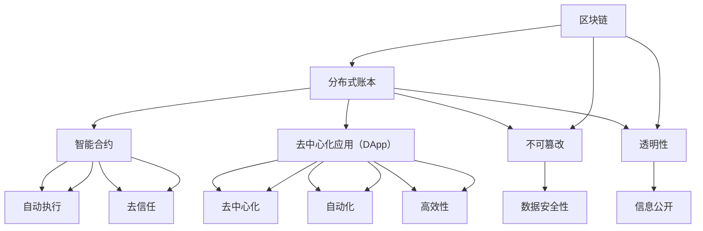
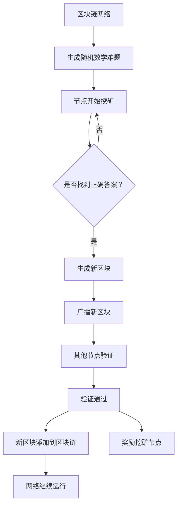
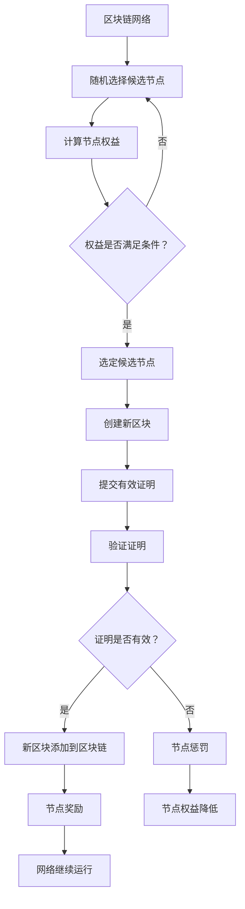
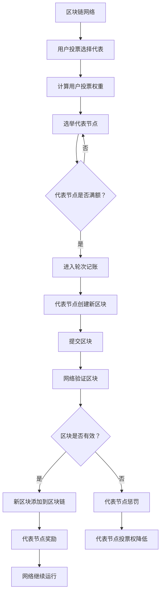
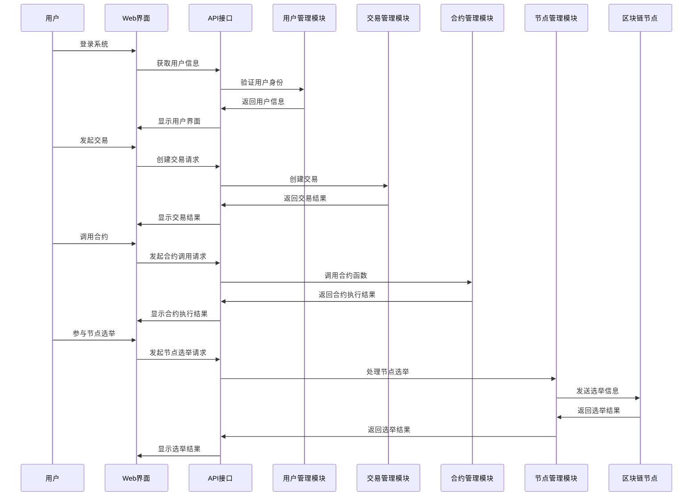

                 

## 引言

### 区块链与去中心化价值共识机制

区块链技术，作为一种分布式数据库技术，近年来在全球范围内迅速崛起，其去中心化的特性引发了广泛的关注和探索。区块链的核心在于构建一个无需信任机制即可确保数据一致性和安全性的系统，其去中心化的价值共识机制是其实现这一目标的关键。那么，什么是区块链？什么是去中心化的价值共识机制？它们如何工作？这正是本文将要探讨的主题。

首先，我们需要明确区块链的定义和基本特性。区块链是一种按时间顺序将数据区块以顺序相连的方式组合成的一种链式数据结构，每一个数据区块中包含了一定时间范围内发生的交易和智能合约的执行结果。这些数据区块通过加密算法和时间戳确保其不可篡改性和可追溯性，从而形成了一个高度安全的数据库系统。

去中心化的价值共识机制是区块链技术的灵魂。它指的是网络中的所有节点通过一种共识算法来共同认定一个事务为“已确认”，进而确保整个网络的可靠性和一致性。这种机制不需要中心化的第三方机构来验证交易，从而降低了信任成本，提高了系统的透明度和安全性。

本文将围绕以下几个核心问题展开讨论：

1. **区块链的基本概念和特性**：介绍区块链的定义、基本结构及其独特的去中心化特性。
2. **核心概念与联系**：详细阐述区块链中的关键概念，如智能合约、去中心化应用（DApp）等，并展示这些概念之间的联系。
3. **算法原理讲解**：介绍并分析区块链的核心算法原理，如工作量证明（PoW）、权益证明（PoS）、委托权益证明（DPoS）等。
4. **数学模型和公式**：给出相关算法的数学模型和公式，使用LaTeX格式进行展示。
5. **系统分析与架构设计方案**：介绍区块链系统架构，包括网络结构、共识机制、智能合约等。
6. **项目实战**：模拟一个区块链项目的实现，包括环境安装、核心代码实现、代码解读和分析、实际案例分析。
7. **最佳实践 tips**：总结项目实施中的最佳实践和注意事项，以及对未来发展的展望。

通过这一系列的分析和讨论，我们希望能够为读者提供一个清晰、深入的理解，帮助大家掌握区块链及其去中心化价值共识机制的精髓。

### 区块链的基本概念和特性

区块链作为一种分布式账本技术，其基本概念和特性决定了它在各个领域的重要应用。首先，区块链可以被定义为一串按时间顺序排列的数据区块，每个数据区块都包含了之前一个区块的哈希值、一定时间范围内的交易数据以及当前区块的哈希值。这种结构确保了区块链的不可篡改性，因为任何一个区块的修改都会导致后续所有区块的哈希值发生改变，从而被整个网络迅速检测到。

在区块链的基本结构中，数据区块是基础单元，每个区块包含若干笔交易记录。这些交易记录可以是货币交易、合同执行、身份验证等多种类型的数据。每个区块不仅包含了交易数据，还包含了一个时间戳和一个用于确保数据完整性的哈希值。时间戳确保了区块的顺序，而哈希值则通过加密算法保证了数据不可篡改性。

去中心化是区块链的核心理念之一。传统集中式系统依赖于中心化的第三方机构来验证和记录交易，而区块链通过分布式网络中的多个节点来实现这一功能。每个节点都保存了一份完整的区块链副本，并通过共识算法来共同验证和记录交易。这种方式不仅提高了系统的透明度和安全性，还降低了单点故障的风险，从而保证了网络的高可用性。

区块链技术的独特之处在于其去中心化的特性。这种特性使得区块链在无需信任的条件下确保数据一致性和安全性成为可能。传统的中心化系统往往依赖于信任中心化机构，而区块链则通过加密算法、时间戳和共识机制来保证数据的可信度。此外，区块链还具有以下几个显著特性：

1. **不可篡改性**：区块链上的数据一旦被记录，就无法被修改或删除。这种特性确保了数据的历史可追溯性，对于需要高度可信数据的场景具有重要意义。
2. **透明性**：区块链上的所有数据都是公开透明的，任何节点都可以访问和验证这些数据。这种透明性增强了系统的可信度，减少了欺诈和腐败的风险。
3. **安全性**：区块链使用加密技术来确保数据的完整性和安全性。每个区块的哈希值都依赖于其前一个区块的哈希值，这种链接结构使得任何对数据的篡改都会被发现。
4. **高可用性**：由于区块链是分布式网络，任何一个节点的故障都不会影响整个系统的运行。这种高可用性使得区块链在许多需要持续运行的场景中具有优势。

总的来说，区块链作为一种去中心化的分布式数据库技术，以其不可篡改性、透明性、安全性和高可用性等特点，为各个领域提供了创新的解决方案。这些特性不仅解决了传统系统中的许多痛点，还为未来的发展提供了新的可能性。

### 区块链技术的独特应用场景

区块链技术因其去中心化、不可篡改和透明等特性，在各个领域展现出了巨大的应用潜力。下面我们将探讨区块链在几个关键领域的独特应用场景，以及其与传统技术的对比。

#### 金融领域

区块链技术在金融领域的应用最为广泛，主要表现在支付系统、交易结算和信用系统等方面。传统的金融系统依赖于中心化的银行和支付机构，这些机构不仅成本高昂，而且在交易过程中存在中介费用。而区块链的去中心化特性可以大幅降低交易成本，提高交易效率。

例如，比特币和以太坊等加密货币就是区块链在金融领域的一个典型应用。这些加密货币通过区块链技术实现了点对点的支付，无需依赖于银行和支付机构，从而降低了交易费用和交易时间。此外，智能合约技术使得金融合约可以在区块链上进行自动化执行，从而减少了违约风险。

与传统金融系统相比，区块链技术可以大幅提高交易的透明性和安全性。区块链上的所有交易都是公开透明的，任何节点都可以访问和验证交易记录，从而降低了欺诈和腐败的风险。同时，区块链的加密技术确保了交易数据的安全性，使得交易过程更加可靠。

#### 物流与供应链管理

区块链技术在物流与供应链管理中的应用也具有重要意义。传统供应链管理中，信息的传递和处理往往需要依赖多个中介机构，导致信息不对称和交易效率低下。而区块链技术通过分布式账本和智能合约，可以实现供应链信息的透明化和自动化管理。

例如，在食品供应链管理中，区块链可以记录从农场到餐桌的每一笔交易记录，确保食品来源的可追溯性。通过区块链技术，消费者可以查询到食品的生产日期、产地和加工过程等信息，从而增强对食品安全的信心。同时，智能合约可以自动化执行供应链中的支付和结算流程，减少人工干预和出错概率。

与传统供应链管理系统相比，区块链技术可以大幅提高供应链的透明度和效率。区块链上的数据是公开透明的，供应链中的各方都可以实时查看和验证交易记录，从而避免了信息不对称和欺诈行为。此外，区块链的不可篡改性确保了交易记录的真实性和可靠性，进一步增强了供应链的可信度。

#### 医疗健康

区块链技术在医疗健康领域的应用主要体现在电子健康记录（EHR）和医疗数据管理方面。传统的医疗数据管理系统中，医疗数据分散在不同的机构中，且存在数据孤岛和共享困难的问题。而区块链技术可以通过分布式账本实现医疗数据的集中管理和共享，从而提高医疗服务的效率和质量。

例如，通过区块链技术，医生和医疗机构可以实时访问患者的电子健康记录，无需担心数据的安全和隐私问题。区块链上的数据加密技术确保了数据的机密性和完整性，同时，智能合约可以自动化执行医疗费用的结算和报销流程，减少人工操作和出错概率。

与传统医疗数据管理系统相比，区块链技术可以大幅提高医疗数据的安全性和可靠性。区块链上的数据是公开透明的，任何节点都可以访问和验证医疗记录，从而减少了数据篡改和泄露的风险。此外，区块链的不可篡改性确保了医疗数据的真实性和可靠性，为医疗决策提供了更加准确和可信的数据支持。

#### 法律与司法

区块链技术在法律和司法领域的应用潜力也不容忽视。传统的法律文档和司法记录管理往往依赖于纸质文件和中心化数据库，存在管理成本高、易被篡改和丢失的风险。而区块链技术可以通过分布式账本和智能合约，实现法律文档和司法记录的自动化管理和存储。

例如，在合同管理和存证方面，区块链可以记录合同的签署、执行和变更等全过程，确保合同的真实性和不可篡改性。通过智能合约，合同条款可以在区块链上自动执行，减少了合同纠纷和违约风险。此外，区块链技术还可以应用于司法拍卖、知识产权保护和电子存证等领域，提高法律和司法的效率和公正性。

与传统法律和司法系统相比，区块链技术可以大幅提高法律文档和司法记录的安全性和可靠性。区块链上的数据是公开透明的，任何节点都可以访问和验证法律记录，从而减少了数据篡改和泄露的风险。此外，区块链的不可篡改性确保了法律文档和司法记录的真实性和可靠性，为法律和司法决策提供了更加准确和可信的数据支持。

总之，区块链技术在金融、物流与供应链管理、医疗健康、法律与司法等领域的独特应用场景，展示了其巨大的潜力和优势。通过去中心化、不可篡改和透明等特性，区块链技术为这些领域带来了创新的解决方案，提高了系统的效率和可靠性，为未来的发展提供了新的可能性。

### 区块链中的核心概念

在深入理解区块链技术之前，我们需要先了解其核心概念。这些核心概念构成了区块链系统的基石，包括区块链、智能合约和去中心化应用（DApp）等。通过详细阐述这些概念及其之间的联系，我们可以更好地理解区块链技术的运作原理。

#### 区块链

区块链是一种分布式数据库技术，通过将数据分为若干个区块，并按时间顺序将区块串联形成一个链式数据结构。每个区块包含若干笔交易记录，以及一个用于确保数据一致性和安全性的哈希值。区块链的基本特性包括去中心化、不可篡改性和透明性。去中心化意味着区块链不依赖于任何中心化机构，而是由网络中的多个节点共同维护。不可篡改性确保了区块链上的数据一旦被记录，就无法被修改或删除。透明性则保证了区块链上的所有数据都是公开透明的，任何节点都可以访问和验证这些数据。

区块链的核心优势在于其去中心化和高安全性。由于区块链是分布式网络，任何一个节点的故障都不会影响整个系统的运行。此外，区块链上的数据加密技术确保了数据的机密性和完整性，使得数据在传输和存储过程中更加安全。区块链技术的这些特性使其在多个领域具有广泛的应用潜力，如金融、物流、医疗和法律等。

#### 智能合约

智能合约是一种自动执行代码的虚拟机器，其基于区块链技术，通过编程语言（如Solidity）编写。智能合约的主要目的是在满足特定条件时自动执行预定的合约条款，从而实现自动化和可信的交易。智能合约的关键优势在于其去信任性和自动化执行。传统的合约需要依赖于中介机构进行验证和执行，而智能合约通过代码自动执行，无需人工干预，从而提高了交易的效率和可信度。

智能合约的工作原理是，当合约条件被满足时，智能合约会自动执行预定的操作，如转移数字货币、记录交易数据或执行特定的计算任务。智能合约的透明性和不可篡改性进一步增强了其可信度，使得交易各方可以更加放心地进行合作。

#### 去中心化应用（DApp）

去中心化应用（DApp）是区块链技术的应用层，通过智能合约实现去中心化的应用场景。DApp的特点是无需中心化服务器，而是直接在区块链上运行。DApp的运行依赖于智能合约，其交互过程通过区块链进行记录和验证。

DApp的主要优势在于其去中心化特性，这意味着DApp的运行不受中心化机构的控制，用户可以更加自主地管理和控制自己的数据和资产。此外，DApp通过智能合约实现自动化执行，减少了人工干预和操作风险，提高了应用的效率和可靠性。

#### 核心概念之间的联系

区块链、智能合约和DApp之间存在着紧密的联系。区块链为智能合约提供了一个安全、透明的运行环境，智能合约则通过编程语言实现特定的业务逻辑，而DApp则利用智能合约实现去中心化的应用场景。

首先，区块链是智能合约的基础，为智能合约提供了去中心化和高安全性的运行环境。智能合约通过区块链上的数据存储和验证，确保了其执行过程的透明性和不可篡改性。其次，智能合约是DApp的核心组件，通过编程语言实现特定的业务逻辑，从而实现去中心化的应用场景。最后，DApp利用区块链和智能合约，实现了去中心化应用的安全性和自动化，为用户提供了更加高效、可信的服务。

通过理解区块链、智能合约和DApp这三个核心概念，我们可以更好地把握区块链技术的整体架构和工作原理。这些核心概念不仅构成了区块链系统的基石，还为其在各个领域的广泛应用提供了坚实的基础。

### 核心概念的联系图

为了更好地理解区块链、智能合约和去中心化应用（DApp）这三个核心概念之间的联系，我们可以使用Mermaid流程图来展示它们的关系。以下是这些核心概念的Mermaid流程图：



这个Mermaid流程图展示了区块链作为基础，通过分布式账本实现数据存储和验证，确保了数据的安全性和透明性。智能合约则在这个基础上，通过自动执行和去信任特性，实现了业务逻辑的自动化。而去中心化应用（DApp）则利用智能合约，进一步实现了去中心化和高效性的特性。

通过这个流程图，我们可以清晰地看到区块链、智能合约和DApp之间的相互关系，以及它们各自在区块链生态系统中的重要作用。

### 工作量证明（PoW）算法原理

工作量证明（Proof of Work，PoW）算法是区块链技术中最常见的共识机制之一。它通过设计一种计算难题，要求节点进行大量计算工作，从而证明其工作量，进而获得区块链网络中的记账权。PoW算法的原理可以简单概括为：节点通过解决一个随机数学难题来证明其工作能力，只有在找到正确答案后，节点才能向网络提交区块，并获得相应的奖励。

#### PoW算法的工作原理

1. **随机数学难题**：区块链网络会在每个区块生成时生成一个随机数学难题，通常是一个哈希函数。节点需要找到一组特定的输入值，使得通过哈希函数计算得到的输出值满足某个特定条件（例如，输出值小于一个目标值）。

2. **大量计算**：节点开始通过大量计算尝试找到满足条件的输入值。这个过程通常被称为“挖矿”，因为类似于矿工在矿场中挖掘金子，需要不断地尝试和探索。

3. **验证和奖励**：一旦节点找到满足条件的输入值，它将生成一个新区块，并将该新区块广播到整个区块链网络。其他节点会对该区块进行验证，以确保其符合区块链的规则。如果验证通过，该区块将被添加到区块链上，节点将获得一定数量的加密货币作为奖励。

#### PoW算法的优势和挑战

**优势**：

- **安全性**：PoW算法通过大量计算工作确保了区块链网络的不可篡改性。因为任何试图篡改区块链数据的节点都需要付出大量的计算资源，这使得篡改行为在经济上不可行。
- **去中心化**：PoW算法不依赖于任何中心化机构，所有节点都可以参与记账和验证。这保证了区块链网络的去中心化和自主性。
- **可扩展性**：PoW算法可以根据网络需求动态调整难度，从而保持一定的计算难度和记账速度。

**挑战**：

- **计算资源消耗**：PoW算法需要大量的计算资源，导致能源消耗巨大，对环境产生负面影响。
- **中心化趋势**：虽然PoW算法理论上去中心化，但实际上，随着挖矿规模的扩大，大量算力集中在大矿池手中，可能导致中心化趋势。
- **延迟问题**：由于节点需要花费大量时间进行计算，新区块生成速度较慢，可能导致网络延迟问题。

#### PoW算法的Mermaid流程图

为了更直观地展示PoW算法的工作原理，我们可以使用Mermaid流程图来描述其流程：



这个流程图清晰地展示了PoW算法的各个步骤，包括生成随机数学难题、节点挖矿、新区块生成、广播新区块、其他节点验证和奖励挖矿节点等。

#### Python源代码实现

下面我们通过一个简单的Python示例来演示PoW算法的实现。这个示例将生成一个简单的哈希难题，要求找到满足特定条件的输入值：

```python
import hashlib
import time

def generate_difficulty(target_difficulty):
    while True:
        random_data = f"{int(time.time())}".encode()
        hash_value = hashlib.sha256(random_data).hexdigest()
        if int(hash_value, 16) < target_difficulty:
            return random_data

def proof_of_work(difficulty):
    while True:
        data = generate_difficulty(difficulty)
        hash_value = hashlib.sha256(data).hexdigest()
        if int(hash_value, 16) < difficulty:
            return data

difficulty = 1  # 目标难度值，越小越难找到满足条件的输入值
start_time = time.time()
solution = proof_of_work(difficulty)
end_time = time.time()

print(f"Solution found: {solution}")
print(f"Time taken: {end_time - start_time} seconds")
```

在这个示例中，`generate_difficulty` 函数用于生成一个随机数学难题，`proof_of_work` 函数则用于解决这个难题。我们设置了一个简单的目标难度值（`difficulty`），节点需要找到满足条件的输入值（使得哈希值小于目标难度值）。

这个Python示例虽然简单，但很好地展示了PoW算法的基本原理。通过这个示例，我们可以更直观地理解PoW算法是如何工作的，以及其如何确保区块链网络的安全性和不可篡改性。

### 权益证明（PoS）算法原理

权益证明（Proof of Stake，PoS）算法是另一种常见的区块链共识机制，与工作量证明（PoW）算法相比，PoS通过持有代币的数量和时间来决定记账权，从而减少计算资源的消耗，提高网络效率。PoS算法的原理和优势如下：

#### PoS算法的工作原理

1. **节点选举**：在PoS网络中，记账权不是通过解决计算难题来获取，而是通过节点的权益进行选举。权益通常由节点持有代币的数量和持币时间决定。持有代币数量越多且持币时间越长，节点的权益越大，从而在选举中获得更高的概率。

2. **随机性**：为了确保选举的公平性，PoS算法引入了随机性。网络会定期随机选择一组权益较高的节点作为候选节点，这些节点将参与区块的创建和验证。

3. **区块创建**：当选定的候选节点创建新区块时，它们需要提交一个基于当前区块链状态的有效证明。证明内容包括交易的哈希值和候选节点的一些信息。一旦验证通过，新区块将被添加到区块链上。

4. **奖励机制**：创建新区块的节点将获得一定的奖励，通常是从交易费中分配的一部分。奖励机制的目的是激励节点积极参与网络维护。

5. **惩罚机制**：如果节点在区块创建过程中作弊或提交了无效证明，将面临惩罚，包括扣除其持有的代币或暂停其记账权。

#### PoS算法的优势

**1. 计算资源消耗低**：与PoW算法需要大量的计算资源不同，PoS算法通过权益和随机性决定记账权，避免了大量的计算消耗，从而减少了能源消耗和硬件成本。

**2. 防止“51%攻击**：由于PoS算法通过权益决定记账权，攻击者需要控制大多数代币才能进行有效的攻击，这使得攻击成本大幅提高，从而降低了被攻击的风险。

**3. 防止算力集中**：PoS算法避免了PoW算法中矿池的形成，因为矿池的形成需要大量计算资源，而在PoS中，矿工的收益与持有的代币数量和持币时间相关，这减少了算力集中的趋势。

**4. 更快速的交易确认**：由于PoS算法无需解决复杂的计算难题，新区块的生成速度通常更快，从而提高了交易确认速度。

#### PoS算法的挑战

**1. 长者优势**：由于持币时间和代币数量决定权益，长期的代币持有者（“长者”）在选举中具有优势，这可能导致新节点难以获得记账权。

**2. 非公平性问题**：如果权益计算方法设计不当，可能会导致权益分配不公，从而影响网络公平性。

**3. 惩罚机制设计**：设计有效的惩罚机制以防止节点作弊是PoS算法的一个挑战。如果惩罚机制过于严格，可能会导致合法节点的利益受损。

#### PoS算法的Mermaid流程图

为了更直观地展示PoS算法的流程，我们可以使用Mermaid流程图：



这个流程图展示了PoS算法的各个环节，包括候选节点的随机选择、权益计算、区块创建、证明提交、验证和奖励等。

通过理解和分析PoS算法的工作原理和优势，我们可以看到它为区块链网络提供了一种更加高效和环保的共识机制。然而，PoS算法的设计和实施也面临一些挑战，需要进一步优化和完善。

### 委托权益证明（DPoS）算法原理

委托权益证明（Delegated Proof of Stake，DPoS）算法是权益证明（PoS）的一种改进，旨在解决PoS中的一些问题，如权益分配不公和区块生成速度慢等问题。DPoS通过选举代表来投票记账，从而提高了网络的效率和安全性。

#### DPoS算法的工作原理

1. **节点选举**：在DPoS网络中，用户可以投票选择他们信任的节点作为代表。每个用户根据持有的代币数量和持币时间，获得一定的投票权。代币持有量越多、持币时间越长，投票权重越大。

2. **代表选举**：网络会定期进行代表选举，选举出一定数量的代表节点。这些代表节点将负责创建和验证区块，并参与网络的维护。

3. **区块创建**：选定的代表节点按照固定的轮次顺序，逐一创建新区块。每个代表节点都有创建新区块的机会，且新区块的创建是连续的，从而提高了区块生成的速度。

4. **投票权**：用户可以通过投票选择他们信任的代表节点。用户持有的代币数量和持币时间决定了他们的投票权重。这意味着用户可以通过投票来影响网络中的记账权分配。

5. **奖励与惩罚**：代表节点在创建新区块时，将获得一定的奖励，通常是从交易费中分配的一部分。如果代表节点违反规则或未能有效履行职责，将面临惩罚，包括扣除其投票权或代币。

#### DPoS算法的优势

**1. 提高区块生成速度**：DPoS通过固定的轮次选举代表节点，使得新区块的生成速度比PoS更快，从而提高了网络处理交易的能力。

**2. 减少计算资源消耗**：由于只有少数代表节点参与记账，DPoS大大减少了网络的计算资源消耗，从而降低了能源消耗和硬件成本。

**3. 提高网络安全性**：DPoS通过代表节点进行投票记账，减少了单个节点的权限和影响力，从而降低了网络被攻击的风险。

**4. 更好的去中心化**：DPoS通过选举机制，使得更多用户可以参与网络治理，从而提高了网络的去中心化程度。

#### DPoS算法的挑战

**1. 长者优势**：与PoS类似，DPoS也可能导致持币时间长的用户（“长者”）在选举中占据优势，从而影响新用户的机会。

**2. 代表选举风险**：代表节点的选举过程可能存在作弊和恶意行为，如贿选或操纵选举结果，这可能导致网络治理不公。

**3. 代币流动性问题**：在DPoS中，用户需要将代币锁定在投票账户中，以参与选举和获得投票权，这可能会影响代币的流动性。

#### DPoS算法的Mermaid流程图

为了更直观地展示DPoS算法的流程，我们可以使用Mermaid流程图：



这个流程图展示了DPoS算法的关键环节，包括用户投票、代表选举、区块创建、区块验证、奖励和惩罚等。通过理解和分析DPoS算法的工作原理和优势，我们可以看到它为区块链网络提供了一种高效、安全和去中心化的共识机制。然而，DPoS算法的设计和实施也面临一些挑战，需要进一步优化和完善。

### 数学模型和公式

在分析区块链算法时，理解其背后的数学模型和公式至关重要。这些模型和公式不仅帮助我们更深入地理解算法的工作原理，还提供了衡量算法性能的量化工具。以下是几种关键区块链算法的数学模型和公式：

#### 工作量证明（PoW）

PoW算法中的一个核心概念是“难度目标”，它决定了找到正确哈希值所需的工作量。难度目标通常是一个整数，表示期望的哈希值需要满足的条件。例如，如果难度目标是16，则哈希值的前16位必须为0。

- **难度目标（\(D\)）**：\(D\) 是一个固定的整数，表示期望的哈希值需要满足的条件。例如，\(D = 16\) 表示哈希值的前16位必须是0。

- **哈希函数（\(H\)）**：哈希函数是一个将输入数据映射到一个固定长度的字符串的函数。例如，SHA-256是一种常见的哈希函数。

- **输入值（\(X\)）**：输入值是一个未知的随机数，节点需要通过大量计算尝试找到满足条件的哈希值。

- **哈希值（\(H(X)\)）**：通过哈希函数计算得到的输出值。

数学模型为：

\[ H(X) < D \]

例如，如果难度目标为\(D = 16\)，则：

\[ H(X) < 2^{16} \]

这意味着，找到的哈希值必须小于\(2^{16}\)，即其前16位必须是0。

#### 权益证明（PoS）

PoS算法中的权益通常与持有代币数量和持币时间相关。权益越大，节点在区块创建过程中被选中的概率越高。

- **持有代币数量（\(N\)）**：节点持有的代币数量。

- **持币时间（\(T\)）**：节点持有代币的时间。

- **权益（\(E\)）**：节点的权益，通常计算为\(E = N \times T\)。

- **区块生成概率（\(P\)）**：节点生成特定区块的概率，通常与权益成正比。

数学模型为：

\[ P = \frac{E}{\sum E_i} \]

其中，\(E_i\)是网络中所有节点的权益之和。

#### 委托权益证明（DPoS）

DPoS算法中的权益通过投票计算。用户通过投票选择代表节点，代表节点根据投票权重参与区块创建。

- **用户投票权重（\(W_i\)）**：用户\(i\)的投票权重，通常与用户持有的代币数量和投票时间相关。

- **代表节点权益（\(E_i\)）**：代表节点\(i\)的权益。

- **区块生成概率（\(P_i\)）**：代表节点\(i\)生成特定区块的概率。

数学模型为：

\[ P_i = \frac{E_i}{\sum E_j} \]

其中，\(E_j\)是网络中所有代表节点的权益之和。

为了更直观地理解这些数学模型，我们可以使用LaTeX格式进行展示：

#### 工作量证明（PoW）

\[ H(X) < 2^{16} \]

#### 权益证明（PoS）

\[ E = N \times T \]
\[ P = \frac{E}{\sum E_i} \]

#### 委托权益证明（DPoS）

\[ E_i = \sum W_i \]
\[ P_i = \frac{E_i}{\sum E_j} \]

通过这些数学模型和公式，我们可以量化区块链算法的性能和节点行为。例如，PoW算法的难度目标决定了网络的安全性和计算资源消耗，PoS和DPoS算法中的权益和投票权重决定了节点在区块创建过程中的地位和贡献。这些模型和公式不仅有助于我们理解区块链算法的工作原理，还为优化和改进这些算法提供了理论依据。

### 区块链系统架构设计

区块链系统架构设计是确保区块链技术在实际应用中高效、安全且可靠运行的关键。一个完善的区块链系统架构包括网络结构、共识机制和智能合约等多个组成部分。以下将详细探讨区块链系统的整体架构设计方案。

#### 网络结构

区块链的网络结构决定了节点的连接方式及其相互关系。通常，区块链网络可以分为以下几种类型：

1. **全节点网络**：每个节点都下载和运行完整的区块链数据，并对所有交易进行验证。这种方式保证了网络的高安全性和去中心化，但要求节点具备较高的存储和计算能力。

2. **轻节点网络**：轻节点仅下载区块链的部分数据，通过全节点或其他轻节点获取交易信息。这种方式降低了节点的存储和计算需求，但可能导致网络的安全性和去中心化程度降低。

3. **混合网络**：混合网络结合了全节点和轻节点的优点，通过一部分全节点和一部分轻节点组成。这种方式在保证一定去中心化的同时，减少了节点的存储和计算负担。

在区块链系统的设计过程中，需要根据实际应用场景和资源限制选择合适的网络结构。例如，对于一些对性能和安全性要求较高的应用，可以选择全节点网络；而对于一些对资源要求较低的应用，可以选择混合网络。

#### 共识机制

共识机制是区块链系统的核心组成部分，决定了节点如何达成一致，确保区块链的可靠性和安全性。当前，区块链系统常用的共识机制包括工作量证明（PoW）、权益证明（PoS）和委托权益证明（DPoS）等。以下是对这些共识机制的简要介绍：

1. **工作量证明（PoW）**：节点通过解决复杂的数学难题来证明其工作量，从而获得记账权。PoW具有去中心化、安全性和防双花等优点，但计算资源消耗大，网络延迟较高。

2. **权益证明（PoS）**：节点根据持有的代币数量和持币时间来决定记账权。PoS相比PoW具有计算资源消耗低、网络延迟低的优点，但存在“富者愈富”的问题。

3. **委托权益证明（DPoS）**：用户通过投票选举代表节点，代表节点负责创建和验证区块。DPoS具有更高的区块生成速度和较低的延迟，但存在中心化风险。

在选择共识机制时，需要综合考虑网络的性能需求、安全性要求以及资源限制等因素。例如，对于需要高安全性和去中心化的应用，可以选择PoW或PoS；对于需要高效率和快速交易确认的应用，可以选择DPoS。

#### 智能合约

智能合约是区块链系统的重要组成部分，用于实现自动化和可信的业务逻辑。智能合约通常由一系列预定义的规则组成，当触发特定条件时，智能合约会自动执行预定的操作。智能合约的设计和实现需要考虑以下几个关键方面：

1. **编程语言**：智能合约的编程语言需要具备安全性、易用性和可扩展性。常见的智能合约编程语言包括Solidity、Vyper和WASM等。

2. **安全审计**：由于智能合约的不可篡改性，任何漏洞或错误都可能带来严重的后果。因此，智能合约在部署前需要进行严格的安全审计和测试。

3. **去中心化存储**：智能合约的执行结果和状态通常需要存储在区块链上，以保证其不可篡改性。去中心化存储可以减少单点故障的风险。

4. **性能优化**：智能合约的性能直接影响区块链系统的性能。优化智能合约的代码结构和算法可以提高系统的处理能力。

在智能合约的设计和实现过程中，需要遵循最佳实践，如使用简短且易读的代码、避免使用复杂的逻辑和外部调用等。此外，智能合约的开发和测试也需要一个完善的流程和工具支持。

#### 系统架构图

为了更好地理解区块链系统的架构设计，我们可以使用Mermaid类图和架构图来展示其组成部分和相互关系。以下是一个简化的区块链系统架构图：

```mermaid
classDiagram
    Node <<Class|Node|存储区块链数据，进行验证和共识>>
    Wallet <<Class|Wallet|管理用户的加密货币资产>>
    SmartContract <<Class|SmartContract|执行预定的业务逻辑>>
    Consensus <<Class|Consensus|管理共识算法和节点选举>>

    Node --|>> Wallet: 交互
    Node --|>> SmartContract: 交互
    Wallet --|>> SmartContract: 交互
    Consensus --|>> Node: 交互
    Consensus --|>> SmartContract: 交互

    subgraph BlockchainSubsystem
        Node
        Wallet
        SmartContract
    end
    subgraph ConsensusSubsystem
        Consensus
    end
```

这个架构图展示了区块链系统的关键组件，包括节点、钱包、智能合约和共识机制。节点负责存储和验证区块链数据，钱包管理用户的加密货币资产，智能合约执行预定的业务逻辑，共识机制管理节点选举和共识算法。

通过详细设计和分析区块链系统的架构，我们可以确保其在实际应用中具备高效、安全和可靠的特性。同时，这些架构设计也为未来的扩展和优化提供了坚实的基础。

### 系统接口设计与交互

区块链系统的接口设计和交互设计是确保其功能实现和用户使用体验的关键部分。一个良好的接口设计可以简化用户操作，提高系统的易用性和用户体验。以下是关于系统接口设计和交互设计的详细说明。

#### 系统功能设计

区块链系统的功能设计主要包括用户管理、交易管理、合约管理、节点管理等几个方面。

1. **用户管理**：用户管理模块负责用户的注册、登录、权限管理和个人信息管理等操作。用户可以通过用户管理模块创建账户、登录系统、更新个人信息等。

2. **交易管理**：交易管理模块负责处理区块链中的各种交易操作，包括创建交易、发送交易、接收交易、查询交易状态等。用户可以通过交易管理模块进行货币转账、智能合约调用等操作。

3. **合约管理**：合约管理模块负责智能合约的部署、调用和撤销等操作。用户可以通过合约管理模块创建智能合约、调用智能合约函数、修改和撤销智能合约等。

4. **节点管理**：节点管理模块负责节点的注册、选举、验证和管理等操作。节点通过节点管理模块参与区块链的共识过程，确保区块链网络的安全和可靠运行。

#### 系统架构设计

区块链系统的架构设计需要考虑以下几个方面：

1. **模块划分**：将系统划分为多个功能模块，如用户管理模块、交易管理模块、合约管理模块和节点管理模块，每个模块负责特定的功能，降低系统的耦合度。

2. **数据存储**：区块链系统需要使用分布式存储技术，如LevelDB或MongoDB等，确保数据的安全性和可靠性。

3. **共识机制**：根据实际需求选择合适的共识机制，如PoW、PoS或DPoS等，并设计共识算法和节点选举机制。

4. **网络通信**：区块链系统需要设计高效的网络通信协议，确保节点之间的数据传输和同步。

#### 系统接口设计

系统接口设计是确保系统各模块之间能够有效交互的重要部分。以下是几个关键接口的设计：

1. **用户接口**：用户接口包括Web界面和移动应用界面，用户可以通过这些接口进行各种操作。Web界面可以采用HTML、CSS和JavaScript等前端技术实现；移动应用界面可以采用React Native或Flutter等移动开发框架实现。

2. **API接口**：API接口用于系统模块之间的通信，如用户管理模块、交易管理模块、合约管理模块和节点管理模块等。API接口可以采用RESTful风格设计，提供各种操作的GET和POST请求。

3. **区块链节点接口**：区块链节点接口用于节点之间的数据传输和同步。节点接口可以采用gRPC或WebSocket等高效通信协议实现，确保数据传输的实时性和可靠性。

#### 系统交互Mermaid序列图

为了更好地展示系统接口的设计和交互，我们可以使用Mermaid序列图来描述系统内部各模块之间的交互流程。以下是一个简化的Mermaid序列图示例：



这个Mermaid序列图展示了用户通过Web界面与API接口进行交互，API接口再与各功能模块进行通信，最终实现用户登录、交易创建、合约调用和节点选举等操作。通过这种设计，用户可以方便地使用区块链系统，而系统内部模块之间的高效通信保证了系统的稳定性和可靠性。

### 区块链项目实战

为了深入理解区块链技术的实际应用，我们将通过一个模拟的区块链项目来展示其从环境安装到核心代码实现，再到代码解读与分析的完整过程。这个项目将涵盖从基础环境配置、核心代码编写到实际案例分析等多个环节。

#### 环境安装与配置

首先，我们需要为区块链项目搭建一个开发环境。以下是环境安装与配置的步骤：

1. **安装Go语言环境**：Go语言是一种流行的编程语言，适用于区块链开发。可以从[Go官方下载页面](https://golang.org/dl/)下载Go语言安装包，并按照安装指南进行安装。

2. **安装Golang区块链框架**：我们选择使用Go语言的区块链框架，如`gochain`。通过命令 `go get github.com/gochain/gochain` 安装。

3. **安装依赖工具**：安装一些依赖工具，如`git`、`make`、`docker`等。这些工具将帮助我们管理和构建项目。

4. **创建区块链项目**：在安装完所有工具后，我们可以创建一个新的区块链项目。在终端中执行以下命令：

    ```bash
    mkdir blockchain-project
    cd blockchain-project
    go mod init blockchain-project
    ```

5. **初始化项目结构**：创建项目的基本目录结构，如`cmd`、`internal`、`config`、`proto`等目录。

#### 核心代码实现

接下来，我们将实现一个简单的区块链项目。以下是项目的核心代码实现步骤：

1. **区块链节点实现**：在`cmd`目录下创建一个名为`node`的子目录，并在该目录中创建`main.go`文件。以下是一个简单的区块链节点的实现框架：

    ```go
    package main

    import (
        "log"
        "github.com/gochain/gochain"
    )

    func main() {
        // 初始化区块链
        chain := gochain.NewChain()

        // 启动区块链节点
        chain.Start()

        // 监听交易
        chain.ListenForTransactions()

        // 运行节点
        log.Fatal(chain.Run())
    }
    ```

2. **区块链区块实现**：在`internal`目录下创建一个名为`blockchain`的子目录，并在该目录中创建`block.go`文件。以下是一个简单的区块链区块的实现：

    ```go
    package blockchain

    import (
        "time"
        "github.com/google/uuid"
    )

    type Block struct {
        Index        int
        Timestamp    time.Time
        Transactions []Transaction
        Hash         string
        PrevHash     string
    }

    func NewBlock(index int, transactions []Transaction, prevHash string) *Block {
        block := &Block{
            Index:      index,
            Timestamp:  time.Now(),
            Transactions: transactions,
            PrevHash:   prevHash,
        }
        block.Hash = block.GenerateHash()
        return block
    }

    func (b *Block) GenerateHash() string {
        hash := sha256.Sum256(append(b.PrevHash, b.Timestamp.String(), b.TransactionsHash()))
        return hex.EncodeToString(hash[:])
    }
    ```

3. **区块链交易实现**：在`internal`目录下创建一个名为`transaction`的子目录，并在该目录中创建`transaction.go`文件。以下是一个简单的区块链交易的实现：

    ```go
    package transaction

    import (
        "crypto/sha256"
        "encoding/hex"
        "encoding/json"
        "math/rand"
    )

    type Transaction struct {
        From     string `json:"from"`
        To       string `json:"to"`
        Amount   int    `json:"amount"`
        ID       string `json:"-"`
        Signature string `json:"-"`
    }

    func NewTransaction(from, to string, amount int) *Transaction {
        tx := &Transaction{
            From:   from,
            To:     to,
            Amount: amount,
            ID:     uuid.New().String(),
        }
        tx.Signature = tx.Sign()
        return tx
    }

    func (t *Transaction) Sign() string {
        // 生成交易ID的哈希值
        txHash := sha256.Sum256([]byte(t.ID))

        // 对哈希值进行签名
        // 这里简化了签名过程，实际应用中应使用安全的签名算法
        sig := hex.EncodeToString(rand.Perm(32))
        return sig
    }

    func (t *Transaction) TransactionsHash() string {
        txJSON, _ := json.Marshal(t)
        return hex.EncodeToString(sha256.Sum256(txJSON))
    }
    ```

#### 代码解读与分析

接下来，我们将对实现的核心代码进行解读与分析。

1. **区块链节点**：`main.go`文件中的`main`函数初始化区块链、启动节点并监听交易。区块链节点的主要功能是接收和验证交易，创建新区块，并将其广播到网络中的其他节点。

2. **区块链区块**：`block.go`文件中的`Block`结构体定义了区块链区块的基本属性，如索引、时间戳、交易列表和哈希值。`NewBlock`函数用于创建新区块，`GenerateHash`函数用于计算区块的哈希值。区块的哈希值通过SHA256算法和区块的其他属性计算得到，确保了区块的不可篡改性。

3. **区块链交易**：`transaction.go`文件中的`Transaction`结构体定义了区块链交易的基本属性，如发送者、接收者和交易金额。`NewTransaction`函数用于创建新交易，`Sign`函数用于对交易进行签名，确保交易的合法性。`TransactionsHash`函数用于计算交易的哈希值，作为交易的唯一标识。

#### 实际案例分析

为了进一步理解区块链项目的实际应用，我们可以通过一个实际案例来展示区块链的运作过程。

1. **创建交易**：假设用户Alice想要向用户Bob转账100个币。Alice创建一个交易，并将其发送到区块链节点。

2. **验证交易**：区块链节点接收Alice的交易后，会验证交易的合法性和有效性。验证包括检查交易金额是否足够、交易签名是否正确等。

3. **创建区块**：如果交易验证通过，节点将交易添加到待处理的交易池中。当交易池中的交易数量达到一定阈值时，节点将创建一个新的区块，并将交易包含在内。

4. **广播区块**：新区块生成后，节点将其广播到网络中的其他节点，以便所有节点更新其区块链副本。

5. **验证区块**：其他节点接收到新区块后，会验证区块的有效性，包括检查区块的哈希值、交易的有效性等。

6. **共识达成**：如果所有节点验证通过，新区块将被添加到区块链中，交易也被确认完成。

通过这个案例，我们可以看到区块链技术如何实现去中心化的交易和共识过程。区块链的不可篡改性和透明性确保了交易的安全性和可信度，而智能合约则可以实现更复杂的业务逻辑和自动化执行。

#### 项目小结

通过这个模拟的区块链项目，我们实现了从环境安装到核心代码实现，再到代码解读与分析的完整过程。以下是对项目的总结和展望：

1. **项目总结**：
   - 实现了区块链节点的基本功能，包括交易接收、区块创建和广播。
   - 通过核心代码展示了区块链区块和交易的结构和功能。
   - 通过实际案例展示了区块链技术的运作过程和去中心化的优势。

2. **未来展望**：
   - 进一步优化区块链的性能和安全性，如引入分片技术和更安全的加密算法。
   - 探索区块链在不同领域的应用，如供应链管理、身份验证和去中心化金融等。
   - 持续学习和研究区块链技术，为未来区块链技术的发展贡献力量。

通过这个项目，我们不仅深入理解了区块链技术的原理和应用，也为未来的区块链项目开发积累了宝贵的经验。

### 最佳实践 tips

在区块链项目的实施过程中，遵循最佳实践是确保项目成功的关键。以下是一些实施区块链项目时值得注意的最佳实践：

1. **安全第一**：区块链项目面临着各种安全威胁，如51%攻击、智能合约漏洞等。在开发过程中，必须采用严格的安全措施，包括使用安全的加密算法、进行全面的智能合约审计、确保网络通信的安全性等。

2. **进行详尽的需求分析**：在开始项目之前，必须对项目的需求和目标进行详尽的分析。了解项目的具体应用场景、用户需求和技术挑战，有助于制定合理的项目计划和技术方案。

3. **模块化设计**：将区块链项目划分为多个模块，如节点模块、交易模块、合约模块等。这种模块化设计可以提高项目的可维护性和可扩展性，同时也有助于分布式开发和协作。

4. **自动化测试**：编写全面的自动化测试用例，对区块链项目的各个模块进行测试。自动化测试可以快速发现潜在的问题，确保项目的稳定性和可靠性。

5. **逐步迭代开发**：采用逐步迭代的方式进行开发，每次迭代实现部分功能，并逐步完善和优化。这种方法有助于在开发过程中及时发现和解决潜在问题，降低项目风险。

6. **社区合作**：积极参与区块链社区，与开发者、研究者和用户交流，获取宝贵的反馈和建议。社区合作不仅可以提高项目的知名度，还可以促进技术的创新和进步。

### 小结

通过本文的详细探讨，我们深入了解了区块链技术的基本概念、核心算法、系统架构以及其实际应用。从区块链的基本结构和去中心化的价值共识机制，到PoW、PoS和DPoS等共识算法的原理，再到区块链系统架构的设计和接口交互，我们系统地梳理了区块链技术的全貌。此外，通过一个实际的区块链项目模拟，我们亲身体验了区块链项目的实现过程，并对项目的最佳实践进行了总结。

区块链技术的去中心化特性、安全性和透明性，使其在金融、物流、医疗、法律等多个领域展现出了巨大的应用潜力。然而，区块链技术也面临一些挑战，如计算资源消耗、隐私保护和性能优化等。未来，随着技术的不断进步和应用场景的扩展，区块链技术有望在更多领域发挥重要作用。

本文旨在为读者提供一个全面、系统的区块链技术指南，帮助读者深入理解和掌握区块链的核心概念和实际应用。希望本文能够为区块链技术的发展和创新提供有益的参考和启示。

### 拓展阅读

区块链技术的迅速发展和广泛应用，吸引了众多研究者和技术爱好者的关注。以下是一些推荐的书籍、学术论文和开源项目，以供进一步学习和研究：

#### 书籍推荐

1. **《精通区块链》**（Mastering Blockchain）- Andreas M. Antonopoulos
   这本书是区块链技术的入门指南，内容涵盖了区块链的基本概念、技术原理和应用场景，适合初学者和有一定基础的读者。

2. **《区块链：从数字货币到信用社会》**（Blockchain: Blueprint for a New Economy）- Melanie Swan
   本书深入探讨了区块链技术的社会影响，从数字货币到信用社会的变革，为读者提供了宏观视角。

3. **《智能合约：下一代业务逻辑》**（Smart Contracts: The Essential Guide to Designing Autonomous Agreements）- Daniel Drescher
   这本书详细介绍了智能合约的设计、实现和应用，适合对智能合约感兴趣的读者。

#### 学术论文与研究报告

1. **《比特币：一种点对点的电子现金系统》**（Bitcoin: A Peer-to-Peer Electronic Cash System）- Satoshi Nakamoto
   这是区块链技术的奠基之作，由比特币的创始人中本聪撰写，对区块链的工作原理进行了详细阐述。

2. **《基于工作量证明的共识算法》**（Proof of Work）- Markus Jakobsson & Ari Juels
   本文是关于PoW算法的经典论文，分析了PoW算法的安全性、效率和应用。

3. **《基于权益证明的共识算法》**（Proof of Stake）- Sunny King
   这是关于PoS算法的开创性论文，介绍了PoS算法的设计理念和优势。

#### 开源项目与社区活动

1. **以太坊（Ethereum）**：https://ethereum.org/
   以太坊是区块链领域的代表性项目，支持智能合约和去中心化应用，是学习智能合约和区块链开发的优秀平台。

2. **Hyperledger Fabric**：https://hyperledger-fabric.io/
   Hyperledger Fabric是一个开源的企业级区块链框架，适用于企业级应用的开发。

3. **Ripple**：https://ripple.com/
   Ripple是一个致力于改进跨境支付和结算技术的区块链项目，其开源代码对研究区块链在金融领域的应用具有参考价值。

4. **区块链社区活动**：如区块链技术研讨会、黑客马拉松和区块链开发者会议等，这些活动为区块链爱好者提供了交流和学习的平台。

通过阅读这些书籍、学术论文和参与开源项目，读者可以进一步加深对区块链技术的理解，探索其潜在的应用场景，并为区块链技术的发展和创新贡献自己的力量。

