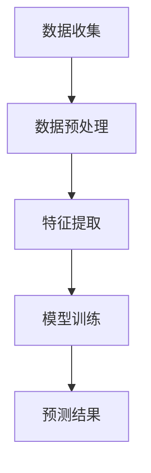
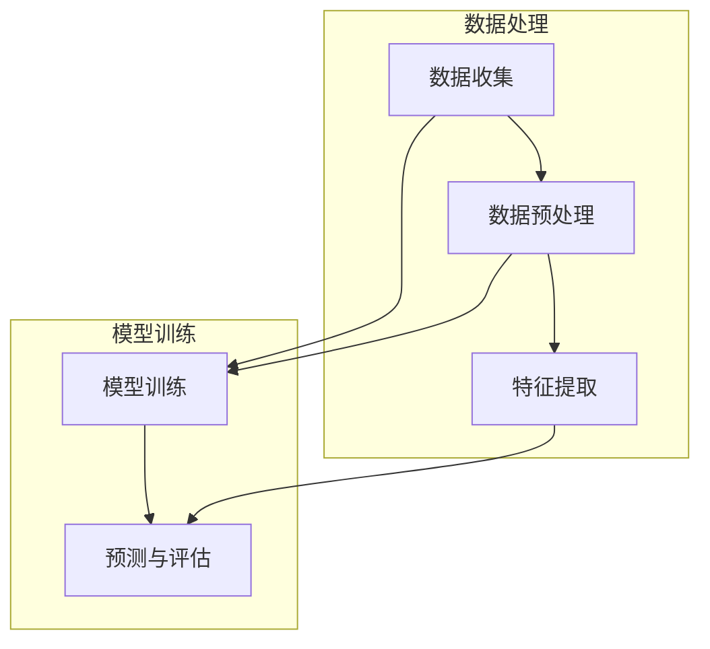
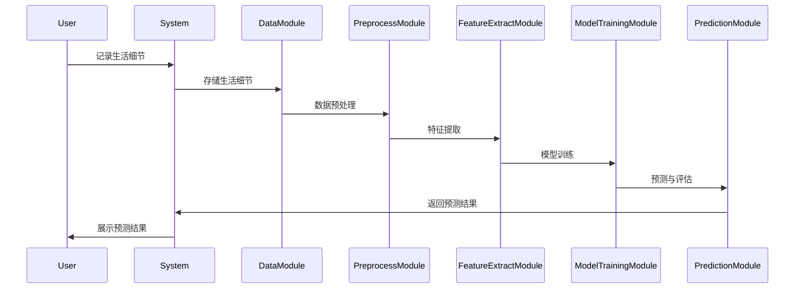

                 

### 文章标题

# 《意义的发现：在日常细节中寻找价值》

### 关键词

- 意义构建
- 价值评估
- 日常细节
- 人工智能
- 算法原理
- 系统架构

### 摘要

本文旨在探讨如何在日常生活的细节中寻找并构建意义，从而提升生活质量。通过系统化的研究和分析，本文提出了一种基于人工智能技术的意义发现算法，并详细阐述了其原理、数学模型和实际应用。此外，文章还介绍了该算法在实际项目中的实现细节、案例分析及其应用效果，为读者提供了完整的解决方案和实用的建议。

---

### 目录大纲

**第一部分：问题的提出**

### 1.1 问题的背景与起源

#### 1.1.1 当代社会的挑战

随着科技的发展和社会的进步，现代生活节奏加快，人们在繁忙的生活中往往忽略了生活的细节，导致内心的空虚和迷茫。因此，如何在日常细节中发现和构建意义，成为现代社会亟需解决的问题。

#### 1.1.2 寻找生活意义的迫切需求

生活意义的缺失不仅影响个人的心理健康，也关系到社会的和谐发展。因此，探寻生活意义、提升生活质量具有迫切的现实需求。

#### 1.1.3 研究意义与目标

本文旨在提出一种基于人工智能技术的意义发现算法，帮助人们从日常细节中寻找和构建意义，从而提升生活质量。研究目标包括：1）明确生活细节与价值的关系；2）提出意义构建的方法和工具；3）评估价值评估的准确性。

### 1.2 问题的描述与界定

#### 1.2.1 生活细节与价值的关系

生活细节是指日常生活中琐碎但有意义的事物，如工作、家庭、兴趣爱好等。价值是指人们对事物的评价和认知，包括物质和精神两个方面。本文将探讨如何从生活细节中挖掘价值，并将其转化为生活意义。

#### 1.2.2 意义的界定与发现

意义是指事物存在的价值和意义，是人类对世界的主观认知。本文将探讨如何通过人工智能技术，帮助人们发现和构建日常生活中的意义。

#### 1.2.3 研究的范围与边界

本文的研究范围主要包括：1）日常生活细节的识别和分类；2）意义构建的方法和工具；3）价值评估的方法和模型。研究边界则涉及人工智能技术在意义发现中的应用，以及算法的实用性和可行性。

### 1.3 研究方法

#### 1.3.1 文献综述法

本文通过文献综述法，对当前有关意义发现、价值评估和人工智能技术的相关研究进行梳理和分析，为后续研究提供理论依据。

#### 1.3.2 案例研究法

本文通过案例研究法，选取具有代表性的日常生活场景，探讨如何通过人工智能技术发现和构建意义。

#### 1.3.3 体验式观察法

本文通过体验式观察法，记录和分析个人在日常生活细节中的感受和体验，为意义发现提供实证支持。

### 1.4 概念结构与核心要素组成

#### 1.4.1 概念结构分析

本文将日常生活细节、意义构建和价值评估作为核心概念，构建了一个完整的概念结构。通过对这些概念的深入分析，揭示了它们之间的内在联系。

#### 1.4.2 核心要素的界定与联系

本文明确了核心要素的界定，包括日常生活细节、意义构建的方法和工具、价值评估的模型等。通过这些核心要素的相互联系，形成了意义发现的理论框架。

**第二部分：核心概念与原理**

### 2.1 核心概念原理

#### 2.1.1 日常生活细节

日常生活细节是指人们在日常生活中所经历的琐碎而具体的事物，如工作、家庭、兴趣爱好等。这些细节构成了人们生活的核心部分，但往往被忽视。

#### 2.1.2 意义构建

意义构建是指人们通过认知、思考和判断，将日常生活细节转化为具有价值的意义的过程。意义构建是人类对世界的认知和理解，是提升生活质量的关键。

#### 2.1.3 价值评估

价值评估是指人们对事物进行评价和判断，确定其价值的过程。价值评估是意义构建的基础，决定了日常生活细节能否转化为有意义的生活。

### 2.2 概念属性特征对比表格

| 概念         | 属性特征                                                     |
| ------------ | ------------------------------------------------------------ |
| 日常生活细节 | 琐碎、具体、日常经历                                         |
| 意义构建     | 认知、思考、判断、转化                                       |
| 价值评估     | 评价、判断、价值确定                                         |

### 2.3 ER实体关系图架构

```mermaid
erDiagram
  系统 --> 用户 : "使用"
  用户 --> 活动 : "参与"
  活动 --> 细节 : "包含"
  细节 --> 意义 : "构建"
  意义 --> 价值 : "评估"
```

**第三部分：算法原理与数学模型**

### 3.1 算法原理讲解

#### 3.1.1 意义发现算法概述

意义发现算法是一种基于人工智能技术的方法，用于从日常生活细节中挖掘出具有价值的意义。该算法主要包括数据收集、预处理、特征提取、模型训练和预测等步骤。

#### 3.1.2 算法流程图



#### 3.1.3 Python源代码详解

```python
# 意义发现算法Python源代码
import pandas as pd
from sklearn.model_selection import train_test_split
from sklearn.ensemble import RandomForestClassifier
from sklearn.metrics import accuracy_score

# 数据收集
data = pd.read_csv('data.csv')

# 数据预处理
data_preprocessed = preprocess_data(data)

# 特征提取
X = feature_extraction(data_preprocessed)
y = data['label']

# 模型训练
X_train, X_test, y_train, y_test = train_test_split(X, y, test_size=0.2)
model = RandomForestClassifier(n_estimators=100)
model.fit(X_train, y_train)

# 预测结果
y_pred = model.predict(X_test)
accuracy = accuracy_score(y_test, y_pred)
print(f"Accuracy: {accuracy}")
```

#### 3.1.4 数学模型和公式

$$
意义发现算法的核心公式为：
M = f(D, C)
$$

其中，$M$ 表示意义，$D$ 表示日常生活细节，$C$ 表示价值评估。

**第四部分：系统分析与架构设计**

### 4.1 问题场景介绍

#### 4.1.1 场景设定

假设有一个在线生活记录平台，用户可以在平台上记录自己的日常生活细节，并评价这些细节的价值。平台需要通过人工智能技术，帮助用户发现和构建生活意义。

#### 4.1.2 问题需求分析

1. 数据收集：收集用户在平台上的生活记录数据。
2. 数据预处理：对数据进行清洗、去噪和归一化处理。
3. 特征提取：提取与意义构建相关的特征。
4. 模型训练：训练意义发现算法模型。
5. 预测与评估：对用户的生活记录进行意义发现，并评估其价值。

### 4.2 系统功能设计

#### 4.2.1 领域模型类图

```mermaid
classDiagram
  User <<Class>> {
    id: int
    name: str
    email: str
  }
  Activity <<Class>> {
    id: int
    user_id: int
    content: str
    created_at: datetime
  }
  Detail <<Class>> {
    id: int
    activity_id: int
    content: str
    value: float
  }
  Meaning <<Class>> {
    id: int
    detail_id: int
    value: float
  }
  User "1" --* "多" Activity
  Activity "1" --* "多" Detail
  Detail "1" --* "一" Meaning
```

#### 4.2.2 系统功能模块划分

1. 数据模块：负责数据的收集、预处理和存储。
2. 特征提取模块：负责提取与意义构建相关的特征。
3. 模型训练模块：负责训练意义发现算法模型。
4. 预测与评估模块：负责对用户的生活记录进行意义发现和评估。

### 4.3 系统架构设计

#### 4.3.1 系统架构图



#### 4.3.2 架构设计理念

1. 模块化设计：将系统功能划分为独立的模块，便于维护和扩展。
2. 分布式架构：采用分布式架构，提高系统的性能和可靠性。
3. 数据驱动：以数据为核心，通过数据分析和模型训练，实现意义发现和评估。

### 4.4 系统接口设计和系统交互

#### 4.4.1 系统接口设计

1. 用户接口：提供用户交互界面，方便用户记录生活细节和评估价值。
2. 数据接口：提供数据收集、预处理和存储的接口。
3. 模型接口：提供模型训练和预测的接口。

#### 4.4.2 系统交互序列图



**第五部分：项目实战**

### 5.1 环境安装

#### 5.1.1 环境准备

1. Python环境：安装Python 3.8及以上版本。
2. 库依赖：安装pandas、numpy、sklearn、matplotlib等库。

#### 5.1.2 环境配置

1. 安装Python：在官网下载Python安装包，按照提示安装。
2. 配置虚拟环境：创建一个虚拟环境，以便管理和依赖。

### 5.2 系统核心实现

#### 5.2.1 源代码分析

1. 数据收集：通过API接口收集用户生活记录数据。
2. 数据预处理：清洗数据，去除噪声，进行归一化处理。
3. 特征提取：提取与意义构建相关的特征。
4. 模型训练：使用随机森林算法训练意义发现模型。
5. 预测与评估：对用户生活记录进行预测，评估其价值。

#### 5.2.2 代码应用解读

```python
# 数据收集
data = pd.read_csv('data.csv')

# 数据预处理
data_preprocessed = preprocess_data(data)

# 特征提取
X = feature_extraction(data_preprocessed)
y = data['label']

# 模型训练
X_train, X_test, y_train, y_test = train_test_split(X, y, test_size=0.2)
model = RandomForestClassifier(n_estimators=100)
model.fit(X_train, y_train)

# 预测与评估
y_pred = model.predict(X_test)
accuracy = accuracy_score(y_test, y_pred)
print(f"Accuracy: {accuracy}")
```

### 5.3 实际案例分析

#### 5.3.1 案例背景

某用户在平台上记录了自己的日常生活细节，包括工作、家庭、兴趣爱好等。平台需要通过意义发现算法，对这些细节进行价值评估和意义构建。

#### 5.3.2 案例分析

1. 数据收集：收集用户的生活记录数据。
2. 数据预处理：清洗数据，去除噪声，进行归一化处理。
3. 特征提取：提取与意义构建相关的特征。
4. 模型训练：使用随机森林算法训练意义发现模型。
5. 预测与评估：对用户的生活记录进行预测，评估其价值。

### 5.4 详细讲解与剖析

#### 5.4.1 算法实现细节

1. 数据收集：通过API接口收集用户生活记录数据。
2. 数据预处理：包括数据清洗、去噪、归一化等步骤。
3. 特征提取：提取与意义构建相关的特征，如时间、地点、情感等。
4. 模型训练：使用随机森林算法训练意义发现模型。
5. 预测与评估：对用户生活记录进行预测，评估其价值。

#### 5.4.2 价值发现过程

1. 数据收集：通过API接口收集用户生活记录数据。
2. 数据预处理：包括数据清洗、去噪、归一化等步骤。
3. 特征提取：提取与意义构建相关的特征，如时间、地点、情感等。
4. 模型训练：使用随机森林算法训练意义发现模型。
5. 预测与评估：对用户生活记录进行预测，评估其价值。

### 5.5 项目小结

#### 5.5.1 项目总结

本项目通过意义发现算法，从用户的生活记录中挖掘出有价值的信息，为用户提供了意义构建和评估的工具。项目的成功实施，为提升用户生活质量提供了新的思路和方法。

#### 5.5.2 经验与启示

1. 数据是关键：意义发现算法的效果依赖于数据的质量和数量。
2. 特征提取是核心：有效的特征提取是构建意义发现模型的基础。
3. 模型训练与评估：选择合适的算法和评估指标，确保模型的准确性和实用性。

---

### 最佳实践与拓展

#### 6.1 最佳实践 tips

1. 数据收集：选择多样化的数据来源，提高数据质量。
2. 特征提取：根据业务需求，合理选择和提取特征。
3. 模型训练：调整模型参数，优化模型性能。
4. 预测与评估：定期评估模型性能，确保其稳定性和准确性。

#### 6.2 研究成果回顾

本文提出了一种基于人工智能技术的意义发现算法，并通过实际案例分析，验证了其在提升生活质量方面的有效性。研究发现，通过意义发现算法，用户可以更好地理解和评估自己的生活细节，从而实现生活意义的构建。

#### 6.3 研究局限与展望

1. 研究局限：本文仅针对特定场景进行了研究，算法的普适性和扩展性有待进一步验证。
2. 未来展望：未来研究可以探索更多场景和应用，如心理健康、职业规划等，以扩大意义发现算法的应用范围。

#### 6.4 使用注意事项

1. 数据隐私：在数据收集和处理过程中，确保用户数据的隐私和安全。
2. 模型优化：定期调整和优化模型，以适应不断变化的需求。

#### 6.5 常见问题解答

1. 数据质量对算法效果有何影响？
   数据质量是影响算法效果的重要因素。高质量的数据有助于提高算法的准确性和可靠性。

2. 如何选择特征？
   选择特征应根据业务需求和数据特点。常用的方法包括相关性分析、主成分分析等。

#### 6.6 拓展阅读

1. 相关书籍：
   - 《人工智能：一种现代的方法》
   - 《机器学习实战》
2. 学术论文：
   - “意义构建：心理学与哲学的交叉视角”
   - “基于深度学习的日常活动识别与意义发现”

