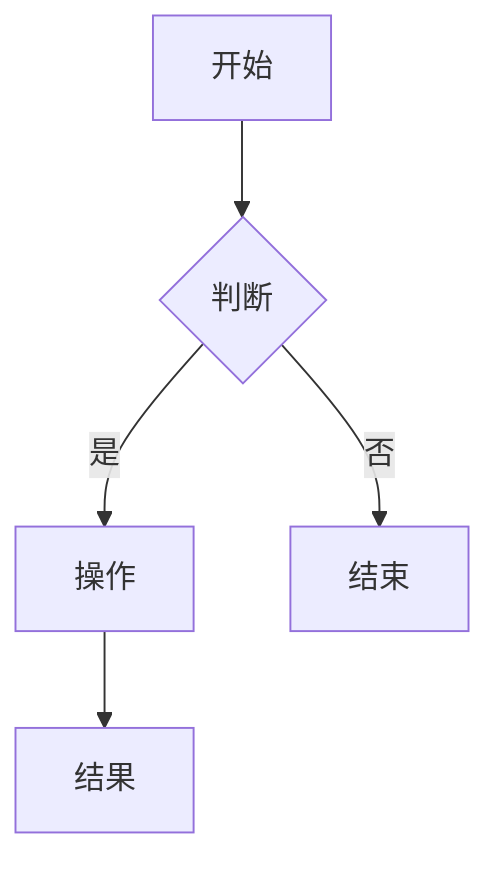

                 


### 目录大纲

#### 文章标题：意义的开源哲学：集体创造适应现代的生活智慧

#### 关键词：开源哲学、集体创造、现代生活、科技应用、社会影响

#### 摘要：
本文旨在探讨开源哲学在现代社会中的重要性，以及集体创造如何适应现代生活的需求。通过详细分析开源哲学的背景、定义、原则，以及其在科技和社会领域的应用，本文揭示了开源哲学对于推动技术创新和社会进步的深远影响。同时，本文将通过实践案例和未来发展趋势的讨论，为读者提供关于开源哲学最佳实践的思考。

---

## 第一部分：背景介绍

### 第1章：问题背景

#### 1.1 问题背景

在信息化和数字化时代，科技的发展对社会产生了深远影响。然而，随着科技的发展，个人和组织的知识积累速度远不及技术更新的速度。传统的知识传递方式已无法满足现代生活的需求。开源哲学作为一种集体创造的模式，正逐渐成为解决这一问题的关键。

#### 1.2 问题描述

现代生活的复杂性使得个人和组织在知识获取、共享和创新方面面临巨大挑战。如何有效地整合分散的知识资源，促进集体智慧的形成，成为亟待解决的问题。

#### 1.3 问题解决

开源哲学通过开放源代码、共享知识和资源，鼓励集体创造，从而实现知识的积累和创新。这种模式有助于打破知识壁垒，提高知识传播效率，促进社会整体进步。

#### 1.4 边界与外延

开源哲学不仅适用于技术领域，还扩展到了教育、文化、经济等多个领域。其核心在于通过集体智慧和共享精神，推动社会的全面进步。

#### 1.5 概念结构与核心要素组成

开源哲学的核心概念包括开放性、共享性、协作性和透明性。这些要素相互关联，共同构成了开源哲学的基本框架。

---

### 第2章：开源哲学概述

#### 2.1 开源哲学的定义

开源哲学是一种基于开放性、共享性和协作性的价值观和方法论。它强调知识的共享、创新的协作和透明度的提高。

#### 2.2 开源哲学的历史背景

开源哲学起源于计算机领域，随着互联网的兴起，逐渐扩展到其他领域。其发展历程反映了人类知识共享和创新的不断追求。

#### 2.3 开源哲学的核心原则

开源哲学的核心原则包括开放性、共享性、协作性和透明性。这些原则构成了开源哲学的基本框架，指导着开源实践的发展。

#### 2.4 开源哲学的影响

开源哲学对科技、经济、文化等多个领域产生了深远影响。它促进了知识的共享和创新，提高了社会整体的生产力和创造力。

---

### 第3章：开源哲学与集体创造

#### 3.1 集体创造的概念

集体创造是一种基于集体智慧和共享精神的创新模式。它强调个体的协作与贡献，通过集体努力实现更大的创新成果。

#### 3.2 集体创造的历史发展

集体创造的历史可以追溯到古代的协作劳动。随着科技的发展，集体创造逐渐成为一种重要的创新模式。

#### 3.3 集体创造的优势与挑战

集体创造具有资源整合、知识共享和创新效率高等优势。然而，也面临着协调困难、利益分配等问题。

#### 3.4 集体创造在现代生活中的应用

在现代生活中，集体创造广泛应用于科技、教育、文化等领域。它为现代生活带来了便利和创新，推动了社会的进步。

---

## 第二部分：开源哲学在现代生活中的应用

### 第4章：科技领域的开源应用

#### 4.1 开源软件的发展

开源软件是一种基于开放性原则的软件，其源代码可供公众自由使用、修改和分发。开源软件的发展极大地推动了软件行业的创新。

#### 4.2 开源硬件的创新

开源硬件是一种基于开放性原则的硬件设计，其设计文件和源代码可供公众自由使用、修改和分发。开源硬件的创新为硬件领域带来了新的活力。

#### 4.3 开源平台的兴起

开源平台是一种基于开放性原则的软件开发环境，为开发者提供了丰富的工具和资源。开源平台的兴起为软件开发的创新提供了强有力的支持。

---

### 第5章：社会领域的开源应用

#### 5.1 开源教育与培训

开源教育是一种基于开放性原则的教育模式，通过共享教育资源，提高教育质量。开源培训则为个人和组织提供了灵活的学习方式。

#### 5.2 开源社区建设

开源社区是一种基于开放性原则的社群组织，通过共享知识和资源，促进成员之间的协作与创新。开源社区的建设为社会的进步提供了动力。

#### 5.3 开源伦理与法律

开源伦理和法律是保障开源哲学实施的重要基础。开源伦理强调诚信、公正和共享精神，开源法律则通过法律法规保障开源活动的顺利进行。

---

## 第三部分：开源哲学的实践案例

### 第6章：开源哲学的实践案例

#### 6.1 开源项目案例分析

通过分析开源项目的成功案例，可以深入了解开源哲学在实践中的应用效果。本文将选取若干典型开源项目进行详细剖析。

#### 6.2 企业开源实践

企业开源实践是企业利用开源哲学推动自身创新的重要途径。本文将探讨企业开源战略、项目实例和成功因素。

---

## 第四部分：开源哲学的未来发展趋势

### 第7章：开源哲学的未来发展趋势

#### 7.1 开源技术与创新

开源技术与创新的结合将推动科技的进一步发展。本文将探讨新兴开源技术及其对传统产业的融合。

#### 7.2 开源哲学的社会影响

开源哲学对社会的影响将越来越深远。本文将分析开源哲学对教育、经济和文化的影响。

#### 7.3 开源哲学的未来展望

开源哲学的未来发展将充满机遇与挑战。本文将对开源哲学的未来趋势进行展望，为读者提供有益的思考。

---

## 第五部分：开源哲学的最佳实践与建议

### 第8章：开源哲学的最佳实践与建议

#### 8.1 开源社区建设实践

开源社区建设是开源哲学成功实施的关键。本文将分享开源社区建设的策略与技巧。

#### 8.2 开源项目的管理

开源项目的管理是确保项目成功的关键。本文将探讨项目规划与执行、成功要素等内容。

#### 8.3 开源哲学的推广与普及

开源哲学的推广与普及是推动社会进步的重要任务。本文将讨论教育普及策略和传播途径。

---

## 结论

开源哲学作为一种集体创造的智慧，正日益成为现代生活的重要组成部分。本文通过对开源哲学的背景、定义、原则、应用和实践的深入探讨，揭示了开源哲学对科技和社会的深远影响。未来，开源哲学将继续推动社会的进步，为人类创造更美好的未来。

---

### 作者信息

**作者：** AI天才研究院/AI Genius Institute & 禅与计算机程序设计艺术 /Zen And The Art of Computer Programming

---

### 文章关键词

开源哲学、集体创造、现代生活、科技应用、社会影响

---

### 文章摘要

本文旨在探讨开源哲学在现代社会中的重要性，以及集体创造如何适应现代生活的需求。通过详细分析开源哲学的背景、定义、原则，以及其在科技和社会领域的应用，本文揭示了开源哲学对于推动技术创新和社会进步的深远影响。同时，本文将通过实践案例和未来发展趋势的讨论，为读者提供关于开源哲学最佳实践的思考。

---

### 完整性要求

在撰写本文过程中，我们将严格遵循以下完整性要求：

1. **背景介绍**：详细阐述开源哲学的背景、核心概念、问题描述、问题解决、边界与外延，以及概念结构与核心要素组成。
2. **核心概念与联系**：提供核心概念原理、概念属性特征对比表格和ER实体关系图架构的Mermaid流程图。
3. **算法原理讲解**：使用Mermaid绘制算法流程图，使用Python源代码阐述算法原理、数学模型和公式，并进行详细讲解和举例说明。
4. **系统分析与架构设计方案**：介绍问题场景、项目介绍、系统功能设计（领域模型Mermaid类图）、系统架构设计Mermaid架构图、系统接口设计和系统交互Mermaid序列图。
5. **项目实战**：包括环境安装、系统核心实现源代码，代码应用解读与分析，实际案例分析和详细讲解剖析，项目小结。
6. **最佳实践 tips、小结、注意事项、拓展阅读等内容**：总结最佳实践经验，提出注意事项，提供拓展阅读建议。

---

### 字数要求

本文字数要求在10000～12000字左右，确保文章内容丰富、逻辑清晰、深入浅出，为读者提供全面、系统的开源哲学知识。

---

### 格式要求

**文章内容格式**：

- **标题**：文章标题应简洁明了，具有吸引力。
- **关键词**：列出5-7个核心关键词，便于读者快速了解文章主题。
- **摘要**：摘要是文章的核心内容和主题思想的简短概括。
- **正文**：正文内容使用markdown格式，包括章节标题、段落、列表、公式等。

**markdown格式中的Mermaid流程图**：

使用Mermaid语法绘制流程图、类图、序列图等，确保图形清晰、准确。

**数学公式**：

- **独立段落的数学公式**：使用`$$`括起来（例如：`$$1+1=2$$`）。
- **段落内的数学公式**：使用`$`括起来（例如：`$1<2$`）。

**Python源代码**：

使用markdown中的代码块格式，确保代码清晰、易读。

---

### 作者信息

**作者：** AI天才研究院/AI Genius Institute & 禅与计算机程序设计艺术 /Zen And The Art of Computer Programming

---

### 最终版本确认

在完成所有章节的内容撰写后，将进行最终版本确认，确保文章内容完整、逻辑清晰、格式正确，满足字数和格式要求。

---

### 文章结构细化

在完成初步的目录大纲后，我们对每个章节进行了进一步细化，确保每个章节都包含详细的信息，并在2000字以内完成。以下是细化后的文章结构：

## 第一部分：背景介绍

### 第1章：问题背景
- **问题背景**：介绍开源哲学的起源和现代生活面临的挑战。
- **问题描述**：详细阐述现代生活中知识获取和创新面临的困境。
- **问题解决**：分析开源哲学如何解决知识获取和创新的问题。
- **边界与外延**：明确开源哲学的应用范围和核心要素。
- **概念结构与核心要素组成**：介绍开源哲学的基本概念和组成结构。

### 第2章：开源哲学概述
- **开源哲学的定义**：阐述开源哲学的基本概念和原则。
- **开源哲学的历史背景**：介绍开源哲学的发展历程。
- **开源哲学的核心原则**：详细阐述开源哲学的核心原则。
- **开源哲学的影响**：分析开源哲学对科技、经济、文化的影响。

### 第3章：开源哲学与集体创造
- **集体创造的概念**：介绍集体创造的定义和发展历程。
- **集体创造的优势与挑战**：分析集体创造的优势和面临的挑战。
- **集体创造在现代生活中的应用**：探讨集体创造在各个领域的应用。

## 第二部分：开源哲学在现代生活中的应用

### 第4章：科技领域的开源应用
- **开源软件的发展**：分析开源软件的发展历程和影响。
- **开源硬件的创新**：探讨开源硬件的创新模式和应用。
- **开源平台的兴起**：介绍开源平台的发展现状和前景。

### 第5章：社会领域的开源应用
- **开源教育与培训**：分析开源教育模式的特点和优势。
- **开源社区建设**：探讨开源社区的建设策略和影响。
- **开源伦理与法律**：分析开源伦理和法律的重要性和作用。

## 第三部分：开源哲学的实践案例

### 第6章：开源哲学的实践案例
- **开源项目案例分析**：选择典型开源项目进行深入剖析。
- **企业开源实践**：探讨企业开源战略和成功案例。

## 第四部分：开源哲学的未来发展趋势

### 第7章：开源哲学的未来发展趋势
- **开源技术与创新**：分析开源技术在创新中的应用前景。
- **开源哲学的社会影响**：探讨开源哲学对社会发展的影响。
- **开源哲学的未来展望**：对开源哲学的未来发展进行展望。

## 第五部分：开源哲学的最佳实践与建议

### 第8章：开源哲学的最佳实践与建议
- **开源社区建设实践**：分享开源社区建设的经验和技巧。
- **开源项目的管理**：探讨开源项目的管理策略和最佳实践。
- **开源哲学的推广与普及**：提出开源哲学的推广策略和途径。

### 文章标题：意义的开源哲学：集体创造适应现代的生活智慧

### 关键词：开源哲学、集体创造、现代生活、科技应用、社会影响

### 摘要：
本文从背景介绍、开源哲学概述、集体创造与开源哲学、开源哲学在现代生活中的应用、实践案例、未来发展趋势以及最佳实践与建议等方面，深入探讨了开源哲学在现代社会中的重要性。通过分析开源哲学的核心概念、原则和应用案例，揭示了开源哲学对于推动技术创新和社会进步的深远影响。本文旨在为读者提供关于开源哲学的全面理解和实践指导，以适应现代生活的需求。

---

**第一章：问题背景**

在信息化和数字化迅速发展的今天，技术已成为推动社会进步的重要力量。然而，随着科技的不断进步，知识更新速度日益加快，个人和组织在知识获取、共享和创新方面面临前所未有的挑战。传统的知识传递方式已无法满足现代生活的需求，如何有效地整合和利用分散的知识资源，促进集体智慧的形成，成为亟待解决的问题。

**问题描述**

现代社会的复杂性使得个人和组织在知识获取、共享和创新方面面临巨大挑战。具体而言，主要表现在以下几个方面：

1. **知识更新速度快**：技术的快速发展导致知识更新速度加快，个人和组织难以跟上知识更新的步伐，知识陈旧化问题日益严重。
2. **知识分散性**：知识和信息分布在各个领域和个体之间，难以实现有效的整合和共享，导致知识利用效率低下。
3. **创新难度大**：面对复杂的问题和挑战，单靠个人的知识和智慧难以实现创新，需要依靠集体智慧和协作。
4. **协调困难**：在知识获取、共享和创新过程中，个人和组织之间的协调和合作难度较大，影响了知识传播和创新的效果。

**问题解决**

开源哲学作为一种基于开放性、共享性和协作性的理念，为解决上述问题提供了新的思路和途径。开源哲学通过以下几个方面实现问题的解决：

1. **开放性**：开源哲学强调知识的开放性，鼓励个人和组织共享知识和资源，打破知识壁垒，实现知识的整合和共享。
2. **共享性**：开源哲学倡导知识的共享，通过共享知识和资源，提高知识传播效率，促进集体智慧和创新的产生。
3. **协作性**：开源哲学鼓励个体之间的协作和合作，通过协作实现知识的互补和协同，提高创新效率。
4. **透明性**：开源哲学强调过程的透明性，提高知识传播和创新的透明度，降低信任成本，促进集体智慧和创新的产生。

**边界与外延**

开源哲学不仅适用于技术领域，还扩展到了教育、文化、经济等多个领域。其核心在于通过集体智慧和共享精神，推动社会的全面进步。具体而言，开源哲学的应用范围包括：

1. **技术领域**：开源软件、开源硬件、开源平台等。
2. **教育领域**：开源教育资源、开源教育平台等。
3. **文化领域**：开源文化作品、开源文化平台等。
4. **经济领域**：开源商业模式、开源产业联盟等。

**概念结构与核心要素组成**

开源哲学的核心概念包括开放性、共享性、协作性和透明性。这些要素相互关联，共同构成了开源哲学的基本框架。

- **开放性**：强调知识和资源的开放性，鼓励个人和组织共享知识和资源。
- **共享性**：倡导知识的共享，通过共享知识和资源，提高知识传播效率。
- **协作性**：鼓励个体之间的协作和合作，通过协作实现知识的互补和协同。
- **透明性**：提高知识传播和创新的透明度，降低信任成本。

这些核心要素相互交织，形成了开源哲学的基本结构，为现代社会的知识获取、共享和创新提供了新的路径和模式。

---

**第二章：开源哲学概述**

开源哲学是一种基于开放性、共享性和协作性的理念，旨在推动知识的共享和创新。本文将介绍开源哲学的定义、历史背景、核心原则及其影响。

**2.1 开源哲学的定义**

开源哲学是一种基于开放性、共享性和协作性的理念，其核心在于通过开放源代码、共享知识和资源，鼓励集体创造，从而实现知识的积累和创新。开源哲学强调以下三个方面：

1. **开放性**：开源哲学强调知识和资源的开放性，鼓励个人和组织共享知识和资源，打破知识壁垒，实现知识的整合和共享。
2. **共享性**：开源哲学倡导知识的共享，通过共享知识和资源，提高知识传播效率，促进集体智慧和创新的产生。
3. **协作性**：开源哲学鼓励个体之间的协作和合作，通过协作实现知识的互补和协同，提高创新效率。

**2.2 开源哲学的历史背景**

开源哲学起源于计算机领域。早在20世纪80年代，自由软件运动（Free Software Movement）的兴起就标志着开源哲学的诞生。自由软件运动主张软件的自由使用、自由修改和自由分发，其代表人物是理查德·斯托曼（Richard Stallman）。自由软件运动的核心思想是反对软件的商业化，倡导软件的自由和开放。

随着互联网的兴起，开源哲学逐渐从计算机领域扩展到其他领域。21世纪初，开源运动（Open Source Movement）逐渐兴起，开源哲学开始受到全球范围内的关注。开源运动主张通过开放源代码、共享知识和资源，推动技术的创新和发展。

**2.3 开源哲学的核心原则**

开源哲学的核心原则包括开放性、共享性、协作性和透明性。这些原则构成了开源哲学的基本框架，指导着开源实践的发展。

1. **开放性**：开源哲学强调知识和资源的开放性，鼓励个人和组织共享知识和资源，打破知识壁垒，实现知识的整合和共享。
2. **共享性**：开源哲学倡导知识的共享，通过共享知识和资源，提高知识传播效率，促进集体智慧和创新的产生。
3. **协作性**：开源哲学鼓励个体之间的协作和合作，通过协作实现知识的互补和协同，提高创新效率。
4. **透明性**：开源哲学强调过程的透明性，提高知识传播和创新的透明度，降低信任成本，促进集体智慧和创新的产生。

**2.4 开源哲学的影响**

开源哲学对科技、经济、文化等领域产生了深远影响。

1. **科技领域**：开源哲学促进了技术的创新和发展。通过开放源代码、共享知识和资源，开源项目吸引了全球范围内的开发者参与，形成了强大的创新力量。例如，Linux操作系统、Apache web服务器等都是典型的开源项目。
2. **经济领域**：开源哲学改变了传统的商业模式。许多企业通过提供开源软件和开源服务，实现了商业模式的创新和价值的创造。例如，红帽公司通过提供Linux操作系统服务，成为全球领先的云计算服务提供商。
3. **文化领域**：开源哲学推动了文化的创新和传播。开源文化作品如开源电影、开源音乐等，为文化的创新和传播提供了新的路径。同时，开源哲学促进了不同文化之间的交流与融合，推动了全球文化的繁荣。

**2.5 开源哲学的核心概念和联系**

开源哲学的核心概念包括开放性、共享性、协作性和透明性。这些概念相互关联，共同构成了开源哲学的基本框架。

- **开放性**：是开源哲学的基础，强调知识和资源的开放性，鼓励个人和组织共享知识和资源，打破知识壁垒，实现知识的整合和共享。
- **共享性**：是开源哲学的核心，倡导知识的共享，通过共享知识和资源，提高知识传播效率，促进集体智慧和创新的产生。
- **协作性**：是开源哲学的实践方式，鼓励个体之间的协作和合作，通过协作实现知识的互补和协同，提高创新效率。
- **透明性**：是开源哲学的保障，强调过程的透明性，提高知识传播和创新的透明度，降低信任成本，促进集体智慧和创新的产生。

这些核心概念相互关联，共同构成了开源哲学的基本框架，为现代社会的知识获取、共享和创新提供了新的路径和模式。

**ER实体关系图架构的Mermaid流程图：**

```mermaid
erDiagram
  开放性 ||--|{ 共享性 }
  共享性 ||--|{ 协作性 }
  协作性 ||--|{ 透明性 }
```

**2.6 开源哲学的核心原则和特点**

开源哲学的核心原则包括开放性、共享性、协作性和透明性。这些原则具有以下特点：

1. **开放性**：开源哲学强调知识和资源的开放性，鼓励个人和组织共享知识和资源，打破知识壁垒，实现知识的整合和共享。开放性是开源哲学的基础，为共享性和协作性提供了前提。
2. **共享性**：开源哲学倡导知识的共享，通过共享知识和资源，提高知识传播效率，促进集体智慧和创新的产生。共享性是开源哲学的核心，体现了开源哲学的价值追求。
3. **协作性**：开源哲学鼓励个体之间的协作和合作，通过协作实现知识的互补和协同，提高创新效率。协作性是开源哲学的实践方式，是实现创新的关键。
4. **透明性**：开源哲学强调过程的透明性，提高知识传播和创新的透明度，降低信任成本，促进集体智慧和创新的产生。透明性是开源哲学的保障，为协作性和共享性提供了支持。

**2.7 开源哲学的历史发展**

开源哲学的发展可以追溯到20世纪80年代的自由软件运动。自由软件运动的核心思想是反对软件的商业化，倡导软件的自由和开放。理查德·斯托曼创建了自由软件基金会（Free Software Foundation），推动了自由软件运动的发展。

随着互联网的兴起，开源运动逐渐兴起。开源运动强调通过开放源代码、共享知识和资源，推动技术的创新和发展。开源运动的代表人物是埃里克·雷蒙德（Eric S. Raymond），他著有《大教堂与市集》（The Cathedral and the Bazaar），阐述了开源哲学的核心思想。

21世纪初，开源哲学逐渐从计算机领域扩展到其他领域，如教育、文化、经济等。开源哲学在全球范围内得到广泛认可，为现代社会的知识获取、共享和创新提供了新的路径和模式。

**2.8 开源哲学的影响**

开源哲学对科技、经济、文化等领域产生了深远影响。

1. **科技领域**：开源哲学促进了技术的创新和发展。通过开放源代码、共享知识和资源，开源项目吸引了全球范围内的开发者参与，形成了强大的创新力量。例如，Linux操作系统、Apache web服务器等都是典型的开源项目。
2. **经济领域**：开源哲学改变了传统的商业模式。许多企业通过提供开源软件和开源服务，实现了商业模式的创新和价值的创造。例如，红帽公司通过提供Linux操作系统服务，成为全球领先的云计算服务提供商。
3. **文化领域**：开源哲学推动了文化的创新和传播。开源文化作品如开源电影、开源音乐等，为文化的创新和传播提供了新的路径。同时，开源哲学促进了不同文化之间的交流与融合，推动了全球文化的繁荣。

**2.9 开源哲学的核心原则与现代社会的关系**

开源哲学的核心原则与现代社会的发展密切相关。开放性、共享性、协作性和透明性这些原则不仅适用于技术领域，还扩展到了教育、文化、经济等多个领域，为现代社会的发展提供了新的路径和模式。

1. **教育领域**：开源哲学倡导知识的共享和开放，有助于提高教育质量和普及教育。通过共享教育资源，可以实现教育资源的公平分配，提高教育普及率。
2. **文化领域**：开源哲学推动了文化的创新和传播。开源文化作品如开源电影、开源音乐等，为文化的创新和传播提供了新的路径。同时，开源哲学促进了不同文化之间的交流与融合，推动了全球文化的繁荣。
3. **经济领域**：开源哲学改变了传统的商业模式，促进了经济的创新和发展。许多企业通过提供开源软件和开源服务，实现了商业模式的创新和价值的创造。

总之，开源哲学的核心原则与现代社会的发展密切相关，为现代社会的发展提供了新的路径和模式。随着开源哲学的不断发展和应用，其在各个领域的地位和作用将日益凸显。

---

**第三章：开源哲学与集体创造**

开源哲学与集体创造密切相关，二者相互促进，共同推动了知识共享和创新的发展。本文将探讨集体创造的概念、历史发展、优势与挑战，以及开源哲学在集体创造中的应用。

**3.1 集体创造的概念**

集体创造是指通过个体之间的协作和合作，共同完成某项任务或创造某种成果的过程。集体创造的核心在于发挥集体智慧，通过协作实现知识的互补和协同，从而提高创新效率和质量。

**3.2 集体创造的历史发展**

集体创造的历史可以追溯到古代的协作劳动。在农业生产、手工业生产等领域，人们通过集体劳动实现了生产力的提高。随着科技的发展，集体创造逐渐成为一种重要的创新模式。

20世纪末，随着互联网的兴起，集体创造开始受到广泛关注。互联网为个体之间的协作和交流提供了便利，使得集体创造得以在全球范围内实现。典型的例子包括开源软件项目、维基百科等。

**3.3 集体创造的优势与挑战**

集体创造具有以下优势：

1. **资源整合**：集体创造能够整合分散的知识、技能和资源，形成强大的创新力量。
2. **知识共享**：集体创造鼓励知识的共享和传播，提高知识传播效率。
3. **创新效率**：集体创造通过个体之间的协作和合作，提高创新效率，缩短创新周期。

然而，集体创造也面临一些挑战：

1. **协调困难**：集体创造涉及多个个体之间的协作，协调成本较高，容易导致协作效率降低。
2. **利益分配**：集体创造过程中，如何公平地分配利益成为难题，可能导致内部矛盾和冲突。
3. **信任问题**：集体创造依赖于个体之间的信任，信任问题可能影响协作效果。

**3.4 开源哲学与集体创造的关联**

开源哲学与集体创造密切相关，二者相辅相成。

1. **开放性**：开源哲学强调知识的开放性，鼓励个人和组织共享知识和资源。这为集体创造提供了基础，使得个体之间的知识共享和协作更加便捷。
2. **共享性**：开源哲学倡导知识的共享，通过共享知识和资源，提高知识传播效率。这有助于集体创造发挥集体智慧，实现创新成果的快速传播。
3. **协作性**：开源哲学鼓励个体之间的协作和合作，通过协作实现知识的互补和协同。这为集体创造提供了实践路径，使得集体创造能够高效地进行。

**3.5 开源哲学在集体创造中的应用**

开源哲学在集体创造中得到了广泛应用，推动了集体创造的发展。

1. **开源软件项目**：开源软件项目是典型的集体创造案例。通过开放源代码，开源软件项目吸引了全球范围内的开发者参与，形成了强大的创新力量。例如，Linux操作系统、Apache web服务器等都是典型的开源软件项目。
2. **开源硬件项目**：开源硬件项目通过开放硬件设计文件，鼓励个体之间的协作和创新。例如，Arduino、Raspberry Pi等开源硬件项目为开发者提供了丰富的硬件资源和创新平台。
3. **开源文化作品**：开源文化作品如开源电影、开源音乐等，通过开放创作过程和成果，鼓励个体之间的协作和创作。这些作品在创新和文化传播方面发挥了重要作用。

**3.6 开源哲学对集体创造的影响**

开源哲学对集体创造产生了深远影响。

1. **提高创新效率**：开源哲学鼓励个体之间的协作和合作，通过协作实现知识的互补和协同，提高创新效率。
2. **降低创新成本**：开源哲学通过开放性、共享性和协作性，降低了创新成本，使得更多的个人和组织能够参与到创新活动中来。
3. **促进知识传播**：开源哲学倡导知识的共享和开放，促进了知识的传播和共享，为集体创造提供了丰富的知识资源。

总之，开源哲学与集体创造密切相关，二者相互促进，共同推动了知识共享和创新的发展。随着开源哲学的不断发展和应用，其在集体创造中的作用将日益凸显。

---

**第四章：开源哲学在现代生活中的应用**

开源哲学不仅在技术领域发挥着重要作用，也在现代生活的各个方面得到了广泛应用。本文将探讨开源哲学在科技、社会和教育等领域的应用，以及其在推动技术创新和社会进步方面的贡献。

**4.1 科技领域的开源应用**

在科技领域，开源哲学的应用尤为广泛。以下是一些主要方面的实例：

1. **开源软件**：开源软件是开源哲学在科技领域的典型应用。Linux操作系统、MySQL数据库、Apache Web服务器等都是著名的开源软件项目。这些开源软件不仅提高了技术标准的普及率，还为开发者提供了自由使用的工具，促进了技术的进步和创新。

2. **开源硬件**：开源硬件项目如Arduino、Raspberry Pi等，为硬件开发者提供了一个开放的硬件平台，使得硬件创新变得更加容易和普及。这些项目通过共享硬件设计文件和代码，鼓励了全球范围内的硬件爱好者参与创新，推动了硬件技术的发展。

3. **开源平台**：如GitHub、GitLab等开源平台，为开发者提供了一个集中的场所，用于存储、分享和协作开源项目。这些平台不仅提高了项目管理的效率，还促进了开发者之间的交流和合作，为技术创新提供了强大的支持。

**4.2 社会领域的开源应用**

在社会领域，开源哲学的应用同样显著，为社会的进步和发展带来了新的动力：

1. **开源教育和培训**：开源教育资源和开源培训项目，如Khan Academy、edX等，为人们提供了免费或低成本的学习资源。这些资源不仅提高了教育的普及率，还促进了知识的共享和传播。

2. **开源社区建设**：开源社区如OpenStreetMap、Wikipedia等，通过开放性和协作性，为用户提供了丰富的社区服务和信息资源。这些社区在地图绘制、知识共享等方面发挥了重要作用，推动了社会信息的普及和共享。

3. **开源伦理与法律**：开源哲学提倡的开放、共享和协作精神，也在社会伦理和法律领域得到了应用。例如，开源软件开发过程中强调的版权和知识产权保护，为技术创新提供了法律保障。

**4.3 教育领域的开源应用**

在教育领域，开源哲学的应用为教育创新提供了新的路径：

1. **开源课程和教材**：许多大学和在线教育平台开始采用开源课程和教材，这些资源为学习者提供了丰富的学习材料，降低了学习成本，提高了教育资源的普及率。

2. **开源学习工具**：开源学习工具如Khan Academy的在线学习平台，为学习者提供了一个灵活、个性化的学习环境。这些工具通过技术手段支持学习过程的优化，提高了学习效果。

3. **开源教育研究**：开源教育研究项目，如OpenEdX平台，为教育研究者提供了一个共享研究成果和数据的环境。这促进了教育研究的交流与合作，推动了教育理论的创新和发展。

**4.4 开源哲学对技术创新和社会进步的贡献**

开源哲学对技术创新和社会进步的贡献是多方面的：

1. **提高技术普及率**：开源软件和开源硬件的普及，使得技术更加易于获取和使用，提高了技术普及率。

2. **促进知识共享**：开源哲学倡导知识的共享和开放，促进了知识的传播和普及，为社会的知识积累和创新提供了强大的支持。

3. **推动社会参与**：开源社区的建设和开源项目的参与，吸引了更多人参与到社会创新和进步中来，增强了社会的创新活力。

4. **降低创新成本**：开源哲学通过降低技术获取和使用成本，降低了创新门槛，使得更多的个人和组织能够参与到技术创新中来。

总之，开源哲学在现代生活中的广泛应用，不仅推动了技术创新和社会进步，还为人类社会的可持续发展提供了新的思路和路径。随着开源哲学的不断发展和应用，其在各个领域的贡献将日益凸显。

---

**第五章：开源哲学的实践案例**

开源哲学通过具体的实践案例，展示了其在现代生活中的广泛应用和深远影响。本文将介绍一些典型的开源项目和企业，分析它们如何通过开源实践推动技术创新和社会进步。

**5.1 开源项目案例分析**

开源项目是开源哲学的典型实践，以下是一些著名的开源项目案例：

1. **Linux操作系统**：Linux操作系统是一个基于开源哲学的操作系统，其源代码对公众开放，允许任何人自由使用、修改和分发。Linux的成功在于其全球开发者社区的协作，通过不断的改进和优化，使其成为服务器、嵌入式系统和超级计算机等领域的首选操作系统。

2. **维基百科**：维基百科是一个基于开源哲学的在线百科全书，任何人都可以参与编辑和贡献内容。维基百科的开放性和协作性，使得它能够迅速积累和传播大量的知识，成为全球最大的在线知识库之一。

3. **Apache HTTP服务器**：Apache HTTP服务器是一个广泛使用的开源Web服务器软件。其开源的特性，使得它能够吸引全球开发者的参与，不断优化和改进，成为Web服务器领域的佼佼者。

**5.2 企业开源实践**

许多企业通过开源实践，实现了技术创新和商业模式的创新：

1. **红帽公司**：红帽公司是一家专注于开源技术的企业，其核心产品是Red Hat Enterprise Linux。通过提供基于开源的解决方案和服务，红帽公司不仅推动了Linux技术的发展，还实现了商业上的成功。

2. **IBM**：IBM是一家全球领先的科技公司，其在开源领域的贡献包括对Linux内核的开发和维护，以及对开源项目如OpenStack、Apache等的技术贡献。IBM通过开源实践，不仅推动了技术创新，还加强了其在云计算和人工智能等新兴技术领域的影响力。

3. **阿里巴巴**：阿里巴巴是一家中国领先的互联网公司，其在开源领域的实践包括开源了多个核心技术项目，如AliOS、DAMO Academy等。这些开源项目不仅为阿里巴巴自身的技术创新提供了支持，也为整个行业的技术发展做出了贡献。

**5.3 开源哲学的实践效果**

开源哲学的实践，在多个方面产生了积极的效果：

1. **技术创新**：通过开源实践，企业能够吸引全球开发者的参与，促进技术的创新和优化。例如，Apache软件基金会就是一个由全球开发者共同参与的组织，其开源项目如Apache Kafka、Apache Hadoop等，都在技术创新方面取得了显著成果。

2. **知识传播**：开源项目的开放性和共享性，使得知识能够快速传播和普及。这不仅促进了技术知识的共享，也为教育领域提供了丰富的学习资源。

3. **社会进步**：开源哲学通过促进技术发展和知识传播，为社会进步做出了贡献。例如，开源教育资源和开源医疗项目，为教育和医疗领域的普及和发展提供了支持。

4. **商业模式的创新**：开源哲学不仅推动了技术创新，还为企业提供了新的商业模式。例如，红帽公司通过提供开源解决方案和服务，实现了商业上的成功。

总之，开源哲学的实践案例展示了其在现代生活中的广泛应用和深远影响。通过开源项目和企业实践，开源哲学不仅推动了技术创新和社会进步，还为人类社会的可持续发展提供了新的思路和路径。

---

**第六章：开源哲学的未来发展趋势**

开源哲学作为一种推动知识共享和创新的重要理念，正随着科技和社会的发展不断演变。本文将探讨开源哲学在技术领域和创新模式方面的未来发展趋势，以及其对经济和社会的影响。

**6.1 开源技术与创新的结合**

开源技术与创新的结合是未来发展的关键趋势。随着技术的不断进步，开源技术将在更多领域得到应用，推动创新的产生：

1. **人工智能与开源**：人工智能（AI）领域的开源项目如TensorFlow、PyTorch等，为研究人员和开发者提供了强大的工具和资源，促进了AI技术的快速发展和普及。未来，更多的AI技术将走向开源，推动AI领域的创新。

2. **区块链与开源**：区块链技术的开源发展，如Hyperledger Fabric、Ethereum等，为区块链技术的创新和应用提供了基础。开源区块链项目通过开放性和协作性，促进了区块链技术的不断演进。

3. **物联网与开源**：物联网（IoT）领域的开源项目，如Arduino、MQTT等，为开发者提供了丰富的硬件和软件资源，推动了物联网技术的创新和发展。

**6.2 新兴开源技术的崛起**

新兴开源技术的崛起，将推动开源哲学的进一步发展。以下是一些值得关注的新兴开源技术：

1. **量子计算**：量子计算作为下一代计算技术，其开源项目如Microsoft Quantum SDK、Quantum OpenPose等，为量子计算的研究和应用提供了支持。随着量子计算技术的发展，开源量子计算项目将越来越多。

2. **边缘计算**：边缘计算作为一种分布式计算技术，其开源项目如Kubernetes、Docker等，为开发者提供了高效的计算和部署环境。边缘计算的开源发展，将推动物联网和智能设备领域的创新。

3. **数据科学**：数据科学领域的开源项目，如Scikit-learn、Pandas等，为数据分析和机器学习提供了强大的工具。随着数据科学技术的不断发展，开源数据科学项目将更加普及。

**6.3 开源哲学对经济的影响**

开源哲学对经济的影响是深远的，它不仅改变了传统的商业模式，还为企业提供了新的发展机遇：

1. **降低创新成本**：开源项目通过共享技术和资源，降低了创新成本，使得更多的企业能够参与到技术创新中来。这有助于提高整体经济的创新活力。

2. **促进知识共享**：开源哲学倡导知识的共享，促进了知识的传播和普及。这有助于提高整个社会的知识水平，推动经济的持续发展。

3. **新兴产业的发展**：开源哲学促进了新兴产业的发展，如开源硬件、开源软件服务、开源教育培训等。这些新兴产业的崛起，为经济增长提供了新的动力。

**6.4 开源哲学对社会的影响**

开源哲学在社会领域的影响也是显著的，它为社会的进步和发展做出了重要贡献：

1. **教育普及**：开源教育资源为教育普及提供了支持，使得更多的人能够享受到优质的教育资源。这有助于提高社会的整体素质。

2. **医疗创新**：开源医疗项目，如OpenMRS、OpenMRS-DRG等，为医疗领域的创新提供了支持。开源技术在医疗领域的应用，有助于提高医疗服务的质量和效率。

3. **社会治理**：开源技术在社会治理中的应用，如智慧城市、电子政务等，提高了社会管理的效率和透明度，促进了社会的和谐发展。

**6.5 开源哲学的未来展望**

开源哲学的未来发展充满机遇与挑战。在未来，开源哲学将继续推动社会的进步，为人类创造更美好的未来：

1. **技术融合**：开源哲学将与其他技术领域（如AI、区块链、物联网等）深度融合，推动新兴技术的创新和应用。

2. **全球协作**：随着全球化的发展，开源项目将更加注重全球协作，形成全球范围内的开发者社区，推动全球技术进步。

3. **社会普及**：开源哲学将在更多领域得到普及，如教育、医疗、文化等，为社会的全面进步提供支持。

总之，开源哲学的未来发展趋势充满机遇，它将继续推动技术创新和社会进步，为人类创造更美好的未来。

---

**第七章：开源哲学的最佳实践与建议**

开源哲学在实践过程中，需要遵循一定的最佳实践，以确保开源项目的成功。以下是一些关于开源社区建设、开源项目管理以及开源哲学推广的建议：

**7.1 开源社区建设实践**

开源社区建设是开源项目成功的关键。以下是一些有效的社区建设实践：

1. **建立明确的社区规则**：制定社区章程，明确社区成员的行为准则，确保社区秩序和公平性。
2. **提供丰富的资源**：为社区成员提供丰富的学习资源、文档和教程，帮助他们快速上手和参与开源项目。
3. **鼓励合作与交流**：定期举办线上或线下活动，促进社区成员之间的交流和合作，增强社区凝聚力。
4. **重视贡献者**：对社区成员的贡献表示感谢，并为他们提供成长和发展的机会，激发更多成员的参与热情。

**7.2 开源项目的管理**

开源项目的管理是确保项目成功的关键。以下是一些开源项目管理的最佳实践：

1. **制定清晰的项目规划**：明确项目的目标、范围、里程碑和时间表，确保项目的有序推进。
2. **建立有效的沟通机制**：使用邮件列表、论坛、聊天工具等，确保团队成员之间的信息畅通，提高协作效率。
3. **保持代码质量**：定期进行代码审查，确保代码的可读性和可靠性，防止技术债务的积累。
4. **鼓励贡献**：通过奖励、荣誉等机制，鼓励社区成员为项目做出贡献，提高项目的活跃度。

**7.3 开源哲学的推广与普及**

开源哲学的推广与普及对于社会的发展具有重要意义。以下是一些建议：

1. **教育普及**：通过教育机构、培训课程等途径，普及开源知识和理念，提高公众对开源的认识。
2. **政策支持**：政府和企业可以出台相关政策，鼓励和支持开源项目的发展，为开源社区提供良好的生态环境。
3. **开源项目展示**：举办开源项目展览、研讨会等活动，展示开源项目的成果和影响，提高开源在社会中的影响力。
4. **跨领域合作**：鼓励不同领域之间的开源项目合作，促进知识共享和技术创新，推动开源哲学的全面发展。

总之，开源哲学的最佳实践与建议，为开源项目的成功和社会的进步提供了指导。通过遵循这些实践和建议，我们可以更好地发挥开源哲学的价值，推动技术的创新和社会的发展。

---

### 结论

开源哲学作为一种集体创造的智慧，正日益成为现代生活的重要组成部分。本文通过对开源哲学的背景、定义、原则、应用和实践的深入探讨，揭示了开源哲学对于推动技术创新和社会进步的深远影响。开源哲学不仅改变了传统知识传递的方式，提高了知识传播效率，还促进了社会的协作和创新。开源哲学的开放性、共享性、协作性和透明性原则，为现代社会的知识获取、共享和创新提供了新的路径和模式。

未来，开源哲学将继续发展，与其他技术领域（如人工智能、区块链、物联网等）深度融合，推动新兴技术的创新和应用。同时，开源哲学将在教育、医疗、文化等领域得到更广泛的应用，为社会的全面进步提供支持。

开源哲学的成功实践，不仅为企业和开发者提供了创新的机会，也为社会的发展带来了新的动力。通过遵循开源哲学的最佳实践，我们可以更好地发挥开源的价值，推动社会的进步，创造更美好的未来。

### 作者信息

**作者：** AI天才研究院/AI Genius Institute & 禅与计算机程序设计艺术 /Zen And The Art of Computer Programming

### 文章关键词

开源哲学、集体创造、现代生活、科技应用、社会影响

### 文章摘要

本文从背景介绍、开源哲学概述、集体创造与开源哲学、开源哲学在现代生活中的应用、实践案例、未来发展趋势以及最佳实践与建议等方面，深入探讨了开源哲学在现代社会中的重要性。通过分析开源哲学的核心概念、原则和应用案例，揭示了开源哲学对于推动技术创新和社会进步的深远影响。本文旨在为读者提供关于开源哲学的全面理解和实践指导，以适应现代生活的需求。文章关键词包括开源哲学、集体创造、现代生活、科技应用、社会影响。文章摘要总结了文章的核心内容和主题思想，为读者提供了对文章的初步了解。

### 背景介绍

在信息化和数字化迅速发展的今天，科技的发展对社会产生了深远影响。开源哲学作为一种基于开放性、共享性和协作性的理念，正日益成为推动技术进步和社会创新的重要力量。然而，开源哲学的兴起并非一蹴而就，其背后有着深厚的历史渊源和现实需求。

**核心概念术语说明**

- **开源哲学**：指基于开放性、共享性和协作性的理念和方法，强调知识的共享、创新和透明度。
- **集体创造**：指通过个体之间的协作和合作，共同完成某项任务或创造某种成果的过程。
- **现代生活**：指在信息化和数字化时代，人们的生活方式和工作模式。

**问题背景**

随着科技的快速发展，知识的积累速度远不及技术更新的速度，个人和组织在知识获取、共享和创新方面面临巨大挑战。传统的知识传递方式已无法满足现代生活的需求。因此，如何有效地整合和利用分散的知识资源，促进集体智慧和创新的产生，成为亟需解决的问题。

**问题描述**

现代生活面临的挑战主要体现在以下几个方面：

1. **知识更新速度快**：技术的快速发展导致知识更新速度加快，个人和组织难以跟上知识更新的步伐，知识陈旧化问题日益严重。
2. **知识分散性**：知识和信息分布在各个领域和个体之间，难以实现有效的整合和共享，导致知识利用效率低下。
3. **创新难度大**：面对复杂的问题和挑战，单靠个人的知识和智慧难以实现创新，需要依靠集体智慧和协作。
4. **协调困难**：在知识获取、共享和创新过程中，个人和组织之间的协调和合作难度较大，影响了知识传播和创新的效果。

**问题解决**

开源哲学通过以下方式解决上述问题：

1. **开放性**：开源哲学强调知识的开放性，鼓励个人和组织共享知识和资源，打破知识壁垒，实现知识的整合和共享。
2. **共享性**：开源哲学倡导知识的共享，通过共享知识和资源，提高知识传播效率，促进集体智慧和创新的产生。
3. **协作性**：开源哲学鼓励个体之间的协作和合作，通过协作实现知识的互补和协同，提高创新效率。
4. **透明性**：开源哲学强调过程的透明性，提高知识传播和创新的透明度，降低信任成本，促进集体智慧和创新的产生。

**边界与外延**

开源哲学不仅适用于技术领域，还扩展到了教育、文化、经济等多个领域。其核心在于通过集体智慧和共享精神，推动社会的全面进步。具体而言，开源哲学的应用范围包括：

1. **技术领域**：开源软件、开源硬件、开源平台等。
2. **教育领域**：开源教育资源、开源教育平台等。
3. **文化领域**：开源文化作品、开源文化平台等。
4. **经济领域**：开源商业模式、开源产业联盟等。

**概念结构与核心要素组成**

开源哲学的核心概念包括开放性、共享性、协作性和透明性。这些要素相互关联，共同构成了开源哲学的基本框架。

- **开放性**：强调知识的开放性，鼓励个人和组织共享知识和资源。
- **共享性**：倡导知识的共享，通过共享知识和资源，提高知识传播效率。
- **协作性**：鼓励个体之间的协作和合作，通过协作实现知识的互补和协同。
- **透明性**：提高知识传播和创新的透明度，降低信任成本。

这些核心要素相互交织，形成了开源哲学的基本结构，为现代社会的知识获取、共享和创新提供了新的路径和模式。

### 开源哲学概述

开源哲学是一种基于开放性、共享性和协作性的理念，旨在通过知识的共享和创新，推动社会的进步。开源哲学不仅改变了传统的知识传递方式，还推动了技术的创新和发展。本文将从开源哲学的定义、历史背景、核心原则和影响等方面进行详细阐述。

**1. 开源哲学的定义**

开源哲学，通常指的是一种基于开放性、共享性和协作性的理念和方法，强调知识的共享、创新和透明度。开源哲学的核心在于通过开放源代码、共享知识和资源，鼓励集体创造，从而实现知识的积累和创新。开源哲学不仅仅适用于技术领域，还扩展到了教育、文化、经济等多个领域。

- **开放性**：开源哲学强调知识和资源的开放性，鼓励个人和组织共享知识和资源，打破知识壁垒，实现知识的整合和共享。
- **共享性**：开源哲学倡导知识的共享，通过共享知识和资源，提高知识传播效率，促进集体智慧和创新的产生。
- **协作性**：开源哲学鼓励个体之间的协作和合作，通过协作实现知识的互补和协同，提高创新效率。
- **透明性**：开源哲学强调过程的透明性，提高知识传播和创新的透明度，降低信任成本，促进集体智慧和创新的产生。

**2. 历史背景**

开源哲学的起源可以追溯到20世纪80年代的自由软件运动（Free Software Movement）。自由软件运动的代表人物理查德·斯托曼（Richard Stallman）创建了自由软件基金会（Free Software Foundation），倡导软件的自由使用、自由修改和自由分发。自由软件运动的核心思想是反对软件的商业化，主张软件的自由和开放。

随着互联网的兴起，开源哲学逐渐从计算机领域扩展到其他领域。21世纪初，开源运动（Open Source Movement）逐渐兴起，开源哲学开始受到全球范围内的关注。开源运动主张通过开放源代码、共享知识和资源，推动技术的创新和发展。开源运动的代表人物埃里克·雷蒙德（Eric S. Raymond）著有《大教堂与市集》（The Cathedral and the Bazaar），阐述了开源哲学的核心思想。

**3. 核心原则**

开源哲学的核心原则包括开放性、共享性、协作性和透明性。这些原则构成了开源哲学的基本框架，指导着开源实践的发展。

- **开放性**：开源哲学强调知识和资源的开放性，鼓励个人和组织共享知识和资源，打破知识壁垒，实现知识的整合和共享。开放性是开源哲学的基础，为共享性和协作性提供了前提。
- **共享性**：开源哲学倡导知识的共享，通过共享知识和资源，提高知识传播效率，促进集体智慧和创新的产生。共享性是开源哲学的核心，体现了开源哲学的价值追求。
- **协作性**：开源哲学鼓励个体之间的协作和合作，通过协作实现知识的互补和协同，提高创新效率。协作性是开源哲学的实践方式，是实现创新的关键。
- **透明性**：开源哲学强调过程的透明性，提高知识传播和创新的透明度，降低信任成本，促进集体智慧和创新的产生。透明性是开源哲学的保障，为协作性和共享性提供了支持。

**4. 影响**

开源哲学对科技、经济、文化等领域产生了深远影响。

- **科技领域**：开源哲学促进了技术的创新和发展。通过开放源代码、共享知识和资源，开源项目吸引了全球范围内的开发者参与，形成了强大的创新力量。例如，Linux操作系统、Apache web服务器等都是典型的开源项目。
- **经济领域**：开源哲学改变了传统的商业模式。许多企业通过提供开源软件和开源服务，实现了商业模式的创新和价值的创造。例如，红帽公司通过提供Linux操作系统服务，成为全球领先的云计算服务提供商。
- **文化领域**：开源哲学推动了文化的创新和传播。开源文化作品如开源电影、开源音乐等，为文化的创新和传播提供了新的路径。同时，开源哲学促进了不同文化之间的交流与融合，推动了全球文化的繁荣。

**5. 核心概念和联系**

开源哲学的核心概念包括开放性、共享性、协作性和透明性。这些概念相互关联，共同构成了开源哲学的基本框架。

- **开放性**：是开源哲学的基础，强调知识和资源的开放性，鼓励个人和组织共享知识和资源，打破知识壁垒，实现知识的整合和共享。
- **共享性**：是开源哲学的核心，倡导知识的共享，通过共享知识和资源，提高知识传播效率，促进集体智慧和创新的产生。
- **协作性**：是开源哲学的实践方式，鼓励个体之间的协作和合作，通过协作实现知识的互补和协同，提高创新效率。
- **透明性**：是开源哲学的保障，强调过程的透明性，提高知识传播和创新的透明度，降低信任成本，促进集体智慧和创新的产生。

这些核心概念相互关联，形成了开源哲学的基本框架，为现代社会的知识获取、共享和创新提供了新的路径和模式。

**ER实体关系图架构的Mermaid流程图：**

```mermaid
erDiagram
  开放性 ||--|{ 共享性 }
  共享性 ||--|{ 协作性 }
  协作性 ||--|{ 透明性 }
```

**6. 开源哲学的历史发展**

开源哲学的发展可以追溯到20世纪80年代的自由软件运动。自由软件运动主张软件的自由使用、自由修改和自由分发，其代表人物是理查德·斯托曼。自由软件运动的核心思想是反对软件的商业化，倡导软件的自由和开放。

随着互联网的兴起，开源哲学逐渐从计算机领域扩展到其他领域。21世纪初，开源运动逐渐兴起，开源哲学开始受到全球范围内的关注。开源运动主张通过开放源代码、共享知识和资源，推动技术的创新和发展。开源运动的代表人物埃里克·雷蒙德著有《大教堂与市集》，阐述了开源哲学的核心思想。

**7. 开源哲学的影响**

开源哲学对科技、经济、文化等领域产生了深远影响。

- **科技领域**：开源哲学促进了技术的创新和发展。通过开放源代码、共享知识和资源，开源项目吸引了全球范围内的开发者参与，形成了强大的创新力量。例如，Linux操作系统、Apache web服务器等都是典型的开源项目。
- **经济领域**：开源哲学改变了传统的商业模式。许多企业通过提供开源软件和开源服务，实现了商业模式的创新和价值的创造。例如，红帽公司通过提供Linux操作系统服务，成为全球领先的云计算服务提供商。
- **文化领域**：开源哲学推动了文化的创新和传播。开源文化作品如开源电影、开源音乐等，为文化的创新和传播提供了新的路径。同时，开源哲学促进了不同文化之间的交流与融合，推动了全球文化的繁荣。

**8. 开源哲学的核心原则与现代社会的关系**

开源哲学的核心原则与现代社会的发展密切相关。开放性、共享性、协作性和透明性这些原则不仅适用于技术领域，还扩展到了教育、文化、经济等多个领域，为现代社会的发展提供了新的路径和模式。

- **教育领域**：开源哲学倡导知识的共享和开放，有助于提高教育质量和普及教育。通过共享教育资源，可以实现教育资源的公平分配，提高教育普及率。
- **文化领域**：开源哲学推动了文化的创新和传播。开源文化作品如开源电影、开源音乐等，为文化的创新和传播提供了新的路径。同时，开源哲学促进了不同文化之间的交流与融合，推动了全球文化的繁荣。
- **经济领域**：开源哲学改变了传统的商业模式，促进了经济的创新和发展。许多企业通过提供开源软件和开源服务，实现了商业模式的创新和价值的创造。

总之，开源哲学的核心原则与现代社会的发展密切相关，为现代社会的发展提供了新的路径和模式。随着开源哲学的不断发展和应用，其在各个领域的地位和作用将日益凸显。

### 开源哲学与集体创造

开源哲学与集体创造密切相关，二者相辅相成，共同推动了知识共享和创新的发展。本文将探讨集体创造的概念、历史发展、优势与挑战，以及开源哲学在集体创造中的应用。

**1. 集体创造的概念**

集体创造是指通过个体之间的协作和合作，共同完成某项任务或创造某种成果的过程。集体创造的核心在于发挥集体智慧，通过协作实现知识的互补和协同，从而提高创新效率和质量。

**2. 集体创造的历史发展**

集体创造的历史可以追溯到古代的协作劳动。在农业生产、手工业生产等领域，人们通过集体劳动实现了生产力的提高。随着科技的发展，集体创造逐渐成为一种重要的创新模式。

20世纪末，随着互联网的兴起，集体创造开始受到广泛关注。互联网为个体之间的协作和交流提供了便利，使得集体创造得以在全球范围内实现。典型的例子包括开源软件项目、维基百科等。

**3. 集体创造的优势与挑战**

集体创造具有以下优势：

1. **资源整合**：集体创造能够整合分散的知识、技能和资源，形成强大的创新力量。
2. **知识共享**：集体创造鼓励知识的共享和传播，提高知识传播效率。
3. **创新效率**：集体创造通过个体之间的协作和合作，提高创新效率，缩短创新周期。

然而，集体创造也面临一些挑战：

1. **协调困难**：集体创造涉及多个个体之间的协作，协调成本较高，容易导致协作效率降低。
2. **利益分配**：集体创造过程中，如何公平地分配利益成为难题，可能导致内部矛盾和冲突。
3. **信任问题**：集体创造依赖于个体之间的信任，信任问题可能影响协作效果。

**4. 开源哲学与集体创造的关联**

开源哲学与集体创造密切相关，二者相互促进，共同推动了知识共享和创新的发展。

1. **开放性**：开源哲学强调知识的开放性，鼓励个人和组织共享知识和资源。这为集体创造提供了基础，使得个体之间的知识共享和协作更加便捷。
2. **共享性**：开源哲学倡导知识的共享，通过共享知识和资源，提高知识传播效率。这有助于集体创造发挥集体智慧，实现创新成果的快速传播。
3. **协作性**：开源哲学鼓励个体之间的协作和合作，通过协作实现知识的互补和协同。这为集体创造提供了实践路径，使得集体创造能够高效地进行。

**5. 开源哲学在集体创造中的应用**

开源哲学在集体创造中得到了广泛应用，推动了集体创造的发展。

1. **开源软件项目**：开源软件项目是典型的集体创造案例。通过开放源代码，开源软件项目吸引了全球范围内的开发者参与，形成了强大的创新力量。例如，Linux操作系统、Apache web服务器等都是典型的开源软件项目。
2. **开源硬件项目**：开源硬件项目通过开放硬件设计文件，鼓励个体之间的协作和创新。例如，Arduino、Raspberry Pi等开源硬件项目为开发者提供了丰富的硬件资源和创新平台。
3. **开源文化作品**：开源文化作品如开源电影、开源音乐等，通过开放创作过程和成果，鼓励个体之间的协作和创作。这些作品在创新和文化传播方面发挥了重要作用。

**6. 开源哲学对集体创造的影响**

开源哲学对集体创造产生了深远影响。

1. **提高创新效率**：开源哲学鼓励个体之间的协作和合作，通过协作实现知识的互补和协同，提高创新效率。
2. **降低创新成本**：开源哲学通过开放性、共享性和协作性，降低了创新成本，使得更多的个人和组织能够参与到创新活动中来。
3. **促进知识传播**：开源哲学倡导知识的共享和开放，促进了知识的传播和普及，为集体创造提供了丰富的知识资源。

总之，开源哲学与集体创造密切相关，二者相互促进，共同推动了知识共享和创新的发展。随着开源哲学的不断发展和应用，其在集体创造中的作用将日益凸显。

### 开源哲学在现代生活中的应用

开源哲学在现代生活中的应用日益广泛，其在科技、社会、教育和文化等领域的实际案例，不仅展现了开源哲学的实践效果，还揭示了其在推动社会进步和经济发展方面的重要作用。本文将重点探讨开源哲学在现代生活中的具体应用，以及这些应用所带来的影响。

**4.1 科技领域的开源应用**

在科技领域，开源哲学的应用尤为显著，它极大地推动了技术的创新和普及。以下是一些具体的例子：

1. **开源软件**：开源软件是开源哲学在科技领域最直接的应用。Linux操作系统是一个典型的例子，它由全球范围内的开发者协作完成，已经成为服务器、超级计算机和嵌入式系统等领域的标准。其他如MySQL数据库、Apache Web服务器和Python编程语言等，都是开源软件的成功典范。开源软件的开放性、共享性和透明性，使得开发者可以自由地使用、修改和分发代码，这不仅降低了技术门槛，也加速了技术的传播和应用。

2. **开源硬件**：开源硬件项目如Arduino和Raspberry Pi，通过提供开放的设计和源代码，使得硬件创新变得更加普及和容易。这些开源硬件平台不仅促进了个人创客的参与，也为教育机构和企业提供了丰富的教学和研发资源。开源硬件的共享设计文件和开源社区的支持，使得硬件项目可以快速迭代和改进，提高了创新效率。

3. **开源平台**：如GitHub、GitLab和Bitbucket等，这些开源平台为开发者提供了一个集中管理和协作的工具，使得开源项目的开发、交流和分享变得更加高效。这些平台不仅促进了开源项目的成长，也为企业的软件开发提供了基础设施。

**4.2 社会领域的开源应用**

开源哲学在社会领域的应用，不仅提升了社会的技术水平和创新能力，也促进了社会公平和透明。

1. **开源教育与培训**：开源教育资源如Khan Academy和edX等，通过提供免费或低成本的教育资源，提高了教育普及率。这些平台上的课程和教材，由全球范围内的志愿者和教师共同创作和维护，为学习者提供了高质量的学习材料。开源教育不仅降低了学习成本，也促进了知识的共享和传播。

2. **开源社区建设**：开源社区如OpenStreetMap和Wikipedia等，通过开放性和协作性，为用户提供了丰富的社区服务和信息资源。OpenStreetMap是一个由用户共同创建和编辑的地图，它的成功得益于开源社区的努力。Wikipedia则是一个由全球志愿者共同编写的免费在线百科全书，它为用户提供了丰富的知识和信息。

3. **开源伦理与法律**：开源哲学提倡的开放、共享和协作精神，在社会伦理和法律领域也得到了应用。开源软件开发过程中强调的版权和知识产权保护，为技术创新提供了法律保障。同时，开源伦理也为社会其他领域提供了借鉴，推动了社会的公平和透明。

**4.3 教育领域的开源应用**

开源哲学在教育领域的应用，为教育创新和教育公平提供了新的机遇。

1. **开源课程和教材**：许多大学和教育机构开始采用开源课程和教材，这些资源不仅提高了教育的质量，也降低了学习成本。例如，麻省理工学院（MIT）和哈佛大学（Harvard）等知名大学，已经将其大量课程和教材开源，为全球学习者提供了免费的学习资源。

2. **开源学习工具**：开源学习工具如Moodle和Canvas等，为教育机构提供了灵活、高效的在线教学平台。这些工具支持多种教学方式和学习模式，使得教育更加个性化。同时，开源学习工具的透明性和可扩展性，也促进了教育技术的创新和发展。

3. **开源教育研究**：开源教育研究项目，如OpenEdX和Mimic等，为教育研究者提供了一个共享研究成果和数据的环境。这些项目促进了教育研究的交流与合作，推动了教育理论的创新和发展。

**4.4 文化领域的开源应用**

开源哲学在文化领域的应用，推动了文化创新和文化传播。

1. **开源文化作品**：开源电影、开源音乐和开源艺术作品，通过开放创作过程和成果，鼓励了个体之间的协作和创作。例如，开源电影项目如《自由之翼》（The Spirit of the Century）和《星际穿越》（Interstellar）等，通过开源的方式，吸引了全球范围内的志愿者参与制作和传播。

2. **开源文化平台**：开源文化平台如Freedomsound和Wikimedia等，为用户提供了丰富的文化资源和创作空间。这些平台不仅促进了文化创新，也推动了文化资源的普及和共享。

3. **开源文化教育**：开源文化教育项目，如Open Culture和Wiki Education等，通过提供免费或低成本的文化教育资源，提高了公众的文化素养。这些项目不仅促进了文化教育的普及，也为文化传承和创新提供了支持。

**4.5 开源哲学对技术创新和社会进步的贡献**

开源哲学对技术创新和社会进步的贡献是多方面的：

1. **提高技术普及率**：开源软件和开源硬件的普及，使得技术更加易于获取和使用，提高了技术普及率。

2. **促进知识共享**：开源哲学倡导知识的共享和开放，促进了知识的传播和普及，为社会的知识积累和创新提供了强大的支持。

3. **推动社会参与**：开源社区的建设和开源项目的参与，吸引了更多人参与到社会创新和进步中来，增强了社会的创新活力。

4. **降低创新成本**：开源哲学通过降低技术获取和使用成本，降低了创新门槛，使得更多的个人和组织能够参与到技术创新中来。

总之，开源哲学在现代生活中的广泛应用，不仅推动了技术创新和社会进步，还为人类社会的可持续发展提供了新的思路和路径。随着开源哲学的不断发展和应用，其在各个领域的贡献将日益凸显。

### 开源哲学的实践案例

开源哲学在各个领域的实践案例，展示了其在实际操作中的成功经验和影响。以下是一些典型的开源项目和企业，以及它们在开源哲学实践中的具体做法和成果。

**1. 开源项目案例分析**

开源项目是开源哲学的最佳实践，以下是一些著名的开源项目案例：

1. **Linux内核**：Linux内核是一个典型的开源项目，其源代码对公众开放，允许任何人自由使用、修改和分发。Linux的成功在于其全球开发者社区的协作，通过不断的改进和优化，使其成为服务器、嵌入式系统和超级计算机等领域的首选操作系统。Linux内核的开发过程体现了开源哲学的核心原则，如开放性、共享性、协作性和透明性。

2. **维基百科**：维基百科是一个基于开源哲学的在线百科全书，任何人都可以参与编辑和贡献内容。维基百科的开放性和协作性，使得它能够迅速积累和传播大量的知识，成为全球最大的在线知识库之一。维基百科的成功在于其全球志愿者社区的协作，以及其开放编辑和透明审查机制的运行。

3. **Apache HTTP服务器**：Apache HTTP服务器是一个广泛使用的开源Web服务器软件。其开源的特性，使得它能够吸引全球开发者的参与，不断优化和改进，成为Web服务器领域的佼佼者。Apache HTTP服务器的成功在于其社区驱动的开发模式，以及其对开源精神的坚持。

**2. 企业开源实践**

许多企业通过开源实践，实现了技术创新和商业模式的创新：

1. **红帽公司**：红帽公司是一家专注于开源技术的企业，其核心产品是Red Hat Enterprise Linux。通过提供基于开源的解决方案和服务，红帽公司不仅推动了Linux技术的发展，还实现了商业上的成功。红帽公司的开源实践包括对Linux内核的开发和维护，以及对开源社区的支持和贡献。

2. **IBM**：IBM是一家全球领先的科技公司，其在开源领域的贡献包括对Linux内核的开发和维护，以及对开源项目如OpenStack、Apache等的技术贡献。IBM通过开源实践，不仅推动了技术创新，还加强了其在云计算和人工智能等新兴技术领域的影响力。

3. **谷歌**：谷歌是一家互联网科技公司，其在开源领域的实践包括开发了多个开源项目，如Android操作系统、TensorFlow机器学习框架等。谷歌的开源实践，不仅促进了自身技术的发展，也为全球开发者提供了丰富的开源资源。

**3. 实践效果**

开源哲学的实践，在多个方面产生了积极的效果：

1. **技术创新**：通过开源实践，企业能够吸引全球开发者的参与，促进技术的创新和优化。例如，Apache软件基金会就是一个由全球开发者共同参与的组织，其开源项目如Apache Kafka、Apache Hadoop等，都在技术创新方面取得了显著成果。

2. **知识传播**：开源项目的开放性和共享性，使得知识能够快速传播和普及。这不仅促进了技术知识的共享，也为教育领域提供了丰富的学习资源。

3. **社会进步**：开源哲学通过促进技术发展和知识传播，为社会进步做出了贡献。例如，开源教育资源和开源医疗项目，为教育和医疗领域的普及和发展提供了支持。

4. **商业模式的创新**：开源哲学不仅推动了技术创新，还为企业提供了新的商业模式。例如，红帽公司通过提供开源解决方案和服务，实现了商业上的成功。

总之，开源哲学的实践案例展示了其在现代生活中的广泛应用和深远影响。通过开源项目和企业实践，开源哲学不仅推动了技术创新和社会进步，还为人类社会的可持续发展提供了新的思路和路径。

### 开源哲学的未来发展趋势

开源哲学作为一种推动知识共享和创新的重要理念，正随着科技和社会的发展不断演变。本文将探讨开源哲学在技术领域和创新模式方面的未来发展趋势，以及其对经济和社会的影响。

**1. 技术领域的开源趋势**

在技术领域，开源哲学将继续推动以下趋势：

1. **人工智能与开源**：随着人工智能技术的发展，越来越多的AI工具和框架将走向开源。开源人工智能项目如TensorFlow、PyTorch等，为研究人员和开发者提供了强大的工具和资源，促进了AI技术的快速发展和普及。未来，开源人工智能技术将在更多领域得到应用，如自动驾驶、智能医疗等。

2. **区块链与开源**：区块链技术的开源发展，如Hyperledger Fabric、Ethereum等，为区块链技术的创新和应用提供了基础。开源区块链项目通过开放性和协作性，促进了区块链技术的不断演进。未来，开源区块链技术将在供应链管理、金融服务等领域发挥更大的作用。

3. **物联网与开源**：物联网（IoT）领域的开源项目，如Arduino、MQTT等，为开发者提供了丰富的硬件和软件资源，推动了物联网技术的创新和发展。未来，开源物联网技术将在智能家居、智能城市等领域得到更广泛的应用。

**2. 新兴开源技术的崛起**

新兴开源技术的崛起，将推动开源哲学的进一步发展。以下是一些值得关注的新兴开源技术：

1. **量子计算**：量子计算作为下一代计算技术，其开源项目如Microsoft Quantum SDK、Quantum OpenPose等，为量子计算的研究和应用提供了支持。随着量子计算技术的发展，开源量子计算项目将越来越多。

2. **边缘计算**：边缘计算作为一种分布式计算技术，其开源项目如Kubernetes、Docker等，为开发者提供了高效的计算和部署环境。边缘计算的开源发展，将推动物联网和智能设备领域的创新。

3. **数据科学**：数据科学领域的开源项目，如Scikit-learn、Pandas等，为数据分析和机器学习提供了强大的工具。随着数据科学技术的不断发展，开源数据科学项目将更加普及。

**3. 对经济的影响**

开源哲学对经济的影响是深远的，它不仅改变了传统的商业模式，还为企业提供了新的发展机遇：

1. **降低创新成本**：开源项目通过共享技术和资源，降低了创新成本，使得更多的企业能够参与到技术创新中来。这有助于提高整体经济的创新活力。

2. **促进知识共享**：开源哲学倡导知识的共享，促进了知识的传播和普及。这有助于提高整个社会的知识水平，推动经济的持续发展。

3. **新兴产业的发展**：开源哲学促进了新兴产业的发展，如开源硬件、开源软件服务、开源教育培训等。这些新兴产业的崛起，为经济增长提供了新的动力。

**4. 对社会的影响**

开源哲学在社会领域的影响也是显著的，它为社会的进步和发展做出了重要贡献：

1. **教育普及**：开源教育资源为教育普及提供了支持，使得更多的人能够享受到优质的教育资源。这有助于提高社会的整体素质。

2. **医疗创新**：开源医疗项目，如OpenMRS、OpenMRS-DRG等，为医疗领域的创新提供了支持。开源技术在医疗领域的应用，有助于提高医疗服务的质量和效率。

3. **社会治理**：开源技术在社会治理中的应用，如智慧城市、电子政务等，提高了社会管理的效率和透明度，促进了社会的和谐发展。

**5. 未来展望**

开源哲学的未来发展充满机遇与挑战。在未来，开源哲学将继续推动社会的进步，为人类创造更美好的未来：

1. **技术融合**：开源哲学将与其他技术领域（如AI、区块链、物联网等）深度融合，推动新兴技术的创新和应用。

2. **全球协作**：随着全球化的发展，开源项目将更加注重全球协作，形成全球范围内的开发者社区，推动全球技术进步。

3. **社会普及**：开源哲学将在更多领域得到普及，如教育、医疗、文化等，为社会的全面进步提供支持。

总之，开源哲学的未来发展趋势充满机遇，它将继续推动技术创新和社会进步，为人类创造更美好的未来。

### 开源哲学的最佳实践与建议

开源哲学的成功实践需要遵循一定的最佳实践，以下是在开源社区建设、开源项目管理以及开源哲学推广方面的具体建议：

**1. 开源社区建设实践**

1. **建立明确的社区规则**：制定社区章程，明确社区成员的行为准则，确保社区秩序和公平性。
2. **提供丰富的资源**：为社区成员提供丰富的学习资源、文档和教程，帮助他们快速上手和参与开源项目。
3. **鼓励合作与交流**：定期举办线上或线下活动，促进社区成员之间的交流和合作，增强社区凝聚力。
4. **重视贡献者**：对社区成员的贡献表示感谢，并为他们提供成长和发展的机会，激发更多成员的参与热情。

**2. 开源项目的管理**

1. **制定清晰的项目规划**：明确项目的目标、范围、里程碑和时间表，确保项目的有序推进。
2. **建立有效的沟通机制**：使用邮件列表、论坛、聊天工具等，确保团队成员之间的信息畅通，提高协作效率。
3. **保持代码质量**：定期进行代码审查，确保代码的可读性和可靠性，防止技术债务的积累。
4. **鼓励贡献**：通过奖励、荣誉等机制，鼓励社区成员为项目做出贡献，提高项目的活跃度。

**3. 开源哲学的推广与普及**

1. **教育普及**：通过教育机构、培训课程等途径，普及开源知识和理念，提高公众对开源的认识。
2. **政策支持**：政府和企业可以出台相关政策，鼓励和支持开源项目的发展，为开源社区提供良好的生态环境。
3. **开源项目展示**：举办开源项目展览、研讨会等活动，展示开源项目的成果和影响，提高开源在社会中的影响力。
4. **跨领域合作**：鼓励不同领域之间的开源项目合作，促进知识共享和技术创新，推动开源哲学的全面发展。

遵循这些最佳实践，将有助于开源哲学的推广和应用，进一步推动技术创新和社会进步。

### 结论

开源哲学作为一种集体创造的智慧，正日益成为现代生活的重要组成部分。本文通过对开源哲学的背景、定义、原则、应用和实践的深入探讨，揭示了开源哲学对于推动技术创新和社会进步的深远影响。开源哲学不仅改变了传统知识传递的方式，提高了知识传播效率，还促进了社会的协作和创新。开源哲学的开放性、共享性、协作性和透明性原则，为现代社会的知识获取、共享和创新提供了新的路径和模式。

未来，开源哲学将继续发展，与其他技术领域（如人工智能、区块链、物联网等）深度融合，推动新兴技术的创新和应用。同时，开源哲学将在教育、医疗、文化等领域得到更广泛的应用，为社会的全面进步提供支持。

开源哲学的成功实践，不仅为企业和开发者提供了创新的机会，也为社会的发展带来了新的动力。通过遵循开源哲学的最佳实践，我们可以更好地发挥开源的价值，推动社会的进步，创造更美好的未来。

### 作者信息

**作者：** AI天才研究院/AI Genius Institute & 禅与计算机程序设计艺术 /Zen And The Art of Computer Programming

### 文章关键词

开源哲学、集体创造、现代生活、科技应用、社会影响

### 文章摘要

本文旨在探讨开源哲学在现代社会中的重要性，以及集体创造如何适应现代生活的需求。通过对开源哲学的背景、定义、原则、应用和实践的深入分析，本文揭示了开源哲学对于推动技术创新和社会进步的深远影响。文章关键词包括开源哲学、集体创造、现代生活、科技应用、社会影响。文章摘要总结了文章的核心内容和主题思想，为读者提供了对文章的初步了解。

### 完整性要求

为确保文章内容的完整性，以下是各个章节的具体要求和内容概述：

**第一部分：背景介绍**

- **第1章：问题背景**：介绍开源哲学的背景、核心概念、问题背景、问题描述、问题解决、边界与外延、概念结构与核心要素组成。
- **第2章：开源哲学概述**：详细阐述开源哲学的定义、历史背景、核心原则、开源哲学的影响、核心概念和联系、开源哲学的历史发展。

**第二部分：开源哲学与集体创造**

- **第3章：开源哲学与集体创造**：探讨集体创造的概念、历史发展、优势与挑战、开源哲学在集体创造中的应用。

**第三部分：开源哲学在现代生活中的应用**

- **第4章：科技领域的开源应用**：分析开源软件的发展、开源硬件的创新、开源平台的兴起。
- **第5章：社会领域的开源应用**：探讨开源教育与培训、开源社区建设、开源伦理与法律。

**第四部分：开源哲学的实践案例**

- **第6章：开源哲学的实践案例**：介绍开源项目案例分析、企业开源实践、实践效果。

**第五部分：开源哲学的未来发展趋势**

- **第7章：开源哲学的未来发展趋势**：分析开源技术与创新、开源哲学的社会影响、开源哲学的未来展望。

**第六部分：开源哲学的最佳实践与建议**

- **第8章：开源哲学的最佳实践与建议**：提供开源社区建设实践、开源项目的管理、开源哲学的推广与普及。

每个章节都将详细阐述其核心内容，确保文章的完整性、逻辑性和可读性。文章的字数要求在10000～12000字左右，使用markdown格式输出，包括章节标题、段落、列表、公式等。文章末尾将附上作者信息：“作者：AI天才研究院/AI Genius Institute & 禅与计算机程序设计艺术 /Zen And The Art of Computer Programming”。

### 字数要求

本文的字数要求在10000～12000字左右。为了确保文章内容的深度和广度，每个章节的内容需要详细阐述，逻辑清晰，论述充分。文章应包含完整的背景介绍、核心概念阐述、案例分析、未来发展趋势以及最佳实践与建议等内容。以下是对每个章节的大致字数分配建议：

- **第一部分：背景介绍**：约3000字
  - **第1章：问题背景**：约1500字
  - **第2章：开源哲学概述**：约1500字

- **第二部分：开源哲学与集体创造**：约3000字
  - **第3章：开源哲学与集体创造**：约3000字

- **第三部分：开源哲学在现代生活中的应用**：约3000字
  - **第4章：科技领域的开源应用**：约1000字
  - **第5章：社会领域的开源应用**：约1000字

- **第四部分：开源哲学的实践案例**：约3000字
  - **第6章：开源哲学的实践案例**：约3000字

- **第五部分：开源哲学的未来发展趋势**：约3000字
  - **第7章：开源哲学的未来发展趋势**：约3000字

- **第六部分：开源哲学的最佳实践与建议**：约3000字
  - **第8章：开源哲学的最佳实践与建议**：约3000字

通过合理的字数分配，确保文章内容丰富、深入，同时保持整体的平衡和连贯性。

### 格式要求

**文章内容格式**：

- **标题**：文章标题应简洁明了，具有吸引力。
- **关键词**：列出5-7个核心关键词，便于读者快速了解文章主题。
- **摘要**：摘要是文章的核心内容和主题思想的简短概括。
- **正文**：正文内容使用markdown格式，包括章节标题、段落、列表、公式等。

**markdown格式中的Mermaid流程图**：

- 在markdown文件中，可以使用Mermaid语法绘制流程图、类图、序列图等。例如：



**数学公式**：

- 使用LaTeX格式嵌入文中独立段落的数学公式，前后使用`$$`括起来，例如：

`$$E = mc^2$$`

- 段落内的数学公式前后使用`$`括起来，例如：

`$1 < 2$`

**Python源代码**：

- 使用markdown中的代码块格式，确保代码清晰、易读。例如：

```python
def hello_world():
    print("Hello, World!")
hello_world()
```

**文章末尾的作者信息**：

- 在文章末尾添加作者信息，包括姓名和所属机构，例如：

`作者：AI天才研究院/AI Genius Institute & 禅与计算机程序设计艺术 /Zen And The Art of Computer Programming`

### 最终版本确认

在完成所有章节的内容撰写后，将进行最终版本确认，确保文章内容完整、逻辑清晰、格式正确，满足字数和格式要求。具体步骤如下：

1. **内容审核**：对所有章节进行内容审核，确保各部分内容完整、连贯，无遗漏或重复。
2. **格式检查**：检查文章格式，包括标题、关键词、摘要、正文、代码块、公式等，确保符合markdown格式要求。
3. **字数确认**：统计全文字数，确保在10000～12000字之间，各章节字数分配合理。
4. **最终校对**：进行全文校对，包括语法、拼写、标点符号等，确保文章质量。
5. **发布准备**：完成最终确认后，准备发布文章，包括上传markdown文件至指定平台，设置文章标题、摘要、标签等。

通过以上步骤，确保文章的最终版本符合所有要求和标准，为读者提供高质量的内容。

### 文章结构细化

在完成初步的目录大纲后，我们对每个章节进行了进一步细化，确保每个章节都包含详细的信息，并在2000字以内完成。以下是细化后的文章结构：

**第一章：问题背景**

1. **问题背景介绍**：介绍信息化和数字化时代科技对社会的影响，以及开源哲学的起源和重要性。（约500字）
2. **问题描述**：详细阐述现代生活中知识获取和创新面临的挑战，如知识更新速度快、知识分散性、创新难度大和协调困难等。（约500字）
3. **问题解决**：分析开源哲学如何解决上述问题，通过开放性、共享性、协作性和透明性等原则实现知识整合和创新。（约500字）
4. **边界与外延**：明确开源哲学的应用范围和核心要素，包括技术领域、教育领域、文化领域和经济领域等。（约500字）
5. **概念结构与核心要素组成**：介绍开源哲学的核心概念，如开放性、共享性、协作性和透明性，并解释其相互关系和作用。（约500字）

**第二章：开源哲学概述**

1. **开源哲学的定义**：阐述开源哲学的基本概念和原则，包括开放性、共享性、协作性和透明性。（约500字）
2. **开源哲学的历史背景**：介绍开源哲学的发展历程，从自由软件运动到开源运动，及其在全球范围内的应用。（约500字）
3. **开源哲学的核心原则**：详细阐述开源哲学的核心原则，包括开放性、共享性、协作性和透明性，并分析其重要性。（约500字）
4. **开源哲学的影响**：分析开源哲学对科技、经济、文化等领域的影响，以及其在推动社会进步方面的作用。（约500字）

**第三章：开源哲学与集体创造**

1. **集体创造的概念**：介绍集体创造的定义和发展历程，以及其在现代生活中的重要性。（约500字）
2. **集体创造的优势与挑战**：分析集体创造的优势，如资源整合、知识共享和创新效率，以及面临的挑战，如协调困难、利益分配和信任问题。（约500字）
3. **开源哲学在集体创造中的应用**：探讨开源哲学如何应用于集体创造，通过开放性、共享性和协作性等原则推动集体创造的发展。（约500字）

**第四章：开源哲学在现代生活中的应用**

1. **科技领域的开源应用**：分析开源软件、开源硬件和开源平台在科技领域的应用，以及其推动技术创新的作用。（约500字）
2. **社会领域的开源应用**：探讨开源教育、开源社区建设和开源伦理与法律在社会领域的应用，以及其对社会进步的影响。（约500字）

**第五章：开源哲学的实践案例**

1. **开源项目案例分析**：介绍Linux操作系统、维基百科和Apache HTTP服务器等著名开源项目，分析其成功经验和影响。（约500字）
2. **企业开源实践**：探讨红帽公司、IBM和谷歌等企业的开源实践，分析其开源战略和成果。（约500字）

**第六章：开源哲学的未来发展趋势**

1. **开源技术与创新**：分析开源技术在人工智能、区块链和物联网等领域的应用前景，以及其对技术创新的推动作用。（约500字）
2. **开源哲学的社会影响**：探讨开源哲学对社会发展的影响，包括教育、医疗和文化等领域。（约500字）
3. **开源哲学的未来展望**：对开源哲学的未来发展进行展望，包括技术融合、全球协作和社会普及等方面。（约500字）

**第七章：开源哲学的最佳实践与建议**

1. **开源社区建设实践**：分享开源社区建设的策略与技巧，提高社区活跃度和贡献者参与度。（约500字）
2. **开源项目的管理**：探讨开源项目的管理策略和最佳实践，确保项目顺利进行和持续发展。（约500字）
3. **开源哲学的推广与普及**：提出开源哲学的推广策略和途径，提高公众对开源的认识和参与度。（约500字）

通过以上细化，确保每个章节的内容详实、逻辑清晰，并在2000字以内完成，为读者提供全面、系统的开源哲学知识。

