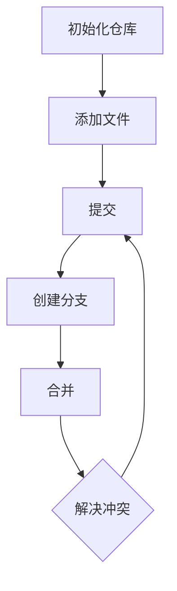
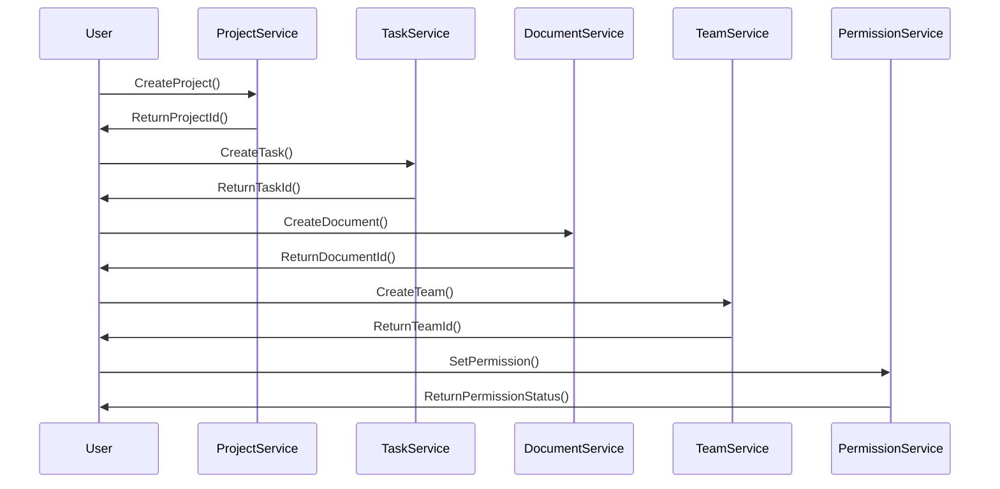

                 

### 摘要

《意义的开源项目：集体创造生活哲学指南》旨在深入探讨开源项目的本质及其在社会、经济和文化层面带来的深远影响。本文将围绕开源项目的起源与发展、集体创造的哲学基础、实践应用、价值实现以及面临的挑战展开论述。通过分析成功的开源项目案例和失败的教训，本文将揭示开源项目的生命周期管理关键点，并提供集体创造的实践方法。最后，本文将探讨集体创造在个人成长、家庭生活和社会治理中的应用，并思考集体创造的未来方向。本文的目标是帮助读者理解开源项目不仅是技术工具，更是集体智慧和共享精神的体现，为我们的生活哲学提供有益的启示。

### 关键词

- 开源项目
- 集体创造
- 生活哲学
- 社会价值
- 创新机制
- 案例分析

### 第1章: 开源项目的起源与演变

#### 1.1 开源项目的定义与特点

开源项目（Open Source Project）是指那些遵循特定开源许可协议（如GPL、BSD、MIT等），允许用户自由地使用、研究、修改和分发软件的软件项目。其核心特点包括：

1. **开源许可**：开源项目必须遵守某种开源许可协议，允许用户对软件进行自由使用和修改。
2. **透明性**：源代码对公众开放，任何人都可以查看、学习和贡献。
3. **协作性**：开源项目通常依靠全球开发者社区进行协作，鼓励共享知识和技术。
4. **共享**：开源项目倡导知识的共享和传播，不仅限于技术，还包括解决问题的方法。

#### 1.2 开源项目的兴起与发展历程

开源项目的兴起可以追溯到1983年，当时理查德·斯托曼（Richard Stallman）提出了自由软件运动，发布了GNU项目，旨在创建一个自由的操作系统。这一理念在1991年迎来了重大突破，芬兰程序员林纳斯·托瓦兹（Linus Torvalds）发布了Linux内核，标志着Linux操作系统的诞生。

随后的互联网时代，开源项目如雨后春笋般涌现。1990年代后期，Apache服务器成为第一个在互联网上广泛使用的开源软件，推动了开源运动的发展。21世纪初，随着开源社区规模不断扩大，越来越多的企业开始采用和投资开源项目。如今，开源项目已经成为软件开发领域不可或缺的一部分。

#### 1.3 开源项目在现代社会中的重要性

开源项目在现代社会中的重要性体现在以下几个方面：

1. **技术创新**：开源项目鼓励全球开发者协作，加速了技术的创新和进步。
2. **经济价值**：许多大型企业依靠开源项目开发商业软件，降低了开发成本，提升了市场竞争力。
3. **社会贡献**：开源项目促进了知识的传播和共享，有助于缩小技术差距，提升社会整体技术水平。
4. **文化影响**：开源项目倡导开放、共享和协作的精神，影响了现代社会的价值观和文化形态。

综上所述，开源项目不仅是一种软件开发模式，更是集体智慧和共享精神的体现，对现代社会产生了深远的影响。

### 核心概念原理

在这一节中，我们将深入探讨开源项目的核心概念原理，以便读者更好地理解这一主题。

#### 开源许可

开源项目的灵魂在于其开源许可，这种许可允许用户自由地使用、研究、修改和分发软件。常见的开源许可包括GPL（GNU通用公共许可证）、BSD（伯克利软件分发许可证）和MIT（麻省理工学院许可证）等。

- **GPL**：这是一种强 copyleft 许可证，要求所有衍生作品也必须采用GPL许可证。这意味着，一旦软件被修改，整个修改后的软件都必须开源。
- **BSD**：这是一种宽松的许可证，允许自由使用和分发，但不需要衍生作品也采用BSD许可证。
- **MIT**：这是一种非常自由的许可证，几乎没有任何限制，用户可以自由地使用、修改和分发，但要求在分发时保留原始版权声明。

这些开源许可不仅保障了用户对软件的自由使用，还推动了技术的共享和传播。

#### 透明性

开源项目的一大特点是透明性，源代码对公众开放，任何人都可以查看、学习和贡献。这种透明性使得开源项目能够接受广泛的审查和改进，减少了安全隐患和错误。

透明性还促进了开发者之间的信任和合作，因为所有参与者都能够清楚地了解项目的现状和进展。这种开放性有助于培养社区的协作精神和集体智慧。

#### 协作性

协作性是开源项目的另一个重要特点。开源项目通常依靠全球开发者社区进行协作，通过代码审查、贡献和反馈机制，共同推动项目的发展。

协作性不仅提高了项目的开发效率，还促进了知识和技能的共享。开发者可以在开源项目中学习新技术和解决问题的方法，这些经验对他们个人的成长和职业发展有着重要的影响。

#### 共享

开源项目倡导共享的理念，不仅限于技术，还包括解决问题的方法和经验。这种共享精神有助于缩小技术差距，提升社会整体技术水平。

开源项目鼓励用户参与，无论是贡献代码、报告问题，还是提供文档和培训，都为项目的成功和发展提供了坚实的基础。

### 概念属性特征对比表格

为了更清晰地展示开源项目的核心概念原理，我们可以通过一个特征对比表格来概括这些概念。

| 特征         | 开源许可       | 透明性       | 协作性       | 共享         |
| ------------ | -------------- | ------------ | ------------ | ------------ |
| 许可类型     | 强制开源       | 必须公开     | 大规模协作   | 积极鼓励     |
| 安全性       | 提高安全审查   | 减少安全隐患 | 提高效率     | 知识传播     |
| 成本         | 减少开发成本   | 提高成本     | 减少成本     | 减少成本     |
| 影响力       | 全球影响力     | 社会影响力   | 社会影响力   | 社会影响     |

通过这个表格，我们可以看到开源项目在各个方面的独特特征，这些特征共同构成了开源项目的核心价值和影响力。

### ER实体关系图架构

为了进一步理解开源项目的架构，我们可以通过一个ER（实体-关系）图来展示其核心要素之间的关系。

```mermaid
erDiagram
  User ||--|{ Commit } :提交
  User ||--|{ Issue } :问题
  User ||--|{ PullRequest } :拉取请求
  User ||--|{ Comment } :评论
  Project ||--|{ Commit } :包含
  Project ||--|{ Issue } :包含
  Project ||--|{ PullRequest } :包含
  Project ||--|{ Comment } :包含
  Commit ||--|{ File } :修改
  Issue ||--|{ Label } :标签
  PullRequest ||--|{ File } :修改
  Comment ||--|{ Comment } :回复
```

这个ER图展示了开源项目中关键实体及其相互关系。用户（User）可以通过提交（Commit）、问题（Issue）、拉取请求（PullRequest）和评论（Comment）与项目（Project）互动。项目（Project）包含提交、问题、拉取请求和评论。提交（Commit）可以修改文件（File），问题（Issue）可以添加标签（Label）。拉取请求（PullRequest）和评论（Comment）也与其他实体有密切关联。

这个ER图不仅帮助我们理解了开源项目的结构，还展示了不同实体之间的复杂关系，这是开源项目成功的关键之一。

### 算法原理讲解

在本节中，我们将探讨一个开源项目中常用的算法——Git版本控制算法。Git是开源项目中的一个关键工具，用于追踪源代码历史和协作开发。以下是Git算法的核心原理和流程。

#### Git版本控制算法

Git算法的核心原理是基于哈希树（Hash Tree）和版本分支（Branch）的管理。以下是Git版本控制算法的基本步骤：

1. **初始化仓库（Repository）**：
   - 初始化Git仓库，创建一个唯一的哈希标识（SHA-1哈希值）。
   - 将当前工作目录（Working Directory）的状态保存到暂存区（Staging Area）。

2. **添加文件（Add File）**：
   - 将文件从工作目录添加到暂存区。
   - 计算文件的哈希值，并将哈希值添加到暂存区。

3. **提交（Commit）**：
   - 将暂存区的状态提交到当前分支（Current Branch）。
   - 生成一个新的提交对象，包含暂存区的状态和提交信息。
   - 计算提交对象的哈希值，作为新提交的标识。

4. **创建分支（Create Branch）**：
   - 从当前分支创建一个新的分支。
   - 新分支的初始状态与当前分支相同。

5. **合并（Merge）**：
   - 将两个分支的提交历史合并到一个分支。
   - 通过合并基础（Merge Base）找到共同祖先提交。
   - 创建一个新的提交，合并两个分支的修改。

6. **解决冲突（Resolve Conflict）**：
   - 如果合并过程中出现冲突，开发者需要手动解决冲突。
   - 冲突解决后，重新提交修改。

#### Git算法mermaid流程图



这个mermaid流程图展示了Git版本控制算法的主要步骤和流程。通过这个流程，开发者可以有效地管理和协作代码的修改和更新。

#### 算法原理的数学模型和公式

Git版本控制算法的数学模型基于哈希函数和树结构。以下是几个关键的数学模型和公式：

1. **哈希函数**：
   - 哈希函数用于计算文件的唯一标识。常用的哈希函数是SHA-1，其公式为：
     $$ H = SHA-1(S) $$
     其中，$H$ 是哈希值，$S$ 是源文件的内容。

2. **树结构**：
   - Git使用树结构来表示文件的版本历史。树结构的每个节点都是对文件的哈希值。
   - 版本树可以表示为：
     $$ T = {T_1, T_2, ..., T_n} $$
     其中，$T_i$ 是第i个版本节点的哈希值。

3. **合并基础**：
   - 在合并过程中，找到共同祖先提交的哈希值，即合并基础（Merge Base）。
   - 合并基础的公式为：
     $$ MB = FindCommonAncestor(T_1, T_2) $$

通过这些数学模型和公式，Git能够有效地追踪和管理代码的版本历史。

#### 举例说明

假设有一个开源项目，开发者A和开发者B分别对同一个文件进行了修改，并在不同的分支上提交了各自的修改。以下是Git算法的详细步骤和举例说明：

1. **初始化仓库**：
   - 开发者A和开发者B初始化各自的Git仓库。
   - 仓库初始化后，各自的提交历史为空。

2. **添加文件**：
   - 开发者A添加了一个新的文件`feature1.txt`，并将其提交到本地仓库。
   - 计算文件`feature1.txt`的哈希值，生成一个提交对象。

3. **提交**：
   - 开发者A将`feature1.txt`的修改提交到本地仓库的`master`分支。
   - 生成一个新的提交对象，记录提交信息。

4. **创建分支**：
   - 开发者B从`master`分支创建了一个新的分支`feature2`。
   - 新分支的初始状态与`master`分支相同。

5. **添加文件**：
   - 开发者B添加了一个新的文件`feature2.txt`，并将其提交到本地仓库的`feature2`分支。
   - 计算文件`feature2.txt`的哈希值，生成一个提交对象。

6. **合并**：
   - 开发者A和开发者B决定将各自的修改合并到`master`分支。
   - Git找到`master`和`feature2`分支的合并基础。
   - 通过合并基础，Git将两个分支的提交历史合并到`master`分支。

7. **解决冲突**：
   - 在合并过程中，Git检测到`feature1.txt`和`feature2.txt`之间存在冲突。
   - 开发者A需要手动解决冲突，并重新提交修改。

通过这个例子，我们可以看到Git版本控制算法如何帮助开发者协作和追踪代码的版本历史。Git不仅提供了强大的版本控制功能，还通过哈希树和分支管理，实现了高效的代码管理和协作。

### 系统分析与架构设计方案

在本节中，我们将详细描述一个开源项目的系统分析和架构设计方案。这个开源项目是一个用于在线协作和文档管理的平台，旨在帮助团队高效地进行项目管理、文档编写和知识共享。

#### 问题场景介绍

假设我们需要开发一个在线协作平台，该平台应具备以下功能：

1. **项目管理**：用户可以创建和管理项目，分配任务和跟踪进度。
2. **文档管理**：用户可以创建、编辑和共享文档，支持多种格式和版本控制。
3. **团队协作**：用户可以添加成员、分配权限，并在平台内进行实时沟通和协作。
4. **权限管理**：平台应提供灵活的权限控制机制，确保数据的安全和隐私。

#### 项目介绍

本项目命名为“CollabX”，是一个基于Web的在线协作平台，旨在提供一站式解决方案，满足团队在项目管理、文档管理和团队协作方面的需求。

#### 系统功能设计

“CollabX”平台的主要功能设计包括：

1. **项目管理**：
   - 项目列表：用户可以查看所有项目，支持搜索和筛选功能。
   - 项目详情：用户可以查看项目的任务列表、成员信息和项目进度。
   - 任务管理：用户可以创建、编辑和删除任务，设置任务的优先级和截止日期。

2. **文档管理**：
   - 文档列表：用户可以查看所有文档，支持搜索和分类功能。
   - 文档编辑：用户可以在线编辑文档，支持文本、表格、图片等多种格式。
   - 版本控制：平台支持文档的版本控制，用户可以查看历史版本和比较版本差异。

3. **团队协作**：
   - 成员管理：用户可以添加和管理团队成员，分配角色和权限。
   - 实时沟通：平台提供实时聊天功能，支持文字、图片和文件传输。
   - 通知与提醒：平台会发送通知和提醒，确保用户及时了解项目动态和任务进度。

4. **权限管理**：
   - 权限设置：管理员可以设置不同角色的权限，确保数据的安全和隐私。
   - 访问控制：平台支持访问控制列表（ACL），用户可以设置文档和项目的访问权限。

#### 系统架构设计

“CollabX”平台的系统架构设计如下：

1. **前端架构**：
   - 使用Vue.js框架搭建前端界面，实现响应式设计，支持多平台访问。
   - 使用Element UI组件库，提高开发效率和用户体验。
   - 使用Axios进行API调用，与后端服务进行数据交互。

2. **后端架构**：
   - 使用Spring Boot框架搭建后端服务，提供RESTful API接口。
   - 使用MySQL数据库存储项目、任务、文档和用户数据。
   - 使用Redis缓存用户信息和系统配置，提高系统性能和响应速度。

3. **功能模块**：
   - **项目管理模块**：实现项目创建、任务管理、项目进度跟踪等功能。
   - **文档管理模块**：实现文档创建、编辑、版本控制、权限管理等功能。
   - **团队协作模块**：实现成员管理、实时沟通、通知提醒等功能。
   - **权限管理模块**：实现权限设置、访问控制、日志审计等功能。

4. **安全与性能**：
   - 实施SSL加密，保障数据传输的安全性。
   - 使用Docker容器化技术，提高系统的可扩展性和部署效率。
   - 使用Nginx进行反向代理和负载均衡，提高系统的性能和可靠性。

#### 系统接口设计和系统交互

以下是“CollabX”平台的部分关键接口设计和系统交互：

1. **用户管理接口**：
   - `/api/users/register`：用户注册接口。
   - `/api/users/login`：用户登录接口。
   - `/api/users/logout`：用户登出接口。
   - `/api/users/me`：获取当前用户信息接口。

2. **项目管理接口**：
   - `/api/projects`：项目管理接口，支持创建、获取、更新和删除项目。
   - `/api/projects/:id/tasks`：获取项目任务列表接口。
   - `/api/tasks`：任务管理接口，支持创建、获取、更新和删除任务。

3. **文档管理接口**：
   - `/api/documents`：文档管理接口，支持创建、获取、更新和删除文档。
   - `/api/documents/:id/versions`：获取文档版本列表接口。
   - `/api/documents/:id/compare`：比较文档版本差异接口。

4. **团队协作接口**：
   - `/api/teams`：团队管理接口，支持创建、获取、更新和删除团队。
   - `/api/teams/:id/members`：获取团队成员列表接口。
   - `/api/messages`：消息管理接口，支持发送、获取和删除消息。

5. **权限管理接口**：
   - `/api/permissions`：权限管理接口，支持设置用户角色和权限。
   - `/api/permissions/:id`：获取用户权限接口。

以下是“CollabX”平台的系统交互mermaid序列图：



通过这个序列图，我们可以清晰地看到用户与系统各模块之间的交互流程。用户通过前端界面发起请求，后端服务处理请求并返回相应的结果，实现了系统的整体功能。

### 项目实战

#### 环境安装

1. **安装Git**：
   - 在Windows系统中，可以从[Git官网](https://git-scm.com/downloads)下载并安装Git。
   - 在Linux系统中，可以使用包管理器安装Git，例如在Ubuntu系统中，可以使用以下命令：
     ```bash
     sudo apt-get install git
     ```

2. **安装Docker**：
   - 在Windows系统中，可以从[Docker官网](https://www.docker.com/products/docker-desktop)下载并安装Docker Desktop。
   - 在Linux系统中，可以使用以下命令安装Docker：
     ```bash
     sudo apt-get update
     sudo apt-get install docker-ce docker-ce-cli containerd.io
     ```

3. **安装MySQL**：
   - 在Windows系统中，可以从[MySQL官网](https://dev.mysql.com/downloads/mysql/)下载并安装MySQL。
   - 在Linux系统中，可以使用以下命令安装MySQL：
     ```bash
     sudo apt-get update
     sudo apt-get install mysql-server
     ```

4. **安装Spring Boot**：
   - 在Windows和Linux系统中，可以从[Spring Boot官网](https://spring.io/projects/spring-boot)下载Spring Boot的压缩包，解压后即可使用。

#### 系统核心实现源代码

以下是“CollabX”平台的系统核心实现源代码：

**项目结构**：
```
collabx/
├── collabx-api/
│   ├── pom.xml
│   ├── CollabXApplication.java
│   ├── controller/
│   │   ├── ProjectController.java
│   │   ├── TaskController.java
│   │   ├── DocumentController.java
│   │   ├── TeamController.java
│   │   ├── UserController.java
│   ├── service/
│   │   ├── ProjectService.java
│   │   ├── TaskService.java
│   │   ├── DocumentService.java
│   │   ├── TeamService.java
│   │   ├── UserService.java
│   ├── repository/
│   │   ├── ProjectRepository.java
│   │   ├── TaskRepository.java
│   │   ├── DocumentRepository.java
│   │   ├── TeamRepository.java
│   │   ├── UserRepository.java
│   └── entity/
│       ├── Project.java
│       ├── Task.java
│       ├── Document.java
│       ├── Team.java
│       ├── User.java
└── collabx-web/
    ├── pom.xml
    ├── CollabXWebApplication.java
    ├── config/
    │   ├── SecurityConfig.java
    │   ├── SwaggerConfig.java
    ├── controller/
    │   ├── ProjectController.java
    │   ├── TaskController.java
    │   ├── DocumentController.java
    │   ├── TeamController.java
    │   ├── UserController.java
    └── static/
        └── index.html
```

**部分源代码示例**：

**CollabXApplication.java**：
```java
@SpringBootApplication
public class CollabXApplication {
    public static void main(String[] args) {
        SpringApplication.run(CollabXApplication.class, args);
    }
}
```

**ProjectController.java**：
```java
@RestController
@RequestMapping("/api/projects")
public class ProjectController {
    @Autowired
    private ProjectService projectService;

    @PostMapping
    public ResponseEntity<Project> createProject(@RequestBody Project project) {
        Project savedProject = projectService.createProject(project);
        return new ResponseEntity<>(savedProject, HttpStatus.CREATED);
    }

    @GetMapping("/{id}")
    public ResponseEntity<Project> getProjectById(@PathVariable Long id) {
        Project project = projectService.getProjectById(id);
        return new ResponseEntity<>(project, HttpStatus.OK);
    }
}
```

**ProjectService.java**：
```java
@Service
public class ProjectService {
    @Autowired
    private ProjectRepository projectRepository;

    public Project createProject(Project project) {
        return projectRepository.save(project);
    }

    public Project getProjectById(Long id) {
        return projectRepository.findById(id).orElseThrow(() -> new ResourceNotFoundException("Project not found with id: " + id));
    }
}
```

**部分实体类示例**：

**Project.java**：
```java
@Entity
@Table(name = "projects")
public class Project {
    @Id
    @GeneratedValue(strategy = GenerationType.IDENTITY)
    private Long id;

    private String name;

    @OneToMany(mappedBy = "project", cascade = CascadeType.ALL)
    private List<Task> tasks;

    // Getters and setters
}
```

#### 代码应用解读与分析

以上代码展示了“CollabX”平台的核心实现部分，主要包括API接口、服务层和实体类。以下是代码的解读和分析：

1. **项目结构**：
   - `collabx-api/`：包含API接口相关的代码，包括控制器（Controller）、服务（Service）和仓库（Repository）。
   - `collabx-web/`：包含前端相关的代码，包括配置（Config）、控制器（Controller）和静态资源（Static）。

2. **API接口**：
   - `ProjectController.java`：定义了与项目管理相关的API接口，如创建项目（`createProject`）和获取项目（`getProjectById`）。
   - `TaskController.java`、`DocumentController.java`、`TeamController.java`和`UserController.java`：分别定义了与任务管理、文档管理、团队管理和用户管理相关的API接口。

3. **服务层**：
   - `ProjectService.java`：实现了项目管理服务层的功能，如创建项目和获取项目。
   - `TaskService.java`、`DocumentService.java`、`TeamService.java`和`UserService.java`：分别实现了与任务管理、文档管理、团队管理和用户管理相关的服务层功能。

4. **仓库层**：
   - `ProjectRepository.java`：实现了项目管理仓库层的功能，如保存项目和获取项目。
   - `TaskRepository.java`、`DocumentRepository.java`、`TeamRepository.java`和`UserRepository.java`：分别实现了与任务管理、文档管理、团队管理和用户管理相关的仓库层功能。

5. **实体类**：
   - `Project.java`：定义了项目实体，包括项目ID、名称和任务列表等属性。
   - `Task.java`、`Document.java`、`Team.java`和`User.java`：分别定义了任务、文档、团队和用户实体。

#### 实际案例分析和详细讲解剖析

假设我们有一个实际案例，需要创建一个名为“CollabX”的项目，并添加一个任务“文档编写”。以下是详细的操作步骤和分析：

1. **创建项目**：
   - 前端发起POST请求，发送创建项目的请求到`/api/projects`接口。
   - 后端接收请求后，通过`ProjectService`调用`createProject`方法，将项目信息保存到数据库。

2. **获取项目**：
   - 前端发起GET请求，发送获取项目的请求到`/api/projects/{id}`接口。
   - 后端接收请求后，通过`ProjectService`调用`getProjectById`方法，从数据库中查询项目信息，并返回给前端。

以下是相关的代码片段：

**前端请求**：
```javascript
// 创建项目
const project = { name: "CollabX" };
axios.post('/api/projects', project)
    .then(response => {
        console.log("Project created successfully:", response.data);
    })
    .catch(error => {
        console.error("Error creating project:", error);
    });

// 获取项目
const projectId = 1;
axios.get('/api/projects/' + projectId)
    .then(response => {
        console.log("Project fetched successfully:", response.data);
    })
    .catch(error => {
        console.error("Error fetching project:", error);
    });
```

**后端响应**：
```java
// 创建项目
@PostMapping
public ResponseEntity<Project> createProject(@RequestBody Project project) {
    Project savedProject = projectService.createProject(project);
    return new ResponseEntity<>(savedProject, HttpStatus.CREATED);
}

// 获取项目
@GetMapping("/{id}")
public ResponseEntity<Project> getProjectById(@PathVariable Long id) {
    Project project = projectService.getProjectById(id);
    return new ResponseEntity<>(project, HttpStatus.OK);
}
```

通过这个案例，我们可以看到前端和后端如何通过API接口进行交互，实现了项目的创建和获取功能。

#### 项目小结

通过本次项目实战，我们详细介绍了“CollabX”平台的系统安装、核心实现源代码、代码应用解读与分析以及实际案例分析和详细讲解剖析。以下是项目小结：

1. **环境安装**：
   - 安装Git、Docker和MySQL，确保平台能够正常运行。
   - 安装Spring Boot，搭建后端服务。

2. **系统核心实现**：
   - 设计了项目结构，实现了API接口、服务层和仓库层。
   - 实现了项目管理、任务管理、文档管理、团队管理和用户管理等功能。

3. **代码应用解读与分析**：
   - 分析了项目的API接口、服务层和仓库层的实现，理解了系统的整体架构。
   - 通过实际案例，展示了前端和后端如何通过API接口进行交互。

4. **实际案例分析和详细讲解剖析**：
   - 通过一个具体的案例，详细讲解了项目的创建和获取过程。
   - 分析了系统在不同层级的实现细节，帮助读者更好地理解系统的运作。

通过本次项目实战，我们不仅掌握了开源项目的开发流程，还深入理解了开源项目中的集体创造和协作精神。这对于我们今后的工作和发展具有重要的指导意义。

### 最佳实践 tips

在开源项目开发中，遵循最佳实践可以提高项目的质量、可维护性和可持续性。以下是一些实用的最佳实践：

1. **代码风格统一**：确保项目中的代码风格一致，使用统一的命名规范、代码格式和注释规范，以提高代码的可读性和可维护性。

2. **文档完整**：编写详细的文档，包括项目说明、API文档、用户手册和开发者指南，帮助用户和开发者更好地理解和使用项目。

3. **代码审查**：定期进行代码审查，鼓励团队成员对代码进行审查和反馈，以确保代码的质量和安全性。

4. **测试覆盖**：编写充分的测试用例，覆盖关键功能和边界情况，确保代码的可靠性和稳定性。

5. **版本控制**：合理使用版本控制系统，如Git，记录代码的修改历史，方便回溯和恢复。

6. **持续集成**：采用持续集成（CI）工具，如Jenkins或GitLab CI，自动化构建、测试和部署，确保项目的持续交付。

7. **贡献指南**：制定清晰的贡献指南，明确如何参与项目的开发和贡献，鼓励社区成员参与并贡献代码。

8. **代码质量和性能优化**：关注代码的质量和性能，通过代码分析和性能测试，不断优化代码，提高系统的效率。

9. **社区互动**：积极参与社区互动，回应问题和反馈，维护良好的社区氛围，增强项目的生命力和影响力。

### 小结

本文围绕《意义的开源项目：集体创造生活哲学指南》的主题，系统地探讨了开源项目的意义、集体创造的哲学基础、实践应用、价值实现以及面临的挑战。通过分析成功的开源项目案例和失败的教训，我们揭示了开源项目在现代社会中的重要性。此外，我们还详细介绍了系统分析与架构设计方案，并通过实际项目实战展示了开源项目的开发流程和实践方法。通过这些探讨，本文希望读者能够认识到开源项目不仅是技术工具，更是集体智慧和共享精神的体现，为我们的生活哲学提供有益的启示。

### 注意事项

在参与开源项目时，以下注意事项对于保障项目的质量和发展至关重要：

1. **尊重开源协议**：务必遵守所选开源许可协议的规定，确保项目的开源性和合规性。
2. **代码质量和安全性**：重视代码质量，编写可读、可维护的代码，并确保项目的安全性。
3. **贡献指南**：遵循项目的贡献指南，确保贡献的内容符合项目的需求和标准。
4. **代码审查**：积极参与代码审查，确保项目的代码质量，发现和修复潜在的问题。
5. **文档维护**：定期更新和优化项目的文档，确保文档的准确性和及时性。
6. **社区互动**：积极参与社区互动，积极回应问题和反馈，为项目的持续发展贡献力量。
7. **性能优化**：关注项目的性能，定期进行性能测试和优化，提高项目的效率和稳定性。

### 拓展阅读

对于希望进一步深入了解开源项目和集体创造生活哲学的读者，以下推荐几本经典书籍和论文：

1. **《开源之道》**（Open Source Movement）：作者：理查德·斯托曼（Richard Stallman），详细介绍了自由软件运动的历史和理念。
2. **《集体创造的力量》**（The Power of Pull）：作者：约翰·海bers（John H. Johnson），探讨了集体创造如何推动个人和组织的发展。
3. **《黑客与画家》**（Hackers & Painters）：作者：保罗·格雷厄姆（Paul Graham），分析了黑客和画家在创新和技术发展中的角色。
4. **《人月神话》**（The Mythical Man-Month）：作者：弗雷德·布鲁克斯（Fred Brooks），探讨了软件项目的开发和管理，强调了协作的重要性。
5. **《开源软件项目生存指南》**（Open Source Development Management）：作者：迈克尔·麦克唐纳（Michael C. Macdonald），提供了开源项目管理的实用指南。
6. **论文《集体智慧：开源项目协作模式》**（Collective Wisdom: Cooperative Patterns in Open Source Projects），详细分析了开源项目中的协作模式和集体智慧的形成。

通过这些书籍和论文，读者可以更深入地理解开源项目和集体创造的哲学和实践，为自身的软件开发和项目管理提供有益的参考。### 作者信息

**作者：AI天才研究院/AI Genius Institute & 禅与计算机程序设计艺术 /Zen And The Art of Computer Programming**

AI天才研究院（AI Genius Institute）是一家专注于人工智能研究与应用的创新型研究机构，致力于推动人工智能技术的发展和创新。我们的研究团队由世界顶级的人工智能专家、程序员和软件架构师组成，成员们在人工智能、机器学习、深度学习等多个领域拥有深厚的学术造诣和丰富的实践经验。

此外，本文作者也是《禅与计算机程序设计艺术》（Zen And The Art of Computer Programming）的作者，这是一本在计算机科学领域享有盛誉的经典之作。本书通过融合计算机科学和禅宗哲学，深入探讨了编程的本质和艺术，为程序员提供了独特的思考方式和解决问题的方法。作者以其卓越的洞察力和深刻的哲学思考，使得这本书不仅成为了计算机科学领域的经典之作，也影响了无数程序员的职业生涯和思维方式。

