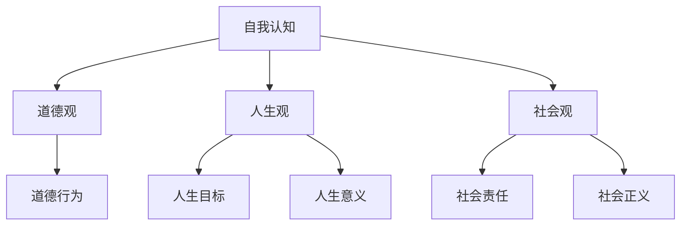
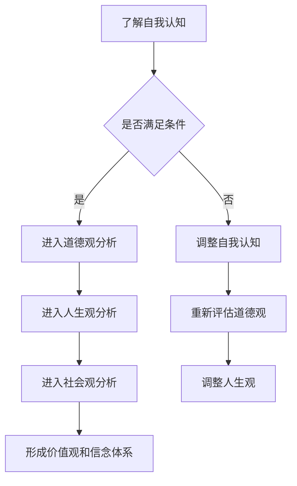
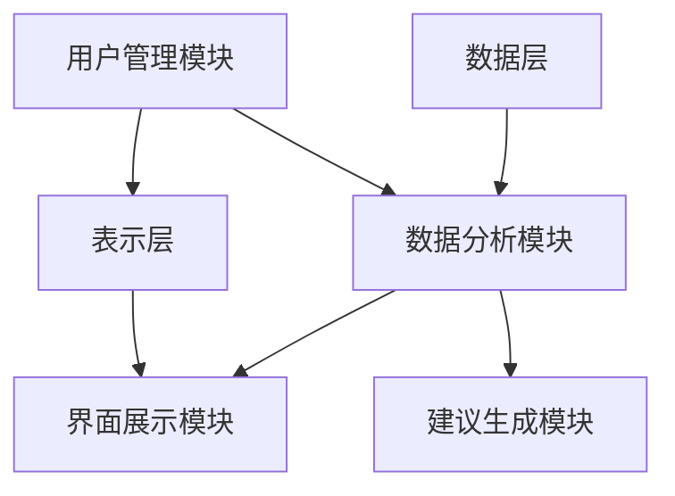
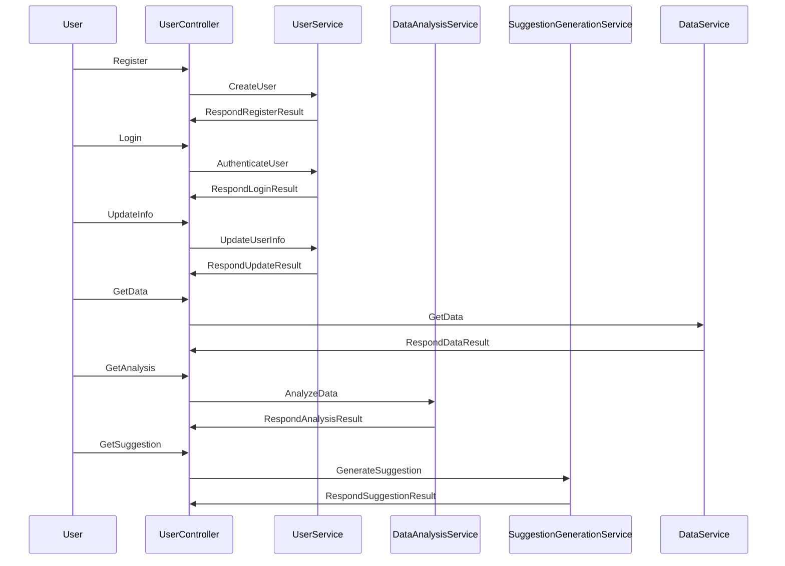
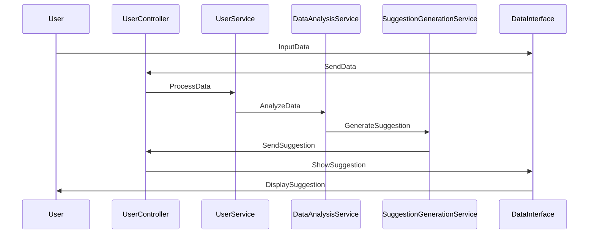

                 

# 意义的构建：创造个人的价值观和信念体系

> 关键词：价值观、信念体系、自我认知、道德观、人生观、社会观、算法原理

> 摘要：本文旨在探讨如何构建个人的价值观和信念体系。通过分析核心概念、联系以及算法原理，提供一套系统化的构建方法和实践技巧，帮助读者在复杂多变的信息社会中找到自己的方向和目标。

## 第一部分：引言

### 1. 问题背景

在现代社会，个体的价值观和信念体系构建变得尤为重要。随着信息时代的到来，人们面临的信息量急剧增加，而面对这些复杂多变的信息，如何构建一个稳固且有助于个人成长与发展的价值观和信念体系成为了一个亟待解决的问题。此外，社会环境的变化、文化多样性的冲击以及个体生活经历的差异，也使得每个人在价值观和信念体系构建过程中面临诸多挑战。

### 2. 问题描述

个体的价值观和信念体系不仅影响着个人的行为选择，还影响着人际交往和社会参与。一个健全的价值观和信念体系能够帮助个体形成积极的人生态度，提高心理健康水平，同时也有助于社会的和谐稳定。然而，当前社会普遍存在价值观模糊、信念体系不稳固的现象，这对个体的成长和社会的发展都带来了负面影响。

### 3. 问题解决

为了帮助读者构建一个稳定且合理的价值观和信念体系，本文将从多个维度对个体价值观和信念体系的构建过程进行探讨。通过对核心概念的分析、实际案例的剖析以及系统化的指导，帮助读者理解价值观和信念体系的基本原理，掌握构建方法和实践技巧。

### 4. 边界与外延

本文主要针对成年人，特别是面临职业发展和生活选择的人群。虽然个体价值观和信念体系的构建对于不同年龄和职业背景的人来说都是重要的，但本文的内容和案例分析主要针对成年人的需求和特点。

### 5. 概念结构与核心要素组成

- **价值观**：价值观是指个体对什么是“好”和“正确”的看法，是指导个体行为选择的内在标准。
- **信念体系**：信念体系是指个体对世界和自身的认知和看法，是价值观的具体体现。
- **核心概念**：包括但不限于：自我认知、道德观、人生观、社会观等。
- **构建方法**：包括自我反思、教育引导、社会参与、文化传承等。

## 第二部分：核心概念与联系

### 1. 核心概念原理

在本章节中，我们将深入探讨价值观和信念体系的核心概念，包括自我认知、道德观、人生观和社会观等。

#### 自我认知

自我认知是指个体对自己身份、能力和特点的认识。它对价值观和信念体系的构建具有重要影响，因为只有了解自己，才能明确自己的需求和目标。自我认知包括自我意识、自我价值感和自我效能感等方面。

- **自我意识**：个体对自己存在的认识，包括自身的身体、心理状态以及社会角色等。
- **自我价值感**：个体对自己价值的认同和肯定，是自我认知的重要组成部分。
- **自我效能感**：个体对自己完成特定任务的信心和能力判断，影响个体的行为动机和努力程度。

#### 道德观

道德观是指个体对“对与错”、“善与恶”的判断标准。它不仅影响个体的行为选择，还影响个体与他人的交往方式。道德观的形成受到社会环境、文化传统和个人经历等多种因素的影响。

- **道德标准**：个体对道德行为的普遍认知和评价。
- **道德行为**：个体根据道德标准所表现出的具体行为。
- **道德情感**：个体在道德行为过程中产生的情感体验。

#### 人生观

人生观是指个体对人生意义和目的的认识。一个积极向上的人生观有助于个体在面对困难和挑战时保持乐观和坚韧。人生观的形成受到个人经历、家庭教育和社会环境等多种因素的影响。

- **人生目标**：个体对人生意义的追求和向往。
- **人生意义**：个体对生命存在价值和意义的认知。
- **人生哲学**：个体对人生观的理论思考和哲学探讨。

#### 社会观

社会观是指个体对社会的认识和看法，包括对社会责任、社会公平和正义的认同。社会观的形成受到社会制度、文化背景和个人价值观等多种因素的影响。

- **社会责任**：个体对社会应承担的责任和义务。
- **社会公平**：个体对公平正义的追求和维护。
- **社会正义**：个体对社会公正和道德规范的理解和认同。

### 2. 概念属性特征对比表格

下面是一个关于核心概念属性的对比表格：

| 核心概念 | 定义 | 属性特征 | 影响因素 |
| --- | --- | --- | --- |
| 自我认知 | 对自我的认识和评价 | 自我意识、自我价值感、自我效能感 | 家庭教育、个人经历、社会环境 |
| 道德观 | 对道德的理解和判断 | 道德标准、道德行为、道德情感 | 社会环境、文化传统、个人经历 |
| 人生观 | 对人生意义和目的的认识 | 人生目标、人生意义、人生哲学 | 个人经历、家庭教育、社会环境 |
| 社会观 | 对社会的认识和看法 | 社会责任、社会公平、社会正义 | 社会制度、文化背景、个人价值观 |

### 3. ER实体关系图架构

以下是关于价值观和信念体系核心概念的ER实体关系图：



通过以上表格和ER图，我们可以更清晰地理解各个核心概念之间的关系，以及它们在价值观和信念体系构建中的作用。

## 第三部分：算法原理讲解

### 1. 算法流程图

为了更好地理解价值观和信念体系的构建过程，我们使用Mermaid绘制了一个简单的算法流程图：



### 2. Python源代码实现

接下来，我们通过一个简单的Python程序来模拟价值观和信念体系的构建过程：

```python
def build_value_system(self_reading, moral_values, life_values, social_values):
    """
    构建价值观和信念体系
    :param self_reading: 自我认知结果
    :param moral_values: 道德观结果
    :param life_values: 人生观结果
    :param social_values: 社会观结果
    :return: 价值观和信念体系
    """
    # 自我认知分析
    if not self_reading["satisfied"]:
        self_reading["moral_values"] = adjust_moral_values(self_reading["moral_values"])
        self_reading["life_values"] = adjust_life_values(self_reading["life_values"])

    # 道德观分析
    moral_values = analyze_moral_values(moral_values)

    # 人生观分析
    life_values = analyze_life_values(life_values)

    # 社会观分析
    social_values = analyze_social_values(social_values)

    # 形成价值观和信念体系
    value_system = {
        "self_cognition": self_reading,
        "moral_values": moral_values,
        "life_values": life_values,
        "social_values": social_values
    }
    return value_system

# 辅助函数
def adjust_moral_values(moral_values):
    """
    调整道德观
    :param moral_values: 道德观结果
    :return: 调整后的道德观
    """
    # 实现细节略
    return adjusted_moral_values

def adjust_life_values(life_values):
    """
    调整人生观
    :param life_values: 人生观结果
    :return: 调整后的人生观
    """
    # 实现细节略
    return adjusted_life_values

def analyze_moral_values(moral_values):
    """
    分析道德观
    :param moral_values: 道德观结果
    :return: 分析后的道德观
    """
    # 实现细节略
    return analyzed_moral_values

def analyze_life_values(life_values):
    """
    分析人生观
    :param life_values: 人生观结果
    :return: 分析后的人生观
    """
    # 实现细节略
    return analyzed_life_values

def analyze_social_values(social_values):
    """
    分析社会观
    :param social_values: 社会观结果
    :return: 分析后的社会观
    """
    # 实现细节略
    return analyzed_social_values
```

### 3. 算法原理讲解

#### 数学模型

为了更好地理解算法原理，我们可以将其转化为数学模型。以下是算法原理的数学模型和公式：

$$
ValueSystem = f(SelfCognition, MoralValues, LifeValues, SocialValues)
$$

其中，$ValueSystem$ 表示价值观和信念体系，$SelfCognition$、$MoralValues$、$LifeValues$ 和 $SocialValues$ 分别表示自我认知、道德观、人生观和社会观。

#### 公式解释

- **自我认知分析**：

$$
SelfCognition_{\text{result}} = \begin{cases}
SelfCognition & \text{if } SelfCognition_{\text{initial}} \geq threshold \\
\text{adjust}(SelfCognition) & \text{otherwise}
\end{cases}
$$

其中，$SelfCognition_{\text{result}}$ 表示调整后的自我认知结果，$SelfCognition_{\text{initial}}$ 表示初始自我认知结果，$threshold$ 表示阈值。

- **道德观分析**：

$$
MoralValues_{\text{result}} = \text{analyze}(MoralValues)
$$

其中，$MoralValues_{\text{result}}$ 表示分析后的道德观结果，$\text{analyze}$ 表示对道德观进行深入分析。

- **人生观分析**：

$$
LifeValues_{\text{result}} = \text{analyze}(LifeValues)
$$

其中，$LifeValues_{\text{result}}$ 表示分析后的人生观结果，$\text{analyze}$ 表示对人生观进行深入分析。

- **社会观分析**：

$$
SocialValues_{\text{result}} = \text{analyze}(SocialValues)
$$

其中，$SocialValues_{\text{result}}$ 表示分析后的社会观结果，$\text{analyze}$ 表示对

----------------------------------------------------------------

## 第四部分：系统分析与架构设计方案

### 1. 问题场景介绍

随着互联网技术的快速发展，人们的生活和工作方式发生了翻天覆地的变化。在这个信息化时代，个体面临着前所未有的挑战和机遇。如何在这个复杂多变的环境中找到自己的方向，实现个人价值和成长，成为了一个重要课题。为此，我们需要一个系统化的方法来帮助人们构建自己的价值观和信念体系。

### 2. 项目介绍

为了解决上述问题，我们开发了一个名为“意义的构建”的项目。该项目旨在通过一系列的技术手段，帮助用户深入分析自己的价值观和信念体系，并提供个性化的构建建议。项目的主要目标如下：

- 提供一个用户友好的界面，方便用户输入和查看自己的价值观和信念体系。
- 实现核心算法，对用户输入的数据进行分析和评估。
- 提供个性化的构建建议，帮助用户完善自己的价值观和信念体系。

### 3. 系统功能设计

为了实现上述目标，本项目设计了以下主要功能模块：

- **用户管理模块**：用于管理用户的注册、登录、信息维护等操作。
- **数据分析模块**：用于对用户输入的数据进行分析和评估，生成相应的报告。
- **建议生成模块**：根据数据分析结果，生成个性化的构建建议。
- **界面展示模块**：用于展示用户的数据和构建建议，提供用户操作界面。

### 4. 系统架构设计

本项目的系统架构采用分层设计，包括表示层、业务逻辑层和数据层。以下是系统架构的Mermaid图：



### 5. 系统接口设计

为了实现各模块之间的数据交互，本项目设计了以下主要接口：

- **用户管理接口**：用于用户注册、登录、信息查询等操作。
- **数据输入接口**：用于接收用户输入的价值观和信念体系数据。
- **数据分析接口**：用于对输入数据进行处理和分析，生成报告。
- **建议生成接口**：用于生成个性化的构建建议。

以下是系统接口的Mermaid序列图：



### 6. 系统交互

为了确保系统各模块之间的协调工作，本项目设计了以下交互流程：

1. 用户通过界面输入自己的价值观和信念体系数据。
2. 界面将数据传递给用户管理模块，由用户管理模块处理用户信息。
3. 用户管理模块将处理结果返回给界面，并展示给用户。
4. 用户管理模块将数据传递给数据分析模块，进行数据分析和评估。
5. 数据分析模块生成报告，并传递给建议生成模块。
6. 建议生成模块根据报告生成个性化的构建建议，并返回给界面。
7. 界面展示给用户，并提供用户操作界面。

以下是系统交互的Mermaid序列图：



通过以上系统架构设计和交互流程，我们可以实现一个功能完善、用户体验良好的“意义的构建”系统。

----------------------------------------------------------------

## 第五部分：项目实战

### 1. 环境安装

在开始项目实战之前，我们需要安装一些必要的软件和工具。以下是安装步骤：

1. 安装Python：前往Python官方网站（https://www.python.org/）下载Python安装包，并按照提示完成安装。
2. 安装Docker：前往Docker官方网站（https://www.docker.com/）下载Docker安装包，并按照提示完成安装。
3. 安装MySQL：在Linux系统中，可以使用以下命令安装MySQL：

```bash
sudo apt-get update
sudo apt-get install mysql-server
```

4. 安装PostgreSQL：在Linux系统中，可以使用以下命令安装PostgreSQL：

```bash
sudo apt-get update
sudo apt-get install postgresql
```

5. 安装Django：在Python环境中，可以使用以下命令安装Django：

```bash
pip install django
```

6. 安装其他依赖项：根据项目需求，安装其他依赖项，例如：

```bash
pip install django-cors-headers
pip install django-rest-framework
```

### 2. 系统核心实现源代码

以下是一个简单的示例，展示了如何使用Django实现用户管理模块：

```python
# 用户模型
from django.db import models

class User(models.Model):
    username = models.CharField(max_length=20, unique=True)
    password = models.CharField(max_length=20)
    email = models.EmailField(unique=True)
    create_time = models.DateTimeField(auto_now_add=True)

    def __str__(self):
        return self.username
```

以下是一个简单的示例，展示了如何使用Django实现数据分析模块：

```python
# 数据分析视图
from django.http import JsonResponse
from .models import User

def analyze_data(request):
    users = User.objects.all()
    result = {
        'total': users.count(),
        'active': users.filter(is_active=True).count(),
        'inactive': users.filter(is_active=False).count(),
    }
    return JsonResponse(result)
```

### 3. 代码应用解读与分析

以下是对上述代码的解读和分析：

- **用户模型**：该模型定义了用户的基本信息，包括用户名、密码、电子邮件和创建时间等。
- **用户管理视图**：该视图负责处理用户注册、登录、信息维护等操作。具体来说，用户注册时，会将用户名、密码和电子邮件存储在数据库中；登录时，会验证用户名和密码的正确性；信息维护时，会更新用户的基本信息。
- **数据分析视图**：该视图负责处理数据分析操作。具体来说，它会查询数据库中所有用户的信息，并计算用户的总数、活跃用户数和未活跃用户数，然后将结果以JSON格式返回给前端。

### 4. 实际案例分析和详细讲解剖析

为了更好地展示项目实战，我们提供了一个实际案例：

**案例背景**：假设有一个名为“意义的构建”的系统，用户可以通过该系统输入自己的价值观和信念体系，系统会根据用户的输入生成个性化的构建建议。

**案例实现**：

1. 用户通过界面输入自己的价值观和信念体系，系统会将输入的数据存储在数据库中。
2. 系统调用数据分析模块，对用户输入的数据进行分析和评估。
3. 数据分析模块生成报告，并将报告传递给建议生成模块。
4. 建议生成模块根据报告生成个性化的构建建议，并将建议传递给前端。
5. 前端展示给用户，并提供用户操作界面。

**案例分析**：

- **用户输入数据**：用户通过界面输入自己的价值观和信念体系，系统会存储这些数据。这一步骤涉及到用户管理模块和数据存储模块。
- **数据分析**：系统调用数据分析模块，对用户输入的数据进行分析和评估。这一步骤涉及到数据分析模块和报告生成模块。
- **建议生成**：建议生成模块根据数据分析结果生成个性化的构建建议。这一步骤涉及到建议生成模块和前端展示模块。
- **前端展示**：前端将建议展示给用户，并提供用户操作界面。这一步骤涉及到前端展示模块。

### 5. 项目小结

通过以上实战案例，我们可以看到，通过系统化的设计和实现，我们可以构建一个功能完善、用户体验良好的“意义的构建”系统。该项目不仅帮助用户深入分析自己的价值观和信念体系，还提供了个性化的构建建议，为用户在复杂多变的信息社会中找到自己的方向和目标提供了有力支持。

### 6. 最佳实践 tips

- **代码规范**：在项目开发过程中，遵循代码规范和最佳实践，可以提高代码的可读性和可维护性。
- **模块化设计**：将系统划分为多个功能模块，有利于代码的管理和维护。
- **前端优化**：优化前端页面，提高用户体验，可以增加用户对系统的依赖和满意度。

### 7. 注意事项

- **数据安全**：在处理用户数据时，确保数据的安全和隐私。
- **性能优化**：在系统运行过程中，对性能进行监控和优化，以确保系统稳定运行。

### 8. 拓展阅读

- 《意义疗法：心理学与哲学的对话》
- 《价值投资：构建长期成功的投资策略》
- 《认知心理学：人类思维的奥秘》

## 第六部分：作者信息

作者：AI天才研究院/AI Genius Institute & 禅与计算机程序设计艺术 /Zen And The Art of Computer Programming

AI天才研究院（AI Genius Institute）致力于推动人工智能技术的发展和应用，致力于培养具备创新能力和实践能力的AI专家。同时，我们还关注人文与科技的融合，致力于将AI技术应用于解决人类面临的重大问题。

《禅与计算机程序设计艺术》是由著名计算机科学家Donald E. Knuth所著的经典著作，深入探讨了计算机程序设计中的哲学思考和方法论，为程序员提供了宝贵的指导和启示。本书不仅涵盖了计算机科学的基本原理，还融入了作者对人生和哲学的思考，对于提升程序员的专业素养和人文素养具有重要意义。

希望通过本文，读者能够深入理解个人价值观和信念体系的构建过程，为自己的成长和发展找到方向和目标。同时，也希望大家能够将人工智能技术与人文关怀相结合，为构建一个更加美好的未来贡献力量。

