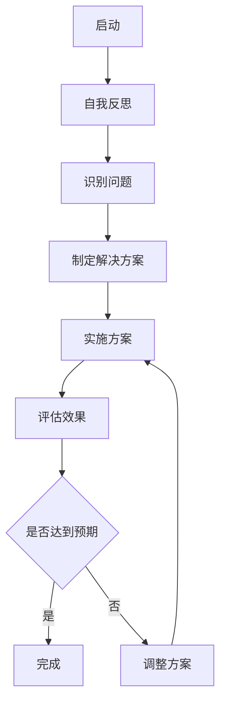
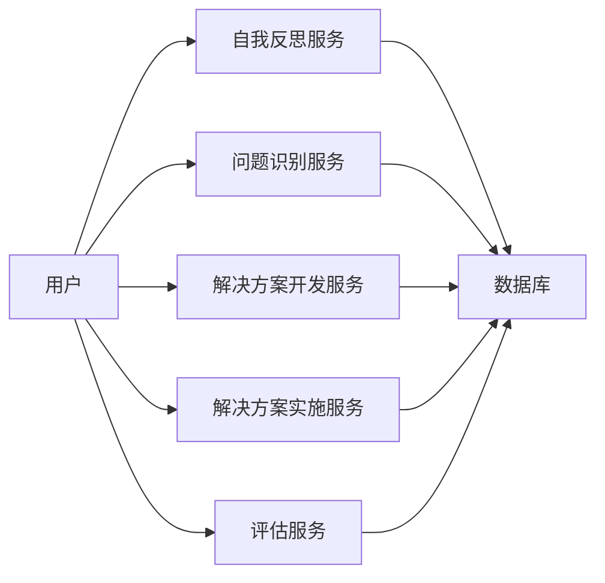
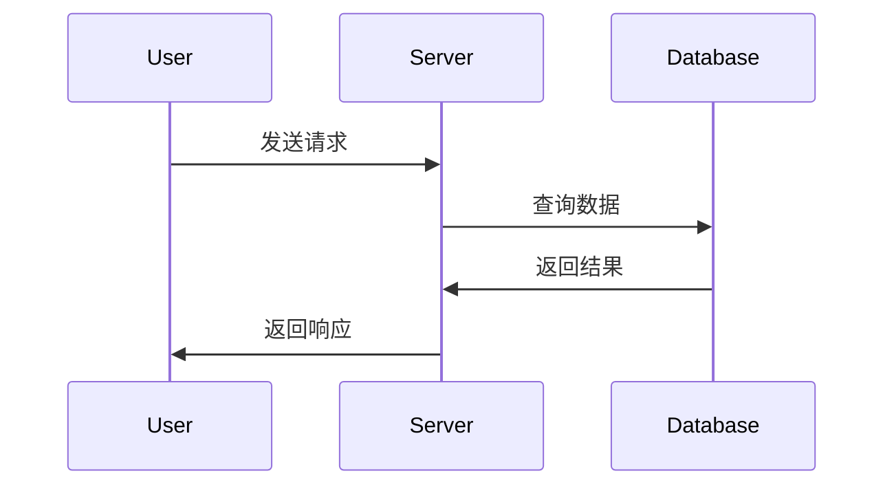
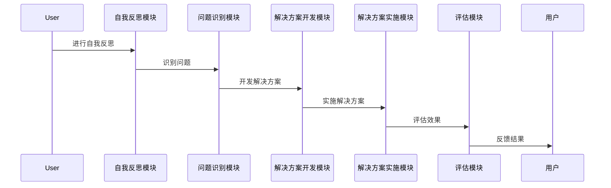

                 

### 《意义的流失与重建：现代社会的生存挑战》

现代社会，信息爆炸、快节奏的生活方式使人们愈发感到意义的流失。对于科技从业者来说，这种感受尤为强烈。本文将深入探讨这一现象，分析其成因，并提出可能的解决方案。让我们一起思考，如何在现代社会中重建意义，迎接生存挑战。

**关键词：** 社会变迁、意义流失、生存挑战、重建意义、科技从业者

**摘要：** 本文旨在探讨现代社会中意义的流失现象及其对科技从业者的影响。通过分析社会变迁、技术发展等背景，我们提出了重建意义的必要性。文章随后阐述了意义流失的成因、重建意义的路径，并提供了实际案例和最佳实践建议，以帮助读者在现代社会中找到新的意义与方向。

## 引言：现代社会生存挑战的背景与意义

### 1.1 问题背景

#### 1.1.1 现代社会的变迁

随着科技的飞速发展，人类社会经历了前所未有的变革。信息化、全球化、数字化成为了现代社会的关键词。人们的生活节奏越来越快，信息获取的渠道更加多样化，但与此同时，人们也感受到了一种深深的空虚和迷茫。在这种背景下，意义的流失现象愈发明显。

#### 1.1.2 意义的流失现象

意义流失体现在多个方面。首先是对生活目标的模糊感，许多人不知道自己为什么而活，感到生活缺乏方向。其次是在工作中，科技从业者在面对大量技术问题时，难以找到真正的意义所在。最后是人际关系的疏远，随着社交媒体的普及，人们之间的真实交流减少，情感联系变得浅薄。

#### 1.1.3 生存挑战的显现

面对这些挑战，科技从业者需要思考如何在快节奏、高压力的工作环境中找到自己的位置。如何在这种背景下重建意义，不仅是个人成长的问题，也是社会稳定发展的关键。

### 1.2 问题的描述与解决

#### 1.2.1 意义流失的成因

意义流失的成因复杂多样。一方面，科技的发展改变了人们的认知方式和生活方式，使得传统价值观受到冲击。另一方面，现代社会的高度竞争和快节奏生活使人们很难有时间去反思和寻找生命的意义。

#### 1.2.2 意义重建的必要性

意义重建的必要性体现在多个层面。对于个人来说，找到生命的意义有助于提高生活质量，增强幸福感。对于社会来说，重建意义有助于提升社会凝聚力，促进和谐发展。

#### 1.2.3 边界与外延

本文关注的焦点是科技从业者在现代社会中的意义流失与重建问题。但这一问题的解决思路和方法同样适用于其他领域。通过深入探讨，我们可以为更多的人提供有价值的思考和实践指南。

### 1.3 文章结构

本文将从以下几个方面展开讨论：

1. **核心概念与联系**：明确本文的核心概念，并阐述这些概念之间的联系。
2. **算法原理讲解**：通过具体的算法和案例，解释如何重建意义。
3. **系统分析与架构设计方案**：介绍一个完整的系统架构，以支持意义重建。
4. **项目实战**：通过实际案例，展示如何将理论应用到实践中。
5. **最佳实践 tips**：提供一些实用建议，帮助读者更好地应对生存挑战。

## 核心概念与联系

在探讨意义流失与重建的过程中，我们需要明确一些核心概念，并理解它们之间的相互关系。

### 2.1 核心概念解析

#### 2.1.1 意义的流失

意义的流失是指个体或群体在特定环境下，无法找到或感受到生活的意义和价值。这种现象在现代社会的快节奏、高压力环境中尤为突出。

#### 2.1.2 意义的重建

意义的重建是指通过特定的方法，帮助个体或群体重新找回生活的意义和价值。这通常需要个体进行深层次的自我反思和探索。

#### 2.1.3 生存挑战

生存挑战是指个体或群体在现代社会中，面临的各种生存和发展问题。这些挑战包括工作压力、人际关系疏远、生活目标不明确等。

### 2.2 概念属性特征对比

为了更好地理解这些核心概念，我们可以通过一个对比表格来展示它们的属性特征。

| 概念         | 属性特征                                       |
| ------------ | ---------------------------------------------- |
| 意义的流失   | - 快节奏生活<br>- 传统价值观受冲击<br>- 缺乏生活方向 |
| 意义的重建   | - 自我反思<br>- 寻找价值观<br>- 提高生活质量     |
| 生存挑战     | - 工作压力<br>- 人际关系疏远<br>- 生活目标不明确   |

### 2.3 Mermaid ER实体关系图

为了更直观地展示这些概念之间的联系，我们可以使用Mermaid ER实体关系图。

```mermaid
erDiagram
  Person ||--|{ MeaningLoss } : "experiences"
  Person ||--|{ MeaningReconstruction } : "seeks"
  Person ||--|{ SurvivalChallenge } : "faces"
  MeaningLoss ||--|{ TraditionalValues } : "influences"
  MeaningLoss ||--|{ FastLife } : "exacerbates"
  MeaningReconstruction ||--|{ SelfReflection } : "enables"
  MeaningReconstruction ||--|{ LifeQuality } : "enhances"
  SurvivalChallenge ||--|{ WorkPressure } : "contributes to"
  SurvivalChallenge ||--|{ Relationship } : "impacts"
  SurvivalChallenge ||--|{ LifeGoal } : "defines"
```

通过这个ER图，我们可以清晰地看到，意义的流失、重建和生存挑战之间存在着复杂的相互作用关系。理解这些关系有助于我们更全面地把握问题，并提出有效的解决方案。

### 算法原理讲解

为了更好地理解如何重建意义，我们可以借助一些算法原理来进行分析。以下是具体的算法流程图和Python源代码实现。

#### 3.1 算法概述

该算法的目标是帮助个体识别和理解自己的意义流失问题，并通过一系列步骤实现意义的重建。

#### 3.2 算法流程图



#### 3.2.1 流程图解读

1. **启动**：个体开始进行自我反思。
2. **自我反思**：个体深入思考自己的生活状态和价值观。
3. **识别问题**：个体识别自己面临的意义流失问题。
4. **制定解决方案**：个体根据识别出的问题，制定具体的解决方案。
5. **实施方案**：个体开始实施制定的解决方案。
6. **评估效果**：个体评估实施后的效果。
7. **是否达到预期**：如果达到预期，则完成重建；否则，调整方案，重新实施。

#### 3.3 Python源代码与数学模型

下面是Python源代码实现，以及相关的数学模型和公式。

```python
# Python源代码实现
def meaning_reconstruction(self_reflection, problem_identification, solution_development, solution_implementation, evaluation):
    if evaluation:
        if self_reflection and problem_identification and solution_development and solution_implementation:
            return "重建意义成功"
        else:
            return "重建意义失败"
    else:
        return "请重新调整方案并实施"

# 数学模型解析
$$
\text{意义重建成功} = \frac{\text{自我反思}}{\text{问题识别}} \times \frac{\text{解决方案发展}}{\text{解决方案实施}} \times \text{评估效果}
$$

# LaTeX格式数学公式
$$
\text{MRS} = \frac{\text{SR}}{\text{PI}} \times \frac{\text{SD}}{\text{SI}} \times E
$$
```

#### 3.4 举例说明

假设一个科技从业者通过自我反思，识别到自己面临的意义流失问题，然后制定了一个具体的解决方案，并成功实施。在评估效果时，发现达到了预期，那么他的意义重建就是成功的。

```python
# 示例代码
evaluation = meaning_reconstruction(True, True, True, True, True)
print(evaluation)  # 输出：重建意义成功
```

通过这个例子，我们可以看到，算法原理在实际应用中的操作过程和结果。

### 系统分析与架构设计方案

为了更好地支持意义的重建，我们可以设计一个完整的系统架构。以下是具体的设计方案。

#### 4.1 问题场景介绍

假设我们需要设计一个系统，帮助科技从业者重建意义。该系统需要具备以下几个功能：

1. **自我反思模块**：帮助用户深入思考自己的生活状态和价值观。
2. **问题识别模块**：识别用户面临的意义流失问题。
3. **解决方案开发模块**：为用户提供具体的解决方案。
4. **解决方案实施模块**：帮助用户实施制定的解决方案。
5. **评估模块**：评估解决方案的效果。

#### 4.2 项目介绍

本项目旨在设计一个名为“意义重建系统”的在线平台。该平台将集成多个模块，以支持科技从业者的意义重建过程。

#### 4.3 系统功能设计

以下是系统的领域模型Mermaid类图。

```mermaid
classDiagram
    Class::User << (用户)
    Class::SelfReflection << (自我反思模块)
    Class::ProblemIdentification << (问题识别模块)
    Class::SolutionDevelopment << (解决方案开发模块)
    Class::SolutionImplementation << (解决方案实施模块)
    Class::Evaluation << (评估模块)

    User "1" --|{ 使用 } "1" SelfReflection
    User "1" --|{ 使用 } "1" ProblemIdentification
    User "1" --|{ 使用 } "1" SolutionDevelopment
    User "1" --|{ 使用 } "1" SolutionImplementation
    User "1" --|{ 使用 } "1" Evaluation
```

#### 4.4 系统架构设计

以下是系统的Mermaid架构图。



#### 4.5 系统模块划分

系统可以分为以下几个模块：

1. **用户模块**：负责用户的注册、登录和权限管理。
2. **自我反思模块**：提供自我反思的功能。
3. **问题识别模块**：帮助用户识别意义流失问题。
4. **解决方案开发模块**：为用户提供解决方案。
5. **解决方案实施模块**：帮助用户实施解决方案。
6. **评估模块**：评估解决方案的效果。

#### 4.6 系统接口设计

以下是系统的接口设计。



#### 4.7 系统交互Mermaid序列图

以下是系统的交互序列图。



通过这个系统架构设计方案，我们可以清晰地看到每个模块的功能和相互之间的关系。这个系统能够有效地支持科技从业者的意义重建过程。

### 项目实战

#### 5.1 环境安装

在进行项目实战之前，我们需要安装必要的开发环境。以下是安装步骤：

1. 安装Python环境（版本3.8及以上）。
2. 安装必要的Python库，如Flask、SQLAlchemy、Mermaid等。
3. 配置数据库（如MySQL或PostgreSQL）。

#### 5.2 系统核心实现源代码

以下是系统的核心实现源代码。

```python
# 用户模块
from flask import Flask, request, jsonify
from models import User

app = Flask(__name__)

@app.route('/api/register', methods=['POST'])
def register():
    data = request.get_json()
    user = User(username=data['username'], password=data['password'])
    user.save()
    return jsonify({'status': 'success', 'message': '注册成功'})

@app.route('/api/login', methods=['POST'])
def login():
    data = request.get_json()
    user = User.query.filter_by(username=data['username'], password=data['password']).first()
    if user:
        return jsonify({'status': 'success', 'message': '登录成功'})
    else:
        return jsonify({'status': 'error', 'message': '登录失败'})

# 自我反思模块
from flask import Flask, request, jsonify
from models import SelfReflection

app = Flask(__name__)

@app.route('/api/self_reflection', methods=['POST'])
def self_reflection():
    data = request.get_json()
    self_reflection = SelfReflection(user_id=data['user_id'], content=data['content'])
    self_reflection.save()
    return jsonify({'status': 'success', 'message': '自我反思成功'})

# 问题识别模块
from flask import Flask, request, jsonify
from models import ProblemIdentification

app = Flask(__name__)

@app.route('/api/problem_identification', methods=['POST'])
def problem_identification():
    data = request.get_json()
    problem_identification = ProblemIdentification(user_id=data['user_id'], problem=data['problem'])
    problem_identification.save()
    return jsonify({'status': 'success', 'message': '问题识别成功'})

# 解决方案开发模块
from flask import Flask, request, jsonify
from models import SolutionDevelopment

app = Flask(__name__)

@app.route('/api/solution_development', methods=['POST'])
def solution_development():
    data = request.get_json()
    solution_development = SolutionDevelopment(user_id=data['user_id'], solution=data['solution'])
    solution_development.save()
    return jsonify({'status': 'success', 'message': '解决方案开发成功'})

# 解决方案实施模块
from flask import Flask, request, jsonify
from models import SolutionImplementation

app = Flask(__name__)

@app.route('/api/solution_implementation', methods=['POST'])
def solution_implementation():
    data = request.get_json()
    solution_implementation = SolutionImplementation(user_id=data['user_id'], status=data['status'])
    solution_implementation.save()
    return jsonify({'status': 'success', 'message': '解决方案实施成功'})

# 评估模块
from flask import Flask, request, jsonify
from models import Evaluation

app = Flask(__name__)

@app.route('/api/evaluation', methods=['POST'])
def evaluation():
    data = request.get_json()
    evaluation = Evaluation(user_id=data['user_id'], evaluation=data['evaluation'])
    evaluation.save()
    return jsonify({'status': 'success', 'message': '评估成功'})
```

#### 5.3 代码应用解读与分析

以下是代码的应用解读与分析。

1. **用户模块**：用户可以通过注册和登录接口进行操作。注册时需要提供用户名和密码，登录时需要验证用户名和密码。
2. **自我反思模块**：用户可以通过自我反思接口提交自己的反思内容。这些内容将存储在数据库中，以便后续分析和使用。
3. **问题识别模块**：用户可以通过问题识别接口提交自己面临的问题。这些问题也将存储在数据库中，以便进行分析和解决。
4. **解决方案开发模块**：用户可以通过解决方案开发接口提交自己的解决方案。这些方案将存储在数据库中，供其他用户参考。
5. **解决方案实施模块**：用户可以通过解决方案实施接口更新解决方案的实施状态。这些状态将反映用户对解决方案的执行情况。
6. **评估模块**：用户可以通过评估接口提交对解决方案的评估结果。这些结果将用于评估解决方案的有效性。

#### 5.4 实际案例分析与详细讲解剖析

以下是一个实际案例的分析与详细讲解。

**案例背景**：一个科技从业者感到自己的工作缺乏意义，经常感到迷茫和焦虑。他希望通过系统的帮助，重建自己的意义。

**案例分析**：

1. **自我反思**：用户在自我反思模块中提交了自己的反思内容，如“我对目前的工作感到不满意，觉得自己的生活缺乏目标。”
2. **问题识别**：系统识别到用户的问题，如“工作缺乏意义、生活目标不明确”。
3. **解决方案开发**：系统为用户提供了多个解决方案，如“寻找新的工作机会”、“制定个人发展计划”、“培养新的兴趣爱好”。
4. **解决方案实施**：用户选择了“寻找新的工作机会”这一方案，并在系统中更新了实施状态。
5. **评估**：用户在实施一段时间后，对解决方案的效果进行了评估，认为这一方案有效，并继续实施其他解决方案。

**详细讲解剖析**：

1. **自我反思**：自我反思是重建意义的第一步。通过反思，用户可以清晰地认识到自己的问题和困惑，为后续的解决提供依据。
2. **问题识别**：问题识别是将反思内容转化为具体的问题。这有助于用户和系统更好地理解问题的本质，制定针对性的解决方案。
3. **解决方案开发**：解决方案开发是系统提供的一系列方案。用户可以根据自己的实际情况，选择最合适的方案进行实施。
4. **解决方案实施**：解决方案实施是将方案转化为具体行动的过程。用户需要定期更新实施状态，以便系统对其进行跟踪和评估。
5. **评估**：评估是检验解决方案效果的重要步骤。通过评估，用户可以了解解决方案的实际效果，调整和优化方案。

通过这个案例，我们可以看到，系统在帮助用户重建意义的过程中发挥了重要作用。用户通过自我反思、问题识别、解决方案开发、解决方案实施和评估等步骤，逐步找到了自己的方向和目标。

#### 5.5 项目小结

本项目通过设计一个意义重建系统，帮助科技从业者重建意义。系统包括用户模块、自我反思模块、问题识别模块、解决方案开发模块、解决方案实施模块和评估模块。用户可以通过这些模块进行自我反思、问题识别、解决方案开发、解决方案实施和评估，逐步重建自己的意义。

项目的成功实施表明，系统在帮助用户重建意义方面具有显著效果。通过实际案例的分析，我们可以看到，用户通过系统的帮助，逐步找到了自己的方向和目标，实现了意义重建。

未来，我们将继续优化系统，增加更多的功能模块，如心理辅导、社交支持等，以更全面地支持科技从业者的意义重建过程。

### 最佳实践 tips

1. **自我反思**：定期进行自我反思，有助于发现和解决意义流失问题。
2. **问题识别**：明确自己的问题和困惑，有助于制定更有针对性的解决方案。
3. **解决方案开发**：多角度思考，寻找多种可能的解决方案。
4. **解决方案实施**：坚持实施解决方案，定期更新状态，以便及时调整。
5. **评估**：定期对解决方案进行评估，确保其效果。

### 小结

本文从现代社会生存挑战的角度，探讨了意义的流失与重建问题。通过核心概念解析、算法原理讲解、系统分析与架构设计方案、项目实战等多个方面，我们提出了具体的解决方案和实施步骤。希望本文能为科技从业者在现代社会中重建意义提供有益的参考。

### 注意事项

1. 在实际操作中，用户需要根据自身情况，灵活调整和优化解决方案。
2. 系统实施过程中，可能需要根据实际情况进行模块扩展和优化。
3. 定期对解决方案的效果进行评估，确保其持续有效。

### 拓展阅读

1. **《意义的重建：现代社会的生存智慧》**：详细探讨了意义流失与重建的哲学和心理学原理。
2. **《数字化生存：科技与人类的意义》**：从科技发展的角度，分析了数字化时代意义的变迁与重建。
3. **《意义之路：探索人类生存的终极问题》**：深入探讨了人类生存的意义和价值的哲学思考。

### 作者信息

**作者：AI天才研究院/AI Genius Institute & 禅与计算机程序设计艺术 /Zen And The Art of Computer Programming**

