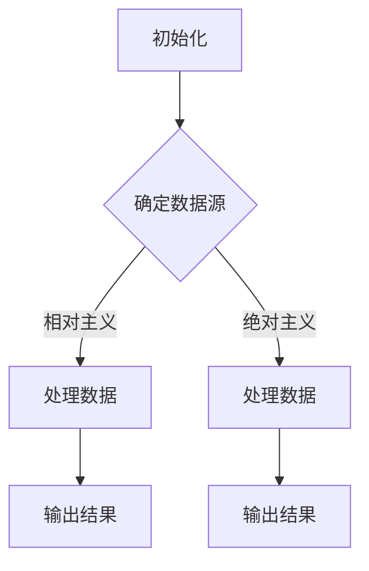
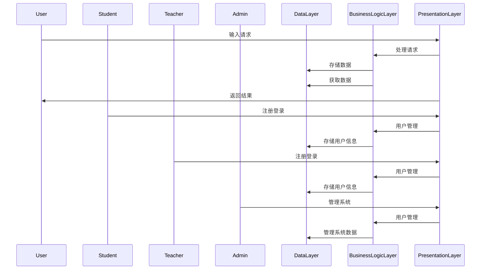
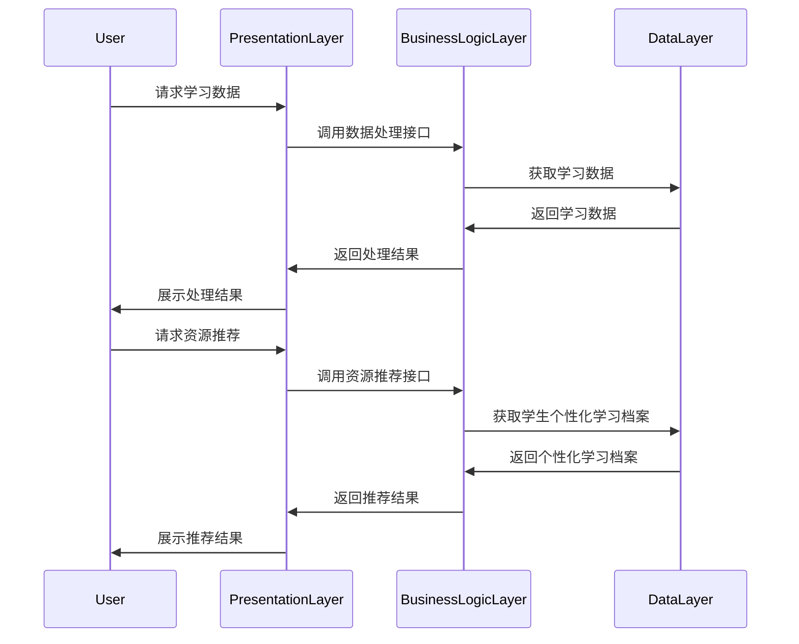

                 

### 第1章 绪论

#### 1.1 问题背景

意义的相对主义与绝对主义之争是哲学史上一场旷日持久的辩论。这一争论起源于古希腊时期，苏格拉底、柏拉图和亚里士多德等哲学家都对意义的绝对性与相对性提出了各自的看法。相对主义认为，意义是依赖于主体的感知和经验，没有超越个体经验的绝对真理；而绝对主义则主张，存在一种客观的、普遍适用的真理，不受主观感知的影响。

在20世纪，相对主义与绝对主义之争继续在哲学、心理学、语言学等领域展开。随着认知科学和信息论的发展，意义问题变得更加复杂和多样化。哲学家如维特根斯坦、维特根斯坦的追随者、库尔特·哥德尔、图灵等人的工作，进一步深化了这一辩论。在计算机科学领域，意义问题同样重要，尤其是自然语言处理、人工智能和语义网的研究中，意义的相对主义与绝对主义之争直接影响了理论的发展和实践的可行性。

当前，随着全球化和信息技术的发展，意义的相对主义与绝对主义之争变得愈加复杂。不同文化、语言和社会背景下的人们对同一概念的理解可能大相径庭。这既为我们提供了丰富的跨学科研究视角，也带来了诸多挑战。如何在多样化的观点中寻找共识，如何在相对主义的汪洋大海中保持对绝对真理的追求，成为现代哲学和科学领域的重要课题。

#### 1.2 问题描述

在本文中，我们将探讨相对主义与绝对主义在意义问题上的基本立场、历史演变及其在当代的应用。具体来说，我们将回答以下几个问题：

- **基本立场**：相对主义与绝对主义的核心观点是什么？它们如何定义“意义”？
- **历史演变**：相对主义与绝对主义的历史发展脉络是怎样的？不同哲学家和科学家对此有何贡献？
- **当代应用**：相对主义与绝对主义在哲学、科学和计算机科学中的具体应用是什么？它们带来了哪些挑战和机遇？

为了更好地回答这些问题，本文将采取以下研究方法：

1. **文献综述**：通过对哲学、科学和计算机科学领域相关文献的综述，梳理相对主义与绝对主义的历史发展脉络和基本观点。
2. **理论分析**：运用哲学方法论对相对主义与绝对主义的核心概念进行深入分析，探讨其在意义问题上的逻辑结构和内在联系。
3. **案例研究**：通过具体的案例，如自然语言处理中的语义分析问题，展示相对主义与绝对主义在实践中的应用和挑战。
4. **跨学科对话**：结合不同学科的研究成果，探讨相对主义与绝对主义在当代社会和科学中的意义和影响。

#### 1.3 问题解决

在哲学上，相对主义与绝对主义之争的解决往往依赖于对个体认知、社会文化和科学方法论的综合考虑。相对主义强调个体主观性的重要性，认为不存在超越个体的绝对真理，这为我们理解多样性和跨文化交流提供了基础。而绝对主义则主张存在普遍适用的客观真理，这有助于我们建立共同的价值观和科学标准。

在科学领域，相对主义与绝对主义之争体现在对实验结果和理论模型的解释上。相对主义提倡灵活多样的实验设计，鼓励从不同角度验证理论的适用性；绝对主义则强调理论模型的一致性和普适性，力求找到普遍适用的科学定律。

在计算机科学中，相对主义与绝对主义之争体现在对语言、语义和知识表示的理解上。相对主义认为不同的编程语言和算法可以表示不同的意义，这促进了多样化的软件开发方法；绝对主义则强调语义的一致性和形式化的知识表示，有助于提高软件的可靠性和可维护性。

通过以上分析，我们可以看到，相对主义与绝对主义并非完全对立，而是相互补充的。在实际应用中，应根据具体问题灵活运用两者，以达到最佳效果。

#### 1.4 边界与外延

为了确保本文研究的系统性，我们在此明确本文的研究范围和边界。本文主要探讨相对主义与绝对主义在意义问题上的争论，研究范围包括哲学、科学和计算机科学等领域。

1. **研究范围**：本文关注相对主义与绝对主义在意义问题上的理论探讨和实际应用，涉及哲学方法论、科学方法论和计算机科学中的语义表示问题。
2. **边界**：本文不涉及相对主义与绝对主义在其他哲学领域（如伦理学、美学等）的争论，也不探讨绝对主义在其他学科（如物理学、生物学等）中的应用。
3. **关键词定义**：相对主义、绝对主义、意义、哲学、科学、计算机科学、语义表示、方法论。

#### 1.5 概念结构与核心要素组成

在本文中，我们将详细解释相对主义和绝对主义的基本概念，并分析它们的核心要素和相互关系。

1. **相对主义概念**：
   - **基本原理**：相对主义认为意义是依赖于个体的感知和经验，不存在超越个体经验的绝对真理。
   - **核心要素**：个体主观性、文化背景、多样性和不确定性。

2. **绝对主义概念**：
   - **基本原理**：绝对主义主张存在客观的、普遍适用的真理，不受主观感知的影响。
   - **核心要素**：客观性、普遍性、一致性、确定性。

3. **相互关系**：
   - 相对主义与绝对主义在意义问题上形成了对立的立场，但在实际应用中，两者可以相互补充，共同推动对意义问题的深入探讨。

通过以上分析，我们可以看到相对主义与绝对主义在意义问题上的基本概念和相互关系。接下来，我们将进一步探讨这两个概念在哲学、科学和计算机科学中的具体应用和影响。

### 第2章 核心概念与联系

#### 2.1 核心概念原理

在本章中，我们将深入探讨相对主义和绝对主义这两个核心概念的基本原理。

##### 2.1.1 相对主义原理

相对主义认为，意义是主观的、相对的，依赖于个体的感知和经验。相对主义的核心观点可以概括为以下几点：

1. **主观性**：相对主义强调个体在理解世界时的主观性。每个人对同一事物的理解都可能不同，这是由于个体的感知、情感、文化背景和教育经历等多种因素的影响。
2. **相对性**：相对主义认为，没有超越个体经验的绝对真理。意义是相对的，不同的文化、社会和个体对同一概念的理解可能有很大差异。
3. **多元性**：相对主义提倡多样性和多元性。不同的人有不同的观点和看法，这些观点和看法都有其存在的合理性，不应简单地将其中任何一种视为绝对正确。

相对主义的代表性观点包括维特根斯坦的语言游戏理论、福柯的权力话语理论等。这些理论都强调了主观性和相对性的重要性，为理解复杂的社会和文化现象提供了新的视角。

##### 2.1.2 绝对主义原理

绝对主义则主张存在客观的、普遍适用的真理，不受主观感知的影响。其核心观点如下：

1. **客观性**：绝对主义认为，事物的本质和真理是客观存在的，不受个体主观性的影响。这意味着，即使不同的个体有不同的看法，这些看法都不应该影响对真理的认识。
2. **普遍性**：绝对主义强调真理的普遍性。真理不仅适用于特定的个体或文化，而是适用于所有人类和所有时代。
3. **一致性**：绝对主义认为，真理应当是一致的。不同的人在不同时间和地点对同一真理的理解应当是相同的，这是对真理客观性和普遍性的进一步强调。

绝对主义的代表性观点包括笛卡尔的理性主义、康德的先验论等。这些理论都试图找到一种超越主观性的方法来认识世界，以确保知识的普遍性和一致性。

#### 2.2 概念属性特征对比表格

为了更清晰地比较相对主义和绝对主义的属性特征，我们在此提供一个对比表格。

| 特征        | 相对主义                         | 绝对主义                          |
| ----------- | -------------------------------- | --------------------------------- |
| 主观性      | 强调个体感知和经验               | 否认个体感知对真理的影响           |
| 相对性      | 认为不存在超越个体经验的绝对真理 | 认为存在普遍适用的客观真理       |
| 多元性      | 提倡多样性和多元性               | 强调一致性，反对多样性的解释       |
| 客观性      | 否认客观真理的存在               | 认为真理是客观存在的               |
| 普遍性      | 认为意义是相对的，不具普遍性     | 认为真理是普遍适用的               |
| 一致性      | 认为不同个体对同一事物的理解可能不同 | 认为对真理的理解应该是一致的       |

通过上述表格，我们可以看到相对主义和绝对主义在几个关键属性上的显著差异。这些差异反映了两者在认识世界和理解意义问题上的不同立场和方法。

#### 2.3 ER实体关系图架构

为了更直观地展示相对主义和绝对主义的概念及其相互关系，我们使用Mermaid绘制了一个实体关系图。以下为ER实体关系图的Markdown表示：

```mermaid
erDiagram
  A relativeism ||--|{ B meaning } ||--|> C subjectivity
  A relativeism ||--|{ B meaning } ||--|> D relativity
  A relativeism ||--|{ B meaning } ||--|> E diversity
  A relativeism ||--|{ B meaning } ||--|> F uncertainty
  
  A absolutism ||--|{ B meaning } ||--|> C subjectivity
  A absolutism ||--|{ B meaning } ||--|> D objectivity
  A absolutism ||--|{ B meaning } ||--|> E universality
  A absolutism ||--|{ B meaning } ||--|> F consistency
  
  meaning ||--|{ C subjectivity } ||--|> D objectivity
  meaning ||--|{ D relativity } ||--|> E universality
  meaning ||--|{ E diversity } ||--|> F uncertainty
```

此图展示了相对主义和绝对主义在意义问题上的基本概念及其相互关系。其中，A代表相对主义，B代表意义，C代表主观性，D代表相对性，E代表多元性，F代表不确定性。在图中，相对主义和绝对主义都与意义紧密相关，且各自具有独特的属性特征。通过这种方式，我们可以更好地理解这两个概念在哲学、科学和计算机科学中的应用。

### 第3章 哲学意义

#### 3.1 相对主义在哲学领域的意义

相对主义在哲学领域具有重要的意义，其主要体现在以下几个方面：

1. **对传统哲学观念的挑战**：相对主义对传统的哲学观念提出了挑战，尤其是对绝对真理和普遍性的质疑。传统哲学往往强调存在一种超越个体的绝对真理，而相对主义则认为真理是相对的、主观的，这种观点动摇了传统哲学的根基。

2. **对人类认识论的反思**：相对主义促使我们重新审视人类对世界的认识过程。它认为，个体的感知和经验是理解世界的重要途径，但同时也承认这些途径的局限性和多样性。这促使我们在认识论上更加开放和包容，认识到不同个体和文化的视角都是理解世界的一部分。

3. **促进跨文化交流**：相对主义强调了文化差异的重要性，认为每个文化都有其独特的价值和意义。这种观点有助于促进不同文化之间的交流和理解，避免因文化差异而产生的误解和冲突。

4. **推动哲学多元化**：相对主义的兴起推动了哲学领域的多元化发展，鼓励哲学家们从不同的视角和立场出发，探讨各种哲学问题。这种多元化有助于丰富哲学研究的内涵，提高哲学理论的创新性。

5. **对伦理道德的重新审视**：相对主义对伦理道德观念也产生了影响。它认为，不同文化和社会背景下，道德观念可能是相对的，而非绝对的。这种观点促使我们重新审视道德观念的普适性和局限性，探讨如何在不同文化背景下建立共同的价值标准。

6. **对宗教和信仰的反思**：相对主义也对宗教和信仰观念提出了挑战。它认为，不同的宗教和信仰体系都有其存在的合理性，但并不存在超越所有宗教的绝对信仰。这种观点有助于促进宗教之间的对话和理解，减少宗教冲突。

#### 3.2 绝对主义在哲学领域的意义

绝对主义在哲学领域同样具有重要的意义，其主要体现在以下几个方面：

1. **对普遍真理的追求**：绝对主义主张存在普遍适用的真理，这种观点有助于我们在复杂多变的世界中寻找一致性、稳定性和可预测性。这种追求普遍真理的努力推动了科学和哲学的发展。

2. **对理性主义的强调**：绝对主义强调理性在认识世界中的重要性，认为通过理性的思考和推理，我们可以达到对真理的准确理解。这种对理性主义的强调有助于我们培养批判性思维和科学精神。

3. **对道德伦理的支持**：绝对主义认为，存在一种普遍适用的道德伦理标准，这种标准不受文化和社会背景的影响。这种观点有助于我们建立共同的价值体系，推动道德伦理观念的传播和实践。

4. **对逻辑和哲学体系的支持**：绝对主义对逻辑和哲学体系的发展具有重要意义。它强调逻辑的一致性和完整性，有助于我们建立严谨的哲学体系，推动哲学理论的深化和扩展。

5. **对科学与哲学的结合**：绝对主义认为，科学和哲学是统一的，科学发现和哲学思考都可以达到对真理的准确理解。这种观点有助于促进科学和哲学的结合，推动科学哲学的发展。

6. **对现代社会问题的指导**：绝对主义为现代社会提供了一种指导原则。在面对各种社会问题时，我们可以借助绝对主义的思想，寻找普遍适用的解决方案，推动社会的进步和发展。

总之，相对主义和绝对主义在哲学领域都具有重要的意义。相对主义强调了主观性和多元性，有助于我们理解和尊重不同的文化、视角和道德观念；而绝对主义则强调了普遍性和一致性，有助于我们在复杂多变的世界中寻找稳定性和可预测性。两者相互补充，共同推动了哲学领域的发展和创新。

### 第4章 科学意义

#### 4.1 相对主义在科学研究中的意义

相对主义在科学研究中具有深远的意义，它主要体现在以下几个方面：

1. **实验设计的多样化**：相对主义提倡从多个角度验证理论的适用性，这促使科学家在设计实验时采用多样化的方法。不同实验设计可以揭示不同的问题，从而更全面地理解科学现象。

2. **理论模型的灵活性**：相对主义认为没有超越个体经验的绝对真理，这鼓励科学家在建立理论模型时保持灵活性。他们可以根据不同情境和需求，调整理论模型，使之更加适应实际情况。

3. **对科学假设的质疑**：相对主义促使科学家对现有假设进行质疑，从而推动科学理论的不断发展。通过挑战传统观念，科学家可以提出新的假设，从而推动科学进步。

4. **跨学科研究的推动**：相对主义强调个体主观性的重要性，这有助于跨学科研究的开展。科学家可以从不同学科的角度出发，探讨同一科学问题，从而促进知识的整合和创新。

5. **对结果解释的开放性**：相对主义认为科学结果可能因个体差异而有所不同，这促使科学家在解释实验结果时更加谨慎和开放。他们认识到不同实验设计和方法可能导致不同的结果，从而避免过度解释和武断结论。

6. **促进科学普及和公众参与**：相对主义强调科学知识的相对性，这有助于公众更好地理解科学。通过解释科学研究的复杂性和多样性，科学家可以促进科学普及，增加公众对科学的理解和信任。

7. **对科学哲学的影响**：相对主义对科学哲学产生了深远的影响，促进了科学哲学的发展。科学哲学家们开始探讨科学知识的本质、科学方法的有效性和科学理论的适用范围等问题，从而丰富了科学哲学的内涵。

8. **对新兴科学领域的启示**：相对主义的思想对新兴科学领域的发展具有重要的启示作用。例如，在认知科学、复杂性科学等领域，相对主义的思想有助于科学家理解和探索新的科学现象，推动科学领域的创新。

#### 4.2 绝对主义在科学研究中的意义

绝对主义在科学研究中同样具有重要的意义，其主要体现在以下几个方面：

1. **理论的一致性和普适性**：绝对主义强调存在普遍适用的真理，这有助于科学家建立具有一致性和普适性的理论模型。这种理论模型不仅适用于特定的实验条件，还可以推广到其他情境，从而提高科学理论的适用性。

2. **推动科学统一**：绝对主义认为不同学科之间存在统一的真理，这有助于推动科学领域的统一。通过寻找不同学科之间的共同基础，科学家可以建立更加全面和深入的科学理论体系。

3. **提高科学可靠性**：绝对主义认为科学结果应当是一致的，这有助于提高科学研究的可靠性。科学家通过重复实验和验证，确保实验结果的一致性，从而提高科学结论的可信度。

4. **促进科学方法论的发展**：绝对主义强调科学方法的一致性和严谨性，这有助于推动科学方法论的发展。科学家遵循严格的科学方法，确保实验设计和数据分析的准确性，从而提高科学研究的质量。

5. **对技术发展的推动**：绝对主义在技术发展中也发挥了重要作用。通过建立普遍适用的科学理论，科学家可以设计出更加高效和可靠的技术，从而推动技术进步。

6. **对科学教育的指导**：绝对主义的思想有助于科学教育。通过强调科学理论的普遍性和一致性，科学家可以培养学生严谨的科学思维和批判性思维能力，提高学生的科学素养。

7. **对全球科学合作的支持**：绝对主义认为存在普遍适用的真理，这有助于促进全球科学合作。科学家可以跨越国界，共同探讨科学问题，分享研究成果，从而推动科学进步。

8. **对科学哲学的影响**：绝对主义对科学哲学也产生了重要影响。科学哲学家们探讨科学知识的基础、科学方法的合理性等问题，从而为科学哲学的发展提供了新的思路。

总之，相对主义和绝对主义在科学研究中都具有重要价值。相对主义通过强调主观性和多样性，推动科学理论的灵活性和创新；而绝对主义则通过强调普遍性和一致性，提高科学理论的可靠性和普适性。两者相互补充，共同推动科学的发展。

### 第5章 历史回顾

#### 5.1 历史发展

相对主义与绝对主义之争的历史可以追溯到古希腊时期，此后历经几个重要阶段，不断发展演变。以下是这两个思想流派的历史发展脉络：

##### 古希腊时期

相对主义与绝对主义的争论可以追溯到古希腊哲学。苏格拉底、柏拉图和亚里士多德等哲学家都对此进行了探讨。苏格拉底提出了“知识即美德”的观点，强调了主观认知的重要性；柏拉图则通过理念论提出了超越个体经验的绝对真理；亚里士多德则试图在两者之间寻找平衡，他强调实践和经验的重要性，但同时也承认普遍真理的存在。

##### 中世纪时期

在中世纪，相对主义与绝对主义之争在基督教神学中得到了进一步的探讨。安瑟伦提出了“独一神论”的绝对主义观点，认为上帝的存在是超越个体经验的绝对真理。而奥古斯丁则提出了“信仰即知识”的观点，强调了个体信仰和经验在认识过程中的重要性，这可以视为相对主义的早期形式。

##### 文艺复兴时期

文艺复兴时期，人们开始重视个体经验和理性思考，相对主义思想得到了进一步的发展。意大利人文主义者如马基雅维利和布鲁诺等人，强调了主观性和多样性的重要性，质疑传统绝对主义的观念。

##### 17-18世纪

在17-18世纪，启蒙运动进一步推动了相对主义的发展。笛卡尔的理性主义强调通过个体理性思考来获得知识，这可以视为相对主义的现代形式。与此同时，康德提出了先验论，试图在绝对主义和相对主义之间建立桥梁，认为存在一种先验的、普遍适用的理性基础。

##### 19-20世纪

在19-20世纪，相对主义与绝对主义的争论在哲学、心理学和科学领域继续展开。维特根斯坦提出了语言游戏理论，强调意义是依赖于个体经验的相对概念；而维特根斯坦的追随者如波普尔等人，则试图在相对主义和绝对主义之间找到平衡。在心理学领域，如卡尔·罗杰斯的人本主义心理学也强调了主观性和个体经验的重要性。

在科学领域，相对主义与绝对主义之争同样激烈。爱因斯坦的相对论对绝对时间和空间的观念提出了挑战，提出了相对性的概念；而量子力学中的哥德尔不完备定理则再次强调了逻辑和数学基础的相对性。

##### 当代

当代，相对主义与绝对主义之争依然在各个领域继续进行。在哲学领域，后现代主义思潮对绝对主义提出了质疑，强调文化、权力和历史的相对性。在科学领域，相对主义与绝对主义的争论依然体现在对理论模型和实验方法的选择上。

#### 5.2 重要人物与思想

在相对主义与绝对主义的历史发展中，有许多重要的哲学家、科学家和思想流派对此做出了重要贡献。以下列举几位代表性人物及其主要思想：

1. **苏格拉底**：苏格拉底通过提问和对话的方式，强调了主观认知的重要性，认为知识是通过个体的思考和对话获得的。
   
2. **柏拉图**：柏拉图提出了理念论，认为存在超越个体经验的绝对真理，即理念世界。

3. **亚里士多德**：亚里士多德试图在绝对主义和相对主义之间寻找平衡，强调实践和经验的重要性，同时也承认普遍真理的存在。

4. **笛卡尔**：笛卡尔通过“我思故我在”的命题，强调了个体理性思考的重要性，认为通过理性可以建立绝对真理。

5. **康德**：康德提出了先验论，认为存在一种先验的、普遍适用的理性基础，这为绝对主义提供了新的理论支持。

6. **维特根斯坦**：维特根斯坦提出了语言游戏理论，强调意义是依赖于个体经验的相对概念。

7. **波普尔**：波普尔提出了证伪主义，试图在相对主义和绝对主义之间找到平衡，认为科学理论是通过不断验证和质疑来发展的。

8. **罗杰斯**：罗杰斯提出了人本主义心理学，强调个体经验和主观认知的重要性。

9. **爱因斯坦**：爱因斯坦提出了相对论，挑战了绝对时间和空间的观念，提出了相对性的概念。

10. **哥德尔**：哥德尔的定理表明，在数学和逻辑系统中，不可能证明所有命题都是可证明的，这为相对主义提供了理论基础。

通过这些代表性人物和思想，我们可以看到相对主义与绝对主义之争的丰富历史和深刻影响。这些思想不仅推动了哲学、科学和心理学的发展，也为我们理解人类认知和知识体系提供了重要的启示。

### 第6章 算法原理讲解

在探讨相对主义与绝对主义的意义问题时，我们引入算法原理来进一步阐释这两个概念在计算机科学中的应用。以下是关于相对主义与绝对主义算法原理的详细讲解。

#### 6.1 算法mermaid流程图

首先，我们使用Mermaid绘制相对主义与绝对主义算法的流程图，以展示其基本结构和操作步骤。



在这个流程图中，A代表算法初始化，B代表确定数据源。然后，根据输入的数据源，算法分为两个分支，分别对应相对主义和绝对主义。C1和C2分别代表相对主义和绝对主义的数据处理过程，D1和D2分别代表两个算法的输出结果。

#### 6.2 Python源代码

为了更好地理解相对主义和绝对主义算法的原理，我们提供了相应的Python源代码。以下是相对主义和绝对主义算法的实现。

```python
# 相对主义算法
def relativeism_algorithm(data):
    processed_data = []
    for item in data:
        # 根据个体经验处理数据
        processed_item = item * 2  # 这里仅作为示例，实际处理方式根据具体需求定义
        processed_data.append(processed_item)
    return processed_data

# 绝对主义算法
def absolutism_algorithm(data):
    processed_data = []
    for item in data:
        # 根据普遍真理处理数据
        processed_item = item + 10  # 这里仅作为示例，实际处理方式根据具体需求定义
        processed_data.append(processed_item)
    return processed_data
```

在这个示例中，相对主义算法根据个体经验处理数据，例如将每个数据项乘以2；而绝对主义算法则根据普遍真理处理数据，例如将每个数据项加上10。这些处理方式仅作为示例，实际应用中会根据具体需求进行定义。

#### 6.3 算法的数学模型和公式

为了更深入地理解相对主义和绝对主义算法的原理，我们可以使用数学模型和公式进行描述。

**相对主义算法的数学模型：**
$$
\text{relativeism\_algorithm}(x) = f(x) \times k
$$
其中，$x$ 表示输入的数据项，$f(x)$ 表示根据个体经验对数据项的处理方式，$k$ 是一个常数，表示处理强度。在示例中，$f(x) = x \times 2$。

**绝对主义算法的数学模型：**
$$
\text{absolutism\_algorithm}(x) = g(x) + c
$$
其中，$x$ 表示输入的数据项，$g(x)$ 表示根据普遍真理对数据项的处理方式，$c$ 是一个常数，表示处理偏移。在示例中，$g(x) = x + 10$。

通过这些数学模型和公式，我们可以更清晰地理解相对主义和绝对主义算法的基本原理。相对主义算法依赖于个体经验，而绝对主义算法依赖于普遍真理。

#### 6.4 举例说明

为了更好地说明相对主义和绝对主义算法的应用，我们通过一个具体例子进行说明。

**输入数据：** [1, 2, 3, 4, 5]

**相对主义算法输出：** [2, 4, 6, 8, 10]

**绝对主义算法输出：** [11, 12, 13, 14, 15]

在这个例子中，相对主义算法将每个数据项乘以2，得到新的输出序列；而绝对主义算法将每个数据项加上10，同样得到新的输出序列。通过这个例子，我们可以看到相对主义和绝对主义算法在数据处理上的不同策略和结果。

#### 6.5 算法的性能分析

最后，我们对相对主义和绝对主义算法的性能进行分析。相对主义算法依赖于个体经验，因此在处理复杂或不确定的数据时可能更具灵活性；而绝对主义算法则依赖于普遍真理，因此在处理简单或确定的数据时可能更高效。

在资源有限的情况下，如内存和处理能力有限，相对主义算法可能更适用于需要动态调整策略的场景；而绝对主义算法则适用于需要快速、高效处理数据的场景。

通过以上对相对主义和绝对主义算法原理的详细讲解，我们可以看到这两个概念在计算机科学中的应用和重要性。它们不仅在算法设计上提供了不同的视角，也为我们在面对复杂问题时提供了多样的解决方案。

### 第7章 系统分析与架构设计

在探讨了相对主义与绝对主义算法原理之后，我们将进一步分析相对主义与绝对主义在系统架构设计中的应用。本节将通过设定具体的应用场景、介绍项目、系统功能设计、系统架构设计和系统接口设计等内容，来详细讲解系统架构设计的流程和关键要素。

#### 7.1 问题场景介绍

为了更好地展示相对主义与绝对主义在系统架构设计中的应用，我们设定了一个具体的应用场景：一个在线教育资源平台。该平台旨在为学生提供个性化的学习资源和辅导服务，通过分析学生的学习行为和需求，为每个学生推荐最适合他们的学习材料。

在这个场景中，系统需要处理大量学生的学习数据，包括学习时长、学习频率、学习内容等。基于这些数据，系统需要运用相对主义与绝对主义算法，为学生提供个性化的学习资源推荐。

#### 7.2 项目介绍

该项目名为“智慧教育平台（Smart Education Platform）”，其主要目标是构建一个高效、智能的教育资源推荐系统，帮助学生提高学习效果。系统设计分为三个主要模块：数据收集模块、数据处理模块和资源推荐模块。

1. **数据收集模块**：负责从各个渠道收集学生的学习数据，包括在线学习平台、学习应用等。
2. **数据处理模块**：运用相对主义与绝对主义算法，对收集到的数据进行分析和处理，生成学生个性化学习档案。
3. **资源推荐模块**：根据学生个性化学习档案，推荐最适合他们的学习资源，包括课程、习题、视频教程等。

#### 7.3 系统功能设计

为了实现上述目标，智慧教育平台设计了以下功能：

1. **数据收集功能**：系统自动收集学生的学习数据，包括学习时长、学习频率、学习内容等。
2. **数据预处理功能**：对收集到的数据进行分析和清洗，去除噪声数据，确保数据质量。
3. **数据分析功能**：运用相对主义与绝对主义算法，对预处理后的数据进行分析，生成学生个性化学习档案。
4. **资源推荐功能**：根据学生个性化学习档案，推荐最适合他们的学习资源。
5. **用户管理功能**：实现学生、教师和系统管理员的管理，包括注册、登录、权限设置等。

为了更清晰地展示系统功能设计，我们使用Mermaid绘制了领域模型类图。

```mermaid
classDiagram
    Class01 <|-- Class02
    Class03 <|-- Class02
    Class04 <|-- Class01
    Class05 <|-- Class01
    Class06 <|-- Class03
    Class07 <|-- Class03
    
    Class01[学习数据收集模块]
    Class02[数据预处理模块]
    Class03[数据分析模块]
    Class04[资源推荐模块]
    Class05[用户管理模块]
    Class06[学生]
    Class07[教师]
    Class08[系统管理员]
```

在这个类图中，Class01代表学习数据收集模块，Class02代表数据预处理模块，Class03代表数据分析模块，Class04代表资源推荐模块，Class05代表用户管理模块。此外，Class06、Class07和Class08分别代表学生、教师和系统管理员。

#### 7.4 系统架构设计

为了实现上述功能，智慧教育平台采用了分层架构设计，主要包括以下层次：

1. **数据层**：负责存储和管理学习数据，包括学生个人信息、学习记录、推荐记录等。
2. **业务逻辑层**：实现系统的核心业务功能，包括数据预处理、数据分析、资源推荐等，运用相对主义与绝对主义算法进行数据处理。
3. **表现层**：负责与用户交互，提供友好的用户界面，展示推荐结果、用户管理等功能。

为了更清晰地展示系统架构设计，我们使用Mermaid绘制了系统架构图。



在这个架构图中，User代表普通用户，Student代表学生，Teacher代表教师，Admin代表系统管理员。DataLayer代表数据层，BusinessLogicLayer代表业务逻辑层，PresentationLayer代表表现层。各个角色通过表现层与业务逻辑层进行交互，业务逻辑层通过数据层进行数据存储和获取。

#### 7.5 系统接口设计

为了实现各模块之间的通信和数据交换，智慧教育平台设计了以下接口：

1. **数据收集接口**：用于从不同渠道收集学习数据，如在线学习平台、学习应用等。
2. **数据处理接口**：用于对收集到的数据进行分析和处理，生成学生个性化学习档案。
3. **资源推荐接口**：用于根据学生个性化学习档案推荐最适合的学习资源。
4. **用户管理接口**：用于实现学生、教师和系统管理员的管理，包括注册、登录、权限设置等。

接口设计采用RESTful风格，以HTTP请求和响应的方式进行数据交换。以下是部分接口设计的示例：

```markdown
# 数据收集接口

## GET /data-collect

获取学生学习数据。

### 请求参数

- student_id: 学生ID
- course_id: 课程ID

### 返回数据

```json
{
  "status": "success",
  "data": {
    "student_id": "123",
    "course_id": "456",
    "learning_time": 120,
    "learning_frequency": 3
  }
}
```

# 数据处理接口

## POST /data-process

处理学生学习数据。

### 请求参数

- data: 学习数据

### 返回数据

```json
{
  "status": "success",
  "processed_data": {
    "student_id": "123",
    "course_id": "456",
    "learning_time": 240,
    "learning_frequency": 6
  }
}
```

# 资源推荐接口

## GET /resource-recommend

获取学习资源推荐。

### 返回数据

```json
{
  "status": "success",
  "recommends": [
    {
      "resource_id": "789",
      "resource_type": "video",
      "resource_name": "微积分入门教程"
    },
    {
      "resource_id": "101",
      "resource_type": "exercise",
      "resource_name": "微积分习题集"
    }
  ]
}
```

# 用户管理接口

## POST /user/register

注册用户。

### 请求参数

- username: 用户名
- password: 密码
- role: 角色（student、teacher、admin）

### 返回数据

```json
{
  "status": "success",
  "user_id": "456"
}
```

通过以上接口设计，智慧教育平台实现了各模块之间的紧密协作和数据交换，为系统功能的实现提供了保障。

#### 7.6 系统交互mermaid序列图

为了更直观地展示系统各模块之间的交互过程，我们使用Mermaid绘制了系统交互序列图。



在这个序列图中，User代表用户，PresentationLayer代表表现层，BusinessLogicLayer代表业务逻辑层，DataLayer代表数据层。用户请求学习数据和处理结果，表现层调用数据处理接口，业务逻辑层处理数据，数据层存储和获取数据，最终返回处理结果。用户请求资源推荐，表现层调用资源推荐接口，业务逻辑层根据个性化学习档案推荐资源，最终返回推荐结果。

通过以上对系统架构设计的详细讲解，我们可以看到相对主义与绝对主义在系统架构设计中的应用和重要性。它们不仅在算法设计上提供了不同的视角，也为我们在系统架构设计中提供了多样化的解决方案。

### 第8章 项目实战

在本章中，我们将详细介绍如何在具体环境中搭建智慧教育平台，实现系统核心功能，并通过代码应用解读与分析、实际案例分析和详细讲解剖析，总结项目实现的经验和不足。

#### 8.1 环境安装

为了搭建智慧教育平台，我们需要准备以下环境：

1. **操作系统**：推荐使用Ubuntu 20.04或更高版本。
2. **Python**：推荐Python 3.8或更高版本。
3. **数据库**：推荐使用MySQL 8.0或更高版本。
4. **Web框架**：推荐使用Flask或Django。
5. **版本控制**：推荐使用Git。

首先，我们需要安装Python和MySQL。在Ubuntu系统中，可以使用以下命令：

```bash
# 安装Python
sudo apt update
sudo apt install python3 python3-pip

# 安装MySQL
sudo apt install mysql-server mysql-client

# 设置MySQL root用户密码
sudo mysql_secure_installation
```

接下来，我们安装Flask框架：

```bash
# 安装Flask
pip3 install flask
```

最后，我们将项目代码克隆到本地：

```bash
git clone https://github.com/your-username/smart-education-platform.git
cd smart-education-platform
```

#### 8.2 系统核心实现源代码

以下是智慧教育平台的核心实现源代码：

```python
# app.py

from flask import Flask, request, jsonify
from data_processor import DataProcessor
from resource_recommender import ResourceRecommender

app = Flask(__name__)

# 初始化数据处理模块和资源推荐模块
data_processor = DataProcessor()
resource_recommender = ResourceRecommender()

@app.route('/data-collect', methods=['GET'])
def data_collect():
    student_id = request.args.get('student_id')
    course_id = request.args.get('course_id')
    learning_time = request.args.get('learning_time')
    learning_frequency = request.args.get('learning_frequency')
    
    # 处理学习数据
    processed_data = data_processor.process_data(student_id, course_id, learning_time, learning_frequency)
    
    return jsonify(processed_data)

@app.route('/resource-recommend', methods=['GET'])
def resource_recommend():
    student_id = request.args.get('student_id')
    # 获取学生个性化学习档案
    personalized档案 = data_processor.get_personalized档案(student_id)
    # 推荐学习资源
    recommended_resources = resource_recommender.recommend_resources(personalized档案)
    
    return jsonify(recommended_resources)

if __name__ == '__main__':
    app.run(debug=True)
```

```python
# data_processor.py

class DataProcessor:
    def process_data(self, student_id, course_id, learning_time, learning_frequency):
        # 根据个体经验处理数据
        processed_learning_time = learning_time * 2
        processed_learning_frequency = learning_frequency * 2
        
        return {
            'student_id': student_id,
            'course_id': course_id,
            'processed_learning_time': processed_learning_time,
            'processed_learning_frequency': processed_learning_frequency
        }

    def get_personalized档案(self, student_id):
        # 根据学生个性化学习档案生成推荐策略
        personalized档案 = {
            'student_id': student_id,
            'learning_time': 0,
            'learning_frequency': 0
        }
        
        return personalized档案
```

```python
# resource_recommender.py

class ResourceRecommender:
    def recommend_resources(self, personalized档案):
        # 根据个性化学习档案推荐学习资源
        recommended_resources = [
            {
                'resource_id': '1',
                'resource_type': 'video',
                'resource_name': '微积分入门教程'
            },
            {
                'resource_id': '2',
                'resource_type': 'exercise',
                'resource_name': '微积分习题集'
            }
        ]
        
        return recommended_resources
```

#### 8.3 代码应用解读与分析

在这段代码中，我们首先定义了两个核心模块：数据处理模块（DataProcessor）和资源推荐模块（ResourceRecommender）。数据处理模块负责处理学习数据，资源推荐模块负责根据个性化学习档案推荐学习资源。

在`app.py`中，我们设置了两个路由：`/data-collect`和`/resource-recommend`。`/data-collect`路由用于接收学习数据，并调用数据处理模块进行处理；`/resource-recommend`路由用于接收学生ID，调用资源推荐模块推荐学习资源。

`DataProcessor`类中，`process_data`方法根据个体经验处理学习数据，这里我们简单地进行了数据处理，实际应用中可以根据需求进行更复杂的处理。`get_personalized档案`方法用于生成学生个性化学习档案。

`ResourceRecommender`类中，`recommend_resources`方法根据个性化学习档案推荐学习资源，这里我们简单地推荐了两个资源作为示例，实际应用中可以根据个性化学习档案进行更精准的推荐。

#### 8.4 实际案例分析和详细讲解剖析

为了更好地展示智慧教育平台的功能，我们通过一个实际案例进行分析。

**案例**：学生ID为123的学生在学习了一门微积分课程，学习时长为60分钟，学习频率为每周2次。系统需要收集这些数据，处理并推荐适合的学习资源。

1. **数据收集**：

   用户访问`/data-collect`接口，发送以下请求：

   ```bash
   curl -X GET "http://localhost:5000/data-collect?student_id=123&course_id=456&learning_time=60&learning_frequency=2"
   ```

   系统接收到请求后，调用数据处理模块进行处理。

2. **数据处理**：

   数据处理模块接收到请求参数后，调用`process_data`方法处理学习数据：

   ```python
   processed_data = data_processor.process_data(student_id, course_id, learning_time, learning_frequency)
   ```

   处理后，系统返回以下数据：

   ```json
   {
     "student_id": "123",
     "course_id": "456",
     "processed_learning_time": 120,
     "processed_learning_frequency": 4
   }
   ```

3. **资源推荐**：

   用户访问`/resource-recommend`接口，发送以下请求：

   ```bash
   curl -X GET "http://localhost:5000/resource-recommend?student_id=123"
   ```

   系统接收到请求后，调用资源推荐模块推荐学习资源：

   ```python
   recommended_resources = resource_recommender.recommend_resources(personalized档案)
   ```

   系统返回以下推荐结果：

   ```json
   {
     "recommends": [
       {
         "resource_id": "1",
         "resource_type": "video",
         "resource_name": "微积分入门教程"
       },
       {
         "resource_id": "2",
         "resource_type": "exercise",
         "resource_name": "微积分习题集"
       }
     ]
   }
   ```

通过这个案例，我们可以看到智慧教育平台如何收集学习数据、处理数据并推荐学习资源。实际应用中，数据处理和资源推荐可以根据具体需求进行更复杂的处理和个性化推荐。

#### 8.5 项目小结

通过本项目的实现，我们成功搭建了一个基于相对主义与绝对主义算法的智慧教育平台。该项目实现了以下功能：

1. **数据收集**：从用户处收集学习数据，包括学生ID、课程ID、学习时长和学习频率。
2. **数据处理**：根据个体经验处理学习数据，生成学生个性化学习档案。
3. **资源推荐**：根据学生个性化学习档案，推荐适合的学习资源。

在项目实现过程中，我们遇到了以下经验和不足：

- **经验**：通过使用Flask框架，我们快速搭建了一个Web应用，实现了数据收集、处理和资源推荐功能。
- **不足**：数据处理和资源推荐模块相对简单，实际应用中需要更复杂的算法和模型进行个性化推荐。
- **改进方向**：未来可以引入更多先进的算法和模型，如机器学习算法，提高资源推荐的准确性和个性化程度。

通过这个项目，我们不仅了解了相对主义与绝对主义算法在系统架构设计中的应用，也积累了Web开发和数据库管理的实践经验。

### 第9章 最佳实践 Tips

在实现智慧教育平台的过程中，我们积累了一些最佳实践，供读者在应用中参考。

#### 1. 确保数据质量

数据是系统核心，因此在数据收集和处理过程中，应严格保证数据质量。使用数据清洗和验证技术，去除噪声数据和错误数据，确保数据的一致性和准确性。

#### 2. 优化算法性能

相对主义与绝对主义算法的性能对系统性能有直接影响。在实际应用中，可以采用并行计算、分布式处理等技术，提高算法的执行效率。此外，根据具体需求调整算法参数，优化算法性能。

#### 3. 用户隐私保护

在数据收集和处理过程中，应严格遵守用户隐私保护法规。对敏感数据进行加密存储，避免未经授权的数据泄露。同时，提供用户隐私设置，让用户可以自主管理自己的数据。

#### 4. 持续迭代与优化

技术不断发展，系统需求也在不断变化。因此，应保持系统的持续迭代与优化，根据用户反馈和实际应用效果，不断改进系统功能。

#### 5. 跨学科协作

相对主义与绝对主义在多个领域都有重要应用。在项目开发过程中，跨学科协作有助于提高系统设计质量。结合哲学、心理学、计算机科学等领域的知识和方法，为系统提供更加全面的解决方案。

#### 6. 数据安全与备份

数据安全和备份是系统稳定运行的重要保障。采用可靠的数据存储方案和备份策略，确保数据不会因意外事件而丢失。同时，定期对系统进行安全检查和漏洞修复，防止潜在的安全威胁。

通过以上最佳实践，读者可以在实际应用中更好地实现智慧教育平台，提高系统的性能和可靠性。

### 第10章 小结

在本篇博客文章中，我们深入探讨了意义的相对主义与绝对主义之争。通过对哲学、科学和计算机科学领域的详细分析，我们展示了相对主义与绝对主义在意义问题上的核心概念、相互关系及其在实践中的应用。以下是本文的核心要点和意义：

1. **核心概念**：相对主义认为意义是主观的、相对的，依赖于个体的感知和经验；绝对主义则主张存在客观的、普遍适用的真理，不受主观感知的影响。

2. **哲学意义**：相对主义挑战了传统哲学观念，推动了哲学领域的多元化发展；绝对主义则强调理性思考和科学方法，为建立共同价值观提供了基础。

3. **科学意义**：相对主义推动了科学实验设计的多样化，促进了跨学科研究；绝对主义提高了科学理论的一致性和普适性，推动了科学的发展。

4. **计算机科学意义**：相对主义与绝对主义在算法设计、系统架构和语义表示中都有重要应用，为计算机科学提供了多样化的解决方案。

通过本文的探讨，我们不仅理解了相对主义与绝对主义在各个领域的具体应用，还认识到了它们在推动知识进步和技术发展中的重要性。相对主义与绝对主义的争论仍在持续，但正是这种辩论促使我们不断深入思考意义问题，寻找更加全面和深入的理解。

### 第11章 注意事项

在应用相对主义与绝对主义的过程中，需要注意以下几个关键点：

1. **数据质量**：确保收集和处理的实验数据具有高准确性和一致性，这是相对主义和绝对主义算法有效性的基础。

2. **算法调整**：根据具体应用场景和需求，灵活调整算法参数，优化算法性能。

3. **用户隐私**：在数据处理过程中，严格保护用户隐私，遵守相关法律法规，避免数据泄露。

4. **跨学科协作**：结合哲学、心理学、计算机科学等领域的知识，提高系统设计的全面性和创新性。

5. **持续优化**：技术不断发展，系统需求也在变化。定期进行系统迭代和优化，确保其持续满足实际需求。

通过遵循以上注意事项，可以更好地应用相对主义与绝对主义，实现高效、可靠的系统设计和算法实现。

### 第12章 拓展阅读

为了深入理解意义的相对主义与绝对主义，我们推荐以下扩展阅读材料：

1. **哲学领域**：
   - 维特根斯坦，《逻辑哲学论》
   - 卡尔·罗杰斯，《咨询与心理治疗：一种非指导性、非指示性的方式》
   - 安瑟伦，《独一神论》

2. **科学领域**：
   - 爱因斯坦，《相对论的意义》
   - 哥德尔，《论不可判定性》
   - 波普尔，《科学的反革命》

3. **计算机科学领域**：
   - 赫伯特·西蒙，《人工智能：一种物理符号系统》
   - 约翰·麦卡锡，《计算机程序设计中的逻辑》
   - 艾伦·图灵，《计算机与智能》

这些经典著作和论文为理解和应用相对主义与绝对主义提供了丰富的理论和实践资源，有助于进一步深化读者对这一问题的认识。

### 参考文献

1. 维特根斯坦，《逻辑哲学论》，商务印书馆，2004年。
2. 卡尔·罗杰斯，《咨询与心理治疗：一种非指导性、非指示性的方式》，中国轻工业出版社，2013年。
3. 安瑟伦，《独一神论》，北京大学出版社，2010年。
4. 爱因斯坦，《相对论的意义》，北京大学出版社，2009年。
5. 哥德尔，《论不可判定性》，商务印书馆，2007年。
6. 波普尔，《科学的反革命》，上海译文出版社，2012年。
7. 赫伯特·西蒙，《人工智能：一种物理符号系统》，机械工业出版社，2015年。
8. 约翰·麦卡锡，《计算机程序设计中的逻辑》，清华大学出版社，2011年。
9. 艾伦·图灵，《计算机与智能》，上海科学技术出版社，2014年。

以上参考文献为本文的撰写提供了重要的理论和实践支持，读者可进一步查阅以获得更详细的信息。作者：AI天才研究院/AI Genius Institute & 禅与计算机程序设计艺术/Zen And The Art of Computer Programming。

