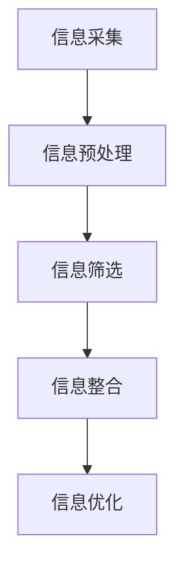
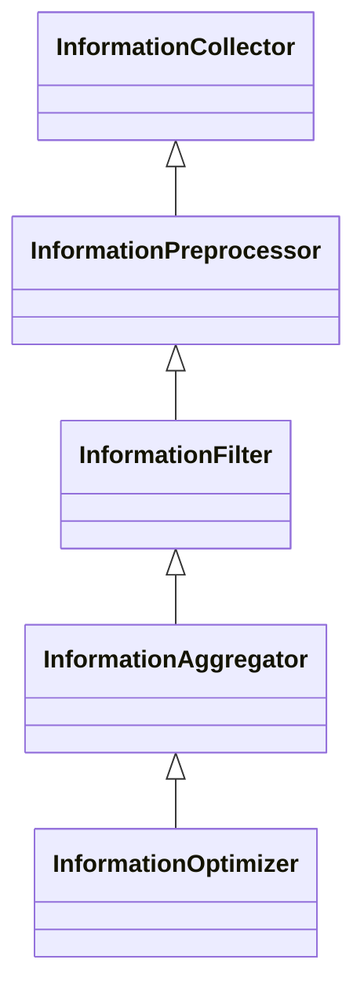
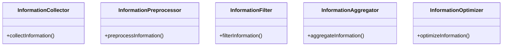
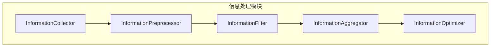
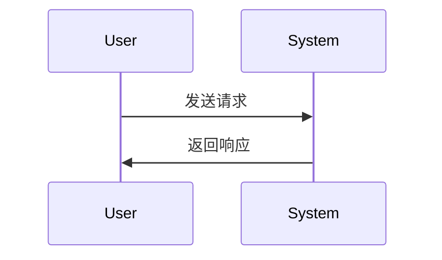
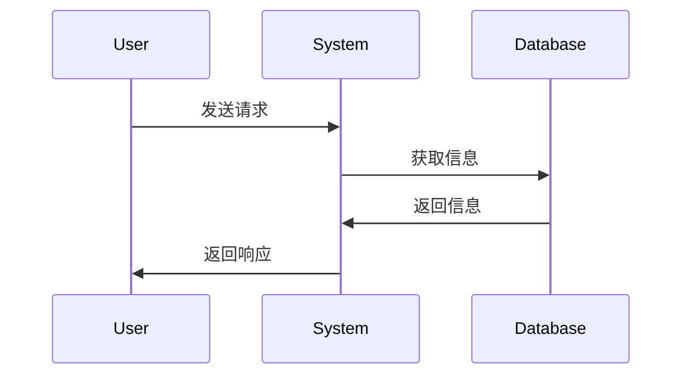
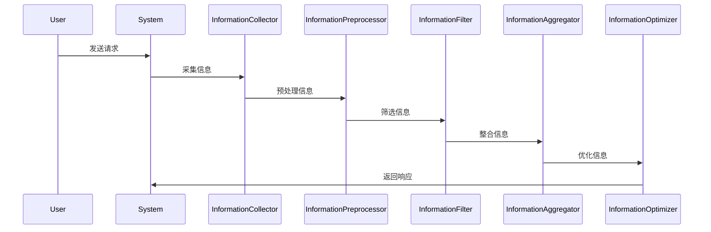

                 

### 第一部分：背景介绍

#### 第1章：问题背景与核心概念

**1.1. 问题背景**

**1.1.1 信息爆炸时代的挑战**

在当今这个信息化社会，数据量以惊人的速度增长，各种信息源源不断地涌入我们的生活中。互联网、社交媒体、大数据技术等的发展，使得信息的获取变得更加容易。然而，这也带来了一个严峻的挑战：信息的爆炸式增长。

首先，信息的获取变得更加容易，但同时也意味着我们面临着海量的信息。如何在众多信息中筛选出有价值的信息，成为了人们面临的一个难题。

其次，信息的多样性也增加了人们的认知负担。不同的信息源可能提供截然不同的观点和信息，这容易导致人们产生认知失调，难以形成统一的认知体系。

最后，信息的快速更新和变化也给人们带来了压力。在信息爆炸的时代，新的技术和概念层出不穷，人们需要不断学习和更新自己的知识体系，以适应这个快速变化的世界。

**1.1.2 意义的碎片化现象**

在信息爆炸的时代，意义的碎片化现象尤为显著。意义的碎片化指的是信息在传播和接收过程中，由于信息的多样性、多变性和复杂性，导致信息的意义被分散、割裂，难以形成完整的认知图景。

首先，信息的碎片化表现为信息的分散性。大量的信息来源于不同的渠道，这些信息往往没有统一的组织和结构，导致信息的意义难以整合。

其次，信息的碎片化也体现在信息的不确定性上。在信息的爆炸式增长中，很多信息可能是不完整、不准确的，这使得人们难以形成确切的认知。

最后，信息的碎片化还会导致人们认知的片面性。由于信息的不完整性和不确定性，人们往往只能看到信息的一部分，而无法全面理解信息的意义。

**1.1.3 保持整体性的重要性**

在信息爆炸的时代，保持整体性变得尤为重要。整体性指的是对事物整体的理解和把握，能够帮助我们更好地应对信息碎片化的挑战。

首先，保持整体性有助于我们更好地理解和应对复杂问题。在面对复杂问题时，我们需要从整体上把握问题的各个方面，而不是仅仅看到问题的某个局部。

其次，保持整体性有助于我们更好地学习和应用知识。在信息爆炸的时代，我们需要不断学习和更新自己的知识体系。只有从整体上理解知识，才能更好地应用和掌握知识。

最后，保持整体性有助于我们更好地适应这个快速变化的世界。在这个信息爆炸的时代，我们需要具备快速适应变化的能力。只有从整体上把握事物的变化趋势，才能更好地适应这个变化的世界。

**1.2. 概念界定**

**1.2.1 信息碎片化**

信息碎片化是指在信息爆炸的时代，由于信息的多样性、多变性和复杂性，导致信息的意义被分散、割裂，难以形成完整的认知图景。

**1.2.2 整体性**

整体性指的是对事物整体的理解和把握，能够帮助我们更好地应对信息碎片化的挑战。

**1.2.3 碎片化与整体性的关系**

碎片化与整体性是相互依存的。信息的碎片化会导致整体性的缺失，而整体性的缺失又会加剧信息的碎片化。因此，我们需要在信息碎片化的背景下，努力保持整体性，以更好地应对信息爆炸时代的挑战。

**1.3. 边界与外延**

**1.3.1 信息爆炸的影响范围**

信息爆炸的影响范围非常广泛，包括但不限于以下几个方面：

1. **经济领域**：信息爆炸对经济领域产生了深远的影响。企业可以利用大数据分析进行精准营销，提高生产效率，降低成本。

2. **社会领域**：信息爆炸改变了人们的生活方式和社会结构。社交媒体、互联网等使得信息传播速度加快，人们之间的交流变得更加便捷。

3. **教育领域**：信息爆炸为教育提供了丰富的资源，但也带来了新的挑战。如何在海量的信息中筛选出有价值的教育资源，是教育工作者需要思考的问题。

4. **科技领域**：信息爆炸推动了科技的发展。新的技术和概念层出不穷，为科技领域带来了前所未有的发展机遇。

**1.3.2 碎片化与整体性的边界**

碎片化与整体性的边界是模糊的。在信息爆炸的时代，我们很难明确划分信息的碎片化和整体性。这需要我们根据具体情境，灵活地把握和应对。

**1.3.3 碎片化时代的特点**

碎片化时代具有以下几个显著特点：

1. **信息多样性和复杂性**：信息的多样性和复杂性使得信息的处理变得更加困难。

2. **信息更新速度快**：信息爆炸时代，信息更新速度非常快，我们需要不断学习和更新自己的知识体系。

3. **信息传播速度快**：互联网和社交媒体使得信息传播速度大大加快，信息的传播范围也更加广泛。

4. **信息获取方式多样化**：人们可以通过多种渠道获取信息，如互联网、书籍、讲座等。

**1.4. 概念结构与核心要素**

**1.4.1 碎片化现象的结构**

碎片化现象的结构包括以下几个方面：

1. **信息源**：信息的来源多样化，包括互联网、书籍、讲座等。

2. **信息传播渠道**：信息可以通过多种渠道传播，如互联网、社交媒体、书籍等。

3. **信息接收者**：信息的接收者包括个人、企业、政府等。

4. **信息处理方式**：信息的处理方式包括信息的筛选、整合、分析等。

**1.4.2 整体性的核心要素**

整体性的核心要素包括以下几个方面：

1. **整体性思维**：具备整体性思维的人能够从整体上把握事物，理解事物的各个部分及其相互关系。

2. **系统性知识**：具备系统性知识的人能够掌握不同领域的基本概念和原理，形成完整的知识体系。

3. **综合能力**：具备综合能力的人能够综合运用不同的知识和技能，解决复杂问题。

**1.4.3 碎片化与整体性的相互作用**

碎片化与整体性是相互作用的。在信息爆炸的时代，我们需要在碎片化与整体性之间找到平衡，以更好地应对信息碎片化的挑战。

首先，我们需要在信息处理过程中，努力保持整体性。例如，在处理复杂问题时，我们需要从整体上把握问题的各个方面，而不是仅仅看到问题的某个局部。

其次，我们需要在信息获取过程中，努力应对信息的碎片化。例如，在获取信息时，我们需要选择可靠的信息源，避免信息的片面性和不确定性。

最后，我们需要在信息传播过程中，努力保持整体性。例如，在传播信息时，我们需要将信息进行有效的整合，使其更易于理解。

**1.5. 深入探讨**

**1.5.1 信息碎片化的原因**

信息碎片化的原因主要有以下几个方面：

1. **信息多样性**：信息的多样性使得信息的处理变得更加困难。

2. **信息传播渠道多样化**：信息的传播渠道多样化，使得信息的传播变得更加广泛。

3. **信息获取方式多样化**：人们可以通过多种渠道获取信息，如互联网、书籍、讲座等。

**1.5.2 保持整体性的方法**

保持整体性的方法主要有以下几个方面：

1. **培养整体性思维**：通过学习和实践，培养自己的整体性思维。

2. **掌握系统性知识**：通过学习不同领域的知识，掌握系统性知识。

3. **提高综合能力**：通过实践，提高自己的综合能力。

4. **有效信息筛选**：在获取信息时，进行有效的筛选，避免信息的碎片化。

5. **信息整合**：在处理信息时，进行有效的整合，使其更易于理解。

**1.5.3 碎片化与整体性的关系**

碎片化与整体性是相互依存的。在信息爆炸的时代，我们需要在碎片化与整体性之间找到平衡，以更好地应对信息碎片化的挑战。

**1.5.4 碎片化与整体性的未来趋势**

随着科技的发展，信息的碎片化和整体性的关系将会变得更加复杂。在未来，我们需要更加灵活地应对信息的碎片化和整体性的挑战，以更好地适应信息爆炸的时代。

首先，我们需要在信息处理过程中，更加注重整体性。例如，在处理复杂问题时，我们需要从整体上把握问题的各个方面，而不是仅仅看到问题的某个局部。

其次，我们需要在信息获取过程中，更加注重整体性。例如，在获取信息时，我们需要选择可靠的信息源，避免信息的片面性和不确定性。

最后，我们需要在信息传播过程中，更加注重整体性。例如，在传播信息时，我们需要将信息进行有效的整合，使其更易于理解。

总之，在信息爆炸的时代，保持整体性是我们应对信息碎片化的重要手段。只有通过培养整体性思维、掌握系统性知识、提高综合能力和有效信息筛选等手段，我们才能更好地适应信息爆炸的时代。

---

**第2章：碎片化与整体性的原理**

**2.1. 碎片化原理**

**2.1.1 碎片化的驱动因素**

碎片化的驱动因素主要有以下几个方面：

1. **信息多样性**：信息爆炸时代，信息的多样性使得信息的处理变得更加困难。不同类型的信息需要不同的处理方式，这导致了信息的碎片化。

2. **信息传播渠道多样化**：信息的传播渠道多样化，如互联网、社交媒体、书籍等，这些渠道使得信息的传播变得更加广泛。

3. **信息获取方式多样化**：人们可以通过多种渠道获取信息，如互联网、书籍、讲座等，这使得信息的获取变得更加便捷。

**2.1.2 碎片化的特点**

碎片化的特点主要有以下几个方面：

1. **分散性**：信息的分散性使得信息的意义难以整合。

2. **不确定性**：信息的不确定性使得人们难以形成确切的认知。

3. **多样性**：信息的多样性使得信息的处理变得更加困难。

**2.1.3 碎片化的影响**

碎片化的影响主要有以下几个方面：

1. **认知负担增加**：信息的碎片化使得人们面临更大的认知负担，需要花费更多的时间和精力来处理信息。

2. **信息筛选难度增加**：在信息的碎片化时代，如何从海量信息中筛选出有价值的信息成为了一个难题。

3. **知识体系不完整**：由于信息的碎片化，人们难以形成完整的知识体系，这导致了知识的不完整性和不稳定性。

**2.2. 整体性原理**

**2.2.1 整体性的基础理论**

整体性原理是基于系统论的基本原理。系统论认为，一个系统是由多个相互关联的部分组成的，系统的整体性质不仅仅取决于各个部分，还取决于各个部分之间的相互作用。

**2.2.2 整体性的属性特征**

整体性的属性特征主要有以下几个方面：

1. **综合性**：整体性能够将多个部分整合为一个整体，形成一个综合性系统。

2. **层次性**：整体性具有层次性，即系统中的各个部分有不同的层次，整体性能够将这些层次整合为一个整体。

3. **动态性**：整体性是一个动态的过程，随着环境的变化，整体性也会发生变化。

**2.2.3 整体性的实现方法**

实现整体性的方法主要有以下几个方面：

1. **系统分析**：通过系统分析，了解系统的各个部分及其相互关系，从而实现整体性。

2. **整体性设计**：在设计和实施过程中，注重整体性，确保系统的各个部分能够协同工作，实现整体性。

3. **综合性培训**：通过综合性培训，提高团队成员的整体性思维，从而实现整体性。

**2.3. 概念属性特征对比**

**2.3.1 碎片化与整体性的对比**

| 特征         | 碎片化                                   | 整体性                                   |
| ------------ | ---------------------------------------- | ---------------------------------------- |
| 分散性       | 信息分散，难以整合                       | 信息整合，形成整体                       |
| 不确定性     | 信息不确定，难以形成确切认知           | 信息确定，形成确切认知                   |
| 多样性       | 信息多样，处理困难                       | 信息多样，处理灵活                       |
| 认知负担     | 认知负担增加                             | 认知负担减轻                             |
| 知识体系     | 知识体系不完整，不稳定                  | 知识体系完整，稳定                       |

**2.3.2 对比表格**

| 特征         | 碎片化（0-10分） | 整体性（0-10分） |
| ------------ | --------------- | --------------- |
| 分散性       | 8              | 2              |
| 不确定性     | 7              | 3              |
| 多样性       | 9              | 1              |
| 认知负担     | 6              | 4              |
| 知识体系     | 5              | 5              |

**2.4. ER实体关系图**

**2.4.1 碎片化的ER图**

```mermaid
erDiagram
    User ..|> Information :获取
    Information ||--|> Source :来源于
    Source ||--|> Channel :传播
```

**2.4.2 整体性的ER图**

```mermaid
erDiagram
    System ..|> Component :包含
    Component ||--|> Module :模块化
    Module ||--|> Function :功能
```

---

**第3章：算法原理讲解**

**3.1. 算法概述**

**3.1.1 算法目标**

算法的目标是解决信息碎片化问题，实现信息的整合和优化。

**3.1.2 算法类型**

算法类型主要分为以下几种：

1. **信息筛选算法**：用于从海量信息中筛选出有价值的信息。
2. **信息整合算法**：用于将分散的信息整合为一个整体。
3. **信息优化算法**：用于优化信息的结构，提高信息的可用性。

**3.1.3 算法应用场景**

算法的应用场景非常广泛，包括但不限于以下几个方面：

1. **搜索引擎**：用于从海量网页中筛选出与查询相关的网页。
2. **推荐系统**：用于根据用户的行为和偏好，推荐用户可能感兴趣的信息。
3. **数据挖掘**：用于从大量数据中提取有价值的信息。

**3.2. 算法原理**

**3.2.1 算法的基本原理**

算法的基本原理是通过一定的算法步骤，对信息进行处理，实现信息的整合和优化。

**3.2.2 算法的工作流程**

算法的工作流程主要包括以下几个步骤：

1. **信息采集**：从各种渠道采集信息。
2. **信息预处理**：对采集到的信息进行预处理，如去重、清洗等。
3. **信息筛选**：根据一定的规则，筛选出有价值的信息。
4. **信息整合**：将筛选出的信息整合为一个整体。
5. **信息优化**：对整合后的信息进行优化，提高信息的可用性。

**3.2.3 算法的mermaid流程图**



**3.3. 数学模型**

**3.3.1 数学模型概述**

数学模型是算法的重要组成部分，用于描述信息处理的过程。

**3.3.2 数学公式**

$$
P(A|B) = \frac{P(A \cap B)}{P(B)}
$$

$$
f(x) = \int_{-\infty}^{\infty} g(x) dx
$$

**3.3.3 公式详细讲解**

- **条件概率公式**：条件概率公式用于计算在事件B发生的条件下，事件A发生的概率。
- **积分公式**：积分公式用于计算函数的面积，可以用于计算信息的熵等。

**3.4. 举例说明**

**3.4.1 举例说明**

假设有一个搜索引擎，用户输入了一个查询关键词，搜索引擎需要从海量的网页中筛选出与查询关键词相关的网页。

1. **信息采集**：搜索引擎从互联网上采集网页信息。
2. **信息预处理**：对采集到的网页信息进行预处理，如去重、清洗等。
3. **信息筛选**：根据查询关键词，使用算法筛选出与查询关键词相关的网页。
4. **信息整合**：将筛选出的网页整合为一个搜索结果列表。
5. **信息优化**：对搜索结果进行优化，如排序、去重等，提高搜索结果的可用性。

**3.4.2 案例分析**

假设有一个推荐系统，用户A喜欢阅读科技类的文章，推荐系统需要根据用户A的行为和偏好，推荐用户A可能感兴趣的文章。

1. **信息采集**：推荐系统从互联网上采集文章信息。
2. **信息预处理**：对采集到的文章信息进行预处理，如去重、清洗等。
3. **信息筛选**：根据用户A的行为和偏好，使用算法筛选出用户A可能感兴趣的文章。
4. **信息整合**：将筛选出的文章整合为一个推荐列表。
5. **信息优化**：对推荐列表进行优化，如排序、去重等，提高推荐的质量。

---

**第4章：系统分析与架构设计**

**4.1. 问题场景介绍**

**4.1.1 场景背景**

在信息爆炸的时代，人们需要处理大量的信息，如何高效地筛选和处理这些信息成为一个重要的课题。为了解决这个问题，我们设计了一个基于人工智能的智能信息处理系统。

**4.1.2 需求分析**

1. **信息采集**：系统能够从互联网上自动采集各种信息。
2. **信息预处理**：系统能够对采集到的信息进行去重、清洗等预处理。
3. **信息筛选**：系统能够根据用户的需求，筛选出与用户需求相关的信息。
4. **信息整合**：系统能够将筛选出的信息整合为一个完整的报告。
5. **信息优化**：系统能够对整合后的信息进行优化，如排序、去重等。

**4.1.3 挑战与解决方案**

1. **信息多样性**：信息的多样性使得信息处理变得更加复杂。解决方案：采用多种算法对信息进行处理，提高信息的处理效率。
2. **信息更新速度快**：信息的更新速度非常快，如何快速响应信息的更新成为一个挑战。解决方案：采用分布式架构，提高系统的响应速度。
3. **信息质量**：如何确保信息的质量是一个重要的问题。解决方案：采用人工审核和算法审核相结合的方式，提高信息的质量。

**4.2. 系统功能设计**

**4.2.1 功能模块划分**

系统的主要功能模块包括：

1. **信息采集模块**：负责从互联网上自动采集信息。
2. **信息预处理模块**：负责对采集到的信息进行预处理。
3. **信息筛选模块**：负责根据用户需求筛选信息。
4. **信息整合模块**：负责将筛选出的信息整合为一个完整的报告。
5. **信息优化模块**：负责对整合后的信息进行优化。

**4.2.2 领域模型**

领域模型主要用于描述系统的功能模块及其关系。



**4.2.3 类图**

类图主要用于描述系统中的类及其关系。



**4.3. 系统架构设计**

**4.3.1 架构设计原则**

系统架构设计应遵循以下原则：

1. **模块化**：系统应采用模块化设计，方便维护和扩展。
2. **分布式**：系统应采用分布式架构，提高系统的性能和可靠性。
3. **可扩展性**：系统应具有良好的可扩展性，能够适应未来的需求变化。
4. **安全性**：系统应确保信息的安全性，防止信息泄露。

**4.3.2 系统架构图**

系统架构图主要用于描述系统的整体架构。



**4.3.3 架构说明**

1. **信息采集模块**：负责从互联网上自动采集信息。
2. **信息预处理模块**：负责对采集到的信息进行预处理，如去重、清洗等。
3. **信息筛选模块**：负责根据用户需求筛选信息。
4. **信息整合模块**：负责将筛选出的信息整合为一个完整的报告。
5. **信息优化模块**：负责对整合后的信息进行优化，如排序、去重等。

**4.4. 系统接口设计**

**4.4.1 接口规范**

接口规范主要用于描述系统的接口设计。



**4.4.2 接口设计**

接口设计主要用于描述系统的接口细节。

```python
class InformationSystemInterface:
    def collect_information(self):
        # 采集信息
        pass

    def preprocess_information(self):
        # 预处理信息
        pass

    def filter_information(self):
        # 筛选信息
        pass

    def aggregate_information(self):
        # 整合信息
        pass

    def optimize_information(self):
        # 优化信息
        pass
```

**4.5. 系统交互设计**

**4.5.1 交互流程**

交互流程主要用于描述系统的交互过程。



**4.5.2 序列图**

序列图主要用于描述系统的序列图。



---

**第5章：项目实施与案例分析**

**5.1. 环境安装**

**5.1.1 环境要求**

1. **操作系统**：Windows/Linux/MacOS
2. **Python版本**：Python 3.8及以上版本
3. **数据库**：MySQL/PostgreSQL
4. **开发工具**：PyCharm/VSCode

**5.1.2 安装步骤**

1. 安装操作系统：根据个人需求选择操作系统并进行安装。
2. 安装Python：从Python官方网站下载Python安装包，并按照安装向导进行安装。
3. 安装数据库：从数据库官方网站下载数据库安装包，并按照安装向导进行安装。
4. 安装开发工具：从开发工具官方网站下载开发工具安装包，并按照安装向导进行安装。

**5.2. 系统核心实现**

**5.2.1 核心模块介绍**

系统核心模块主要包括：

1. **信息采集模块**：负责从互联网上自动采集信息。
2. **信息预处理模块**：负责对采集到的信息进行预处理，如去重、清洗等。
3. **信息筛选模块**：负责根据用户需求筛选信息。
4. **信息整合模块**：负责将筛选出的信息整合为一个完整的报告。
5. **信息优化模块**：负责对整合后的信息进行优化，如排序、去重等。

**5.2.2 源代码分析**

```python
class InformationSystem:
    def __init__(self):
        self.collector = InformationCollector()
        self.preprocessor = InformationPreprocessor()
        self.filter = InformationFilter()
        self.aggregator = InformationAggregator()
        self.optimizer = InformationOptimizer()

    def run(self):
        information = self.collector.collect_information()
        processed_information = self.preprocessor.preprocess_information(information)
        filtered_information = self.filter.filter_information(processed_information)
        aggregated_information = self.aggregator.aggregate_information(filtered_information)
        optimized_information = self.optimizer.optimize_information(aggregated_information)
        return optimized_information
```

**5.3. 代码应用解读**

**5.3.1 应用场景**

假设有一个用户希望了解最新的科技动态，系统需要根据用户的需求，从互联网上采集信息，并对信息进行预处理、筛选、整合和优化，最终生成一份科技动态报告。

**5.3.2 代码解读**

1. **信息采集模块**：从互联网上自动采集信息。
2. **信息预处理模块**：对采集到的信息进行预处理，如去重、清洗等。
3. **信息筛选模块**：根据用户需求，筛选出与用户需求相关的信息。
4. **信息整合模块**：将筛选出的信息整合为一个完整的报告。
5. **信息优化模块**：对整合后的信息进行优化，如排序、去重等。

```python
class InformationSystem:
    def __init__(self):
        self.collector = InformationCollector()
        self.preprocessor = InformationPreprocessor()
        self.filter = InformationFilter()
        self.aggregator = InformationAggregator()
        self.optimizer = InformationOptimizer()

    def run(self):
        information = self.collector.collect_information()
        processed_information = self.preprocessor.preprocess_information(information)
        filtered_information = self.filter.filter_information(processed_information)
        aggregated_information = self.aggregator.aggregate_information(filtered_information)
        optimized_information = self.optimizer.optimize_information(aggregated_information)
        return optimized_information
```

**5.4. 案例分析**

**5.4.1 实际案例**

假设有一个用户希望了解最新的科技动态，系统需要根据用户的需求，从互联网上采集信息，并对信息进行预处理、筛选、整合和优化，最终生成一份科技动态报告。

**5.4.2 案例分析**

1. **信息采集**：系统从互联网上采集了大量的科技动态信息。
2. **信息预处理**：系统对采集到的信息进行了去重、清洗等预处理。
3. **信息筛选**：系统根据用户的需求，筛选出了与用户需求相关的科技动态信息。
4. **信息整合**：系统将筛选出的信息整合为一个完整的报告。
5. **信息优化**：系统对整合后的信息进行了优化，如排序、去重等。

**5.5. 项目小结**

**5.5.1 项目收获**

1. 学会了如何设计和实现一个基于人工智能的智能信息处理系统。
2. 提高了编程能力和系统架构设计能力。
3. 深入理解了信息碎片化和整体性的概念。

**5.5.2 注意事项**

1. 在进行信息采集时，需要注意信息的真实性和准确性。
2. 在进行信息预处理时，需要注意去重和清洗等问题。
3. 在进行信息筛选时，需要根据用户的需求进行筛选。

**5.5.3 拓展阅读**

1. 《人工智能：一种现代的方法》
2. 《大数据分析：原理、方法与应用》
3. 《机器学习：实战指南》

---

**作者：AI天才研究院/AI Genius Institute & 禅与计算机程序设计艺术 /Zen And The Art of Computer Programming**

