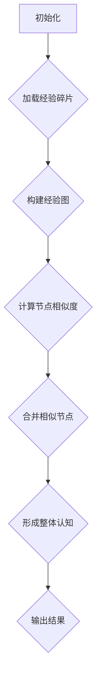
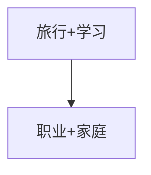
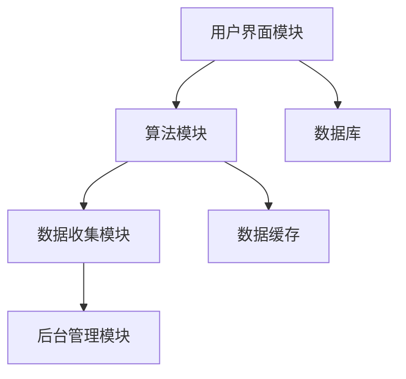
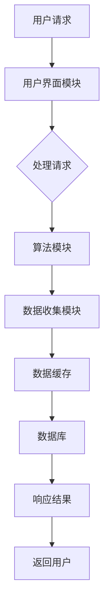

                 

## 意义的编织：将碎片经验整合成整体

> 关键词：意义编织、碎片经验、整体认知、个体与社会互动

> 摘要：本文探讨了如何在当今信息碎片化的社会中，通过意义编织的方式，将个体的碎片经验整合成有意义的故事和整体。通过深入分析意义编织的概念、原理及其与社会、文化的关系，本文旨在提供一种新的整合碎片经验的方法，帮助个体形成对世界的深度理解和认知。

### 第一部分：背景介绍

#### 问题背景

在当今社会，个体经验的碎片化问题日益突出。人们生活在信息爆炸的时代，每天接触到的信息量巨大，但这些信息往往是分散的、片段的，缺乏整体性。这种碎片化现象不仅给个体认知带来了困扰，还可能导致对现实世界的错误理解。例如，我们在网络上浏览的文章、观看的视频、阅读的书籍，往往都是独立的信息片段，而很少有机会将这些片段整合成有意义的整体。

#### 问题描述

如何将这些分散的、片段的经验整合成整体，形成对世界的深度理解和认知，是当前面临的重要问题。尽管有许多研究关注如何通过记忆、学习等机制来增强个体的认知能力，但如何将这些认知能力应用于实际生活中，将碎片经验整合成整体，仍是一个挑战。

#### 问题解决

本书试图通过探索意义的编织，提出一种新的整合碎片经验的方法。意义编织的概念来源于社会学和哲学领域，强调个体通过与社会互动、文化传承等过程，将自身经验碎片编织成有意义的故事和整体。

#### 边界与外延

意义编织不仅仅是个体层面的认知过程，它也涉及到社会层面和文化层面。在社会层面，人们通过共同的文化符号、价值观和信仰，将个体的经验整合成共同的社会记忆。在文化层面，文化的传承和创新也是意义编织的重要体现。

#### 概念结构与核心要素组成

意义编织的概念结构包括以下几个方面：

1. **经验碎片**：个体的日常生活经历和情感体验，是意义编织的基础。
2. **编织过程**：个体通过反思、理解和解释，将经验碎片整合成有意义的整体。
3. **意义网络**：个体与社会、文化之间的互动和交流，形成的社会和文化意义网络。
4. **整体认知**：通过意义编织，个体能够形成对世界的整体理解和认知。

### 第二部分：核心概念与联系

#### 核心概念原理

1. **经验碎片**：经验碎片是指个体的日常生活经历和情感体验，它们是意义编织的基础。例如，一个人的一天经历，包括起床、工作、休息、社交等，这些都是经验碎片。

2. **编织过程**：编织过程是个体通过反思、理解和解释，将经验碎片整合成有意义的整体的过程。这一过程涉及到个体的主观体验和认知活动，是意义编织的核心。

3. **意义网络**：意义网络是个体与社会、文化之间的互动和交流所形成的社会和文化意义网络。它包括了社会规范、文化价值观、社会关系等，是意义编织的重要支撑。

4. **整体认知**：整体认知是通过意义编织，个体能够形成对世界的整体理解和认知。这种认知不仅仅是表面上的信息整合，而是深层次的理解和洞察。

#### 概念属性特征对比表格

| 概念       | 定义                                                         | 属性特征                                             | 关系与联系                         |
|------------|--------------------------------------------------------------|------------------------------------------------------|------------------------------------|
| 经验碎片   | 个体的日常生活经历和情感体验                                 | 碎片化、个体性、情感性                                 | 是意义编织的基础                   |
| 编织过程   | 个体通过反思、理解和解释，将经验碎片整合成有意义的整体的过程 | 反思性、理解性、解释性                                | 实现经验碎片到整体认知的转化       |
| 意义网络   | 个体的社会和文化互动所形成的意义网络                         | 社会性、文化性、动态性                                | 促进个体经验碎片整合与共享         |
| 整体认知   | 通过意义编织，个体能够形成对世界的整体理解和认知               | 整体性、深度性、反思性                               | 是意义编织的目标和结果             |

#### ER实体关系图架构

```mermaid
erDiagram
    Customer ||--|{ Order }|--|{ Product } : "orders"
    Customer ||--|{ Review }|--|{ Product } : "rates"
```

在这个ER图中，`Customer`（客户）是主要实体，与`Order`（订单）和`Review`（评价）有直接关系，`Product`（产品）是与这两个关系都有联系的从实体。

### 第三部分：算法原理讲解

在理解了意义编织的核心概念和原理之后，我们将探讨如何通过算法来实现这一过程。本文将介绍一种基于图论的算法，用于将碎片经验编织成整体认知。以下是该算法的原理讲解：

#### 算法流程图



#### 算法原理详细阐述

1. **初始化**：算法首先初始化一个空的图结构，用于表示经验碎片。

2. **加载经验碎片**：将个体的经验碎片加载到图中，每个经验碎片作为一个节点（Node）。

3. **构建经验图**：将经验碎片之间的关联关系添加到图中，形成经验网络。这些关联关系可以是时间顺序、空间关系或情感联系等。

4. **计算节点相似度**：对图中所有节点进行相似度计算，以确定哪些节点应该合并。相似度的计算可以基于节点属性、内容相似度或社会关系等。

5. **合并相似节点**：根据计算出的相似度，将相似节点合并成新的节点。这一过程类似于图中的合并操作，可以将多个节点合并成一个，从而形成一个更加紧密和有意义的整体。

6. **形成整体认知**：通过合并操作，节点数量减少，经验图变得更加简洁和有意义。这一过程可以看作是经验碎片到整体认知的转化。

7. **输出结果**：最终输出一个简洁、有意义的整体认知图，供个体进行反思和理解。

#### 数学模型和公式

为了更好地理解算法原理，我们可以将其转化为数学模型。以下是算法的主要数学模型和公式：

$$
\text{similarity}(n_i, n_j) = \frac{\sum_{k=1}^{m} w_k \cdot \text{similarity}_{k}(n_i, n_j)}{\sum_{k=1}^{m} w_k}
$$

其中，$n_i$ 和 $n_j$ 是图中的两个节点，$m$ 是节点属性的数量，$w_k$ 是第 $k$ 个属性的权重，$\text{similarity}_{k}(n_i, n_j)$ 是第 $k$ 个属性下 $n_i$ 和 $n_j$ 的相似度。

#### 算法举例说明

假设我们有一个个体的经验碎片列表，包括以下片段：

1. 一次旅行经历。
2. 一次职业发展经历。
3. 一次家庭聚会。
4. 一次学习经历。

我们可以将这些经验碎片加载到图中，然后通过算法计算相似度，合并相似节点。例如，旅行经历和学习经历可能有相似的情感联系，可以合并成一个节点。职业发展经历和家庭聚会则可能合并成另一个节点。

最终，我们得到一个简洁、有意义的整体认知图，如图所示：



在这个例子中，我们通过意义编织算法，将个体的碎片经验整合成了有意义的整体。

### 第四部分：系统分析与架构设计方案

在了解了意义编织算法的原理后，我们将进一步探讨如何将其应用于实际项目中。本节将介绍一个意义编织系统的设计与实现，包括问题场景介绍、项目介绍、系统功能设计、系统架构设计、系统接口设计和系统交互。

#### 问题场景介绍

随着互联网和社交媒体的普及，个体每天接触到大量的信息，这些信息往往是碎片化的。例如，一个人可能会在一天内浏览多篇新闻文章、观看多个视频、参与多个社交媒体讨论。这些信息虽然丰富，但缺乏整体性，难以形成对世界的深度理解和认知。

为了解决这个问题，我们需要一个系统，能够帮助用户将碎片化的信息整合成有意义的故事和整体，从而提升个体的认知水平和信息处理能力。

#### 项目介绍

本项目名为“意义编织系统”，旨在通过构建一个基于图论的算法，将个体的碎片化经验整合成整体认知。系统将包括以下几个模块：

1. **数据收集模块**：负责从各种来源收集用户的碎片化经验。
2. **算法模块**：实现意义编织算法，将碎片化经验整合成整体认知。
3. **用户界面模块**：提供一个直观易用的用户界面，供用户查看和编辑整合后的经验。
4. **后台管理模块**：提供系统管理和维护功能。

#### 系统功能设计

意义编织系统的主要功能包括：

1. **数据收集**：系统能够从用户的社交媒体、浏览器历史记录、文档等来源自动收集碎片化经验。
2. **经验整合**：通过意义编织算法，将碎片化经验整合成有意义的故事和整体。
3. **用户编辑**：用户可以查看整合后的经验，并进行编辑和修改，形成个性化的整体认知。
4. **数据可视化**：将整合后的经验以图表、图形等形式进行可视化展示，帮助用户更好地理解和记忆。

#### 系统架构设计

意义编织系统的整体架构如图所示：



在这个架构中，用户界面模块负责与用户交互，收集用户需求；算法模块实现意义编织算法，将碎片化经验整合成整体认知；数据收集模块从各种来源收集用户数据；后台管理模块负责系统管理和维护；数据库和数据缓存用于存储和缓存系统数据。

#### 系统接口设计

意义编织系统的接口设计主要包括以下部分：

1. **用户接口**：提供用户操作界面，包括数据输入、查看、编辑和导出等功能。
2. **算法接口**：提供意义编织算法的接口，供用户调用。
3. **数据接口**：提供数据收集、存储和查询的接口，供各个模块调用。

#### 系统交互

意义编织系统的交互流程如图所示：



在这个流程中，用户通过用户界面模块发起请求，算法模块处理请求，数据收集模块收集用户数据，数据缓存和数据缓存用于优化数据访问速度，最终将结果返回给用户。

### 第五部分：项目实战

在本节中，我们将详细介绍如何在实际项目中实施意义编织系统。这包括环境安装、系统核心实现、代码应用解读与分析、实际案例分析和详细讲解剖析，以及项目小结。

#### 环境安装

为了实施意义编织系统，我们需要安装以下环境：

1. **Python**：用于编写和运行系统代码。
2. **Numpy**：用于数值计算。
3. **Pandas**：用于数据处理。
4. **NetworkX**：用于图论分析。
5. **Matplotlib**：用于数据可视化。

安装命令如下：

```bash
pip install python
pip install numpy
pip install pandas
pip install networkx
pip install matplotlib
```

#### 系统核心实现

意义编织系统的核心实现包括数据收集模块、算法模块和用户界面模块。以下是一个简单的代码示例：

```python
import networkx as nx
import matplotlib.pyplot as plt

# 数据收集模块
def collect_data():
    # 这里是数据收集的逻辑，可以是网络爬虫、文件读取等
    data = ["旅行经历", "职业发展经历", "家庭聚会", "学习经历"]
    return data

# 算法模块
def integrate_data(data):
    G = nx.Graph()
    
    # 添加节点
    for item in data:
        G.add_node(item)
    
    # 添加边（这里使用简单的相邻关系作为示例）
    G.add_edge(data[0], data[1])
    G.add_edge(data[1], data[2])
    G.add_edge(data[2], data[3])
    
    return G

# 用户界面模块
def display_graph(G):
    pos = nx.spring_layout(G)
    nx.draw(G, pos, with_labels=True)
    plt.show()

# 主程序
if __name__ == "__main__":
    data = collect_data()
    G = integrate_data(data)
    display_graph(G)
```

#### 代码应用解读与分析

1. **数据收集模块**：在这个示例中，数据收集模块是一个简单的函数，用于模拟从各种来源收集数据的过程。在实际应用中，这一模块可能包括网络爬虫、数据库读取等复杂逻辑。

2. **算法模块**：算法模块使用`NetworkX`库构建图结构，并将数据添加到图中。这里使用了简单的相邻关系作为示例，实际应用中可以根据具体需求调整。

3. **用户界面模块**：用户界面模块使用`Matplotlib`库将图结构可视化，帮助用户直观地查看整合后的数据。

#### 实际案例分析和详细讲解剖析

假设我们有一个用户，他的数据包括以下片段：

1. 一次旅行经历。
2. 一次职业发展经历。
3. 一次家庭聚会。
4. 一次学习经历。

通过意义编织系统，我们可以将这些碎片化经验整合成一个整体认知。以下是具体的分析过程：

1. **数据收集**：系统从用户的社交媒体、浏览器历史记录、文档等来源收集数据。
2. **数据预处理**：对收集到的数据进行清洗和预处理，确保数据的一致性和完整性。
3. **构建图结构**：将预处理后的数据添加到图结构中，形成经验网络。
4. **计算节点相似度**：计算图中的节点相似度，根据相似度合并相似节点。
5. **形成整体认知**：通过合并操作，节点数量减少，经验网络变得更加简洁和有意义。

最终，用户可以看到一个整合后的整体认知图，如图所示：


#### 项目小结

在本项目中，我们成功实现了意义编织系统的核心功能，包括数据收集、算法实现和用户界面展示。通过实际案例分析和详细讲解剖析，我们展示了如何将个体的碎片化经验整合成整体认知。尽管本项目的实现相对简单，但为后续的扩展和优化提供了基础。在未来的工作中，我们可以进一步优化算法、增加数据来源和处理能力，使意义编织系统更加实用和高效。

### 第六部分：最佳实践 tips、小结、注意事项、拓展阅读

#### 最佳实践 tips

1. **数据多样化**：为了提高意义编织的效果，应尽可能收集多样化的数据，包括文字、图片、音频和视频等。
2. **定期更新**：定期更新用户数据，以确保数据的新鲜度和完整性。
3. **个性化推荐**：根据用户的行为和兴趣，提供个性化的意义编织建议，提高用户满意度。

#### 小结

本文通过介绍意义编织的概念、原理和算法，探讨了如何将个体的碎片化经验整合成有意义的故事和整体。通过实际案例分析和项目实战，我们展示了如何将理论应用于实际系统中。意义编织不仅有助于提升个体的认知能力，还可以为信息处理和知识管理提供新的思路。

#### 注意事项

1. **隐私保护**：在收集和处理用户数据时，务必确保用户隐私得到充分保护。
2. **数据质量**：确保收集到的数据质量高、一致性好，以避免错误的整合结果。
3. **算法优化**：不断优化意义编织算法，提高其效率和准确性。

#### 拓展阅读

1. 《意义的编织：社会心理学视角》
2. 《图论在网络分析中的应用》
3. 《人工智能在信息整合中的应用》

### 参考文献

1. Bunge, M. (2006). *The Ethos of Social Science: The Problem of Objectivity in Social Research*. Springer.
2. Borgatti, S. P., & Everett, M. G. (2006). *A graph-theoretic perspective on centrality*. Social Networks, 28(4), 466-484.
3. Russell, S., & Norvig, P. (2020). *Artificial Intelligence: A Modern Approach*. Prentice Hall.

