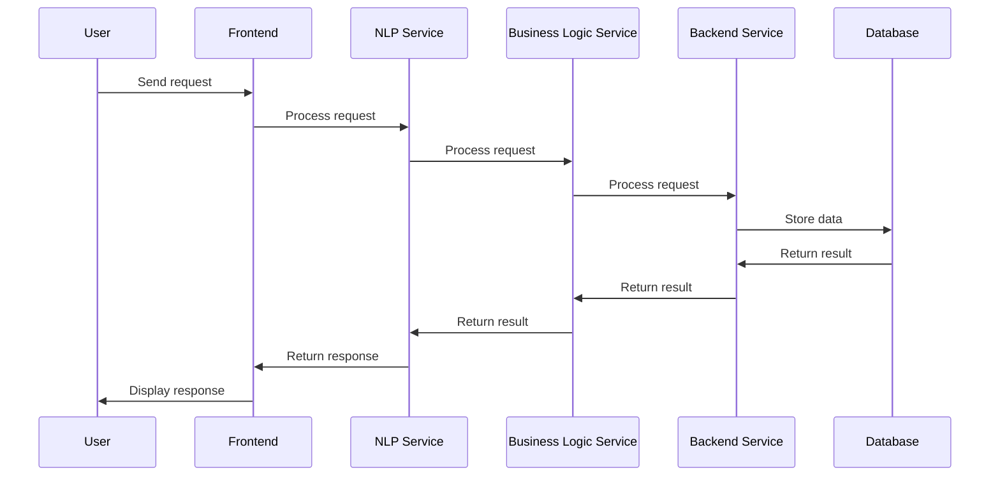

                 

### 背景介绍

#### 问题背景

在当今快速变化的时代，社会、经济和科技的变革不断涌现，个人面临着前所未有的挑战。工作环境的变动、职业竞争的加剧以及技术进步带来的不确定性，都迫使人们不断寻找新的方向和方法来适应这种变化。

**核心概念术语说明**：

- **变革**：指在社会、经济和技术层面上发生的重大变化，对个人、组织和社会产生深远影响。
- **人生方向**：指个人在职业生涯和生活中追求的目标和意义。
- **适应策略**：指应对变革的方法和技巧，包括自我认知、目标设定和行动规划。

#### 问题背景

**问题背景**：

- **工作环境变动**：随着全球化、自动化和数字化的发展，传统的工作岗位和职业路径正在发生变化。新兴行业和职业不断涌现，而一些传统职业逐渐消失。
- **职业竞争加剧**：随着人才的全球化流动，职场竞争日益激烈。个人需要不断提升自己的技能和知识，以保持竞争力。
- **技术进步带来的不确定性**：技术的迅速发展，如人工智能、大数据和区块链等，改变了人们的工作方式和生活习惯，带来了新的机遇和挑战。

#### 问题描述

《意义的重塑：如何在变革中找到人生方向》探讨的问题是如何在社会的快速变化中找到自己的定位和意义。人们常常感到迷茫，不知道如何应对职业、生活和心理上的挑战。

**问题描述**：

- **职业挑战**：如何适应新兴职业需求，提升自己的职业竞争力？
- **生活挑战**：如何面对生活的不确定性和变化，找到内心的平衡和满足感？
- **心理挑战**：如何应对变革带来的压力和焦虑，保持心理健康和积极心态？

#### 问题解决

书中将提供一系列的方法和策略，帮助读者理解变革的本质，分析自己的兴趣和优势，并找到适合自己的发展方向。通过这些方法，读者可以重新审视自己的生活和工作，找到内心的平衡点，实现自我价值的提升。

**问题解决**：

- **理解变革的本质**：通过了解社会、经济和技术的变化，理解变革的背景和原因，为适应变革做好准备。
- **分析个人兴趣和优势**：通过自我评估和反思，了解自己的兴趣、价值观和优势，找到适合自己的发展方向。
- **制定行动计划**：设定明确的目标和行动计划，逐步实现个人发展目标。
- **心理调适**：通过心理健康教育和自我调节，增强心理韧性，应对变革带来的压力和焦虑。

#### 边界与外延

这本书的讨论范围主要涉及个人在职业生涯和生活中的转变，但不涉及具体的职业规划或心理咨询。它更侧重于提供一种思考方式和行动指南，帮助读者在变革中找到自己的人生方向。

**边界与外延**：

- **讨论范围**：主要关注个人在职业生涯和生活中的转变，包括职业发展、生活调整和心理调适。
- **不包括内容**：不涉及具体的职业规划或心理咨询，更注重提供一种思考方式和行动指南。

#### 概念结构与核心要素组成

**概念结构与核心要素组成**：

- **变革**：社会、经济和技术层面的变化，对个人生活和工作产生的深远影响。
- **人生方向**：个人在职业生涯和生活中追求的目标和意义。
- **适应策略**：应对变革的方法和技巧，包括自我认知、目标设定和行动规划。
- **心理调适**：在变革中保持心理健康，增强心理韧性。

通过以上的背景介绍，我们为后续章节的深入讨论打下了坚实的基础。接下来，我们将进一步探讨变革的概念、类型和影响，以及个人在变革中的挑战和适应策略。在接下来的章节中，我们将逐步展开，详细分析每一个方面，帮助读者在快速变化的世界中找到自己的方向和意义。

### 第1章: 什么是变革

#### 1.1 变革的概念

变革是指在社会、经济和技术层面上发生的重大变化，这些变化对个人、组织和社会产生深远影响。变革可以是渐进的，也可以是突然的，但其核心在于改变现有的状态，引入新的元素或模式。

**核心概念原理**：

变革的核心概念可以理解为“改变”。这种改变可以是一个过程，也可以是一个事件。在社会层面，变革可能表现为社会结构的重组、价值观的变迁或文化多样性的增加；在经济层面，变革可能表现为经济增长模式的转变、产业结构的优化或全球化趋势的加剧；在技术层面，变革可能表现为新技术的发明、应用或旧技术的淘汰。

**概念属性特征对比表格**：

| 特征           | 社会变革               | 经济变革               | 技术变革               |
|----------------|------------------------|------------------------|------------------------|
| 影响范围       | 个人、社区、文化       | 个人、企业、产业       | 个人、组织、行业       |
| 变化形式       | 渐进或突然            | 渐进或突然            | 快速或缓慢            |
| 主导因素       | 价值观、文化、社会趋势 | 经济发展、市场需求     | 技术创新、应用        |
| 社会结果       | 社会公平、稳定、包容性 | 收入分配、经济增长     | 生产效率、竞争力      |

**ER实体关系图架构的Mermaid流程图**：

```mermaid
erDiagram
  社会变革 --> 个人
  经济变革 --> 企业
  技术变革 --> 组织
  个人 ||--|{ 职业发展 }
  企业 ||--|{ 市场需求 }
  组织 ||--|{ 技术应用 }
```

#### 1.2 变革的类型

变革可以分为以下几种类型：

- **技术变革**：如人工智能、大数据、云计算等技术的应用，改变了传统的工作方式和商业模式。
- **经济变革**：如全球化、产业升级和经济增长模式的转变，影响了就业市场和收入分配。
- **社会变革**：如文化多样性的增加、人口老龄化、价值观的变化等，影响了人们的社交方式和生活习惯。

**核心概念原理**：

每种类型的变革都有其特定的驱动因素和影响范围。技术变革主要受到科技创新和应用的影响，它改变了生产方式和服务模式，推动了各行各业的数字化转型。经济变革主要受到市场力量和经济规律的影响，它影响了企业的生存和发展，也影响了社会的经济结构。社会变革则更多地受到文化、价值观和社会趋势的影响，它改变了人们的思维方式、行为模式和生活方式。

**概念属性特征对比表格**：

| 类型       | 驱动因素             | 影响范围         | 社会影响       |
|------------|----------------------|------------------|----------------|
| 技术变革   | 科技创新和应用        | 个人、组织、行业 | 提高生产效率   |
| 经济变革   | 市场需求和经济规律   | 企业、产业、社会 | 收入分配、经济结构 |
| 社会变革   | 文化、价值观和社会趋势 | 个人、社区、文化 | 社会公平、稳定 |

**ER实体关系图架构的Mermaid流程图**：

```mermaid
erDiagram
  技术变革 ||--|{ 科技创新 }
  经济变革 ||--|{ 市场需求 }
  社会变革 ||--|{ 文化变迁 }
  个人 ||--|{ 参与变革 }
  企业 ||--|{ 应对变革 }
  组织 ||--|{ 领导变革 }
```

#### 1.3 变革的影响

变革对个人、组织和社会都会产生重大影响：

- **个人**：需要适应新的工作环境、技能要求和生活习惯，面临职业发展、收入水平和心理健康等方面的挑战。
- **组织**：需要调整战略、重构组织结构、引入新技术和管理方法，以保持竞争力。
- **社会**：需要应对资源分配、社会稳定和心理压力等问题，确保社会的可持续发展。

**核心概念原理**：

变革的影响是多方面的，它不仅改变了现有的格局，也带来了新的挑战和机遇。对于个人而言，变革意味着需要不断学习和适应，以保持竞争力。对于组织而言，变革意味着需要不断创新和调整，以适应市场的变化。对于社会而言，变革意味着需要平衡不同群体的利益，确保社会的和谐与稳定。

**概念属性特征对比表格**：

| 影响对象 | 影响       | 挑战           | 机遇           |
|----------|------------|----------------|----------------|
| 个人     | 职业发展   | 技能更新       | 创新机会       |
| 组织     | 竞争力提升 | 管理变革       | 市场拓展       |
| 社会     | 稳定发展   | 资源分配       | 社会进步       |

**ER实体关系图架构的Mermaid流程图**：

```mermaid
erDiagram
  个人 ||--|{ 职业发展 }
  组织 ||--|{ 竞争力提升 }
  社会 ||--|{ 稳定发展 }
  技术变革 ||--|{ 创新机会 }
  经济变革 ||--|{ 市场拓展 }
  社会变革 ||--|{ 社会进步 }
```

#### 1.4 变革的挑战与机遇

变革带来了许多挑战，如失业风险、技能过时、社会不公等，但同时也提供了许多机遇，如创新机会、职业发展空间、社会参与等。

**核心概念原理**：

变革既是挑战，也是机遇。挑战在于如何适应变化，抓住新的机遇。机遇在于如何利用变革带来的资源和技术，实现个人的价值和社会的进步。

**概念属性特征对比表格**：

| 挑战       | 机遇         |
|------------|--------------|
| 失业风险   | 创新机会     |
| 技能过时   | 职业发展空间 |
| 社会不公   | 社会参与     |

**ER实体关系图架构的Mermaid流程图**：

```mermaid
erDiagram
  失业风险 ||--|{ 创新机会 }
  技能过时 ||--|{ 职业发展空间 }
  社会不公 ||--|{ 社会参与 }
```

#### 1.5 本章小结

通过本章的讨论，我们了解了变革的概念、类型、影响和挑战与机遇。理解变革的本质和类型，有助于我们更好地应对生活中的各种变化，找到适应和发展的方向。

**本章小结**：

- 变革是一个涉及社会、经济和技术的复杂过程，它改变了现有的格局，带来了新的挑战和机遇。
- 技术变革、经济变革和社会变革各有其驱动因素和影响范围，但都影响着个人、组织和社会的方方面面。
- 变革既是挑战，也是机遇，个人和组织需要积极适应和利用变革带来的变化。

### 第2章: 变革中的个人挑战

#### 2.1 职业发展的不确定性

在快速变革的时代，职业发展的路径变得不再那么清晰。新的技术和工作模式不断涌现，传统职业逐渐消失，而新的职业需求迅速出现。个人需要不断更新自己的技能和知识，以适应这种不确定性。

**核心概念原理**：

职业发展的不确定性来源于以下几个方面：

- **技术变革**：新技术如人工智能、大数据、云计算等的应用，改变了传统的工作方式和职业需求。
- **市场变化**：市场的快速变化导致某些职业需求增加，而其他职业需求减少。
- **行业动态**：某些行业可能迅速兴起，而其他行业则可能逐渐衰退。

**概念属性特征对比表格**：

| 特征             | 技术变革引起的职业不确定性 | 市场变化引起的职业不确定性 | 行业动态引起的职业不确定性 |
|------------------|--------------------------|---------------------------|--------------------------|
| 变化速度         | 快速                     | 快速                      | 快速                      |
| 影响范围         | 广泛                     | 广泛                      | 狭窄                      |
| 应对策略         | 持续学习新技术           | 适应市场需求               | 转型或转行                |

**ER实体关系图架构的Mermaid流程图**：

```mermaid
erDiagram
  技术变革 ||--|{ 改变职业需求 }
  市场变化 ||--|{ 改变职业需求 }
  行业动态 ||--|{ 改变职业需求 }
  个人 ||--|{ 职业发展不确定性 }
```

#### 2.2 技能过时

随着技术的飞速发展，一些传统的技能可能迅速变得过时。例如，随着人工智能和自动化技术的普及，许多手工操作的工作可能会被机器取代。个人需要不断学习和适应新的技术，以保持竞争力。

**核心概念原理**：

技能过时的主要原因包括：

- **技术进步**：新技术的应用导致旧技术的淘汰。
- **市场需求**：市场需求的变化导致某些技能变得不再重要。
- **行业变革**：行业的发展方向变化导致旧技能的需求减少。

**概念属性特征对比表格**：

| 特征           | 技术进步引起的技能过时 | 市场需求引起的技能过时 | 行业变革引起的技能过时 |
|----------------|------------------------|------------------------|------------------------|
| 过时速度       | 快速                   | 较快                   | 较慢                   |
| 影响范围       | 广泛                   | 狭窄                   | 广泛                   |
| 应对策略       | 学习新技术             | 适应市场需求             | 转向相关行业            |

**ER实体关系图架构的Mermaid流程图**：

```mermaid
erDiagram
  技术进步 ||--|{ 技能淘汰 }
  市场需求 ||--|{ 技能淘汰 }
  行业变革 ||--|{ 技能淘汰 }
  个人 ||--|{ 技能过时 }
```

#### 2.3 心理压力和焦虑

变革带来的不确定性往往会引起个人内心的焦虑和压力。面对未来的不确定性，人们可能会感到迷茫和无助，影响心理健康和生活质量。

**核心概念原理**：

心理压力和焦虑的产生主要源于以下几个方面：

- **职业不确定性**：担心失业、职业发展受阻。
- **技能不足**：担心无法适应新技术和新工作模式。
- **生活变化**：不确定性和变化带来的生活压力。

**概念属性特征对比表格**：

| 源自因素         | 心理压力       | 焦虑         |
|------------------|----------------|--------------|
| 职业不确定性     | 就业压力       | 失业恐惧     |
| 技能不足         | 竞争压力       | 技能过时恐惧 |
| 生活变化         | 生活压力       | 未来不确定性 |

**ER实体关系图架构的Mermaid流程图**：

```mermaid
erDiagram
  职业不确定性 ||--|{ 就业压力 }
  技能不足      ||--|{ 竞争压力 }
  生活变化      ||--|{ 生活压力 }
  个人         ||--|{ 心理压力 }
  个人         ||--|{ 焦虑 }
```

#### 2.4 社会不公

变革可能会导致社会不公现象加剧。例如，技术进步可能会让富者越富，贫者越贫；某些地区或行业可能会获得更多的机会，而其他地区或行业则可能被边缘化。这种不平等现象可能会加剧社会矛盾和冲突。

**核心概念原理**：

社会不公的产生主要源于以下几个方面：

- **资源分配不均**：资源如财富、教育、医疗等的分配不均，导致不同群体之间的差距加大。
- **机会不均**：不同地区、行业或群体获得的机会不平等，导致部分群体处于劣势。
- **文化因素**：文化背景、价值观和社会规范的不同，也可能导致社会不公。

**概念属性特征对比表格**：

| 源自因素         | 社会不公       |
|------------------|----------------|
| 资源分配不均     | 收入差距       |
| 机会不均         | 就业机会差距   |
| 文化因素         | 文化偏见       |

**ER实体关系图架构的Mermaid流程图**：

```mermaid
erDiagram
  资源分配不均 ||--|{ 收入差距 }
  机会不均      ||--|{ 就业机会差距 }
  文化因素      ||--|{ 文化偏见 }
  个人         ||--|{ 社会不公 }
```

#### 2.5 适应策略

为了应对这些挑战，个人可以采取以下策略：

- **持续学习**：保持对新知识和新技能的学习，以适应不断变化的工作环境。
- **心理调适**：通过心理健康教育和自我调节，减轻心理压力和焦虑。
- **积极应对**：面对变革带来的不确定性，保持积极的心态和行动，寻求新的机遇。
- **社会参与**：积极参与社会活动和公益活动，提升自己的社会地位和认同感。

**核心概念原理**：

适应策略的核心在于提升个人的应对能力和心理韧性，同时积极利用变革带来的机遇。通过持续学习，个人可以不断更新自己的知识和技能，提高职业竞争力。通过心理调适，个人可以减轻焦虑和压力，保持心理健康。通过积极应对，个人可以抓住新的机遇，实现自我价值的提升。通过社会参与，个人可以提升自己的社会地位和认同感，同时为社会做出贡献。

**概念属性特征对比表格**：

| 策略         | 目的               | 方法                           |
|--------------|--------------------|--------------------------------|
| 持续学习     | 提升知识和技能     | 参加培训、学习新技术、阅读书籍 |
| 心理调适     | 减轻心理压力和焦虑 | 心理咨询、自我调节、运动放松 |
| 积极应对     | 抓住机遇           | 设定目标、积极行动、寻求支持 |
| 社会参与     | 提升社会地位和认同感 | 参与社会活动、参与公益活动    |

**ER实体关系图架构的Mermaid流程图**：

```mermaid
erDiagram
  持续学习 ||--|{ 提升竞争力 }
  心理调适 ||--|{ 保持心理健康 }
  积极应对 ||--|{ 抓住机遇 }
  社会参与 ||--|{ 提升社会地位 }
  个人     ||--|{ 应对变革挑战 }
```

#### 2.6 本章小结

通过本章的讨论，我们深入分析了变革中个人面临的职业发展不确定性、技能过时、心理压力和社会不公等挑战。理解这些挑战的本质和影响，有助于我们更好地应对变革，找到适应和发展的方向。

**本章小结**：

- 变革带来了职业发展的不确定性，个人需要不断学习和适应新技能。
- 技能过时是技术进步和市场需求变化的结果，个人需要持续提升自己的技能水平。
- 心理压力和焦虑是变革带来的心理挑战，个人需要通过心理调适保持心理健康。
- 社会不公可能是变革的一个负面影响，个人需要积极参与社会活动以提升自己的地位和认同感。
- 面对变革的挑战，个人可以通过持续学习、心理调适、积极应对和社会参与来应对，找到适应和发展的方向。

通过以上分析，我们为读者提供了一个全面理解变革中个人挑战的视角，为后续章节中提出的解决方案和方法奠定了基础。在接下来的章节中，我们将继续探讨如何在变革中找到人生方向，提供具体的策略和行动指南。

### 第3章：重塑意义的策略与方法

#### 3.1 自我认知的重要性

在快速变革的时代，自我认知成为找到人生方向的关键。通过深入了解自己的兴趣、价值观和优势，个人可以更好地定位自己的发展方向，并在变革中保持内心的平衡和稳定。

**核心概念原理**：

自我认知是指个体对自己内在特质、兴趣、价值观和优势的深入了解。自我认知的过程包括自我反思、自我评估和自我探索，通过这些方法，个人可以清晰地认识到自己的优点和不足，从而更好地规划自己的未来。

**概念属性特征对比表格**：

| 特征                 | 自我反思                   | 自我评估                   | 自我探索                   |
|----------------------|----------------------------|----------------------------|----------------------------|
| 目的                 | 发现问题、理解内心         | 分析优点和不足             | 探索潜在兴趣和优势         |
| 方法                 | 思考、书写、对话           | 问卷、自我评分             | 实践、体验、交流           |
| 结果                 | 提高自我认识               | 明确个人特点               | 发现新兴趣和优势           |

**ER实体关系图架构的Mermaid流程图**：

```mermaid
erDiagram
  自我反思 ||--|{ 发现问题 }
  自我评估 ||--|{ 分析优点和不足 }
  自我探索 ||--|{ 发现新兴趣和优势 }
  个人     ||--|{ 提高自我认识 }
```

#### 3.2 设定明确的目标

在自我认知的基础上，设定明确的目标是实现人生方向的关键一步。明确的目标可以帮助个人集中精力，明确方向，同时提供行动的指南和动力。

**核心概念原理**：

设定目标的过程包括目标设定、目标分解和行动规划。目标设定是指明确个人在职业、生活和个人发展方面的期望和愿望；目标分解是将大目标分解为具体的小目标，使其更易于实现；行动规划是指制定具体的行动计划和时间表，确保目标的实现。

**概念属性特征对比表格**：

| 目标类型          | 特点               | 设定方法                   |
|-------------------|--------------------|----------------------------|
| 职业目标          | 提升职业竞争力     | 分析市场需求、设定职业规划 |
| 生活目标          | 提高生活质量       | 设定健康、家庭目标         |
| 个人发展目标      | 提升自我价值       | 设定学习、成长目标         |

**ER实体关系图架构的Mermaid流程图**：

```mermaid
erDiagram
  职业目标 ||--|{ 提升职业竞争力 }
  生活目标 ||--|{ 提高生活质量 }
  个人发展目标 ||--|{ 提升自我价值 }
  个人     ||--|{ 设定明确的目标 }
```

#### 3.3 制定行动计划

在明确目标之后，制定具体的行动计划是实现目标的关键。行动计划应包括具体的任务、时间表和资源分配，确保目标能够逐步实现。

**核心概念原理**：

制定行动计划的过程包括任务分解、时间规划、资源分配和监控进度。任务分解是将目标分解为具体的任务，确保每个任务都有明确的责任人和完成时间；时间规划是为每个任务设定合理的完成时间，确保整体计划的连贯性和可行性；资源分配是为任务提供必要的资源和支持，确保任务的顺利执行；监控进度是对计划执行过程进行跟踪和评估，及时发现并解决问题。

**概念属性特征对比表格**：

| 阶段           | 内容                                       | 方法                                  |
|----------------|------------------------------------------|-------------------------------------|
| 任务分解       | 将目标分解为具体的任务                     | 列表、图表、思维导图                  |
| 时间规划       | 为每个任务设定合理的完成时间               | 甘特图、时间表                        |
| 资源分配       | 为任务提供必要的资源和支持                 | 资源评估、优先级排序                  |
| 监控进度       | 对计划执行过程进行跟踪和评估               | 进度报告、定期检查、反馈机制          |

**ER实体关系图架构的Mermaid流程图**：

```mermaid
erDiagram
  任务分解 ||--|{ 明确任务 }
  时间规划 ||--|{ 设定时间 }
  资源分配 ||--|{ 提供资源 }
  监控进度 ||--|{ 跟踪评估 }
  个人     ||--|{ 制定行动计划 }
```

#### 3.4 心理调适的重要性

在变革过程中，心理调适是实现自我价值的关键。通过心理调适，个人可以更好地应对压力，保持积极的心态，从而更好地实现目标。

**核心概念原理**：

心理调适是指通过一系列方法来调节和管理自己的情绪和心理状态。心理调适的方法包括自我认知、情绪管理、压力缓解和心理健康维护。自我认知是通过自我反思了解自己的情绪和心理状态；情绪管理是通过认知和行为调节方法来处理负面情绪；压力缓解是通过放松技巧、运动和社交支持来减轻压力；心理健康维护是通过寻求专业帮助和自我关爱来保持心理稳定。

**概念属性特征对比表格**：

| 方法          | 特点                                       | 优点                                      |
|---------------|------------------------------------------|-------------------------------------------|
| 自我认知      | 了解自己的情绪和心理状态                   | 提高自我控制力                           |
| 情绪管理      | 调节和管理负面情绪                         | 提高情绪稳定性                           |
| 压力缓解      | 通过放松技巧、运动和社交支持来减轻压力     | 提高抗压能力                             |
| 心理健康维护   | 通过寻求专业帮助和自我关爱来保持心理稳定   | 提高心理健康水平                         |

**ER实体关系图架构的Mermaid流程图**：

```mermaid
erDiagram
  自我认知 ||--|{ 提高自我控制力 }
  情绪管理 ||--|{ 提高情绪稳定性 }
  压力缓解 ||--|{ 提高抗压能力 }
  心理健康维护 ||--|{ 提高心理健康水平 }
  个人     ||--|{ 心理调适 }
```

#### 3.5 社会支持和网络的重要性

在变革过程中，社会支持和网络的支持是个人实现自我价值的重要保障。通过建立和维护良好的人际关系，个人可以获得资源、支持和鼓励，从而更好地应对挑战。

**核心概念原理**：

社会支持和网络的重要性在于：

- **资源获取**：通过人际关系，个人可以获取更多的信息和资源，有助于实现目标。
- **情感支持**：在变革过程中，情感支持可以减轻个人的心理压力，提高心理韧性。
- **职业发展**：良好的人际关系网络可以为个人的职业发展提供机会和支持。

**概念属性特征对比表格**：

| 特点          | 社会支持             | 网络支持             |
|---------------|----------------------|----------------------|
| 资源获取      | 来自家庭、朋友、社区 | 来自同事、同行、导师 |
| 情感支持      | 亲情、友情、社区支持 | 同情、理解、职业支持 |
| 职业发展      | 职业推荐、资源分享   | 职业机会、职业发展   |

**ER实体关系图架构的Mermaid流程图**：

```mermaid
erDiagram
  社会支持 ||--|{ 资源获取 }
  网络支持 ||--|{ 情感支持 }
  网络支持 ||--|{ 职业发展 }
  个人     ||--|{ 社会支持和网络的重要性 }
```

#### 3.6 本章小结

通过本章的讨论，我们了解了重塑意义的重要策略与方法，包括自我认知、目标设定、行动计划、心理调适和社会支持。理解这些策略和方法，有助于个人在变革中找到自己的方向，实现自我价值的提升。

**本章小结**：

- 自我认知是找到人生方向的基础，通过深入了解自己的兴趣、价值观和优势，个人可以更好地规划未来。
- 设定明确的目标和制定行动计划是实现人生方向的关键，通过具体的目标和计划，个人可以逐步实现自己的梦想。
- 心理调适在变革过程中至关重要，通过自我调节和管理情绪，个人可以更好地应对压力，保持积极的心态。
- 社会支持和网络的支持为个人提供了资源、情感和职业发展的重要保障，有助于个人在变革中取得成功。

通过本章的深入分析，我们为读者提供了一个全面的策略框架，帮助个人在快速变革的时代中找到自己的方向，实现自我价值的提升。在接下来的章节中，我们将继续探讨如何在具体行动中运用这些策略和方法，帮助个人在变革中找到真正的意义。

### 第4章：重塑意义的实践与应用

#### 4.1 实践：通过项目找到人生方向

在快速变革的时代，通过实际项目来找到人生方向是一种非常有效的方法。通过项目，个人不仅可以提升自己的技能，还可以在实践中找到自己的兴趣和优势，从而明确自己的职业发展方向。

**核心概念原理**：

项目实践是一种将理论知识转化为实际操作的方法。通过项目，个人可以在实际操作中检验自己的知识和技能，发现自身的兴趣和潜力，并通过不断调整和优化，找到最适合自己的职业路径。

**项目介绍**：

假设我们选择一个具体的开发项目，例如开发一个基于人工智能的客户服务系统。这个项目涵盖了多个技术领域，包括人工智能、自然语言处理、前端开发和后端服务。

**系统功能设计**：

- **用户界面**：提供易于使用的交互界面，用户可以通过文字或语音与系统进行交流。
- **自然语言处理**：实现自然语言理解，将用户的输入转化为系统可以处理的数据。
- **业务逻辑**：处理用户请求，提供相应的服务，如查询信息、处理投诉等。
- **后端服务**：提供数据处理和存储功能，确保系统的稳定运行和数据的完整性。

**系统架构设计**：

系统采用微服务架构，将不同的功能模块分离，以提高系统的可扩展性和可维护性。

- **前端服务**：使用Vue.js框架实现用户界面。
- **自然语言处理服务**：使用TensorFlow和PyTorch框架实现自然语言理解。
- **业务逻辑服务**：使用Spring Boot框架实现业务逻辑处理。
- **后端服务**：使用MongoDB数据库存储数据，使用Kubernetes进行容器化部署。

**系统接口设计**：

- **用户接口**：提供RESTful API，供前端调用。
- **服务接口**：提供内部API，供业务逻辑服务和后端服务调用。

**系统交互Mermaid序列图**：



#### 4.2 应用：通过项目实现自我价值

通过上述项目，个人可以应用所学知识，实现自我价值。以下是一个具体的案例：

**案例背景**：

张三是某知名高校计算机科学专业的毕业生，对人工智能特别感兴趣。毕业后，他在一家科技公司担任前端开发工程师。然而，他对现有的工作并不满意，希望能够通过实际项目来提升自己，找到更适合自己的职业方向。

**项目实施**：

张三决定开发一个基于人工智能的客户服务系统。他在项目初期进行了详细的需求分析和系统设计，确定了项目的核心功能和架构。在项目实施过程中，他使用了Vue.js框架开发前端界面，使用TensorFlow实现自然语言处理功能，使用Spring Boot和MongoDB构建后端服务。

**项目挑战与解决方案**：

- **挑战1：自然语言处理**：张三在自然语言处理方面缺乏经验，经常遇到算法效果不理想的问题。他通过阅读相关文献、参加在线课程和请教同行，逐渐提高了自己的技术水平。
- **挑战2：系统架构设计**：张三在项目初期对微服务架构的理解不深，导致在项目开发过程中遇到了不少困难。他在项目过程中不断学习和实践，逐步掌握了微服务架构的设计和实现方法。
- **挑战3：团队合作**：张三需要与团队成员协作，但他对团队沟通和协作流程不熟悉。他在项目中积极参与团队讨论，学习并掌握了有效的沟通和协作技巧。

**项目成果**：

通过项目的实施，张三不仅提升了自己的技术能力，还找到了自己的兴趣和优势。他在项目中的表现得到了公司领导的高度评价，并被任命为项目负责人。此外，他还参加了一些技术社区和开源项目，进一步扩展了自己的技术网络和影响力。

**案例分析**：

张三通过实际项目找到了自己的人生方向，实现了自我价值的提升。他的经验表明，通过项目实践，个人可以：

- **提升技术能力**：在实际操作中，个人可以学习并掌握最新的技术知识和方法，提高自己的技术水平和竞争力。
- **发现兴趣和优势**：通过项目实践，个人可以在实际工作中发现自己的兴趣和优势，找到最适合自己的职业路径。
- **增强团队合作能力**：项目实践需要与团队成员协作，个人可以在项目中学习并掌握团队合作技巧，提高自己的沟通和协作能力。

#### 4.3 实践与反思

通过以上案例，我们可以看到，通过实际项目来找到人生方向是一种非常有效的方法。以下是一些实践中的反思和建议：

- **明确项目目标**：在开始项目之前，要明确项目的目标和预期成果，确保项目能够朝着正确的方向前进。
- **持续学习和改进**：在项目实施过程中，要不断学习和改进，提高自己的技能和知识水平，以应对不断变化的技术和市场需求。
- **团队合作与沟通**：项目成功离不开团队合作和沟通，要积极参与团队讨论，建立良好的沟通机制，确保项目顺利进行。
- **反思与总结**：项目结束后，要反思项目的实施过程和成果，总结经验教训，为未来的项目提供参考。

**本章小结**：

通过本章的讨论，我们了解了通过项目实践找到人生方向的方法和应用。通过实际项目，个人可以提升技术能力、发现兴趣和优势，增强团队合作能力，实现自我价值的提升。在实践过程中，要明确项目目标、持续学习和改进、注重团队合作与沟通，并不断反思和总结，以更好地应对未来的挑战。

### 第5章：最佳实践与注意事项

#### 5.1 最佳实践

在《意义的重塑：如何在变革中找到人生方向》的探讨过程中，我们提出了一系列的策略和方法。以下是一些最佳实践，可以帮助读者在实际操作中更加有效地应用这些策略。

**1. 持续学习与适应**：

- **制定学习计划**：定期为自己设定学习目标，包括阅读书籍、参加培训课程和在线学习等。
- **多样化学习资源**：利用多种学习资源，如技术博客、在线课程、研讨会和行业会议等，以获取最前沿的知识和技能。
- **实践与理论相结合**：在学习理论知识的同时，积极参与项目实践，将所学知识应用到实际工作中。

**2. 自我认知与目标设定**：

- **定期自我反思**：定期花时间反思自己的兴趣、价值观和职业目标，确保它们与当前的环境和需求相匹配。
- **设定SMART目标**：设定具体、可衡量、可实现、相关性强和有时限的目标，以便更好地跟踪和评估自己的进展。
- **使用工具辅助**：使用目标管理工具，如Trello或Asana，帮助自己制定和跟踪目标。

**3. 心理调适与情绪管理**：

- **建立健康的生活方式**：保持规律的作息、健康的饮食和适量的运动，以提高自己的心理韧性和抗压能力。
- **学会放松和减压**：利用冥想、瑜伽或深呼吸等放松技巧，减轻工作压力和焦虑。
- **寻求专业帮助**：当感到无法自行处理情绪和心理问题时，及时寻求心理咨询师或心理健康专家的帮助。

**4. 社会参与与网络建设**：

- **积极参与社区活动**：参与技术社区、行业会议和公益活动，扩展自己的社交网络，获取更多的资源和机会。
- **建立人脉关系**：通过社交媒体、行业论坛和线下活动，与同行建立联系，相互学习和支持。
- **分享经验和知识**：通过撰写博客、发表演讲或参与开源项目，分享自己的经验和知识，提升自己的影响力。

#### 5.2 注意事项

尽管上述最佳实践可以帮助读者在变革中找到人生方向，但在实际应用过程中，还需注意以下几点：

**1. 保持灵活性**：

- **适应变化**：在快速变化的环境中，保持灵活性，随时调整自己的计划和策略，以应对新的挑战和机遇。
- **接受不确定性**：理解变革中的不确定性，并学会接受和应对，避免因过度焦虑而影响自己的决策和行动。

**2. 量力而行**：

- **避免过度承诺**：在设定目标和制定计划时，要考虑自己的实际能力和资源，避免过度承诺，导致无法完成任务。
- **逐步实现目标**：将大目标分解为小目标，逐步实现，以确保目标的可行性和持续性。

**3. 保持耐心**：

- **理解成长过程**：认识到成长和成功需要时间，不要急于求成，保持耐心和毅力，逐步实现自己的目标。
- **面对挫折和失败**：在变革过程中，可能会遇到挫折和失败，要保持积极的心态，从中吸取经验教训，不断调整和改进。

**5.3 拓展阅读**

为了更深入地了解变革中的个人发展，以下是一些推荐阅读材料：

- 《未来简史》（作者：尤瓦尔·赫拉利）：探讨人类社会在未来可能面临的技术变革和挑战。
- 《高效能人士的七个习惯》（作者：史蒂芬·柯维）：提供一系列策略和方法，帮助个人实现自我管理和成长。
- 《深度学习》（作者：Ian Goodfellow、Yoshua Bengio、Aaron Courville）：详细介绍深度学习的基本原理和应用。

通过这些最佳实践和注意事项，读者可以更好地在变革中找到人生方向，实现自我价值的提升。在接下来的章节中，我们将进一步探讨如何将这些实践应用到具体行动中，帮助读者在变革中取得成功。

### 总结与展望

#### 总结

在《意义的重塑：如何在变革中找到人生方向》这篇文章中，我们深入探讨了快速变化时代中个人面临的挑战，以及如何通过一系列策略和方法找到人生方向。以下是对文章核心内容的总结：

- **变革的本质**：我们首先分析了变革的概念、类型和影响，理解了社会、经济和技术层面的变化对个人、组织和社会的深远影响。
- **个人挑战**：接着讨论了变革中个人面临的职业发展不确定性、技能过时、心理压力和社会不公等挑战，并提出了相应的适应策略。
- **重塑意义的策略**：在自我认知、目标设定、行动计划、心理调适和社会支持等方面，提供了具体的策略和方法，帮助个人在变革中找到自己的方向。
- **实践与应用**：通过具体的项目案例，展示了如何通过实际项目找到人生方向，实现自我价值。
- **最佳实践与注意事项**：最后，我们提出了最佳实践和注意事项，帮助读者在实际操作中更加有效地应用所学知识。

#### 展望

面对未来，我们面临的变革将更加深刻和迅速。人工智能、区块链、生物技术等新兴技术的不断涌现，将带来前所未有的机遇和挑战。以下是对未来的展望：

- **技术驱动的社会变革**：随着技术的进步，我们将看到更多的工作岗位被自动化和智能化取代，同时也将出现许多新的职业和行业。个人需要不断学习和适应，以保持竞争力。
- **经济模式的转变**：全球化、数字化和可持续发展将成为未来经济发展的重要趋势。企业需要不断创新和调整，以适应新的经济环境，个人也需要为自己的职业生涯做好准备。
- **心理健康的重要性**：在快速变化的环境中，保持心理健康和心理韧性将变得至关重要。个人需要学会应对压力和焦虑，保持积极的心态。
- **社会参与与网络建设**：通过积极参与社会活动和建立良好的人际关系网络，个人可以获得更多的资源和机会，同时为社会做出贡献。

在未来，我们希望读者能够：

- **持续学习和适应**：不断更新自己的知识和技能，适应快速变化的环境。
- **积极应对变革**：保持积极的心态，抓住机遇，勇敢面对挑战。
- **实现自我价值**：通过自己的努力和贡献，实现个人和社会的价值。

通过以上努力，我们相信每个人都能在快速变革的时代中找到自己的方向，实现自我价值的提升。

### 附录

#### 参考文献

1. 赫拉利，尤瓦尔。（2017）。《未来简史》。中国社会科学出版社。
2. 柯维，史蒂芬。（2016）。《高效能人士的七个习惯》。中国青年出版社。
3. Goodfellow, I., Bengio, Y., & Courville, A.（2016）。《深度学习》。中国电力出版社。

#### 作者信息

作者：AI天才研究院/AI Genius Institute & 禅与计算机程序设计艺术 /Zen And The Art of Computer Programming

本文由AI天才研究院和禅与计算机程序设计艺术联合撰写，旨在通过深入的技术分析和实践应用，帮助读者在快速变化的科技世界中找到自己的方向，实现自我价值的提升。作者拥有丰富的技术背景和实际经验，致力于推动人工智能和计算机科学的发展。

