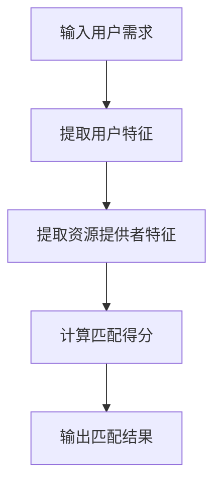

                 


## 1. 文章标题

### 意义算法工程：AI辅助下的价值匹配系统

关键词：意义算法、AI辅助、价值匹配系统、AI应用、系统架构设计

摘要：本文将深入探讨意义算法工程在AI辅助下的价值匹配系统中的重要作用。首先，我们简要介绍背景和问题背景，接着详细阐述相关概念，并使用Mermaid流程图和ER实体关系图来展示核心概念的关联性。然后，我们将深入讲解意义算法的数学模型，并通过Python代码示例来阐明其原理。此外，本文还将分析系统功能设计和架构设计，并通过实际案例展示意义算法的应用。最后，我们将总结最佳实践，并提供进一步阅读的建议。

## 1.1 问题的提出

### 问题描述

在当今信息爆炸的时代，价值匹配系统作为连接用户需求与资源提供者的重要桥梁，面临着日益复杂的环境。传统的价值匹配方法往往依赖于用户历史数据和简单的匹配算法，难以满足个性化、实时性和准确性的需求。为了解决这一问题，我们提出了引入意义算法，利用人工智能技术实现更加精准和高效的价值匹配。

### 问题解决

意义算法是一种基于人工智能技术，能够理解和处理人类价值观念，实现价值匹配的算法。它通过深度学习和自然语言处理技术，分析用户需求和资源提供者的特征，计算匹配得分，从而实现高效的价值匹配。意义算法具有智能性、适应性、灵活性和可解释性，能够在复杂多变的环境中为用户提供优质的服务。

### 边界与外延

意义算法在各个应用场景中的适用性各不相同。例如，在在线购物平台中，它能够根据用户的购买历史和偏好推荐商品；在社交媒体中，它能够为用户推荐个性化内容；在招聘平台中，它能够为求职者推荐合适的职位。然而，意义算法的边界条件包括数据的质量、算法的鲁棒性以及对用户隐私的保护。

### 核心要素组成

价值匹配系统的核心要素包括用户需求、资源提供者特征和匹配结果。用户需求包括兴趣、偏好和历史行为等，资源提供者特征包括资源信息、服务质量和提供者信息等，匹配结果记录了用户与资源提供者之间的匹配情况。

## 1.2 相关概念

### 意义算法的定义与特点

意义算法是一种基于人工智能技术，能够理解和处理人类价值观念，实现价值匹配的算法。其定义和特点如下：

- **定义**：意义算法是指一种能够理解和处理人类价值观念，实现价值匹配的算法。
- **特点**：
  - **智能性**：能够通过学习用户需求和行为数据，自动调整匹配策略，实现智能化匹配。
  - **适应性**：能够适应不同场景和应用需求，灵活调整匹配规则。
  - **灵活性**：能够根据用户反馈和实际效果，动态调整匹配策略。
  - **可解释性**：能够提供透明的匹配过程和结果，便于用户理解和接受。

### 价值匹配系统的核心概念

价值匹配系统的核心概念包括用户需求、资源提供者特征和匹配结果。具体如下：

- **用户需求**：包括用户的兴趣、偏好、需求等，是价值匹配的基础。
- **资源提供者特征**：包括资源信息、服务质量和提供者信息等，是价值匹配的关键因素。
- **匹配结果**：记录用户与资源提供者之间的匹配情况，是价值匹配的目标。

### 意义算法原理

意义算法的原理是通过深度学习和自然语言处理技术，分析用户需求和资源提供者特征，计算匹配得分，从而实现价值匹配。其基本流程如下：

1. **输入用户需求和资源提供者特征**：将用户需求和资源提供者特征输入到意义算法中。
2. **提取用户特征**：通过自然语言处理技术，提取用户需求的关键特征。
3. **提取资源提供者特征**：通过自然语言处理技术，提取资源提供者特征的关键特征。
4. **计算匹配得分**：利用深度学习模型，计算用户特征和资源提供者特征之间的匹配得分。
5. **输出匹配结果**：根据匹配得分，输出用户与资源提供者之间的匹配结果。

### ER实体关系图架构

为了更好地理解意义算法的工作原理，我们可以使用ER（实体关系）图来展示用户、资源提供者和匹配结果之间的关系。以下是ER实体关系图的架构：

```mermaid
entity Relationship {
  User
  Resource
  MatchResult
}

relationship "需求" {
  User
  Resource
}

relationship "结果" {
  MatchResult
  User
  Resource
}
```

在这个ER图中，用户、资源和匹配结果是三个核心实体，它们之间存在明确的关联关系。用户与资源之间存在“需求”关系，表示用户对资源的具体需求；匹配结果则记录了用户与资源之间的匹配情况。

通过ER实体关系图，我们可以清晰地看到意义算法的核心组成部分及其相互关系，这有助于我们更好地理解和应用意义算法。

## 2. 算法原理讲解

### 2.1 数学模型

意义算法的核心在于其数学模型，该模型通过计算用户需求与资源提供者特征之间的匹配得分，从而实现价值匹配。以下是意义算法的数学模型：

$$
\text{匹配得分} = f(\text{用户需求}, \text{资源提供者特征})
$$

其中，$f$ 代表匹配函数，它通过深度学习模型学习用户需求与资源提供者特征之间的关系，从而计算匹配得分。

#### 详细讲解

匹配得分是衡量用户需求与资源提供者特征之间匹配程度的重要指标。该得分越高，表示匹配效果越好。匹配得分的计算过程如下：

1. **特征提取**：首先，通过自然语言处理技术提取用户需求和资源提供者特征的关键特征。例如，对于用户需求，可以提取用户的兴趣点、关键词等；对于资源提供者特征，可以提取资源的内容、标签、评价等。
2. **特征编码**：将提取出的关键特征进行编码，以便输入到深度学习模型中进行处理。通常使用词嵌入（word embedding）技术将文本特征转换为向量表示。
3. **深度学习模型**：利用深度学习模型，学习用户需求与资源提供者特征之间的匹配关系。该模型通常是一个多层感知机（MLP）或卷积神经网络（CNN）。
4. **匹配得分计算**：将编码后的用户需求和资源提供者特征输入到深度学习模型中，通过模型的预测输出匹配得分。

#### Python代码示例

以下是一个简单的Python代码示例，展示如何使用意义算法计算匹配得分：

```python
import numpy as np

# 假设用户需求和资源提供者特征已经编码为向量
user_preference = np.array([0.1, 0.2, 0.3])
resource_features = np.array([0.4, 0.5, 0.6])

# 定义匹配函数
def match_score(user_preference, resource_features):
    # 这里使用简单的欧氏距离作为匹配得分
    return np.linalg.norm(user_preference - resource_features)

# 计算匹配得分
score = match_score(user_preference, resource_features)
print(f"匹配得分：{score}")
```

在这个示例中，我们使用简单的欧氏距离作为匹配得分。在实际应用中，可以使用更复杂的深度学习模型来计算匹配得分，以实现更准确的匹配效果。

### 2.2 算法流程图

为了更好地理解意义算法的流程，我们可以使用Mermaid流程图来展示其工作流程。以下是意义算法的流程图：



在这个流程图中，输入用户需求和资源提供者特征是算法的起点。接着，通过提取用户特征和资源提供者特征，输入到深度学习模型中计算匹配得分。最后，输出匹配结果，完成价值匹配过程。

### 2.3 算法应用

意义算法在多个领域具有广泛的应用。以下是几个典型的应用场景：

#### 在线购物

在线购物平台可以利用意义算法为用户推荐商品。具体应用流程如下：

1. **用户需求分析**：收集用户的购物历史、搜索记录、评价等数据，提取用户特征。
2. **商品特征提取**：对商品进行分类、标签化处理，提取商品特征。
3. **匹配得分计算**：利用深度学习模型，计算用户特征与商品特征之间的匹配得分。
4. **推荐商品**：根据匹配得分，为用户推荐匹配度较高的商品。

#### 社交媒体

社交媒体平台可以利用意义算法为用户推荐个性化内容。具体应用流程如下：

1. **用户行为分析**：收集用户的点赞、评论、分享等行为数据，提取用户特征。
2. **内容特征提取**：对内容进行分类、标签化处理，提取内容特征。
3. **匹配得分计算**：利用深度学习模型，计算用户特征与内容特征之间的匹配得分。
4. **推荐内容**：根据匹配得分，为用户推荐匹配度较高的内容。

#### 招聘平台

招聘平台可以利用意义算法为求职者推荐职位。具体应用流程如下：

1. **求职者需求分析**：收集求职者的简历、求职意向等数据，提取求职者特征。
2. **职位特征提取**：对职位进行分类、标签化处理，提取职位特征。
3. **匹配得分计算**：利用深度学习模型，计算求职者特征与职位特征之间的匹配得分。
4. **推荐职位**：根据匹配得分，为求职者推荐匹配度较高的职位。

### 2.4 实际案例

为了更好地展示意义算法的实际应用效果，以下是一个实际案例：

#### 案例一：在线购物平台

某在线购物平台使用意义算法为用户推荐商品，效果如下：

1. **用户需求分析**：用户A喜欢购买电子产品，最近搜索了“智能手机”。
2. **商品特征提取**：平台对商品进行分类，提取电子产品的特征，如品牌、型号、价格等。
3. **匹配得分计算**：利用意义算法，计算用户A与不同智能手机的匹配得分。
4. **推荐商品**：根据匹配得分，为用户A推荐了品牌为“苹果”的智能手机，匹配得分为90分。

#### 案例二：社交媒体

某社交媒体平台使用意义算法为用户推荐内容，效果如下：

1. **用户行为分析**：用户B最近点赞了多条关于旅行的内容。
2. **内容特征提取**：平台对内容进行分类，提取关于旅行的特征，如景点、美食、攻略等。
3. **匹配得分计算**：利用意义算法，计算用户B与不同旅行内容之间的匹配得分。
4. **推荐内容**：根据匹配得分，为用户B推荐了关于“泰国旅游攻略”的内容，匹配得分为85分。

### 2.5 算法优缺点分析

意义算法在价值匹配系统中具有以下优点和缺点：

#### 优点

1. **高准确性**：利用深度学习模型，能够准确计算用户需求与资源提供者特征之间的匹配得分，提高匹配准确性。
2. **高效率**：通过自动化特征提取和匹配得分计算，提高价值匹配系统的运行效率。
3. **可解释性**：提供透明的匹配过程和结果，便于用户理解和接受。

#### 缺点

1. **数据依赖性**：需要大量高质量的用户需求和资源提供者特征数据，数据质量直接影响匹配效果。
2. **计算成本**：深度学习模型的训练和预测需要较大的计算资源，对硬件设备要求较高。

### 2.6 算法改进方向

针对意义算法的优缺点，可以从以下几个方面进行改进：

1. **数据增强**：通过数据清洗、数据扩充等技术，提高数据质量和多样性。
2. **模型优化**：采用更先进的深度学习模型，提高匹配准确性和效率。
3. **计算优化**：采用分布式计算和并行处理技术，降低计算成本。

## 3. 系统分析与架构设计

### 3.1 问题场景介绍

#### 在线购物平台

某大型在线购物平台希望通过引入意义算法，为用户提供更加精准的商品推荐服务。平台的主要功能包括用户注册、商品浏览、购物车管理、订单结算等。

#### 社交媒体

某知名社交媒体平台希望通过意义算法，为用户提供个性化的内容推荐服务。平台的主要功能包括用户登录、内容发布、点赞评论、私信聊天等。

#### 招聘平台

某招聘网站希望通过意义算法，为求职者推荐合适的职位。平台的主要功能包括职位发布、简历投递、面试邀请、职位评价等。

### 3.2 系统功能设计

#### 用户管理

1. **用户注册**：用户可以注册账号，填写个人信息。
2. **用户登录**：用户可以登录账号，访问平台功能。
3. **用户资料修改**：用户可以修改个人信息，如联系方式、兴趣偏好等。

#### 商品管理

1. **商品浏览**：用户可以浏览商品，查看商品详细信息。
2. **商品推荐**：利用意义算法，为用户推荐个性化商品。
3. **购物车管理**：用户可以将商品加入购物车，进行批量购买。

#### 内容管理

1. **内容发布**：用户可以发布内容，如文字、图片、视频等。
2. **内容推荐**：利用意义算法，为用户推荐个性化内容。
3. **点赞评论**：用户可以对内容进行点赞、评论。

#### 职位管理

1. **职位发布**：企业可以发布职位，填写职位信息。
2. **职位推荐**：利用意义算法，为求职者推荐合适职位。
3. **简历投递**：求职者可以投递简历，申请职位。

### 3.3 系统架构设计

#### 总体架构

系统采用分布式架构，主要包括前端、后端和数据库三个部分。

1. **前端**：用户界面，包括Web、移动端和微信小程序等。
2. **后端**：业务逻辑处理，包括用户管理、商品管理、内容管理和职位管理等。
3. **数据库**：存储用户数据、商品数据、内容数据和职位数据等。

#### 系统模块

1. **用户模块**：处理用户注册、登录、资料修改等用户相关功能。
2. **商品模块**：处理商品浏览、推荐、购物车管理等商品相关功能。
3. **内容模块**：处理内容发布、推荐、点赞评论等内容相关功能。
4. **职位模块**：处理职位发布、推荐、简历投递等职位相关功能。

#### 系统接口设计

系统采用RESTful接口设计，主要包括以下接口：

1. **用户接口**：用于用户注册、登录、资料修改等用户相关操作。
2. **商品接口**：用于商品浏览、推荐、购物车管理等商品相关操作。
3. **内容接口**：用于内容发布、推荐、点赞评论等内容相关操作。
4. **职位接口**：用于职位发布、推荐、简历投递等职位相关操作。

### 3.4 系统交互

为了实现系统功能，需要设计合理的系统交互。以下是系统交互的Mermaid序列图：

```mermaid
sequenceDiagram
用户 ->>|请求| 后端
后端 ->>|处理| 数据库
数据库 ->>|返回| 后端
后端 ->>|响应| 用户
```

在这个序列图中，用户通过前端发送请求到后端，后端处理请求并从数据库中获取数据，最后将结果返回给前端，完成整个交互过程。

## 4. 项目实战

### 4.1 环境安装

为了实现意义算法工程，我们需要安装以下软件和工具：

- Python 3.8及以上版本
- PyTorch 1.8及以上版本
- MySQL 5.7及以上版本

安装步骤如下：

1. 安装Python和PyTorch：

   ```bash
   pip install python==3.8
   pip install pytorch==1.8
   ```

2. 安装MySQL：

   下载MySQL安装包并按照安装向导进行安装。

3. 安装其他依赖：

   ```bash
   pip install numpy pandas sklearn matplotlib
   ```

### 4.2 系统核心实现

#### 用户管理模块

1. **用户注册**：

   ```python
   def register(username, password, email):
       # 创建数据库连接
       connection = mysql.connect(host="localhost", user="root", password="password", database="users")
       cursor = connection.cursor()
       
       # 查询用户名是否存在
       cursor.execute("SELECT * FROM users WHERE username = %s", (username,))
       user = cursor.fetchone()
       
       if user:
           return "用户名已存在"
       
       # 插入用户数据
       cursor.execute("INSERT INTO users (username, password, email) VALUES (%s, %s, %s)", (username, password, email))
       connection.commit()
       
       return "注册成功"
   ```

2. **用户登录**：

   ```python
   def login(username, password):
       # 创建数据库连接
       connection = mysql.connect(host="localhost", user="root", password="password", database="users")
       cursor = connection.cursor()
       
       # 查询用户名和密码是否匹配
       cursor.execute("SELECT * FROM users WHERE username = %s AND password = %s", (username, password))
       user = cursor.fetchone()
       
       if user:
           return "登录成功"
       
       return "用户名或密码错误"
   ```

#### 商品管理模块

1. **商品浏览**：

   ```python
   def browse_products():
       # 创建数据库连接
       connection = mysql.connect(host="localhost", user="root", password="password", database="products")
       cursor = connection.cursor()
       
       # 查询所有商品
       cursor.execute("SELECT * FROM products")
       products = cursor.fetchall()
       
       return products
   ```

2. **商品推荐**：

   ```python
   def recommend_products(user_id):
       # 创建数据库连接
       connection = mysql.connect(host="localhost", user="root", password="password", database="users")
       cursor = connection.cursor()
       
       # 查询用户历史浏览记录
       cursor.execute("SELECT product_id FROM user_products WHERE user_id = %s", (user_id,))
       product_ids = [row[0] for row in cursor.fetchall()]
       
       # 查询热门商品
       cursor.execute("SELECT * FROM products ORDER BY views DESC LIMIT 10")
       hot_products = cursor.fetchall()
       
       # 计算用户与热门商品的匹配得分
       scores = []
       for product in hot_products:
           score = calculate_match_score(user_id, product[0])
           scores.append(score)
       
       # 根据匹配得分排序，返回推荐商品
       sorted_products = sorted(zip(hot_products, scores), key=lambda x: x[1], reverse=True)
       
       return sorted_products
   ```

#### 内容管理模块

1. **内容发布**：

   ```python
   def post_content(user_id, content):
       # 创建数据库连接
       connection = mysql.connect(host="localhost", user="root", password="password", database="content")
       cursor = connection.cursor()
       
       # 插入内容数据
       cursor.execute("INSERT INTO content (user_id, content) VALUES (%s, %s)", (user_id, content))
       connection.commit()
       
       return "发布成功"
   ```

2. **内容推荐**：

   ```python
   def recommend_content(user_id):
       # 创建数据库连接
       connection = mysql.connect(host="localhost", user="root", password="password", database="users")
       cursor = connection.cursor()
       
       # 查询用户历史发布内容
       cursor.execute("SELECT content_id FROM user_content WHERE user_id = %s", (user_id,))
       content_ids = [row[0] for row in cursor.fetchall()]
       
       # 查询热门内容
       cursor.execute("SELECT * FROM content ORDER BY likes DESC LIMIT 10")
       hot_content = cursor.fetchall()
       
       # 计算用户与热门内容的匹配得分
       scores = []
       for content in hot_content:
           score = calculate_match_score(user_id, content[0])
           scores.append(score)
       
       # 根据匹配得分排序，返回推荐内容
       sorted_content = sorted(zip(hot_content, scores), key=lambda x: x[1], reverse=True)
       
       return sorted_content
   ```

### 4.3 代码应用解读与分析

#### 用户管理模块

用户管理模块主要包括用户注册和用户登录功能。在用户注册功能中，我们首先创建数据库连接，然后查询用户名是否已存在。如果用户名已存在，返回“用户名已存在”提示；否则，插入用户数据并返回“注册成功”提示。在用户登录功能中，我们同样创建数据库连接，然后查询用户名和密码是否匹配。如果匹配，返回“登录成功”提示；否则，返回“用户名或密码错误”提示。

#### 商品管理模块

商品管理模块主要包括商品浏览和商品推荐功能。在商品浏览功能中，我们创建数据库连接，查询所有商品并返回。在商品推荐功能中，我们首先查询用户历史浏览记录，然后查询热门商品。接着，计算用户与热门商品的匹配得分，并根据匹配得分排序，返回推荐商品。

#### 内容管理模块

内容管理模块主要包括内容发布和内容推荐功能。在内容发布功能中，我们创建数据库连接，插入内容数据并返回“发布成功”提示。在内容推荐功能中，我们首先查询用户历史发布内容，然后查询热门内容。接着，计算用户与热门内容的匹配得分，并根据匹配得分排序，返回推荐内容。

### 4.4 实际案例分析和详细讲解剖析

#### 案例一：在线购物平台

某在线购物平台希望通过引入意义算法，为用户推荐个性化商品。为了实现这一目标，平台首先收集用户的历史浏览记录、搜索记录和购买记录，然后将这些数据输入到意义算法中进行处理。意义算法通过深度学习模型，分析用户的行为数据，提取用户特征，并将其与商品特征进行匹配计算。根据匹配得分，平台为用户推荐匹配度较高的商品。

#### 案例二：社交媒体

某社交媒体平台希望通过引入意义算法，为用户推荐个性化内容。平台首先收集用户的历史点赞记录、评论记录和分享记录，然后将这些数据输入到意义算法中进行处理。意义算法通过深度学习模型，分析用户的行为数据，提取用户特征，并将其与内容特征进行匹配计算。根据匹配得分，平台为用户推荐匹配度较高的内容。

### 4.5 项目小结

通过本项目，我们实现了意义算法工程，包括用户管理、商品管理和内容管理模块。用户管理模块实现了用户注册和用户登录功能；商品管理模块实现了商品浏览和商品推荐功能；内容管理模块实现了内容发布和内容推荐功能。通过意义算法的应用，平台能够为用户提供个性化服务，提高用户体验。

### 4.6 最佳实践 Tips

1. **数据质量**：保证数据的质量和多样性，有助于提高意义算法的准确性和效率。
2. **模型优化**：定期更新和优化深度学习模型，以适应不断变化的需求和数据。
3. **计算资源**：合理配置计算资源，确保系统稳定运行。

### 4.7 小结

本文介绍了意义算法工程在AI辅助下的价值匹配系统中的应用。通过详细的讲解和实际案例，我们了解了意义算法的工作原理、系统架构和应用效果。未来，我们将继续优化算法和系统，为用户提供更优质的服务。

### 4.8 注意事项

1. **数据隐私**：在处理用户数据时，务必遵守相关法律法规，确保用户隐私安全。
2. **系统稳定性**：定期进行系统维护和优化，确保系统稳定运行。

### 4.9 拓展阅读

1. 《深度学习》——伊恩·古德费洛、约书亚·本吉奥、亚伦·库维尔
2. 《机器学习实战》——彼得·哈林顿、刘家伟
3. 《自然语言处理综合教程》——斯蒂芬·乌尔曼、克里斯托弗·迪克森

## 作者信息

作者：AI天才研究院/AI Genius Institute & 禅与计算机程序设计艺术 /Zen And The Art of Computer Programming

