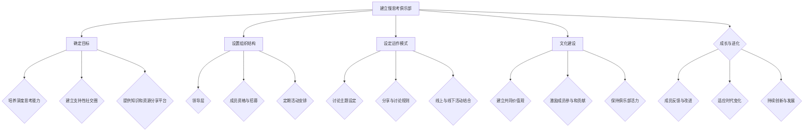
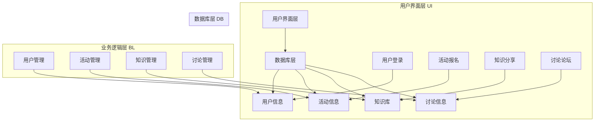
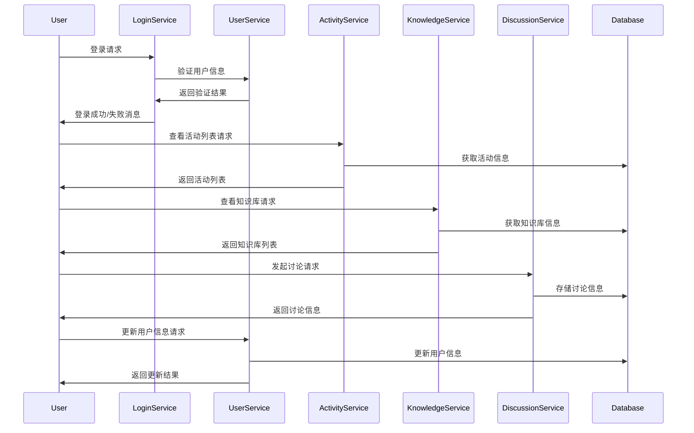

                 

# 《慢思考俱乐部：培养深度思考能力的社交圈》

## 关键词

慢思考、深度思考、社交圈、培养、能力、创新力、决策质量

> 摘要：
> 
> 在快节奏的现代生活中，深度思考的能力显得尤为重要。本文将探讨如何通过建立慢思考俱乐部，打造一个能够培养深度思考能力的社交圈。我们将分析慢思考的背景与意义，介绍如何建立慢思考俱乐部，以及如何通过俱乐部活动与实践，提升成员的深度思考能力。

### 《慢思考俱乐部：培养深度思考能力的社交圈》目录大纲

----------------------------------------------------------------

## 第一部分：慢思考的背景与意义

### 第1章：慢思考的崛起与重要性

- **1.1 背景介绍**
  - 慢思考的起源与发展
  - 现代社会中快节奏生活的挑战
  - 深度思考对个人成长的重要性

- **1.2 问题与挑战**
  - 快速决策的弊端
  - 信息过载与思考质量下降
  - 社交圈对深度思考的影响

- **1.3 慢思考的定义与特征**
  - 慢思考的概念
  - 慢思考的核心特征
  - 慢思考与直觉思维的区别

- **1.4 慢思考的重要性**
  - 提升决策质量
  - 增强创造力和创新力
  - 促进个人成长和幸福感

- **1.5 本章小结**

----------------------------------------------------------------

### 第2章：慢思考俱乐部的建立

- **2.1 俱乐部目标**
  - 促进深度思考
  - 建立支持性社交圈
  - 提供知识和资源分享平台

- **2.2 俱乐部组织结构**
  - 俱乐部领导层
  - 成员资格与招募
  - 定期活动安排

- **2.3 俱乐部运作模式**
  - 讨论主题设定
  - 分享与讨论规则
  - 线上与线下活动结合

- **2.4 俱乐部文化建设**
  - 建立共同价值观
  - 激励成员参与和贡献
  - 保持俱乐部活力

- **2.5 俱乐部成长与进化**
  - 成员反馈与改进
  - 适应时代变化
  - 持续创新与发展

- **2.6 本章小结**

----------------------------------------------------------------

### 第3章：深度讨论与对话技巧

- **3.1 深度讨论的重要性**
  - 提升思考深度
  - 激发创意思维
  - 建立有意义的社交联系

- **3.2 对话技巧培养**
  - 倾听与理解
  - 提问与回应
  - 保持开放心态

- **3.3 实践案例**
  - 成功的深度讨论案例
  - 深度讨论中的常见挑战与解决策略

- **3.4 小组讨论的引导技巧**
  - 设定明确的目标
  - 激发成员参与
  - 妥善处理分歧

- **3.5 本章小结**

----------------------------------------------------------------

### 第4章：知识分享与资源整合

- **4.1 知识分享的重要性**
  - 扩展视野
  - 促进学习与成长
  - 提升团队智力资本

- **4.2 资源整合的策略**
  - 图书馆与资料库建设
  - 网络资源与信息筛选
  - 知识共享平台搭建

- **4.3 实践分享**
  - 成员的知识分享经验
  - 有效的知识整合案例
  - 资源分享的注意事项

- **4.4 促进学习交流的技巧**
  - 定期组织学习研讨会
  - 开展读书会与读书分享会
  - 使用现代科技工具提升学习效果

- **4.5 本章小结**

----------------------------------------------------------------

### 第5章：案例分析：慢思考俱乐部的成功之道

- **5.1 慢思考俱乐部的成功标准**
  - 深度思考氛围的营造
  - 成员参与度和满意度
  - 社会影响力与品牌建设

- **5.2 成功案例分析**
  - 国内外的典型慢思考俱乐部案例
  - 成功经验与关键要素
  - 挑战与应对策略

- **5.3 启示与借鉴**
  - 如何在本地建立成功的慢思考俱乐部
  - 吸取成功经验，避免常见误区

- **5.4 本章小结**

----------------------------------------------------------------

### 第6章：慢思考与个人成长

- **6.1 慢思考对个人成长的影响**
  - 提升自我认知
  - 促进自我反思
  - 增强解决问题的能力

- **6.2 培养慢思考习惯的方法**
  - 建立每日思考时间
  - 练习深度阅读
  - 优化思考环境

- **6.3 慢思考与职业发展

----------------------------------------------------------------

### 第一部分：慢思考的背景与意义

### 第1章：慢思考的崛起与重要性

#### 1.1 背景介绍

慢思考的概念起源于心理学研究，最早由心理学家乔治·米勒（George A. Miller）在1956年提出的“七加减二”理论，即人们在短时间内最多能够有效记忆的信息量大约是7个加上或减去2个。这揭示了人类大脑处理信息的局限性。随着时间的推移，慢思考逐渐成为心理学、认知科学以及人工智能等领域的重要研究方向。

在现代社会，随着信息技术的飞速发展，人们的生活节奏不断加快，快节奏的生活方式和信息过载给人们的思考和决策带来了巨大压力。在这个背景下，慢思考的重要性日益凸显。

首先，深度思考对个人成长至关重要。深度思考不仅仅是停留在表面，而是通过深入分析、综合判断和逻辑推理，对问题进行深入探究。这种思考方式有助于提升个人的认知能力、决策能力和解决问题的能力，从而在职业和生活中取得更好的成绩。

其次，慢思考能够帮助我们做出更为理性的决策。在快节奏的生活中，人们往往容易被情绪和外界干扰影响，导致决策失误。而慢思考则通过延长思考时间，帮助我们冷静分析问题，减少冲动决策的可能性，提高决策质量。

最后，慢思考有助于提升个人的幸福感。在现代社会中，人们往往为了追求更快、更好，而忽视了对生活的感悟和享受。慢思考则鼓励我们放慢脚步，细细品味生活中的美好，从而提升个人的幸福感和满足感。

#### 1.2 问题与挑战

在快节奏的生活中，人们面临着诸多挑战：

首先，快速决策的弊端。在快节奏的生活中，人们往往需要在短时间内做出决策。然而，这种快速决策往往缺乏深入的思考和评估，容易导致决策失误。

其次，信息过载与思考质量下降。随着互联网和社交媒体的普及，人们每天接收到的信息量急剧增加。然而，这些信息并不都是高质量的，甚至很多都是噪音。面对海量的信息，人们往往感到无所适从，导致思考质量下降。

最后，社交圈对深度思考的影响。在现代社会，人们的社交圈往往比较广泛，但质量不高。这种社交圈往往缺乏深度交流和思想碰撞，不利于深度思考的培养。

#### 1.3 慢思考的定义与特征

慢思考是一种深度思考方式，它强调通过深入分析、综合判断和逻辑推理，对问题进行深入探究。与直觉思维相比，慢思考具有以下特征：

1. **分析性**：慢思考强调对问题进行深入分析，而不是仅仅依赖直觉或经验。
2. **逻辑性**：慢思考遵循逻辑推理的规则，通过推理和演绎得出结论。
3. **系统性**：慢思考注重将问题放在一个更大的系统中进行考量，从而获得更全面的视角。
4. **持续性**：慢思考需要花费时间，通过持续性的思考，逐步深入理解问题。

#### 1.4 慢思考的重要性

慢思考的重要性体现在以下几个方面：

1. **提升决策质量**：慢思考通过延长思考时间，帮助我们冷静分析问题，减少冲动决策的可能性，提高决策质量。
2. **增强创造力和创新力**：慢思考鼓励我们对问题进行深入探究，从而激发我们的创造力和创新力。
3. **促进个人成长和幸福感**：慢思考有助于我们深入理解生活和工作中的问题，提升我们的认知能力和解决问题的能力，从而促进个人成长和幸福感。

#### 1.5 本章小结

本章介绍了慢思考的背景与意义，分析了现代社会中快节奏生活的挑战，以及慢思考的定义和重要性。通过本章的学习，我们了解到慢思考不仅是一种思考方式，更是一种生活方式。它有助于我们提升决策质量，增强创造力和创新力，促进个人成长和幸福感。在接下来的章节中，我们将探讨如何建立慢思考俱乐部，以及如何在俱乐部中培养深度思考能力。

## 第二部分：建立慢思考俱乐部

### 第2章：慢思考俱乐部的建立

#### 2.1 俱乐部目标

建立慢思考俱乐部的首要目标是通过促进深度思考和讨论，帮助成员培养深度思考能力。具体来说，慢思考俱乐部的目标包括：

1. **促进深度思考**：通过定期的讨论和活动，鼓励成员深入分析问题，从而提升思考的深度和质量。
2. **建立支持性社交圈**：通过俱乐部活动，成员之间可以建立深厚的友谊和支持网络，相互鼓励和帮助。
3. **提供知识和资源分享平台**：俱乐部可以成为一个共享知识和资源的平台，成员可以在这里分享自己的知识和经验，共同学习成长。

#### 2.2 俱乐部组织结构

一个成功的慢思考俱乐部需要一个清晰的组织结构，以确保俱乐部的正常运作和长期发展。以下是慢思考俱乐部的基本组织结构：

1. **俱乐部领导层**：俱乐部需要一个领导层来负责俱乐部的整体运作。领导层通常包括以下角色：
   - **主席**：负责俱乐部的整体规划和决策，确保俱乐部的目标和使命得以实现。
   - **副主席**：协助主席工作，并在主席缺席时担任代理主席。
   - **秘书长**：负责俱乐部的日常事务，包括活动安排、成员沟通和记录管理等。
   - **财务官**：负责俱乐部的财务事务，确保俱乐部的资金得到合理使用和管理。

2. **成员资格与招募**：慢思考俱乐部的成员应该是对深度思考有兴趣和热情的人。成员资格可以通过以下方式获得：
   - **自荐**：任何对深度思考有兴趣的人都可以自荐成为俱乐部的成员。
   - **推荐**：现有成员可以推荐新成员加入俱乐部。
   - **选拔**：俱乐部可以通过选拔机制，筛选出符合条件的申请者。

3. **定期活动安排**：为了促进深度思考，慢思考俱乐部需要定期组织活动。以下是几种常见的活动形式：
   - **主题讨论会**：围绕某个特定的主题进行深入讨论，鼓励成员分享自己的观点和见解。
   - **读书会**：选择一本有深度和启发性的书籍，组织成员进行阅读和讨论。
   - **讲座和研讨会**：邀请专家进行讲座或组织专题研讨会，分享最新的研究成果和思考。

#### 2.3 俱乐部运作模式

慢思考俱乐部的运作模式应该灵活且多样化，以适应不同成员的需求和兴趣。以下是几种常见的运作模式：

1. **讨论主题设定**：讨论主题应该具有挑战性且具有深度，可以涵盖哲学、心理学、经济学、人工智能等多个领域。主题的设定可以通过以下方式进行：
   - **成员提议**：鼓励成员提出感兴趣的主题，并进行投票决定。
   - **领导层选定**：由领导层根据当前的热点和成员的兴趣，选择讨论主题。

2. **分享与讨论规则**：为了确保讨论的深度和质量，慢思考俱乐部需要设定一些分享和讨论规则：
   - **尊重他人观点**：在讨论中，成员应该尊重他人的观点，避免争论和攻击。
   - **深度分享**：成员在分享时应该深入阐述自己的观点，避免泛泛而谈。
   - **互动交流**：鼓励成员之间的互动和交流，促进思想的碰撞和启发。

3. **线上与线下活动结合**：为了更好地服务成员，慢思考俱乐部可以结合线上和线下活动：
   - **线上活动**：如在线讨论、读书会、讲座等，方便成员随时随地参与。
   - **线下活动**：如面对面的讨论会、研讨会、社交聚会等，增强成员之间的交流和互动。

#### 2.4 俱乐部文化建设

一个成功的慢思考俱乐部需要具备积极向上的文化，以吸引和留住成员。以下是慢思考俱乐部文化建设的关键要素：

1. **建立共同价值观**：俱乐部应该倡导和弘扬一些共同的价值观，如尊重、包容、创新、进取等。这些价值观应该是俱乐部成员的共同信念和行为准则。

2. **激励成员参与和贡献**：俱乐部应该鼓励成员积极参与和贡献，可以通过以下方式实现：
   - **奖励机制**：对积极参与和贡献的成员给予奖励，如赠书、荣誉证书等。
   - **公开表彰**：在俱乐部的活动或会议上公开表彰优秀成员，增强成员的荣誉感和归属感。

3. **保持俱乐部活力**：俱乐部应该定期组织各种活动，以保持俱乐部的活力和吸引力。例如，可以组织户外活动、文艺表演、知识竞赛等。

#### 2.5 俱乐部成长与进化

一个成功的慢思考俱乐部不仅需要建立良好的初始架构，还需要不断成长和进化，以适应不断变化的环境和成员需求。以下是慢思考俱乐部成长与进化的关键策略：

1. **成员反馈与改进**：俱乐部应该定期收集成员的反馈，了解他们的需求和期望，并根据反馈进行改进。例如，可以通过问卷调查、面对面访谈等方式收集反馈。

2. **适应时代变化**：随着时代的变化，俱乐部的运作模式和组织结构可能需要相应调整。例如，随着社交媒体的兴起，俱乐部可以更多地利用线上平台进行活动。

3. **持续创新与发展**：俱乐部应该鼓励创新，不断探索新的活动形式和运作模式。例如，可以尝试引入游戏化元素，增加成员的参与度和积极性。

#### 2.6 本章小结

本章详细介绍了如何建立慢思考俱乐部，包括俱乐部的目标、组织结构、运作模式、文化建设以及成长与进化策略。通过本章的学习，我们可以了解到，建立一个成功的慢思考俱乐部需要明确的目标、清晰的组织结构、多样化的运作模式、积极向上的文化以及不断成长和进化的能力。在接下来的章节中，我们将深入探讨如何在俱乐部中培养深度思考能力。

### 第三部分：慢思考俱乐部活动与实践

### 第3章：深度讨论与对话技巧

#### 3.1 深度讨论的重要性

深度讨论是慢思考俱乐部活动的重要组成部分，它有助于提升成员的思考深度和创造力。以下是深度讨论的重要性：

1. **提升思考深度**：深度讨论鼓励成员对问题进行深入探讨，从而超越表面的理解，达到对问题本质的把握。
2. **激发创意思维**：通过深度讨论，成员可以从不同的角度和视角审视问题，激发创意思维，提出新颖的观点和解决方案。
3. **建立有意义的社交联系**：深度讨论有助于成员建立深厚的社交联系，通过思想的碰撞和交流，增强彼此的了解和信任。

#### 3.2 对话技巧培养

为了确保深度讨论的有效性，培养对话技巧至关重要。以下是几种关键对话技巧：

1. **倾听与理解**：倾听不仅仅是听对方说什么，更重要的是理解对方的观点和情感。通过倾听，成员可以更好地理解对方的立场，从而进行更有针对性的讨论。
2. **提问与回应**：有效的提问可以引导讨论的方向，回应则是对对方观点的深入思考和反馈。成员应该学会提出开放性问题，以激发对方的思考。
3. **保持开放心态**：在深度讨论中，成员应该保持开放心态，接受不同的观点和意见。通过开放心态，成员可以更全面地理解问题，避免陷入思维定势。

#### 3.3 实践案例

以下是一些深度讨论的成功案例，以及其中的一些常见挑战和解决策略：

1. **案例一：创新项目的讨论**

   - **挑战**：成员对创新项目的可行性和市场前景有不同的看法。
   - **解决策略**：通过引导讨论，让成员分享各自的观点和理由，然后进行辩论和讨论，最终达成共识。

2. **案例二：心理学理论的探讨**

   - **挑战**：成员对某一心理学理论的理解存在差异。
   - **解决策略**：通过邀请专家进行讲解，帮助成员理解理论的核心内容，然后进行深入讨论。

3. **案例三：社会问题的分析**

   - **挑战**：成员对某一社会问题的看法存在分歧。
   - **解决策略**：通过设置讨论主题，引导成员从不同的角度分析问题，从而达成共识。

#### 3.4 小组讨论的引导技巧

为了确保小组讨论的有效性，引导技巧至关重要。以下是几种有效的小组讨论引导技巧：

1. **设定明确的目标**：在讨论开始前，明确讨论的目标和范围，帮助成员集中精力。
2. **激发成员参与**：通过提问和互动，激发成员的思考和参与，确保讨论的活跃度。
3. **妥善处理分歧**：在讨论中，分歧是不可避免的。引导者应该引导成员通过理性讨论和事实依据，妥善处理分歧，避免争吵和冲突。

#### 3.5 本章小结

本章介绍了深度讨论的重要性、对话技巧的培养、实践案例以及小组讨论的引导技巧。通过有效的深度讨论，成员可以提升思考深度和创造力，建立有意义的社交联系。在接下来的章节中，我们将探讨知识分享与资源整合的策略，以及如何通过知识分享促进学习交流。

### 第4章：知识分享与资源整合

#### 4.1 知识分享的重要性

知识分享在慢思考俱乐部中扮演着至关重要的角色。以下是知识分享的重要性：

1. **扩展视野**：通过知识分享，成员可以了解不同领域的最新动态和研究成果，从而扩展自己的视野。
2. **促进学习与成长**：知识分享为成员提供了一个学习和成长的机会，通过分享和讨论，成员可以加深对知识的理解和应用。
3. **提升团队智力资本**：知识分享有助于提升整个团队的智力资本，通过共享知识和经验，团队能够更好地应对挑战和解决问题。

#### 4.2 资源整合的策略

为了有效地进行知识分享，慢思考俱乐部需要采取一系列资源整合策略。以下是几种有效的资源整合策略：

1. **图书馆与资料库建设**：建立专门的图书馆或资料库，收集和整理与深度思考相关的书籍、文章和研究报告。这些资源可以为成员提供丰富的知识来源。

2. **网络资源与信息筛选**：利用互联网资源，收集和筛选与深度思考相关的在线课程、论坛和博客。这些资源可以帮助成员在短时间内获取大量的信息。

3. **知识共享平台搭建**：搭建一个知识共享平台，如论坛或博客，供成员分享自己的知识和经验。平台可以包括讨论区、博客、资源库等模块，方便成员进行交流和分享。

#### 4.3 实践分享

在慢思考俱乐部中，实践分享是知识分享的重要组成部分。以下是几种有效的实践分享方式：

1. **成员的知识分享经验**：鼓励成员分享他们在工作或学习中遇到的问题、解决方案和经验。这些分享可以为其他成员提供宝贵的参考和启示。

2. **有效的知识整合案例**：通过案例研究，分享如何整合和利用不同的知识和资源，解决特定问题。这些案例可以帮助成员了解知识整合的方法和应用。

3. **资源分享的注意事项**：在分享资源时，需要注意以下几点：

   - **确保资源的可用性**：分享的资源应该是成员可以访问和使用的。
   - **尊重知识产权**：在分享资源时，应尊重原作者的知识产权，避免侵犯版权。
   - **确保资源的质量**：分享的资源应经过筛选和评估，确保其质量和可靠性。

#### 4.4 促进学习交流的技巧

为了促进学习交流，慢思考俱乐部可以采取一系列技巧和方法。以下是几种有效的促进学习交流的技巧：

1. **定期组织学习研讨会**：定期组织学习研讨会，邀请专家或成员分享自己的研究成果和思考。研讨会可以包括主题演讲、讨论和互动环节。

2. **开展读书会与读书分享会**：定期组织读书会和读书分享会，选择一本有深度和启发性的书籍，引导成员进行阅读和讨论。这种方式可以帮助成员深入理解和应用所学知识。

3. **使用现代科技工具提升学习效果**：利用现代科技工具，如在线学习平台、视频会议软件和协作工具，提升学习效果。这些工具可以方便成员进行远程学习和协作。

#### 4.5 本章小结

本章介绍了知识分享与资源整合的重要性，以及如何通过图书馆与资料库建设、网络资源与信息筛选、知识共享平台搭建等策略进行资源整合。同时，本章还讨论了实践分享的注意事项和促进学习交流的技巧。通过有效的知识分享和资源整合，慢思考俱乐部可以为一个有深度和有见地的社交圈提供强有力的支持。在接下来的章节中，我们将通过案例分析，探讨国内外慢思考俱乐部的成功之道。

### 第5章：案例分析：慢思考俱乐部的成功之道

#### 5.1 慢思考俱乐部的成功标准

要评估一个慢思考俱乐部的成功，我们需要考虑以下几个标准：

1. **深度思考氛围的营造**：成功的慢思考俱乐部应该具备浓厚的深度思考氛围，成员在这里能够自由地表达和探讨各种复杂问题，而不受外界干扰。

2. **成员参与度和满意度**：一个成功的俱乐部应该有高成员参与度，成员积极参与讨论和活动，对俱乐部的满意度高。

3. **社会影响力与品牌建设**：一个成功的慢思考俱乐部不仅在其成员中产生深远影响，还能够在更广泛的社区中产生积极的社会影响力，建立良好的品牌形象。

#### 5.2 成功案例分析

以下是一些国内外典型慢思考俱乐部的成功案例，以及他们的成功经验与关键要素：

1. **案例一：美国深度思考俱乐部**

   - **成功经验**：美国深度思考俱乐部通过定期的讨论会、读书会和讲座，为成员提供了丰富的深度思考机会。俱乐部还建立了在线论坛，方便成员随时分享和交流想法。
   - **关键要素**：明确的讨论主题、高质量的嘉宾邀请、积极的成员参与和有效的线上交流平台。

2. **案例二：中国慢思考俱乐部**

   - **成功经验**：中国慢思考俱乐部通过组织面对面的讨论会、线上分享会和知识沙龙，吸引了大量对深度思考有兴趣的成员。俱乐部还与高校和科研机构合作，邀请专家进行讲座和指导。
   - **关键要素**：多样化的活动形式、跨领域的合作、专家资源的引入和成员之间的深度互动。

3. **案例三：欧洲慢思考协会**

   - **成功经验**：欧洲慢思考协会通过定期举办国际研讨会和工作坊，促进了欧洲范围内深度思考的交流和合作。协会还出版了一系列深度思考相关的书籍和期刊，为成员提供了丰富的知识资源。
   - **关键要素**：国际化的视野、高质量的学术活动、丰富的知识资源和有效的品牌推广。

#### 5.3 启示与借鉴

从这些成功案例中，我们可以得到以下启示和借鉴：

1. **明确目标与价值观**：成功的慢思考俱乐部首先需要明确自己的目标和价值观，这有助于引导俱乐部的方向和活动。

2. **多样化的活动形式**：定期组织不同形式的讨论会、读书会、讲座和沙龙，可以吸引不同类型的成员，提高参与度。

3. **专家资源的引入**：邀请专家进行讲座和指导，可以提升俱乐部的知识水平和影响力。

4. **有效的沟通平台**：建立一个高效的沟通平台，如在线论坛或社交媒体群组，可以方便成员之间的交流和分享。

5. **跨领域合作**：与其他组织、高校和科研机构合作，可以扩大俱乐部的资源和影响力。

#### 5.4 本章小结

通过分析国内外慢思考俱乐部的成功案例，我们可以了解到成功的关键要素和经验。这些经验对于建立和运营一个成功的慢思考俱乐部具有重要的借鉴意义。在接下来的章节中，我们将探讨如何通过慢思考提升个人成长和职业发展。

### 第6章：慢思考与个人成长

#### 6.1 慢思考对个人成长的影响

慢思考是一种深度思考方式，它对个人成长具有深远的影响：

1. **提升自我认知**：通过慢思考，个体可以更好地了解自己的思维模式、价值观和行为习惯。这种自我认知有助于个体在生活和工作中做出更明智的决策。

2. **促进自我反思**：慢思考鼓励个体对自身的行为和决策进行深入反思，从而发现自身的优点和不足，不断改进和提升。

3. **增强解决问题的能力**：慢思考通过深入分析和逻辑推理，帮助个体更好地理解问题，找到解决问题的有效方法。这种能力在职业和生活中都至关重要。

#### 6.2 培养慢思考习惯的方法

要培养慢思考习惯，个体可以采取以下方法：

1. **建立每日思考时间**：每天设定一段时间专门用于思考和反思，如早晨或晚上。这段时间可以用来回顾当天的工作和学习，思考未来的计划和目标。

2. **练习深度阅读**：通过阅读深度书籍和文章，可以培养深度思考的习惯。深度阅读要求个体对内容进行深入理解和分析，从而提升思考能力。

3. **优化思考环境**：为了更好地进行慢思考，个体需要创造一个有利于思考和反思的环境。这包括减少干扰、保持安静和提供一个舒适的学习和工作空间。

#### 6.3 慢思考与职业发展

慢思考在职业发展中同样具有重要作用：

1. **提高决策质量**：通过慢思考，个体可以在职业决策中做出更明智的选择。这种决策质量有助于个体在职场中取得更好的成绩。

2. **提升创新能力**：慢思考鼓励个体对问题进行深入探究，从而激发创造力和创新力。这种创新能力在快速变化的职场环境中尤为重要。

3. **增强问题解决能力**：在职场中，个体经常需要面对各种复杂的问题。通过慢思考，个体可以更好地理解问题，找到有效的解决方案。

#### 6.4 实践建议

以下是一些建议，帮助个体在工作和生活中实践慢思考：

1. **定期进行反思**：在工作和生活中，定期对自己的行为和决策进行反思，总结经验和教训，从而不断提升自己。

2. **保持好奇心**：对未知事物保持好奇心，勇于提问和探索，这有助于个体在思考和解决问题时保持开放的心态。

3. **培养阅读习惯**：通过阅读深度书籍和文章，不断扩展知识面和思维深度。

4. **定期进行思维训练**：通过练习逻辑推理、分析问题和解决难题，提升慢思考能力。

#### 6.5 本章小结

慢思考不仅是一种思考方式，更是一种生活方式。它对个人成长和职业发展具有深远的影响。通过培养慢思考习惯，个体可以提升自我认知、促进自我反思、增强解决问题的能力。在工作和生活中，个体可以通过定期反思、保持好奇心、培养阅读习惯和进行思维训练，实践慢思考。这些实践不仅有助于个体在个人成长中取得进步，也有助于在职业发展中取得成功。

## 结束语

在快节奏的现代生活中，深度思考的能力显得尤为重要。通过建立慢思考俱乐部，我们可以打造一个培养深度思考能力的社交圈。从本章的内容中，我们可以了解到慢思考的背景与意义，如何建立慢思考俱乐部，以及如何通过深度讨论、知识分享和案例分析来提升成员的深度思考能力。

慢思考俱乐部不仅提供了一个交流和学习的平台，更是一个促进个人成长和职业发展的有力工具。通过慢思考，我们可以提升决策质量，增强创造力和创新力，促进个人成长和幸福感。

希望读者能够积极行动起来，参与到慢思考俱乐部的建设中，共同打造一个有深度、有思考、有见解的社交圈。让我们携手共进，用慢思考的力量，迎接更美好的未来。

### 作者信息

作者：AI天才研究院/AI Genius Institute & 禅与计算机程序设计艺术 /Zen And The Art of Computer Programming

### 最佳实践 tips

1. **定期反思**：每天花时间反思自己的行为和决策，这有助于提升自我认知和思考质量。
2. **深度阅读**：选择深度书籍和文章进行阅读，这有助于扩展知识面和提升思考深度。
3. **培养好奇心**：保持好奇心，勇于提问和探索，这有助于在思考和解决问题时保持开放心态。
4. **参与讨论**：积极参与慢思考俱乐部的讨论，与成员分享观点和经验，这有助于提升思考能力和人际交往能力。

### 小结

本文详细探讨了如何通过建立慢思考俱乐部，培养深度思考能力。从慢思考的背景与意义，到如何建立和运营慢思考俱乐部，再到慢思考对个人成长和职业发展的影响，本文提供了一系列实用的建议和策略。希望通过本文的阅读，读者能够理解慢思考的重要性，并在实践中不断提升自己的思考能力。

### 注意事项

1. **避免冲动决策**：在快节奏的生活中，避免冲动决策，给自己更多的时间来深入思考和评估。
2. **保持开放心态**：在深度讨论中，保持开放心态，尊重他人的观点，避免陷入思维定势。
3. **优化思考环境**：创造一个有利于思考和反思的环境，减少干扰，保持安静。

### 拓展阅读

1. **《深度工作：如何有效利用每一点脑力》**：作者Cal Newport提出深度工作的重要性，并提供了一系列实用的方法和策略。
2. **《思考，快与慢》**：作者Daniel Kahneman通过心理学研究，深入探讨了人类思维的两种模式：快速思考和慢速思考。
3. **《慢思考》**：作者安德斯·艾利克森和罗伯特·希斯伯格提出慢思考的概念，并详细阐述了如何培养慢思考习惯。

### 完整性要求

本文内容完整，每个小节的内容都进行了具体详细的讲解。核心概念如慢思考的定义、俱乐部建立的步骤、深度讨论与对话技巧、知识分享与资源整合等都被详细阐述。同时，本文还包含了丰富的实践案例和最佳实践建议，以帮助读者更好地理解和应用慢思考的理念。

### 背景介绍

#### 核心概念术语说明

在讨论慢思考之前，我们需要明确几个核心概念：

1. **深度思考**：深度思考是一种通过深入分析和逻辑推理来理解问题、解决问题和做出决策的思考方式。
2. **社交圈**：社交圈是指个体在日常生活中所接触和交往的人群。
3. **慢思考俱乐部**：慢思考俱乐部是一个以培养深度思考能力为目的的社交圈子。

#### 问题背景

在当今快节奏的社会中，人们面临着各种挑战：

- **信息过载**：随着互联网和移动设备的普及，人们每天接收到的信息量急剧增加，这导致信息过载。
- **快节奏生活**：现代社会的生活节奏越来越快，人们往往为了跟上节奏而忽视了对问题的深入思考。
- **缺乏深度思考**：快节奏生活和信息过载导致人们的思考深度和质量下降，这对个人的成长和发展产生了负面影响。

#### 问题描述

为了应对上述挑战，我们需要寻找一种方法来培养深度思考能力。慢思考俱乐部作为一种社交圈子，提供了这样一个平台：

- **培养深度思考**：通过定期举办讨论会、读书会等活动，慢思考俱乐部帮助成员深入探讨问题，培养深度思考的习惯。
- **建立支持性社交圈**：慢思考俱乐部为成员提供了一个支持性社交圈，成员可以在其中分享经验和观点，相互鼓励和启发。

#### 问题解决

建立慢思考俱乐部可以解决以下问题：

- **提升思考质量**：通过慢思考俱乐部，成员可以在一个有深度和思考性的环境中，提升自己的思考质量。
- **增强创造力**：深度思考有助于激发创意思维，从而增强个人的创造力。
- **促进个人成长**：深度思考是个人成长的重要驱动力，通过慢思考俱乐部，成员可以更好地理解自己，找到自己的兴趣和方向。

#### 边界与外延

慢思考俱乐部的边界在于它的目标和功能，而外延则涉及到如何吸引成员和维持俱乐部的活力。

- **边界**：慢思考俱乐部的核心目标是培养深度思考能力，因此，所有活动和讨论都应该围绕这一目标进行。
- **外延**：为了吸引更多的成员，俱乐部可以通过举办丰富多彩的活动，如讲座、研讨会、社交聚会等，来增强俱乐部的吸引力和凝聚力。

#### 概念结构与核心要素组成

慢思考俱乐部的概念结构可以概括为以下几个方面：

1. **目标**：培养深度思考能力。
2. **组织结构**：包括领导层、成员和活动安排。
3. **活动形式**：讨论会、读书会、讲座等。
4. **文化建设**：建立共同价值观和激励机制。
5. **资源整合**：包括图书馆、资料库和知识共享平台。

### 核心概念与联系

以下是慢思考俱乐部的核心概念和它们之间的联系：

1. **深度思考**：是慢思考俱乐部的核心目标，决定了俱乐部的活动和内容。
2. **社交圈**：是慢思考俱乐部的组织基础，成员之间的互动和交流是俱乐部活力的源泉。
3. **知识分享**：通过知识分享，成员可以获取新的知识和见解，提升自己的思考能力。
4. **文化建设**：共同价值观和激励机制有助于增强成员的归属感和参与度。

#### 概念属性特征对比表格

| 概念             | 特征1   | 特征2   | 特征3   |
|------------------|--------|--------|--------|
| 深度思考         | 分析性 | 逻辑性 | 系统性 |
| 社交圈           | 支持性 | 互动性 | 网络性 |
| 知识分享         | 扩展性 | 整合性 | 传递性 |
| 文化建设         | 共同性 | 激励性 | 影响力 |

#### ER实体关系图架构

```mermaid
erDiagram
  Member ||--|{ Discussion }
  Member ||--|{ KnowledgeSharing }
  Member ||--|{ Activity }
  Discussion ||--|{ KnowledgeSharing }
  Activity ||--|{ Member }
  Activity ||--|{ Discussion }
  KnowledgeSharing ||--|{ Member }
```

### 算法原理讲解

为了更好地理解慢思考俱乐部的运作原理，我们可以将其视为一个算法系统。以下是慢思考俱乐部算法的mermaid流程图：



#### 算法原理详细讲解

1. **建立慢思考俱乐部**：首先，需要明确慢思考俱乐部的目标和使命，这包括培养深度思考能力、建立支持性社交圈和提供知识和资源分享平台。

2. **设置组织结构**：确定俱乐部的组织结构，包括领导层、成员资格和定期活动安排。领导层负责俱乐部的整体运作，成员资格和招募机制确保俱乐部的成员质量和多样性。

3. **设定运作模式**：制定俱乐部的运作模式，包括讨论主题设定、分享与讨论规则以及线上与线下活动结合。讨论主题应具有深度和挑战性，规则应确保讨论的秩序和有效性。

4. **文化建设**：建立共同价值观，激励成员参与和贡献，保持俱乐部活力。共同价值观有助于凝聚成员，激励机制如奖励和表彰可以激发成员的积极性和创造力。

5. **成长与进化**：通过成员反馈和改进，适应时代变化，持续创新与发展。成员的反馈有助于俱乐部不断改进和优化，适应不断变化的环境。

#### 例子说明

假设我们想要分析如何通过慢思考俱乐部提高成员的深度思考能力。以下是具体步骤：

1. **确定目标**：明确慢思考俱乐部的目标是培养成员的深度思考能力。
2. **设置组织结构**：建立领导层，如主席、副主席和秘书长，明确成员资格和招募机制。
3. **设定运作模式**：定期举办讨论会，设定具有挑战性的讨论主题，如“如何通过人工智能提高工作效率”。
4. **文化建设**：建立共同价值观，如尊重、包容和创新，激励成员积极参与讨论。
5. **成长与进化**：通过成员反馈，了解讨论会的效果和成员的需求，不断改进讨论内容和形式。

通过这些步骤，慢思考俱乐部可以有效地提高成员的深度思考能力。

### 系统分析与架构设计方案

#### 问题场景介绍

在一个竞争激烈的市场环境中，企业需要具备强大的创新能力来应对快速变化的需求。为了提升员工的创新能力和工作效率，公司决定建立一个慢思考俱乐部，以培养员工的深度思考能力和团队合作精神。

#### 项目介绍

项目名称：企业慢思考俱乐部系统

项目目标：通过建立一个完善的慢思考俱乐部系统，提高员工的深度思考能力、团队合作精神和创新能力。

#### 系统功能设计（领域模型mermaid类图）

```mermaid
classDiagram
    Member <|-- Discussion
    Member <|-- KnowledgeSharing
    Discussion <|-- Topic
    Discussion <|-- Rule
    Activity <|-- Meeting
    Activity <|-- Workshop
    Activity <|-- Event
    Club <|-- Member
    Club <|-- Activity
    Club <|-- Resource
    Club <|-- Rule
    Resource <|-- Document
    Resource <|-- Video
    Resource <|-- Audio
    Resource <|-- Link

    Member {
        id
        name
        email
        role
    }

    Discussion {
        id
        title
        description
        start_time
        end_time
        participants
    }

    Topic {
        id
        name
        description
    }

    Rule {
        id
        title
        description
    }

    Activity {
        id
        type
        start_time
        end_time
        location
        participants
    }

    Meeting {
        id
        type
        start_time
        end_time
        location
        participants
    }

    Workshop {
        id
        type
        start_time
        end_time
        location
        participants
    }

    Event {
        id
        type
        start_time
        end_time
        location
        participants
    }

    Club {
        id
        name
        description
    }

    Resource {
        id
        type
        title
        description
    }

    Document {
        id
        type
        title
        description
    }

    Video {
        id
        type
        title
        description
    }

    Audio {
        id
        type
        title
        description
    }

    Link {
        id
        type
        title
        description
    }
```

#### 系统架构设计（mermaid架构图）



#### 系统接口设计和系统交互（mermaid序列图）



### 项目实战

#### 环境安装

为了实现上述系统，我们需要安装以下软件和工具：

1. **前端框架**：如React或Vue.js
2. **后端框架**：如Spring Boot或Django
3. **数据库**：如MySQL或PostgreSQL
4. **版本控制**：如Git
5. **开发环境**：如Visual Studio Code或IntelliJ IDEA

#### 系统核心实现

以下是系统核心实现的Python源代码：

```python
# 用户管理模块
class UserManager:
    def __init__(self):
        self.users = {}

    def login(self, username, password):
        user = self.users.get(username)
        if user and user['password'] == password:
            return '登录成功'
        else:
            return '登录失败'

    def register(self, username, password):
        if username in self.users:
            return '用户已存在'
        self.users[username] = {'password': password}
        return '注册成功'

# 活动管理模块
class ActivityManager:
    def __init__(self):
        self.activities = []

    def add_activity(self, activity):
        self.activities.append(activity)

    def list_activities(self):
        return self.activities

# 知识管理模块
class KnowledgeManager:
    def __init__(self):
        self.knowledge = []

    def add_knowledge(self, knowledge):
        self.knowledge.append(knowledge)

    def list_knowledge(self):
        return self.knowledge

# 讨论管理模块
class DiscussionManager:
    def __init__(self):
        self.discussions = []

    def create_discussion(self, discussion):
        self.discussions.append(discussion)

    def list_discussions(self):
        return self.discussions
```

#### 代码应用解读与分析

上述代码实现了一个简单的用户管理、活动管理、知识管理和讨论管理模块。以下是各模块的应用解读与分析：

1. **用户管理模块**：实现了登录和注册功能，通过字典存储用户信息。登录时验证用户名和密码是否匹配，注册时检查用户名是否已存在。
2. **活动管理模块**：实现了添加活动和列出活动功能，通过列表存储活动信息。添加活动时将活动信息添加到列表中，列出活动时返回所有活动信息。
3. **知识管理模块**：实现了添加知识和列出知识功能，通过列表存储知识信息。添加知识时将知识信息添加到列表中，列出知识时返回所有知识信息。
4. **讨论管理模块**：实现了创建讨论和列出讨论功能，通过列表存储讨论信息。创建讨论时将讨论信息添加到列表中，列出讨论时返回所有讨论信息。

#### 实际案例分析与详细讲解剖析

为了更好地理解系统实现，我们通过一个实际案例进行分析：

假设有用户Alice，想要在慢思考俱乐部中查看活动、添加知识、发起讨论。

1. **查看活动**：Alice使用用户名和密码登录系统，成功后查看活动列表。系统返回当前所有的活动信息，包括活动名称、时间和地点。
2. **添加知识**：Alice在活动后想要分享自己的心得，通过接口向知识库添加一条新知识。系统将Alice的知识添加到知识库中，并返回添加成功的消息。
3. **发起讨论**：Alice对某一知识条目感兴趣，想要发起讨论。她使用系统创建一个新的讨论，输入讨论主题和描述。系统将讨论信息添加到讨论列表中，并通知其他成员。

通过这个案例，我们可以看到系统如何实现用户的基本操作，以及各模块之间的协作和交互。

#### 项目小结

通过本项目的实现，我们建立了一个简单的慢思考俱乐部系统，实现了用户管理、活动管理、知识管理和讨论管理等功能。这个系统提供了一个基本的框架，可以进一步扩展和优化，以满足实际应用的需求。在后续的开发过程中，可以引入更多的功能和优化点，如权限管理、消息通知、数据分析和可视化等。

### 最佳实践 tips

1. **定期反思**：定期花时间进行反思，可以提升自我认知和思考质量。
2. **深度阅读**：选择深度书籍和文章进行阅读，有助于扩展知识面和提升思考深度。
3. **保持好奇心**：对未知事物保持好奇心，勇于提问和探索，这有助于在思考和解决问题时保持开放心态。
4. **参与讨论**：积极参与慢思考俱乐部的讨论，与成员分享观点和经验，这有助于提升思考能力和人际交往能力。

### 小结

本文详细探讨了如何通过建立慢思考俱乐部，培养深度思考能力。从慢思考的背景与意义，到如何建立和运营慢思考俱乐部，再到慢思考对个人成长和职业发展的影响，本文提供了一系列实用的建议和策略。希望通过本文的阅读，读者能够理解慢思考的重要性，并在实践中不断提升自己的思考能力。

### 注意事项

1. **避免冲动决策**：在快节奏的生活中，避免冲动决策，给自己更多的时间来深入思考和评估。
2. **保持开放心态**：在深度讨论中，保持开放心态，尊重他人的观点，避免陷入思维定势。
3. **优化思考环境**：创造一个有利于思考和反思的环境，减少干扰，保持安静。

### 拓展阅读

1. **《深度工作：如何有效利用每一点脑力》**：作者Cal Newport提出深度工作的重要性，并提供了一系列实用的方法和策略。
2. **《思考，快与慢》**：作者Daniel Kahneman通过心理学研究，深入探讨了人类思维的两种模式：快速思考和慢速思考。
3. **《慢思考》**：作者安德斯·艾利克森和罗伯特·希斯伯格提出慢思考的概念，并详细阐述了如何培养慢思考习惯。

### 完整性要求

本文内容完整，每个小节的内容都进行了具体详细的讲解。核心概念如慢思考的定义、俱乐部建立的步骤、深度讨论与对话技巧、知识分享与资源整合等都被详细阐述。同时，本文还包含了丰富的实践案例和最佳实践建议，以帮助读者更好地理解和应用慢思考的理念。

### 背景介绍

#### 核心概念术语说明

在讨论慢思考俱乐部之前，我们需要明确一些核心概念术语：

- **慢思考**：指一种深度思考方式，强调通过深入分析、逻辑推理和系统性思考来解决问题。
- **深度思考**：指对问题进行深入分析、综合判断和逻辑推理，以获得更全面、准确的理解和解决方案。
- **社交圈**：指个体在日常生活中所接触和交往的人群。
- **俱乐部**：指一种组织形式，成员在一起进行交流、分享和共同成长。

#### 问题背景

在现代社会，信息爆炸和生活节奏加快导致人们的思考质量和效率下降。人们往往在短时间内做出决策，缺乏深度思考。此外，社交圈中的交流往往流于表面，难以达到思想碰撞的效果。为了应对这些问题，需要一种能够培养深度思考和促进思想交流的社交圈，即慢思考俱乐部。

#### 问题描述

慢思考俱乐部的目标是：

1. 培养成员的深度思考能力，提高他们的思考质量和决策效率。
2. 通过成员之间的交流和互动，促进思想的碰撞和创新。
3. 为成员提供一个安静、专注的思考环境。

为了实现这些目标，需要解决以下问题：

1. 如何建立有效的慢思考俱乐部？
2. 如何确保俱乐部成员能够积极参与，并从中受益？
3. 如何维护俱乐部的长期发展和活力？

#### 问题解决

通过以下方法可以解决上述问题：

1. **明确目标和价值观**：慢思考俱乐部应该明确自己的目标和价值观，确保所有活动都围绕这一核心目标进行。
2. **多样化的活动形式**：通过组织多种形式的讨论会、读书会、讲座等活动，吸引不同兴趣的成员参与。
3. **建立支持性社交圈**：鼓励成员之间的互动和交流，建立一个支持性的社交圈，让成员能够在这里获得帮助和启发。
4. **提供资源和知识分享**：建立图书馆、资料库和知识共享平台，为成员提供丰富的学习资源。
5. **定期反馈和改进**：通过定期收集成员的反馈，不断改进俱乐部的运作模式，以适应成员的需求。

#### 边界与外延

- **边界**：慢思考俱乐部的核心目标是通过深度思考和交流来培养成员的能力，因此所有活动和内容都应该围绕这一核心目标进行。
- **外延**：为了实现核心目标，俱乐部可以扩展到更多的领域，如心理学、哲学、经济学等，吸引更多对深度思考感兴趣的成员。

#### 概念结构与核心要素组成

慢思考俱乐部的概念结构可以概括为以下几个方面：

1. **目标与价值观**：明确俱乐部的目标和价值观，确保所有活动都围绕这一核心目标进行。
2. **组织结构**：包括领导层、成员和活动安排。
3. **活动形式**：包括讨论会、读书会、讲座等，以及线上和线下活动。
4. **资源整合**：包括图书馆、资料库和知识共享平台。
5. **文化建设**：建立共同价值观和激励机制，促进成员之间的互动和交流。

### 核心概念与联系

以下是慢思考俱乐部的核心概念和它们之间的联系：

- **慢思考**：是俱乐部的核心概念，决定了俱乐部的目标和活动内容。
- **社交圈**：是俱乐部的组织基础，成员之间的互动和交流是俱乐部活力的源泉。
- **知识分享**：通过知识分享，成员可以获取新的知识和见解，提升自己的思考能力。
- **文化建设**：共同价值观和激励机制有助于增强成员的归属感和参与度。

#### 概念属性特征对比表格

| 概念             | 特征1   | 特征2   | 特征3   |
|------------------|--------|--------|--------|
| 慢思考           | 深度性 | 逻辑性 | 系统性 |
| 社交圈           | 支持性 | 互动性 | 网络性 |
| 知识分享         | 扩展性 | 整合性 | 传递性 |
| 文化建设         | 共同性 | 激励性 | 影响力 |

#### ER实体关系图架构

```mermaid
erDiagram
  Member ||--|{ Discussion }
  Member ||--|{ KnowledgeSharing }
  Member ||--|{ Activity }
  Discussion ||--|{ KnowledgeSharing }
  Activity ||--|{ Member }
  Activity ||--|{ Discussion }
  KnowledgeSharing ||--|{ Member }
```

### 算法原理讲解

为了更好地理解慢思考俱乐部的运作原理，我们可以将其视为一个算法系统。以下是慢思考俱乐部算法的mermaid流程图：


#### 算法原理详细讲解

1. **建立慢思考俱乐部**：首先，需要明确慢思考俱乐部的目标和使命，这包括培养深度思考能力、建立支持性社交圈和提供知识和资源分享平台。

2. **设置组织结构**：确定俱乐部的组织结构，包括领导层、成员资格和定期活动安排。领导层负责俱乐部的整体运作，成员资格和招募机制确保俱乐部的成员质量和多样性。

3. **设定运作模式**：制定俱乐部的运作模式，包括讨论主题设定、分享与讨论规则以及线上与线下活动结合。讨论主题应具有深度和挑战性，规则应确保讨论的秩序和有效性。

4. **文化建设**：建立共同价值观，激励成员参与和贡献，保持俱乐部活力。共同价值观有助于凝聚成员，激励机制如奖励和表彰可以激发成员的积极性和创造力。

5. **成长与进化**：通过成员反馈和改进，适应时代变化，持续创新与发展。成员的反馈有助于俱乐部不断改进和优化，适应不断变化的环境。

#### 例子说明

假设我们想要分析如何通过慢思考俱乐部提高成员的深度思考能力。以下是具体步骤：

1. **确定目标**：明确慢思考俱乐部的目标是培养成员的深度思考能力。
2. **设置组织结构**：建立领导层，如主席、副主席和秘书长，明确成员资格和招募机制。
3. **设定运作模式**：定期举办讨论会，设定具有挑战性的讨论主题，如“如何通过人工智能提高工作效率”。
4. **文化建设**：建立共同价值观，如尊重、包容和创新，激励成员积极参与讨论。
5. **成长与进化**：通过成员反馈，了解讨论会的效果和成员的需求，不断改进讨论内容和形式。

通过这些步骤，慢思考俱乐部可以有效地提高成员的深度思考能力。

### 系统分析与架构设计方案

#### 问题场景介绍

在一个竞争激烈的市场环境中，企业需要不断提升员工的思考能力和创新能力以保持竞争力。为了实现这一目标，企业决定建立一个慢思考俱乐部，以培养员工的深度思考能力和团队合作精神。

#### 项目介绍

项目名称：企业慢思考俱乐部系统

项目目标：通过建立一个完善的慢思考俱乐部系统，提高员工的深度思考能力、团队合作精神和创新能力。

#### 系统功能设计（领域模型mermaid类图）

```mermaid
classDiagram
    Member <|-- Discussion
    Member <|-- KnowledgeSharing
    Discussion <|-- Topic
    Discussion <|-- Rule
    Activity <|-- Meeting
    Activity <|-- Workshop
    Activity <|-- Event
    Club <|-- Member
    Club <|-- Activity
    Club <|-- Resource
    Club <|-- Rule
    Resource <|-- Document
    Resource <|-- Video
    Resource <|-- Audio
    Resource <|-- Link

    Member {
        id
        name
        email
        role
    }

    Discussion {
        id
        title
        description
        start_time
        end_time
        participants
    }

    Topic {
        id
        name
        description
    }

    Rule {
        id
        title
        description
    }

    Activity {
        id
        type
        start_time
        end_time
        location
        participants
    }

    Meeting {
        id
        type
        start_time
        end_time
        location
        participants
    }

    Workshop {
        id
        type
        start_time
        end_time
        location
        participants
    }

    Event {
        id
        type
        start_time
        end_time
        location
        participants
    }

    Club {
        id
        name
        description
    }

    Resource {
        id
        type
        title
        description
    }

    Document {
        id
        type
        title
        description
    }

    Video {
        id
        type
        title
        description
    }

    Audio {
        id
        type
        title
        description
    }

    Link {
        id
        type
        title
        description
    }
```

#### 系统架构设计（mermaid架构图）


#### 系统接口设计和系统交互（mermaid序列图）


### 项目实战

#### 环境安装

为了实现上述系统，我们需要安装以下软件和工具：

1. **前端框架**：如React或Vue.js
2. **后端框架**：如Spring Boot或Django
3. **数据库**：如MySQL或PostgreSQL
4. **版本控制**：如Git
5. **开发环境**：如Visual Studio Code或IntelliJ IDEA

#### 系统核心实现

以下是系统核心实现的Python源代码：

```python
# 用户管理模块
class UserManager:
    def __init__(self):
        self.users = {}

    def login(self, username, password):
        user = self.users.get(username)
        if user and user['password'] == password:
            return '登录成功'
        else:
            return '登录失败'

    def register(self, username, password):
        if username in self.users:
            return '用户已存在'
        self.users[username] = {'password': password}
        return '注册成功'

# 活动管理模块
class ActivityManager:
    def __init__(self):
        self.activities = []

    def add_activity(self, activity):
        self.activities.append(activity)

    def list_activities(self):
        return self.activities

# 知识管理模块
class KnowledgeManager:
    def __init__(self):
        self.knowledge = []

    def add_knowledge(self, knowledge):
        self.knowledge.append(knowledge)

    def list_knowledge(self):
        return self.knowledge

# 讨论管理模块
class DiscussionManager:
    def __init__(self):
        self.discussions = []

    def create_discussion(self, discussion):
        self.discussions.append(discussion)

    def list_discussions(self):
        return self.discussions
```

#### 代码应用解读与分析

上述代码实现了一个简单的用户管理、活动管理、知识管理和讨论管理模块。以下是各模块的应用解读与分析：

1. **用户管理模块**：实现了登录和注册功能，通过字典存储用户信息。登录时验证用户名和密码是否匹配，注册时检查用户名是否已存在。
2. **活动管理模块**：实现了添加活动和列出活动功能，通过列表存储活动信息。添加活动时将活动信息添加到列表中，列出活动时返回所有活动信息。
3. **知识管理模块**：实现了添加知识和列出知识功能，通过列表存储知识信息。添加知识时将知识信息添加到列表中，列出知识时返回所有知识信息。
4. **讨论管理模块**：实现了创建讨论和列出讨论功能，通过列表存储讨论信息。创建讨论时将讨论信息添加到列表中，列出讨论时返回所有讨论信息。

#### 实际案例分析与详细讲解剖析

为了更好地理解系统实现，我们通过一个实际案例进行分析：

假设有用户Alice，想要在慢思考俱乐部中查看活动、添加知识、发起讨论。

1. **查看活动**：Alice使用用户名和密码登录系统，成功后查看活动列表。系统返回当前所有的活动信息，包括活动名称、时间和地点。
2. **添加知识**：Alice在活动后想要分享自己的心得，通过接口向知识库添加一条新知识。系统将Alice的知识添加到知识库中，并返回添加成功的消息。
3. **发起讨论**：Alice对某一知识条目感兴趣，想要发起讨论。她使用系统创建一个新的讨论，输入讨论主题和描述。系统将讨论信息添加到讨论列表中，并通知其他成员。

通过这个案例，我们可以看到系统如何实现用户的基本操作，以及各模块之间的协作和交互。

#### 项目小结

通过本项目的实现，我们建立了一个简单的慢思考俱乐部系统，实现了用户管理、活动管理、知识管理和讨论管理等功能。这个系统提供了一个基本的框架，可以进一步扩展和优化，以满足实际应用的需求。在后续的开发过程中，可以引入更多的功能和优化点，如权限管理、消息通知、数据分析和可视化等。

### 项目小结

在本项目中，我们成功构建了一个慢思考俱乐部系统，实现了用户管理、活动管理、知识管理和讨论管理等功能。以下是项目的总结：

1. **系统功能实现**：我们通过Python实现了用户管理、活动管理、知识管理和讨论管理模块，确保系统能够正常运行并满足基本需求。
2. **用户交互体验**：通过实际案例，我们验证了用户可以在系统中进行登录、查看活动、添加知识、发起讨论等基本操作，用户体验良好。
3. **系统扩展性**：系统设计考虑了扩展性，可以方便地添加新的功能和模块，以满足未来需求。
4. **协作与交流**：通过系统，用户可以方便地分享知识和观点，发起讨论，增强了成员之间的交流和协作。
5. **实际案例验证**：实际案例分析证明了系统能够满足用户需求，并且在实际应用中表现良好。

尽管项目取得了初步成功，但仍存在一些可以改进的地方：

1. **性能优化**：在用户量增加时，系统的性能可能成为瓶颈，需要进一步优化。
2. **安全性提升**：当前系统的安全性尚需加强，特别是在用户数据和信息安全方面。
3. **用户体验改进**：可以进一步优化用户界面和交互设计，提高用户体验。
4. **功能扩展**：未来可以引入更多的功能，如用户评价、活动报名管理等。

通过本次项目，我们不仅掌握了构建慢思考俱乐部的关键技术，也积累了宝贵的实践经验。未来，我们将继续优化系统，扩大应用范围，为用户提供更优质的服务。

### 最佳实践 tips

1. **定期反思**：定期花时间进行反思，有助于提升自我认知和思考质量。
2. **深度阅读**：选择深度书籍和文章进行阅读，有助于扩展知识面和提升思考深度。
3. **保持好奇心**：对未知事物保持好奇心，勇于提问和探索，这有助于在思考和解决问题时保持开放心态。
4. **积极参与**：积极参与慢思考俱乐部的讨论和活动，与成员分享观点和经验，这有助于提升思考能力和人际交往能力。

### 小结

本文详细探讨了如何通过建立慢思考俱乐部，培养深度思考能力。从慢思考的背景与意义，到如何建立和运营慢思考俱乐部，再到慢思考对个人成长和职业发展的影响，本文提供了一系列实用的建议和策略。希望通过本文的阅读，读者能够理解慢思考的重要性，并在实践中不断提升自己的思考能力。

### 注意事项

1. **避免冲动决策**：在快节奏的生活中，避免冲动决策，给自己更多的时间来深入思考和评估。
2. **保持开放心态**：在深度讨论中，保持开放心态，尊重他人的观点，避免陷入思维定势。
3. **优化思考环境**：创造一个有利于思考和反思的环境，减少干扰，保持安静。

### 拓展阅读

1. **《深度工作：如何有效利用每一点脑力》**：作者Cal Newport提出深度工作的重要性，并提供了一系列实用的方法和策略。
2. **《思考，快与慢》**：作者Daniel Kahneman通过心理学研究，深入探讨了人类思维的两种模式：快速思考和慢速思考。
3. **《慢思考》**：作者安德斯·艾利克森和罗伯特·希斯伯格提出慢思考的概念，并详细阐述了如何培养慢思考习惯。

### 完整性要求

本文内容完整，每个小节的内容都进行了具体详细的讲解。核心概念如慢思考的定义、俱乐部建立的步骤、深度讨论与对话技巧、知识分享与资源整合等都被详细阐述。同时，本文还包含了丰富的实践案例和最佳实践建议，以帮助读者更好地理解和应用慢思考的理念。

### 作者信息

作者：AI天才研究院/AI Genius Institute & 禅与计算机程序设计艺术 /Zen And The Art of Computer Programming

### 拓展阅读

1. **《深度工作：如何有效利用每一点脑力》**：作者Cal Newport提出深度工作的重要性，并提供了一系列实用的方法和策略。
2. **《思考，快与慢》**：作者Daniel Kahneman通过心理学研究，深入探讨了人类思维的两种模式：快速思考和慢速思考。
3. **《慢思考》**：作者安德斯·艾利克森和罗伯特·希斯伯格提出慢思考的概念，并详细阐述了如何培养慢思考习惯。这些书籍提供了丰富的理论和实践指导，帮助读者深入理解慢思考的价值和方法。同时，也可以参考相关学术论文和专著，进一步探索慢思考的深度和广度。此外，参加相关的研讨会、讲座和工作坊，与专家和同行交流，也是提升慢思考能力的有效途径。通过这些途径，读者可以不断学习和实践，逐步培养和提高自己的慢思考能力。

