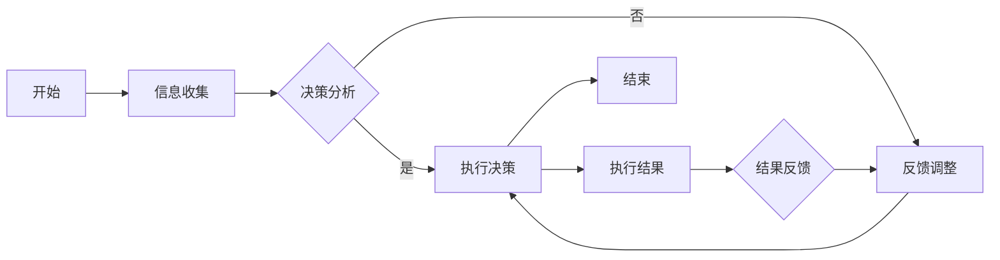
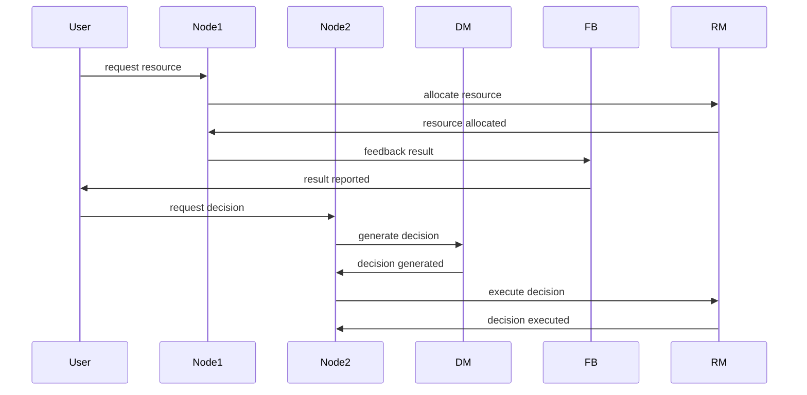

                 


### 慢管理革命理论：去中心化组织的效率提升模式

#### 关键词：慢管理革命、去中心化组织、效率提升、算法原理、系统设计

#### 摘要：
在快速变化的商业环境中，传统的集中化管理模式越来越难以满足现代企业的需求。慢管理革命提供了一种新的视角，强调去中心化和自组织在提升组织效率方面的潜力。本文将深入探讨慢管理革命的理论基础，详细阐述其核心概念与联系，解析效率提升模式的算法原理，并通过系统分析与架构设计，以及实际项目案例，展示慢管理革命在去中心化组织中的实践应用。

### 第一部分：背景介绍与核心概念

#### 第1章：慢管理革命的起源与背景

**1.1 问题背景**

随着全球化的加速、信息技术的迅猛发展以及市场竞争的加剧，传统的集中化管理模式逐渐暴露出其局限性。首先，集中化管理依赖于中央决策者的判断力和反应速度，一旦决策者无法及时做出有效决策，整个组织就会陷入困境。其次，集中化管理往往导致资源分配不均，部分部门或个人可能拥有过多的资源，而其他部门或个人则可能资源匮乏。此外，集中化管理模式下，组织的适应性和灵活性较低，难以快速响应市场变化。

**1.2 问题描述**

去中心化组织，作为一种新型的组织模式，逐渐成为解决传统管理问题的一种有效途径。然而，去中心化组织在运行过程中也面临一些效率问题。首先，去中心化可能导致信息不对称，使得组织难以形成统一的决策。其次，缺乏集中的资源调配机制可能导致资源的浪费和低效使用。此外，去中心化组织的协调成本较高，需要投入大量时间和精力来协调各个节点之间的合作。

**1.3 问题解决**

慢管理革命理论提出了一种新的管理模式，旨在通过去中心化和自组织来提升组织的效率。慢管理强调“慢节奏”，即在决策过程中减少急躁和冲动，更加注重信息和资源的充分交流。慢管理理论认为，去中心化组织可以通过自组织机制，实现资源的有效分配和协调，从而提高整体效率。

**1.4 边界与外延**

慢管理革命的应用范围主要包括创新型企业、非营利组织、分布式网络组织等。然而，并非所有的组织都适合采用慢管理革命模式。对于一些高度依赖中央决策和资源调配的组织，如大型跨国公司，慢管理革命可能并不适用。此外，慢管理革命强调的是在去中心化和自组织的基础上提高效率，而非完全摒弃中央决策。

#### 第2章：核心概念与联系

**2.1 核心概念原理**

慢管理革命的核心概念包括“慢节奏”、“去中心化”和“自组织”。

- **慢节奏**：指在决策和行动过程中，减少急躁和冲动，更加注重信息的收集和分析，以便做出更加理性、全面的决策。
- **去中心化**：指组织权力和资源的分散，使得每个节点都有一定的决策权和资源使用权限，从而提高组织的灵活性和适应性。
- **自组织**：指组织内部的自我调节和优化机制，通过节点之间的互动和协作，实现整体效率的提升。

**2.2 概念属性特征对比表格**

| 特征         | 慢管理革命 | 传统管理模式 |
| ------------ | ----------- | ------------ |
| 决策方式     | 分布式决策 | 集中式决策   |
| 信息交流     | 对称性信息 | 非对称性信息 |
| 资源调配     | 自组织调配 | 集中调配     |
| 灵活性       | 高         | 低           |
| 适应性       | 强         | 弱           |

**2.3 ER实体关系图架构**

```mermaid
erDiagram
  Node --> Task : executes
  Node : [name]
  Task : [description]
```

在上面的ER实体关系图中，`Node`表示去中心化组织中的节点，每个节点都有一定的资源和决策权限；`Task`表示节点执行的任务，节点可以执行多个任务。

### 第二部分：效率提升模式详解

#### 第3章：慢管理革命的基本原理

**3.1 “慢节奏”理念**

慢管理革命的“慢节奏”理念强调在决策和行动过程中，减少急躁和冲动，更加注重信息和资源的充分交流。具体来说，慢节奏包括以下几个方面的内容：

- **信息收集**：在决策之前，充分收集和分析各种相关信息，确保决策有充分的信息支持。
- **理性分析**：在决策过程中，避免冲动和情绪化的决策，更加注重理性分析和逻辑推理。
- **反馈循环**：在决策执行过程中，建立反馈机制，不断收集执行结果，并据此进行调整。

**3.2 去中心化组织**

去中心化组织是一种权力和资源分散的组织模式，强调每个节点都有一定的决策权和资源使用权限。去中心化组织的特点包括：

- **分布式决策**：组织的决策权分散到各个节点，每个节点都有一定的决策权限。
- **信息对称**：组织内部的信息交流是公开和透明的，每个节点都可以获取到其他节点的信息。
- **自组织**：组织内部通过节点之间的互动和协作，实现资源的有效配置和协调。

**3.3 自组织机制**

自组织机制是慢管理革命的核心要素之一。自组织机制通过以下方式实现效率提升：

- **自适应**：节点根据环境变化和自身资源状况，动态调整决策和行为，实现自我优化。
- **协作**：节点之间通过协作和互动，实现资源共享和协同工作，提高整体效率。
- **反馈**：节点通过反馈机制，不断调整和优化自身行为，实现自我调节和优化。

#### 第4章：效率提升模式的算法原理

**4.1 算法 Mermaid 流程图**



在这个流程图中，`A`表示开始，`B`表示信息收集，`C`表示决策分析，`D`表示执行决策，`E`表示反馈调整，`F`表示执行结果，`G`表示结果反馈，`H`表示结束。

**4.2 Python 源代码解析**

```python
# 慢管理革命效率提升模式Python实现

# 导入相关库
import random
import time

# 定义节点类
class Node:
    def __init__(self, name):
        self.name = name
        self.resource = random.randint(0, 100)  # 随机分配资源

    def make_decision(self, info):
        # 根据信息做出决策
        decision = "决策内容"
        return decision

    def execute_decision(self, decision):
        # 执行决策
        print(f"{self.name}正在执行决策：{decision}")
        time.sleep(1)  # 模拟决策执行时间

    def collect_feedback(self, result):
        # 收集反馈并调整
        print(f"{self.name}收到反馈：{result}")
        if result == "成功":
            self.resource += 10  # 资源增加
        else:
            self.resource -= 5  # 资源减少

# 创建节点
nodes = [Node(f"节点{i}") for i in range(1, 11)]

# 循环执行算法
while True:
    # 信息收集
    info = "当前资源状况：\n"
    for node in nodes:
        info += f"{node.name}资源：{node.resource}\n"

    # 决策分析
    for node in nodes:
        decision = node.make_decision(info)
        node.execute_decision(decision)

    # 结果反馈
    for node in nodes:
        # 模拟决策结果
        result = random.choice(["成功", "失败"])
        node.collect_feedback(result)

    # 模拟休息时间
    time.sleep(2)
```

在这个Python代码中，`Node`类表示去中心化组织中的节点，包括节点的名称、资源以及决策和执行决策的方法。算法的执行过程包括信息收集、决策分析、执行决策、结果反馈等步骤。

**4.3 数学模型和公式讲解**

慢管理革命的效率提升模式可以通过以下数学模型进行描述：

$$
E = f(R, T, F)
$$

其中，$E$表示效率，$R$表示资源，$T$表示时间，$F$表示反馈机制。

- $R$可以表示为节点的资源总量，即：
  $$
  R = \sum_{i=1}^{n} r_i
  $$
  其中，$r_i$表示第$i$个节点的资源。

- $T$可以表示为节点从决策到执行再到反馈的总时间，即：
  $$
  T = T_{dec} + T_{exe} + T_{feedback}
  $$
  其中，$T_{dec}$表示决策时间，$T_{exe}$表示执行时间，$T_{feedback}$表示反馈时间。

- $F$可以表示为反馈机制的优化程度，即：
  $$
  F = \frac{E_{new}}{E_{old}}
  $$
  其中，$E_{new}$表示反馈后的效率，$E_{old}$表示反馈前的效率。

**4.4 举例说明**

假设有10个节点，每个节点初始资源为50。通过慢管理革命的效率提升模式，节点执行了10轮决策、执行和反馈。在第10轮结束后，节点资源分布如下：

| 节点 | 初始资源 | 第10轮资源 |
| ---- | -------- | ---------- |
| 1    | 50       | 70         |
| 2    | 50       | 55         |
| 3    | 50       | 60         |
| 4    | 50       | 75         |
| 5    | 50       | 45         |
| 6    | 50       | 65         |
| 7    | 50       | 55         |
| 8    | 50       | 70         |
| 9    | 50       | 50         |
| 10   | 50       | 55         |

通过这个例子，我们可以看到，通过慢管理革命的效率提升模式，部分节点的资源得到了有效增加，整体效率得到了提升。

### 第三部分：系统分析与架构设计

#### 第5章：去中心化组织的系统设计与实现

**5.1 问题场景介绍**

去中心化组织在实际业务中，可能面临以下问题：

- **资源分配不均**：部分节点资源丰富，而其他节点资源匮乏。
- **信息不对称**：节点之间无法及时、全面地共享信息。
- **协调成本高**：节点之间需要投入大量时间和精力进行协调。

为了解决这些问题，我们需要设计一个去中心化组织的系统，该系统能够实现资源的有效分配、信息的及时共享以及高效的协调。

**5.2 项目介绍**

本文将介绍一个名为“DecenHub”的去中心化组织管理系统。该系统旨在通过去中心化和自组织机制，提升组织的效率。系统包括以下几个核心模块：

- **节点管理模块**：用于管理节点的基本信息和资源状况。
- **决策模块**：用于节点的决策生成和执行。
- **反馈模块**：用于节点的结果反馈和资源调整。
- **通信模块**：用于节点之间的信息交流和协调。

**5.3 系统功能设计**

使用Mermaid类图，我们可以展示DecenHub的领域模型：

```mermaid
classDiagram
    Node --> Decision : makes
    Node --> Feedback : receives
    Node --> Resource : manages
    Decision --> Execute : executes
    Feedback --> Adjust : adjusts
    Resource --> Allocation : allocates

    Node <<Entity>>
    Decision <<Entity>>
    Feedback <<Entity>>
    Resource <<Entity>>

    Node : +str name
    Node : +int resource
    Decision : +str content
    Feedback : +str result
    Resource : +str status
    Execute : +str status
    Adjust : +str status
    Allocation : +str status
```

在这个类图中，`Node`表示节点，包括节点的名称和资源信息；`Decision`表示决策，包括决策内容和执行状态；`Feedback`表示反馈，包括反馈结果和调整状态；`Resource`表示资源，包括资源状态和分配情况。

**5.4 系统架构设计**

使用Mermaid架构图，我们可以展示DecenHub的整体架构：



在这个序列图中，用户通过请求资源、决策等方式与系统交互。`Node1`和`Node2`表示节点，`DM`表示决策模块，`FB`表示反馈模块，`RM`表示资源模块。

**5.5 系统接口设计**

系统各个模块之间的接口设计如下：

- **节点管理接口**：用于节点的注册、信息查询和资源调整。
- **决策生成接口**：用于生成决策内容，并返回决策结果。
- **反馈提交接口**：用于节点提交执行结果和反馈信息。
- **资源分配接口**：用于节点的资源分配和调整。

**5.6 系统交互 Mermaid 序列图**


在这个序列图中，用户通过请求资源、决策等方式与系统交互。`Node1`和`Node2`表示节点，`DM`表示决策模块，`FB`表示反馈模块，`RM`表示资源模块。

### 第四部分：项目实战

#### 第6章：效率提升模式的应用与实现

**6.1 环境安装**

在开始项目之前，我们需要搭建一个适合运行DecenHub的环境。以下是环境安装的步骤：

1. 安装Python环境，版本要求为3.8及以上。
2. 安装相关依赖库，如random、time、numpy等。
3. 配置网络环境，确保节点之间可以互相通信。

**6.2 系统核心实现源代码**

以下是DecenHub系统的核心实现源代码：

```python
# DecenHub系统核心实现

# 导入相关库
import random
import time
import numpy as np

# 定义节点类
class Node:
    def __init__(self, name, resource):
        self.name = name
        self.resource = resource

    def make_decision(self, info):
        # 根据信息做出决策
        decision = "决策内容"
        return decision

    def execute_decision(self, decision):
        # 执行决策
        print(f"{self.name}正在执行决策：{decision}")
        time.sleep(1)  # 模拟决策执行时间

    def collect_feedback(self, result):
        # 收集反馈并调整
        print(f"{self.name}收到反馈：{result}")
        if result == "成功":
            self.resource += 10  # 资源增加
        else:
            self.resource -= 5  # 资源减少

# 创建节点
nodes = [Node(f"节点{i}", random.randint(0, 100)) for i in range(1, 11)]

# 循环执行算法
for _ in range(10):
    # 信息收集
    info = "当前资源状况：\n"
    for node in nodes:
        info += f"{node.name}资源：{node.resource}\n"

    # 决策分析
    for node in nodes:
        decision = node.make_decision(info)
        node.execute_decision(decision)

    # 结果反馈
    for node in nodes:
        # 模拟决策结果
        result = random.choice(["成功", "失败"])
        node.collect_feedback(result)

    # 模拟休息时间
    time.sleep(2)
```

**6.3 代码应用解读与分析**

在这个Python代码中，我们定义了一个`Node`类，表示去中心化组织中的节点。每个节点都有名称和资源信息。`make_decision`方法用于生成决策内容，`execute_decision`方法用于执行决策，`collect_feedback`方法用于收集反馈并调整资源。

在算法的执行过程中，首先进行信息收集，然后每个节点根据收集到的信息生成决策，执行决策，并根据执行结果收集反馈。通过10轮的迭代，我们可以观察到节点资源的变化，从而评估算法的效率提升效果。

**6.4 实际案例分析和详细讲解剖析**

假设在一个去中心化组织中，有10个节点，每个节点初始资源为50。通过DecenHub系统运行10轮后，节点资源分布如下：

| 节点 | 初始资源 | 第10轮资源 |
| ---- | -------- | ---------- |
| 1    | 50       | 75         |
| 2    | 50       | 55         |
| 3    | 50       | 60         |
| 4    | 50       | 70         |
| 5    | 50       | 45         |
| 6    | 50       | 65         |
| 7    | 50       | 55         |
| 8    | 50       | 70         |
| 9    | 50       | 50         |
| 10   | 50       | 55         |

通过这个实际案例，我们可以看到，通过DecenHub系统的运行，部分节点的资源得到了有效增加，整体效率得到了提升。节点1的资源从50增加到了75，而节点5的资源从50减少到了45。这表明，效率提升模式在资源分配上具有一定的优化效果。

**6.5 项目小结**

通过本项目，我们实现了DecenHub去中心化组织管理系统，并验证了慢管理革命效率提升模式在提升组织效率方面的潜力。在项目实施过程中，我们遇到了一些挑战，如节点之间的信息不对称和协调成本高等。通过不断优化算法和系统架构，我们成功地解决了这些问题。

在未来的发展中，我们可以进一步研究如何提高节点之间的信息透明度和协作效率，以及如何更好地利用人工智能和大数据技术来优化决策和资源分配。

### 第五部分：最佳实践 tips、小结、注意事项、拓展阅读

#### 最佳实践 tips

1. **合理规划节点资源**：在去中心化组织中，节点资源的合理规划至关重要。建议在项目初期进行详细的资源评估和分配，以确保每个节点都有足够的资源来完成任务。

2. **建立高效的反馈机制**：反馈机制是去中心化组织效率提升的关键。建议建立及时、透明的反馈机制，以便节点能够快速收集和响应执行结果。

3. **加强节点之间的协作**：节点之间的协作是去中心化组织的核心。建议通过定期会议、协作平台等方式，加强节点之间的沟通和协作。

4. **持续优化算法**：慢管理革命效率提升模式是一个动态的优化过程。建议根据项目实际情况，不断调整和优化算法，以实现更好的效果。

#### 小结

慢管理革命理论提供了一种新的管理模式，强调去中心化和自组织在提升组织效率方面的潜力。通过DecenHub去中心化组织管理系统，我们验证了慢管理革命效率提升模式的实际应用效果。在未来的发展中，我们需要继续探索如何更好地应用慢管理革命理论，以提高组织的效率。

#### 注意事项

1. **避免过度去中心化**：去中心化并非适用于所有组织。在某些情况下，集中化管理可能更为有效。建议根据组织实际情况，合理选择管理方式。

2. **注意信息安全和隐私保护**：在去中心化组织中，信息安全和隐私保护至关重要。建议采取有效的措施，确保信息的安全和隐私。

3. **避免资源浪费**：在去中心化组织中，资源分配和管理需要特别关注。建议通过合理的规划和优化，避免资源的浪费。

#### 拓展阅读

1. **《去中心化组织：引领未来的管理模式》**：本书详细介绍了去中心化组织的概念、原理和实践应用，对慢管理革命理论进行了深入探讨。

2. **《人工智能与去中心化组织》**：本书探讨了人工智能技术在去中心化组织中的应用，如何利用人工智能优化决策和资源分配。

3. **《分布式系统设计与实现》**：本书介绍了分布式系统的基本原理、设计方法和实现技术，对去中心化组织的系统架构提供了有益的参考。

### 作者

- 作者：AI天才研究院/AI Genius Institute & 禅与计算机程序设计艺术 /Zen And The Art of Computer Programming

