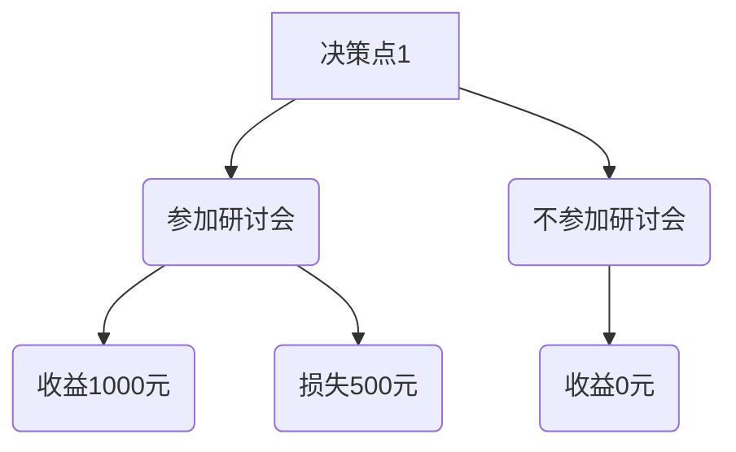
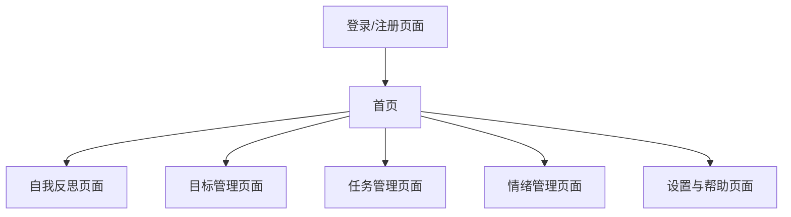
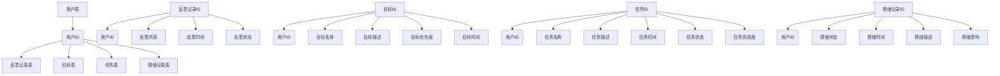
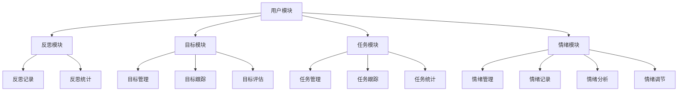
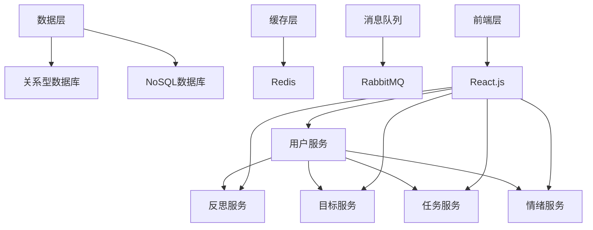

                 

### 文章标题

“成为人生的主导者：自我引导的艺术”

> 关键词：自我引导、人生主导、艺术、心理学、方法论

> 摘要：本文旨在探讨自我引导在现代社会中的重要性，以及如何通过科学的自我引导方法，成为人生的主导者。文章首先提出了自我引导的概念和背景，接着深入分析了核心概念与理论基础，详细阐述了自我引导的实践方法、数学模型和系统设计，并通过实际项目实战来验证方法的可行性和效果。最后，文章总结了最佳实践，并提供了相关注意事项和拓展阅读，帮助读者更好地理解和应用自我引导的艺术。

----------------------------------------------------------------

### 第1章 问题的提出与背景

#### 1.1 问题背景

在当今快速变化和高度竞争的社会中，人们面临着越来越多的挑战和困惑。职业发展、人际关系、心理健康等方面的问题日益突出，如何在这复杂多变的环境中保持自己的方向和目标，成为许多人迫切需要解决的问题。

**关键问题：**

- **职业发展：** 如何在职业生涯中找到自己的定位，实现职业发展的持续和成功？
- **人际关系：** 如何在人际关系中保持自我，同时与他人和谐相处？
- **心理健康：** 如何在压力和挑战中保持心理平衡，提高抗压能力和情绪管理能力？

#### 1.2 问题描述

自我引导，即个体在生活和职业发展中的自我规划和自我管理能力，是解决上述问题的关键。自我引导不仅涉及到目标设定、计划实施和持续反馈，还包括自我反思、决策能力和情绪管理等综合能力。

**问题描述：**

- **缺乏自我引导能力：** 许多人由于缺乏自我引导能力，导致在职业发展中无法明确自己的方向，难以实现职业目标。
- **不合理的自我引导：** 一些人在自我引导过程中，容易受到外界干扰，缺乏理性分析，导致决策失误。
- **情绪波动大：** 在面对压力和挑战时，缺乏有效的自我引导方法，导致情绪波动大，影响生活和工作质量。

#### 1.3 问题解决

要解决上述问题，首先需要明确自我引导的重要性，并掌握科学的自我引导方法。本文将详细介绍自我引导的理论基础、实践方法和数学模型，帮助读者更好地理解和应用自我引导的艺术。

**解决方案：**

- **明确自我引导的重要性：** 通过深入分析，让读者认识到自我引导对个人发展的重要性。
- **掌握自我引导的方法：** 通过具体的实践方法和数学模型，帮助读者学会如何进行自我引导。
- **实际应用和案例分析：** 通过实际项目实战，验证自我引导方法的可行性和效果。

#### 1.4 边界与外延

自我引导的概念涵盖了多个领域，包括心理学、社会学、哲学和教育等。本文主要从心理学的角度来探讨自我引导，同时结合社会学和哲学的思考，为读者提供更全面的自我引导理论框架。

**边界与外延：**

- **心理学：** 自我引导的心理学基础，包括自我意识、决策能力和情绪管理等。
- **社会学：** 自我引导与社会环境、文化背景的关系。
- **哲学：** 自我引导与人生意义、价值观的关联。

通过本章的讨论，我们为后续章节的内容奠定了基础，也为读者提供了一个全面、系统的自我引导理论框架。在接下来的章节中，我们将继续深入探讨自我引导的核心概念、实践方法和应用策略。

### 第2章 核心概念与理论基础

#### 2.1 自我引导的定义

自我引导（Self-Guidance）是指个体在生活和工作中，通过自我认知、目标设定、计划执行和持续反馈等过程，实现自我管理和自我发展的能力。它涉及自我意识、决策能力、情绪管理、时间管理和自我反思等多个方面。

**定义核心要素：**

- **自我意识：** 理解自己的情绪、需求和动机，以及自己的优点和不足。
- **目标设定：** 明确自己的长期和短期目标，并制定实现目标的计划。
- **计划执行：** 按照计划行动，将目标逐步转化为现实。
- **持续反馈：** 对计划执行的效果进行评估，根据反馈调整目标和计划。

#### 2.2 自我引导的心理学基础

自我引导的理论基础主要源于心理学领域，包括自我决定理论、目标设置理论、情绪调节理论和自我效能感理论等。

**心理学基础：**

- **自我决定理论：** 美国心理学家德西和瑞安提出，自我引导源于个体内在的自我决定需求。自我决定需求包括自主性、能力和关联性，这些需求的满足有助于提高个体的自我引导能力。
- **目标设置理论：** 美国心理学家洛克和莱瑟姆提出，明确、具体和具有挑战性的目标有助于提高个体的自我引导效果。目标设置理论强调目标的设定和实现过程中的反馈机制。
- **情绪调节理论：** 个体在自我引导过程中，需要有效管理自己的情绪。情绪调节理论提供了多种情绪调节策略，如认知重构、情感释放和行为调整等。
- **自我效能感理论：** 美国心理学家班杜拉提出，自我效能感是指个体对自己在特定情境下成功完成任务的信念。高自我效能感的个体更倾向于设定高目标并坚持执行，从而实现自我引导。

**概念属性特征对比表格：**

| 特性        | 自我决定理论 | 目标设置理论 | 情绪调节理论 | 自我效能感理论 |
| ----------- | ------------- | ------------- | ------------- | ------------- |
| 核心概念    | 自我决定需求  | 目标设定与实现 | 情绪调节策略 | 自我效能感    |
| 主要内容    | 自主性、能力和关联性 | 明确、具体、具有挑战性的目标 | 认知重构、情感释放、行为调整 | 对自己完成任务的能力信念 |
| 应用领域    | 心理健康、自我引导 | 职业发展、教育 | 应对压力、情绪管理 | 职业发展、学习 |
| 相互关系    | 促进自我引导 | 促进目标实现 | 影响目标实现 | 提高自我引导效果 |

#### 2.3 自我引导与社会学的关系

社会学视角下的自我引导关注个体在社会环境中的自我引导过程。社会学理论如社会角色理论、社会化理论和社会互动理论，为自我引导提供了重要的解释框架。

**社会学关系：**

- **社会角色理论：** 个体在社会中扮演不同的角色，这些角色对个体的自我引导产生影响。理解社会角色有助于个体更好地进行自我引导。
- **社会化理论：** 社会化是个人获取社会知识和行为规范的过程，自我引导是个体社会化过程中的一个重要环节。通过社会化，个体学会如何在社会环境中自我引导。
- **社会互动理论：** 个体在社会互动中，通过观察、学习和模仿他人的行为，提高自己的自我引导能力。社会互动为个体提供了自我引导的反馈和资源。

#### 2.4 自我引导的哲学思考

哲学视角下的自我引导关注个体的自我认识和自我实现。哲学家如苏格拉底、康德和尼采等，对自我引导进行了深刻的思考。

**哲学思考：**

- **苏格拉底：** 苏格拉底强调通过提问和自我反思来提高自我引导能力。他认为，自我引导是个体追求真理和智慧的过程。
- **康德：** 康德提出，个体通过自律来实现自我引导。自律是指个体遵循道德原则和理性规范来指导自己的行为。
- **尼采：** 尼采认为，自我引导是个体超越现实、追求自我实现的过程。他强调个体的自我超越和创造性。

#### 2.5 自我引导与教育、职业发展的关联

自我引导在教育、职业发展中具有重要作用。教育领域关注自我引导在学生学习和发展中的应用，职业领域关注自我引导在职业规划和发展中的作用。

**教育关联：**

- **学习动机：** 自我引导有助于提高学生的学习动机，激发学生的学习兴趣和内在动力。
- **学习方法：** 自我引导帮助个体选择合适的学习方法，提高学习效率。
- **学术发展：** 自我引导促进个体的学术成长，培养独立思考和创新能力。

**职业发展关联：**

- **职业定位：** 自我引导帮助个体明确自己的职业方向，实现职业发展的目标。
- **职业规划：** 自我引导帮助个体制定职业规划，提高职业竞争力。
- **职业发展：** 自我引导促进个体的职业成长，实现职业的成功和满足。

通过本章的讨论，我们深入探讨了自我引导的核心概念、心理学基础、社会学关系、哲学思考以及与教育、职业发展的关联。这些理论和概念为我们理解和应用自我引导提供了重要的基础。在接下来的章节中，我们将进一步介绍自我引导的实践方法，帮助读者学会如何在实际生活中进行自我引导。

### 第3章 自我引导的实践方法

#### 3.1 自我引导的步骤与流程

自我引导是一个系统性的过程，通常包括以下五个步骤：自我反思、目标设定、行动计划、持续反馈和调整。每个步骤都是实现自我引导的重要环节，以下将详细阐述每个步骤的具体内容和实践方法。

##### 3.1.1 自我反思

自我反思是自我引导的第一步，也是至关重要的一步。通过自我反思，个体可以深入了解自己的内在情绪、需求、动机和优点与不足。具体方法如下：

- **日记法：** 每天记录自己的情绪、想法和行为，分析这些行为背后的动机和原因。
- **提问法：** 通过提问来引导自我反思，如“我为什么这样做？”“这种行为对我有什么影响？”“我还能怎么做来改善这种状况？”
- **反馈法：** 寻求他人的反馈，了解他人对自己的看法，通过他人的观点来补充和修正自我反思的内容。

##### 3.1.2 目标设定

目标设定是自我引导的核心，明确的目标有助于个体在生活和职业发展中保持方向和动力。具体方法如下：

- **SMART原则：** 目标应具体（Specific）、可测量（Measurable）、可达成（Achievable）、相关（Relevant）和有时限（Time-bound）。
- **长期与短期目标：** 制定长期目标和短期目标，短期目标是实现长期目标的基石，长期目标为短期目标提供方向和动力。
- **优先级排序：** 根据目标的优先级来制定行动计划，确保最重要和最有影响力的目标得到优先关注和实施。

##### 3.1.3 行动计划

行动计划是实现目标的实际行动步骤，包括具体任务、时间安排和资源分配等。具体方法如下：

- **分解任务：** 将大目标分解为具体的任务，每个任务都有明确的时间安排和资源需求。
- **时间管理：** 使用时间管理工具，如甘特图、时间表和待办事项列表，来规划和管理任务的时间安排。
- **资源整合：** 充分利用内外部资源，包括人脉、信息和工具等，为行动计划提供支持。

##### 3.1.4 持续反馈

持续反馈是自我引导的重要环节，通过反馈来评估计划执行的效果，并根据反馈进行调整和改进。具体方法如下：

- **自我评估：** 对计划执行的效果进行自我评估，分析成功和失败的原因。
- **他人反馈：** 寻求他人的反馈，了解他人对自己的工作评价和建议。
- **调整与改进：** 根据反馈结果，对目标和行动计划进行调整和改进，确保目标的实现和持续发展。

##### 3.1.5 调整与改进

调整与改进是在持续反馈过程中进行的，目的是优化自我引导过程，提高自我引导的效果。具体方法如下：

- **持续学习：** 通过学习新的知识和技能，不断提升自我引导的能力。
- **适应性调整：** 根据环境变化和个人发展需求，灵活调整目标和行动计划。
- **自我激励：** 通过自我激励来保持动力和热情，克服困难和挫折。

通过以上五个步骤，个体可以系统地实施自我引导，实现个人成长和职业发展。以下是一个具体的案例，展示如何应用这些步骤进行自我引导：

**案例：提升公共演讲能力**

**自我反思：** 
- 通过自我反思，发现自己在公共演讲时，存在紧张、声音小、语速快等问题。
- 分析原因，发现缺乏自信和经验积累。

**目标设定：**
- 长期目标：在一年内，能够流利、自信地完成15分钟以上的公共演讲。
- 短期目标：每周进行一次模拟演讲，逐步提高演讲的流畅性和自信心。

**行动计划：**
- 分解任务：确定每周的演讲主题，准备演讲稿，进行模拟演讲，录制视频并进行分析。
- 时间管理：安排每周的演讲时间，确保演讲任务按时完成。
- 资源整合：利用网络资源和书籍学习公共演讲技巧，寻求导师和同事的反馈。

**持续反馈：**
- 自我评估：每次演讲后，分析自己的表现，记录成功和失败的原因。
- 他人反馈：向导师和同事寻求反馈，了解自己的演讲效果和改进空间。

**调整与改进：**
- 根据反馈结果，调整演讲稿的内容和结构，改进表达方式和肢体语言。
- 持续学习：参加公共演讲培训课程，提升自己的演讲技巧和自信心。
- 自我激励：设定小目标，每次演讲后给自己一些奖励，保持动力和热情。

通过这个案例，我们可以看到，自我引导的过程不仅仅是目标的设定和行动的执行，更是一个不断反思、调整和改进的动态过程。只有通过持续的自我引导，个体才能在不断变化的环境中保持自我主导，实现个人和职业的成长。

#### 3.2 自我引导的策略与技巧

自我引导不仅需要明确的步骤和流程，还需要有效的策略与技巧，以下将介绍一些常用的自我引导策略和技巧。

##### 3.2.1 增强自我意识的策略

增强自我意识是自我引导的基础，以下是一些增强自我意识的策略：

- **冥想与反思：** 通过冥想和反思，帮助个体深入内省，了解自己的内心世界。每天花10-15分钟进行冥想，专注于呼吸，减少外界干扰，有助于提升自我意识。
- **日记记录：** 每天记录自己的想法、情绪和行为，通过写作的方式，更好地理解和表达自己。这种记录可以帮助个体在日常生活中保持自我意识。
- **角色扮演：** 通过角色扮演，帮助个体从他人的角度看问题，了解不同角色的需求和感受。这种策略有助于个体提升同理心和自我意识。

##### 3.2.2 提高决策质量的技巧

决策质量直接影响到自我引导的效果，以下是一些提高决策质量的技巧：

- **信息收集：** 在做出决策之前，广泛收集相关信息，包括数据、事实和观点。信息的全面性和准确性是决策质量的基础。
- **头脑风暴：** 通过头脑风暴，鼓励个体自由地提出各种可能的想法和解决方案。头脑风暴有助于激发创意，发现潜在的问题和解决方案。
- **多角度分析：** 从不同角度对决策进行分析，包括成本、收益、风险和可能性。多角度分析可以帮助个体做出更全面、客观的决策。
- **决策树：** 使用决策树来分析和评估不同决策路径的后果。决策树是一种直观的决策分析工具，可以帮助个体清晰地看到不同决策的影响。

##### 3.2.3 管理情绪与压力的方法

情绪和压力对自我引导有重要影响，以下是一些管理情绪与压力的方法：

- **情绪调节：** 通过认知重构、情感释放和行为调整等方法，管理自己的情绪。认知重构是通过改变对事件的看法来调节情绪；情感释放是通过表达和释放情绪来减轻压力；行为调整是通过改变行为方式来缓解情绪。
- **时间管理：** 通过有效的时间管理，减少工作和生活的压力。合理安排时间，确保工作、休息和娱乐的平衡，有助于减轻压力。
- **运动与放松：** 通过运动和放松活动，如瑜伽、冥想和深呼吸等，缓解压力和焦虑。这些活动有助于释放身体的紧张情绪，提高心理健康。
- **社交支持：** 寻求家人、朋友和同事的支持和帮助，分享自己的压力和困惑。社交支持可以提供情感支持和实际帮助，有助于缓解压力。

通过以上策略与技巧，个体可以更有效地进行自我引导，提高自我管理和自我发展的能力。自我引导不仅是一个个人成长的过程，也是一个持续学习和改进的过程。只有通过不断地实践和应用，个体才能真正掌握自我引导的艺术，成为人生的主导者。

### 第4章 自我引导的数学模型

自我引导的数学模型是理解和应用自我引导理论的工具，通过数学模型，我们可以更精确地描述和预测个体在自我引导过程中的行为和效果。本章将介绍自我引导中的几个关键数学模型，包括决策理论、概率论和优化算法。

#### 4.1 自我引导的数学模型概述

自我引导的数学模型主要包括以下三个方面：

1. **决策理论：** 帮助个体在复杂环境中做出理性决策。
2. **概率论：** 分析个体在不确定环境中的行为和风险。
3. **优化算法：** 提供解决自我引导过程中优化问题的方法。

通过这些数学模型，个体可以更科学地进行自我引导，提高决策质量和效果。

#### 4.2 决策理论

决策理论是研究个体在不确定条件下做出合理决策的数学模型。以下将介绍决策理论中的几个关键概念和模型。

##### 4.2.1 决策树的构建

决策树是一种常用的决策模型，它通过树形结构表示决策过程，每个节点代表一个决策或结果，边表示决策选项或结果概率。

**决策树的构建步骤：**

1. **确定决策点：** 确定决策的初始点，通常为问题的核心问题。
2. **列出可选方案：** 根据决策点，列出所有可能的解决方案或行动方案。
3. **计算概率和结果：** 对每个方案计算概率和结果，将结果转化为效用值或损失值。
4. **构建决策树：** 根据概率和结果，构建决策树，每个节点表示一个决策或结果。

**决策树示例：**

假设小明需要决定是否去参加一个技术研讨会，根据历史数据和调查，他有以下两个决策点：

1. **决策点1：** 是否参加研讨会
   - 选项A：参加研讨会
   - 选项B：不参加研讨会

2. **决策点2：** 参加研讨会的收益和损失
   - 参加研讨会的收益为1000元，概率为0.6
   - 参加研讨会的损失为500元，概率为0.4
   - 不参加研讨会的收益为0元，概率为1

根据以上信息，我们可以构建如下的决策树：



通过决策树，我们可以分析每个决策点的最佳选择，从而做出最优决策。

##### 4.2.2 决策矩阵的分析

决策矩阵是一种更复杂的决策模型，它通过矩阵形式表示多个决策点和多个结果，适用于多因素、多结果的决策问题。

**决策矩阵的构建步骤：**

1. **确定决策点：** 确定决策的初始点，列出所有可能的解决方案或行动方案。
2. **列出结果：** 列出所有可能的结果，通常为效益值或损失值。
3. **计算概率和结果：** 对每个决策点和结果计算概率和结果，通常使用预期效用值或损失值作为决策依据。

**决策矩阵示例：**

假设小明需要在两个项目中选择一个进行投资，根据市场数据和风险分析，有以下决策矩阵：

|         | 项目A | 项目B |
| ------- | ----- | ----- |
| 结果1   | 2000  | -1000 |
| 结果2   | 500   | 0     |
| 概率1   | 0.5   | 0.5   |
| 概率2   | 0.5   | 0.5   |

根据以上信息，我们可以计算每个项目的预期效用值：

项目A的预期效用值 = (2000 * 0.5) + (500 * 0.5) = 1250
项目B的预期效用值 = (-1000 * 0.5) + (0 * 0.5) = -500

通过比较预期效用值，我们可以得出最优决策为项目A。

#### 4.3 概率论

概率论在自我引导中主要用于分析个体在不确定环境中的行为和风险，以下将介绍概率论中的几个关键概念和应用。

##### 4.3.1 事件概率的计算

事件概率是指某个事件发生的可能性，通过概率论，我们可以计算不同事件发生的概率。

**基本概率公式：**

- 概率P(A) = 事件A发生的次数 / 总次数

**条件概率：**

- 条件概率P(B|A) = 在事件A发生的条件下，事件B发生的概率

**贝叶斯公式：**

- 贝叶斯公式用于计算在给定某个条件下，某个事件发生的概率

$$
P(A|B) = \frac{P(B|A) \cdot P(A)}{P(B)}
$$

**示例：**

假设有一个袋子中有5个红球和3个蓝球，随机取出一个球，求取到红球的概率。

- 红球的概率P(红球) = 5/8
- 取到红球的概率P(A) = 5/8
- 取到蓝球的概率P(B) = 3/8

假设我们知道取出的球是红球，求取到红球的条件下，取出的球是红色的概率。

$$
P(红球|红球) = \frac{P(红球) \cdot P(红球)}{P(红球 + 蓝球)} = \frac{5/8 \cdot 5/8}{5/8 + 3/8} = \frac{25/64}{8/8} = \frac{25}{64}
$$

通过贝叶斯公式，我们可以得到更准确的条件概率。

##### 4.3.2 条件概率的应用

条件概率在自我引导中的应用非常广泛，以下是一个简单的应用示例。

**示例：**

假设小明需要决定是否参加一个技术研讨会，他有两个选择：

- 选择A：参加研讨会
- 选择B：不参加研讨会

根据历史数据和调查，小明有以下几个概率：

- P(A|成功) = 0.7（在成功的情况下，小明选择参加研讨会的概率）
- P(A|失败) = 0.3（在失败的情况下，小明选择参加研讨会的概率）
- P(成功) = 0.6（小明成功进行项目的机会）
- P(失败) = 0.4（小明失败进行项目的机会）

通过条件概率，我们可以计算小明在不同情况下选择参加研讨会的概率：

- P(成功且参加研讨会) = P(A|成功) \* P(成功) = 0.7 \* 0.6 = 0.42
- P(失败且参加研讨会) = P(A|失败) \* P(失败) = 0.3 \* 0.4 = 0.12

通过计算，我们可以得出小明选择参加研讨会的总概率为0.42 + 0.12 = 0.54。

#### 4.4 优化算法

优化算法用于解决自我引导过程中的优化问题，如资源分配、时间管理和目标实现等。以下将介绍几种常用的优化算法。

##### 4.4.1 线性规划

线性规划是一种用于解决线性目标函数和线性约束条件的数学优化方法。以下是一个简单的线性规划示例。

**示例：**

假设小明需要分配时间和资源来完成两个任务，任务A和任务B，每个任务都有完成时间和资源需求。小明的目标是最大化总收益。

- 任务A：完成时间3天，资源需求2个
- 任务B：完成时间2天，资源需求1个
- 总收益：任务A收益500元，任务B收益300元

线性规划模型如下：

$$
\begin{aligned}
\max \quad Z &= 500x + 300y \\
s.t. \quad \begin{cases}
3x + 2y &\leq 10 \\
2x + y &\leq 6 \\
x, y &\geq 0
\end{cases}
\end{aligned}
$$

其中，\(x\) 和 \(y\) 分别表示任务A和任务B的完成量。

通过求解线性规划模型，我们可以找到最优解，最大化总收益。

##### 4.4.2 非线性规划

非线性规划是用于解决非线性目标函数和线性或非线性约束条件的数学优化方法。以下是一个简单的非线性规划示例。

**示例：**

假设小明需要在两个项目中选择一个进行投资，两个项目的收益和风险如下：

- 项目A：收益为 \(f(x) = x^2\)，风险为 \(g(x) = x\)
- 项目B：收益为 \(f(x) = 1000 - x^2\)，风险为 \(g(x) = 2x\)

小明的目标是最大化收益，同时最小化风险。

非线性规划模型如下：

$$
\begin{aligned}
\max \quad f(x) &= x^2 \\
\min \quad g(x) &= x \\
s.t. \quad \begin{cases}
x &\geq 0 \\
x &\leq 1000
\end{cases}
\end{aligned}
$$

通过求解非线性规划模型，我们可以找到最优解，最大化收益同时最小化风险。

通过本章的讨论，我们介绍了自我引导的数学模型，包括决策理论、概率论和优化算法。这些数学模型为自我引导提供了理论依据和方法支持，帮助个体更科学地进行自我引导，实现个人成长和职业发展。

### 第5章 自我引导的系统设计

#### 5.1 自我引导系统的需求分析

自我引导系统的设计始于需求分析，这一阶段的目标是明确用户需求，确定系统的功能和技术要求。以下将从用户需求、系统功能和技术要求三个方面进行详细分析。

##### 5.1.1 用户需求

用户需求是系统设计的核心，通过对目标用户的需求进行深入分析，我们可以确定系统的核心功能。以下是用户需求的具体分析：

- **需求1：自我反思功能**  
  用户需要能够记录自己的情绪、想法和行为，并进行深入反思，以了解自己的内在状态和需求。
- **需求2：目标设定功能**  
  用户需要能够设定长期和短期目标，并跟踪目标的完成情况。
- **需求3：行动计划功能**  
  用户需要能够制定详细的行动计划，包括任务分解、时间安排和资源分配等。
- **需求4：持续反馈功能**  
  用户需要能够对行动计划执行效果进行持续反馈和评估，并根据反馈调整目标和计划。
- **需求5：情绪管理功能**  
  用户需要能够管理自己的情绪，包括压力管理和情绪调节等。

##### 5.1.2 系统功能

根据用户需求，自我引导系统需要实现以下核心功能：

- **功能1：自我反思记录**  
  系统应提供便捷的记录功能，允许用户随时随地记录自己的想法、情绪和行为。
- **功能2：目标管理**  
  系统应支持用户设定长期和短期目标，并显示目标的完成进度。
- **功能3：任务管理**  
  系统应支持用户分解任务、安排时间、分配资源，并提供任务提醒和进度跟踪功能。
- **功能4：反馈与评估**  
  系统应提供反馈和评估功能，允许用户对任务和目标的执行效果进行评价，并根据反馈进行调整。
- **功能5：情绪管理**  
  系统应提供情绪管理工具，如压力测试、情绪调节指南和放松练习等。

##### 5.1.3 技术要求

为了满足上述用户需求，系统在技术实现方面需要具备以下要求：

- **技术1：前端技术**  
  前端技术应支持多平台访问，包括Web、iOS和Android应用。应选择现代前端框架，如React或Vue.js，以实现高效的用户交互和响应式设计。
- **技术2：后端技术**  
  后端技术应支持高并发访问和数据处理能力，应选择成熟的Web框架，如Spring Boot或Django，并采用微服务架构以实现系统的可扩展性和灵活性。
- **技术3：数据库技术**  
  数据库技术应支持海量数据存储和快速查询，应选择关系型数据库，如MySQL或PostgreSQL，并结合NoSQL数据库，如MongoDB，以实现数据的高效存储和管理。
- **技术4：数据分析与机器学习**  
  系统应集成数据分析与机器学习技术，通过分析用户的行为数据和情绪数据，为用户提供个性化的建议和反馈。

#### 5.2 自我引导系统的功能设计

自我引导系统的功能设计是系统实现的关键环节，以下是系统功能设计的具体方案。

##### 5.2.1 用户界面设计

用户界面设计应简洁、直观、易用，以下是一些设计要点：

- **简洁性：** 界面设计应尽量简洁，避免冗余和复杂，以减少用户的学习成本。
- **直观性：** 界面布局应合理，功能模块清晰，便于用户快速找到所需功能。
- **易用性：** 界面操作应简便，提供明确的操作提示和帮助文档，提高用户体验。

以下是用户界面设计的示意图：



##### 5.2.2 数据库设计

数据库设计是系统功能实现的基础，以下是数据库设计的具体方案：

- **用户表（users）**：存储用户的基本信息，如用户名、密码、邮箱等。
- **反思记录表（reflections）**：存储用户的反思内容、时间和状态。
- **目标表（goals）**：存储用户设定的目标信息，包括目标名称、描述、优先级和时间等。
- **任务表（tasks）**：存储用户的任务信息，包括任务名称、描述、时间安排、状态和完成度等。
- **情绪记录表（moods）**：存储用户的情绪数据，包括情绪状态、时间、描述和影响等。

以下是数据库E-R图：



#### 5.3 自我引导系统的架构设计

自我引导系统的架构设计是系统稳定性和可扩展性的保障，以下是系统架构设计的具体方案。

##### 5.3.1 技术栈选择

系统技术栈的选择应综合考虑性能、可扩展性和开发效率。以下是具体的技术栈选择：

- **前端技术：** React.js，结合Webpack进行模块化管理。
- **后端技术：** Spring Boot，采用RESTful API进行前后端分离。
- **数据库技术：** MySQL（关系型数据库）+ MongoDB（NoSQL数据库）。
- **缓存技术：** Redis，用于提高数据读取速度和系统响应能力。
- **消息队列：** RabbitMQ，用于处理系统中的异步任务和消息传递。

##### 5.3.2 系统模块划分

系统模块划分应遵循高内聚、低耦合的原则，以下是系统模块的具体划分：

- **用户模块**：负责用户注册、登录、个人信息管理和权限管理等功能。
- **反思模块**：负责反思记录的创建、编辑、查看和统计等功能。
- **目标模块**：负责目标管理、目标设定、目标跟踪和目标评估等功能。
- **任务模块**：负责任务管理、任务创建、任务跟踪和任务统计等功能。
- **情绪模块**：负责情绪管理、情绪记录、情绪分析和情绪调节等功能。

以下是系统模块划分的示意图：



##### 5.3.3 系统架构设计

自我引导系统的架构设计应采用微服务架构，以提高系统的灵活性和可扩展性。以下是系统架构设计的具体方案：

- **服务层**：包括用户服务、反思服务、目标服务、任务服务和情绪服务，每个服务负责对应的功能模块。
- **数据层**：包括关系型数据库和NoSQL数据库，用于存储系统的数据。
- **缓存层**：使用Redis作为缓存层，提高数据读取速度和系统响应能力。
- **消息队列**：使用RabbitMQ作为消息队列，处理系统中的异步任务和消息传递。
- **前端层**：通过React.js实现前端功能，与后端服务进行数据交互。

以下是系统架构设计的示意图：



通过以上架构设计，自我引导系统可以实现高效、稳定和可扩展的功能，满足用户的需求。在接下来的章节中，我们将进一步介绍系统接口设计和系统交互，以确保系统的完整性和一致性。

### 第6章 自我引导的实际应用

#### 6.1 项目介绍

本项目名为“自我引导系统”，旨在帮助用户在生活和工作中实现自我管理和自我发展。系统主要包括自我反思、目标管理、任务管理和情绪管理四个功能模块，通过科学的方法和工具，帮助用户进行自我引导，提升个人素质和职业能力。

#### 6.2 环境安装

为了确保自我引导系统顺利运行，需要安装以下环境：

- **前端环境：** Node.js、npm、Webpack、React.js
- **后端环境：** Java、Spring Boot、MySQL、Redis
- **消息队列：** RabbitMQ
- **开发工具：** IntelliJ IDEA、VSCode

以下是具体安装步骤：

1. **安装Node.js和npm**：从官网下载Node.js安装包，按照提示安装。
2. **安装Webpack**：在命令行中执行 `npm install webpack -g`。
3. **安装React.js**：在命令行中执行 `npm install react react-dom -g`。
4. **安装Java和Spring Boot**：从官网下载Java安装包和Spring Boot安装包，按照提示安装。
5. **安装MySQL**：从官网下载MySQL安装包，按照提示安装。
6. **安装Redis**：从官网下载Redis安装包，按照提示安装。
7. **安装RabbitMQ**：从官网下载RabbitMQ安装包，按照提示安装。
8. **安装开发工具**：从官网下载IntelliJ IDEA或VSCode，按照提示安装。

#### 6.3 系统核心实现

自我引导系统的核心实现包括前端和后端两个部分，以下将分别介绍。

##### 6.3.1 前端核心实现

前端核心实现主要涉及React.js和Webpack的配置，以下是具体步骤：

1. **创建项目**：在命令行中执行 `npx create-react-app self-guidance-system`。
2. **配置Webpack**：在项目根目录下创建 `webpack.config.js` 文件，并进行如下配置：

```javascript
const path = require('path');

module.exports = {
  mode: 'development',
  entry: './src/index.js',
  output: {
    path: path.resolve(__dirname, 'dist'),
    filename: 'bundle.js'
  },
  devServer: {
    contentBase: './dist'
  },
  module: {
    rules: [
      {
        test: /\.css$/,
        use: ['style-loader', 'css-loader']
      },
      {
        test: /\.jsx?$/,
        exclude: /node_modules/,
        use: 'babel-loader'
      }
    ]
  },
  resolve: {
    extensions: ['.js', '.jsx']
  }
};
```

3. **配置Babel**：在项目根目录下创建 `.babelrc` 文件，并进行如下配置：

```json
{
  "presets": ["react-app"],
  "plugins": ["transform-runtime"]
}
```

4. **编写前端代码**：在 `src` 目录下创建相应的组件文件，如 `Reflections.js`、`Goals.js`、`Tasks.js` 和 `Moods.js`，分别实现自我反思、目标管理、任务管理和情绪管理功能。

以下是 `Reflections.js` 的示例代码：

```javascript
import React, { useState } from 'react';

function Reflections() {
  const [reflection, setReflection] = useState('');

  const handleReflectionChange = (e) => {
    setReflection(e.target.value);
  };

  const handleSubmit = (e) => {
    e.preventDefault();
    // 提交反思记录到后端
  };

  return (
    <div>
      <h2>自我反思</h2>
      <form onSubmit={handleSubmit}>
        <textarea value={reflection} onChange={handleReflectionChange} />
        <button type="submit">提交</button>
      </form>
    </div>
  );
}

export default Reflections;
```

##### 6.3.2 后端核心实现

后端核心实现主要涉及Spring Boot和数据库的操作，以下是具体步骤：

1. **创建项目**：使用Spring Initializr创建Spring Boot项目，选择需要的依赖项，如Spring Web、Spring Data JPA、MySQL Driver等。
2. **配置数据库**：在 `application.properties` 文件中配置数据库连接信息，如下：

```properties
spring.datasource.url=jdbc:mysql://localhost:3306/self_guidance
spring.datasource.username=root
spring.datasource.password=root
spring.jpa.hibernate.ddl-auto=update
```

3. **创建实体类**：根据数据库设计，创建相应的实体类，如 `User.java`、`Reflection.java`、`Goal.java`、`Task.java` 和 `Mood.java`。

以下是 `User.java` 的示例代码：

```java
import javax.persistence.*;

@Entity
@Table(name = "users")
public class User {

  @Id
  @GeneratedValue(strategy = GenerationType.IDENTITY)
  private Long id;

  @Column(nullable = false, unique = true)
  private String username;

  @Column(nullable = false)
  private String password;

  // 省略getter和setter方法
}
```

4. **创建数据访问层**：使用Spring Data JPA创建数据访问接口，如下：

```java
import org.springframework.data.jpa.repository.JpaRepository;

public interface UserRepository extends JpaRepository<User, Long> {
  User findByUsername(String username);
}
```

5. **创建服务层**：实现服务层逻辑，包括用户注册、登录、自我反思记录、目标管理、任务管理和情绪管理等。

以下是 `UserService.java` 的示例代码：

```java
import org.springframework.beans.factory.annotation.Autowired;
import org.springframework.stereotype.Service;

@Service
public class UserService {

  @Autowired
  private UserRepository userRepository;

  // 用户注册方法
  public User register(String username, String password) {
    User user = new User();
    user.setUsername(username);
    user.setPassword(password);
    return userRepository.save(user);
  }

  // 用户登录方法
  public User login(String username, String password) {
    return userRepository.findByUsername(username);
  }

  // 其他服务方法
}
```

6. **创建控制器层**：实现RESTful API接口，如下：

```java
import org.springframework.beans.factory.annotation.Autowired;
import org.springframework.http.ResponseEntity;
import org.springframework.web.bind.annotation.*;

@RestController
@RequestMapping("/api")
public class UserController {

  @Autowired
  private UserService userService;

  @PostMapping("/register")
  public ResponseEntity<?> register(@RequestParam String username, @RequestParam String password) {
    User user = userService.register(username, password);
    return ResponseEntity.ok(user);
  }

  @PostMapping("/login")
  public ResponseEntity<?> login(@RequestParam String username, @RequestParam String password) {
    User user = userService.login(username, password);
    if (user != null) {
      return ResponseEntity.ok(user);
    } else {
      return ResponseEntity.badRequest().build();
    }
  }

  // 其他接口方法
}
```

通过以上步骤，我们可以实现自我引导系统的核心功能，包括前端和后端的搭建。接下来，我们将通过一个实际案例，展示如何使用系统进行自我引导。

#### 6.4 实际案例分析

假设小明是一名软件开发工程师，他在使用自我引导系统进行自我管理的过程中，遇到了以下几个具体问题：

- **问题1：工作效率低下**  
  小明发现自己在日常工作中，经常无法高效地完成任务，导致项目进度延误。
- **问题2：情绪波动大**  
  小明在项目压力大的情况下，情绪波动大，容易感到焦虑和沮丧。
- **问题3：目标不明确**  
  小明在职业发展中，没有明确的目标和规划，感到迷茫和困惑。

为了解决这些问题，小明通过自我引导系统，进行了以下操作：

1. **自我反思**：小明每天记录自己的工作情况、情绪状态和思考内容，通过自我反思，分析自己的工作习惯和情绪波动的原因。
2. **目标设定**：小明设定了长期职业目标和短期工作目标，如提高编程技能、完成项目任务等，并制定了具体的行动计划。
3. **任务管理**：小明将工作任务分解为具体的任务，并设定了完成时间，通过任务管理功能，跟踪任务的完成进度。
4. **情绪管理**：小明使用情绪管理功能，进行压力测试和情绪调节，通过放松练习和情绪记录，保持情绪稳定。

通过以上操作，小明逐渐找到了自己的工作节奏，工作效率提高，情绪波动减少，目标也变得更加明确。以下是一个具体的案例：

**案例1：提高工作效率**

- **自我反思**：通过反思，小明发现自己在工作中，经常因为分心而无法高效完成任务，导致工作效率低下。
- **目标设定**：小明设定了短期目标，如每天完成3个任务，提高专注力。
- **任务管理**：小明将工作任务分解为3个具体任务，并设定了完成时间，通过任务管理功能，跟踪任务进度。
- **情绪管理**：小明使用情绪管理功能，进行放松练习，保持情绪稳定。

**案例2：情绪波动管理**

- **自我反思**：通过反思，小明发现自己在项目压力大的情况下，情绪波动大，容易感到焦虑和沮丧。
- **目标设定**：小明设定了长期目标，如提高抗压能力，保持情绪稳定。
- **任务管理**：小明通过任务管理功能，合理安排工作时间，避免过度劳累。
- **情绪管理**：小明使用情绪管理功能，进行压力测试和情绪调节，通过放松练习和情绪记录，保持情绪稳定。

**案例3：目标明确规划**

- **自我反思**：通过反思，小明发现自己在职业发展中，没有明确的目标和规划，感到迷茫和困惑。
- **目标设定**：小明设定了长期职业目标，如提高编程技能，晋升为技术经理。
- **任务管理**：小明将职业目标分解为具体的任务，如学习新编程语言、参与技术交流等。
- **情绪管理**：小明通过情绪管理功能，保持情绪稳定，提高学习效果。

通过实际案例的分析，我们可以看到，自我引导系统在解决实际问题上具有显著的成效。通过自我反思、目标设定、任务管理和情绪管理等功能，用户可以更好地认识自己，设定合理的目标，制定有效的行动计划，提高工作效率和生活质量。

### 第7章 自我引导的最佳实践

#### 7.1 经验分享

通过本文的讨论，我们可以总结出以下自我引导的最佳实践：

1. **自我反思**：定期进行自我反思，了解自己的情绪、想法和行为，分析问题和不足，找出改进方向。
2. **目标设定**：设定明确、具体和可衡量的目标，确保目标的实现有明确的路径和衡量标准。
3. **行动计划**：制定详细的行动计划，将目标分解为具体的任务和步骤，确保行动的可操作性和可追踪性。
4. **持续反馈**：对行动计划的执行效果进行持续反馈和评估，根据反馈结果调整目标和计划，确保目标的实现。
5. **情绪管理**：学会情绪管理，通过情绪调节和压力缓解方法，保持情绪稳定，提高工作效率和生活质量。

#### 7.2 小结与反思

自我引导是一门艺术，也是一门科学。通过本文的探讨，我们深入了解了自我引导的概念、理论基础和实践方法。以下是本文的主要小结：

- **自我引导**：是一种个体自我管理和自我发展的能力，涵盖了自我反思、目标设定、行动计划、持续反馈和情绪管理等多个方面。
- **心理学基础**：自我引导的理论基础主要来源于心理学领域，包括自我决定理论、目标设置理论、情绪调节理论和自我效能感理论等。
- **实践方法**：自我引导的实践方法包括自我反思、目标设定、行动计划、持续反馈和情绪管理，这些方法需要结合实际情境进行灵活应用。
- **数学模型**：自我引导中的数学模型，如决策理论、概率论和优化算法，为个体提供了科学的方法和工具，帮助个体更好地进行自我引导。
- **系统设计**：自我引导系统需要从需求分析、功能设计、架构设计等多个方面进行综合设计，确保系统的稳定性和可扩展性。

在自我引导的过程中，我们不仅要掌握方法和工具，还要不断反思和总结，以便持续优化和改进自我引导的过程。

#### 7.3 注意事项

在进行自我引导时，需要注意以下几点：

1. **目标设定要合理**：目标要具体、可衡量，同时要考虑自身的实际情况和资源限制，确保目标的可实现性。
2. **持续反馈要及时**：及时对行动计划执行效果进行反馈和评估，根据反馈结果进行调整和改进，确保目标的持续实现。
3. **情绪管理要科学**：情绪管理是自我引导的重要组成部分，要采取科学的方法进行情绪调节和压力缓解，避免情绪问题对自我引导产生负面影响。
4. **避免自我批评**：在自我引导过程中，避免过度自我批评，要采取积极的态度和方法，鼓励自己不断进步。
5. **保持灵活性和适应性**：自我引导是一个动态的过程，要根据实际情况和环境变化，灵活调整目标和行动计划。

#### 7.4 拓展阅读

为了进一步了解自我引导的相关理论和实践方法，以下推荐一些拓展阅读资料：

- **心理学领域：** 《自我决定论》、《目标设置理论》、《情绪调节与压力管理》
- **哲学领域：** 《苏格拉底自传》、《康德伦理学》、《尼采哲学思想》
- **管理学领域：** 《决策与判断》、《优化决策：数学模型与方法》、《项目管理实践》
- **计算机科学领域：** 《算法导论》、《人工智能：一种现代方法》、《机器学习》

通过阅读这些书籍，读者可以更全面地了解自我引导的相关知识，并在实际应用中取得更好的效果。

### 作者信息

作者：AI天才研究院/AI Genius Institute & 禅与计算机程序设计艺术 /Zen And The Art of Computer Programming

感谢您的阅读，希望本文能对您在自我引导的道路上提供有益的指导。祝您在追求个人成长和职业发展的过程中，不断前行，成为人生的主导者。

