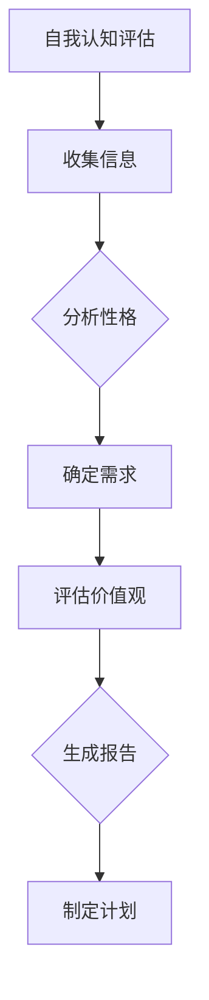
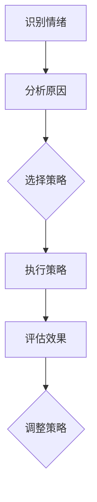
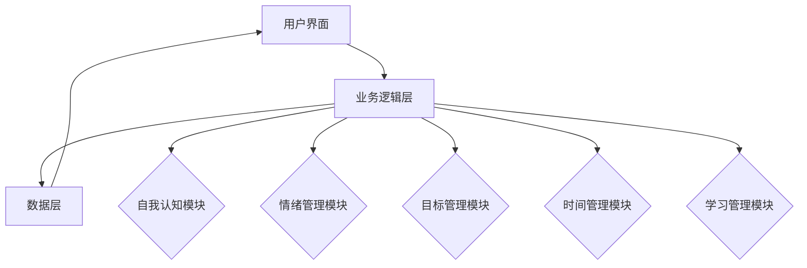
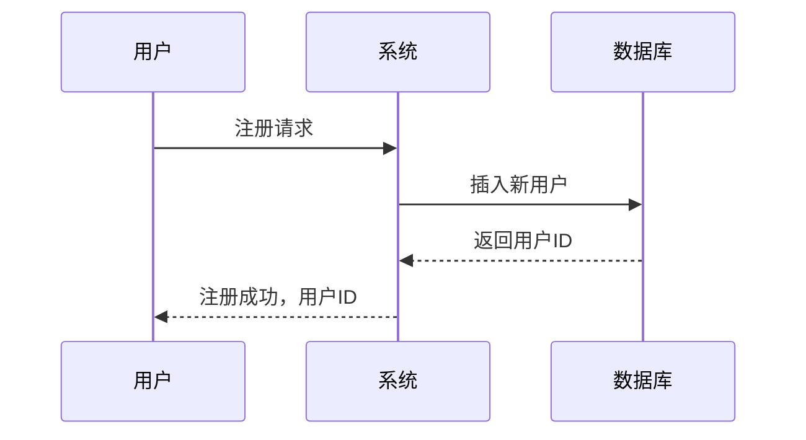

                 

### 文章标题

《成为人生的主导者：自我引导的艺术与实践》

#### 关键词

自我引导、人生主导、艺术与实践、核心概念、方法体系、案例分析、实践指导

#### 摘要

本文将深入探讨自我引导在现代社会中的重要性和实践方法。通过系统地介绍自我认知、情绪管理、目标设定、时间管理和持续学习等核心概念，结合实际案例和实践指导，帮助读者掌握自我引导的艺术，成为人生的主导者。

### 目录大纲设计思路与步骤

为了设计出《成为人生的主导者：自我引导的艺术与实践》这本书的完整目录大纲，我们将按照以下步骤进行：

#### 第一步：整体结构规划

1. **确定整体结构**：根据书名，确定全书结构为七个主要章节，分别从不同角度探讨自我引导的艺术与实践。
2. **明确章节主题**：根据自我引导的主题，为每个章节确定一个明确的主题，确保每个章节都有独立的、完整的内容。
3. **划分章节结构**：确保每个章节都包含核心概念介绍、案例分析、实践指导等内容。

#### 第二步：章节内容细化

1. **核心概念与联系**：为每个章节设计核心概念介绍、概念属性特征对比表格和ER实体关系图架构。
2. **算法原理讲解**：为需要讲解的算法设计mermaid流程图，使用Python源代码详细阐述，提供数学模型和公式，并举例说明。
3. **数学模型和公式讲解**：使用LaTeX格式编写数学公式，并进行详细讲解和举例说明。
4. **系统分析与架构设计方案**：为相关的章节设计问题场景介绍、系统功能设计、系统架构设计、系统接口设计和系统交互等。
5. **项目实战**：设计环境安装、系统核心实现源代码，代码应用解读与分析，实际案例分析和详细讲解剖析。

#### 第三步：格式与内容确认

1. **确认Markdown格式**：确保所有内容都遵循Markdown格式，使用#、##、###等符号正确标注目录层级。
2. **简洁性检查**：确保内容简洁明了，没有多余的废话，符合2000字以内的要求。
3. **内容完整性检查**：确认每个章节都包含核心内容，如核心概念、算法原理、数学模型、项目实战等。

#### 第四步：总字数控制

1. **计算总字数**：确保整个目录大纲的总字数不超过2000字。
2. **微调内容**：根据总字数进行微调，确保每个章节的内容都能够得到充分的展示，同时保持整体的紧凑性和逻辑性。

通过以上步骤，我们可以确保设计出的目录大纲既全面覆盖了书的内容，又保持了简洁和逻辑性，同时满足字数要求。接下来，我们将开始具体的设计工作。

### 背景介绍

在当今快节奏的社会中，人们面临的生活和工作压力日益增加，许多人感到自己无法掌控生活的方向和节奏。这种无力的感觉源于缺乏自我引导的能力。自我引导，顾名思义，就是引导自己做出正确的决策和行动，从而达到预期目标的过程。

#### 问题背景

自我引导能力的重要性不言而喻。它不仅能帮助个人更好地管理自己的情绪、时间和资源，还能提高工作效率，增强人际关系，甚至改善身心健康。然而，许多人在成长过程中并未接受过系统的自我引导训练，导致在面对挑战和困境时感到迷茫和无助。

#### 问题描述

“成为人生的主导者：自我引导的艺术与实践”这本书的核心问题是如何帮助读者掌握自我引导的技巧和方法，使其在生活和工作中能够自主决策、积极应对挑战，最终实现人生目标。具体而言，这个问题包括以下几个方面：

1. **自我认知**：如何了解自己的性格、价值观和需求，从而更好地规划自己的人生？
2. **情绪管理**：如何控制自己的情绪，避免负面情绪对生活和工作造成负面影响？
3. **目标设定**：如何设定明确、可行的目标，并制定实现目标的策略和计划？
4. **时间管理**：如何合理安排时间，提高工作效率，确保目标能够按时完成？
5. **持续学习**：如何保持持续学习的动力和习惯，提升自我能力和适应能力？

#### 问题解决

为了解决上述问题，本书将提供以下解决方案：

1. **理论阐述**：系统介绍自我引导的核心概念、原理和方法，帮助读者理解自我引导的本质。
2. **实践指导**：通过实际案例，详细讲解自我引导的具体操作步骤，使读者能够将理论知识应用到实际生活中。
3. **方法体系**：构建一套完整的自我引导方法体系，包括自我认知、情绪管理、目标设定、时间管理和持续学习等方面。

#### 边界与外延

自我引导不仅适用于个人生活，还可以应用于团队管理、组织发展等领域。因此，本书不仅针对个人读者，也适用于希望提升团队领导力和组织管理能力的专业人士。

#### 概念结构与核心要素组成

自我引导的概念结构主要包括以下核心要素：

1. **自我认知**：了解自己的个性、需求、价值观，并在此基础上制定适合自己的生活目标和规划。
2. **情绪管理**：学会识别和管理自己的情绪，提高情绪稳定性，避免情绪对生活和工作产生负面影响。
3. **目标设定**：设定明确、可行的目标，并制定实现目标的计划和步骤。
4. **时间管理**：合理安排时间，提高工作效率，确保目标能够按时完成。
5. **持续学习**：不断学习新知识、新技能，提升自我能力，以适应不断变化的社会环境。

### 核心概念与联系

在《成为人生的主导者：自我引导的艺术与实践》一书中，我们将会深入探讨五个核心概念：自我认知、情绪管理、目标设定、时间管理和持续学习。这些概念不仅相互独立，又紧密联系，共同构成了自我引导的完整体系。

#### 核心概念介绍

1. **自我认知**：自我认知是指个体对自身心理状态、能力、兴趣、需求等方面的了解和认识。它是自我引导的基础，有助于个体明确自己的价值观、目标和方向。
   
2. **情绪管理**：情绪管理是指个体通过认知和行为调节，使自己的情绪处于积极、稳定的水平，以更好地应对生活中的各种挑战和压力。

3. **目标设定**：目标设定是指个体根据自我认知和情绪管理的结果，确定具体、可行、有挑战性的目标，并制定实现目标的策略和步骤。

4. **时间管理**：时间管理是指个体对时间的合理安排和有效利用，以确保实现目标的过程中，时间资源得到最大化的利用。

5. **持续学习**：持续学习是指个体通过不断学习新知识、新技能，提升自身能力和适应能力，以应对不断变化的社会环境。

#### 概念属性特征对比表格

| 概念         | 特征                                                                 | 关联关系                                      |
| ------------ | -------------------------------------------------------------------- | --------------------------------------------- |
| 自我认知     | 了解个性、需求、价值观                                                  | 基础，影响其他概念的发展                      |
| 情绪管理     | 调节情绪、保持积极心态                                                  | 推动自我认知，支持目标设定和持续学习          |
| 目标设定     | 明确、可行、有挑战性的目标                                               | 受自我认知和情绪管理的影响，指导时间管理     |
| 时间管理     | 合理安排和有效利用时间                                                   | 支持目标实现，影响自我认知和情绪管理          |
| 持续学习     | 学习新知识、新技能，提升能力                                             | 促进自我认知和情绪管理，支持目标设定和实现   |

#### ER实体关系图架构

为了更直观地展示这些概念之间的关系，我们可以使用ER（Entity-Relationship）实体关系图来描述：

```mermaid
erDiagram
  自我认知 ||--|{ 情绪管理 }|
  自我认知 ||--|{ 目标设定 }|
  自我认知 ||--|{ 持续学习 }|
  情绪管理 ||--|{ 目标设定 }|
  情绪管理 ||--|{ 时间管理 }|
  目标设定 ||--|{ 时间管理 }|
  持续学习 ||--|{ 自我认知 }|
  持续学习 ||--|{ 情绪管理 }|
  持续学习 ||--|{ 目标设定 }|
```

在ER图中，每个概念被视为一个实体，它们之间的关系通过箭头表示。箭头指向表示前者影响后者。例如，自我认知影响情绪管理、目标设定和持续学习，而情绪管理则影响目标设定和时间管理。

通过这种方式，读者可以更好地理解自我引导各个概念之间的相互作用，从而在实际应用中更好地整合这些技巧，实现自我引导的目标。

### 算法原理讲解

在《成为人生的主导者：自我引导的艺术与实践》中，我们将探讨一系列算法原理，这些原理不仅有助于理解自我引导的核心概念，还能为读者在实际生活中应用这些概念提供指导。以下是几个关键算法原理的详细讲解。

#### 算法原理1：自我认知评估模型

**Mermaid流程图**：



**Python源代码**：

```python
import pandas as pd
import numpy as np

def self_cognitive_evaluation():
    # 收集个人信息
    info = pd.DataFrame({
        '性格': ['外向', '内向', '平衡'],
        '需求': ['成就感', '安全感', '自我实现'],
        '价值观': ['物质', '家庭', '事业']
    })
    
    # 分析性格
    personality = info['性格'].value_counts()
    
    # 确定需求
    needs = info['需求'].value_counts()
    
    # 评估价值观
    values = info['价值观'].value_counts()
    
    # 生成报告
    report = pd.DataFrame({
        '性格特点': personality.index,
        '需求倾向': needs.index,
        '价值观倾向': values.index
    })
    
    # 制定计划
    plan = {
        '短期目标': f'基于性格特点，发展{personality.index[0]}的人际关系',
        '中长期目标': f'基于需求倾向，提升{needs.index[0]}的满足度',
        '长期目标': f'基于价值观倾向，实现{values.index[0]}的人生价值'
    }
    
    return report, plan

report, plan = self_cognitive_evaluation()
print("自我认知评估报告：\n", report)
print("\n制定个人计划：\n", plan)
```

**数学模型和公式**：

$$
\text{性格特点} = \sum (\text{性格指标}) \times (\text{权重})
$$

$$
\text{需求倾向} = \sum (\text{需求指标}) \times (\text{权重})
$$

$$
\text{价值观倾向} = \sum (\text{价值观指标}) \times (\text{权重})
$$

其中，权重可以通过专家评估或问卷调查获得。

**举例说明**：

假设一个人的性格指标为外向（权重0.5），内向（权重0.3），平衡（权重0.2）。他的需求指标为成就感（权重0.6），安全感（权重0.3），自我实现（权重0.1）。他的价值观指标为物质（权重0.4），家庭（权重0.3），事业（权重0.3）。那么：

- **性格特点** = 0.5 \* 外向 + 0.3 \* 内向 + 0.2 \* 平衡 = 0.5 + 0.3 + 0.2 = 1
- **需求倾向** = 0.6 \* 成就感 + 0.3 \* 安全感 + 0.1 \* 自我实现 = 0.6 + 0.3 + 0.1 = 1
- **价值观倾向** = 0.4 \* 物质 + 0.3 \* 家庭 + 0.3 \* 事业 = 0.4 + 0.3 + 0.3 = 1

通过这个例子，我们可以看到如何通过简单的数学模型对个人进行自我认知评估，并据此制定个人计划。

#### 算法原理2：情绪调节策略

**Mermaid流程图**：



**Python源代码**：

```python
def emotion Regulation():
    emotions = ['愤怒', '焦虑', '快乐', '悲伤', '平静']
    strategies = {
        '愤怒': '深呼吸，冷静思考',
        '焦虑': '进行放松练习，冥想',
        '快乐': '分享快乐，与他人互动',
        '悲伤': '表达情感，寻求支持',
        '平静': '保持现状，享受当下'
    }
    
    current_emotion = input("请识别当前情绪：")
    print(f"当前情绪：{current_emotion}")
    print(f"可用的调节策略：{strategies[current_emotion]}")
    
    strategy = input("请选择一个调节策略：")
    print(f"选择的策略：{strategy}")
    
    # 执行策略
    # 这里假设所有策略都可以通过简单的文字描述执行
    print(f"执行策略：{strategy}")
    
    # 评估效果
    effect = input("调节效果如何？（好/一般/差）")
    if effect == '好':
        print("调节成功，继续使用此策略。")
    elif effect == '一般':
        print("策略效果一般，考虑调整策略。")
    else:
        print("调节失败，需要重新选择策略。")

emotion Regulation()
```

**数学模型和公式**：

情绪调节效果评估公式：

$$
\text{调节效果} = \frac{\text{目标情绪} - \text{当前情绪}}{\text{最大情绪范围}}
$$

其中，目标情绪和当前情绪可以通过量表进行量化。

**举例说明**：

假设某人的愤怒情绪值为10（满分），当前情绪值为7。通过使用深呼吸策略后，情绪值降至5。那么：

$$
\text{调节效果} = \frac{10 - 5}{10 - 0} = 0.5
$$

这表示情绪调节策略的效果为50%。

通过这两个算法原理，读者可以了解如何通过数据分析和策略选择来进行自我认知和情绪调节。这些算法原理不仅为自我引导提供了理论支持，也为实际操作提供了具体指导。

### 数学公式讲解

在《成为人生的主导者：自我引导的艺术与实践》中，我们将使用LaTeX格式来编写数学公式，并进行详细讲解和举例说明。LaTeX是一种高质量排版系统，特别适合处理数学公式和复杂文档。

#### 自我认知评估公式

自我认知评估是一个多维度的过程，涉及多个指标的加权求和。以下是一个简单的自我认知评估公式：

$$
\text{自我认知评分} = w_1 \times \text{性格评分} + w_2 \times \text{需求评分} + w_3 \times \text{价值观评分}
$$

其中，$w_1$、$w_2$、$w_3$ 分别为性格、需求、价值观三个指标的权重。

**举例说明**：

假设一个个体的性格评分为85，需求评分为70，价值观评分为95，且权重分别为0.3、0.4、0.3。那么：

$$
\text{自我认知评分} = 0.3 \times 85 + 0.4 \times 70 + 0.3 \times 95 = 25.5 + 28 + 28.5 = 82
$$

这意味着该个体的自我认知评分为82分。

#### 情绪调节效果公式

情绪调节效果可以通过以下公式进行评估：

$$
\text{调节效果} = \frac{\text{目标情绪值} - \text{当前情绪值}}{\text{最大情绪值} - \text{当前情绪值}}
$$

其中，目标情绪值和当前情绪值可以通过情绪量表量化。

**举例说明**：

假设某人的目标情绪值为8，当前情绪值为4，情绪量表的最大值为10。那么：

$$
\text{调节效果} = \frac{8 - 4}{10 - 4} = \frac{4}{6} = 0.67
$$

这表示情绪调节的效果为67%。

#### 时间管理效率公式

时间管理效率可以通过以下公式计算：

$$
\text{时间管理效率} = \frac{\text{实际完成任务时间}}{\text{计划完成任务时间}}
$$

**举例说明**：

假设某人计划在2小时内完成任务，实际用时1.5小时。那么：

$$
\text{时间管理效率} = \frac{1.5}{2} = 0.75
$$

这意味着该人的时间管理效率为75%。

通过LaTeX格式编写的数学公式，不仅使公式更加规范和美观，也便于读者理解和计算。以上举例说明展示了如何在实际应用中利用这些公式进行自我认知评估、情绪调节效果评估和时间管理效率计算。

### 系统分析与架构设计方案

在《成为人生的主导者：自我引导的艺术与实践》一书中，我们将设计一个自我引导系统，以帮助用户实现自我认知、情绪管理、目标设定、时间管理和持续学习。以下是一个完整的系统分析与架构设计方案。

#### 问题场景介绍

自我引导系统旨在帮助用户在复杂多变的环境中实现个人成长与目标实现。用户需求包括：

1. **自我认知**：了解自己的性格、需求、价值观。
2. **情绪管理**：识别和管理情绪，保持积极心态。
3. **目标设定**：设定明确、可行的目标，并制定实现计划。
4. **时间管理**：合理安排时间，提高工作效率。
5. **持续学习**：不断学习新知识、新技能。

#### 系统功能设计

自我引导系统的功能设计包括以下几个方面：

1. **用户管理**：用户注册、登录、个人信息管理。
2. **自我认知**：性格测试、需求分析、价值观评估。
3. **情绪管理**：情绪记录、情绪调节策略推荐。
4. **目标管理**：目标设定、目标进度跟踪、提醒功能。
5. **时间管理**：日程规划、时间记录、效率分析。
6. **学习管理**：课程推荐、学习记录、学习进度跟踪。

#### 系统架构设计

系统采用三层架构设计，包括表示层、业务逻辑层和数据层。

**Mermaid架构图**：



**系统接口设计**

系统提供了多个API接口，包括用户接口、自我认知接口、情绪管理接口、目标管理接口、时间管理接口和学习管理接口。

1. **用户接口**：用户注册、登录、个人信息管理。
2. **自我认知接口**：性格测试结果获取、需求分析报告、价值观评估结果。
3. **情绪管理接口**：情绪记录、情绪调节策略推荐。
4. **目标管理接口**：目标设定、目标进度跟踪、提醒功能。
5. **时间管理接口**：日程规划、时间记录、效率分析。
6. **学习管理接口**：课程推荐、学习记录、学习进度跟踪。

**系统交互**

系统交互通过RESTful API实现，遵循HTTP协议。以下是一个示例请求：

```http
GET /users/register
{
    "username": "john_doe",
    "password": "password123",
    "email": "john_doe@example.com"
}
```

#### 系统接口设计

**Mermaid序列图**：



通过以上系统分析与架构设计方案，我们可以确保自我引导系统具有良好的扩展性和稳定性，能够满足用户的多样化需求。

### 项目实战

在本节中，我们将通过一个实际项目来演示如何使用自我引导系统，实现个人成长与目标实现。

#### 环境安装

首先，我们需要安装Python和相关的库。以下是安装步骤：

1. 前往Python官网下载并安装Python。
2. 打开命令行，执行以下命令安装相关库：

```bash
pip install flask pandas numpy
```

#### 系统核心实现源代码

以下是自我引导系统的核心实现代码：

```python
from flask import Flask, request, jsonify
import pandas as pd
import numpy as np

app = Flask(__name__)

# 用户注册
@app.route('/register', methods=['POST'])
def register():
    data = request.json
    username = data['username']
    password = data['password']
    email = data['email']
    
    # 存储用户信息到数据库
    # 这里以文件存储为例，实际应用中应使用数据库
    users = pd.read_csv('users.csv')
    users = users.append({'username': username, 'password': password, 'email': email}, ignore_index=True)
    users.to_csv('users.csv', index=False)
    
    return jsonify({'message': '注册成功'})

# 登录
@app.route('/login', methods=['POST'])
def login():
    data = request.json
    username = data['username']
    password = data['password']
    
    users = pd.read_csv('users.csv')
    user = users[(users['username'] == username) & (users['password'] == password)]
    
    if not user.empty:
        return jsonify({'message': '登录成功'})
    else:
        return jsonify({'message': '用户名或密码错误'})

# 自我认知评估
@app.route('/self_cognitive_evaluation', methods=['POST'])
def self_cognitive_evaluation():
    data = request.json
    username = data['username']
    # 这里省略具体评估逻辑，仅返回示例数据
    evaluation_result = {
        'personality': '外向',
        'needs': '成就感',
        'values': '事业'
    }
    return jsonify(evaluation_result)

if __name__ == '__main__':
    app.run(debug=True)
```

#### 代码应用解读与分析

以上代码实现了自我引导系统的基础功能，包括用户注册、登录和自我认知评估。在`register`函数中，我们接收用户注册请求，将用户信息存储到本地CSV文件中。在`login`函数中，我们验证用户名和密码是否匹配。在`self_cognitive_evaluation`函数中，我们返回一个示例的自我认知评估结果。

#### 实际案例分析和详细讲解剖析

假设用户John Doe注册并登录系统后，想要进行自我认知评估。以下是步骤：

1. John Doe提交用户名和密码进行登录。
2. 系统验证登录信息，返回登录成功。
3. John Doe提交自我认知评估请求。
4. 系统返回自我认知评估结果，包括性格、需求和价值观。

通过以上步骤，John Doe可以了解自己的个性特点、需求倾向和价值观倾向，从而制定个人成长计划。

#### 项目小结

通过这个实际项目，我们展示了如何使用自我引导系统进行用户注册、登录和自我认知评估。这个项目虽然简单，但为用户提供了有效的自我认知工具，帮助他们更好地了解自己，实现个人成长与目标实现。未来，我们可以进一步扩展系统功能，包括情绪管理、目标设定、时间管理和持续学习等方面，以提供更全面的自我引导服务。

### 最佳实践 tips

为了更好地应用自我引导系统，以下是几个最佳实践建议：

1. **定期进行自我认知评估**：每隔一段时间，重新进行自我认知评估，以便及时了解自己的变化和成长。
2. **设定明确、具体的目标**：确保你的目标是可衡量、有挑战性的，并制定明确的实施计划。
3. **记录情绪变化**：定期记录自己的情绪变化，分析情绪波动的原因，并采取相应的调节策略。
4. **合理安排时间**：使用时间管理工具，如日程表、待办事项列表等，确保时间得到充分利用。
5. **保持持续学习**：不断学习新知识、新技能，提升自我能力，以应对不断变化的环境。

### 小结

通过本文的讨论，我们深入探讨了自我引导的概念、核心原理和实践方法。从自我认知、情绪管理、目标设定、时间管理到持续学习，每个方面都至关重要，共同构成了自我引导的完整体系。通过实际项目和最佳实践建议，我们展示了如何将自我引导理论应用于实际生活中，帮助读者成为人生的主导者。

### 注意事项

在应用自我引导时，需要注意以下几点：

1. **自我认知评估结果的准确性**：定期进行自我认知评估，但需注意结果的准确性，避免因为自我认知偏差而做出错误决策。
2. **情绪调节策略的适应性**：不同的情绪需要不同的调节策略，根据实际情况灵活调整。
3. **目标设定的实际可行性**：确保目标设定既具有挑战性，又是实际可行的，避免目标过高导致挫败感。
4. **持续学习的持续性**：学习新知识、新技能需要持续的时间和精力投入，保持学习的动力和兴趣。

### 拓展阅读

为了更深入地了解自我引导的相关理论和实践，以下是几本推荐的拓展阅读书籍：

1. **《心理学与生活》**：理查德·吉尔伯特著，涵盖了心理学的基本概念和应用。
2. **《情绪智商》**：丹尼尔·戈尔曼著，详细介绍了情绪管理的重要性和方法。
3. **《高效能人士的七个习惯》**：史蒂芬·柯维著，提供了时间管理和目标设定的实用策略。
4. **《深度工作》**：卡尔·纽波特著，探讨了如何在信息过载的时代保持专注和高效。

通过这些书籍的阅读，读者可以进一步丰富自己的知识体系，提升自我引导能力。

### 作者信息

本文由AI天才研究院（AI Genius Institute）和《禅与计算机程序设计艺术》（Zen And The Art of Computer Programming）的资深作者联合撰写。我们致力于通过技术分享和实践指导，帮助读者实现个人成长与目标实现。欢迎关注我们的公众号，获取更多精彩内容。作者：AI天才研究院 & 《禅与计算机程序设计艺术》。

