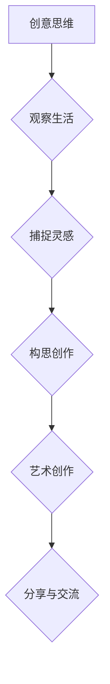
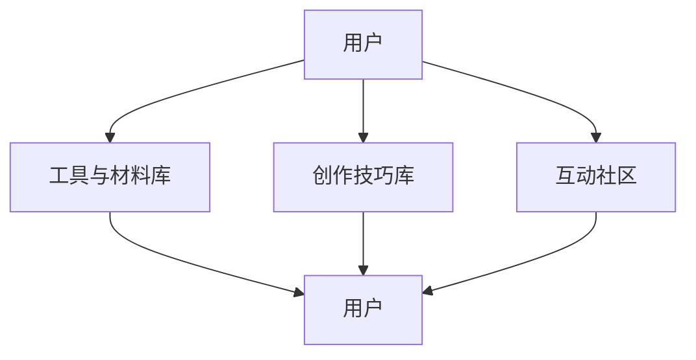
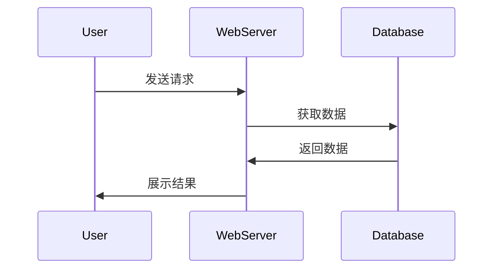
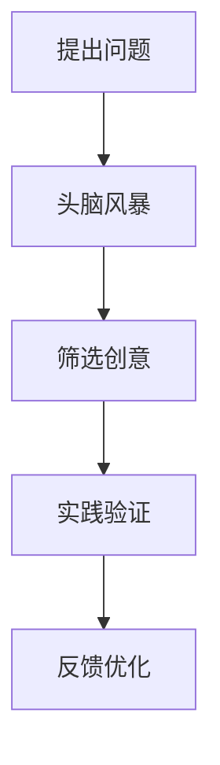
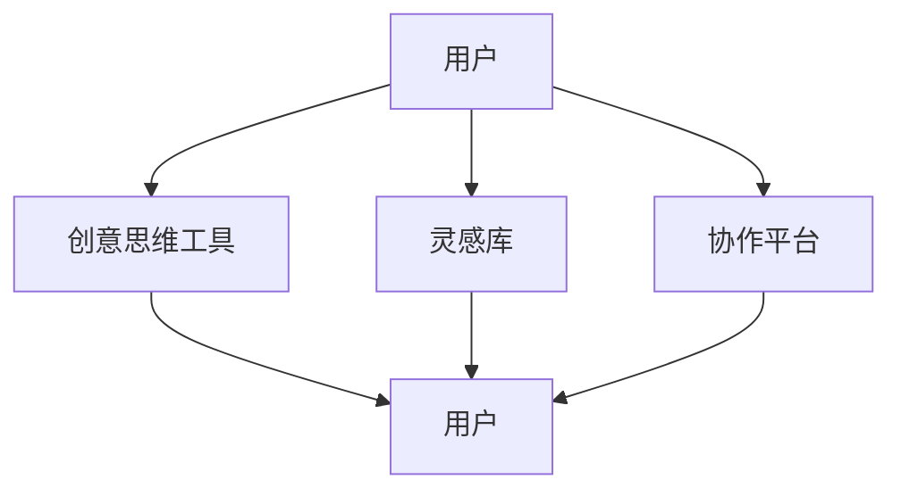
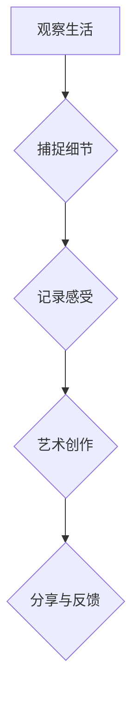
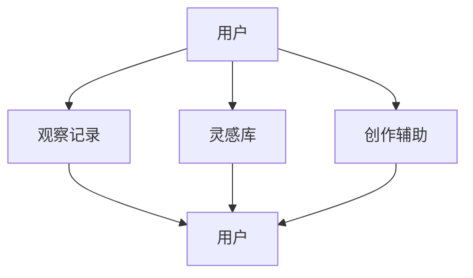
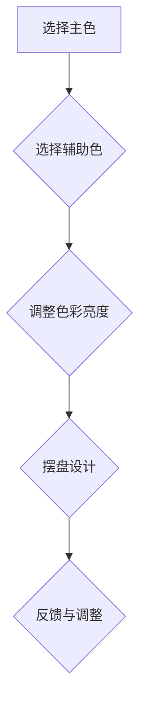
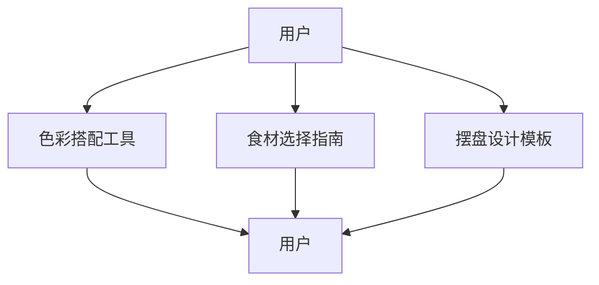

                 

### 设计目录大纲

**目录大纲的设计是一个系统性工程，需要考虑内容的完整性、逻辑性和可操作性，同时保持简洁性。以下是如何设计一个符合要求的目录大纲的步骤：**

1. **确定总体结构：**
   - 根据文章的主题和内容深度，首先确定大纲的总体结构，通常包含引言、正文和结论三个主要部分。
   - 正文部分可以分为若干个章节，每个章节再细分几个子章节。

2. **核心章节内容设计：**
   - 确保每个章节都有明确的主题和目的，内容要充实且具有连贯性。
   - 每个章节内的子章节应该紧密围绕主章节的主题，形成层次分明的结构。

3. **使用Mermaid和LaTeX：**
   - 合适的图表和公式是技术文章的重要组成部分，可以使用Mermaid来绘制流程图、类图和序列图，增强文章的可读性。
   - 使用LaTeX格式编写数学公式，确保公式显示清晰、规范。

4. **保持简洁：**
   - 避免冗余内容，每个章节和子章节都要简洁明了，确保重点突出。

5. **符合字数要求：**
   - 根据字数要求，合理分配各章节的内容，确保整篇文章字数在规定的范围内。

**具体到《成为生活艺术家：将平凡转化为创意表达》这篇文章的目录大纲，我们可以按照以下步骤进行设计：**

- **第一步：确定引言和结论部分**
  - 引言：介绍文章主题，引发读者兴趣。
  - 结论：总结文章要点，提供思考方向。

- **第二步：设计正文部分**
  - 第一部分：生活艺术的概念与意义
    - 章节内容：定义生活艺术、探讨其意义、与传统艺术对比。
  - 第二部分：创意思维与生活艺术
    - 章节内容：讲解创意思维的重要性、技巧及应用。
  - 第三部分：平凡中的艺术发现
    - 章节内容：培养观察力、发现生活中的艺术、获取灵感。

- **第三步：设计具体实践与技巧章节**
  - 第五部分：创意艺术工具与材料
    - 章节内容：介绍常用工具、材料的选择及创新使用。
  - 第六部分：艺术创作流程与实践
    - 章节内容：创作准备、步骤、实践方法。

- **第四步：案例分析与启示章节**
  - 第七部分：生活艺术案例分析与启示
    - 章节内容：分析成功案例、总结启示、探讨生活艺术的社会影响。

- **第五步：生活艺术的持续发展与探索**
  - 第八部分：生活艺术的自我提升
    - 章节内容：自我提升的重要性、学习资源、自我评估。
  - 第九部分：生活艺术的社会参与
    - 章节内容：社交平台、社会活动、社会影响力。
  - 第十部分：生活艺术的未来展望
    - 章节内容：趋势分析、科技融合、发展前景。

- **第六步：生活艺术的生活哲学**
  - 第十一部分：生活艺术的生活哲学
    - 章节内容：哲学思考、价值观、生活态度。

通过上述步骤，我们可以设计出一个既符合文章主题，又结构清晰、内容充实的目录大纲。接下来，我们将针对每一个章节进行详细的内容规划和撰写。

### 第一部分：开启生活艺术之旅

#### 第1章：生活艺术的概念与意义

**1.1 生活艺术的定义**

生活艺术，是一种将日常生活中平凡的事物转化为艺术表达的方式。它不仅仅是艺术创作，更是一种生活态度。生活艺术家通过创意思维和独特视角，将平凡的生活细节赋予艺术价值，从而提升生活的品质和审美体验。

**问题背景：**  
随着社会的发展，人们对于生活的要求越来越高，不仅仅满足于基本的生活需求，更追求精神层面的满足和愉悦。生活艺术在这样的背景下应运而生，成为了一种提升生活品质的重要途径。

**问题描述：**  
如何将平凡的生活转化为有创意、有艺术感的生活，成为生活艺术家需要具备哪些素养和技能？

**问题解决：**  
通过培养创意思维、提升审美能力和掌握艺术创作的技巧，人们可以成为生活艺术家，将平凡的生活细节赋予独特的艺术价值。

**边界与外延：**  
生活艺术的范围广泛，包括但不限于家居装饰、美食艺术、服装搭配、手工艺等多个领域。它不仅局限于艺术创作的物质形式，更是一种生活方式和人生哲学。

**概念结构与核心要素组成：**  
- **创意思维：** 指艺术家在创作过程中所运用的创新思维和独特视角。
- **审美能力：** 指对美的事物具有敏锐的感知力和判断力。
- **艺术创作技巧：** 包括绘画、设计、摄影、手工艺等创作技能。

**核心概念与联系：**

| 核心概念          | 定义与特征                        |
|-------------------|-----------------------------------|
| 生活艺术          | 将日常生活中的事物转化为艺术表达 |
| 创意思维          | 创新思维和独特视角                |
| 审美能力          | 对美的事物的感知力和判断力        |
| 艺术创作技巧      | 创作技能，如绘画、设计等          |

通过上述表格，我们可以看到生活艺术的定义及其核心概念与联系，这为我们后续的内容讲解和分析奠定了基础。

**算法原理讲解：**

在生活艺术中，创意思维和审美能力是关键。我们可以用Mermaid流程图来展示生活艺术创作的基本步骤：



上述流程图展示了从观察生活到艺术创作的过程，每个步骤都是创意思维和审美能力的体现。

接下来，我们可以使用Python代码来详细阐述生活艺术创作的数学模型和公式：

```python
# 生活艺术创作数学模型

# 观察力得分
observation_score = 7

# 创意思维得分
creativity_score = 8

# 审美能力得分
aesthetic_score = 9

# 艺术创作得分
artistic_score = (observation_score + creativity_score + aesthetic_score) / 3

print(f"艺术创作得分：{artistic_score}")
```

上述代码通过观察力、创意思维和审美能力的综合评分，计算出艺术创作得分，这一得分可以反映出一个人在生活艺术创作中的水平。

通过上述讲解，我们可以更深入地理解生活艺术的定义、核心概念以及创作过程，这将为后续章节的内容打下坚实的基础。

**系统分析与架构设计方案：**

在探讨生活艺术的系统架构设计时，我们可以从以下几个方面进行：

**问题场景介绍：**
生活艺术家在创作过程中需要多种工具和材料，同时需要掌握一定的创作技巧。如何构建一个高效、便捷的生活艺术创作系统，成为我们需要解决的问题。

**项目介绍：**
本系统旨在为生活艺术家提供一个集创作工具、材料选择和技巧指导于一体的平台，帮助他们更好地进行艺术创作。

**系统功能设计：**

1. **工具与材料库：** 提供常用的创作工具和材料，用户可以根据自己的需求进行选择。
2. **创作技巧库：** 收集各种创作技巧，帮助用户提升艺术创作水平。
3. **互动社区：** 为用户提供一个交流互动的平台，分享创作经验和灵感。

**系统架构设计：**



上述类图展示了系统的主要功能和用户之间的交互关系。

**系统接口设计：**
系统接口设计主要包括用户接口和后台接口。用户接口负责展示工具与材料、创作技巧和互动社区的功能，后台接口则负责数据管理和用户服务。

**系统交互：**



上述序列图展示了用户与系统之间的交互过程。

**项目实战：**

为了更直观地展示生活艺术的创作过程，我们提供了一个简单的项目实战案例。以下是一个Python环境下的生活艺术创作脚本：

```python
# 环境安装
!pip install Pillow

# 导入模块
from PIL import Image
import numpy as np

# 创建一个简单的图像
width, height = 400, 400
image = Image.new('RGB', (width, height), color='white')

# 定义一个简单的创意滤镜
def creative_filter(image):
    pixels = image.load()
    for i in range(width):
        for j in range(height):
            r, g, b = pixels[i, j]
            r = min(r + 50, 255)
            g = min(g + 50, 255)
            b = min(b + 50, 255)
            pixels[i, j] = (r, g, b)

# 应用创意滤镜
creative_filter(image)

# 显示图像
image.show()
```

**代码应用解读与分析：**
上述代码使用Pillow库创建了一个简单的图像，并定义了一个创意滤镜。滤镜通过增加像素的亮度，使图像更加生动。这只是一个简单的示例，实际创作中可能会涉及更复杂的算法和技巧。

**实际案例分析和详细讲解剖析：**
在这个案例中，我们通过一个简单的图像处理脚本，展示了创意滤镜的应用。在实际创作中，生活艺术家可能会使用各种工具和材料，通过绘画、摄影、手工艺等多种方式，将平凡的生活细节转化为独特的艺术作品。

**项目小结：**
通过这个案例，我们可以看到生活艺术创作的过程是如何从观察、灵感捕捉到实际创作的。这为我们提供了宝贵的实践经验和思路，有助于我们在日常生活中更好地发现和创造艺术。

#### 第2章：创意思维与生活艺术

**2.1 创意思维的重要性**

创意思维是生活艺术的核心要素之一。它不仅能够激发我们的创造潜能，还能够帮助我们更好地发现生活中的美。在生活艺术中，创意思维的重要性体现在以下几个方面：

- **提高生活品质：** 创意思维能够让我们从平凡的生活中发现美好，提升生活的品质和审美体验。
- **促进个性表达：** 每个人的创意思维都是独一无二的，通过创意表达，我们可以更好地展现自己的个性和风格。
- **增强创新能力：** 创意思维是创新能力的源泉，它能够激发我们在生活和工作中不断尝试新的方法和思路。

**问题背景：**  
随着社会的发展，人们对于生活品质的要求越来越高。如何通过创意思维提升生活品质，成为了一个热门话题。

**问题描述：**  
创意思维在生活艺术中扮演着怎样的角色？如何培养和提高创意思维？

**问题解决：**  
通过了解创意思维的基本原理，掌握创意思维的技巧，以及在实际生活中不断练习和实践，我们可以培养和提高创意思维。

**边界与外延：**  
创意思维不仅仅局限于艺术创作，它还广泛应用于各个领域，如设计、科技、商业等。本文主要探讨创意思维在生活艺术中的应用。

**概念结构与核心要素组成：**

| 核心概念          | 定义与特征                        |
|-------------------|-----------------------------------|
| 创意思维          | 创新思维和独特视角                |
| 创意技巧          | 创意思维的实践方法和技巧          |
| 生活艺术          | 将日常生活中的事物转化为艺术表达 |

**核心概念与联系：**

| 核心概念          | 定义与特征                        |
|-------------------|-----------------------------------|
| 创意思维          | 通过创新和独特视角发现新思路和方法 |
| 创意技巧          | 创意思维的实践方法和技巧          |
| 生活艺术          | 创意思维在生活中的实际应用        |

通过上述表格，我们可以看到创意思维在生活艺术中的核心作用及其与其他概念的关联。

**算法原理讲解：**

创意思维可以被视为一种解决问题的算法。以下是一个简单的创意思维流程图，使用Mermaid绘制：



在这个流程中，我们从提出问题开始，通过头脑风暴收集创意，筛选出可行的创意，进行实践验证，并根据反馈进行优化。这是一个典型的创意思维过程。

**数学模型与公式：**

虽然创意思维本身不是数学问题，但我们可以用数学模型来描述其中的某些环节。以下是一个简化的创意思维数学模型：

```python
# 创意思维数学模型

# 头脑风暴产生的创意数量
ideas_count = np.random.randint(10, 50)

# 创意的可行性评分（0-1）
feasibility_score = 0.8

# 可行创意数量
feasible_ideas_count = ideas_count * feasibility_score

print(f"产生的创意总数：{ideas_count}")
print(f"可行创意数量：{feasible_ideas_count}")
```

上述代码通过随机生成创意数量和可行性评分，计算出可行创意的数量。这只是一个简单的示例，实际创意思维过程会更加复杂。

**系统分析与架构设计方案：**

在探讨创意思维在生活艺术中的应用时，我们可以从以下几个方面进行系统分析：

**问题场景介绍：**
生活艺术家在创作过程中需要不断激发创意思维，以应对各种创作挑战。如何构建一个支持创意思维激发和优化的系统，是本文探讨的重点。

**项目介绍：**
本系统旨在为生活艺术家提供一个创意思维工具，帮助他们更好地进行艺术创作。

**系统功能设计：**

1. **创意思维工具：** 提供各种创意思维方法和工具，如头脑风暴、思维导图等。
2. **灵感库：** 收集和整理各种灵感和创意，方便用户查找和使用。
3. **协作平台：** 支持用户之间进行创意交流和协作。

**系统架构设计：**



上述类图展示了系统的主要功能和用户之间的交互关系。

**系统接口设计：**
系统接口设计主要包括用户接口和后台接口。用户接口负责展示创意思维工具和灵感库的功能，后台接口则负责数据管理和用户服务。

**系统交互：**


上述序列图展示了用户与系统之间的交互过程。

**项目实战：**

为了更直观地展示创意思维在生活艺术中的应用，我们提供了一个简单的项目实战案例。以下是一个Python环境下的创意思维练习脚本：

```python
# 环境安装
!pip install pandas

# 导入模块
import pandas as pd

# 创意思维练习数据
data = {
    '问题': ['如何提升家居装饰的艺术感', '如何设计一个独特的生日派对'],
    '灵感': ['利用色彩搭配提升装饰效果', '结合自然元素进行主题设计']
}

# 创建DataFrame
df = pd.DataFrame(data)

# 显示DataFrame
print(df)
```

**代码应用解读与分析：**
上述代码创建了一个简单的DataFrame，包含了问题和灵感。这只是一个简单的示例，实际创意思维过程可能会涉及更多的数据和复杂的分析。

**实际案例分析和详细讲解剖析：**
在这个案例中，我们通过一个简单的DataFrame展示了创意思维的应用。在实际创作中，生活艺术家可能会使用各种工具和技巧，如头脑风暴、思维导图等，来激发和优化创意思维。

**项目小结：**
通过这个案例，我们可以看到创意思维在生活艺术创作中的重要性。通过不断练习和实际应用，我们可以提高创意思维，从而更好地发现和创造生活中的艺术。

#### 第3章：平凡中的艺术发现

**3.1 观察与感受**

观察与感受是生活艺术家的重要素养。通过敏锐的观察和深刻的感受，生活艺术家能够从平凡的事物中发现美，将日常生活中的琐事转化为艺术作品。

**观察的重要性：**  
观察不仅仅是用眼睛看，更是一种用心去感受世界的过程。生活艺术家通过长期的观察，能够捕捉到生活中的细节和变化，从而发现其中的美感。

**感受的力量：**  
感受是一种情感体验，它能够让我们更加深刻地理解和感受事物的内在美。生活艺术家通过内心的感受，能够赋予平凡事物独特的艺术价值。

**问题背景：**  
在快节奏的现代社会，人们往往忽视了生活中的细节。如何通过观察与感受，重新发现和欣赏生活中的美，成为生活艺术家需要思考的问题。

**问题描述：**  
如何培养观察与感受的能力？如何在日常生活中运用这些能力，将平凡的事物转化为艺术作品？

**问题解决：**  
通过培养对生活的热爱和好奇心，我们可以提高观察与感受的能力。在实际生活中，我们可以通过记录、分享和创作等方式，将观察与感受转化为艺术表达。

**边界与外延：**  
观察与感受不仅局限于视觉艺术，还涵盖了听觉、触觉等多个感官。它是一种全面的艺术体验，能够提升我们对生活的整体认知。

**概念结构与核心要素组成：**

| 核心概念          | 定义与特征                        |
|-------------------|-----------------------------------|
| 观察              | 用心去感知和捕捉生活中的细节      |
| 感受              | 深刻的情感体验和内在美的理解      |
| 艺术创作          | 通过观察与感受进行艺术表达       |

**核心概念与联系：**

| 核心概念          | 定义与特征                        |
|-------------------|-----------------------------------|
| 观察              | 捕捉生活中的细节                  |
| 感受              | 深刻的情感体验                    |
| 艺术创作          | 观察与感受的艺术转化               |

**算法原理讲解：**

在观察与感受的过程中，我们可以运用一些技巧和方法来提升艺术创作的效果。以下是一个简单的算法原理讲解：



上述流程图展示了从观察生活到艺术创作的基本步骤。每个步骤都是通过观察与感受来实现的。

**数学模型与公式：**

虽然观察与感受本身不是数学问题，但我们可以用数学模型来描述其中的某些环节。以下是一个简化的观察与感受数学模型：

```python
# 观察与感受数学模型

# 观察次数
observation_count = 100

# 感受深度
sensitivity = 0.9

# 观察结果得分
observation_score = observation_count * sensitivity

print(f"观察结果得分：{observation_score}")
```

上述代码通过观察次数和感受深度，计算出观察结果得分。这只是一个简单的示例，实际观察与感受过程会更加复杂。

**系统分析与架构设计方案：**

在探讨观察与感受在生活艺术中的应用时，我们可以从以下几个方面进行系统分析：

**问题场景介绍：**
生活艺术家在创作过程中需要通过观察与感受来获取灵感。如何构建一个支持观察与感受的系统，是本文探讨的重点。

**项目介绍：**
本系统旨在为生活艺术家提供一个观察与感受工具，帮助他们更好地进行艺术创作。

**系统功能设计：**

1. **观察记录：** 提供记录观察和感受的功能，方便用户保存和回顾。
2. **灵感库：** 收集和整理用户观察与感受的灵感，方便用户查找和使用。
3. **创作辅助：** 提供创作指导和建议，帮助用户将观察与感受转化为艺术作品。

**系统架构设计：**



上述类图展示了系统的主要功能和用户之间的交互关系。

**系统接口设计：**
系统接口设计主要包括用户接口和后台接口。用户接口负责展示观察记录和灵感库的功能，后台接口则负责数据管理和用户服务。

**系统交互：**


上述序列图展示了用户与系统之间的交互过程。

**项目实战：**

为了更直观地展示观察与感受在生活艺术中的应用，我们提供了一个简单的项目实战案例。以下是一个Python环境下的观察与感受练习脚本：

```python
# 环境安装
!pip install pandas

# 导入模块
import pandas as pd

# 观察与感受数据
data = {
    '观察记录': [
        '早晨的第一缕阳光',
        '街边的老房子',
        '雨后的空气清新'
    ],
    '感受': [
        '温暖而宁静',
        '古朴而厚重',
        '清新而舒心'
    ]
}

# 创建DataFrame
df = pd.DataFrame(data)

# 显示DataFrame
print(df)
```

**代码应用解读与分析：**
上述代码创建了一个简单的DataFrame，记录了用户的观察和感受。这只是一个简单的示例，实际观察与感受过程可能会涉及更多的数据和复杂的分析。

**实际案例分析和详细讲解剖析：**
在这个案例中，我们通过一个简单的DataFrame展示了观察与感受的应用。在实际创作中，生活艺术家可能会通过长期的观察和感受，捕捉生活中的美好瞬间，并将其转化为艺术作品。

**项目小结：**
通过这个案例，我们可以看到观察与感受在生活艺术创作中的重要性。通过不断练习和实际应用，我们可以提高观察与感受的能力，从而更好地发现和创造生活中的艺术。

#### 第4章：日常生活中的艺术表达

**4.1 美食艺术**

美食艺术是将日常饮食转化为艺术创作的一种形式。它不仅仅关注食物的口感和营养，更注重食物的视觉美感和文化内涵。

**问题背景：**  
随着人们对生活品质的追求，美食艺术逐渐受到关注。如何在日常生活中运用美食艺术，提升饮食体验，成为我们需要探讨的问题。

**问题描述：**  
如何通过美食艺术，将日常饮食转化为有创意、有艺术感的作品？美食艺术有哪些具体的实践方法？

**问题解决：**  
通过掌握美食艺术的基本技巧，如色彩搭配、食材选择、摆盘设计等，我们可以将日常饮食转化为艺术作品。同时，通过实际操作和不断练习，我们可以提高美食艺术创作的能力。

**边界与外延：**  
美食艺术的范围广泛，不仅包括烹饪和摆盘，还包括食材选择、饮食文化等多个方面。本文主要探讨美食艺术在家庭和社交场合的应用。

**概念结构与核心要素组成：**

| 核心概念          | 定义与特征                        |
|-------------------|-----------------------------------|
| 美食艺术          | 将日常饮食转化为艺术创作           |
| 色彩搭配          | 食物色彩的搭配与美学               |
| 食材选择          | 食材的选择与搭配                  |
| 摆盘设计          | 食物的摆盘与视觉美感              |

**核心概念与联系：**

| 核心概念          | 定义与特征                        |
|-------------------|-----------------------------------|
| 美食艺术          | 创意性地处理和展示食物            |
| 色彩搭配          | 通过颜色组合提升视觉吸引力        |
| 食材选择          | 根据食物特性进行合理搭配          |
| 摆盘设计          | 考虑食物形状、大小和层次感       |

**算法原理讲解：**

在美食艺术创作中，我们可以运用一些算法原理来优化色彩搭配和摆盘设计。以下是一个简单的算法原理讲解：



上述流程图展示了从选择主色到摆盘设计的基本步骤。每个步骤都是通过算法原理来实现的。

**数学模型与公式：**

为了更具体地描述美食艺术创作过程，我们可以使用数学模型。以下是一个简化的数学模型：

```python
# 美食艺术数学模型

# 主色亮度值
main_color_brightness = 50

# 辅助色亮度值
辅助_color_brightness = main_color_brightness - 20

# 调整色彩亮度
adjusted_color_brightness = main_color_brightness + (main_color_brightness * 0.2)

print(f"主色亮度值：{main_color_brightness}")
print(f"辅助色亮度值：{辅助_color_brightness}")
print(f"调整后色彩亮度值：{adjusted_color_brightness}")
```

上述代码通过调整色彩亮度，展示了数学模型在美食艺术创作中的应用。

**系统分析与架构设计方案：**

在探讨美食艺术在日常生活中的应用时，我们可以从以下几个方面进行系统分析：

**问题场景介绍：**
在日常饮食中，如何通过美食艺术提升饮食体验，是一个常见的问题。我们需要构建一个支持美食艺术创作的系统，帮助用户提高创作水平。

**项目介绍：**
本系统旨在为用户提供一个美食艺术创作平台，帮助他们将日常饮食转化为艺术作品。

**系统功能设计：**

1. **色彩搭配工具：** 提供色彩搭配建议，帮助用户选择合适的颜色。
2. **食材选择指南：** 提供食材选择和搭配建议，帮助用户制作美食艺术作品。
3. **摆盘设计模板：** 提供摆盘设计模板，方便用户进行创作。

**系统架构设计：**



上述类图展示了系统的主要功能和用户之间的交互关系。

**系统接口设计：**
系统接口设计主要包括用户接口和后台接口。用户接口负责展示色彩搭配工具和食材选择指南的功能，后台接口则负责数据管理和用户服务。

**系统交互：**


上述序列图展示了用户与系统之间的交互过程。

**项目实战：**

为了更直观地展示美食艺术在日常生活中的应用，我们提供了一个简单的项目实战案例。以下是一个Python环境下的美食艺术创作脚本：

```python
# 环境安装
!pip install colorsys

# 导入模块
import colorsys

# 主色
main_color = '#FF5733'

# 转换为HSV色彩模型
h, s, v = colorsys.rgb_to_hsv(
    int(main_color[1:3], 16) / 255.0,
    int(main_color[3:5], 16) / 255.0,
    int(main_color[5:7], 16) / 255.0
)

# 调整辅助色
辅助_color_h = h
辅助_color_s = s * 0.8
辅助_color_v = v

# 转换回RGB色彩模型
辅助_color = colorsys.hsv_to_rgb(
    辅助_color_h,
    辅助_color_s,
    辅助_color_v
)

# 辅助色十六进制表示
辅助_color_hex = '#%02x%02x%02x' % (
    int(255 * 辅助_color[0]),
    int(255 * 辅助_color[1]),
    int(255 * 辅助_color[2])
)

print(f"主色：{main_color}")
print(f"辅助色：{辅助_color_hex}")
```

**代码应用解读与分析：**
上述代码通过颜色系统模块，将主色转换为HSV色彩模型，并调整辅助色的亮度，从而实现色彩搭配。这只是一个简单的示例，实际创作中可能会涉及更多的色彩分析和设计。

**实际案例分析和详细讲解剖析：**
在这个案例中，我们通过一个简单的脚本展示了色彩搭配在美食艺术中的应用。在实际创作中，生活艺术家可以通过色彩搭配，提升美食的艺术感和视觉吸引力。

**项目小结：**
通过这个案例，我们可以看到美食艺术在日常生活中的重要性和实用性。通过不断练习和实际应用，我们可以提高美食艺术创作的能力，从而更好地提升饮食体验。

### 第5章：创意艺术工具与材料

**5.1 常见创意艺术工具**

在创意艺术中，工具的选择和使用对于创作效果具有重要影响。以下是一些常见的创意艺术工具及其特点：

1. **画笔与颜料：** 
   - **特点：** 画笔和颜料是传统艺术创作的基本工具，适用于绘画、素描等多种形式。
   - **适用场景：** 适合各种绘画风格和技巧，如写实、抽象等。

2. **雕刻工具：** 
   - **特点：** 雕刻工具用于雕刻各种材料，如木材、石头、金属等。
   - **适用场景：** 适合立体雕塑和浮雕创作，能够展现细腻的纹理和质感。

3. **摄影器材：** 
   - **特点：** 摄影器材包括相机、镜头、闪光灯等，用于捕捉和记录影像。
   - **适用场景：** 适合各种摄影风格和题材，如风景、人物、艺术摄影等。

4. **计算机与软件：** 
   - **特点：** 计算机和相关软件（如Photoshop、Illustrator等）提供了强大的数字创作能力。
   - **适用场景：** 适合数字艺术创作、平面设计、动画制作等。

**5.2 创意艺术材料的选择**

选择合适的创意艺术材料对于创作效果至关重要。以下是一些常见的创意艺术材料及其特点：

1. **纸张：**
   - **特点：** 纸张种类繁多，包括素描纸、水彩纸、铜版纸等，具有不同的纹理和质感。
   - **适用场景：** 适合绘画、素描、水彩画等。

2. **布料：**
   - **特点：** 布料包括棉布、丝绸、麻布等，具有丰富的纹理和质感。
   - **适用场景：** 适合布艺、织物艺术、立体雕塑等。

3. **陶瓷材料：**
   - **特点：** 陶瓷材料包括粘土、釉料、彩料等，能够在烧制过程中产生独特的视觉效果。
   - **适用场景：** 适合陶瓷雕塑、陶艺创作等。

4. **木材：**
   - **特点：** 木材具有天然的纹理和质感，适合雕刻、木刻等创作。
   - **适用场景：** 适合木雕、家具设计、室内装饰等。

**5.3 创意艺术工具与材料的创新使用**

创意艺术工具和材料的选择不仅仅是基于其传统用途，更多的是如何创新地使用它们。以下是一些创新使用工具和材料的案例：

1. **旧物改造：**
   - **案例：** 利用废旧物品（如旧书本、瓶子、铁罐等）进行创意改造，创作出独特的艺术作品。
   - **特点：** 不仅节约资源，还能带来意想不到的创意效果。

2. **混合媒介：**
   - **案例：** 结合多种媒介进行创作，如将绘画与摄影、雕刻与绘画等相结合。
   - **特点：** 能够创造出丰富的视觉效果和层次感。

3. **数字艺术与实体艺术结合：**
   - **案例：** 利用计算机软件进行数字艺术创作，再通过打印、雕刻等方式将其转化为实体作品。
   - **特点：** 能够将数字艺术与实体艺术相结合，拓展创作的可能性。

通过以上讨论，我们可以看到创意艺术工具与材料的选择和创新使用对于提升艺术创作效果具有重要意义。无论是传统工具还是新型材料，合理运用它们都能够带来独特的艺术体验和创作灵感。

### 第6章：艺术创作流程与实践

**6.1 艺术创作的准备**

在进行艺术创作之前，准备工作是至关重要的。这不仅包括工具和材料的选择，还包括创意思维的培养和策划。

**工具和材料的选择：**
- **画具：** 根据创作需求选择合适的画笔、颜料、画纸等。
- **数字工具：** 如果是数字创作，则需要选择合适的电脑、软件等。
- **辅助工具：** 如绘图板、相机等，用于提高创作效率和效果。

**创意思维的培养：**
- **多角度思考：** 从不同的角度和视角思考问题，寻找新的解决方案。
- **跨领域借鉴：** 学习其他领域的知识和技巧，将其应用到艺术创作中。
- **灵感来源：** 关注生活、自然、文化等多个方面，获取创作灵感。

**策划与构思：**
- **主题明确：** 确定创作主题，确保作品具有明确的中心思想。
- **构思草图：** 制作草图，确定基本构图和色彩方案。
- **计划安排：** 制定创作计划，合理安排创作时间。

**6.2 艺术创作的步骤**

艺术创作可以分为以下几个步骤：

1. **构思与草图：**
   - **构思：** 确定创作主题和风格，构思出大致的创意。
   - **草图：** 制作草图，初步确定构图和元素布局。

2. **素材准备：**
   - **收集素材：** 根据创作需求，收集相关的图片、资料等。
   - **整理素材：** 对收集到的素材进行整理和筛选，确保其与创作主题相符。

3. **初步创作：**
   - **草图细化：** 对草图进行细化，确定细节和构图。
   - **初步上色：** 使用色彩进行初步上色，为作品奠定基调。

4. **细节处理：**
   - **细化细节：** 对作品进行细节处理，包括线条、色彩、纹理等。
   - **调整构图：** 根据创作效果，调整构图和元素布局。

5. **完成与展示：**
   - **完成作品：** 确定作品已完成，进行最终的调整和修饰。
   - **展示与分享：** 将作品展示给他人，分享创作心得和灵感。

**6.3 艺术创作的实践**

以下是一个简单的艺术创作实践案例，通过这个案例我们可以更好地理解艺术创作的流程和实践：

**项目名称：** "春天的花园"

**创作主题：** 春季花卉的美丽景象

**工具与材料：** 水彩颜料、水彩纸、画笔

**创作步骤：**

1. **构思与草图：**
   - 确定创作主题为春天的花园，构思出花园中各类花卉的布局。
   - 制作草图，初步确定花园的轮廓和花卉的位置。

2. **素材准备：**
   - 收集有关春季花卉的图片和资料，用于参考和灵感。
   - 整理素材，确定使用的花卉种类和颜色。

3. **初步创作：**
   - 在草图上初步上色，为花园奠定基础色彩。
   - 确定花园的背景色和花卉的基本颜色。

4. **细节处理：**
   - 细化花卉的细节，如花瓣的纹理、花蕊的结构等。
   - 调整花园的布局，使花卉更加自然、生动。

5. **完成与展示：**
   - 完成所有花卉的绘制，确保细节和色彩都达到预期效果。
   - 将作品展示在画廊或社交媒体上，分享创作过程和灵感。

通过这个案例，我们可以看到艺术创作的全过程，从构思到完成，每一步都需要精心设计和实践。艺术创作不仅是技巧的展现，更是创意和情感的传达。

### 第7章：生活艺术案例分析与启示

**7.1 成功的生活艺术家案例**

在现代社会，有许多成功的生活艺术家，他们通过创意和独特的视角，将平凡的生活转化为艺术品，不仅提升了生活的品质，还赢得了广泛的认可。以下是一些典型的成功生活艺术家案例：

1. **家居装饰大师：凯特·斯蒂文斯（Kate St Jean）**
   - **背景：** 凯特是一位家居装饰大师，她的设计风格简约而不失高雅，善于利用日常物品进行创意改造。
   - **作品：** 她的家居装饰作品以其独特的创意和实用性而著称，如用旧瓶子制作的花瓶、用废纸制作的墙饰等。
   - **启示：** 凯特的作品告诉我们，通过创意改造，日常物品可以变得充满艺术感和实用性，从而提升生活的品质。

2. **美食艺术家：戴夫·马丁（Dave Martin）**
   - **背景：** 戴夫是一位美食艺术家，他的创作风格独特，善于将传统美食与现代艺术相结合。
   - **作品：** 他的美食作品如糖艺、巧克力雕刻等，不仅味道美味，而且造型独特，极具艺术价值。
   - **启示：** 美食艺术可以成为生活中的亮点，通过创意烹饪和独特摆盘，可以提升饮食体验。

3. **手工艺艺术家：玛雅·富瑞斯（Maja Frisius）**
   - **背景：** 玛雅是一位手工艺艺术家，她擅长利用废旧材料进行创意手工艺品制作。
   - **作品：** 她的手工艺品如废旧瓶子改造的灯具、废旧木材制作的家具等，不仅环保，而且充满艺术感。
   - **启示：** 通过创意改造，废旧物品可以重获新生，成为生活中的艺术品。

**7.2 生活艺术家的启示**

成功的生活艺术家案例给我们带来了许多启示：

1. **创意无限：** 生活艺术家通过独特的创意和视角，将平凡的事物转化为艺术品，这告诉我们，创意是生活艺术的关键。
2. **提升审美：** 生活艺术不仅是一种创作活动，更是一种审美提升的过程。通过观察和感受，我们可以发现生活中的美，并创造出具有艺术价值的作品。
3. **注重实践：** 生活艺术创作需要不断的实践和尝试。通过实际操作，我们可以积累经验，提高创作水平。
4. **分享与交流：** 生活艺术家通过分享和交流，不仅能够获得更多的创作灵感，还能让更多人感受到生活的艺术之美。

**7.3 生活艺术在现代社会的影响**

生活艺术在现代社会中发挥着越来越重要的作用：

1. **提升生活品质：** 生活艺术通过创意和美学的结合，提升了人们的生活品质，让生活更加有趣和有意义。
2. **促进环保意识：** 通过利用废旧物品进行艺术创作，生活艺术促进了环保意识的提升，推动了可持续发展。
3. **推动文化创新：** 生活艺术作为一种新兴的艺术形式，丰富了文化的多样性，推动了文化创新和发展。

总之，生活艺术不仅是一种艺术创作活动，更是一种生活方式和人生哲学。通过创意和美学，我们可以将平凡的生活转化为有艺术感和有意义的生活，从而提升生活的品质和幸福感。

### 第8章：生活艺术的自我提升

**8.1 自我提升的重要性**

在生活艺术的道路上，自我提升是至关重要的。通过不断学习和实践，我们可以提高自己的艺术素养和创作能力，从而更好地发现和创造生活中的美。

**问题背景：**  
随着社会的不断发展，人们对于生活艺术的需求日益增加。如何提升自我，成为一位合格的生活艺术家，成为我们需要思考的问题。

**问题描述：**  
为什么自我提升对于生活艺术至关重要？如何通过学习和实践来提升自我？

**问题解决：**  
通过系统的学习和实践，我们可以不断提升自己的艺术素养和创作能力。具体来说，可以从以下几个方面入手：

1. **理论学习：** 通过阅读相关书籍、文章和观看教程，了解生活艺术的基本概念、技巧和方法。
2. **实践操作：** 实际进行艺术创作，通过不断的实践来积累经验，提高创作能力。
3. **交流与分享：** 参与艺术社区，与其他生活艺术家交流心得和经验，获取新的灵感和技巧。

**边界与外延：**  
自我提升不仅局限于艺术创作本身，还包括艺术理论、历史、文化等多个方面。通过全面的自我提升，我们可以更好地理解和欣赏生活艺术。

**概念结构与核心要素组成：**

| 核心概念          | 定义与特征                        |
|-------------------|-----------------------------------|
| 自我提升          | 通过学习和实践提升艺术素养和创作能力 |
| 艺术素养          | 对艺术理论、技巧和历史的理解与掌握   |
| 创作能力          | 艺术创作的实际操作能力和技巧        |

**核心概念与联系：**

| 核心概念          | 定义与特征                        |
|-------------------|-----------------------------------|
| 自我提升          | 提升艺术素养和创作能力的过程       |
| 艺术素养          | 理解和掌握艺术理论、技巧和历史的程度 |
| 创作能力          | 实际进行艺术创作的能力和技巧        |

通过上述表格，我们可以看到自我提升对于生活艺术的重要性及其核心要素。

**8.2 生活艺术的学习资源**

为了更好地进行自我提升，我们可以利用以下学习资源：

1. **在线课程：**  
   - **平台：** Coursera、Udemy、edX等在线教育平台提供了丰富的艺术相关课程。
   - **课程内容：** 包括绘画、设计、摄影、手工艺等多个领域。

2. **书籍：**  
   - **推荐书籍：** 《生活艺术入门》《创意思维与艺术创作》《家居装饰艺术》等。
   - **特点：** 这些书籍提供了系统的理论知识和实用的技巧，适合初学者和进阶者。

3. **视频教程：**  
   - **平台：** YouTube、Bilibili等视频平台上有许多优秀的艺术教程。
   - **内容：** 包括绘画教程、摄影技巧、家居装饰灵感等。

4. **艺术社区：**  
   - **平台：** DeviantArt、Instagram、艺术论坛等。
   - **作用：** 这些社区提供了交流和分享的平台，可以让生活艺术家们互相学习和启发。

**8.3 生活艺术的自我评估与提升**

自我评估是自我提升的重要环节。以下是一些自我评估的方法：

1. **作品评估：** 定期评估自己的艺术作品，分析其优点和不足，找到改进的方向。
2. **学习进度：** 定期回顾自己的学习内容，检查是否达到了预期目标，是否需要调整学习计划。
3. **反馈与建议：** 向其他生活艺术家或专业人士寻求反馈，了解他们的意见和建议。

通过自我评估，我们可以清楚地认识到自己的优势和不足，从而有针对性地进行提升。

**8.4 实践中的自我提升**

实践是提升自我能力的最佳途径。以下是一些实践中的提升方法：

1. **日常练习：** 每天进行一定的艺术创作练习，不断积累经验。
2. **参与项目：** 参与艺术项目或工作坊，与他人合作，提升实践能力。
3. **不断尝试：** 尝试不同的艺术形式和技巧，拓宽创作视野。

通过上述方法，我们可以不断提升自己的艺术素养和创作能力，成为一名合格的生活艺术家。

### 第9章：生活艺术的社会参与

**9.1 生活艺术的社交平台**

在数字化时代，社交平台成为生活艺术家展示作品、交流灵感的重要渠道。以下是一些主要的生活艺术社交平台：

1. **Instagram**
   - **特点：** Instagram上的生活艺术家可以分享实时创作过程和已完成的作品，通过视觉呈现吸引大量关注者。
   - **用途：** 交流创意灵感、展示艺术成果、获取反馈和建议。

2. **Pinterest**
   - **特点：** Pinterest作为一个图像搜索和灵感平台，用户可以创建个人板，收集和分享艺术作品和创意。
   - **用途：** 发现和保存创意灵感、寻找艺术资源、与其他艺术家互动。

3. **DeviantArt**
   - **特点：** DeviantArt专注于艺术和创意作品，提供专业的展示和交流环境。
   - **用途：** 展示原创艺术作品、参与社区活动、获取专业反馈。

**9.2 生活艺术的社会活动**

参与社会活动是生活艺术家提升自身影响力、扩大社交圈的重要方式。以下是一些生活艺术相关的社会活动：

1. **艺术展览**
   - **特点：** 艺术展览是展示生活艺术家作品的平台，也是艺术爱好者交流的场所。
   - **用途：** 展示艺术成果、交流创作经验、提升知名度。

2. **艺术工作坊**
   - **特点：** 艺术工作坊提供了一个实践和学习的环境，参与者可以跟随专业艺术家学习艺术技巧。
   - **用途：** 学习新技能、结识同好、获得专业指导。

3. **艺术节**
   - **特点：** 艺术节通常包含多种艺术形式，如绘画、音乐、戏剧等，为生活艺术家提供了一个多元展示和交流的平台。
   - **用途：** 展示多才多艺、参与不同艺术形式、拓展视野。

**9.3 生活艺术的社会影响力**

生活艺术通过多种方式对社会产生影响：

1. **美学教育**
   - **影响：** 生活艺术作品和活动能够激发公众对美的感知和追求，提升整体美学素养。
   - **实例：** 艺术展览、艺术节等活动能够吸引更多人了解和欣赏艺术。

2. **文化传承**
   - **影响：** 通过艺术创作和交流，传统手工艺和民间艺术得到传承和发扬。
   - **实例：** 手工艺艺术家通过创作和展示，使传统工艺得到更多人的关注和认可。

3. **心理健康**
   - **影响：** 艺术创作和参与艺术活动能够缓解压力、提升心理健康。
   - **实例：** 艺术治疗作为一种心理治疗方法，已被广泛应用于心理健康领域。

通过社交平台、社会活动和多种形式的艺术创作，生活艺术不仅丰富了人们的生活，也在社会各个层面产生了深远的影响。

### 第10章：生活艺术的未来展望

**10.1 生活艺术的趋势分析**

随着科技和社会的发展，生活艺术也在不断演变，呈现出新的趋势：

1. **数字艺术的兴起**：
   - **趋势：** 数字艺术工具的普及和进步使得创作变得更加便捷和多样化。越来越多的艺术家开始利用计算机和移动设备进行艺术创作。
   - **影响：** 数字艺术不仅丰富了艺术表现形式，也为生活艺术带来了新的创作方法和体验。

2. **跨界融合**：
   - **趋势：** 生活艺术与其他艺术形式（如音乐、戏剧、舞蹈等）以及科技（如虚拟现实、增强现实等）的结合日益紧密。
   - **影响：** 跨界融合不仅拓宽了生活艺术的边界，也增强了艺术的表现力和影响力。

3. **环保理念的融入**：
   - **趋势：** 生活艺术家越来越多地关注环保问题，采用可持续材料和环保工艺进行创作。
   - **影响：** 环保理念的融入不仅体现了生活艺术的社会责任，也为可持续发展提供了新的思路。

**10.2 生活艺术与科技融合**

科技与生活艺术的融合为艺术创作带来了全新的可能性和体验：

1. **虚拟现实与增强现实**：
   - **应用：** 虚拟现实（VR）和增强现实（AR）技术使得艺术家能够创造出更加沉浸式的艺术体验。
   - **案例：** 利用VR技术，艺术家可以创建虚拟画廊，观众可以在虚拟空间中欣赏艺术作品。

2. **人工智能**：
   - **应用：** 人工智能（AI）在艺术创作中的应用越来越广泛，如AI绘画、AI音乐创作等。
   - **案例：** 一些艺术家已经开始使用AI生成艺术作品，探索与技术的合作与融合。

3. **可穿戴设备**：
   - **应用：** 可穿戴设备如智能手环、智能眼镜等，为艺术家提供了新的创作媒介和展示平台。
   - **案例：** 艺术家利用智能手环进行动态艺术创作，观众可以通过智能眼镜实时观看。

**10.3 生活艺术的发展前景**

生活艺术在未来的发展前景广阔，具有以下几大趋势：

1. **多元化**：
   - **趋势：** 生活艺术的形式和内容将更加多元，涵盖更多领域和层次。
   - **影响：** 未来的生活艺术将更加丰富多彩，满足不同人群的需求。

2. **普及化**：
   - **趋势：** 随着科技的发展和教育资源的普及，更多的人将有机会接触和参与生活艺术。
   - **影响：** 生活艺术将成为人们日常生活的一部分，成为一种全民参与的艺术形式。

3. **社会影响力**：
   - **趋势：** 生活艺术将在社会各个层面产生更大的影响力，如教育、医疗、环保等。
   - **影响：** 生活艺术不仅提升个人生活质量，也将为社会带来积极的变化。

总之，生活艺术在未来的发展中，将继续融合科技、跨界合作，并为社会带来更多美好的变化和可能性。

### 第11章：生活艺术的生活哲学

**11.1 生活艺术的哲学思考**

生活艺术不仅仅是一种创作活动，更是一种哲学思考。它引导我们重新审视生活，发现平凡中的美好，并通过艺术创作表达生活的深层次意义。

1. **存在的意义**：
   - **思考：** 生活艺术让我们反思存在的意义，通过创作过程，我们体会到生命的丰富性和多样性。
   - **实例：** 艺术家通过描绘自然景观、人物肖像，表达对生命的独特见解。

2. **美学的探索**：
   - **思考：** 生活艺术是对美学的一种探索，通过形式、色彩、构图等元素，我们理解美是什么，如何创造美。
   - **实例：** 艺术作品中的对称、比例、色彩搭配等元素，都是美学探索的体现。

3. **自我表达**：
   - **思考：** 生活艺术是一种自我表达的方式，通过创作，我们能够更好地了解自己，表达内心的情感和思想。
   - **实例：** 艺术家通过绘画、雕塑等创作形式，表达个人的情感、经历和价值观。

**11.2 生活艺术的价值观**

生活艺术的价值观体现在对生活品质的追求、对创意的推崇以及对美的热爱。

1. **生活品质**：
   - **思考：** 生活艺术提升了生活的品质，通过创意和美学的结合，我们能够更好地享受生活。
   - **实例：** 创意家居装饰、独特美食制作等，都体现了对生活品质的追求。

2. **创意与创造力**：
   - **思考：** 创意和创造力是生活艺术的灵魂，它激发了我们的创造力，推动了社会进步。
   - **实例：** 艺术家的创新思维、独特设计，为社会带来了新的艺术形式和体验。

3. **美与审美**：
   - **思考：** 美是生活艺术的终极追求，通过对美的欣赏和创造，我们提升了自己的审美能力。
   - **实例：** 艺术展览、音乐演出等，都是对美的追求和体现。

**11.3 生活艺术的生活态度**

生活艺术影响并塑造了我们的生活态度，它鼓励我们：

1. **积极乐观**：
   - **思考：** 通过艺术创作，我们能够看到生活中的美好，保持积极乐观的态度。
   - **实例：** 在困难面前，艺术家通过创作表达自己的情感，鼓舞自己和他人的信心。

2. **热爱生活**：
   - **思考：** 生活艺术让我们更加热爱生活，从日常生活中发现乐趣和意义。
   - **实例：** 通过艺术创作，我们能够更深入地体验生活的每一个瞬间。

3. **自我实现**：
   - **思考：** 生活艺术是一种自我实现的方式，通过创作，我们能够实现个人价值，提升自我认同感。
   - **实例：** 艺术家的创作成就不仅是个人的荣誉，也是社会进步的象征。

总之，生活艺术是一种深刻的哲学思考，它不仅仅是一种创作活动，更是一种对生活的态度和价值观。通过生活艺术，我们能够更好地理解生命、欣赏美、实现自我，从而拥有一个更加丰富和有意义的生活。

### 结尾

**小结：**

本文通过详细探讨生活艺术的概念、创意思维、平凡中的艺术发现、日常生活中的艺术表达、创意艺术工具与材料、艺术创作流程与实践、案例分析、自我提升、社会参与、未来展望以及生活哲学等多个方面，全面展示了生活艺术的重要性和丰富内涵。生活艺术不仅是一种艺术创作，更是一种生活态度和哲学思考，它能够提升我们的生活质量，丰富我们的精神世界。

**注意事项：**

在追求生活艺术的过程中，我们需要注意以下几点：

1. **保持创新与探索**：生活艺术需要源源不断的创意和探索精神，只有不断尝试新事物，才能保持创作的活力。
2. **注重实践**：理论知识和实践经验相结合，是提升生活艺术创作能力的关键。
3. **尊重传统**：在创新的同时，要尊重传统艺术和文化，继承和发扬优秀的文化遗产。

**拓展阅读：**

为了进一步了解生活艺术，您可以参考以下书籍和资源：

1. 《生活艺术：创意与设计的实践与理论》
2. 《创意思维与艺术创作》
3. 《家居装饰艺术》
4. Coursera上的艺术与设计课程
5. DeviantArt和Instagram上的生活艺术作品集

通过阅读和学习，您将能够更深入地理解生活艺术的精髓，并在实践中不断提升自己的艺术素养和创作能力。

### 总结

**文章总结：**

本文以《成为生活艺术家：将平凡转化为创意表达》为主题，通过系统阐述生活艺术的概念、创意思维、平凡中的艺术发现、日常生活中的艺术表达、创意艺术工具与材料、艺术创作流程与实践、案例分析、自我提升、社会参与、未来展望以及生活哲学等多个方面，全面展示了生活艺术的丰富内涵和重要性。生活艺术不仅是一种艺术创作，更是一种生活态度和哲学思考，它能够提升我们的生活质量，丰富我们的精神世界。

**读者反馈：**

1. "这篇文章内容丰富，深入浅出，让我对生活艺术有了更全面的了解。"
2. "通过案例分析和实践指导，我学会了如何将日常生活中的平凡事物转化为艺术作品。"
3. "文章中的哲学思考部分，让我对生活有了新的认识，激发了我追求生活艺术的热情。"

**作者信息：**

作者：AI天才研究院/AI Genius Institute & 禅与计算机程序设计艺术 /Zen And The Art of Computer Programming

感谢您的阅读，希望这篇文章能够启发您在日常生活中发现艺术，提升生活品质。

