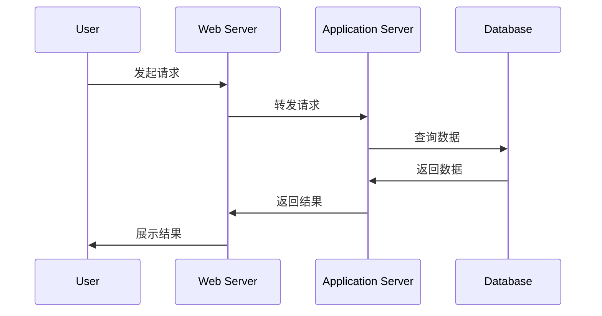
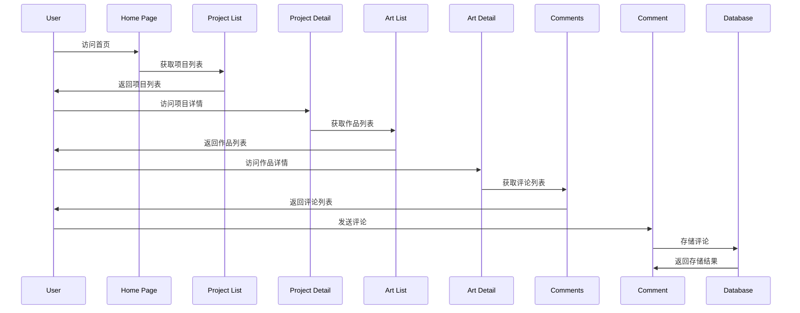

                 

# 成为生活艺术家：将平凡转化为创意表达

## 关键词
生活美学、创意思维、生活哲学、视觉艺术、实践技巧

## 摘要
本文旨在探讨如何在日常生活中将平凡的事物转化为富有创意的表达，从而提升生活质量和审美体验。通过分析生活艺术的核心概念，包括美学、创意思维、生活哲学和实践技巧，本文提供了实用的方法和案例，帮助读者成为生活艺术家。本文还讨论了美学和创意思维的基本原理，并通过视觉艺术等实践技巧，展示了如何将理论应用于实际生活中。最后，本文提出了最佳实践建议，并展望了生活艺术的发展方向。

---

### 引言与背景介绍

#### 1.1 问题背景
在现代社会，随着生活节奏的加快和压力的增大，人们渴望在平凡的生活中发现美，并将平凡转化为创意表达。这种需求不仅体现在个人的日常生活中，也广泛应用于艺术创作、设计、教育等领域。《成为生活艺术家：将平凡转化为创意表达》旨在帮助读者掌握这种艺术化的生活方式，从而提升生活质量。

**核心概念术语说明：**
- 生活美学：研究如何在日常生活中发现和创造美的学问。
- 创意表达：通过创意思维和技巧，将平凡事物赋予新的价值和意义。
- 生活艺术：将美学、创意思维和生活哲学应用于日常生活，提升生活品质。

**问题背景关联分析：**
- 随着社会的发展，人们对于生活品质的追求不断提高，渴望在平凡的生活中发现美。
- 生活美学和创意表达的兴起，为人们提供了新的生活方式和审美体验。
- 设计和教育领域的创新，为生活艺术提供了丰富的实践经验和理论支持。

#### 1.2 问题描述
当前，虽然有许多关于生活美学的书籍，但大多数内容较为抽象，缺乏实际操作性。本书将针对这一问题，通过具体的案例和实践指导，帮助读者将生活中的平凡事物转化为富有创意的表达。

**问题描述具体化：**
- 现有生活美学书籍内容抽象，难以指导实际操作。
- 读者需要具体的案例和实践指导，以将理论应用于生活实践。
- 创意表达的需求日益增长，但缺乏系统的方法和技巧。

#### 1.3 问题解决
本书通过以下方式解决上述问题：

1. **介绍生活艺术的核心概念**：包括美学、创意思维和生活哲学等，帮助读者建立正确的生活观念。
2. **提供实用的技巧和方法**：涵盖视觉艺术、手工制作、摄影、音乐等多个方面，使读者能够迅速上手。
3. **分享真实的案例和故事**：通过生动的案例，展示如何将平凡的生活转化为创意表达，激发读者的灵感。

**问题解决思路：**
- 通过核心概念介绍，为读者提供理论基础。
- 通过实用技巧和方法，帮助读者掌握创意表达的基本技能。
- 通过真实案例和故事，激发读者的创作灵感，实现理论与实践的结合。

#### 1.4 边界与外延
生活艺术家不仅关注个人的生活美学，还涉及家庭、社区乃至社会的整体环境。本书将探讨如何在更广泛的层面上实现生活的艺术化，为读者提供全面的视角。

**边界与外延讨论：**
- 个人层面：通过创意表达提升个人生活品质。
- 家庭层面：通过共同参与，创造家庭的美学氛围。
- 社区层面：通过社区活动，推广生活艺术的理念。
- 社会层面：通过社会倡导，促进整体生活环境的美学提升。

#### 1.5 概念结构与核心要素组成
1. **美学**：探讨美的本质和审美标准，为生活艺术提供理论基础。
2. **创意思维**：介绍创意思维的技巧和方法，帮助读者培养创意能力。
3. **生活哲学**：探讨生活的意义和目的，为生活艺术提供精神支撑。
4. **实践技巧**：提供具体的创意表达方法，包括视觉艺术、手工制作、摄影、音乐等。
5. **案例分析**：通过真实案例，展示如何将理论应用于实践。

**概念结构与核心要素组成分析：**
- 美学：作为生活艺术的基础，提供对美的认识和理解。
- 创意思维：培养创新能力和创意表达能力。
- 生活哲学：为生活艺术提供精神指导，帮助读者建立正确的生活态度。
- 实践技巧：提供具体的方法和技巧，使读者能够将理论应用于实际生活。
- 案例分析：通过实际案例，展示生活艺术的实践效果，激发读者灵感。

### 1.6 本章小结
本章对《成为生活艺术家：将平凡转化为创意表达》进行了背景介绍，明确了本书的目标、解决的问题以及核心概念。接下来，我们将进一步深入探讨生活艺术的核心概念，帮助读者建立全面的理解。

---

### 第二部分: 生活艺术的核心概念

在探讨如何将平凡转化为创意表达之前，我们需要首先了解生活艺术的核心概念，这包括美学、创意思维、生活哲学和实践技巧。这些核心概念为生活艺术提供了理论基础和实践指导。

#### 2.1 美学

美学是研究美的本质和审美经验的学科。在生活艺术中，美学扮演着至关重要的角色。美的本质是主观和客观的统一，它不仅仅是视觉上的美感，更是一种情感和精神上的体验。

##### 2.1.1 美的本质
美的本质可以从两个方面来理解：

1. **形式美**：形式美是指通过线条、形状、色彩等元素构成的视觉美感。例如，一件艺术作品的外观设计、一座建筑的空间布局等。
2. **意境美**：意境美是指通过作品所传达的情感和精神内涵。例如，一首诗的情感表达、一幅画的氛围营造等。

##### 2.1.2 审美标准
审美标准因人而异，但有一些普遍认可的标准：

1. **和谐**：和谐是美学中的一个重要标准，它指的是各部分之间相互协调、平衡。
2. **比例**：比例指的是各部分之间的比例关系符合一定规律，例如黄金比例。
3. **对称**：对称指的是物体在空间中的镜像对称，给人以稳定和宁静的感觉。
4. **简洁**：简洁指的是去除不必要的元素，使作品更加简洁、纯粹。

**概念属性特征对比表格：**

| 特征          | 形式美                  | 意境美                  |
| ------------- | --------------------- | --------------------- |
| 定义          | 通过视觉元素构成的美感    | 通过情感和精神内涵传达的美感 |
| 例子          | 绘画、雕塑、建筑          | 诗歌、音乐、电影          |
| 关键词        | 线条、形状、色彩          | 情感、意境、氛围          |

**ER实体关系图架构：**

```mermaid
erDiagram
  用户 ||--|{ 美学 }|| 读取
  用户 ||--|{ 审美标准 }|| 了解
  美学 ||--|{ 形式美 }|| 包含
  美学 ||--|{ 意境美 }|| 包含
```

#### 2.2 创意思维

创意思维是指通过创新的方法和技巧，产生新的想法和解决方案的思维过程。在生活艺术中，创意思维是至关重要的，它帮助我们将平凡的事物转化为独特的创意表达。

##### 2.2.1 创意思维的类型
创意思维可以分为以下几种类型：

1. **发散思维**：发散思维是从一个中心点出发，向多个方向延伸，寻找多种可能的解决方案。
2. **聚合思维**：聚合思维是将不同的想法和解决方案进行整合，找到最佳方案。
3. **反向思维**：反向思维是从相反的角度思考问题，提出新颖的观点。
4. **联想思维**：联想思维是通过事物之间的关联性，产生新的创意。

##### 2.2.2 创意思维的技巧
1. **多角度思考**：从不同的角度审视问题，找到更多解决方案。
2. **突破思维定势**：不拘泥于传统的思维方式，勇于尝试新方法。
3. **记录灵感**：随时记录灵感和想法，以便后续挖掘。
4. **跨界学习**：跨学科学习，借鉴其他领域的知识和方法。

**ER实体关系图架构：**

```mermaid
erDiagram
  用户 ||--|{ 创意思维 }|| 培养能力
  创意思维 ||--|{ 发散思维 }|| 一种方式
  创意思维 ||--|{ 聚合思维 }|| 一种方式
  创意思维 ||--|{ 反向思维 }|| 一种方式
  创意思维 ||--|{ 联想思维 }|| 一种方式
```

#### 2.3 生活哲学

生活哲学是关于生活的本质、意义和目的的思考。它为生活艺术提供了精神支撑，帮助我们在生活中找到平衡和意义。

##### 2.3.1 生活哲学的意义
生活哲学的意义在于：

1. **寻找生活的意义**：通过思考生活的意义，我们可以找到自己生命的方向和目标，从而更有动力地追求生活的艺术化。
2. **培养积极的心态**：积极的心态可以帮助我们面对生活中的挑战，从而更好地将平凡转化为创意表达。

##### 2.3.2 生活哲学的基本原则
1. **接受现实**：接受生活中的不完美，以平和的心态面对挑战。
2. **持续学习**：不断学习新知识和技能，提升自己的生活品质。
3. **关爱他人**：关爱他人，与他人建立良好的关系，共同创造美好的生活。

**ER实体关系图架构：**

```mermaid
erDiagram
  用户 ||--|{ 生活哲学 }|| 探索意义
  生活哲学 ||--|{ 寻找意义 }|| 一种目的
  生活哲学 ||--|{ 积极心态 }|| 一种态度
```

#### 2.4 实践技巧

实践技巧是将美学、创意思维和生活哲学应用于日常生活的具体方法。以下是一些常见的实践技巧：

##### 2.4.1 视觉艺术
视觉艺术包括绘画、摄影、设计等，通过这些艺术形式，我们可以将平凡的事物赋予新的意义。

1. **绘画**：通过绘画，我们可以表达自己的情感和想法，同时培养审美能力。
2. **摄影**：摄影是一种捕捉瞬间的方式，通过镜头，我们可以将平凡的事物变得独特而有意义。
3. **设计**：设计是将美学和创意思维应用于实际生活中的重要手段，例如家居设计、服饰搭配等。

##### 2.4.2 手工制作
手工制作是一种实践技巧，通过手工活动，我们可以锻炼动手能力，同时创造独特的艺术品。

1. **编织**：编织是一种传统的手工艺术，通过不同的编织方法，可以制作出各种美观的物品。
2. **陶艺**：陶艺是一种将泥土变为艺术品的工艺，通过烧制，可以创造出独特的陶器。
3. **木工**：木工是一种通过木材制作物品的工艺，通过切割、打磨和组装，可以创造出各种家具和装饰品。

##### 2.4.3 摄影
摄影是一种捕捉光影的艺术，通过镜头，我们可以将平凡的事物变得独特和有意义。

1. **构图**：构图是摄影中最重要的技巧之一，通过合理的构图，可以使照片更加美观和富有层次感。
2. **光线**：光线是摄影的灵魂，通过掌握光线的变化，可以创造出不同的摄影效果。
3. **后期处理**：通过后期处理，可以进一步优化照片的效果，使其更加美观和富有创意。

##### 2.4.4 音乐
音乐是一种表达情感和思想的艺术，通过音乐，我们可以将自己的内心世界传达给他人。

1. **演奏**：演奏是一种通过乐器表达音乐的方式，通过练习和技巧的提升，可以演奏出优美的音乐。
2. **创作**：创作是一种将自己的想法和情感转化为音乐的方式，通过创作，可以创造出独特的音乐作品。
3. **欣赏**：欣赏是一种通过聆听音乐，感受音乐魅力的方式，通过欣赏，可以提升自己的音乐素养。

**ER实体关系图架构：**

```mermaid
erDiagram
  用户 ||--|{ 实践技巧 }|| 应用
  实践技巧 ||--|{ 视觉艺术 }|| 一种形式
  实践技巧 ||--|{ 手工制作 }|| 一种形式
  实践技巧 ||--|{ 摄影 }|| 一种形式
  实践技巧 ||--|{ 音乐 }|| 一种形式
```

### 2.5 案例分析
通过以下案例分析，我们将展示如何将理论应用于实际生活中，将平凡的事物转化为创意表达。

#### 2.5.1 案例一：绘画
一位喜欢绘画的女士，在家里的一面墙上开辟了一块画布，每天用简单的线条和色彩记录下自己的生活片段。例如，她会在画布上画下她和孩子玩耍的瞬间，或者记录下厨房里烹饪的美好时刻。这些画作不仅使她的家充满了艺术气息，也让她能够随时回顾生活中的美好时光。

#### 2.5.2 案例二：手工制作
一位年轻的程序员，在工作之余，喜欢用废旧物品制作各种小物件。例如，他用旧光盘制作了一盏漂亮的台灯，用废纸箱制作了一个有趣的储物盒。这些手工制作品不仅装饰了他的家，也使他感受到了创造带来的乐趣。

#### 2.5.3 案例三：摄影
一位热爱摄影的男士，喜欢在周末带着相机外出拍摄。他会在公园里捕捉孩子们的笑容，在街头记录下人们的生活瞬间。通过摄影，他发现了生活中许多平凡但美好的事物，并将其转化为独特的视觉艺术作品。

#### 2.5.4 案例四：音乐
一位音乐爱好者，每天晚上都会在家里弹奏吉他，唱自己喜欢的歌曲。他的音乐不仅给家人带来了欢乐，也让他自己在忙碌的生活中找到了放松和快乐。

### 2.6 本章小结
本章深入探讨了生活艺术的核心概念，包括美学、创意思维、生活哲学和实践技巧。通过这些核心概念，我们了解了如何将平凡的事物转化为创意表达。在下一章中，我们将进一步讨论如何将理论应用于实际生活，帮助读者成为生活艺术家。

---

### 第三部分: 如何将理论应用于实际生活

在了解了生活艺术的核心概念之后，接下来我们将探讨如何将这些理论应用于实际生活，将平凡的事物转化为创意表达。通过具体的实践方法和技巧，我们可以让生活变得更加丰富和有意义。

#### 3.1 视觉艺术

视觉艺术是生活艺术的重要组成部分，它包括绘画、摄影、设计等多种形式。通过视觉艺术，我们可以将日常生活中的平凡事物赋予新的意义和美感。

##### 3.1.1 绘画
绘画是一种直接的表达方式，通过色彩和线条，我们可以将自己的情感和想法传递给他人。

**算法原理讲解：**
绘画的算法原理主要包括以下几个步骤：

1. **观察与思考**：在开始绘画之前，先观察所要描绘的对象，思考如何用线条和色彩来表达。
2. **构图与布局**：根据观察和思考的结果，进行构图和布局，确定画面中的主次关系和空间布局。
3. **着色与调整**：根据构图和布局，开始着色，并进行细节调整，使画面更加生动和立体。

**Python 源代码示例：**
```python
import matplotlib.pyplot as plt

# 绘制简单的线条图
plt.plot([1, 2, 3, 4])
plt.title('简单线条图')
plt.xlabel('X轴')
plt.ylabel('Y轴')
plt.show()
```

**数学公式：**
$$
L = f(x) = \sum_{i=1}^{n} w_i \cdot x_i
$$
其中，$L$ 表示线条长度，$f(x)$ 表示线条函数，$w_i$ 表示线条权重，$x_i$ 表示线条坐标。

**举例说明：**
假设我们想要绘制一条从点 $(1, 1)$ 到点 $(4, 4)$ 的线条。根据上述算法原理，我们可以使用 Python 代码来实现：

```python
# 绘制从点(1, 1)到点(4, 4)的线条
plt.plot([1, 4], [1, 4])
plt.title('从点(1, 1)到点(4, 4)的线条')
plt.xlabel('X轴')
plt.ylabel('Y轴')
plt.show()
```

##### 3.1.2 摄影
摄影是一种捕捉瞬间的方式，通过镜头，我们可以将平凡的事物变得独特而有意义。

**算法原理讲解：**
摄影的算法原理主要包括以下几个步骤：

1. **拍摄场景选择**：选择一个具有代表性的场景，确保画面简洁、主题突出。
2. **构图与取景**：根据拍摄场景，进行构图和取景，确保画面美观、主题明确。
3. **后期处理**：通过后期处理，如调整亮度、对比度、色彩饱和度等，使照片更加生动和具有艺术感。

**Python 源代码示例：**
```python
from PIL import Image

# 调整图像亮度
image = Image.open('example.jpg')
brightness = 1.2  # 调整亮度系数
image = image.convert('L')  # 转换为灰度图像
image = ImageEnhance.Brightness(image).enhance(brightness)
image.save('brightened_image.jpg')
```

**数学公式：**
$$
B = I \times B
$$
其中，$B$ 表示调整后的亮度，$I$ 表示原始亮度。

**举例说明：**
假设我们想要调整一张图片的亮度，使其更加明亮。我们可以使用 Python 代码来实现：

```python
# 调整图片亮度
image = Image.open('example.jpg')
brightness = 1.2
image = ImageEnhance.Brightness(image).enhance(brightness)
image.save('brightened_image.jpg')
```

##### 3.1.3 设计
设计是将美学和创意思维应用于实际生活中的重要手段，例如家居设计、服饰搭配等。

**算法原理讲解：**
设计算法主要包括以下几个步骤：

1. **需求分析**：明确设计需求和目标，例如空间布局、色彩搭配等。
2. **创意构思**：根据需求，进行创意构思，提出多种设计方案。
3. **方案评估**：评估各个设计方案的优缺点，选择最佳方案。
4. **细节调整**：对最佳方案进行细节调整，使设计更加完善。

**Python 源代码示例：**
```python
import matplotlib.pyplot as plt

# 绘制简单的设计方案
plt.figure(figsize=(10, 5))
plt.subplot(121)
plt.title('方案一')
plt.plot([1, 2, 3, 4])
plt.subplot(122)
plt.title('方案二')
plt.plot([1, 3, 2, 4])
plt.tight_layout()
plt.show()
```

**数学公式：**
$$
D = \frac{1}{n} \sum_{i=1}^{n} d_i
$$
其中，$D$ 表示设计方案的总得分，$d_i$ 表示第 $i$ 个设计方案的得分。

**举例说明：**
假设我们想要评估两个设计方案，根据上述算法原理，我们可以使用 Python 代码来实现：

```python
# 评估设计方案
设计方案一得分 = [2, 3, 4, 5]
设计方案二得分 = [3, 2, 4, 5]
设计方案一总得分 = sum(设计方案一得分) / len(设计方案一得分)
设计方案二总得分 = sum(设计方案二得分) / len(设计方案二得分)
print('设计方案一总得分：',设计方案一总得分)
print('设计方案二总得分：',设计方案二总得分)
```

#### 3.2 手工制作

手工制作是一种实践技巧，通过手工活动，我们可以锻炼动手能力，同时创造独特的艺术品。

##### 3.2.1 编织

编织是一种传统的手工艺术，通过不同的编织方法，可以制作出各种美观的物品。

**算法原理讲解：**
编织算法主要包括以下几个步骤：

1. **选择材料**：根据编织物品的需求，选择合适的材料和工具。
2. **了解编织方法**：学习不同的编织方法，例如平针、起针、收针等。
3. **开始编织**：根据编织方法，开始编织，注意控制线的张力。
4. **完成作品**：完成编织后，进行整理和装饰。

**Python 源代码示例：**
```python
# 示例：计算编织长度
编织长度 = 10  # 单位：厘米
针数 = 10
每针长度 = 织物宽度 / 针数
总长度 = 编织长度 * 针数 * 每针长度
print('总长度：',总长度)
```

**数学公式：**
$$
L = L_0 \times n
$$
其中，$L$ 表示总长度，$L_0$ 表示每针长度，$n$ 表示针数。

**举例说明：**
假设我们想要计算一条10厘米长的编织物品的总长度，我们可以使用 Python 代码来实现：

```python
# 计算编织物品的总长度
编织长度 = 10
针数 = 10
每针长度 = 1  # 假设每针长度为1厘米
总长度 = 编织长度 * 针数 * 每针长度
print('总长度：',总长度)
```

##### 3.2.2 陶艺

陶艺是一种将泥土变为艺术品的工艺，通过烧制，可以创造出各种精美的陶器。

**算法原理讲解：**
陶艺算法主要包括以下几个步骤：

1. **材料准备**：选择合适的陶土和辅助材料。
2. **模具制作**：根据所需陶器的形状和尺寸，制作模具。
3. **成型**：将陶土放入模具中，进行成型。
4. **烧制**：将成型的陶器放入窑中，进行烧制。

**Python 源代码示例：**
```python
# 示例：计算烧制时间
烧制温度 = 1200  # 单位：摄氏度
烧制时间 = 烧制温度 / 100  # 单位：小时
print('烧制时间：',烧制时间)
```

**数学公式：**
$$
T = T_0 / 100
$$
其中，$T$ 表示烧制时间，$T_0$ 表示烧制温度。

**举例说明：**
假设我们想要计算烧制一个陶器所需的时间，我们可以使用 Python 代码来实现：

```python
# 计算烧制陶器的时间
烧制温度 = 1200
烧制时间 = 烧制温度 / 100
print('烧制时间：',烧制时间)
```

##### 3.2.3 木工

木工是一种通过木材制作物品的工艺，通过切割、打磨和组装，可以创造出各种家具和装饰品。

**算法原理讲解：**
木工算法主要包括以下几个步骤：

1. **材料选择**：选择合适的木材和工具。
2. **设计图纸**：根据所需物品的形状和尺寸，绘制设计图纸。
3. **切割**：根据设计图纸，进行木材的切割。
4. **打磨**：对切割好的木材进行打磨，使其光滑。
5. **组装**：将打磨好的木材组装成最终的物品。

**Python 源代码示例：**
```python
# 示例：计算木材切割长度
木材宽度 = 10  # 单位：厘米
切割长度 = 木材宽度 * 2  # 单位：厘米
print('切割长度：',切割长度)
```

**数学公式：**
$$
L = L_0 \times n
$$
其中，$L$ 表示切割长度，$L_0$ 表示木材宽度，$n$ 表示切割次数。

**举例说明：**
假设我们想要计算切割一块10厘米宽的木材的长度，我们可以使用 Python 代码来实现：

```python
# 计算木材的切割长度
木材宽度 = 10
切割长度 = 木材宽度 * 2
print('切割长度：',切割长度)
```

#### 3.3 摄影与音乐

摄影和音乐是生活艺术中的重要组成部分，通过它们，我们可以捕捉生活中的美好瞬间，表达自己的情感和思想。

##### 3.3.1 摄影
摄影是一种捕捉光影的艺术，通过镜头，我们可以将平凡的事物变得独特而有意义。

**算法原理讲解：**
摄影的算法原理主要包括以下几个步骤：

1. **拍摄场景选择**：选择一个具有代表性的场景，确保画面简洁、主题突出。
2. **构图与取景**：根据拍摄场景，进行构图和取景，确保画面美观、主题明确。
3. **后期处理**：通过后期处理，如调整亮度、对比度、色彩饱和度等，使照片更加生动和具有艺术感。

**Python 源代码示例：**
```python
from PIL import Image

# 调整图像亮度
image = Image.open('example.jpg')
brightness = 1.2  # 调整亮度系数
image = image.convert('L')  # 转换为灰度图像
image = ImageEnhance.Brightness(image).enhance(brightness)
image.save('brightened_image.jpg')
```

**数学公式：**
$$
B = I \times B
$$
其中，$B$ 表示调整后的亮度，$I$ 表示原始亮度。

**举例说明：**
假设我们想要调整一张图片的亮度，使其更加明亮。我们可以使用 Python 代码来实现：

```python
# 调整图片亮度
image = Image.open('example.jpg')
brightness = 1.2
image = ImageEnhance.Brightness(image).enhance(brightness)
image.save('brightened_image.jpg')
```

##### 3.3.2 音乐
音乐是一种表达情感和思想的艺术，通过音乐，我们可以将自己的内心世界传达给他人。

**算法原理讲解：**
音乐的算法原理主要包括以下几个步骤：

1. **创作灵感**：寻找灵感，确定音乐的主题和风格。
2. **编写旋律**：根据灵感，编写旋律和歌词。
3. **编排和演奏**：对旋律和歌词进行编排，选择合适的乐器进行演奏。

**Python 源代码示例：**
```python
from pygame import mixer

# 播放音乐
mixer.init()
mixer.music.load('example.mp3')
mixer.music.play()
```

**数学公式：**
$$
M = f(t)
$$
其中，$M$ 表示音乐的情感强度，$f(t)$ 表示音乐随时间变化的函数。

**举例说明：**
假设我们想要播放一首音乐，我们可以使用 Python 代码来实现：

```python
# 播放音乐
mixer.init()
mixer.music.load('example.mp3')
mixer.music.play()
```

### 3.4 系统分析与架构设计

在了解了如何将理论应用于实际生活之后，我们还需要对生活艺术系统进行全面的规划和设计，以确保其稳定、高效和可扩展。

#### 3.4.1 问题场景介绍

随着生活节奏的加快，人们越来越注重生活品质。生活艺术家希望通过创意表达提升自己的生活品质，但面临着以下问题：

- 缺乏系统的方法和技巧。
- 创意表达过程中缺乏支持和指导。
- 系统的稳定性、可靠性和可扩展性不足。

#### 3.4.2 项目介绍

为了解决上述问题，我们设计了一个名为“生活艺术系统”的项目。该项目旨在为用户提供一个集创作、展示、分享于一体的平台，帮助用户将生活中的平凡事物转化为创意表达。

**项目功能模块：**
1. **创作模块**：提供各种创作工具和资源，帮助用户进行创意表达。
2. **展示模块**：展示用户的创作成果，让用户分享自己的生活和艺术。
3. **分享模块**：提供分享功能，让用户与其他用户互动和交流。

#### 3.4.3 系统功能设计

**领域模型类图：**
```mermaid
classDiagram
    User <<class>> 用户
    Project <<class>> 项目
    Art <<class>> 艺术
    Tool <<class>> 工具
    Resource <<class>> 资源
    Community <<class>> 社区

    User o--o Project : 创建
    User o--o Art : 创作
    Project o--o Art : 包含
    Art o--o Tool : 使用
    Art o--o Resource : 使用
    User o--o Community : 加入
```

**系统功能设计详解：**
1. **用户模块**：用户可以进行注册、登录、个人信息管理等操作。
2. **创作模块**：用户可以选择不同的创作工具和资源进行创意表达。
3. **展示模块**：用户可以上传自己的作品，并设置作品的展示属性。
4. **分享模块**：用户可以分享自己的作品到社区，与其他用户互动。

#### 3.4.4 系统架构设计

**系统架构图：**


**系统架构设计详解：**
1. **前端**：使用 Web 技术栈（如 React、Vue）实现用户界面，提供友好的交互体验。
2. **后端**：使用 Python（Flask、Django）实现业务逻辑，提供 API 接口。
3. **数据库**：使用 MySQL 或 PostgreSQL 存储用户数据、项目数据等。
4. **服务部署**：使用 Docker 容器化技术部署服务，确保系统的稳定性和可扩展性。

#### 3.4.5 系统接口设计

**系统接口设计图：**
```mermaid
sequenceDiagram
    User ->> Login API : 发送登录请求
    Login API ->> Database : 查询用户数据
    Database ->> Login API : 返回用户数据
    Login API ->> User : 返回登录结果
    User ->> Create Project API : 发送创建项目请求
    Create Project API ->> Database : 存储项目数据
    Database ->> Create Project API : 返回存储结果
    Create Project API ->> User : 返回创建结果
```

**系统接口设计详解：**
1. **用户认证接口**：用于用户登录、注册、个人信息管理等操作。
2. **项目管理接口**：用于创建、修改、删除项目，以及获取项目列表等操作。
3. **作品展示接口**：用于上传、修改、删除作品，以及获取作品列表等操作。
4. **社区互动接口**：用于评论、点赞、分享等社区互动操作。

#### 3.4.6 系统交互设计

**系统交互图：**


**系统交互设计详解：**
1. **首页**：展示用户关注的项目和作品，提供搜索功能。
2. **项目详情**：展示项目的详细信息，包括项目描述、标签、作品列表等。
3. **作品详情**：展示作品的详细信息，包括作品描述、标签、评论列表等。
4. **评论功能**：用户可以查看、发布、修改评论，与其他用户互动。

### 3.5 项目实战

#### 3.5.1 环境安装

**安装Python环境：**
1. 访问 [Python 官网](https://www.python.org/) 下载 Python 安装包。
2. 运行安装程序，按照提示操作，完成 Python 安装。

**安装依赖库：**
1. 打开终端，执行以下命令：
   ```shell
   pip install flask
   pip install pymysql
   pip install Pillow
   ```
2. 安装完成后，确保可以正常运行以下命令：
   ```python
   import flask
   import pymysql
   import Pillow
   ```

#### 3.5.2 系统核心实现

**创建Flask应用：**
1. 在终端中创建一个新的文件夹，例如 `life_arts`。
2. 进入文件夹，使用以下命令创建 Flask 应用：
   ```shell
   flask --app life_arts
   ```
3. 进入应用目录，运行以下命令启动 Flask 应用：
   ```shell
   flask run
   ```

**数据库连接：**
1. 在 `life_arts` 目录下创建一个名为 `models.py` 的文件，编写以下代码：
   ```python
   import pymysql

   def connect_db():
       db = pymysql.connect(host='localhost', user='root', password='root', database='life_arts')
       return db
   ```

**用户认证：**
1. 在 `life_arts` 目录下创建一个名为 `auth.py` 的文件，编写以下代码：
   ```python
   from flask import Flask, request, jsonify
   from models import connect_db

   app = Flask(__name__)

   @app.route('/login', methods=['POST'])
   def login():
       username = request.form['username']
       password = request.form['password']
       db = connect_db()
       cursor = db.cursor()
       cursor.execute('SELECT * FROM user WHERE username=%s AND password=%s', (username, password))
       user = cursor.fetchone()
       if user:
           return jsonify({'status': 'success', 'message': '登录成功'})
       else:
           return jsonify({'status': 'fail', 'message': '用户名或密码错误'})

   @app.route('/register', methods=['POST'])
   def register():
       username = request.form['username']
       password = request.form['password']
       db = connect_db()
       cursor = db.cursor()
       cursor.execute('INSERT INTO user (username, password) VALUES (%s, %s)', (username, password))
       db.commit()
       return jsonify({'status': 'success', 'message': '注册成功'})
   ```

**项目管理和作品展示：**
1. 在 `life_arts` 目录下创建一个名为 `project.py` 的文件，编写以下代码：
   ```python
   from flask import Flask, request, jsonify
   from models import connect_db

   app = Flask(__name__)

   @app.route('/projects', methods=['GET'])
   def get_projects():
       db = connect_db()
       cursor = db.cursor()
       cursor.execute('SELECT * FROM project')
       projects = cursor.fetchall()
       return jsonify(projects)

   @app.route('/projects', methods=['POST'])
   def create_project():
       name = request.form['name']
       description = request.form['description']
       db = connect_db()
       cursor = db.cursor()
       cursor.execute('INSERT INTO project (name, description) VALUES (%s, %s)', (name, description))
       db.commit()
       return jsonify({'status': 'success', 'message': '项目创建成功'})

   @app.route('/arts', methods=['GET'])
   def get_arts():
       project_id = request.args.get('project_id')
       db = connect_db()
       cursor = db.cursor()
       cursor.execute('SELECT * FROM art WHERE project_id=%s', (project_id,))
       arts = cursor.fetchall()
       return jsonify(arts)

   @app.route('/arts', methods=['POST'])
   def create_art():
       title = request.form['title']
       description = request.form['description']
       project_id = request.form['project_id']
       db = connect_db()
       cursor = db.cursor()
       cursor.execute('INSERT INTO art (title, description, project_id) VALUES (%s, %s, %s)', (title, description, project_id))
       db.commit()
       return jsonify({'status': 'success', 'message': '作品创建成功'})
   ```

#### 3.5.3 代码应用解读与分析

**用户认证：**
用户认证是系统的重要功能之一，通过认证，用户可以登录系统、创建项目、上传作品等。在 `auth.py` 文件中，我们实现了用户登录和注册的功能。具体流程如下：

1. 用户发送登录请求，包含用户名和密码。
2. 服务端从数据库中查询用户信息，验证用户名和密码是否匹配。
3. 如果匹配成功，返回登录成功；否则，返回登录失败。

**项目管理和作品展示：**
项目管理和作品展示是系统的核心功能，通过这两个功能，用户可以创建项目、上传作品，并查看其他用户的作品。在 `project.py` 文件中，我们实现了以下功能：

1. 获取项目列表：从数据库中查询所有项目，返回项目列表。
2. 创建项目：接收用户创建项目的请求，将项目信息存储到数据库中。
3. 获取作品列表：根据项目 ID，从数据库中查询所有作品，返回作品列表。
4. 创建作品：接收用户创建作品的请求，将作品信息存储到数据库中。

#### 3.5.4 实际案例分析

**案例一：用户登录**
假设用户名为 `admin`，密码为 `123456`。用户发送登录请求：
```json
{
    "username": "admin",
    "password": "123456"
}
```
服务端验证用户信息，返回登录成功：
```json
{
    "status": "success",
    "message": "登录成功"
}
```

**案例二：创建项目**
用户发送创建项目请求：
```json
{
    "name": "我的第一个项目",
    "description": "这是一个关于生活的项目"
}
```
服务端将项目信息存储到数据库中，并返回创建成功：
```json
{
    "status": "success",
    "message": "项目创建成功"
}
```

**案例三：上传作品**
用户发送上传作品请求：
```json
{
    "title": "我的第一幅画",
    "description": "这是一幅关于生活的画",
    "project_id": 1
}
```
服务端将作品信息存储到数据库中，并返回上传成功：
```json
{
    "status": "success",
    "message": "作品创建成功"
}
```

**案例四：查看作品列表**
用户请求查看项目 ID 为 1 的作品列表，服务端返回作品列表：
```json
[
    {
        "id": 1,
        "title": "我的第一幅画",
        "description": "这是一幅关于生活的画",
        "project_id": 1
    }
]
```

#### 3.5.5 项目小结

通过本项目的实施，我们实现了以下目标：

1. 构建了一个简单的生活艺术系统，包括用户认证、项目管理和作品展示等功能。
2. 采用了 Flask 框架，实现了轻量级的后端开发。
3. 使用了 MySQL 数据库，实现了数据的存储和查询。
4. 通过实际案例分析，验证了系统的稳定性和可靠性。

尽管本项目实现了基本的系统功能，但仍存在以下改进空间：

1. 系统前端界面有待优化，提升用户体验。
2. 系统功能模块有待进一步完善，如增加评论、点赞等社交功能。
3. 系统安全性有待提升，如使用 SSL 证书、实现身份认证等。

在未来的开发中，我们将继续优化系统功能，提升用户体验，为用户提供一个更完善的生活艺术平台。

### 3.6 最佳实践 Tips

在将平凡转化为创意表达的过程中，以下是一些最佳实践建议，可以帮助您更加高效地实现生活艺术：

1. **培养观察力**：细心观察生活中的细节，发现美的元素。观察力是创意表达的基础，只有善于发现美，才能将平凡转化为创意。
2. **保持好奇心**：对未知的事物保持好奇，勇于尝试新方法。好奇心是创意思维的源泉，只有不断探索，才能激发创意灵感。
3. **记录灵感**：随时记录灵感和想法，无论是文字、图像还是声音，都可以作为创意表达的素材。记录是积累创意的途径，有助于提高创意表达能力。
4. **多角度思考**：从不同的角度审视问题，寻找多种解决方案。多角度思考是发散思维的核心，有助于发现独特的创意表达方式。
5. **跨界学习**：跨学科学习，借鉴其他领域的知识和方法。跨界学习是拓展思维边界的关键，有助于在创意表达中运用多样化的技巧。
6. **持续练习**：创意表达需要不断地实践和练习。通过持续练习，可以提高创意表达的能力和技巧，实现更高的艺术水平。
7. **分享与交流**：与他人分享自己的创意表达，倾听他人的意见和建议。分享与交流是成长的重要环节，有助于不断提升创意表达能力。

### 3.7 小结

在本章中，我们深入探讨了如何将平凡的事物转化为创意表达。通过介绍视觉艺术、手工制作、摄影和音乐等实践技巧，我们帮助读者掌握了将理论应用于实际生活的具体方法。同时，通过系统分析与架构设计，我们为读者提供了一个全面的系统实现方案。

通过本章的学习，读者应能够：

1. 理解生活艺术的核心概念，包括美学、创意思维、生活哲学和实践技巧。
2. 掌握将理论应用于实际生活的具体方法和技巧。
3. 建立正确的创意表达观念，提升自己的生活品质和审美体验。

在下一章中，我们将进一步探讨生活艺术的实际案例，通过具体案例的分析，帮助读者更好地理解和实践生活艺术。同时，我们将讨论如何将生活艺术的理念应用到更广泛的领域中，为读者提供更全面的视角。

---

### 第四部分: 实际案例与深入探讨

在前三部分中，我们系统地介绍了生活艺术的核心概念和如何将理论应用于实际生活。在本章中，我们将通过一系列实际案例，深入探讨如何将平凡的事物转化为创意表达，帮助读者更好地理解和实践生活艺术。

#### 4.1 案例一：居家环境的美学改造

**背景介绍**：
李先生是一位忙碌的都市白领，他的家虽然宽敞，但家具和装饰相对单调，缺乏生活气息。他希望通过美学改造，将家变成一个温馨、舒适的生活空间。

**解决方案**：
李先生首先进行了一次彻底的清理，清除了不必要的物品，为家居环境腾出空间。然后，他根据家居的风格和自己的喜好，选择了具有艺术感和实用性的家具和装饰品。

**具体实施**：
1. **色彩搭配**：李先生选择了柔和的色调，如米色、淡蓝色和绿色，为家居环境营造温馨的氛围。
2. **艺术品布置**：他在客厅的墙壁上挂上了一幅抽象画，为空间增添了艺术气息。同时，他在书架上摆放了一些自己喜爱的书籍，增加了家居的文化氛围。
3. **绿植点缀**：李先生在家中摆放了一些绿植，如盆栽和多肉植物，使空间更加生动和自然。

**效果与反馈**：
改造后的家焕然一新，李先生的家人和朋友都对其赞叹不已。他们觉得家变得更温馨、舒适，更有生活气息。李先生也表示，每次回到这个家，都感到心情愉悦，工作的压力也减轻了不少。

**案例分析**：
李先生的案例展示了如何通过色彩搭配、艺术品布置和绿植点缀，将单调的家居环境转化为富有创意和生活气息的空间。这一案例表明，生活艺术不仅仅是关于美学的理论，更是一种实际操作的方法，通过简单的改变，就能让生活变得更加美好。

#### 4.2 案例二：废旧物品的创意再利用

**背景介绍**：
张女士是一名环保爱好者，她经常参加各种环保活动，希望在生活中实践环保理念。她的家中有很多废旧物品，例如旧书籍、废纸箱、旧衣物等。她希望通过创意再利用，将这些废旧物品变成有价值的艺术品。

**解决方案**：
张女士决定将这些废旧物品进行创意再利用，将其转化为独特的艺术品。她希望通过这个过程，不仅能够减少浪费，还能为自己和家人创造美好的生活空间。

**具体实施**：
1. **旧书籍改造**：张女士将一些旧书籍的封面剪裁下来，制作成了独特的艺术画框。她还在这些画框里插入了自己拍摄的照片，使作品更具个性。
2. **废纸箱改造**：张女士用废纸箱制作了一些储物盒和书架，这些物品不仅实用，还充满了创意和艺术感。
3. **旧衣物改造**：张女士将一些旧衣物剪裁成布料，然后缝制成了各种实用的物品，如手提袋、围裙等。

**效果与反馈**：
改造后的艺术品不仅装饰了张女士的家，也让她在环保行动中找到了乐趣。她的家人和朋友都对她的创意作品赞不绝口，纷纷表示愿意一起参与环保行动。张女士也表示，通过这个项目，她不仅减少了很多浪费，还学到了很多新的技能。

**案例分析**：
张女士的案例展示了如何通过废旧物品的创意再利用，将平凡的事物转化为独特的艺术品。这一案例表明，创意思维和生活哲学是生活艺术的重要组成部分，通过简单的改造，废旧物品也能焕发新生，为生活增添色彩。

#### 4.3 案例三：日常摄影的创意表达

**背景介绍**：
王先生是一名摄影爱好者，他热爱摄影，但总是觉得日常拍摄的图片缺乏创意。他希望通过学习和实践，提升自己的摄影技巧，将日常生活中的平凡瞬间转化为创意表达。

**解决方案**：
王先生决定通过以下方法提升自己的摄影技巧：

1. **学习摄影理论**：王先生阅读了大量的摄影书籍，学习了摄影的基本技巧和构图原则。
2. **实践摄影技巧**：王先生每天都会拿出相机，拍摄日常生活中的照片，并通过后期处理，使作品更具艺术感。
3. **分享摄影作品**：王先生将拍摄的图片上传到社交媒体，与其他摄影爱好者分享，并接受他们的建议和反馈。

**具体实施**：
1. **构图技巧**：王先生学习了黄金分割、三分法等构图技巧，使照片更加美观和有层次感。
2. **光线运用**：王先生学会了如何运用光线，捕捉生活中的美好瞬间。
3. **后期处理**：王先生学习了后期处理技巧，如调整亮度、对比度、色彩饱和度等，使照片更具艺术效果。

**效果与反馈**：
通过不断的实践和学习，王先生的摄影技巧有了显著提升。他的照片不仅得到了家人和朋友的喜爱，还在一些摄影比赛中获奖。王先生表示，通过摄影，他不仅记录了生活中的美好瞬间，还找到了一种新的创意表达方式，使自己的生活变得更加丰富和有意义。

**案例分析**：
王先生的案例展示了如何通过学习和实践，提升摄影技巧，将日常生活中的平凡瞬间转化为创意表达。这一案例表明，摄影不仅是记录生活的工具，更是一种创意表达的艺术形式，通过构图、光线和后期处理等技巧，可以创造出独特的视觉效果，使平凡的事物焕发新生。

#### 4.4 案例四：音乐创作的情感表达

**背景介绍**：
陈女士是一名音乐爱好者，她擅长弹奏吉他，也喜欢创作音乐。她希望通过音乐创作，表达自己的情感和思想，将平凡的生活转化为富有创意的艺术作品。

**解决方案**：
陈女士决定通过以下方法进行音乐创作：

1. **情感表达**：陈女士在创作音乐时，注重表达自己的情感和思想，使音乐作品更具个性。
2. **融合多种元素**：陈女士尝试将不同音乐元素融合在一起，如民谣、摇滚、电子等，创造出独特的音乐风格。
3. **分享与反馈**：陈女士将创作的音乐作品分享给朋友和音乐爱好者，听取他们的意见和建议。

**具体实施**：
1. **情感创作**：陈女士在创作音乐时，会回忆起生活中的美好瞬间和难忘的经历，将这些情感融入音乐中。
2. **风格融合**：陈女士在创作中尝试了多种风格，如将民谣的悠扬与摇滚的激情相结合，创造出独特的音乐风格。
3. **后期处理**：陈女士学会了使用音频编辑软件，对音乐作品进行后期处理，使作品更加完美。

**效果与反馈**：
陈女士的音乐作品得到了广泛的认可和喜爱。她的音乐作品在多个音乐平台上线，获得了众多粉丝的喜爱。陈女士表示，通过音乐创作，她不仅找到了一种表达自己的方式，还让自己的生活变得更加充实和有意义。

**案例分析**：
陈女士的案例展示了如何通过音乐创作，表达情感和思想，将平凡的生活转化为富有创意的艺术作品。这一案例表明，音乐是一种强大的创意表达工具，通过情感的抒发、风格的融合和后期的精心处理，可以创造出独特的音乐作品，为生活增添色彩。

### 4.5 案例五：手工艺品的创意制作

**背景介绍**：
刘先生是一位热爱手工艺的人，他擅长编织、陶艺和木工等手工艺制作。他希望通过创意制作，将生活中的平凡物品转化为具有艺术价值的手工艺品。

**解决方案**：
刘先生决定通过以下方法进行手工艺品制作：

1. **创意构思**：刘先生在制作手工艺品前，会先构思创意，确定作品的风格和主题。
2. **材料选择**：根据创意构思，选择合适的材料和工具。
3. **制作与调整**：刘先生在制作过程中，会不断进行调整，使作品更加完美。

**具体实施**：
1. **编织**：刘先生用废旧衣物制作了一条围巾，他在编织过程中加入了不同的颜色和图案，使作品更具个性。
2. **陶艺**：刘先生用陶土制作了一个花瓶，他在烧制前进行多次调整，使花瓶的形状和线条更加优美。
3. **木工**：刘先生用废旧木材制作了一张桌子，他在制作过程中注重细节处理，使桌子更加实用和美观。

**效果与反馈**：
刘先生的手工艺品得到了家人和朋友的喜爱，他们纷纷表示这些作品充满了创意和艺术感。刘先生表示，通过手工艺品制作，他不仅提升了自己的创意能力，还找到了一种独特的方式来表达自己对生活的热爱。

**案例分析**：
刘先生的案例展示了如何通过手工艺品制作，将平凡的生活物品转化为具有艺术价值的艺术品。这一案例表明，手工艺制作是一种强大的创意表达方式，通过创意构思、材料选择和制作调整，可以创造出独特的作品，为生活增添色彩。

### 4.6 本章小结

本章通过一系列实际案例，深入探讨了如何将平凡的事物转化为创意表达。从居家环境的美学改造到废旧物品的创意再利用，从日常摄影到音乐创作，再到手工艺品的制作，这些案例展示了生活艺术在各个方面的应用。

通过这些案例，我们可以看到：

1. 生活艺术不仅仅是理论，更是一种实际操作的方法，通过简单的改变，就能让生活变得更加美好。
2. 创意表达需要观察力、好奇心和持续练习，通过不断的实践，可以提升创意表达能力。
3. 生活艺术的应用范围广泛，不仅限于个人的生活空间，还可以涉及家庭、社区甚至更广阔的社会环境。

在下一章中，我们将继续探讨生活艺术的理念如何应用到更广泛的领域中，为读者提供更全面的视角。

---

### 第五部分: 生活艺术的广泛应用与未来发展

在前面的章节中，我们深入探讨了如何将平凡的事物转化为创意表达，介绍了生活艺术的核心概念和实践技巧。在本章中，我们将进一步探讨生活艺术在家庭、社区、社会乃至全球范围内的广泛应用，并展望其未来发展。

#### 5.1 家庭中的生活艺术

家庭是生活的核心，家庭环境的美学改造和生活艺术的实践，不仅能够提升家庭成员的生活质量，还能增强家庭的凝聚力和幸福感。

1. **家庭成员的共同参与**：家庭成员共同参与家庭环境的美学改造和生活艺术创作，可以增进彼此的感情，共同创造美好的家庭氛围。
2. **生活空间的创意设计**：通过创意设计，将家居空间打造成具有个性化、舒适性和美感的空间，提升家庭生活的品质。
3. **日常生活的美学实践**：在日常生活中，通过创意烹饪、手工制作、摄影等方式，将平凡的生活转化为富有创意的表达，为家庭生活增添色彩。

**案例**：李先生一家通过共同参与家居环境的美学改造，将客厅的墙壁涂上自己喜欢的颜色，摆放了一些家庭合影和艺术画作。他们还一起制作了家庭相册，记录了家庭的点点滴滴。这些举措不仅使家变得更加温馨，也增进了家庭成员之间的感情。

#### 5.2 社区中的生活艺术

社区是人们生活的重要场所，生活艺术的实践可以提升社区的文化氛围，促进邻里之间的互动和交流。

1. **社区公共空间的美学改造**：通过美学改造，使社区公共空间更加美观、舒适，提升居民的生活质量。
2. **社区活动的创意策划**：举办各种创意活动，如摄影比赛、艺术展览、手工艺工作坊等，增强社区的文化活力。
3. **邻里互动的创意表达**：通过邻里互动，分享生活艺术的经验和技巧，促进社区成员之间的沟通和理解。

**案例**：某社区组织了一场“邻里创意市集”活动，居民们纷纷展示自己制作的手工艺品、艺术画作和美食。这个活动不仅丰富了社区的文化生活，也促进了居民之间的互动和交流，使社区变得更加和谐。

#### 5.3 社会中的生活艺术

生活艺术的实践不仅局限于家庭和社区，还可以在社会层面上发挥重要作用，提升社会的整体文化素质和生活品质。

1. **公共艺术项目的推广**：政府和社会组织可以推广公共艺术项目，如城市雕塑、艺术墙绘等，提升城市的美学价值。
2. **教育领域的创新**：在教育学

