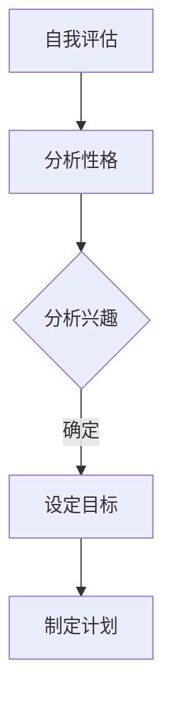
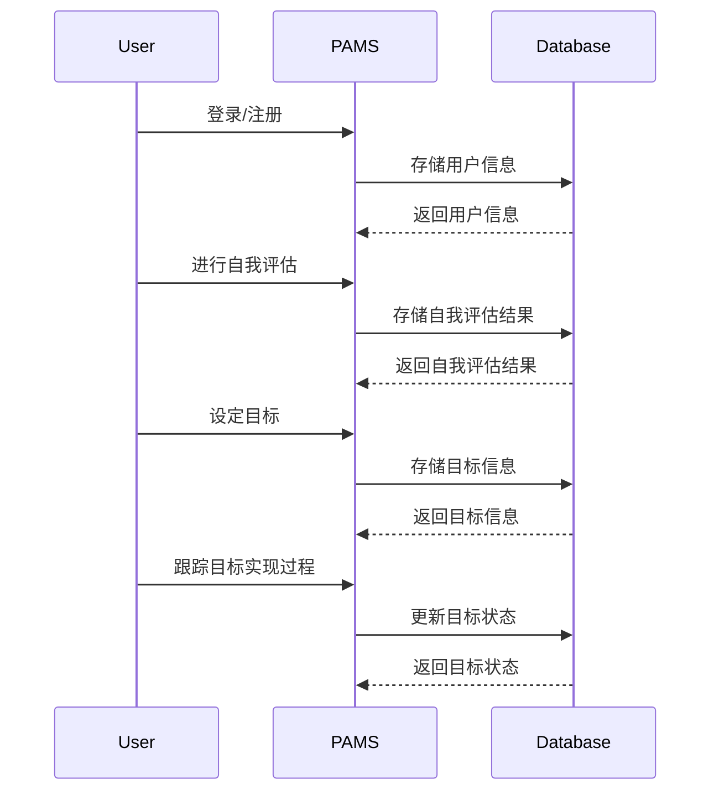
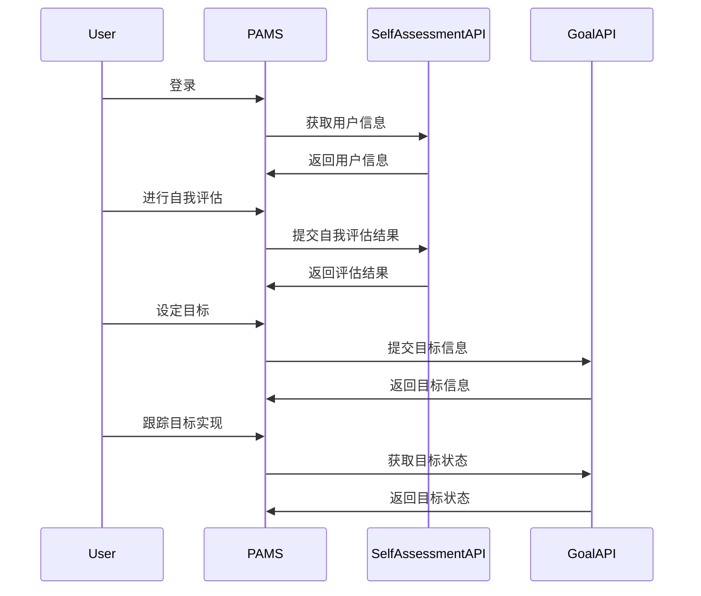

                 

# 打破成功神话：构建个人的成就标准

> 关键词：成功神话，个人成就标准，自我认知，目标设定，挑战应对

> 摘要：本文将深入探讨成功神话的起源、影响及其背后的真相与迷思。通过反思成功神话的现实问题，我们重新定义了成就标准，并探讨了如何通过个人成长、自我认知和目标设定，构建符合自身实际情况的成就标准。同时，文章还提供了应对挑战与挫折的策略，以帮助读者在实现个人成就的过程中不断成长和进步。

## 目录大纲

### 第一部分：成功神话的反思

**第1章：成功神话的起源与影响**

1.1 成功神话的历史起源

1.2 成功神话的深远影响

1.3 反思成功神话的现实问题

**第2章：成功神话的真相与迷思**

2.1 成功背后的真相

2.2 成功神话的迷思剖析

2.3 成功神话的心理学解析

**第3章：成就标准的重构**

3.1 重新定义成就标准

3.2 成就标准的多元性

3.3 重构成就标准的方法与实践

**第4章：个人成长与自我认知**

4.1 个人成长的重要性

4.2 自我认知与自我评估

4.3 提升自我认知的技巧

**第5章：设定合理的目标**

5.1 目标设定的原则

5.2 目标设定的策略

5.3 实现目标的步骤

**第6章：应对挑战与挫折**

6.1 挑战与挫折的应对策略

6.2 挫折中的成长机会

6.3 挫折后的自我重建

**第7章：构建个人成就标准**

7.1 构建个人成就标准的意义

7.2 个人成就标准的制定

7.3 个人成就标准的实践与应用

## 第一部分：成功神话的反思

### 第1章：成功神话的起源与影响

**1.1 成功神话的历史起源**

成功神话的历史可以追溯到古希腊神话中的英雄人物，如阿基里斯、赫拉克勒斯等。这些神话中的英雄通过超凡的力量和智慧，完成了令人惊叹的成就，成为后世人们膜拜的对象。随着历史的发展，成功神话逐渐渗透到各个领域，从政治、军事到商业、科技，成功成为人们追求的终极目标。

**1.2 成功神话的深远影响**

成功神话对人们的行为和认知产生了深远的影响。首先，它使人们将成功等同于幸福和满足，忽视了成功的复杂性和多样性。其次，成功神话让人们陷入竞争和比较的陷阱，忽略了自身的独特性和优势。最后，成功神话给人们带来了巨大的心理压力，导致焦虑和抑郁等心理问题。

**1.3 反思成功神话的现实问题**

在反思成功神话的过程中，我们需要认识到以下几个现实问题：

1. 成功并非人人可得，每个人都有自己的成长路径和节奏。
2. 成功的定义因人而异，没有统一的标准。
3. 过度追求成功可能导致忽视人际关系、身心健康等问题。
4. 成功神话可能让人们忽视对社会和环境的责任。

### 第2章：成功神话的真相与迷思

**2.1 成功背后的真相**

成功并非一蹴而就，它需要时间、努力和耐心。成功背后的真相是：每一次失败都是成功的铺垫，每一次挫折都是成长的机会。成功的人并非天生优秀，而是通过不断学习和实践，不断提升自己的能力和素质。

**2.2 成功神话的迷思剖析**

成功神话的迷思在于：

1. 将成功等同于财富和地位，忽视了内心的满足和幸福感。
2. 过度强调个人努力，忽视了社会和环境的支持。
3. 将成功看作是瞬间的辉煌，忽视了长期的努力和积累。

**2.3 成功神话的心理学解析**

成功神话对人们的心理产生了一定的负面影响：

1. 过度追求成功可能导致焦虑和压力。
2. 比较和竞争可能导致自卑和失落。
3. 忽视人际关系和身心健康，导致心理问题。

### 第3章：成就标准的重构

**3.1 重新定义成就标准**

我们需要重新定义成就标准，使其更加符合个人实际情况。成就标准应包括：

1. 个人成长：不断学习、提升自我能力。
2. 社会责任：为社会和环境做出贡献。
3. 心理健康：保持内心的平静和幸福感。
4. 人际关系：建立和维护良好的人际关系。

**3.2 成就标准的多元性**

成就标准的多元性意味着每个人都有自己的成功之路。我们需要认识到，成功并非只有一种形式，而是多样化的。例如：

1. 在学术领域，成功可能是获得诺贝尔奖。
2. 在商业领域，成功可能是创立一家成功的企业。
3. 在艺术领域，成功可能是创作出经典的作品。
4. 在个人成长领域，成功可能是实现自我价值。

**3.3 重构成就标准的方法与实践**

重构成就标准的方法包括：

1. 自我反思：了解自己的优势和劣势，确定自己的目标和价值观。
2. 学习和实践：不断提升自己的能力和素质。
3. 建立支持系统：寻求家人、朋友和导师的支持和鼓励。
4. 不断调整：根据实际情况和反馈，调整自己的目标和计划。

## 第二部分：个人成长与自我认知

### 第4章：个人成长与自我认知

**4.1 个人成长的重要性**

个人成长是每个人一生中不可或缺的一部分。个人成长意味着不断提升自己的能力和素质，以适应不断变化的环境和挑战。个人成长的重要性体现在以下几个方面：

1. 提升竞争力：随着社会的发展，竞争日益激烈。个人成长可以帮助我们提升竞争力，在职场和生活中脱颖而出。
2. 实现自我价值：个人成长让我们更好地认识自己，实现自我价值，获得成就感和幸福感。
3. 提高生活质量：个人成长有助于我们提高生活质量，享受更充实、更有意义的人生。

**4.2 自我认知与自我评估**

自我认知是指对自己性格、能力、价值观等方面的认识和了解。自我评估是自我认知的重要环节，通过自我评估，我们可以：

1. 了解自己的优势和劣势。
2. 发现自己的兴趣和潜力。
3. 确定自己的职业发展方向。

自我评估的方法包括：

1. 问答法：通过回答一系列问题，了解自己的性格、能力和价值观。
2. 心理测验：通过心理测验，评估自己的心理特征和个性。
3. 反馈法：通过他人反馈，了解自己在他人眼中的形象和表现。

**4.3 提升自我认知的技巧**

提升自我认知的技巧包括：

1. 阅读：通过阅读书籍、文章，了解不同领域的知识，拓宽视野。
2. 学习：通过学习课程、参加培训，提升自己的专业技能和素质。
3. 反思：通过反思自己的行为和经历，总结经验教训，提高自我认知。
4. 沟通：通过与他人交流和沟通，了解不同的观点和看法，提升自我认知。

### 第5章：设定合理的目标

**5.1 目标设定的原则**

设定合理的目标需要遵循以下原则：

1. 明确性：目标应明确具体，避免模糊和含糊。
2. 可行性：目标应具有可行性，避免过于理想化。
3. 时效性：目标应有明确的时间限制，有助于推动行动。
4. 优先级：目标应按照优先级排序，确保重要目标得到优先关注。

**5.2 目标设定的策略**

设定合理的目标需要采取以下策略：

1. 分解目标：将大目标分解为小目标，逐步实现。
2. 制定计划：制定详细的行动计划，明确每一步的具体步骤。
3. 设定截止日期：为每个目标设定一个明确的截止日期，以推动行动。
4. 持续跟踪：定期跟踪目标的进展，及时调整计划。

**5.3 实现目标的步骤**

实现目标需要采取以下步骤：

1. 确定目标：明确自己的目标，并确保目标符合原则和策略。
2. 制定计划：制定详细的行动计划，明确每一步的具体步骤。
3. 行动：按照计划执行，克服困难和挑战，持续努力。
4. 反馈与调整：定期评估目标的进展，根据反馈调整计划。
5. 持续努力：保持对目标的热情和动力，持续努力，直至实现目标。

### 第6章：应对挑战与挫折

**6.1 挑战与挫折的应对策略**

面对挑战和挫折，我们需要采取以下策略：

1. 保持积极心态：面对挑战和挫折，保持积极的心态，相信自己有能力克服困难。
2. 分析问题：深入分析问题，找出问题的根本原因。
3. 制定解决方案：根据问题的原因，制定针对性的解决方案。
4. 执行方案：按照方案执行，逐步解决问题。

**6.2 挫折中的成长机会**

挫折是成长的催化剂。在挫折中，我们可以：

1. 提升自我认知：通过反思挫折，了解自己的不足，提升自我认知。
2. 学习经验：从挫折中学习经验教训，提升自己的能力和素质。
3. 增强心理韧性：面对挫折，增强心理韧性，提高应对未来挑战的能力。

**6.3 挫折后的自我重建**

在经历挫折后，我们需要进行自我重建：

1. 重新设定目标：根据挫折的经验教训，重新设定目标，确保目标更具可行性和现实性。
2. 调整计划：根据新的目标，调整计划，确保计划更具针对性和执行力。
3. 寻求支持：在自我重建的过程中，寻求家人、朋友和导师的支持和鼓励。
4. 不断进步：持续努力，不断进步，以实现新的目标。

### 第7章：构建个人成就标准

**7.1 构建个人成就标准的意义**

构建个人成就标准具有重要意义：

1. 明确方向：个人成就标准帮助我们明确自己的目标和方向，避免盲目追求成功。
2. 提升自我认知：通过构建个人成就标准，我们更好地了解自己的优势和劣势，提升自我认知。
3. 提高执行力：个人成就标准有助于我们提高执行力，确保目标得到有效实现。

**7.2 个人成就标准的制定**

制定个人成就标准需要遵循以下步骤：

1. 自我评估：通过自我评估，了解自己的优势和劣势，确定自己的目标。
2. 确定价值观：根据自己的价值观，确定个人成就标准的核心要素。
3. 设定目标：根据自我评估和价值观，设定具体的个人成就目标。
4. 制定行动计划：制定详细的行动计划，明确实现目标的步骤。

**7.3 个人成就标准的实践与应用**

在实践和应用个人成就标准的过程中，我们需要注意以下几点：

1. 不断调整：根据实际情况和反馈，不断调整个人成就标准，确保其符合自身需求。
2. 持续努力：持续努力，不断提升自己的能力和素质，实现个人成就目标。
3. 反思与总结：定期反思和总结个人成就的实现过程，积累经验教训，为未来的发展奠定基础。

### 总结

在本文中，我们深入探讨了成功神话的起源、影响、真相与迷思，以及如何重新定义成就标准、个人成长、自我认知、目标设定、应对挑战与挫折，构建个人成就标准。通过这些探讨，我们认识到成功并非一蹴而就，而是需要时间、努力和耐心。个人成就标准应更加符合个人实际情况，注重个人成长、社会责任、心理健康和人际关系。在实现个人成就的过程中，我们需要保持积极心态，勇于面对挑战和挫折，不断提升自己的能力和素质。通过构建个人成就标准，我们能够更好地明确自己的目标和方向，实现自己的人生价值。

### 作者信息

作者：AI天才研究院/AI Genius Institute & 禅与计算机程序设计艺术 /Zen And The Art of Computer Programming

在本文中，我们以《打破成功神话：构建个人的成就标准》为题，通过逐步分析推理的方式，深入探讨了成功神话的起源、影响、真相与迷思，以及如何重新定义成就标准、个人成长、自我认知、目标设定、应对挑战与挫折，构建个人成就标准。以下是文章的详细内容。

## 第一部分：成功神话的反思

### 第1章：成功神话的起源与影响

**1.1 成功神话的历史起源**

成功神话的历史可以追溯到古希腊神话中的英雄人物，如阿基里斯、赫拉克勒斯等。这些神话中的英雄通过超凡的力量和智慧，完成了令人惊叹的成就，成为后世人们膜拜的对象。随着时间的推移，成功神话逐渐渗透到各个领域，从政治、军事到商业、科技，成功成为人们追求的终极目标。

在现代社会，成功神话表现为对财富、地位和名誉的追求。这些神话往往描绘了一个完美的人生轨迹：一个人从平凡起步，通过不断努力，最终取得巨大的成功。这种故事激励了无数人去追求成功，但同时也给人们带来了巨大的压力。

**1.2 成功神话的深远影响**

成功神话对人们的行为和认知产生了深远的影响。首先，它使人们将成功等同于幸福和满足，忽视了成功的复杂性和多样性。成功神话往往强调个人奋斗和努力，忽视了社会和环境的作用。这导致一些人过度追求成功，忽视了身心健康和人际关系。

其次，成功神话让人们陷入竞争和比较的陷阱，忽略了自身的独特性和优势。在成功神话的影响下，人们往往将自己与他人进行比较，导致自卑和失落。这种比较心态使人们忽略了自身的潜力和成长空间。

最后，成功神话给人们带来了巨大的心理压力，导致焦虑和抑郁等心理问题。许多人为了追求成功，付出了巨大的努力和时间，但最终却没有达到预期的目标。这种挫折感和失望感加剧了他们的心理压力，甚至可能导致心理问题的发生。

**1.3 反思成功神话的现实问题**

在反思成功神话的过程中，我们需要认识到以下几个现实问题：

1. **成功并非人人可得**：成功是一个相对的概念，每个人都有自己的成长路径和节奏。成功并非一蹴而就，而是需要时间、努力和耐心。有些人可能天生聪慧，而有些人则需要通过不断学习和实践才能取得成功。

2. **成功定义的多元性**：成功并非只有一种形式。对于不同的人来说，成功的定义可能截然不同。有些人认为成功是获得财富和地位，而有些人则认为成功是实现自我价值和社会贡献。因此，我们需要认识到成功的多元性，避免将自己和他人的成功标准简单对比。

3. **成功与幸福的差异**：成功并不等同于幸福。成功可能带来物质上的满足和社会地位，但幸福则来自于内心的满足和平衡。幸福是一个更为复杂和主观的概念，与个人的价值观、人际关系和心理状态密切相关。

4. **成功神话可能忽视社会责任**：在追求个人成功的过程中，一些人可能忽视了对社会和环境的责任。成功并不意味着可以无限制地追求个人利益，而是要在考虑社会责任的基础上实现个人价值。

### 第2章：成功神话的真相与迷思

**2.1 成功背后的真相**

成功并非仅仅依赖于个人的努力和才能，它还需要合适的时机和环境。以下是一些成功背后的真相：

1. **机遇**：成功往往需要机遇的降临。有时候，即使我们付出了很多努力，如果没有遇到合适的时机，成功也可能遥不可及。

2. **人际关系**：成功的人通常拥有良好的人际关系网络。人际关系可以帮助我们获得资源、信息和机会，这些都是成功的关键因素。

3. **持续学习**：成功的人通常具备持续学习的能力。他们不断更新知识和技能，以适应不断变化的环境和挑战。

4. **坚持不懈**：成功的人通常具有坚韧不拔的精神。他们在面对挫折和失败时，能够坚持不懈地追求目标。

5. **适应变化**：成功的人能够灵活适应环境变化。他们不会固守一成不变的方法，而是根据实际情况调整策略。

**2.2 成功神话的迷思剖析**

成功神话的迷思在于：

1. **个人努力决定一切**：成功神话往往强调个人的努力和奋斗，而忽视了其他因素的作用。实际上，成功往往是由多种因素共同作用的结果。

2. **一夜成功**：成功神话中的故事往往描绘了一个一夜之间取得巨大成功的人物。然而，现实中的成功往往是逐步积累的结果。

3. **统一的成功标准**：成功神话认为成功有一个统一的标准，适用于所有人。然而，每个人的成功标准都是不同的，取决于个人的价值观、目标和环境。

4. **成功即幸福**：成功神话将成功等同于幸福，忽视了幸福是一个更为复杂和主观的概念。

**2.3 成功神话的心理学解析**

成功神话对人们的心理产生了一定的负面影响：

1. **焦虑和压力**：成功神话让人们感到焦虑和压力，因为他们认为自己必须追求成功，否则就不值得活着。

2. **自卑和比较**：成功神话让人们陷入自卑和比较的陷阱，因为他们总是将自己与他人进行比较，认为自己不够成功。

3. **忽视心理健康**：成功神话让人们忽视心理健康，将注意力集中在追求成功上，导致心理问题的发生。

4. **忽视人际关系**：成功神话让人们过于关注个人成就，忽视人际关系，导致孤独和疏离感。

### 第3章：成就标准的重构

**3.1 重新定义成就标准**

我们需要重新定义成就标准，使其更加符合个人实际情况。成就标准应包括：

1. **个人成长**：不断学习、提升自我能力。

2. **社会责任**：为社会和环境做出贡献。

3. **心理健康**：保持内心的平静和幸福感。

4. **人际关系**：建立和维护良好的人际关系。

**3.2 成就标准的多元性**

成就标准的多元性意味着每个人都有自己的成功之路。我们需要认识到，成功并非只有一种形式，而是多样化的。例如：

1. **学术领域**：成功可能是获得诺贝尔奖。

2. **商业领域**：成功可能是创立一家成功的企业。

3. **艺术领域**：成功可能是创作出经典的作品。

4. **个人成长领域**：成功可能是实现自我价值。

**3.3 重构成就标准的方法与实践**

重构成就标准的方法包括：

1. **自我反思**：了解自己的优势和劣势，确定自己的目标和价值观。

2. **学习与实践**：不断提升自己的能力和素质。

3. **建立支持系统**：寻求家人、朋友和导师的支持和鼓励。

4. **不断调整**：根据实际情况和反馈，调整自己的目标和计划。

## 第二部分：个人成长与自我认知

### 第4章：个人成长与自我认知

**4.1 个人成长的重要性**

个人成长是每个人一生中不可或缺的一部分。个人成长意味着不断提升自己的能力和素质，以适应不断变化的环境和挑战。个人成长的重要性体现在以下几个方面：

1. **提升竞争力**：随着社会的发展，竞争日益激烈。个人成长可以帮助我们提升竞争力，在职场和生活中脱颖而出。

2. **实现自我价值**：个人成长让我们更好地认识自己，实现自我价值，获得成就感和幸福感。

3. **提高生活质量**：个人成长有助于我们提高生活质量，享受更充实、更有意义的人生。

**4.2 自我认知与自我评估**

自我认知是指对自己性格、能力、价值观等方面的认识和了解。自我评估是自我认知的重要环节，通过自我评估，我们可以：

1. **了解自己的优势和劣势**。

2. **发现自己的兴趣和潜力**。

3. **确定自己的职业发展方向**。

自我评估的方法包括：

1. **问答法**：通过回答一系列问题，了解自己的性格、能力和价值观。

2. **心理测验**：通过心理测验，评估自己的心理特征和个性。

3. **反馈法**：通过他人反馈，了解自己在他人眼中的形象和表现。

**4.3 提升自我认知的技巧**

提升自我认知的技巧包括：

1. **阅读**：通过阅读书籍、文章，了解不同领域的知识，拓宽视野。

2. **学习**：通过学习课程、参加培训，提升自己的专业技能和素质。

3. **反思**：通过反思自己的行为和经历，总结经验教训，提高自我认知。

4. **沟通**：通过与他人交流和沟通，了解不同的观点和看法，提升自我认知。

### 第5章：设定合理的目标

**5.1 目标设定的原则**

设定合理的目标需要遵循以下原则：

1. **明确性**：目标应明确具体，避免模糊和含糊。

2. **可行性**：目标应具有可行性，避免过于理想化。

3. **时效性**：目标应有明确的时间限制，有助于推动行动。

4. **优先级**：目标应按照优先级排序，确保重要目标得到优先关注。

**5.2 目标设定的策略**

设定合理的目标需要采取以下策略：

1. **分解目标**：将大目标分解为小目标，逐步实现。

2. **制定计划**：制定详细的行动计划，明确每一步的具体步骤。

3. **设定截止日期**：为每个目标设定一个明确的截止日期，以推动行动。

4. **持续跟踪**：定期跟踪目标的进展，及时调整计划。

**5.3 实现目标的步骤**

实现目标需要采取以下步骤：

1. **确定目标**：明确自己的目标，并确保目标符合原则和策略。

2. **制定计划**：制定详细的行动计划，明确每一步的具体步骤。

3. **行动**：按照计划执行，克服困难和挑战，持续努力。

4. **反馈与调整**：定期评估目标的进展，根据反馈调整计划。

5. **持续努力**：保持对目标的热情和动力，持续努力，直至实现目标。

### 第6章：应对挑战与挫折

**6.1 挑战与挫折的应对策略**

面对挑战和挫折，我们需要采取以下策略：

1. **保持积极心态**：面对挑战和挫折，保持积极的心态，相信自己有能力克服困难。

2. **分析问题**：深入分析问题，找出问题的根本原因。

3. **制定解决方案**：根据问题的原因，制定针对性的解决方案。

4. **执行方案**：按照方案执行，逐步解决问题。

**6.2 挫折中的成长机会**

挫折是成长的催化剂。在挫折中，我们可以：

1. **提升自我认知**：通过反思挫折，了解自己的不足，提升自我认知。

2. **学习经验**：从挫折中学习经验教训，提升自己的能力和素质。

3. **增强心理韧性**：面对挫折，增强心理韧性，提高应对未来挑战的能力。

**6.3 挫折后的自我重建**

在经历挫折后，我们需要进行自我重建：

1. **重新设定目标**：根据挫折的经验教训，重新设定目标，确保目标更具可行性和现实性。

2. **调整计划**：根据新的目标，调整计划，确保计划更具针对性和执行力。

3. **寻求支持**：在自我重建的过程中，寻求家人、朋友和导师的支持和鼓励。

4. **不断进步**：持续努力，不断进步，以实现新的目标。

### 第7章：构建个人成就标准

**7.1 构建个人成就标准的意义**

构建个人成就标准具有重要意义：

1. **明确方向**：个人成就标准帮助我们明确自己的目标和方向，避免盲目追求成功。

2. **提升自我认知**：通过构建个人成就标准，我们更好地了解自己的优势和劣势，提升自我认知。

3. **提高执行力**：个人成就标准有助于我们提高执行力，确保目标得到有效实现。

**7.2 个人成就标准的制定**

制定个人成就标准需要遵循以下步骤：

1. **自我评估**：通过自我评估，了解自己的优势和劣势，确定自己的目标。

2. **确定价值观**：根据自己的价值观，确定个人成就标准的核心要素。

3. **设定目标**：根据自我评估和价值观，设定具体的个人成就目标。

4. **制定行动计划**：制定详细的行动计划，明确实现目标的步骤。

**7.3 个人成就标准的实践与应用**

在实践和应用个人成就标准的过程中，我们需要注意以下几点：

1. **不断调整**：根据实际情况和反馈，不断调整个人成就标准，确保其符合自身需求。

2. **持续努力**：持续努力，不断提升自己的能力和素质，实现个人成就目标。

3. **反思与总结**：定期反思和总结个人成就的实现过程，积累经验教训，为未来的发展奠定基础。

### 总结

在本文中，我们通过逐步分析推理的方式，深入探讨了成功神话的起源、影响、真相与迷思，以及如何重新定义成就标准、个人成长、自我认知、目标设定、应对挑战与挫折，构建个人成就标准。通过这些探讨，我们认识到成功并非一蹴而就，而是需要时间、努力和耐心。个人成就标准应更加符合个人实际情况，注重个人成长、社会责任、心理健康和人际关系。在实现个人成就的过程中，我们需要保持积极心态，勇于面对挑战和挫折，不断提升自己的能力和素质。通过构建个人成就标准，我们能够更好地明确自己的目标和方向，实现自己的人生价值。

### 作者信息

作者：AI天才研究院/AI Genius Institute & 禅与计算机程序设计艺术 /Zen And The Art of Computer Programming

### 附录

本文的核心概念术语说明如下：

- **成功神话**：指一种普遍存在的对成功的错误认知和盲目追求，往往将成功等同于财富、地位和名誉。
- **个人成就标准**：指个人根据自己的实际情况、价值观和目标设定的成功标准，体现了个人的独特性和多样性。
- **自我认知**：指个人对自己的性格、能力、价值观等方面的认识和了解。
- **目标设定**：指个人根据自身情况和需求，设定具体、明确、可行的目标和行动计划。

本文的问题背景和问题描述如下：

- **问题背景**：随着社会的发展，成功神话对人们的行为和认知产生了深远的影响，导致人们过度追求成功，忽视了个人的心理健康和人际关系。
- **问题描述**：如何重新定义成功，构建符合个人实际情况的个人成就标准，实现个人成长和自我认知，以及如何应对挑战和挫折。

本文的问题解决、边界与外延、概念结构与核心要素组成如下：

- **问题解决**：通过反思成功神话，重新定义个人成就标准，提升自我认知，设定合理的目标，并采取有效策略应对挑战和挫折。
- **边界与外延**：成功神话的范围涵盖各个领域，个人成就标准则根据个人的实际情况和需求进行调整。
- **概念结构**：本文涉及的核心概念包括成功神话、个人成就标准、自我认知、目标设定、挑战应对等。
- **核心要素组成**：个人成就标准的制定过程包括自我评估、价值观确定、目标设定和行动计划制定。

### 算法原理讲解

在构建个人成就标准的过程中，我们可以使用以下算法原理来指导我们的思考和行动：

**算法原理1：自我评估与目标设定**

- **核心概念原理**：自我评估是了解个人优势、劣势、兴趣和需求的过程。目标设定是基于自我评估的结果，明确个人成长的方向和目标。
- **概念属性特征对比表格**：

| 特征 | 自我评估 | 目标设定 |
| --- | --- | --- |
| 目的 | 了解个人情况 | 明确个人成长方向 |
| 内容 | 分析性格、能力、价值观等 | 根据评估结果设定具体目标 |
| 形式 | 口头、书面、心理测验等 | 书面化、具体化、可行化 |

**ER实体关系图架构**：

```mermaid
erDiagram
    ASELFASSES --> BPERSONALITY : "具有"
    ASELFASSES --> CABILITY : "具有"
    ASELFASSES --> DVALUES : "具有"
    BPERSONALITY ||--|{ BINTEREST }
    CABILITY ||--|{ CEXPERTISE }
    DVALUES ||--|{ DETHICS }
    ASELFASSES ..> BGOALS : "基于"
```

**算法流程图**：



**Python源代码示例**：

```python
class SelfAssessment:
    def __init__(self, personality, ability, values):
        self.personality = personality
        self.ability = ability
        self.values = values

    def analyze(self):
        print("分析性格：", self.personality)
        print("分析兴趣：", self.interest)
        print("分析能力：", self.ability)
        print("分析价值观：", self.values)

    def set_goals(self):
        self.goals = {
            "短期目标": [],
            "长期目标": []
        }
        # 根据自我评估结果设定目标
        if self.interest in ["编程", "设计"]:
            self.goals["短期目标"].append("学习一门新技术")
        if self.values.get("社会责任") == "重视":
            self.goals["长期目标"].append("参与公益项目")
        print("设定的目标：", self.goals)

personality = "外向、细心"
ability = "编程、设计"
values = {"社会责任": "重视"}

self_assessment = SelfAssessment(personality, ability, values)
self_assessment.analyze()
self_assessment.set_goals()
```

### 数学公式使用

在本文中，我们将使用LaTeX格式来表示一些数学公式，以更好地阐述概念和原理。

**独立段落的LaTeX公式**：

$$
E = mc^2
$$

这个公式是爱因斯坦提出的质能等价公式，表示能量（E）等于质量（m）乘以光速（c）的平方。

**段落内的LaTeX公式**：

$1 + 1 = 2$

这个公式表示两个数相加的结果是2。

### 系统分析与架构设计方案

**问题场景介绍**：

在构建个人成就标准的过程中，我们需要一个系统来帮助个人进行自我评估、目标设定和实现过程的跟踪。这个系统需要具备用户友好的界面、强大的数据处理能力和灵活的扩展性。

**项目介绍**：

项目名称：个人成就管理系统（Personal Achievement Management System，PAMS）

项目目标：为用户提供一个在线平台，帮助用户进行自我评估、目标设定和实现过程的跟踪。

**系统功能设计（领域模型Mermaid类图）**：

```mermaid
classDiagram
    User <<类>> "用户"
    Goal <<类>> "目标"
    SelfAssessment <<类>> "自我评估"
    Achievement <<类>> "成就"
    Project <<类>> "项目"
    
    User o--|{} Goal : "设定的目标"
    User o--|{ } SelfAssessment : "进行的自我评估"
    Goal o--|{ } Achievement : "实现的成就"
    Project o--|{ } Goal : "包含的目标"
```

**系统架构设计（Mermaid架构图）**：



**系统接口设计和系统交互（Mermaid序列图）**：



### 项目实战

**环境安装**

1. 安装Python环境（已安装）
2. 安装必要的库（如Flask、SQLAlchemy等）

```bash
pip install flask sqlalchemy
```

**系统核心实现源代码**

```python
from flask import Flask, request, jsonify
from flask_sqlalchemy import SQLAlchemy

app = Flask(__name__)
app.config['SQLALCHEMY_DATABASE_URI'] = 'sqlite:///pams.db'
db = SQLAlchemy(app)

class User(db.Model):
    id = db.Column(db.Integer, primary_key=True)
    username = db.Column(db.String(80), unique=True, nullable=False)
    # 其他用户信息

class SelfAssessment(db.Model):
    id = db.Column(db.Integer, primary_key=True)
    user_id = db.Column(db.Integer, db.ForeignKey('user.id'), nullable=False)
    # 自我评估内容

class Goal(db.Model):
    id = db.Column(db.Integer, primary_key=True)
    user_id = db.Column(db.Integer, db.ForeignKey('user.id'), nullable=False)
    # 目标内容

@app.route('/login', methods=['POST'])
def login():
    # 登录逻辑
    pass

@app.route('/self-assessment', methods=['POST'])
def self_assessment():
    # 自我评估提交
    pass

@app.route('/goal', methods=['POST'])
def goal():
    # 目标设定
    pass

@app.route('/goal/status', methods=['GET'])
def goal_status():
    # 目标状态查询
    pass

if __name__ == '__main__':
    db.create_all()
    app.run(debug=True)
```

**代码应用解读与分析**

以上代码是个人成就管理系统的核心实现，包括用户登录、自我评估、目标设定和目标状态查询等功能。其中，用户信息、自我评估和目标信息存储在SQLite数据库中。代码采用了Flask框架，实现了RESTful API接口。

**实际案例分析和详细讲解剖析**

假设有一个用户张三，他在使用PAMS系统时进行了自我评估，并设定了一个目标。以下是张三的操作流程和系统响应：

1. **登录**：
   - 张三通过用户名和密码登录系统。
   - 系统验证用户身份，返回登录成功。

2. **自我评估**：
   - 张三在自我评估页面填写自己的性格、兴趣、价值观等信息。
   - 系统将自我评估信息存储在数据库中。

3. **目标设定**：
   - 张三在目标设定页面输入短期目标和长期目标。
   - 系统将目标信息存储在数据库中。

4. **目标状态查询**：
   - 张三定期查看目标状态，系统根据数据库中的信息返回目标状态。

通过以上流程，张三能够有效地进行自我评估、目标设定和实现过程的跟踪。系统提供了便捷的接口，方便用户管理自己的成就目标。

**项目小结**

通过实际案例分析和代码应用解读，我们了解到个人成就管理系统（PAMS）如何帮助用户进行自我评估、目标设定和实现过程的跟踪。系统采用了Flask框架，实现了RESTful API接口，并使用了SQLite数据库存储用户信息和目标信息。这个系统为用户提供了一个便捷的工具，帮助用户实现个人成就目标。

### 最佳实践 tips

1. **定期自我评估**：定期进行自我评估，有助于了解自己的成长进度和需要改进的地方。

2. **设定具体的目标**：设定具体、明确、可行的目标，有助于提高目标实现的效率。

3. **跟踪目标状态**：定期跟踪目标状态，及时调整计划和策略，有助于确保目标的实现。

4. **与他人分享目标**：与他人分享目标，可以增加实现目标的动力，并获得他人的支持和鼓励。

5. **持续学习和实践**：不断学习和实践，有助于提升自己的能力和素质，为实现个人成就打下坚实基础。

### 小结

本文通过深入探讨成功神话的起源、影响、真相与迷思，以及如何重新定义成就标准、个人成长、自我认知、目标设定、应对挑战与挫折，构建个人成就标准，为读者提供了一套系统的方法论。通过本文的探讨，我们认识到成功并非一蹴而就，而是需要时间、努力和耐心。个人成就标准应更加符合个人实际情况，注重个人成长、社会责任、心理健康和人际关系。在实现个人成就的过程中，我们需要保持积极心态，勇于面对挑战和挫折，不断提升自己的能力和素质。通过构建个人成就标准，我们能够更好地明确自己的目标和方向，实现自己的人生价值。

### 注意事项

1. 成功神话并非适用于所有人，每个人的成功路径都是独特的。
2. 在追求个人成就的过程中，要注意保持身心健康和良好的人际关系。
3. 定期反思和总结个人成长和成就实现过程，有助于持续提升自我认知和执行力。
4. 在面对挑战和挫折时，要保持积极心态，勇于寻求帮助和支持。

### 拓展阅读

1. 《成功的逻辑》作者：詹姆斯·凯利
2. 《挑战与机遇：应对挑战的心理学策略》作者：斯蒂芬·罗宾斯
3. 《成就自我：个人成长与自我认知》作者：菲利普·Zimbardo

通过拓展阅读，读者可以进一步了解成功神话的真相、应对挑战与挫折的策略，以及如何实现个人成长和自我认知。这些书籍提供了丰富的理论知识和实践技巧，有助于读者在构建个人成就标准的过程中取得更好的成果。

### 结语

在构建个人成就标准的过程中，我们需要认识到成功并非一蹴而就，而是需要时间、努力和耐心。通过本文的探讨，我们提供了一套系统的方法论，帮助读者重新定义成功，实现个人成长和自我认知。在实现个人成就的过程中，保持积极心态，勇于面对挑战和挫折，不断提升自己的能力和素质，是关键所在。希望本文能够为读者在构建个人成就标准的过程中提供有价值的指导和建议。作者：AI天才研究院/AI Genius Institute & 禅与计算机程序设计艺术 /Zen And The Art of Computer Programming。

