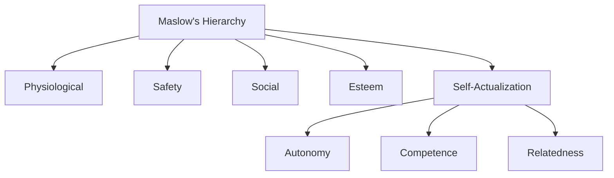
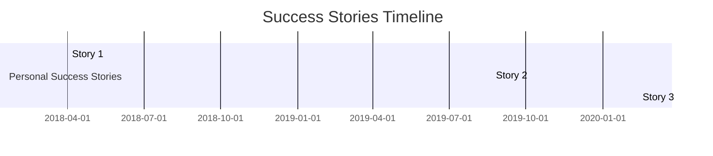

                 


### Step 1: Introduction and Background

**Chapter 1: Introduction to the Concept of Alternative Success Metrics**

**1.1 Background and Definition of Socially Defined Success**
In our modern society, success is often narrowly defined by conventional metrics such as wealth, career achievements, and social status. This societal definition can be traced back to historical and cultural norms that prioritize material wealth and societal recognition as the ultimate goals of life. However, this traditional view of success is not universally applicable or satisfying for everyone.

**1.2 Rationale for Alternative Success Metrics**
The need for alternative success metrics arises from the recognition that individuals have diverse aspirations and values. Some may prioritize personal fulfillment, happiness, or community impact over traditional markers of success. By considering alternative metrics, we encourage a more holistic and inclusive approach to defining success, one that accommodates a wider range of personal goals and life experiences.

**1.3 Personal and Societal Implications**
Adopting alternative success metrics can have profound personal and societal implications. On an individual level, it can lead to greater personal satisfaction and a sense of purpose. On a societal level, it can foster a more equitable and diverse culture, where individuals are not solely judged by their social or economic status.

### Step 2: Core Concepts and Their Relationships

**Chapter 2: Core Concepts in Alternative Success Metrics**

**2.1 Personal Values and Life Goals**

**2.1.1 Definition and Characteristics**
Personal values are the principles and beliefs that guide our behaviors and decision-making. Life goals are the long-term aims that individuals strive to achieve. Understanding these concepts is crucial for developing alternative success metrics.

**2.1.2 Comparison Table of Personal Values**
A comparison table can help illustrate the differences between various personal values, such as autonomy, competence, and relatedness.

| Personal Value | Definition | Example |
| --- | --- | --- |
| Autonomy | Self-governance and independence | Pursuing a career in an area that aligns with personal passions |
| Competence | Mastery and skill development | Continuously improving one's professional skills |
| Relatedness | Building strong relationships | Engaging in community service and volunteer work |

**2.1.3 Mermaid ER Diagram of Personal Values**
A Mermaid ER diagram can visually represent the relationships between personal values and life goals.

```mermaid
erDiagram
  PersonalValue ||--|{ LifeGoal } LifeGoal
  PersonalValue : "Defines the goals"
  LifeGoal : "Aim of an individual"
```

### Step 3: Theories and Frameworks

**Chapter 3: Theoretical Foundations of Alternative Success Metrics**

**3.1 Psychological Theories on Success**

**3.1.1 Maslow's Hierarchy of Needs**
Abraham Maslow's theory posits that individuals have a hierarchical set of needs that must be met in a specific order, from basic physiological needs to self-actualization.

$$
\text{Maslow's Hierarchy of Needs} = \begin{cases}
\text{Physiological} & \text{if } N_1 \leq N_2 \leq \ldots \leq N_5 \\
\text{Self-Actualization} & \text{if all needs are met}
\end{cases}
$$

**3.1.2 Self-Determination Theory**
Self-Determination Theory by Deci and Ryan emphasizes the importance of autonomy, competence, and relatedness in achieving personal satisfaction and success.

**3.1.3 Mermaid Flowchart of Psychological Theories**
A Mermaid flowchart can illustrate the flow of ideas between Maslow's Hierarchy of Needs and Self-Determination Theory.



### Step 4: Practical Applications and Case Studies

**Chapter 4: Real-World Applications of Alternative Success Metrics**

**4.1 Personal Stories of Alternative Success**

**4.1.1 Stories of Non-Traditional Success**
Personal stories can provide real-life examples of individuals who have achieved success by alternative metrics, such as happiness, fulfillment, and personal growth.

**4.1.2 Lessons from Personal Experiences**
Lessons learned from these stories can offer insights into how alternative success metrics can be applied in real life.

**4.1.3 Mermaid Timeline of Success Stories**
A Mermaid timeline can visually represent the key milestones in the success stories of these individuals.



### Conclusion

**Chapter 5: Conclusion and Future Directions**

**5.1 Summary of Key Findings**
A summary of the key findings and insights from the previous chapters.

**5.2 Future Research Directions**
Suggestions for future research to further explore alternative success metrics and their implications.

