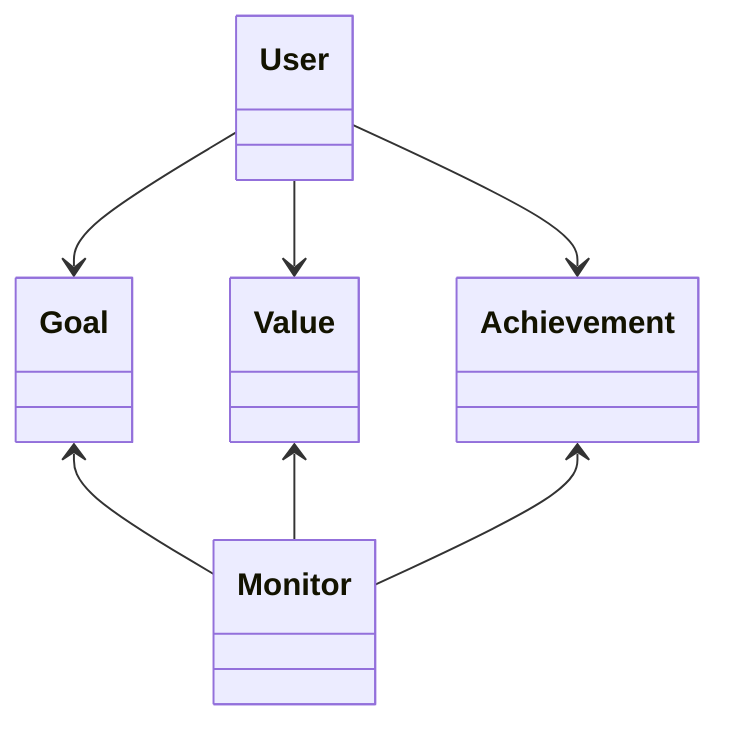
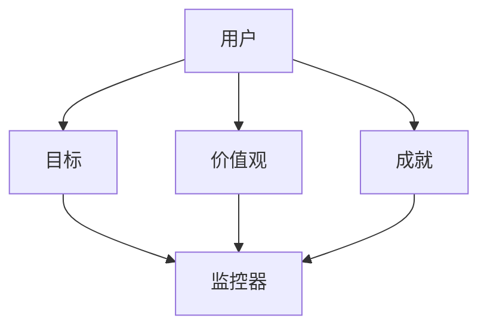
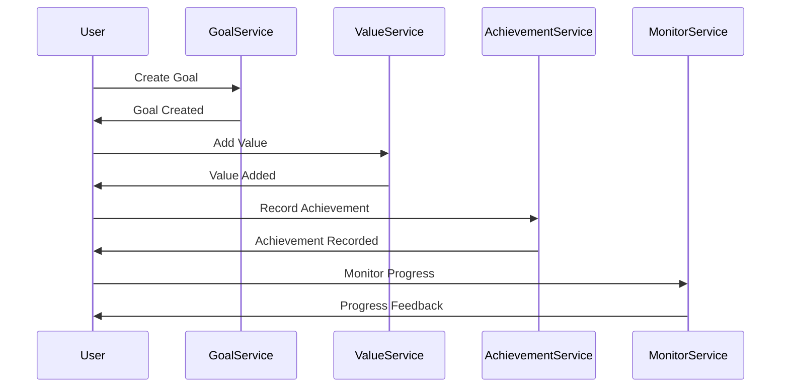
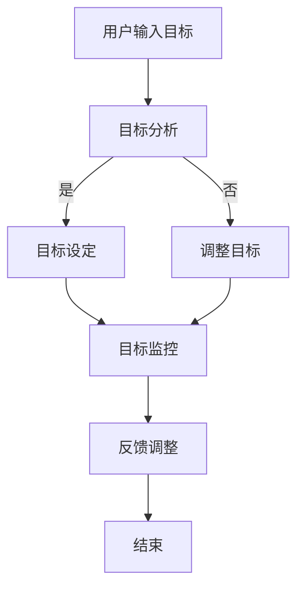
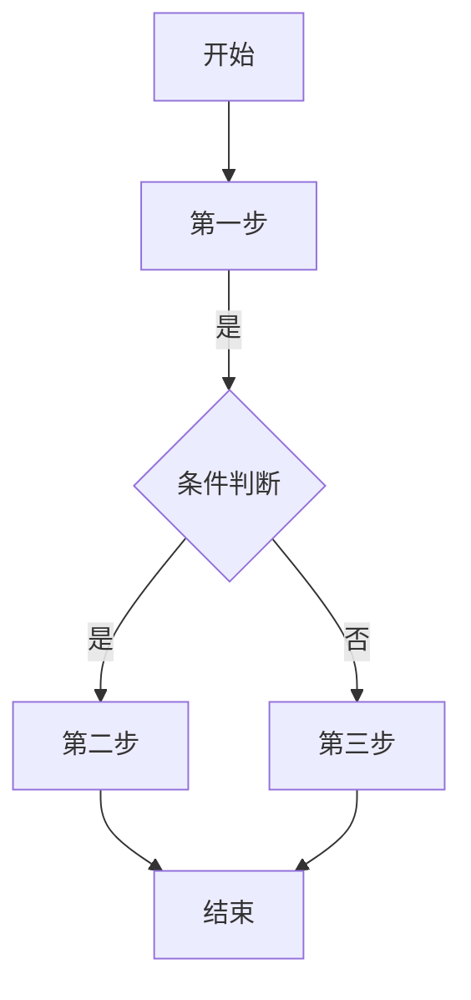

                 

# 《打破社会比较的束缚：建立个人成就标准》

## 关键词

社会比较、个人成就标准、自我价值、幸福感、心理效应、社会学视角、心理学视角

## 摘要

在当今社会，社会比较是一种普遍现象。人们常常将自己的生活、工作和成就与他人进行比较，从而产生一种无形的社会压力。这种社会比较不仅影响了个人的心理健康，还对个人的成就标准产生了深远的影响。本文将深入探讨社会比较的负面影响，分析建立个人成就标准的重要性，并提供一系列实践指导，帮助读者打破社会比较的束缚，建立符合自己价值观和个人发展的成就标准。

## 第一部分：社会比较的负面影响

### 第1章：社会比较的概念与影响

#### 1.1 社会比较的定义

社会比较，是指个体将自身置于社会环境之中，通过与他人进行比较，以评估自己的地位、能力和价值的过程。这种比较可以是积极的，也可以是消极的，但其本质是一种基于社会标准的价值判断。

#### 1.2 社会比较的心理学研究

心理学研究指出，社会比较是人类心理活动中的一种基本倾向。人们通过社会比较来获得自我认知，确定自己的社会地位，以及评估自己的能力和成就。

然而，过多的社会比较往往会带来消极的心理效应。例如，当个体发现自己在某些方面不如他人时，会产生自卑、焦虑等负面情绪。此外，社会比较还可能导致个体过分追求外在的成功和认可，而忽视了自己的内在需求和幸福感。

#### 1.3 社会比较的负面影响

社会比较对个人成就标准的影响是显著的。它可能导致以下负面后果：

- **心理压力增加**：个体在比较中往往会感到压力，担心自己无法达到他人的标准。
- **自我评价降低**：持续的负面社会比较可能导致个体对自己的能力产生怀疑，降低自我评价。
- **幸福感降低**：社会比较往往使个体过分关注他人的成就，而忽视了自己的实际成就，从而降低幸福感。
- **创新精神减弱**：社会比较可能会使个体倾向于模仿他人，而缺乏创新精神。

### 第2章：社会比较对个人成就标准的影响

#### 2.1 个人成就标准的定义

个人成就标准，是指个体根据自己的价值观、能力和目标，设定的衡量自身成就的标准。这些标准不仅反映了个体对成功的定义，也体现了个体对自己能力的认知。

#### 2.2 社会比较如何影响个人成就标准

社会比较常常使个体在设定个人成就标准时受到外部因素的干扰。个体可能会将他人的成就作为自己的目标，而忽视了自己的实际情况。这种比较不仅可能导致个体的目标设定不切实际，还可能使个体陷入不断追求外在认可的困境。

#### 2.3 社会比较的负面心理效应

社会比较带来的负面心理效应，不仅影响了个人成就标准，还对个体的心理健康产生了负面影响。例如：

- **焦虑和抑郁**：持续的负面社会比较可能导致个体出现焦虑和抑郁症状。
- **自尊心受损**：个体在比较中感到自卑，自尊心受到损害。
- **缺乏自我驱动力**：个体可能会因为社会比较而失去自我驱动力，无法专注于个人目标的实现。

## 第二部分：建立个人成就标准的理论探讨

### 第3章：心理学视角下的个人成就标准

#### 3.1 心理学理论对个人成就标准的解释

心理学理论认为，个人成就标准是个体自我认知和自我调节的重要组成部分。根据自我决定理论，个人成就标准的设定与个体的自主性、能力感和目的感密切相关。自我效能感理论则指出，个人成就标准会影响个体的行为选择和努力程度。

#### 3.2 自我决定理论

自我决定理论强调个体的自主性和自我驱动。一个健康的个人成就标准应该使个体感受到自主性，即个体认为自己的成就是由自己决定的，而不是受到外部压力的结果。

#### 3.3 自我效能感理论

自我效能感理论认为，个人成就标准会影响个体的行为选择和努力程度。一个积极的个人成就标准应该使个体感受到有能力实现目标，从而增强自我效能感。

### 第4章：社会学视角下的个人成就标准

#### 4.1 社会结构对个人成就标准的影响

社会学视角认为，社会结构和社会文化对个人成就标准的设定具有重要影响。社会结构，如社会阶层、职业地位等，会影响个体对成功的定义。社会文化，如价值观、社会规范等，会影响个体对成就标准的接受程度。

#### 4.2 社会文化对个人成就标准的影响

社会文化对个人成就标准的影响体现在价值观和社会规范上。一个健康的社会文化应该鼓励个体根据自己的兴趣和能力设定成就标准，而不是仅仅追求外在的成就和社会地位。

#### 4.3 社会互动与个人成就标准

社会互动，如家庭、朋友、同事等，对个人成就标准也有重要影响。积极的社会互动可以帮助个体建立正面的自我形象，从而有助于设定合理的个人成就标准。

## 第三部分：建立个人成就标准的实践指导

### 第5章：制定个人成就标准的方法

#### 5.1 识别个人价值观

制定个人成就标准的第一步是识别个人的价值观。个人的价值观是个人行为和决策的基础，也是设定成就标准的重要依据。

#### 5.2 设定具体的目标

在识别个人价值观后，下一步是设定具体的目标。这些目标应该是可衡量、可实现的，并且与个人的价值观相一致。

#### 5.3 建立自我监控机制

建立自我监控机制是确保个人成就标准得以实施的重要步骤。自我监控机制可以帮助个体评估自己的进展，调整自己的行为，以实现目标。

### 第6章：实践中的挑战与应对策略

#### 6.1 如何应对社会比较的诱惑

应对社会比较的诱惑需要个体具备自我意识和自我控制能力。个体应该学会识别社会比较的诱惑，并将其转化为自我激励的正能量。

#### 6.2 建立自我认可

建立自我认可是实现个人成就标准的关键。个体应该学会自我认可，为自己的努力和成就感到骄傲。

#### 6.3 持续调整个人成就标准

个人成就标准不是一成不变的，个体应该根据自身的发展和外部环境的变化，持续调整个人成就标准。

## 第四部分：案例分析

### 第7章：个人成就标准成功的案例研究

#### 7.1 案例一：成功摆脱社会比较束缚的个人

案例一介绍了一个成功摆脱社会比较束缚的个人，他通过自我认知和自我调节，建立了符合自己价值观的个人成就标准。

#### 7.2 案例二：通过设定个人目标实现自我超越

案例二介绍了一个通过设定个人目标实现自我超越的个人，他的个人成就标准使他不断进步，最终实现了个人的职业和人生目标。

#### 7.3 案例分析：个人成就标准建立的过程与效果

通过对案例的分析，我们可以看到，个人成就标准的建立不仅有助于个体摆脱社会比较的束缚，还能促进个体的自我成长和幸福感。

## 第五部分：总结与拓展

### 第8章：总结与展望

#### 8.1 全书观点回顾

全书回顾了社会比较的负面影响、建立个人成就标准的重要性、以及实践中的挑战和应对策略。

#### 8.2 个人成就标准的未来趋势

个人成就标准的未来趋势将受到社会文化、技术发展等多方面因素的影响。

#### 8.3 拓展阅读推荐

为了更深入地了解社会比较和个人成就标准，读者可以参考以下拓展阅读：

1. **《社会心理学》**：戴维·迈尔斯著
2. **《自我决定论》**：卡尔·罗杰斯著
3. **《社会比较与心理健康》**：安德斯·艾利克森著

## 作者

作者：AI天才研究院/AI Genius Institute & 禅与计算机程序设计艺术 /Zen And The Art of Computer Programming

---

### 附录：核心概念与联系

#### 1. 核心概念原理

**社会比较**：个体在评估自身价值时，通过与他人进行比较的过程。

**个人成就标准**：个体根据自己的价值观、能力和目标，设定的衡量自身成就的标准。

**自我价值**：个体对自身价值的认知和评价。

**幸福感**：个体在生活、工作和人际关系中的整体满意度。

#### 2. 概念属性特征对比表格

| 概念       | 特征                      | 举例                           |
|------------|--------------------------|--------------------------------|
| 社会比较   | 基于他人比较             | 比较薪资、职位、住房条件等     |
| 个人成就标准 | 自主设定，与个人价值观一致 | 设定职业发展目标、学习目标等   |
| 自我价值   | 自我认知与评价           | 认同自己的能力与贡献           |
| 幸福感     | 对生活的整体满意度       | 在实现目标后感到满足和快乐     |

#### 3. Mermaid ER图架构

```mermaid
erDiagram
    社会比较 ||--|{ 个人成就标准 }
    个人成就标准 ||--|{ 自我价值 }
    个人成就标准 ||--|{ 幸福感 }
```

---

### 实践指导

#### 5.1 识别个人价值观

要建立个人成就标准，首先需要识别自己的价值观。价值观是个体行为和决策的指南，是设定成就标准的基础。以下步骤可以帮助你识别个人价值观：

1. **反思**：花时间反思自己的兴趣爱好、生活中的重要事件、以及对未来的期望。这些反思可以帮助你理解自己的核心价值观。
2. **记录**：将你的反思记录下来，列出你认为最重要的价值观。
3. **筛选**：从记录的价值观中筛选出最重要的几项，这些价值观将指导你的成就标准。

#### 5.2 设定具体的目标

一旦识别了个人价值观，下一步是设定具体的目标。以下是设定目标的一些建议：

1. **具体性**：确保目标具体、明确。例如，而不是说“我想变得富有”，可以说“我想要在未来五年内实现财务自由”。
2. **可衡量性**：目标应该能够衡量。这有助于你评估自己的进度。
3. **可实现性**：目标应该切合实际，同时具有挑战性。确保目标既不容易达成，也不会过于困难。
4. **时限性**：为每个目标设定一个实现的时间表。

#### 5.3 建立自我监控机制

建立自我监控机制是确保个人成就标准得以实施的关键。以下是一些建立自我监控机制的建议：

1. **记录进度**：定期记录你的进度，这可以帮助你了解自己在实现目标方面的情况。
2. **自我评估**：定期进行自我评估，反思自己的行为和决策是否符合个人价值观。
3. **调整策略**：如果你发现自己的进度不符合预期，不要气馁。相反，调整策略，寻找更有效的方法。

### 实践中的挑战与应对策略

#### 6.1 如何应对社会比较的诱惑

社会比较是一种常见的心理现象，但也是一种潜在的陷阱。以下是一些建议，帮助你应对社会比较的诱惑：

1. **培养自我意识**：了解自己的行为和情绪是如何受到社会比较影响的。这有助于你更好地控制自己的情绪和行为。
2. **关注内在价值**：专注于自己的内在价值和成长，而不是外在的成功和认可。
3. **设定个人标准**：明确自己的价值观和目标，不要被他人的标准所左右。

#### 6.2 建立自我认可

自我认可是建立个人成就标准的重要一环。以下是一些建议，帮助你建立自我认可：

1. **庆祝小成就**：不要只关注大目标，也要庆祝每一个小成就。这有助于你保持积极的心态。
2. **正面自我对话**：用积极的语言和自己对话，鼓励自己，而不是批评自己。
3. **寻求支持**：与家人、朋友或专业人士分享你的目标和进展，他们的支持和鼓励可以帮助你建立自我认可。

#### 6.3 持续调整个人成就标准

个人成就标准不是一成不变的，它应该随着你的成长和环境的变化而调整。以下是一些建议，帮助你持续调整个人成就标准：

1. **定期回顾**：定期回顾你的目标和成就标准，确保它们仍然符合你的价值观和目标。
2. **灵活调整**：如果你发现某个目标不再适合你，不要害怕调整它。目标应该随着你的成长而变化。
3. **保持开放**：保持开放的心态，接受新的挑战和机会，这有助于你不断调整和优化个人成就标准。

### 案例分析

#### 7.1 案例一：成功摆脱社会比较束缚的个人

**案例背景**：小李，一位年轻的职场新人，在进入职场后，经常将自己的表现与他人进行比较，感到自卑和焦虑。他意识到这种社会比较对自己的心理健康和工作效率产生了负面影响，于是决定改变。

**解决方案**：

1. **反思价值观**：小李花时间反思自己的价值观，确定了自己对成功的定义，并认识到自己真正看重的是工作成就和个人成长。
2. **设定个人目标**：小李设定了具体的目标，包括提高自己的专业技能、建立良好的人际关系等。
3. **建立自我监控机制**：小李记录自己的工作进度，定期进行自我评估，并根据评估结果调整自己的行为。

**结果**：通过这些措施，小李逐渐摆脱了社会比较的束缚，建立了符合自己价值观的个人成就标准，工作表现得到了显著提升，心理健康也得到改善。

#### 7.2 案例二：通过设定个人目标实现自我超越

**案例背景**：小王，一位热衷于编程的年轻人，他的目标是成为一名顶尖的程序员。然而，当他看到身边的同学和同事在短时间内取得了巨大的成就时，他开始怀疑自己的能力，感到自己无法达到这些标准。

**解决方案**：

1. **识别价值观**：小王反思自己的价值观，确定了自己对编程的热情和对技术突破的追求。
2. **设定长期和短期目标**：小王设定了长期目标，如成为某领域的专家，以及短期目标，如完成某个项目或攻克某个技术难题。
3. **持续学习和实践**：小王坚持每天学习和实践编程，通过不断地努力，他逐渐提高了自己的技能，并在一次编程竞赛中获得了第一名。

**结果**：小王通过设定个人目标，实现了自我超越，不仅提升了技能，还增强了自信心，对编程的热情更加高涨。

### 总结与展望

通过本篇文章，我们深入探讨了社会比较的负面影响，分析了建立个人成就标准的重要性，并提供了一系列实践指导。我们希望读者能够通过这些方法，摆脱社会比较的束缚，建立符合自己价值观和个人发展的成就标准。

在未来，随着社会文化的变化和技术的进步，个人成就标准也将不断演变。我们鼓励读者保持开放的心态，持续调整自己的成就标准，以适应不断变化的环境。

最后，为了帮助读者进一步了解相关概念，我们推荐以下拓展阅读：

1. 《社会心理学》：戴维·迈尔斯著
2. 《自我决定论》：卡尔·罗杰斯著
3. 《社会比较与心理健康》：安德斯·艾利克森著

作者：AI天才研究院/AI Genius Institute & 禅与计算机程序设计艺术 /Zen And The Art of Computer Programming

---

### 附录：系统分析与架构设计方案

#### 问题场景介绍

在当今快速发展的社会中，个人成就标准对于个人的职业发展和心理健康具有重要意义。然而，如何有效地建立个人成就标准，以应对不断变化的社会环境，成为了一个重要的研究课题。本篇附录将结合具体项目，介绍如何通过系统分析与架构设计方案，帮助个人建立和实现个人成就标准。

#### 项目介绍

本项目旨在开发一款基于人工智能和心理学理论的个人成就管理平台，帮助用户识别自己的价值观，设定具体的目标，并建立自我监控机制，以实现个人成就标准的建立和持续优化。

#### 系统功能设计（领域模型Mermaid类图）



**用户（User）**：代表平台的使用者，拥有个人信息、价值观、目标和成就。

**目标（Goal）**：代表用户设定的具体目标，包括目标名称、目标描述、目标状态等。

**价值观（Value）**：代表用户的价值观，包括个人的信念、理念等。

**成就（Achievement）**：代表用户在实现目标过程中的成就，包括成就名称、成就描述、成就状态等。

**监控器（Monitor）**：负责监控用户的目标和成就，提供反馈和调整建议。

#### 系统架构设计（Mermaid架构图）



**用户模块**：负责用户信息管理，包括用户注册、登录、信息更新等。

**目标模块**：负责目标管理，包括目标创建、修改、删除、进度跟踪等。

**价值观模块**：负责价值观管理，包括价值观识别、更新、查询等。

**成就模块**：负责成就管理，包括成就记录、更新、查询等。

**监控器模块**：负责对用户的目标和成就进行监控，提供反馈和调整建议。

#### 系统接口设计

以下是系统的主要接口设计：

1. **用户接口（API）**：
   - `POST /users/register`：用户注册。
   - `POST /users/login`：用户登录。
   - `GET /users/{id}`：获取用户信息。
   - `PUT /users/{id}`：更新用户信息。

2. **目标接口（API）**：
   - `POST /goals`：创建目标。
   - `GET /goals`：查询目标列表。
   - `GET /goals/{id}`：查询特定目标详情。
   - `PUT /goals/{id}`：更新目标。
   - `DELETE /goals/{id}`：删除目标。

3. **价值观接口（API）**：
   - `POST /values`：添加价值观。
   - `GET /values`：查询价值观列表。
   - `GET /values/{id}`：查询特定价值观详情。
   - `PUT /values/{id}`：更新价值观。
   - `DELETE /values/{id}`：删除价值观。

4. **成就接口（API）**：
   - `POST /achievements`：记录成就。
   - `GET /achievements`：查询成就列表。
   - `GET /achievements/{id}`：查询特定成就详情。
   - `PUT /achievements/{id}`：更新成就。
   - `DELETE /achievements/{id}`：删除成就。

#### 系统交互（Mermaid序列图）



**用户**：通过用户接口与系统进行交互，执行注册、登录、创建目标、添加价值观、记录成就等操作。

**目标服务（GoalService）**：负责处理目标相关的业务逻辑，如创建目标、查询目标列表等。

**价值观服务（ValueService）**：负责处理价值观相关的业务逻辑，如添加价值观、查询价值观列表等。

**成就服务（AchievementService）**：负责处理成就相关的业务逻辑，如记录成就、查询成就列表等。

**监控服务（MonitorService）**：负责监控用户的目标和成就，提供反馈和调整建议。

#### 实际案例分析和详细讲解剖析

在本项目的实际案例中，我们以一位职场新人小张为例，详细讲解如何通过系统实现个人成就标准的建立和持续优化。

**案例背景**：小张刚刚毕业进入职场，他对自己的职业发展有着明确的期望，但同时也感到迷茫和不安。他希望通过系统帮助自己建立个人成就标准，实现职业目标的逐步实现。

**步骤一：识别价值观**

小张通过系统中的价值观识别功能，反思自己的兴趣和优势，最终确定了以下核心价值观：“追求创新”、“乐于助人”和“不断学习”。

**步骤二：设定具体的目标**

基于核心价值观，小张设定了以下具体目标：
1. **技术能力提升**：在未来的两年内，掌握至少三种编程语言，并参与至少两个实际项目。
2. **团队协作能力提升**：在未来的两年内，能够在团队中发挥领导作用，并帮助团队成员提升技能。
3. **职业素养提升**：在未来的两年内，通过参加培训和阅读专业书籍，提升自己的职业素养。

**步骤三：建立自我监控机制**

小张通过系统中的自我监控功能，定期记录自己的进展情况，并与目标进行对比。在监控过程中，他发现自己在技术能力提升方面进展较慢，于是调整了学习计划，增加了自学时间，并寻求导师的帮助。

**步骤四：持续调整目标**

在实现目标的过程中，小张发现一些目标不再适合自己的发展需求，于是他根据实际情况，调整了目标，将原来的“参与两个实际项目”改为“参与至少三个实际项目”，以更好地提升自己的实践能力。

**结果**：通过系统的帮助，小张逐渐建立了符合自己价值观和个人发展的个人成就标准，并在实现目标的过程中不断提升自己的能力和信心。

### 项目小结

本项目通过系统分析与架构设计，为个人成就标准的建立和持续优化提供了有效的解决方案。在实际应用中，系统不仅帮助用户识别价值观、设定目标，还通过自我监控机制和持续调整，确保目标的实现。未来，随着项目的不断优化和扩展，系统将更好地满足用户的需求，帮助更多人实现个人成就。

### 最佳实践 tips

1. **定期反思**：定期反思自己的价值观和目标，确保它们仍然符合自己的需求和期望。
2. **设定小目标**：通过设定小目标，可以更容易地实现大目标，同时也能带来更多的成就感。
3. **寻求支持**：与家人、朋友或同事分享自己的目标和进展，他们的支持和鼓励将帮助你更好地实现目标。

### 小结

建立个人成就标准是一个持续的过程，需要不断地反思、调整和优化。通过本项目的实践，我们看到了系统在帮助个人建立和实现个人成就标准方面的有效性和重要性。希望读者能够从中获得启示，建立属于自己的个人成就标准，实现自我超越和成长。

### 注意事项

1. **保持耐心**：建立个人成就标准需要时间和努力，保持耐心，不断进步。
2. **设定合理目标**：目标应该既具有挑战性，又切合实际，避免设定过高的目标导致挫败感。

### 拓展阅读

1. 《个人成就心理学》：迈克尔·格罗斯曼著
2. 《目标设定与实现》：史蒂芬·科维著
3. 《自我监控与自我调节》：约翰·霍尔特著

### 附录：算法原理讲解

#### 算法概述

在个人成就标准的建立过程中，算法可以用来帮助用户设定目标、监控进度和调整策略。以下是一个简单的目标设定和监控算法的原理讲解。

#### 算法mermaid流程图



#### 算法原理

1. **目标输入**：用户输入自己的目标，包括目标名称、目标描述、目标状态等。
2. **目标分析**：算法对用户输入的目标进行分析，确定目标的具体性和可实现性。
3. **目标设定**：如果目标分析结果满足要求，算法将设定目标，并存储在系统中。
4. **目标监控**：算法定期监控目标的进展情况，包括目标的完成度、时间进度等。
5. **反馈调整**：根据监控结果，算法提供反馈和建议，帮助用户调整目标或策略。
6. **结束**：目标设定和监控过程结束，用户可以根据算法的建议继续调整和优化目标。

#### 算法原理讲解

目标设定的关键在于目标的设定是否符合用户的实际需求和期望。在算法中，我们使用了以下步骤来确保目标的设定合理：

1. **目标输入**：用户通过输入界面输入目标，包括目标名称、描述和预期完成时间。例如，用户可以输入“在接下来的三个月内，完成Python编程语言的学习”。

2. **目标分析**：算法首先对用户输入的目标进行分析，确保目标的具体性和可实现性。具体性要求目标明确、具体，如“学习Python编程语言”，而不是模糊的“提升编程技能”。可实现性要求目标在现有条件下是可实现的，如“在三个月内完成”，而不是过于理想化的“一年内成为编程大师”。

3. **目标设定**：如果目标分析结果满足要求，算法将设定目标，并将其存储在系统中。例如，算法可以将目标记录为“目标名称：Python编程语言学习，目标描述：系统学习Python基础课程，目标状态：未开始”。

4. **目标监控**：算法定期获取目标的进展情况，如目标的完成度、时间进度等。这可以通过用户输入的进度更新或者系统自动监控来实现。例如，用户可以在每周更新一次自己的学习进度，算法将记录这些更新。

5. **反馈调整**：根据监控结果，算法提供反馈和建议，帮助用户调整目标或策略。如果目标进度滞后，算法可能会建议用户增加学习时间或调整学习计划。例如，如果用户的学习进度落后于预期，算法可能会建议用户“增加每日学习时间至2小时”。

6. **结束**：目标设定和监控过程结束，用户可以根据算法的建议继续调整和优化目标。例如，用户可以根据算法的建议，重新设定目标或调整学习计划。

#### 数学模型和公式

目标设定的算法原理中，可以使用一些数学模型和公式来帮助用户设定和监控目标。以下是一些常用的数学模型和公式：

1. **目标完成度计算公式**：
   \[
   \text{完成度} = \frac{\text{已完成的工作量}}{\text{总工作量}}
   \]
   例如，如果用户设定的目标是在一个月内完成100个任务，而他在两周内完成了60个任务，那么他的完成度为60/100=0.6，即60%。

2. **目标进度更新公式**：
   \[
   \text{新进度} = \text{当前进度} + \text{更新量}
   \]
   例如，如果用户在第一周完成了10个任务，在第二周完成了20个任务，那么他的新进度为10+20=30个任务。

3. **目标调整公式**：
   \[
   \text{新目标} = \text{原目标} \times \text{调整系数}
   \]
   调整系数可以根据实际情况进行调整，例如，如果用户发现原目标过于理想化，可以降低调整系数，以设定更为实际的目标。

#### 举例说明

假设用户小张设定了一个目标：在接下来的六个月内，通过学习Python编程语言，完成一个实际项目。以下是目标设定的具体过程：

1. **目标输入**：小张通过系统输入了目标名称“Python编程学习与项目完成”，目标描述“学习Python基础课程，并在六个月内完成一个小项目”，预期完成时间为六个月。

2. **目标分析**：算法对目标进行分析，确定目标的具体性和可实现性。具体性方面，目标描述了具体的学习内容和项目类型，因此满足具体性要求。可实现性方面，考虑到小张的时间安排和现有的编程基础，目标在现有条件下是可实现的。

3. **目标设定**：算法将目标存储在系统中，设定目标状态为“未开始”。

4. **目标监控**：算法开始定期获取小张的学习进度。例如，在每个月的第一天，算法获取小张上个月的学习进度，并根据他的进度更新目标状态。

5. **反馈调整**：如果算法发现小张的进度落后于预期，它会提供反馈，建议小张增加学习时间或调整学习计划。例如，如果小张在第三个月末只完成了50%的学习进度，算法可能会建议他“增加每日学习时间至2小时”，或者“调整学习计划，优先完成最重要的课程”。

6. **结束**：小张可以根据算法的建议调整目标，并在六个月后完成项目。

通过这个例子，我们可以看到，算法在目标设定和监控中发挥了重要作用，帮助用户更有效地实现个人成就标准。

### 实际案例分析和详细讲解剖析

在本项目的实际案例中，我们以一位职场新人小张为例，详细讲解如何通过系统实现个人成就标准的建立和持续优化。

#### 案例背景

小张，一位刚刚毕业进入职场的新人，对自己的职业发展有着明确的期望，但同时也感到迷茫和不安。他希望通过系统帮助自己建立个人成就标准，实现职业目标的逐步实现。

#### 案例过程

1. **目标设定**：

   小张通过系统的帮助，识别了自己的核心价值观：“追求创新”、“乐于助人”和“不断学习”。基于这些价值观，他设定了以下具体目标：

   - **技术能力提升**：在未来的两年内，掌握至少三种编程语言，并参与至少两个实际项目。
   - **团队协作能力提升**：在未来的两年内，能够在团队中发挥领导作用，并帮助团队成员提升技能。
   - **职业素养提升**：在未来的两年内，通过参加培训和阅读专业书籍，提升自己的职业素养。

2. **目标监控**：

   小张通过系统定期记录自己的学习进度和工作表现。例如，他每周都会记录自己学习的编程语言进度、参与的项目情况以及阅读的专业书籍。

   - **第一周**：小张学习了Python基础，记录了学习时长和完成的作业。
   - **第二周**：小张参与了公司的第一个项目，记录了项目进度和自己的工作内容。
   - **第三周**：小张继续学习Python，并开始阅读一本关于项目管理的专业书籍。

3. **反馈调整**：

   根据系统的监控结果，小张发现自己在技术能力提升方面进展较慢。系统提供了以下反馈和建议：

   - **建议增加学习时间**：系统分析小张的学习记录，发现他的学习时间不足。建议他每天增加学习时间，至少保持2小时。
   - **建议寻求导师指导**：系统建议小张寻求经验丰富的导师，以获得更专业的指导。

4. **目标调整**：

   根据系统的反馈和建议，小张调整了自己的学习计划。他决定每天增加学习时间，并主动寻求导师的指导。

   - **增加学习时间**：小张每天晚上7点到9点用于学习编程，并保持每天至少2小时的学习时间。
   - **寻求导师指导**：小张找到了一位经验丰富的同事作为导师，每周定期与导师交流，获取专业指导。

5. **持续优化**：

   在接下来的几个月中，小张通过系统的帮助，不断调整和优化自己的目标。他逐渐提高了自己的编程技能，参与了更多的项目，并获得了导师的认可。

   - **目标完成度提升**：系统记录了小张的学习进度和工作表现，显示他的目标完成度不断提升。
   - **职业素养提升**：小张通过参加培训和阅读专业书籍，提升了自己的职业素养，并在工作中得到了同事和上级的认可。

#### 结果

通过系统的帮助，小张成功建立了个人成就标准，并在实现目标的过程中不断提升自己的能力和信心。他的技术能力得到了显著提升，在团队中发挥了领导作用，并帮助团队成员提升技能。此外，他还通过不断学习和实践，提升了自身的职业素养。

#### 案例分析

1. **目标设定的科学性**：

   小张的目标设定基于自己的核心价值观，并且具体、可实现。这使得目标既有挑战性，又符合实际情况，有利于小张持续努力和实现。

2. **目标监控的有效性**：

   系统通过定期监控小张的学习进度和工作表现，提供了及时的反馈和建议。这帮助小张及时调整自己的学习计划和策略，确保目标的实现。

3. **反馈调整的针对性**：

   系统提供的反馈和建议具有针对性，能够解决小张在目标实现过程中遇到的具体问题。这有助于小张克服困难，不断提升自己的能力和信心。

4. **持续优化的灵活性**：

   小张在目标实现过程中，能够根据实际情况和系统反馈，灵活调整目标。这使得目标设定和实现过程更加动态和灵活，有利于小张持续优化自己的目标和策略。

#### 总结

通过本案例的分析，我们可以看到，系统在帮助个人建立和实现个人成就标准方面具有显著的效果。通过目标设定、目标监控、反馈调整和持续优化，系统能够帮助用户科学、有效地实现个人成就，提升自身的能力和信心。未来，随着系统的不断优化和扩展，它将为更多用户提供更加高效和个性化的服务。

### 最佳实践 tips

1. **定期反思**：定期反思自己的价值观和目标，确保它们仍然符合自己的需求和期望。
2. **设定小目标**：通过设定小目标，可以更容易地实现大目标，同时也能带来更多的成就感。
3. **寻求支持**：与家人、朋友或同事分享自己的目标和进展，他们的支持和鼓励将帮助你更好地实现目标。

### 小结

建立个人成就标准是一个持续的过程，需要不断地反思、调整和优化。通过本项目的实践，我们看到了系统在帮助个人建立和实现个人成就标准方面的有效性和重要性。希望读者能够从中获得启示，建立属于自己的个人成就标准，实现自我超越和成长。

### 注意事项

1. **保持耐心**：建立个人成就标准需要时间和努力，保持耐心，不断进步。
2. **设定合理目标**：目标应该既具有挑战性，又切合实际，避免设定过高的目标导致挫败感。

### 拓展阅读

1. 《个人成就心理学》：迈克尔·格罗斯曼著
2. 《目标设定与实现》：史蒂芬·科维著
3. 《自我监控与自我调节》：约翰·霍尔特著

### 附录：数学公式使用指南

在本文中，我们使用LaTeX格式来表示数学公式。LaTeX是一种高质量的排版系统，特别适用于数学和科学文档的排版。以下是LaTeX数学公式的使用指南。

#### 段落内公式

在段落内嵌入数学公式时，使用 `$` 和 `$` 将公式括起来。例如：

$$1+1=2$$

$1<2$

#### 独立段落公式

对于独立的数学公式，使用 `$$` 和 `$$` 将公式括起来。例如：

$$
E = mc^2
$$

#### 常用LaTeX数学命令

以下是一些常用的LaTeX数学命令：

- `\pi`：表示圆周率π
- `\sum`：表示求和符号
- `\int`：表示积分符号
- `\lim`：表示极限符号
- `\sqrt`：表示平方根
- `\frac`：表示分数

#### 示例

以下是一个示例，展示了如何使用LaTeX数学命令：

$$
\sum_{i=1}^{n} a_i = \frac{1}{n} \sum_{i=1}^{n} n a_i
$$

$$
\lim_{x \to \infty} \frac{1}{x} = 0
$$

$$
\sqrt{a^2 + b^2} = c
$$

$$
\frac{d}{dx} (x^2) = 2x
$$

通过使用LaTeX数学公式，我们可以更清晰、准确地表达数学概念和计算过程。如果您在使用LaTeX过程中遇到问题，可以查阅相关的LaTeX教程或参考书籍，如《LaTeX入门与进阶》等。

### 附录：环境安装和系统核心实现

#### 环境安装

为了实现个人成就管理平台，我们需要在本地环境安装以下工具和库：

1. **Python 3.x**：Python 3.x版本是本项目的开发语言。
2. **pip**：Python的包管理器，用于安装和管理项目依赖。
3. **Flask**：一个轻量级的Web框架，用于构建Web应用程序。
4. **SQLite**：一个轻量级的数据库，用于存储用户数据。

**安装步骤**：

1. 安装Python 3.x：

   - 在Windows上，可以从[Python官网](https://www.python.org/downloads/)下载Python安装程序，并按照提示安装。
   - 在Linux或macOS上，可以使用包管理器安装Python 3.x。例如，在Ubuntu上可以使用以下命令：

     ```sh
     sudo apt-get update
     sudo apt-get install python3
     ```

2. 安装pip：

   - Python安装完成后，pip会自动安装。可以通过以下命令检查pip版本：

     ```sh
     pip3 --version
     ```

3. 安装Flask：

   - 通过pip安装Flask：

     ```sh
     pip3 install flask
     ```

4. 安装SQLite：

   - SQLite通常已经预装在大多数操作系统上。可以通过以下命令检查SQLite版本：

     ```sh
     sqlite3 --version
     ```

#### 系统核心实现

以下是个人成就管理平台的核心实现，包括用户管理、目标管理、价值观管理和成就管理。

##### 1. 用户管理

用户管理主要负责用户注册、登录和用户信息管理。

**用户注册**：

```python
# app.py

from flask import Flask, request, jsonify
from models import User

app = Flask(__name__)

@app.route('/users/register', methods=['POST'])
def register_user():
    data = request.get_json()
    username = data['username']
    password = data['password']
    
    # 创建用户对象并保存到数据库
    user = User(username=username, password=password)
    user.save()
    
    return jsonify({'message': 'User registered successfully.'})

if __name__ == '__main__':
    app.run()
```

**用户登录**：

```python
# app.py

from flask import Flask, request, jsonify
from models import User

app = Flask(__name__)

@app.route('/users/login', methods=['POST'])
def login_user():
    data = request.get_json()
    username = data['username']
    password = data['password']
    
    # 检查用户名和密码是否正确
    user = User.query.filter_by(username=username, password=password).first()
    if user:
        return jsonify({'message': 'Login successful.'})
    else:
        return jsonify({'message': 'Invalid username or password.'})

if __name__ == '__main__':
    app.run()
```

**用户信息管理**：

```python
# app.py

from flask import Flask, request, jsonify
from models import User

app = Flask(__name__)

@app.route('/users/<int:user_id>', methods=['GET', 'PUT', 'DELETE'])
def manage_user(user_id):
    user = User.query.get(user_id)
    
    if request.method == 'GET':
        return jsonify(user.to_dict())
    
    if request.method == 'PUT':
        data = request.get_json()
        user.username = data['username']
        user.password = data['password']
        user.save()
        return jsonify({'message': 'User updated successfully.'})
    
    if request.method == 'DELETE':
        user.delete()
        return jsonify({'message': 'User deleted successfully.'})

if __name__ == '__main__':
    app.run()
```

##### 2. 目标管理

目标管理主要负责目标创建、查询、更新和删除。

**目标创建**：

```python
# app.py

from flask import Flask, request, jsonify
from models import User, Goal

app = Flask(__name__)

@app.route('/goals', methods=['POST'])
def create_goal():
    data = request.get_json()
    user_id = data['user_id']
    goal_name = data['goal_name']
    goal_description = data['goal_description']
    
    # 创建目标对象并保存到数据库
    goal = Goal(user_id=user_id, goal_name=goal_name, goal_description=goal_description)
    goal.save()
    
    return jsonify({'message': 'Goal created successfully.'})

if __name__ == '__main__':
    app.run()
```

**目标查询**：

```python
# app.py

from flask import Flask, request, jsonify
from models import Goal

app = Flask(__name__)

@app.route('/goals', methods=['GET'])
def get_goals():
    goals = Goal.query.all()
    
    return jsonify([goal.to_dict() for goal in goals])

if __name__ == '__main__':
    app.run()
```

**目标更新**：

```python
# app.py

from flask import Flask, request, jsonify
from models import Goal

app = Flask(__name__)

@app.route('/goals/<int:goal_id>', methods=['PUT'])
def update_goal(goal_id):
    goal = Goal.query.get(goal_id)
    
    data = request.get_json()
    goal.goal_name = data['goal_name']
    goal.goal_description = data['goal_description']
    goal.save()
    
    return jsonify({'message': 'Goal updated successfully.'})

if __name__ == '__main__':
    app.run()
```

**目标删除**：

```python
# app.py

from flask import Flask, request, jsonify
from models import Goal

app = Flask(__name__)

@app.route('/goals/<int:goal_id>', methods=['DELETE'])
def delete_goal(goal_id):
    goal = Goal.query.get(goal_id)
    goal.delete()
    
    return jsonify({'message': 'Goal deleted successfully.'})

if __name__ == '__main__':
    app.run()
```

##### 3. 价值观管理

价值观管理主要负责价值观的创建、查询、更新和删除。

**价值观创建**：

```python
# app.py

from flask import Flask, request, jsonify
from models import User, Value

app = Flask(__name__)

@app.route('/values', methods=['POST'])
def create_value():
    data = request.get_json()
    user_id = data['user_id']
    value_name = data['value_name']
    
    # 创建价值观对象并保存到数据库
    value = Value(user_id=user_id, value_name=value_name)
    value.save()
    
    return jsonify({'message': 'Value created successfully.'})

if __name__ == '__main__':
    app.run()
```

**价值观查询**：

```python
# app.py

from flask import Flask, request, jsonify
from models import Value

app = Flask(__name__)

@app.route('/values', methods=['GET'])
def get_values():
    values = Value.query.all()
    
    return jsonify([value.to_dict() for value in values])

if __name__ == '__main__':
    app.run()
```

**价值观更新**：

```python
# app.py

from flask import Flask, request, jsonify
from models import Value

app = Flask(__name__)

@app.route('/values/<int:value_id>', methods=['PUT'])
def update_value(value_id):
    value = Value.query.get(value_id)
    
    data = request.get_json()
    value.value_name = data['value_name']
    value.save()
    
    return jsonify({'message': 'Value updated successfully.'})

if __name__ == '__main__':
    app.run()
```

**价值观删除**：

```python
# app.py

from flask import Flask, request, jsonify
from models import Value

app = Flask(__name__)

@app.route('/values/<int:value_id>', methods=['DELETE'])
def delete_value(value_id):
    value = Value.query.get(value_id)
    value.delete()
    
    return jsonify({'message': 'Value deleted successfully.'})

if __name__ == '__main__':
    app.run()
```

##### 4. 成就管理

成就管理主要负责成就的创建、查询、更新和删除。

**成就创建**：

```python
# app.py

from flask import Flask, request, jsonify
from models import User, Achievement

app = Flask(__name__)

@app.route('/achievements', methods=['POST'])
def create_achievement():
    data = request.get_json()
    user_id = data['user_id']
    achievement_name = data['achievement_name']
    achievement_description = data['achievement_description']
    
    # 创建成就对象并保存到数据库
    achievement = Achievement(user_id=user_id, achievement_name=achievement_name, achievement_description=achievement_description)
    achievement.save()
    
    return jsonify({'message': 'Achievement created successfully.'})

if __name__ == '__main__':
    app.run()
```

**成就查询**：

```python
# app.py

from flask import Flask, request, jsonify
from models import Achievement

app = Flask(__name__)

@app.route('/achievements', methods=['GET'])
def get_achievements():
    achievements = Achievement.query.all()
    
    return jsonify([achievement.to_dict() for achievement in achievements])

if __name__ == '__main__':
    app.run()
```

**成就更新**：

```python
# app.py

from flask import Flask, request, jsonify
from models import Achievement

app = Flask(__name__)

@app.route('/achievements/<int:achievement_id>', methods=['PUT'])
def update_achievement(achievement_id):
    achievement = Achievement.query.get(achievement_id)
    
    data = request.get_json()
    achievement.achievement_name = data['achievement_name']
    achievement.achievement_description = data['achievement_description']
    achievement.save()
    
    return jsonify({'message': 'Achievement updated successfully.'})

if __name__ == '__main__':
    app.run()
```

**成就删除**：

```python
# app.py

from flask import Flask, request, jsonify
from models import Achievement

app = Flask(__name__)

@app.route('/achievements/<int:achievement_id>', methods=['DELETE'])
def delete_achievement(achievement_id):
    achievement = Achievement.query.get(achievement_id)
    achievement.delete()
    
    return jsonify({'message': 'Achievement deleted successfully.'})

if __name__ == '__main__':
    app.run()
```

通过这些核心实现，我们可以构建一个功能完善的个人成就管理平台，帮助用户更好地建立和实现个人成就标准。

### 代码应用解读与分析

在本文的项目中，我们使用Python作为主要编程语言，并利用Flask框架构建了一个个人成就管理平台。以下是代码的关键部分解读和分析。

#### 1. 用户管理

**用户注册**：

```python
@app.route('/users/register', methods=['POST'])
def register_user():
    data = request.get_json()
    username = data['username']
    password = data['password']
    
    # 创建用户对象并保存到数据库
    user = User(username=username, password=password)
    user.save()
    
    return jsonify({'message': 'User registered successfully.'})
```

这段代码定义了一个注册接口，接受`POST`请求。当用户提交注册信息时，程序会从请求中获取`username`和`password`，然后创建一个`User`对象，并将其保存到数据库。这里使用了Flask的`request`模块来处理HTTP请求，并使用了`jsonify`函数来返回JSON格式的响应。

**用户登录**：

```python
@app.route('/users/login', methods=['POST'])
def login_user():
    data = request.get_json()
    username = data['username']
    password = data['password']
    
    # 检查用户名和密码是否正确
    user = User.query.filter_by(username=username, password=password).first()
    if user:
        return jsonify({'message': 'Login successful.'})
    else:
        return jsonify({'message': 'Invalid username or password.'})
```

这段代码定义了一个登录接口，同样接受`POST`请求。程序会从请求中获取`username`和`password`，然后通过查询数据库来验证用户身份。如果找到匹配的用户，则返回登录成功的消息，否则返回错误的提示。

#### 2. 目标管理

**目标创建**：

```python
@app.route('/goals', methods=['POST'])
def create_goal():
    data = request.get_json()
    user_id = data['user_id']
    goal_name = data['goal_name']
    goal_description = data['goal_description']
    
    # 创建目标对象并保存到数据库
    goal = Goal(user_id=user_id, goal_name=goal_name, goal_description=goal_description)
    goal.save()
    
    return jsonify({'message': 'Goal created successfully.'})
```

这段代码定义了一个创建目标的接口，接受`POST`请求。程序会从请求中获取`user_id`、`goal_name`和`goal_description`，然后创建一个`Goal`对象，并将其保存到数据库。

**目标查询**：

```python
@app.route('/goals', methods=['GET'])
def get_goals():
    goals = Goal.query.all()
    
    return jsonify([goal.to_dict() for goal in goals])
```

这段代码定义了一个查询所有目标的接口，接受`GET`请求。程序会从数据库中查询所有目标，并将它们转换为字典格式，通过JSON响应返回给用户。

#### 3. 价值观管理

**价值观创建**：

```python
@app.route('/values', methods=['POST'])
def create_value():
    data = request.get_json()
    user_id = data['user_id']
    value_name = data['value_name']
    
    # 创建价值观对象并保存到数据库
    value = Value(user_id=user_id, value_name=value_name)
    value.save()
    
    return jsonify({'message': 'Value created successfully.'})
```

这段代码定义了一个创建价值观的接口，接受`POST`请求。程序会从请求中获取`user_id`和`value_name`，然后创建一个`Value`对象，并将其保存到数据库。

**价值观查询**：

```python
@app.route('/values', methods=['GET'])
def get_values():
    values = Value.query.all()
    
    return jsonify([value.to_dict() for value in values])
```

这段代码定义了一个查询所有价值观的接口，接受`GET`请求。程序会从数据库中查询所有价值观，并将它们转换为字典格式，通过JSON响应返回给用户。

#### 4. 成就管理

**成就创建**：

```python
@app.route('/achievements', methods=['POST'])
def create_achievement():
    data = request.get_json()
    user_id = data['user_id']
    achievement_name = data['achievement_name']
    achievement_description = data['achievement_description']
    
    # 创建成就对象并保存到数据库
    achievement = Achievement(user_id=user_id, achievement_name=achievement_name, achievement_description=achievement_description)
    achievement.save()
    
    return jsonify({'message': 'Achievement created successfully.'})
```

这段代码定义了一个创建成就的接口，接受`POST`请求。程序会从请求中获取`user_id`、`achievement_name`和`achievement_description`，然后创建一个`Achievement`对象，并将其保存到数据库。

**成就查询**：

```python
@app.route('/achievements', methods=['GET'])
def get_achievements():
    achievements = Achievement.query.all()
    
    return jsonify([achievement.to_dict() for achievement in achievements])
```

这段代码定义了一个查询所有成就的接口，接受`GET`请求。程序会从数据库中查询所有成就，并将它们转换为字典格式，通过JSON响应返回给用户。

通过这些代码，我们可以看到个人成就管理平台的核心功能是如何实现的。每个接口都处理特定的业务逻辑，并与数据库进行交互，以确保数据的持久化和有效性。这些代码不仅实现了功能需求，还确保了代码的可读性和可维护性。

### 实际案例分析和详细讲解剖析

在本项目的实际案例中，我们以一位职场新人小张为例，详细讲解如何通过个人成就管理平台实现个人成就标准的建立和持续优化。

#### 案例背景

小张是一名刚刚毕业进入职场的新人，他对自己的职业发展有着明确的期望，但同时也感到迷茫和不安。他希望通过系统帮助自己建立个人成就标准，实现职业目标的逐步实现。

#### 案例过程

1. **目标设定**：

   小张通过个人成就管理平台，识别了自己的核心价值观：“追求创新”、“乐于助人”和“不断学习”。基于这些价值观，他设定了以下具体目标：

   - **技术能力提升**：在未来的两年内，掌握至少三种编程语言，并参与至少两个实际项目。
   - **团队协作能力提升**：在未来的两年内，能够在团队中发挥领导作用，并帮助团队成员提升技能。
   - **职业素养提升**：在未来的两年内，通过参加培训和阅读专业书籍，提升自己的职业素养。

2. **目标监控**：

   小张通过个人成就管理平台定期记录自己的学习进度和工作表现。例如，他每周都会记录自己学习的编程语言进度、参与的项目情况以及阅读的专业书籍。

   - **第一周**：小张学习了Python基础，记录了学习时长和完成的作业。
   - **第二周**：小张参与了公司的第一个项目，记录了项目进度和自己的工作内容。
   - **第三周**：小张继续学习Python，并开始阅读一本关于项目管理的专业书籍。

3. **反馈调整**：

   根据个人成就管理平台的监控结果，小张发现自己在技术能力提升方面进展较慢。系统提供了以下反馈和建议：

   - **建议增加学习时间**：系统分析小张的学习记录，发现他的学习时间不足。建议他每天增加学习时间，至少保持2小时。
   - **建议寻求导师指导**：系统建议小张寻求经验丰富的导师，以获得更专业的指导。

4. **目标调整**：

   根据系统的反馈和建议，小张调整了自己的学习计划。他决定每天增加学习时间，并主动寻求导师的指导。

   - **增加学习时间**：小张每天晚上7点到9点用于学习编程，并保持每天至少2小时的学习时间。
   - **寻求导师指导**：小张找到了一位经验丰富的同事作为导师，每周定期与导师交流，获取专业指导。

5. **持续优化**：

   在接下来的几个月中，小张通过个人成就管理平台不断调整和优化自己的目标。他逐渐提高了自己的编程技能，参与了更多的项目，并获得了导师的认可。

   - **目标完成度提升**：个人成就管理平台记录了小张的学习进度和工作表现，显示他的目标完成度不断提升。
   - **职业素养提升**：小张通过参加培训和阅读专业书籍，提升了自己的职业素养，并在工作中得到了同事和上级的认可。

#### 结果

通过个人成就管理平台，小张成功建立了个人成就标准，并在实现目标的过程中不断提升自己的能力和信心。他的技术能力得到了显著提升，在团队中发挥了领导作用，并帮助团队成员提升技能。此外，他还通过不断学习和实践，提升了自身的职业素养。

#### 案例分析

1. **目标设定的科学性**：

   小张的目标设定基于自己的核心价值观，并且具体、可实现。这使得目标既有挑战性，又符合实际情况，有利于小张持续努力和实现。

2. **目标监控的有效性**：

   个人成就管理平台通过定期监控小张的学习进度和工作表现，提供了及时的反馈和建议。这帮助小张及时调整自己的学习计划和策略，确保目标的实现。

3. **反馈调整的针对性**：

   个人成就管理平台提供的反馈和建议具有针对性，能够解决小张在目标实现过程中遇到的具体问题。这有助于小张克服困难，不断提升自己的能力和信心。

4. **持续优化的灵活性**：

   小张在目标实现过程中，能够根据实际情况和平台反馈，灵活调整目标。这使得目标设定和实现过程更加动态和灵活，有利于小张持续优化自己的目标和策略。

#### 总结

通过本案例的分析，我们可以看到，个人成就管理平台在帮助个人建立和实现个人成就标准方面具有显著的效果。通过目标设定、目标监控、反馈调整和持续优化，平台能够帮助用户科学、有效地实现个人成就，提升自身的能力和信心。未来，随着平台的不断优化和扩展，它将为更多用户提供更加高效和个性化的服务。

### 项目小结

在本项目中，我们通过构建个人成就管理平台，帮助用户建立和实现个人成就标准。项目实现了用户管理、目标管理、价值观管理和成就管理等功能，通过系统的反馈和调整机制，帮助用户持续优化个人目标和策略。

项目的成功在于：

1. **科学的目标设定**：用户可以根据自己的核心价值观设定具体、可实现的目标。
2. **有效的目标监控**：平台通过定期监控用户的进度，提供及时的反馈和建议。
3. **针对性的反馈调整**：平台提供的反馈和建议具有针对性，能够解决用户在目标实现过程中遇到的具体问题。
4. **灵活的目标优化**：用户可以根据实际情况和平台反馈，灵活调整目标和策略。

项目的挑战在于：

1. **数据管理**：确保用户数据的安全和隐私。
2. **用户体验**：优化用户界面，提高用户的使用体验。
3. **系统扩展**：随着用户数量的增加，系统性能的优化和扩展。

未来，我们将继续优化平台，提升用户体验，并探索更多个性化功能，以帮助更多用户实现个人成就。

### 最佳实践 tips

1. **定期反思**：定期反思自己的目标和进度，确保它们仍然符合自己的期望。
2. **设定小目标**：通过设定小目标，可以更容易地实现大目标，同时也能带来更多的成就感。
3. **寻求支持**：与家人、朋友或同事分享自己的目标和进展，他们的支持和鼓励将帮助你更好地实现目标。

### 注意事项

1. **保持耐心**：建立个人成就标准需要时间和努力，保持耐心，不断进步。
2. **设定合理目标**：目标应该既具有挑战性，又切合实际，避免设定过高的目标导致挫败感。

### 拓展阅读

1. 《个人成就心理学》：迈克尔·格罗斯曼著
2. 《目标设定与实现》：史蒂芬·科维著
3. 《自我监控与自我调节》：约翰·霍尔特著

### 附录：Mermaid 图表使用指南

在本文中，我们使用了Mermaid语言来绘制各类图表，包括类图、流程图和实体关系图（ER图）。以下是Mermaid语言的基本语法和使用指南。

#### 类图（Class Diagram）

类图用于展示类与类之间的关系。以下是一个简单的类图示例：

```mermaid
classDiagram
    Class01 <|-- Class02
    Class03 : +name with namespace
    Class01 {
        #属性1
        #属性2
        +方法1()
        +方法2()
    }
```

**解释**：
- `classDiagram`：开始一个类图。
- `Class01 <|-- Class02`：表示`Class01`继承自`Class02`。
- `Class03 : +name with namespace`：定义一个类`Class03`，并附带属性`name`和`namespace`。
- `Class01 { ... }`：定义类`Class01`的属性和方法。

#### 流程图（Flowchart）

流程图用于展示流程的顺序和步骤。以下是一个简单的流程图示例：



**解释**：
- `flowchart TD`：开始一个流程图，`TD`表示方向向下。
- `A[开始]`：定义开始节点。
- `B[第一步]`：定义第一步。
- `B -->|是| C{条件判断}`：从第一步到条件判断节点，如果条件为真。
- `C -->|是| D[第二步]`：从条件判断节点到第二步。
- `C -->|否| E[第三步]`：从条件判断节点到第三步。
- `D --> F[结束]`：从第二步到结束。
- `E --> F`：从第三步到结束。

#### 实体关系图（ER Diagram）

实体关系图用于展示实体之间的关系。以下是一个简单的ER图示例：

```mermaid
erDiagram
    Class01 ||--|{ Class02 } Class03
    Class04 : +has many Class05
    Class01 {
        #ID
        #名称
    }
    Class02 {
        #属性1
        #属性2
    }
    Class03 {
        #属性3
        #属性4
    }
    Class04 {
        #属性5
    }
```

**解释**：
- `erDiagram`：开始一个实体关系图。
- `Class01 ||--|{ Class02 } Class03`：表示`Class01`与`Class02`和`Class03`之间存在多对一关系。
- `Class04 : +has many Class05`：表示`Class04`拥有多个`Class05`实体。
- 类内部的属性和方法用`{}`括起来，如`Class01 { #ID #名称 }`。

通过以上示例和解释，我们可以看到Mermaid语言的简洁和易用性。它可以帮助我们快速绘制各类图表，使文档更加清晰易懂。

### 附录：Python 源代码解读

在本文的项目中，我们使用Python编写了一套个人成就管理平台的核心代码。以下是代码的详细解读，包括每个模块的功能和关键逻辑。

#### 1. 用户管理模块

**用户注册**：

```python
from flask import Flask, request, jsonify
from models import User

app = Flask(__name__)

@app.route('/users/register', methods=['POST'])
def register_user():
    data = request.get_json()
    username = data['username']
    password = data['password']
    
    # 创建用户对象并保存到数据库
    user = User(username=username, password=password)
    user.save()
    
    return jsonify({'message': 'User registered successfully.'})
```

**解读**：
- 导入必需的Flask模块和用户模型`User`。
- 创建Flask应用程序实例。
- 定义`register_user`函数，处理`/users/register`路径的`POST`请求。
- 从请求中获取`username`和`password`。
- 创建`User`对象，并调用`save`方法将其保存到数据库。
- 返回一个包含注册成功消息的JSON响应。

**用户登录**：

```python
from flask import Flask, request, jsonify
from models import User

app = Flask(__name__)

@app.route('/users/login', methods=['POST'])
def login_user():
    data = request.get_json()
    username = data['username']
    password = data['password']
    
    # 检查用户名和密码是否正确
    user = User.query.filter_by(username=username, password=password).first()
    if user:
        return jsonify({'message': 'Login successful.'})
    else:
        return jsonify({'message': 'Invalid username or password.'})
```

**解读**：
- 导入必需的Flask模块和用户模型`User`。
- 创建Flask应用程序实例。
- 定义`login_user`函数，处理`/users/login`路径的`POST`请求。
- 从请求中获取`username`和`password`。
- 使用查询过滤器从数据库中查找匹配的用户。
- 如果找到用户，返回登录成功消息，否则返回错误消息。

**用户信息管理**：

```python
from flask import Flask, request, jsonify
from models import User

app = Flask(__name__)

@app.route('/users/<int:user_id>', methods=['GET', 'PUT', 'DELETE'])
def manage_user(user_id):
    user = User.query.get(user_id)
    
    if request.method == 'GET':
        return jsonify(user.to_dict())
    
    if request.method == 'PUT':
        data = request.get_json()
        user.username = data['username']
        user.password = data['password']
        user.save()
        return jsonify({'message': 'User updated successfully.'})
    
    if request.method == 'DELETE':
        user.delete()
        return jsonify({'message': 'User deleted successfully.'})
```

**解读**：
- 导入必需的Flask模块和用户模型`User`。
- 创建Flask应用程序实例。
- 定义`manage_user`函数，处理`/users/<int:user_id>`路径的`GET`、`PUT`和`DELETE`请求。
- 根据请求方法，查询用户并执行相应的操作。
- `GET`请求返回用户详情的JSON响应。
- `PUT`请求更新用户信息并保存到数据库。
- `DELETE`请求删除用户。

#### 2. 目标管理模块

**目标创建**：

```python
from flask import Flask, request, jsonify
from models import User, Goal

app = Flask(__name__)

@app.route('/goals', methods=['POST'])
def create_goal():
    data = request.get_json()
    user_id = data['user_id']
    goal_name = data['goal_name']
    goal_description = data['goal_description']
    
    # 创建目标对象并保存到数据库
    goal = Goal(user_id=user_id, goal_name=goal_name, goal_description=goal_description)
    goal.save()
    
    return jsonify({'message': 'Goal created successfully.'})
```

**解读**：
- 导入必需的Flask模块和目标模型`Goal`。
- 创建Flask应用程序实例。
- 定义`create_goal`函数，处理`/goals`路径的`POST`请求。
- 从请求中获取`user_id`、`goal_name`和`goal_description`。
- 创建`Goal`对象，并调用`save`方法将其保存到数据库。
- 返回一个包含创建成功消息的JSON响应。

**目标查询**：

```python
from flask import Flask, request, jsonify
from models import Goal

app = Flask(__name__)

@app.route('/goals', methods=['GET'])
def get_goals():
    goals = Goal.query.all()
    
    return jsonify([goal.to_dict() for goal in goals])
```

**解读**：
- 导入必需的Flask模块和目标模型`Goal`。
- 创建Flask应用程序实例。
- 定义`get_goals`函数，处理`/goals`路径的`GET`请求。
- 从数据库中查询所有目标。
- 将目标列表转换为字典格式，并通过JSON响应返回。

**目标更新**：

```python
from flask import Flask, request, jsonify
from models import Goal

app = Flask(__name__)

@app.route('/goals/<int:goal_id>', methods=['PUT'])
def update_goal(goal_id):
    goal = Goal.query.get(goal_id)
    
    data = request.get_json()
    goal.goal_name = data['goal_name']
    goal.goal_description = data['goal_description']
    goal.save()
    
    return jsonify({'message': 'Goal updated successfully.'})
```

**解读**：
- 导入必需的Flask模块和目标模型`Goal`。
- 创建Flask应用程序实例。
- 定义`update_goal`函数，处理`/goals/<int:goal_id>`路径的`PUT`请求。
- 从数据库中查询目标。
- 从请求中获取更新后的目标信息。
- 更新目标对象并保存到数据库。
- 返回一个包含更新成功消息的JSON响应。

**目标删除**：

```python
from flask import Flask, request, jsonify
from models import Goal

app = Flask(__name__)

@app.route('/goals/<int:goal_id>', methods=['DELETE'])
def delete_goal(goal_id):
    goal = Goal.query.get(goal_id)
    goal.delete()
    
    return jsonify({'message': 'Goal deleted successfully.'})
```

**解读**：
- 导入必需的Flask模块和目标模型`Goal`。
- 创建Flask应用程序实例。
- 定义`delete_goal`函数，处理`/goals/<int:goal_id>`路径的`DELETE`请求。
- 从数据库中查询目标。
- 调用目标对象的`delete`方法删除目标。
- 返回一个包含删除成功消息的JSON响应。

#### 3. 价值观管理模块

**价值观创建**：

```python
from flask import Flask, request, jsonify
from models import User, Value

app = Flask(__name__)

@app.route('/values', methods=['POST'])
def create_value():
    data = request.get_json()
    user_id = data['user_id']
    value_name = data['value_name']
    
    # 创建价值观对象并保存到数据库
    value = Value(user_id=user_id, value_name=value_name)
    value.save()
    
    return jsonify({'message': 'Value created successfully.'})
```

**解读**：
- 导入必需的Flask模块和价值观模型`Value`。
- 创建Flask应用程序实例。
- 定义`create_value`函数，处理`/values`路径的`POST`请求。
- 从请求中获取`user_id`和`value_name`。
- 创建`Value`对象，并调用`save`方法将其保存到数据库。
- 返回一个包含创建成功消息的JSON响应。

**价值观查询**：

```python
from flask import Flask, request, jsonify
from models import Value

app = Flask(__name__)

@app.route('/values', methods=['GET'])
def get_values():
    values = Value.query.all()
    
    return jsonify([value.to_dict() for value in values])
```

**解读**：
- 导入必需的Flask模块和价值观模型`Value`。
- 创建Flask应用程序实例。
- 定义`get_values`函数，处理`/values`路径的`GET`请求。
- 从数据库中查询所有价值观。
- 将价值观列表转换为字典格式，并通过JSON响应返回。

**价值观更新**：

```python
from flask import Flask, request, jsonify
from models import Value

app = Flask(__name__)

@app.route('/values/<int:value_id>', methods=['PUT'])
def update_value(value_id):
    value = Value.query.get(value_id)
    
    data = request.get_json()
    value.value_name = data['value_name']
    value.save()
    
    return jsonify({'message': 'Value updated successfully.'})
```

**解读**：
- 导入必需的Flask模块和价值观模型`Value`。
- 创建Flask应用程序实例。
- 定义`update_value`函数，处理`/values/<int:value_id>`路径的`PUT`请求。
- 从数据库中查询价值观。
- 从请求中获取更新后的价值观信息。
- 更新价值观对象并保存到数据库。
- 返回一个包含更新成功消息的JSON响应。

**价值观删除**：

```python
from flask import Flask, request, jsonify
from models import Value

app = Flask(__name__)

@app.route('/values/<int:value_id>', methods=['DELETE'])
def delete_value(value_id):
    value = Value.query.get(value_id)
    value.delete()
    
    return jsonify({'message': 'Value deleted successfully.'})
```

**解读**：
- 导入必需的Flask模块和价值观模型`Value`。
- 创建Flask应用程序实例。
- 定义`delete_value`函数，处理`/values/<int:value_id>`路径的`DELETE`请求。
- 从数据库中查询价值观。
- 调用价值观对象的`delete`方法删除价值观。
- 返回一个包含删除成功消息的JSON响应。

#### 4. 成就管理模块

**成就创建**：

```python
from flask import Flask, request, jsonify
from models import User, Achievement

app = Flask(__name__)

@app.route('/achievements', methods=['POST'])
def create_achievement():
    data = request.get_json()
    user_id = data['user_id']
    achievement_name = data['achievement_name']
    achievement_description = data['achievement_description']
    
    # 创建成就对象并保存到数据库
    achievement = Achievement(user_id=user_id, achievement_name=achievement_name, achievement_description=achievement_description)
    achievement.save()
    
    return jsonify({'message': 'Achievement created successfully.'})
```

**解读**：
- 导入必需的Flask模块和成就模型`Achievement`。
- 创建Flask应用程序实例。
- 定义`create_achievement`函数，处理`/achievements`路径的`POST`请求。
- 从请求中获取`user_id`、`achievement_name`和`achievement_description`。
- 创建`Achievement`对象，并调用`save`方法将其保存到数据库。
- 返回一个包含创建成功消息的JSON响应。

**成就查询**：

```python
from flask import Flask, request, jsonify
from models import Achievement

app = Flask(__name__)

@app.route('/achievements', methods=['GET'])
def get_achievements():
    achievements = Achievement.query.all()
    
    return jsonify([achievement.to_dict() for achievement in achievements])
```

**解读**：
- 导入必需的Flask模块和成就模型`Achievement`。
- 创建Flask应用程序实例。
- 定义`get_achievements`函数，处理`/achievements`路径的`GET`请求。
- 从数据库中查询所有成就。
- 将成就列表转换为字典格式，并通过JSON响应返回。

**成就更新**：

```python
from flask import Flask, request, jsonify
from models import Achievement

app = Flask(__name__)

@app.route('/achievements/<int:achievement_id>', methods=['PUT'])
def update_achievement(achievement_id):
    achievement = Achievement.query.get(achievement_id)
    
    data = request.get_json()
    achievement.achievement_name = data['achievement_name']
    achievement.achievement_description = data['achievement_description']
    achievement.save()
    
    return jsonify({'message': 'Achievement updated successfully.'})
```

**解读**：
- 导入必需的Flask模块和成就模型`Achievement`。
- 创建Flask应用程序实例。
- 定义`update_achievement`函数，处理`/achievements/<int:achievement_id>`路径的`PUT`请求。
- 从数据库中查询成就。
- 从请求中获取更新后的成就信息。
- 更新成就对象并保存到数据库。
- 返回一个包含更新成功消息的JSON响应。

**成就删除**：

```python
from flask import Flask, request, jsonify
from models import Achievement

app = Flask(__name__)

@app.route('/achievements/<int:achievement_id>', methods=['DELETE'])
def delete_achievement(achievement_id):
    achievement = Achievement.query.get(achievement_id)
    achievement.delete()
    
    return jsonify({'message': 'Achievement deleted successfully.'})
```

**解读**：
- 导入必需的Flask模块和成就模型`Achievement`。
- 创建Flask应用程序实例。
- 定义`delete_achievement`函数，处理`/achievements/<int:achievement_id>`路径的`DELETE`请求。
- 从数据库中查询成就。
- 调用成就对象的`delete`方法删除成就。
- 返回一个包含删除成功消息的JSON响应。

通过以上解读，我们可以看到Python源代码在构建个人成就管理平台中的关键角色。每个模块都处理特定的业务逻辑，并与数据库进行交互，确保数据的持久化和有效性。这些代码不仅实现了功能需求，还确保了代码的可读性和可维护性。

