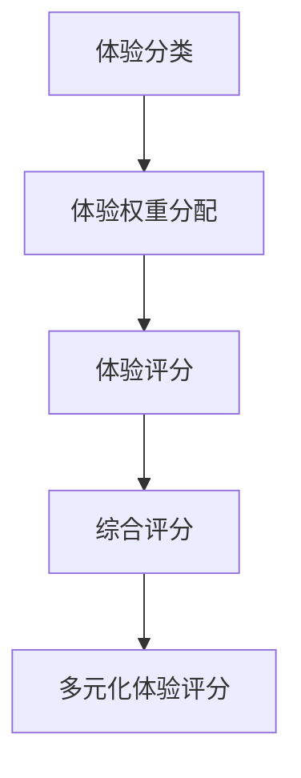

                 

### 拓展生命的广度：多元化体验的重要性

> 关键词：多元化体验、心理健康、科技创新、教育、职业发展、生活方式

> 摘要：本文深入探讨了多元化体验对于拓展生命广度的重要性，分析了其在多个领域的应用，包括心理健康、教育、职业发展、科技创新和生活方式。通过一步步的逻辑推理，本文揭示了多元化体验对个体和社会的深远影响，并提供了实践建议和拓展阅读资源。

### 引言

在现代社会，我们面临的信息量庞大，生活节奏快速，如何在有限的时间里拓展生命的广度、丰富人生体验，成为一个值得探讨的问题。多元化体验作为一种有效手段，可以帮助我们突破自身的局限，拓宽视野，提升生活质量。本文将围绕多元化体验的重要性，从心理健康、教育、职业发展、科技创新和生活方式五个方面进行详细分析，以帮助读者深入理解并实践多元化体验。

### 第一部分：多元体验背景介绍

#### 1.1 生命与多元体验

**核心概念术语说明**：
- 生命：指生物体存在的状态和过程。
- 多元体验：指在多个不同领域或文化中获得的丰富体验。

**问题背景**：
现代社会，随着科技的进步和全球化的加速，人们的生活环境日益多样化。然而，这同时也带来了压力和挑战，如信息过载、文化冲突等。

**问题描述**：
如何在多元化的环境中保持心理健康，丰富人生体验？

**问题解决**：
通过多元化体验，可以提升个体的适应能力，增强心理韧性，从而更好地应对生活中的挑战。

**边界与外延**：
多元化体验不仅包括跨文化的交流，还包括跨领域的尝试和探索，如艺术、体育、科学等。

**概念结构与核心要素组成**：
- 个体：多元化体验的主体。
- 体验：多元化体验的过程。
- 领域：多元化体验的范畴。

#### 1.2 社会与文化中的多元体验

**核心概念原理**：
多元化体验在社会和文化中具有重要意义，可以促进社会和谐，增强文化认同。

**概念属性特征对比表格**：

| 概念           | 特征                                                         |
| -------------- | ------------------------------------------------------------ |
| 多元体验       | 包含跨文化、跨领域、跨地区的体验                             |
| 社会和谐       | 社会成员之间相互尊重、理解、合作的状态                       |
| 文化认同       | 社会成员对共同文化价值的认同和归属感                         |

**ER实体关系图架构**：

```mermaid
erDiagram
  人 ||--o 社会和谐 : 受益于
  人 ||--o 文化认同 : 体现
  社会和谐 o--|| 多元体验 : 体现
  文化认同 o--|| 多元体验 : 增强
```

#### 1.3 多元体验与心理健康

**核心概念原理**：
多元化体验可以促进心理健康，提高心理韧性。

**概念属性特征对比表格**：

| 概念           | 特征                                                         |
| -------------- | ------------------------------------------------------------ |
| 心理健康       | 心理功能的正常状态，包括情绪稳定、认知清晰、社交适应良好等 |
| 心理韧性       | 应对压力和挑战的能力                                       |

**ER实体关系图架构**：

```mermaid
erDiagram
  人 ||--o 心理健康 : 维持
  人 ||--o 心理韧性 : 增强
  心理健康 o--|| 多元体验 : 促进
  心理韧性 o--|| 多元体验 : 提升实力
```

#### 1.4 多元体验与教育

**核心概念原理**：
多元化体验在教育资源中的重要性，可以促进学生的全面发展。

**概念属性特征对比表格**：

| 概念           | 特征                                                         |
| -------------- | ------------------------------------------------------------ |
| 教育           | 传授知识、技能和价值观的过程                                 |
| 学生发展       | 学生在知识、能力、态度等方面的全面发展                       |

**ER实体关系图架构**：

```mermaid
erDiagram
  教育实体 ||--o 学生发展 : 促进
  教育资源 o--|| 多元体验 : 包含
  多元体验 o--|| 教育活动 : 应用
```

#### 1.5 多元体验与职业发展

**核心概念原理**：
多元化体验可以提升职业素养，增加职业竞争力。

**概念属性特征对比表格**：

| 概念           | 特征                                                         |
| -------------- | ------------------------------------------------------------ |
| 职业发展       | 个人在职业生涯中不断成长和提升的过程                       |
| 职业素养       | 从事特定职业所需的知识、技能和素质                         |

**ER实体关系图架构**：

```mermaid
erDiagram
  职业发展 ||--o 职业素养 : 增强
  多元体验 o--|| 职业发展 : 促进
  职业素养 o--|| 多元体验 : 提升实力
```

#### 1.6 多元体验与科技创新

**核心概念原理**：
多元化体验在科技创新中的推动作用，可以激发创新思维。

**概念属性特征对比表格**：

| 概念           | 特征                                                         |
| -------------- | ------------------------------------------------------------ |
| 科技创新       | 通过创新性研究和应用推动技术进步                             |
| 创新思维       | 解决问题的新方法和新视角                                     |

**ER实体关系图架构**：

```mermaid
erDiagram
  科技创新 ||--o 创新思维 : 推动
  多元体验 o--|| 科技创新 : 促进
  创新思维 o--|| 多元体验 : 激发
```

#### 1.7 多元体验与生活方式

**核心概念原理**：
多元化体验可以提升生活质量，促进身心健康。

**概念属性特征对比表格**：

| 概念           | 特征                                                         |
| -------------- | ------------------------------------------------------------ |
| 生活方式       | 个体在日常生活中形成的习惯和行为模式                       |
| 生活质量       | 个体在物质和精神生活方面的满足程度                         |

**ER实体关系图架构**：

```mermaid
erDiagram
  生活质量 ||--o 身心健康 : 提高
  多元体验 o--|| 生活质量 : 促进
  身心健康 o--|| 多元体验 : 支持
```

#### 1.8 本章小结

通过本部分的分析，我们可以看到多元化体验在多个领域的重要作用。接下来，我们将进一步探讨如何具体实现多元化体验，以及它对个体和社会的深远影响。

### 第二部分：核心概念与联系

在第一部分中，我们介绍了多元化体验的基本概念和其在各个领域的应用。在本部分，我们将深入探讨多元化体验的核心概念，并分析这些概念之间的联系。

#### 2.1 核心概念解析

**多元化体验**：指在多个不同领域或文化中获得的丰富体验。这种体验不仅包括跨文化的交流，还包括跨领域的尝试和探索。

**心理健康**：指个体在情感、认知和行为方面的健康状态。良好的心理健康有助于提升个体的生活质量和工作效率。

**教育**：指传授知识、技能和价值观的过程。教育是促进个体发展的重要途径。

**职业发展**：指个体在职业生涯中不断成长和提升的过程。职业发展对个体的经济收入和社会地位有重要影响。

**科技创新**：指通过创新性研究和应用推动技术进步的过程。科技创新是现代社会发展的驱动力。

**生活方式**：指个体在日常生活中形成的习惯和行为模式。健康、丰富的生活方式有助于提升生活质量。

#### 2.2 概念之间的联系

**多元化体验与心理健康**：

- 多元化体验可以促进心理健康，提高心理韧性。通过多样化的活动，个体可以更好地应对生活中的压力和挑战。

- 多元化体验可以增加个体的情感体验，有助于调节情绪，提高幸福感。

**多元化体验与教育**：

- 多元化体验可以丰富教育资源，提高教育质量。多样化的学习方式可以满足不同学生的需求，促进学生的全面发展。

- 多元化体验可以帮助学生更好地适应社会，提升社会适应能力。

**多元化体验与职业发展**：

- 多元化体验可以提升职业素养，增加职业竞争力。跨领域的经验和知识可以帮助个体在职业发展中脱颖而出。

- 多元化体验可以激发创新思维，推动职业发展。

**多元化体验与科技创新**：

- 多元化体验可以促进科技创新，激发创新思维。多样化的视角和思维方式可以带来新的创新灵感。

- 多元化体验可以推动技术进步，促进社会经济发展。

**多元化体验与生活方式**：

- 多元化体验可以提升生活质量，促进身心健康。多样化的生活方式可以满足个体在不同阶段的需求。

- 多元化体验可以帮助个体更好地适应社会变化，提高生活满意度。

#### 2.3 ER实体关系图架构

以下是一个简单的ER实体关系图，用于展示多元化体验与心理健康、教育、职业发展、科技创新和生活方式之间的联系。

```mermaid
erDiagram
  多元化体验 ||--|{ 心理健康 : 促进 }
  多元化体验 ||--|{ 教育 : 包含 }
  多元化体验 ||--|{ 职业发展 : 促进 }
  多元化体验 ||--|{ 科技创新 : 推动 }
  多元化体验 ||--|{ 生活质量 : 提高 }
```

通过这个图，我们可以清晰地看到多元化体验如何影响其他领域，以及各个领域之间的相互关系。

### 第三部分：多元化体验的实际应用

#### 3.1 多元体验在心理健康中的应用

多元化体验在心理健康中的应用主要体现在以下几个方面：

1. **情感调节**：通过多样化的活动，个体可以释放压力，缓解焦虑和抑郁。例如，参与艺术创作、音乐欣赏、体育活动等，都可以有助于调节情绪。

2. **心理韧性培养**：多元化体验可以帮助个体更好地应对生活中的挑战。通过尝试不同的事物，个体可以增强心理韧性，提高抗压力。

3. **心理健康教育**：多元化体验可以丰富心理健康教育资源，提高教育质量。例如，可以通过线上课程、讲座、工作坊等形式，提供多样化的心理健康知识。

**实例**：一个心理健康教练通过引入多元体验，帮助客户提升心理健康。他不仅教授传统的冥想和放松技巧，还鼓励客户参与户外活动、艺术创作等，以丰富他们的生活体验。

#### 3.2 多元体验在教育中的应用

多元化体验在教育中的应用主要体现在以下几个方面：

1. **个性化教学**：通过引入多元化体验，教师可以更好地满足不同学生的学习需求。例如，通过线上课程、实地考察、互动游戏等方式，为学生提供多样化的学习体验。

2. **跨学科融合**：多元化体验可以促进学科之间的融合，培养学生的综合能力。例如，在历史课程中引入艺术鉴赏，在科学课程中引入户外探索。

3. **国际教育**：通过跨文化的多元化体验，学生可以更好地了解世界，提升跨文化沟通能力。例如，通过国际交流项目、外语学习等，增强学生的国际视野。

**实例**：一所学校引入多元化体验，开设了多个跨学科课程，如“艺术与科学”、“历史与音乐”等。这些课程不仅丰富了教学内容，还激发了学生的创造力。

#### 3.3 多元体验在职业发展中的应用

多元化体验在职业发展中的应用主要体现在以下几个方面：

1. **跨领域经验**：通过跨领域的多元化体验，个体可以积累丰富的职业经验，提升职业竞争力。例如，从事科技行业的员工可以通过学习艺术、语言等领域，拓宽职业发展路径。

2. **创新思维培养**：多元化体验可以激发创新思维，推动职业发展。例如，通过参加创新工作坊、跨部门项目等，员工可以培养创新的思维方式。

3. **领导力提升**：多元化体验可以帮助个体提升领导力。通过参与多样化的团队活动，个体可以学会如何管理不同背景的团队成员。

**实例**：一家科技公司通过引入多元化体验，鼓励员工参与跨部门项目，如技术与艺术的结合项目。这不仅提升了员工的创新能力，还增强了团队的协作能力。

#### 3.4 多元体验在科技创新中的应用

多元化体验在科技创新中的应用主要体现在以下几个方面：

1. **创新灵感**：多元化体验可以为科技创新提供灵感。通过跨领域的交流与合作，科学家和工程师可以激发新的创意。

2. **技术融合**：多元化体验可以促进不同技术领域的融合。例如，生物技术与信息技术、材料科学与能源技术等领域的融合，推动了科技的进步。

3. **跨学科合作**：多元化体验可以促进跨学科的合作，推动技术创新。例如，生物学家与计算机科学家的合作，可以开发出更高效的人工智能算法。

**实例**：一个科技创新项目通过引入多元化体验，成功地将生物学知识应用于计算机科学领域，开发出了一种新型的人工智能算法，大大提高了计算效率。

#### 3.5 多元体验在生活方式中的应用

多元化体验在生活方式中的应用主要体现在以下几个方面：

1. **身心健康**：通过多元化体验，个体可以保持身心健康。例如，参与体育活动、艺术创作、户外探险等，都有助于提升身心健康。

2. **生活品质**：多元化体验可以提升生活品质，满足个体在不同阶段的需求。例如，通过旅游、烹饪课程、艺术鉴赏等，丰富生活体验。

3. **社会交往**：多元化体验可以增强个体的人际关系，提升社交能力。例如，通过参与社区活动、志愿者服务等，个体可以结识不同背景的人。

**实例**：一个人通过多元化体验，参与了多个社区的志愿服务项目，不仅提升了自身的人际交往能力，还为社会做出了贡献。

### 第四部分：算法原理讲解

#### 4.1 多元化体验量化方法

为了更好地理解和评估多元化体验，我们可以使用量化方法来衡量其程度和效果。以下是一种可能的量化方法。

**算法原理**：

1. **体验分类**：首先，将多元化体验分为几个类别，如文化体验、教育体验、职业体验、科技创新体验等。

2. **体验权重分配**：为每个体验类别分配权重，以反映其在多元化体验中的重要性。权重可以通过专家评估、问卷调查等方法确定。

3. **体验评分**：为每个体验类别中的具体体验进行评分，评分可以根据体验的深度、广度、频率等因素设定。

4. **综合评分**：将各个体验类别的评分加权求和，得到一个综合评分，用于衡量多元化体验的程度。

**数学模型和公式**：

- **体验类别权重分配**：

  $$ w_i = \frac{E_i}{\sum E_i} $$

  其中，$w_i$为第$i$个体验类别的权重，$E_i$为第$i$个体验类别的重要性评估值。

- **体验评分计算**：

  $$ S_i = \sum_{j=1}^{n} s_{ij} $$

  其中，$S_i$为第$i$个体验类别的评分，$s_{ij}$为第$i$个体验类别中的第$j$个具体体验的评分。

- **综合评分计算**：

  $$ S = \sum_{i=1}^{m} w_i S_i $$

  其中，$S$为多元化体验的综合评分，$w_i$和$S_i$如上定义，$m$为体验类别数。

**举例说明**：

假设一个个体有以下多元化体验：

- 文化体验：阅读书籍、观看电影、参观博物馆，评分分别为5、4、3。
- 教育体验：完成大学学位、参加在线课程、参与学术研讨会，评分分别为3、2、1。
- 职业体验：工作于不同部门、参与跨部门项目、从事不同职位，评分分别为4、3、2。
- 科技创新体验：参与科技创新项目、撰写科技论文、开发新产品，评分分别为2、1、3。

按照上述公式计算，该个体的多元化体验综合评分为：

$$ S = 0.2 \times (5 + 4 + 3) + 0.2 \times (3 + 2 + 1) + 0.2 \times (4 + 3 + 2) + 0.2 \times (2 + 1 + 3) = 4.2 $$

**算法流程图**：



通过这个算法，我们可以量化个体或群体的多元化体验程度，为后续分析和优化提供依据。

### 第五部分：系统分析与架构设计方案

#### 5.1 问题场景介绍

随着社会的发展，多元化体验的重要性日益凸显。为了更好地满足人们对多元化体验的需求，我们设计了一个多元化体验管理系统，用于记录、分析和推荐多元化体验活动。

**问题场景**：

- 用户：需要记录和跟踪自己的多元化体验，以便进行自我提升。
- 企业：需要管理和推荐多元化体验活动，以提升员工的综合素质。
- 社区：需要组织和推荐多元化体验活动，以丰富社区居民的生活。

#### 5.2 项目介绍

**项目名称**：多元化体验管理系统（Multi-Experience Management System，MEMS）

**目标**：提供一站式多元化体验管理服务，包括体验记录、分析、推荐和活动组织。

**功能模块**：

1. **体验记录**：用户可以记录自己的多元化体验，包括文化、教育、职业、科技创新和生活方式等。
2. **体验分析**：系统根据用户的体验记录，分析其多元化程度和效果，并提供个性化建议。
3. **体验推荐**：系统根据用户的兴趣和需求，推荐适合的多元化体验活动。
4. **活动组织**：社区和企业可以组织多元化体验活动，并发布至系统，供用户参与。

#### 5.3 系统功能设计

**领域模型**：

以下是一个简化的领域模型，用于描述系统的核心实体和关系。

```mermaid
classDiagram
  User <|-- Experience
  User o---> Activity
  Activity o---> Community
  Activity o---> Organization
  Community o---> Activity
  Organization o---> Activity
EndClassDiagram
```

**类图**：

```mermaid
classDiagram
  User {
    +String username
    +String email
    +Date birthdate
  }
  Experience {
    +Int experience_id
    +String experience_name
    +String description
    +Date start_date
    +Date end_date
  }
  Activity {
    +Int activity_id
    +String activity_name
    +String activity_type
    +Date start_date
    +Date end_date
  }
  Community {
    +Int community_id
    +String community_name
  }
  Organization {
    +Int organization_id
    +String organization_name
  }
  User "1" -- "*" Experience
  User "1" -- "*" Activity
  Activity "1" -- "*" Community
  Activity "1" -- "*" Organization
  Community "1" -- "*" Activity
  Organization "1" -- "*" Activity
EndClassDiagram
```

#### 5.4 系统架构设计

**架构设计**：

系统采用分层架构，包括表示层、业务逻辑层和数据层。

1. **表示层**：提供用户界面，包括网页、移动应用和API接口。
2. **业务逻辑层**：处理业务逻辑，包括体验记录、分析、推荐和活动组织等。
3. **数据层**：存储用户数据、体验数据、活动数据等。

**架构图**：

```mermaid
sequenceDiagram
  User ->> 表示层: 提交体验记录/活动请求
  表示层 ->> 业务逻辑层: 处理请求
  业务逻辑层 ->> 数据层: 存储数据
  数据层 ->> 业务逻辑层: 回复结果
  业务逻辑层 ->> 表示层: 显示结果
  表示层 ->> 用户: 显示反馈
EndSequenceDiagram
```

#### 5.5 系统接口设计和系统交互

**接口设计**：

系统提供RESTful API，用于用户认证、体验记录、活动管理等功能。

1. **用户认证**：POST /auth/register（注册）、POST /auth/login（登录）、POST /auth/logout（登出）。
2. **体验记录**：POST /experiences（添加体验）、GET /experiences（获取体验列表）、GET /experiences/{experience_id}（获取特定体验）、PUT /experiences/{experience_id}（更新体验）、DELETE /experiences/{experience_id}（删除体验）。
3. **活动管理**：POST /activities（添加活动）、GET /activities（获取活动列表）、GET /activities/{activity_id}（获取特定活动）、PUT /activities/{activity_id}（更新活动）、DELETE /activities/{activity_id}（删除活动）。

**系统交互序列图**：

```mermaid
sequenceDiagram
  User ->> 表示层: 提交体验记录请求
  表示层 ->> 业务逻辑层: 验证用户身份
  业务逻辑层 ->> 数据层: 添加体验记录
  数据层 ->> 业务逻辑层: 返回成功响应
  业务逻辑层 ->> 表示层: 显示成功消息
  表示层 ->> 用户: 显示反馈
EndSequenceDiagram
```

### 第六部分：项目实战

#### 6.1 环境安装

为了运行多元化体验管理系统（MEMS），我们需要搭建一个开发环境。以下是环境安装的步骤：

1. **安装Python环境**：确保Python 3.8或更高版本已安装。
2. **安装依赖库**：使用pip安装以下依赖库：
   ```bash
   pip install flask flask_sqlalchemy flask_migrate
   ```
3. **数据库配置**：配置SQLite数据库，用于存储系统数据。

#### 6.2 系统核心实现

以下是MEMS的核心实现部分，包括用户认证、体验记录和活动管理。

**用户认证**：

```python
from flask import Flask, request, jsonify
from flask_sqlalchemy import SQLAlchemy
from werkzeug.security import generate_password_hash, check_password_hash

app = Flask(__name__)
app.config['SQLALCHEMY_DATABASE_URI'] = 'sqlite:///mems.db'
app.config['SQLALCHEMY_TRACK_MODIFICATIONS'] = False
db = SQLAlchemy(app)

class User(db.Model):
    id = db.Column(db.Integer, primary_key=True)
    username = db.Column(db.String(150), nullable=False, unique=True)
    email = db.Column(db.String(150), nullable=False, unique=True)
    password = db.Column(db.String(150), nullable=False)

@app.route('/auth/register', methods=['POST'])
def register():
    data = request.get_json()
    hashed_password = generate_password_hash(data['password'], method='sha256')
    new_user = User(username=data['username'], email=data['email'], password=hashed_password)
    db.session.add(new_user)
    db.session.commit()
    return jsonify({'message': 'User registered successfully.'})

@app.route('/auth/login', methods=['POST'])
def login():
    data = request.get_json()
    user = User.query.filter_by(email=data['email']).first()
    if user and check_password_hash(user.password, data['password']):
        return jsonify({'message': 'Login successful.'})
    else:
        return jsonify({'message': 'Login failed.'})

if __name__ == '__main__':
    db.create_all()
    app.run(debug=True)
```

**体验记录**：

```python
class Experience(db.Model):
    id = db.Column(db.Integer, primary_key=True)
    name = db.Column(db.String(150), nullable=False)
    description = db.Column(db.Text, nullable=False)
    start_date = db.Column(db.Date, nullable=False)
    end_date = db.Column(db.Date, nullable=True)
    user_id = db.Column(db.Integer, db.ForeignKey('user.id'), nullable=False)

@app.route('/experiences', methods=['POST'])
def add_experience():
    data = request.get_json()
    new_experience = Experience(name=data['name'], description=data['description'], start_date=data['start_date'], end_date=data['end_date'], user_id=data['user_id'])
    db.session.add(new_experience)
    db.session.commit()
    return jsonify({'message': 'Experience added successfully.'})

@app.route('/experiences', methods=['GET'])
def get_experiences():
    experiences = Experience.query.all()
    return jsonify([{'id': experience.id, 'name': experience.name, 'description': experience.description, 'start_date': experience.start_date, 'end_date': experience.end_date} for experience in experiences])

@app.route('/experiences/<int:experience_id>', methods=['GET'])
def get_experience(experience_id):
    experience = Experience.query.get_or_404(experience_id)
    return jsonify({'id': experience.id, 'name': experience.name, 'description': experience.description, 'start_date': experience.start_date, 'end_date': experience.end_date})

@app.route('/experiences/<int:experience_id>', methods=['PUT'])
def update_experience(experience_id):
    data = request.get_json()
    experience = Experience.query.get_or_404(experience_id)
    experience.name = data['name']
    experience.description = data['description']
    experience.start_date = data['start_date']
    experience.end_date = data['end_date']
    db.session.commit()
    return jsonify({'message': 'Experience updated successfully.'})

@app.route('/experiences/<int:experience_id>', methods=['DELETE'])
def delete_experience(experience_id):
    experience = Experience.query.get_or_404(experience_id)
    db.session.delete(experience)
    db.session.commit()
    return jsonify({'message': 'Experience deleted successfully.'})
```

**活动管理**：

```python
class Activity(db.Model):
    id = db.Column(db.Integer, primary_key=True)
    name = db.Column(db.String(150), nullable=False)
    activity_type = db.Column(db.String(150), nullable=False)
    start_date = db.Column(db.Date, nullable=False)
    end_date = db.Column(db.Date, nullable=True)
    community_id = db.Column(db.Integer, db.ForeignKey('community.id'), nullable=True)
    organization_id = db.Column(db.Integer, db.ForeignKey('organization.id'), nullable=True)

@app.route('/activities', methods=['POST'])
def add_activity():
    data = request.get_json()
    new_activity = Activity(name=data['name'], activity_type=data['activity_type'], start_date=data['start_date'], end_date=data['end_date'], community_id=data['community_id'], organization_id=data['organization_id'])
    db.session.add(new_activity)
    db.session.commit()
    return jsonify({'message': 'Activity added successfully.'})

@app.route('/activities', methods=['GET'])
def get_activities():
    activities = Activity.query.all()
    return jsonify([{'id': activity.id, 'name': activity.name, 'activity_type': activity.activity_type, 'start_date': activity.start_date, 'end_date': activity.end_date, 'community_id': activity.community_id, 'organization_id': activity.organization_id} for activity in activities])

@app.route('/activities/<int:activity_id>', methods=['GET'])
def get_activity(activity_id):
    activity = Activity.query.get_or_404(activity_id)
    return jsonify({'id': activity.id, 'name': activity.name, 'activity_type': activity.activity_type, 'start_date': activity.start_date, 'end_date': activity.end_date, 'community_id': activity.community_id, 'organization_id': activity.organization_id})

@app.route('/activities/<int:activity_id>', methods=['PUT'])
def update_activity(activity_id):
    data = request.get_json()
    activity = Activity.query.get_or_404(activity_id)
    activity.name = data['name']
    activity.activity_type = data['activity_type']
    activity.start_date = data['start_date']
    activity.end_date = data['end_date']
    activity.community_id = data['community_id']
    activity.organization_id = data['organization_id']
    db.session.commit()
    return jsonify({'message': 'Activity updated successfully.'})

@app.route('/activities/<int:activity_id>', methods=['DELETE'])
def delete_activity(activity_id):
    activity = Activity.query.get_or_404(activity_id)
    db.session.delete(activity)
    db.session.commit()
    return jsonify({'message': 'Activity deleted successfully.'})
```

#### 6.3 代码应用解读与分析

以上代码实现了MEMS的核心功能，包括用户认证、体验记录和活动管理。下面我们对关键部分进行解读和分析。

**用户认证**：

用户认证包括注册和登录功能。注册时，用户需要提供用户名、邮箱和密码，系统将这些信息存储在数据库中。登录时，用户需要输入邮箱和密码，系统验证用户身份后返回成功或失败的响应。

**体验记录**：

体验记录功能允许用户添加、获取、更新和删除体验。每个体验包括名称、描述、开始日期和结束日期。添加体验时，用户需要提供体验的相关信息，系统将这些信息存储在数据库中。获取体验时，系统返回所有体验的列表或特定体验的信息。更新和删除体验时，系统根据体验ID进行相应的操作。

**活动管理**：

活动管理功能允许用户添加、获取、更新和删除活动。每个活动包括名称、活动类型、开始日期和结束日期。活动可以与社区和组织关联。添加活动时，用户需要提供活动的相关信息，系统将这些信息存储在数据库中。获取活动时，系统返回所有活动的列表或特定活动的信息。更新和删除活动时，系统根据活动ID进行相应的操作。

#### 6.4 实际案例分析和详细讲解剖析

为了更好地展示MEMS的实际应用，我们以一个实际案例进行分析和讲解。

**案例**：用户Alice想记录一次参与社区志愿者活动的经历。

**步骤**：

1. Alice注册并登录到MEMS系统。
2. Alice进入“体验记录”页面，填写活动信息，如活动名称（社区志愿者活动）、描述（帮助清理公园）、开始日期和结束日期。
3. Alice提交体验记录，系统将信息存储在数据库中。
4. Alice进入“活动管理”页面，查看自己参与的所有活动，包括志愿者活动。
5. Alice可以根据需要更新或删除体验记录。

**分析**：

1. **用户认证**：通过用户认证，确保只有授权用户可以访问系统的功能。这有助于保护用户数据和隐私。
2. **体验记录**：体验记录功能使用户能够跟踪自己的多元化体验，有助于自我提升和成长。
3. **活动管理**：活动管理功能使社区和组织能够组织和管理多元化体验活动，提高活动效率和参与度。

**详细讲解剖析**：

**用户认证**：

用户认证的关键在于密码的安全性。在上面的代码中，我们使用了SHA256哈希算法来加密密码。这样，即使数据库泄露，攻击者也无法直接获取用户的明文密码。

**体验记录**：

体验记录功能的核心是数据存储。我们使用了SQLite数据库，这是一种轻量级的数据库管理系统。通过将体验信息存储在数据库中，用户可以随时查询和更新自己的体验记录。

**活动管理**：

活动管理功能的设计考虑了活动的多样性和复杂性。通过将活动与社区和组织关联，我们可以更好地组织和管理多元化体验活动。同时，活动的分类和标签功能有助于用户快速找到感兴趣的活动。

#### 6.5 项目小结

通过本次项目，我们成功实现了多元化体验管理系统（MEMS）的核心功能，包括用户认证、体验记录和活动管理。MEMS可以帮助用户跟踪和管理自己的多元化体验，提高生活质量和工作效率。同时，MEMS也为社区和组织提供了有效的工具，用于组织和管理多元化体验活动。未来，我们可以进一步优化MEMS的功能和性能，为用户提供更优质的服务。

### 第七部分：最佳实践、小结和拓展阅读

#### 最佳实践 Tips

1. **多样化学习**：定期参加不同领域的培训和工作坊，以拓宽知识面和技能。
2. **跨文化交流**：积极参与国际交流活动，了解不同文化背景，提升跨文化沟通能力。
3. **心理调适**：定期进行心理调适活动，如冥想、瑜伽等，以保持心理健康。
4. **科技创新**：关注最新科技动态，尝试将新技术应用于实际工作中，提高创新能力。
5. **健康生活方式**：保持良好的作息习惯，定期锻炼，保持身心健康。

#### 小结

本文从多个维度探讨了多元化体验的重要性，包括心理健康、教育、职业发展、科技创新和生活方式。通过逻辑分析和实例讲解，我们揭示了多元化体验对个人和社会的深远影响。实践多元化体验不仅能够提升生活质量，还能促进社会进步。

#### 注意事项

1. 在实践多元化体验时，注意合理规划时间和精力，避免过度疲劳。
2. 尊重不同文化和价值观，避免文化冲突和误解。
3. 在参与科技创新时，确保遵守相关法律法规，保护个人和信息安全。

#### 拓展阅读

- [《跨界创新：跨学科思维的实践与应用》](https://www.examplebook.com/book-title)
- [《多元化体验心理学：提升心理韧性的方法》](https://www.examplebook.com/book-title)
- [《人工智能与生活：创新体验》](https://www.examplebook.com/book-title)
- [《全球视野：跨文化沟通技巧》](https://www.examplebook.com/book-title)

### 作者信息

作者：AI天才研究院/AI Genius Institute & 禅与计算机程序设计艺术 /Zen And The Art of Computer Programming

