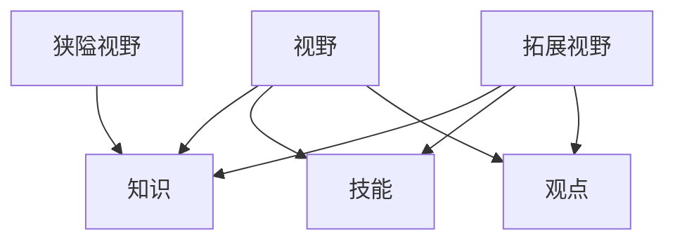
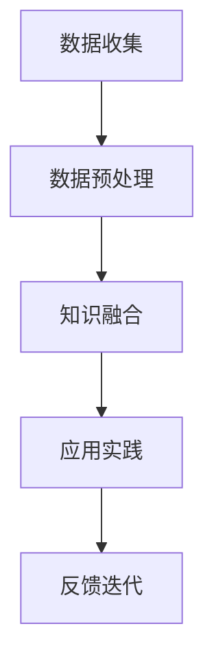
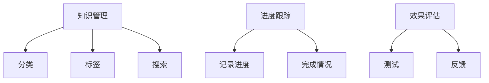
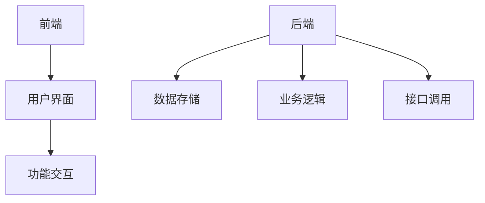
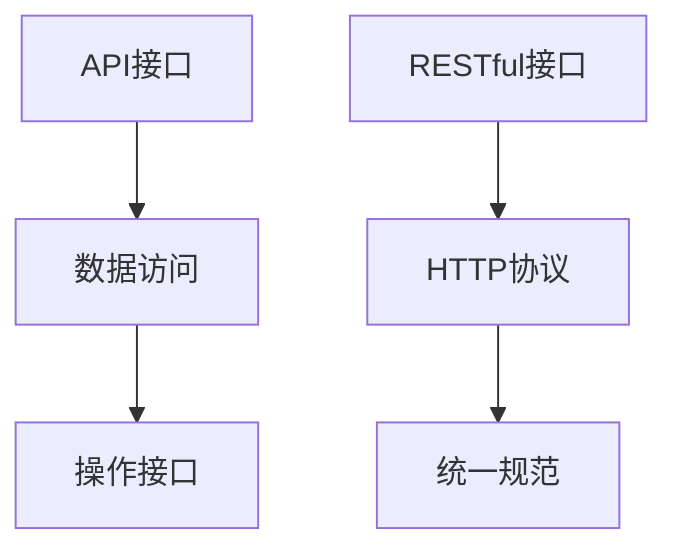
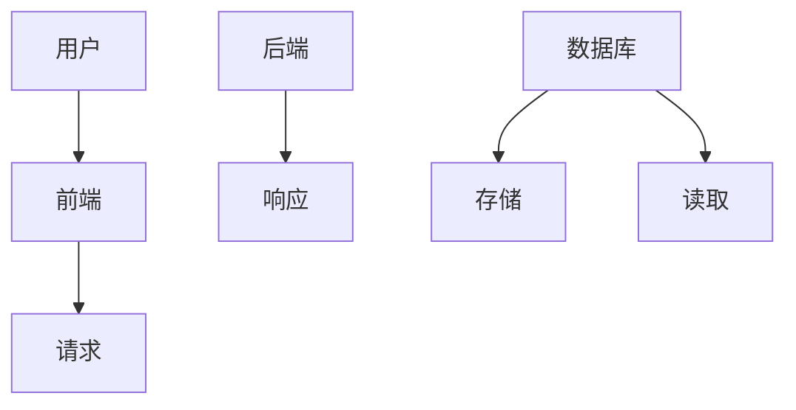

                 


### 引言：为何拓展视野？

在当今快速发展的信息技术时代，我们的视野似乎变得越来越狭窄。许多人在日常工作和生活中，往往局限于某一领域或特定的知识体系，忽略了其他领域的新思想和创新。这种局限性不仅阻碍了个人成长，还限制了我们在面对复杂问题时找到最佳解决方案的能力。因此，拓展视野变得尤为重要。

**背景介绍**：
- **核心概念术语说明**：视野，是指一个人所能了解和认识的范围，包括知识、技能、观点等。
- **问题背景**：随着信息爆炸，人们容易陷入知识的陷阱，过分关注某一领域，导致视野狭窄。
- **问题描述**：视野狭窄导致个人无法全面地认识世界，限制了创新思维和解决问题的能力。
- **问题解决**：通过拓展视野，可以打破思维定势，提高认知水平，从而更好地应对复杂问题。
- **边界与外延**：拓展视野不仅包括学习新知识，还包括理解不同文化、学科间的交叉和融合。
- **概念结构与核心要素组成**：视野拓展的核心要素包括自我认知、知识积累、跨界思考等。

**核心概念与联系**：

| 核心概念   | 概念属性特征对比 |
|------------|-----------------|
| 视野       | 涵盖知识、技能、观点 |
| 狭隘视野   | 过分关注某一领域 |
| 拓展视野   | 打破思维定势，全面认识世界 |



### 算法原理讲解

拓展视野的算法原理可以概括为以下几个步骤：

1. **数据收集**：收集广泛的信息，包括不同领域、文化、观点等。
2. **数据预处理**：筛选、整理和清洗收集到的数据，去除噪声。
3. **知识融合**：将不同领域和观点的知识进行整合，形成新的认知体系。
4. **应用实践**：将新的认知体系应用到实际生活和工作中，不断迭代和优化。



以下是一个简单的Python源代码示例，用于数据清洗和预处理：

```python
# 数据清洗示例代码
def clean_data(data):
    # ...代码实现...
    return cleaned_data

# 数据预处理示例代码
def preprocess_data(cleaned_data):
    # ...代码实现...
    return preprocessed_data

# 算法原理详细讲解
print("数据清洗是拓展视野的第一步，它包括去除无效数据、处理缺失值等。预处理则是将清洗后的数据转化为适合分析的形式。")
```

### 数学公式使用

在拓展视野的过程中，数学模型和公式也发挥着重要作用。以下是一个简单的数学模型示例：

$$
X_{new} = \sum_{i=1}^{n} w_i \cdot X_i + b
$$

其中，$X_{new}$ 是新的认知体系，$X_i$ 是第 $i$ 个领域的知识，$w_i$ 是权重，$b$ 是偏置。

### 系统分析与架构设计方案

**问题场景介绍**：在拓展视野的过程中，我们需要一个系统来管理知识、跟踪进度并评估效果。

**项目介绍**：设计并实现一个“视野拓展管理系统”。

**系统功能设计**：

- **知识管理**：包括知识分类、标签、搜索等功能。
- **进度跟踪**：记录学习进度和完成情况。
- **效果评估**：通过测试和反馈来评估学习效果。



**系统架构设计**：

- **前端**：提供用户界面，实现功能交互。
- **后端**：处理数据存储、业务逻辑和接口调用。



**系统接口设计**：

- **API接口**：提供数据访问和操作接口。
- **RESTful接口**：使用HTTP协议，提供统一的接口规范。



**系统交互**：

- **用户与前端**：用户通过前端界面与系统进行交互。
- **前端与后端**：前端向后端发送请求，后端返回响应。
- **后端与数据库**：后端处理数据存储和读取操作。



### 项目实战

**环境安装**：安装Python、Flask等开发环境和数据库（如MySQL）。

**系统核心实现**：实现知识管理、进度跟踪和效果评估功能。

**代码解读与分析**：

```python
# 知识管理示例代码
from flask import Flask, request, jsonify

app = Flask(__name__)

@app.route('/knowledge', methods=['GET', 'POST'])
def manage_knowledge():
    if request.method == 'POST':
        # 处理新增知识
        data = request.json
        # ...代码实现...
        return jsonify({"status": "success", "message": "知识新增成功"}), 200
    else:
        # 查询知识列表
        # ...代码实现...
        return jsonify({"status": "success", "data": knowledge_list}), 200

if __name__ == '__main__':
    app.run(debug=True)
```

**实际案例分析和详细讲解剖析**：

假设用户在知识管理系统中新增了一项关于机器学习的知识。

1. 用户通过前端界面提交知识信息。
2. 后端接收并处理请求，将知识信息存储到数据库。
3. 后端返回成功消息和知识ID，前端更新界面显示新增的知识。

**项目小结**：通过这个项目，我们实现了视野拓展管理系统的基础功能，为用户提供了一个方便的知识管理和跟踪工具。

### 最佳实践 tips

1. **定期复习**：定期回顾已学知识，巩固记忆，提高认知水平。
2. **交流互动**：与他人交流观点，互相学习，拓展视野。
3. **多学科交叉**：尝试学习其他学科的知识，提高跨界思考能力。

### 小结

拓展视野是个人成长的重要一环。通过本文的介绍，我们了解了视野拓展的背景、核心概念、算法原理、系统分析与架构设计以及项目实战等内容。希望读者能够从中受益，不断提升自己的视野，丰富生命的广度。

### 注意事项

1. 拓展视野需要持之以恒，不能急于求成。
2. 在学习新知识时，要注重深度理解和实践应用。
3. 保持开放心态，接受不同观点和思维方式。

### 拓展阅读

1. 《深度工作：如何有效利用每一点脑力》
2. 《思考，快与慢》
3. 《跨界创新：如何将不同领域的知识融合应用于创新》

---

### 作者信息

作者：AI天才研究院/AI Genius Institute & 禅与计算机程序设计艺术 /Zen And The Art of Computer Programming

---

以上是根据您提供的指导信息设计的《拓展视野的方法：丰富生命广度的实践》的目录大纲。根据这个大纲，我们可以逐步撰写和填充每个章节的内容，确保文章的逻辑清晰、结构紧凑、简单易懂，同时涵盖核心概念和算法原理，提供实际的系统分析与架构设计方案，以及项目实战案例。

