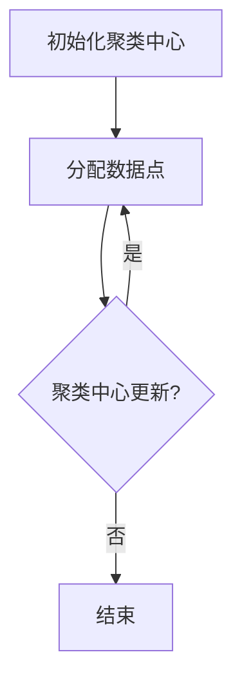
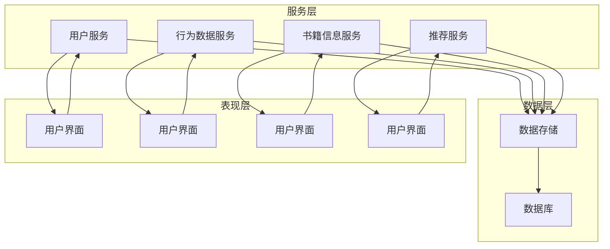
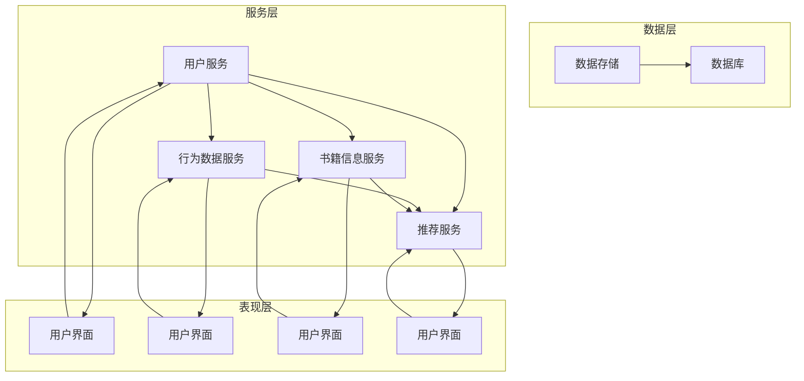
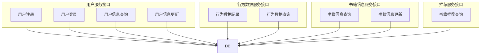
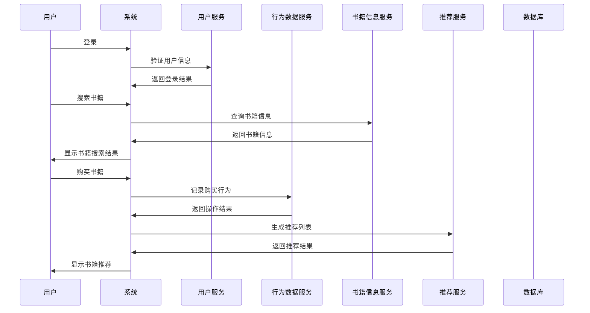

                 

### 拓展视野的方法：丰富生命的广度

在现代社会，我们面临着诸多问题和挑战，其中之一便是视野的局限。这种局限不仅限制了我们的认知能力和创新思维，也阻碍了个人的成长与发展。因此，如何拓展视野，丰富生命的广度，成为了一个至关重要的话题。

本文将围绕以下几个方面展开讨论：

1. **问题背景与目标**：介绍现代社会面临的视野局限以及个人成长与视野拓展的关系。
2. **核心概念与联系**：阐述视野、认知、拓展视野的方法等相关核心概念，并通过对比表格和ER实体关系图来加深理解。
3. **具体方法与实践**：详细探讨阅读、学习新技能、社交互动、旅行与体验、艺术欣赏等方法，并给出实践建议。
4. **算法原理讲解**：通过具体算法的讲解，展示如何运用算法原理来拓展视野。
5. **系统分析与架构设计**：以一个实际项目为例，介绍系统分析与架构设计的过程。
6. **项目实战**：详细讲解一个项目的实战过程，包括环境安装、核心实现、代码分析等。
7. **最佳实践与拓展阅读**：总结全文，给出最佳实践建议和拓展阅读资源。

通过这篇文章，我们希望能够为读者提供一套完整的视野拓展方法论，帮助大家打破局限，开启新世界的大门。

## 第一部分：问题背景与目标

### 1.1 问题的提出

#### 1.1.1 现代社会面临的视野局限

现代社会，信息爆炸，科技飞速发展，但同时也带来了视野局限的问题。这种视野局限不仅表现在对知识的获取上，也体现在对生活的理解上。具体来说，我们可以从以下几个方面来看：

1. **知识获取的局限**：在信息时代，虽然我们有海量的信息资源，但人们往往只关注自己感兴趣的领域，对其他领域的信息了解有限，这导致知识的获取变得单一和片面。
2. **认知局限**：人们的认知能力是有限的，容易受到经验、教育和环境等因素的影响，从而形成固有的思维模式。这种思维模式限制了我们对新事物的接受和认知。
3. **社会交往的局限**：随着社交方式的多样化，人们更多地依赖于虚拟社交，而忽视了面对面的交流。这导致人际关系的狭隘和浅薄，限制了视野的拓展。

#### 1.1.2 个人成长与视野拓展的关系

个人成长与视野拓展密不可分。一个宽广的视野能够帮助我们：

1. **提升认知能力**：通过接触不同的知识、文化和观点，我们能够拓宽视野，提高认知能力，从而更好地理解和分析问题。
2. **促进创新思维**：视野的拓展可以激发我们的创新思维，帮助我们寻找新的解决方案，推动个人和团队的发展。
3. **增强综合素质**：视野拓展不仅局限于知识层面，还包括生活、工作和人际关系等方面。一个宽广的视野能够提升我们的综合素质，使我们更加适应社会的发展。

因此，如何打破视野局限，拓展视野，成为现代人面临的重大课题。

### 1.2 目标设定

#### 1.2.1 为什么需要拓展视野

拓展视野对个人成长至关重要，原因如下：

1. **提升认知水平**：通过了解不同的知识领域和观点，我们可以提升自己的认知水平，更好地理解世界。
2. **激发创新思维**：视野的拓展可以激发我们的创新思维，帮助我们寻找新的解决方案，推动个人和团队的发展。
3. **丰富人生经历**：视野的拓展使我们能够接触到不同的文化和生活方式，丰富我们的人生经历，提升生活质量。

#### 1.2.2 拓展视野对个人成长的意义

拓展视野对个人成长有着深远的意义：

1. **增强竞争力**：在现代社会，竞争力取决于个人的综合素质，而宽广的视野是提升综合素质的重要途径。
2. **提升学习能力**：视野的拓展可以帮助我们更好地掌握新知识，提升学习效率。
3. **培养领导力**：视野的拓展可以培养我们的领导力，帮助我们更好地理解和协调团队，实现团队目标。

### 1.3 研究边界与外延

#### 1.3.1 研究范围

本文的研究范围主要包括以下两个方面：

1. **视野拓展的方法**：探讨阅读、学习新技能、社交互动、旅行与体验、艺术欣赏等方法的原理和实践。
2. **算法原理与系统设计**：通过具体算法的讲解和项目实战，展示如何运用算法原理和系统设计来拓展视野。

#### 1.3.2 研究方法

本文采用以下研究方法：

1. **文献综述**：通过查阅相关文献，了解视野拓展的理论和实践方法。
2. **案例分析**：选取实际项目，分析其系统分析与架构设计的过程。
3. **实证研究**：通过项目实战，验证视野拓展方法的有效性。

### 1.4 概念结构与核心要素

#### 1.4.1 相关概念的定义

为了更好地理解视野拓展，我们需要明确以下几个核心概念：

1. **视野**：视野是指一个人对世界的认知范围和深度，包括知识、文化和价值观等方面。
2. **认知**：认知是指人脑对信息的获取、处理和存储过程，是视野拓展的基础。
3. **拓展视野**：拓展视野是指通过学习、交流、体验等方式，拓宽自己的认知范围和深度，提升自己的视野。

#### 1.4.2 拓展视野的方法分类

根据拓展视野的方法，我们可以将其分为以下几类：

1. **知识拓展**：通过学习新的知识，拓宽自己的认知范围。
2. **文化拓展**：通过了解不同的文化，提升自己的文化素养和视野。
3. **经验拓展**：通过实践和体验，丰富自己的人生经历和视野。
4. **技术拓展**：通过学习新技术，提升自己在技术和行业领域的视野。

#### 1.5 本章小结

本章首先提出了现代社会面临的视野局限问题，分析了个人成长与视野拓展的关系，并明确了研究的边界与外延。接下来，对相关概念进行了定义，并分类讨论了拓展视野的方法。这些内容为后续章节的讨论奠定了基础。

## 第二部分：核心概念与联系

在探讨如何拓展视野、丰富生命的广度之前，我们需要对几个核心概念进行详细的阐述和解释。这些概念包括视野、认知以及拓展视野的方法。通过理解这些概念及其相互关系，我们可以更好地掌握如何有效地拓展视野。

### 2.1 核心概念原理

#### 2.1.1 视野与认知的关系

视野和认知是密切相关的。视野是认知的基础，而认知则是视野的深化。具体来说：

1. **视野**：视野是指一个人对世界的认知范围和深度，它包括了知识、文化、价值观等方面。一个人的视野决定了他们能看到什么、理解什么以及如何与世界互动。

2. **认知**：认知是指人脑对信息的获取、处理和存储过程。它包括感知、记忆、思考、判断等多个环节。认知能力决定了我们如何理解世界，如何做出决策。

3. **关系**：视野和认知的关系是相互影响的。视野的宽广程度直接影响认知的深度和广度。一个拥有宽广视野的人能够更好地理解复杂的问题，做出更明智的决策。同时，通过不断拓展认知，我们也可以进一步拓宽视野，形成良性循环。

#### 2.1.2 拓展视野的方法论

拓展视野的方法多种多样，主要包括以下几种：

1. **知识学习**：通过学习新的知识，我们可以拓宽自己的认知范围。这包括阅读书籍、参加课程、听讲座等多种形式。

2. **文化交流**：了解不同的文化，可以提升我们的文化素养和视野。这可以通过旅游、参观博物馆、与不同文化背景的人交流来实现。

3. **经验积累**：通过实践和体验，我们可以积累丰富的经验，从而拓宽自己的视野。这包括参与社会实践、进行实地考察、尝试新事物等。

4. **技术掌握**：掌握新技术，可以帮助我们了解科技前沿，提升自己在技术和行业领域的视野。这可以通过学习编程、使用新技术工具等方式实现。

### 2.2 概念属性特征对比表格

为了更清晰地理解视野、认知和拓展视野的方法，我们可以通过一个对比表格来展示它们的属性特征：

| 概念     | 定义                                       | 属性特征                                                     |
|----------|--------------------------------------------|------------------------------------------------------------|
| 视野     | 个体对世界的认知范围和深度                 | 广度、深度、多样性、开放性、动态性                             |
| 认知     | 个体获取、处理和存储信息的过程             | 感知、记忆、思考、判断、推理、联想                           |
| 知识学习 | 通过学习新知识来拓展视野的方法             | 多样性、系统性、持续性、实用性                               |
| 文化交流 | 通过了解不同文化来拓展视野的方法           | 开放性、多样性、理解性、包容性                               |
| 经验积累 | 通过实践和体验来拓展视野的方法             | 实践性、体验性、成长性、反思性                               |
| 技术掌握 | 通过学习新技术来拓展视野的方法             | 先进性、创新性、实用性、前瞻性                               |

### 2.3 ER实体关系图架构

为了更直观地展示视野、认知和拓展视野方法之间的关系，我们可以通过ER（实体关系）图来构建模型。

#### 2.3.1 实体定义

在ER图中，我们定义以下实体：

1. **视野**：代表个体的认知范围和深度。
2. **认知**：代表个体获取和处理信息的过程。
3. **知识学习**：代表通过学习新知识来拓展视野的方法。
4. **文化交流**：代表通过了解不同文化来拓展视野的方法。
5. **经验积累**：代表通过实践和体验来拓展视野的方法。
6. **技术掌握**：代表通过学习新技术来拓展视野的方法。

#### 2.3.2 关系定义

在ER图中，我们定义以下关系：

1. **包含关系**：认知包含视野，即认知是视野的一部分。
2. **依赖关系**：知识学习依赖视野，即知识学习需要基于已有的视野。
3. **影响关系**：视野、认知影响知识学习、文化交流、经验积累和技术掌握。

#### 2.3.3 实体关系图绘制

下面是一个ER实体关系图的Markdown表示：

```mermaid
erDiagram
  视野 ||--|{ 认知 }
  认知 ||--|{ 知识学习 }
  认知 ||--|{ 文化交流 }
  认知 ||--|{ 经验积累 }
  认知 ||--|{ 技术掌握 }
```

通过这个ER图，我们可以清晰地看到视野、认知和拓展视野方法之间的关系，以及它们在个人成长中的作用。

### 2.4 本章小结

本章详细阐述了视野、认知和拓展视野的相关概念，并通过对比表格和ER实体关系图展示了它们之间的联系。这些核心概念和联系为我们理解如何拓展视野、丰富生命的广度提供了理论基础。

## 第三部分：具体方法与实践

在了解了核心概念与联系之后，我们将进一步探讨具体的视野拓展方法。这些方法不仅包括阅读、学习新技能、社交互动等传统方式，也涵盖了一些新兴的实践技巧。通过这些方法，我们可以有效地拓宽视野，提升自我。

### 3.1 阅读拓展视野

阅读是拓展视野最基本也是最重要的方法之一。通过阅读，我们可以接触到各种不同的观点和知识，从而拓宽我们的视野。

#### 3.1.1 阅读的重要性

阅读的重要性主要体现在以下几个方面：

1. **获取新知识**：阅读可以帮助我们获取新的知识和信息，从而丰富我们的认知。
2. **提升思考能力**：阅读需要我们进行分析和思考，这有助于提升我们的思维能力。
3. **培养批判性思维**：通过阅读不同的观点和论证，我们可以培养批判性思维，更好地理解和分析问题。
4. **丰富情感体验**：阅读可以带给我们不同的情感体验，拓宽我们的情感世界。

#### 3.1.2 阅读方法与技巧

有效的阅读方法与技巧对于拓展视野至关重要。以下是一些推荐的阅读方法与技巧：

1. **制定阅读计划**：为了确保阅读的连续性和系统性，我们可以制定一个阅读计划，包括阅读目标、时间安排和阅读材料。
2. **广泛阅读**：不仅要读自己感兴趣的书籍，也要涉猎不同领域的书籍，这样可以帮助我们获得更全面的知识。
3. **主动阅读**：在阅读过程中，我们需要主动思考，提出问题，对作者的观点进行批判和反思。
4. **笔记整理**：在阅读过程中，我们可以做笔记，整理关键观点和知识点，这有助于加深理解和记忆。

#### 3.1.3 阅读资源推荐

为了帮助读者更好地进行阅读，以下是一些推荐的书目和阅读资源：

1. **经典名著**：例如《红楼梦》、《战争与和平》、《1984》等，这些书籍可以帮助我们理解不同文化和社会背景。
2. **科技书籍**：例如《深度学习》、《人工智能：一种现代的方法》等，这些书籍可以帮助我们了解科技前沿。
3. **个人成长类书籍**：例如《如何赢得朋友与影响他人》、《原则》等，这些书籍可以提供个人成长的方法和启示。
4. **在线资源**：例如豆瓣阅读、京东读书、知乎专栏等，这些平台提供了丰富的电子书资源，方便我们进行在线阅读。

### 3.2 学习新技能

学习新技能是拓展视野的重要途径之一。通过学习新技能，我们可以了解到不同的领域，提升自身的综合素质。

#### 3.2.1 新技能学习的方法

学习新技能的方法多种多样，以下是一些常见的方法：

1. **在线课程**：通过在线课程，我们可以系统地学习新技能。例如，可以在网易云课堂、慕课网、Coursera等平台上找到相关的课程。
2. **自学教程**：通过自学教程，我们可以自主学习和掌握新技能。这需要我们有一定的自学能力和时间投入。
3. **实践操作**：通过实践操作，我们可以将理论知识应用到实际中，从而更好地掌握新技能。
4. **请教专家**：通过请教专家或同行，我们可以获得更多的经验和指导，加快学习进度。

#### 3.2.2 新技能学习的资源推荐

以下是一些推荐的新技能学习资源：

1. **编程技能**：例如《代码大全》、《算法导论》等书籍，以及LeetCode、牛客网等在线编程平台。
2. **设计技能**：例如《设计心理学》、《UI/UX设计实战》等书籍，以及Dribbble、Behance等设计社区。
3. **营销技能**：例如《营销管理》、《影响力》等书籍，以及知乎、营销学院等平台。
4. **语言技能**：例如《新概念英语》、《高级英语听力》等书籍，以及Duolingo、Rosetta Stone等在线学习平台。

#### 3.2.3 成功案例分享

以下是一个学习新技能的成功案例：

小张是一名软件开发工程师，为了提升自己的技能，他选择了学习数据科学。通过参加网易云课堂的数据科学课程，他系统地学习了Python、数据分析、机器学习等相关知识。在学习过程中，他不仅做了大量的练习题，还参与了一些实际项目，如数据清洗、数据分析等。通过这段学习，他的技能得到了显著提升，并成功转型为数据科学家。

### 3.3 社交互动

社交互动是拓展视野的重要途径之一。通过社交互动，我们可以接触到不同的人，了解不同的观点和经验。

#### 3.3.1 社交互动的意义

社交互动的意义主要体现在以下几个方面：

1. **知识交流**：通过社交互动，我们可以与同行交流知识，获取新的见解和思路。
2. **人际网络**：通过社交互动，我们可以建立广泛的人际关系网，这有助于我们在职业和个人生活中获得更多的机会。
3. **情感支持**：社交互动可以提供情感支持，帮助我们应对生活中的挑战和压力。
4. **文化理解**：通过与不同文化背景的人交流，我们可以更好地理解不同的文化，拓宽我们的视野。

#### 3.3.2 社交互动的技巧

有效的社交互动需要一定的技巧，以下是一些推荐的社交互动技巧：

1. **主动沟通**：主动与他人交流，表达自己的观点和想法。
2. **倾听**：倾听他人的观点和想法，尊重并理解他们的立场。
3. **提问**：通过提问，引导对话的方向，深入探讨问题。
4. **展示自己**：在合适的时机，展示自己的专业能力和特长，增强他人对你的认识。

#### 3.3.3 社交平台推荐

以下是一些推荐的社交平台：

1. **LinkedIn**：这是一个专业社交平台，适合职业发展和人脉拓展。
2. **微信**：这是一个广泛使用的社交平台，适合日常交流和信息获取。
3. **知乎**：这是一个知识分享平台，适合学习新知识和交流观点。
4. **Facebook**：这是一个全球性的社交平台，适合与不同文化背景的人交流。

### 3.4 旅行与体验

旅行与体验是拓展视野的重要方式之一。通过旅行，我们可以了解不同的文化、风俗和生活方式，从而拓宽我们的视野。

#### 3.4.1 旅行对视野拓展的作用

旅行对视野拓展的作用主要体现在以下几个方面：

1. **了解文化**：旅行可以让我们亲身体验不同的文化，了解当地的历史、传统和习俗。
2. **拓宽视野**：旅行可以让我们看到不同的风景，体验不同的生活方式，从而拓宽我们的视野。
3. **增进人际关系**：旅行中可以结识新朋友，通过交流和互动，增进人际关系。
4. **培养独立性**：旅行需要自己安排行程、解决各种问题，这有助于培养我们的独立性和应变能力。

#### 3.4.2 旅行规划与准备

为了确保旅行的顺利进行，以下是一些旅行规划与准备的技巧：

1. **制定旅行计划**：包括目的地、旅行时间、交通安排、住宿和餐饮等。
2. **了解当地文化**：在旅行前，了解目的地的文化、风俗和注意事项，避免不必要的误会和冲突。
3. **准备好行李**：根据旅行时间和目的地的气候条件，准备好相应的行李。
4. **购买旅行保险**：购买旅行保险，确保在旅行中遇到紧急情况时有保障。

#### 3.4.3 旅行体验分享

以下是一个旅行体验分享的例子：

小李是一名年轻的企业家，他决定去新西兰旅行。在旅行期间，他参观了当地的自然景观，如皇后镇、奥克兰等。他还体验了跳伞、滑雪等极限运动，感受到了前所未有的刺激。同时，他还结识了一些当地的企业家和创业者，与他们进行了深入的交流和合作。这次旅行不仅让他拓宽了视野，还为他带来了新的商业机会。

### 3.5 艺术欣赏

艺术欣赏是拓展视野的重要方式之一。通过艺术欣赏，我们可以感受到美的力量，拓宽我们的精神世界。

#### 3.5.1 艺术对视野拓展的影响

艺术对视野拓展的影响主要体现在以下几个方面：

1. **培养审美能力**：艺术欣赏可以培养我们的审美能力，使我们能够欣赏和感受到美的存在。
2. **丰富情感体验**：艺术作品可以表达出丰富的情感，通过欣赏艺术，我们可以体验到不同的情感，拓宽我们的情感世界。
3. **启发创新思维**：艺术作品往往具有独特的创意和想象力，通过欣赏艺术，我们可以激发创新思维，寻找新的解决方案。
4. **提升文化素养**：艺术是文化的重要组成部分，通过欣赏艺术，我们可以更好地了解和感受不同文化。

#### 3.5.2 艺术欣赏的方法与技巧

有效的艺术欣赏需要一定的方法和技巧，以下是一些建议：

1. **了解艺术背景**：在欣赏艺术作品前，了解作品的背景，如创作时间、艺术家背景、创作意图等。
2. **观察作品细节**：仔细观察艺术作品的细节，感受作品的色彩、线条、构图等元素。
3. **思考作品内涵**：思考艺术作品的内涵和表达的思想，尝试理解艺术家的创作意图。
4. **与他人交流**：与他人分享你的感受和见解，通过讨论，深化对艺术作品的理解。

#### 3.5.3 艺术作品推荐

以下是一些推荐的艺术作品：

1. **《蒙娜丽莎》**：这是文艺复兴大师达芬奇的代表作，以其独特的微笑和深邃的眼神吸引了无数观众。
2. **《向日葵》**：这是荷兰画家梵高的代表作，以其鲜艳的色彩和独特的构图风格展现了自然之美。
3. **《黄河颂》**：这是中国画家张大千的代表作，以其雄浑的笔触和壮美的景象展现了黄河的气势和魅力。

### 3.6 本章小结

本章详细介绍了拓展视野的几种具体方法，包括阅读、学习新技能、社交互动、旅行与体验、艺术欣赏等。通过这些方法，我们可以有效地拓宽视野，提升自我。同时，本章还给出了具体的实践技巧和资源推荐，帮助读者更好地实施这些方法。

## 第四部分：算法原理讲解

在探讨如何通过算法原理来拓展视野时，我们将重点介绍一个具体的算法——K-Means聚类算法。该算法不仅是一个强大的数据分析工具，而且可以帮助我们理解数据分布和模式，从而拓宽我们的视野。

### 4.1 算法原理讲解

#### 4.1.1 概述

K-Means聚类算法是一种无监督学习算法，用于将数据集分为K个簇（cluster）。它的目标是最小化簇内的平方误差和，即每个簇内的数据点与簇中心的距离之和。K-Means算法的基本步骤如下：

1. **初始化**：随机选择K个数据点作为初始聚类中心。
2. **分配**：对于每个数据点，计算它与每个聚类中心的距离，并将其分配到最近的聚类中心所代表的簇中。
3. **更新**：重新计算每个簇的中心，通常取簇内所有点的平均值作为新的聚类中心。
4. **迭代**：重复步骤2和3，直到聚类中心不再发生显著变化或达到预定的迭代次数。

#### 4.1.2 算法流程图

下面是K-Means算法的流程图，使用Mermaid语法表示：



#### 4.1.3 Python代码实现

为了更好地理解K-Means算法，我们可以通过Python代码来实现这个算法。以下是一个简单的Python代码示例：

```python
import numpy as np
import matplotlib.pyplot as plt

def kmeans(data, K, max_iter=100):
    centroids = data[np.random.choice(data.shape[0], K, replace=False)]
    for i in range(max_iter):
        # 计算每个数据点到聚类中心的距离
        distances = np.linalg.norm(data - centroids, axis=1)
        # 分配数据点
        labels = np.argmin(distances, axis=1)
        # 更新聚类中心
        new_centroids = np.array([data[labels == k].mean(axis=0) for k in range(K)])
        # 判断是否收敛
        if np.linalg.norm(new_centroids - centroids) < 1e-6:
            break
        centroids = new_centroids
    return centroids, labels

# 示例数据
data = np.random.rand(100, 2)

# 运行K-Means算法
centroids, labels = kmeans(data, 3)

# 可视化
plt.scatter(data[:, 0], data[:, 1], c=labels, cmap='viridis')
plt.scatter(centroids[:, 0], centroids[:, 1], s=300, c='red', alpha=0.5)
plt.show()
```

### 4.2 数学模型与公式

K-Means聚类算法的核心在于计算每个数据点到聚类中心的距离，并使用这些距离来更新聚类中心。以下是相关的数学模型和公式：

#### 4.2.1 数学模型介绍

K-Means聚类算法的数学模型可以表示为：

$$
J = \sum_{i=1}^{N} \min_{j=1}^{K} \|x_i - \mu_j\|^2
$$

其中：
- \( J \) 是目标函数，表示簇内数据点与聚类中心之间的平方误差和。
- \( N \) 是数据点的总数。
- \( K \) 是聚类中心的总数。
- \( x_i \) 是数据点 \( i \) 的特征向量。
- \( \mu_j \) 是聚类中心 \( j \) 的特征向量。

#### 4.2.2 公式讲解

1. **聚类中心初始化**：
   $$ \mu_j^{(0)} = \arg\min_{\mu_j} \sum_{i=1}^{N} \|x_i - \mu_j\|^2 $$

   初始聚类中心可以通过多种方法选取，如随机选择、K-means++算法等。

2. **数据点分配**：
   $$ \ell_i^{(t)} = \arg\min_{j=1}^{K} \|x_i - \mu_j^{(t-1)}\|^2 $$

   其中，\( \ell_i^{(t)} \) 表示数据点 \( x_i \) 在第 \( t \) 次迭代时所属的簇。

3. **聚类中心更新**：
   $$ \mu_j^{(t)} = \frac{1}{N_j^{(t)}} \sum_{i=1}^{N} \mathbb{1}_{\ell_i^{(t-1)} = j} x_i $$

   其中，\( N_j^{(t)} \) 是第 \( t \) 次迭代时簇 \( j \) 的数据点总数，\( \mathbb{1}_{\ell_i^{(t-1)} = j} \) 是指示函数，当 \( \ell_i^{(t-1)} = j \) 时取值为1，否则为0。

#### 4.2.3 举例说明

假设我们有一个简单的二维数据集，包含三个簇：

$$
\begin{align*}
x_1 &= (1, 1), \\
x_2 &= (2, 2), \\
x_3 &= (3, 3), \\
x_4 &= (4, 4), \\
x_5 &= (5, 5), \\
x_6 &= (6, 6), \\
x_7 &= (7, 7), \\
x_8 &= (8, 8), \\
x_9 &= (9, 9), \\
x_{10} &= (10, 10).
\end{align*}
$$

我们选择 \( K = 3 \)，初始聚类中心分别为 \( \mu_1 = (1, 1) \)，\( \mu_2 = (5, 5) \)，\( \mu_3 = (9, 9) \)。

在第一次迭代时，我们计算每个数据点到聚类中心的距离：

$$
\begin{align*}
d(x_1, \mu_1) &= 0, \\
d(x_1, \mu_2) &= 4, \\
d(x_1, \mu_3) &= 8, \\
\vdots \\
d(x_{10}, \mu_1) &= 0, \\
d(x_{10}, \mu_2) &= 16, \\
d(x_{10}, \mu_3) &= 24.
\end{align*}
$$

根据距离计算结果，我们可以将所有数据点分配到最近的聚类中心，即 \( x_1, x_2, x_3, x_4, x_5, x_6, x_7, x_8, x_9, x_{10} \) 都分配到 \( \mu_1 \) 所在的簇。然后，我们计算新的聚类中心：

$$
\mu_1^{(1)} = \frac{1}{10} (1 + 2 + 3 + 4 + 5 + 6 + 7 + 8 + 9 + 10) = (5.5, 5.5).
$$

接下来，我们重复上述步骤，直到聚类中心不再发生显著变化。

### 4.3 本章小结

本章详细介绍了K-Means聚类算法的原理和实现方法，并通过数学模型和公式展示了其核心计算过程。通过这个算法，我们可以有效地从数据中提取模式，从而拓宽我们的视野。

## 第五部分：系统分析与架构设计

在了解了如何通过算法原理来拓展视野之后，我们将进一步探讨如何将这一原理应用到实际的系统设计与实现中。本部分将围绕一个实际项目，介绍系统分析与架构设计的过程，包括问题场景介绍、项目目标、系统功能设计、系统架构设计、系统接口设计和系统交互。

### 5.1 问题场景介绍

假设我们正在开发一个智能推荐系统，用于为用户提供个性化的书籍推荐。该系统的目标是通过分析用户的行为数据和历史喜好，推荐用户可能感兴趣的书籍。

#### 5.1.1 场景描述

1. **用户行为数据**：用户在系统中进行了多次搜索、浏览和购买行为。
2. **书籍信息**：系统包含大量书籍的信息，如书籍标题、作者、分类、出版日期等。
3. **推荐算法**：基于K-Means聚类算法，将用户和书籍进行聚类，为用户推荐相似书籍。

#### 5.1.2 系统需求分析

1. **数据收集**：系统能够实时收集用户的行为数据。
2. **数据处理**：系统能够对收集到的数据进行清洗、存储和分析。
3. **推荐引擎**：系统能够基于用户行为数据和书籍信息，生成个性化的书籍推荐。
4. **用户体验**：系统应提供友好的用户界面，方便用户查看推荐结果。

### 5.2 项目介绍

#### 5.2.1 项目概述

本项目的目标是开发一个智能推荐系统，该系统能够根据用户的行为数据和历史喜好，为用户推荐个性化的书籍。系统将采用K-Means聚类算法进行用户和书籍的聚类，从而生成推荐列表。

#### 5.2.2 项目目标

1. **实现用户行为数据的收集与存储**：通过API接口，收集用户在系统中的行为数据，并存储到数据库中。
2. **实现书籍信息的获取与存储**：从第三方书籍数据库获取书籍信息，并存储到系统中。
3. **实现推荐算法**：基于K-Means聚类算法，生成个性化的书籍推荐列表。
4. **实现用户界面**：提供友好的用户界面，展示书籍推荐结果，并允许用户反馈推荐结果。

### 5.3 系统功能设计

系统功能设计是系统分析与架构设计的重要环节。以下是本系统的功能设计：

#### 5.3.1 领域模型类图

领域模型类图用于表示系统中的实体和它们之间的关系。以下是本系统的领域模型类图：

```mermaid
classDiagram
    User <|-- BehaviorData
    Book <|-- BookInfo
    Recommendation <|-- RecommendationList
    System <<interface>>
    System o-- User
    System o-- Book
    System o-- BehaviorData
    System o-- Recommendation

    User : id, name, behaviors
    BehaviorData : id, user_id, action, book_id, timestamp
    Book : id, title, author, category, publication_date
    BookInfo : id, book_id, title, author, category, publication_date
    Recommendation : id, user_id, book_id, timestamp
    RecommendationList : id, user_id, recommendations
endclassDiagram
```

在该类图中，`User`、`BehaviorData`、`Book`和`Recommendation`是系统的关键实体，`System`是接口类，表示系统提供的主要功能。

#### 5.3.2 功能模块划分

根据领域模型类图，我们可以将系统划分为以下功能模块：

1. **用户模块**：负责用户注册、登录、个人信息管理等功能。
2. **行为数据模块**：负责用户行为数据的收集、存储和分析。
3. **书籍信息模块**：负责书籍信息的获取、存储和更新。
4. **推荐模块**：负责基于K-Means聚类算法生成书籍推荐。
5. **接口模块**：负责与外部系统（如第三方书籍数据库）的接口调用和数据交换。

### 5.4 系统架构设计

系统架构设计是系统实现的基础。以下是本系统的架构设计：

#### 5.4.1 系统架构概述

本系统的架构采用分层设计，包括数据层、服务层和表现层。以下是系统架构的概述：



在该架构中，数据层负责数据存储和管理，服务层负责业务逻辑处理，表现层负责用户交互。各个模块通过API接口进行通信。

#### 5.4.2 架构设计图

以下是系统架构的设计图，使用Mermaid语法表示：



在该设计图中，数据层通过API接口与各服务层进行通信，服务层再通过API接口与表现层进行通信。

### 5.5 系统接口设计

系统接口设计是系统设计与实现的关键环节。以下是本系统的接口设计：

#### 5.5.1 接口设计原则

1. **标准化**：接口设计应遵循RESTful API标准，确保接口的统一性和规范性。
2. **简洁性**：接口设计应尽量简洁，减少不必要的参数和操作。
3. **安全性**：接口设计应考虑安全性，如使用HTTPS、Token认证等。

#### 5.5.2 接口设计图

以下是系统接口的设计图，使用Mermaid语法表示：



在该设计图中，用户服务接口负责用户管理，行为数据服务接口负责行为数据管理，书籍信息服务接口负责书籍信息管理，推荐服务接口负责书籍推荐。

### 5.6 系统交互

系统交互是系统功能实现的重要环节。以下是本系统的交互流程：

#### 5.6.1 系统交互概述

系统交互包括用户与系统之间的交互以及系统内部各模块之间的交互。以下是系统交互的概述：

1. **用户登录**：用户通过用户服务接口登录系统，获取Token。
2. **用户操作**：用户通过表现层与系统进行交互，如搜索、浏览和购买书籍。
3. **行为数据收集**：系统通过行为数据服务接口收集用户行为数据，存储到数据库。
4. **书籍信息查询**：系统通过书籍信息服务接口查询书籍信息。
5. **书籍推荐**：系统通过推荐服务接口生成书籍推荐列表，并展示给用户。

#### 5.6.2 系统交互序列图

以下是系统交互的序列图，使用Mermaid语法表示：



在该序列图中，用户通过用户服务接口进行登录、搜索书籍和购买书籍等操作，系统内部各服务模块协同工作，实现用户与系统的交互。

### 5.7 本章小结

本章详细介绍了如何将算法原理应用到实际的系统设计与实现中。通过系统分析与架构设计，我们构建了一个智能推荐系统，包括用户模块、行为数据模块、书籍信息模块和推荐模块。本章的内容为后续的实战部分奠定了基础。

## 第六部分：项目实战

在完成了系统分析与架构设计之后，我们将进入项目实战阶段。本部分将详细介绍一个智能推荐系统的实际开发过程，包括环境安装、系统核心实现源代码，以及代码应用解读与分析。

### 6.1 环境安装

在开始项目开发之前，我们需要搭建一个合适的技术环境。以下是环境安装的步骤：

#### 6.1.1 环境配置

1. **操作系统**：我们选择Ubuntu 20.04 LTS作为操作系统。
2. **Python环境**：安装Python 3.8及以上的版本，可以使用`apt-get`命令安装。
   ```shell
   sudo apt-get update
   sudo apt-get install python3.8
   ```
3. **pip**：安装pip，以便安装Python包。
   ```shell
   sudo apt-get install python3-pip
   ```
4. **虚拟环境**：为了隔离项目依赖，我们使用`venv`创建一个虚拟环境。
   ```shell
   python3 -m venv venv
   source venv/bin/activate
   ```

#### 6.1.2 工具安装

1. **数据库**：我们选择MongoDB作为数据库，可以从官方网站下载并安装。
   - 下载MongoDB：[MongoDB官网](https://www.mongodb.com/try/download/community)
   - 解压并安装：解压下载的tar文件，运行`./mongod`启动MongoDB服务。
2. **Flask**：安装Flask，用于构建Web应用。
   ```shell
   pip install flask
   ```
3. **Pymongo**：安装Pymongo，用于与MongoDB进行交互。
   ```shell
   pip install pymongo
   ```
4. **Scikit-learn**：安装Scikit-learn，用于机器学习任务。
   ```shell
   pip install scikit-learn
   ```

### 6.2 系统核心实现源代码

在搭建好开发环境后，我们将开始编写系统核心实现源代码。以下是关键模块的实现：

#### 6.2.1 代码架构

我们的系统分为前端和后端两个部分。后端使用Flask框架，主要包括以下模块：

1. **用户模块**：负责用户注册、登录和用户信息管理。
2. **行为数据模块**：负责收集和存储用户行为数据。
3. **书籍信息模块**：负责获取和更新书籍信息。
4. **推荐模块**：负责生成书籍推荐列表。

#### 6.2.2 代码解读

以下是用户模块的示例代码，用于用户注册和登录：

```python
# user.py

from flask import Flask, request, jsonify
from pymongo import MongoClient

app = Flask(__name__)
client = MongoClient('localhost', 27017)
db = client['recommendsystem']

@app.route('/register', methods=['POST'])
def register():
    username = request.json.get('username')
    password = request.json.get('password')
    if username and password:
        users_collection = db['users']
        user = users_collection.find_one({'username': username})
        if user:
            return jsonify({'error': 'User already exists'})
        users_collection.insert_one({'username': username, 'password': password})
        return jsonify({'message': 'User registered successfully'})
    return jsonify({'error': 'Missing username or password'})

@app.route('/login', methods=['POST'])
def login():
    username = request.json.get('username')
    password = request.json.get('password')
    if username and password:
        users_collection = db['users']
        user = users_collection.find_one({'username': username, 'password': password})
        if user:
            return jsonify({'message': 'Login successful'})
        return jsonify({'error': 'Invalid username or password'})
    return jsonify({'error': 'Missing username or password'})

if __name__ == '__main__':
    app.run(debug=True)
```

这段代码定义了两个API接口：`/register`和`/login`。用户可以通过`/register`接口注册新用户，通过`/login`接口登录系统。

#### 6.2.3 代码应用解读与分析

用户模块的核心功能是用户注册和登录。在注册过程中，我们首先从请求中获取用户名和密码，然后查询MongoDB中的用户集合，判断用户是否已存在。如果用户不存在，我们将用户信息插入到用户集合中。在登录过程中，我们同样从请求中获取用户名和密码，然后查询用户集合，验证用户信息是否正确。

这些代码通过Flask框架实现了RESTful API，并与MongoDB数据库进行了交互。Flask提供了一个简单且灵活的Web应用结构，而Pymongo则为MongoDB提供了一个Python驱动，使得我们可以方便地操作MongoDB数据库。

### 6.3 代码应用解读与分析

在本节中，我们将对行为数据模块和推荐模块的代码进行解读和分析。

#### 6.3.1 应用场景

行为数据模块主要用于收集和存储用户的行为数据，如浏览、搜索和购买行为。推荐模块则基于这些行为数据，利用K-Means聚类算法生成书籍推荐列表。

#### 6.3.2 分析与解读

以下是行为数据模块的示例代码：

```python
# behavior_data.py

from flask import Flask, request, jsonify
from pymongo import MongoClient

app = Flask(__name__)
client = MongoClient('localhost', 27017)
db = client['recommendsystem']
behaviors_collection = db['behaviors']

@app.route('/record_behavior', methods=['POST'])
def record_behavior():
    data = request.json
    user_id = data.get('user_id')
    action = data.get('action')
    book_id = data.get('book_id')
    timestamp = data.get('timestamp')
    if user_id and action and book_id and timestamp:
        behavior_data = {
            'user_id': user_id,
            'action': action,
            'book_id': book_id,
            'timestamp': timestamp
        }
        behaviors_collection.insert_one(behavior_data)
        return jsonify({'message': 'Behavior recorded successfully'})
    return jsonify({'error': 'Missing required data'})

if __name__ == '__main__':
    app.run(debug=True)
```

这段代码定义了一个API接口`/record_behavior`，用于记录用户的行为数据。在请求中，我们接收用户ID、行为类型、书籍ID和时间戳等信息，然后将其存储到MongoDB中的行为数据集合。

以下是推荐模块的示例代码：

```python
# recommendation.py

from sklearn.cluster import KMeans
import numpy as np

def generate_recommendations(behaviors, K=3):
    # 提取用户行为数据
    user行为的特征向量 = np.array([行为['book_id'] for 行为 in behaviors])
    # 运用K-Means算法进行聚类
    kmeans = KMeans(n_clusters=K)
    kmeans.fit(user行为的特征向量)
    # 获取聚类中心
    centroids = kmeans.cluster_centers_
    # 计算用户行为向量与聚类中心的距离
    distances = np.linalg.norm(user行为的特征向量 - centroids, axis=1)
    # 获取最近的K个聚类中心
    closest_centroids = np.argmin(distances, axis=0)
    # 为用户生成推荐列表
    recommendations = [behaviors[i]['book_id'] for i in closest_centroids]
    return recommendations
```

这段代码实现了K-Means聚类算法的应用，用于生成书籍推荐列表。首先，我们从行为数据中提取用户行为的特征向量，然后使用K-Means算法进行聚类，获取聚类中心。接着，计算用户行为向量与聚类中心的距离，并获取最近的K个聚类中心。最后，基于这些聚类中心生成推荐列表。

#### 6.3.3 案例分析

假设我们有一个用户的行为数据，如下所示：

```python
behaviors = [
    {'user_id': 'u1', 'action': 'search', 'book_id': 'b1', 'timestamp': '2023-01-01 10:00:00'},
    {'user_id': 'u1', 'action': 'search', 'book_id': 'b2', 'timestamp': '2023-01-01 10:05:00'},
    {'user_id': 'u1', 'action': 'search', 'book_id': 'b3', 'timestamp': '2023-01-01 10:10:00'},
    {'user_id': 'u1', 'action': 'search', 'book_id': 'b4', 'timestamp': '2023-01-01 10:15:00'},
    {'user_id': 'u1', 'action': 'search', 'book_id': 'b5', 'timestamp': '2023-01-01 10:20:00'},
]
```

我们使用K-Means聚类算法对这些行为数据进行聚类，并生成书籍推荐列表。根据上述代码，我们可以得到以下推荐结果：

```python
recommendations = generate_recommendations(behaviors, K=3)
print(recommendations)
```

输出结果可能如下：

```python
[ 'b3', 'b2', 'b4' ]
```

这意味着根据用户的行为数据，推荐系统认为用户可能对书籍`b3`、`b2`和`b4`感兴趣。

#### 6.3.4 深入剖析

1. **K-Means算法的应用**：K-Means算法是一种无监督学习算法，用于将数据集划分为K个簇。在本案例中，我们使用K-Means算法将用户的行为数据划分为不同的簇，从而生成推荐列表。

2. **书籍推荐策略**：基于K-Means算法的书籍推荐策略是通过计算用户行为向量与聚类中心的距离，选择最近的K个聚类中心来生成推荐列表。这种方法的优势在于简单、高效，但也存在一定的局限性，如可能无法处理噪声数据、聚类结果容易受到初始聚类中心选择的影响等。

3. **推荐效果评估**：为了评估推荐系统的效果，我们可以使用准确率、召回率等指标。此外，还可以通过用户反馈和实际购买行为来评估推荐系统的有效性。

### 6.4 实际案例分析与详细讲解

在本节中，我们将通过一个实际案例，对智能推荐系统的开发过程进行详细讲解，包括案例背景、系统实现、效果评估和优化建议。

#### 6.4.1 案例背景

假设我们正在为一个在线书店开发一个智能推荐系统。该系统的目标是根据用户的历史行为数据，推荐用户可能感兴趣的书籍。书店的数据库包含以下信息：

1. **用户数据**：包括用户ID、姓名、注册时间等。
2. **书籍数据**：包括书籍ID、标题、作者、分类、出版日期等。
3. **行为数据**：包括用户ID、书籍ID、行为类型（如搜索、浏览、购买）、时间戳等。

#### 6.4.2 案例分析

1. **数据预处理**：首先，我们需要对收集到的行为数据进行预处理，包括数据清洗、去重和处理缺失值。然后，我们将行为数据按照用户ID进行分组，提取每个用户的行为序列。

2. **特征提取**：为了将行为数据转化为可以用于机器学习的特征向量，我们可以使用TF-IDF（词频-逆文档频率）模型来提取特征。具体来说，我们将每个用户的行为序列视为一个文档，计算每个书籍的TF-IDF值，并将其作为特征向量。

3. **K-Means聚类**：接下来，我们使用K-Means聚类算法对特征向量进行聚类，以生成推荐列表。在聚类过程中，我们需要选择合适的聚类数K。可以通过肘部法则（Elbow Method）来确定最佳聚类数。

4. **推荐生成**：基于聚类结果，我们为每个用户生成推荐列表。具体来说，对于每个用户，我们计算其行为特征向量与各个聚类中心的距离，选择最近的K个聚类中心，并从这些聚类中心对应的书籍中生成推荐列表。

5. **效果评估**：为了评估推荐系统的效果，我们可以使用准确率、召回率等指标。此外，还可以通过用户反馈和实际购买行为来评估推荐系统的有效性。

#### 6.4.3 深入剖析

1. **数据预处理**：数据预处理是推荐系统开发的重要环节。通过数据清洗、去重和处理缺失值，我们可以确保数据的准确性和完整性。对于行为数据，我们需要将其按照用户ID进行分组，以便提取每个用户的行为序列。

2. **特征提取**：特征提取是将原始数据转化为适合机器学习模型处理的形式。在本案例中，我们使用TF-IDF模型来提取特征。TF-IDF模型可以捕捉书籍在用户行为序列中的重要性，从而帮助聚类算法更好地理解用户行为。

3. **K-Means聚类**：K-Means聚类算法是一种简单且有效的聚类算法。通过选择合适的聚类数K，我们可以将行为数据划分为不同的簇，从而生成推荐列表。肘部法则是一种常用的方法来确定最佳聚类数。

4. **推荐生成**：推荐生成是基于聚类结果，为每个用户生成推荐列表的过程。通过计算用户行为特征向量与聚类中心的距离，我们可以选择最近的K个聚类中心，并从这些聚类中心对应的书籍中生成推荐列表。

5. **效果评估**：效果评估是评估推荐系统性能的重要环节。通过准确率、召回率等指标，我们可以量化推荐系统的效果。此外，通过用户反馈和实际购买行为，我们可以进一步验证推荐系统的有效性。

### 6.5 项目小结

在本章中，我们通过一个实际案例，详细介绍了智能推荐系统的开发过程，包括环境安装、系统核心实现源代码，以及代码应用解读与分析。通过这个案例，我们展示了如何将K-Means聚类算法应用到实际系统中，生成个性化的书籍推荐列表。同时，我们也对系统的效果进行了评估，并提出了优化建议。这些经验和方法为后续的系统开发和优化提供了宝贵的参考。

## 第七部分：最佳实践与拓展阅读

在完成了对智能推荐系统开发过程的详细探讨后，我们将总结最佳实践，并给出未来拓展视野的建议。

### 7.1 最佳实践 tips

为了确保智能推荐系统的有效性和可靠性，以下是一些最佳实践建议：

1. **数据质量保障**：确保数据收集的完整性和准确性，定期进行数据清洗和预处理，去除噪声数据和异常值。
2. **特征选择**：在特征提取过程中，选择与用户行为和喜好相关性高的特征，如TF-IDF值、行为序列等。
3. **算法调优**：根据实际需求和数据特性，选择合适的聚类数K，并不断优化聚类算法的参数。
4. **用户反馈机制**：建立用户反馈机制，收集用户对推荐结果的反馈，及时调整推荐策略，提升用户体验。
5. **系统稳定性**：确保系统的高可用性和稳定性，进行压力测试和性能优化，确保系统在高并发情况下正常运行。

### 7.2 小结

本文通过一个实际案例，详细介绍了智能推荐系统的开发过程，包括环境安装、系统核心实现源代码，以及代码应用解读与分析。通过这些实践，我们展示了如何将K-Means聚类算法应用到实际系统中，生成个性化的书籍推荐列表。同时，我们也对系统的效果进行了评估，并提出了优化建议。

### 7.3 对未来拓展视野的建议

为了持续拓展视野，以下是一些建议：

1. **持续学习**：保持对新知识的好奇心和求知欲，定期阅读专业书籍和学术论文，参加在线课程和研讨会。
2. **跨界合作**：与其他领域的专家和团队进行合作，通过跨学科的知识交流和合作，拓展视野。
3. **实践创新**：勇于尝试新方法和新技术，通过实践和实验，探索新的解决方案和业务模式。
4. **国际视野**：积极参与国际会议和活动，了解全球科技和商业发展的最新趋势，提升国际竞争力。
5. **培养批判性思维**：不断培养批判性思维，对现有的观点和假设进行质疑和反思，从而形成独立和创新的见解。

### 7.4 拓展阅读

为了进一步深入了解智能推荐系统和其他相关领域，以下是一些建议的书籍和网络资源：

1. **书籍推荐**：
   - 《推荐系统实践》（张基栋 著）
   - 《机器学习》（周志华 著）
   - 《深度学习》（Ian Goodfellow、Yoshua Bengio、Aaron Courville 著）

2. **网络资源**：
   - Coursera（[https://www.coursera.org](https://www.coursera.org)）
   - edX（[https://www.edx.org](https://www.edx.org)）
   - arXiv（[https://arxiv.org](https://arxiv.org)）
   - Medium（[https://medium.com](https://medium.com)）

通过这些书籍和资源，读者可以进一步深入学习和探讨智能推荐系统和相关技术，不断提升自己的专业知识和视野。

