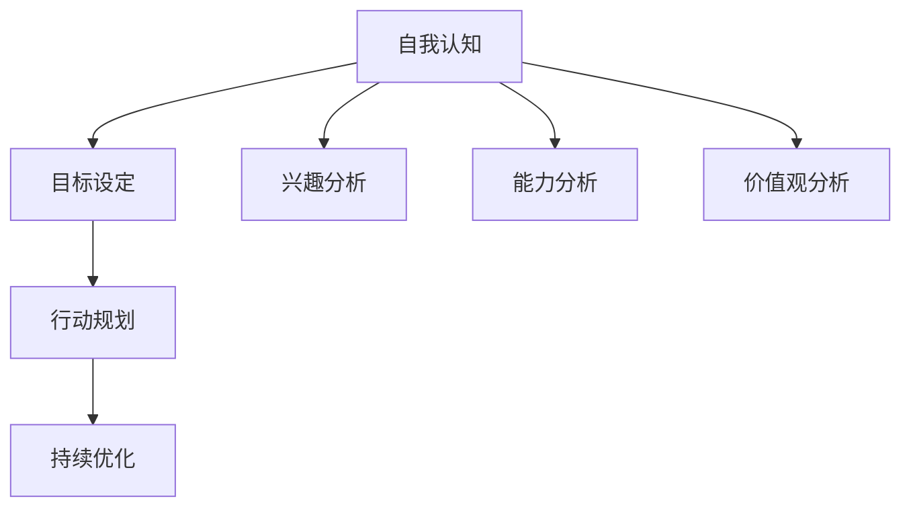
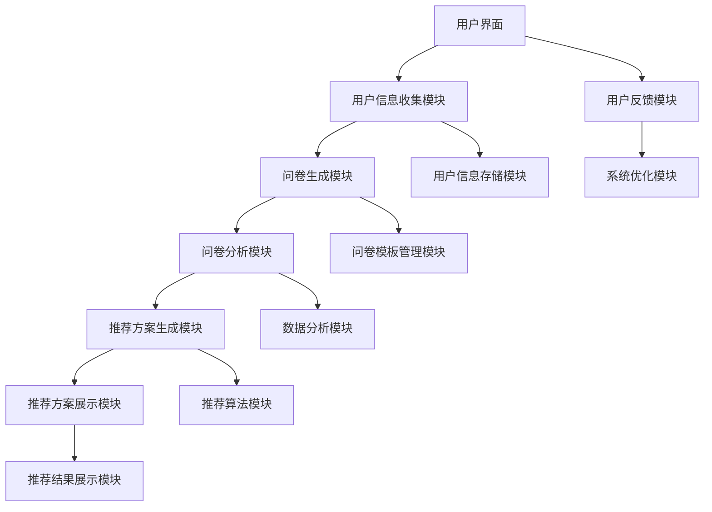
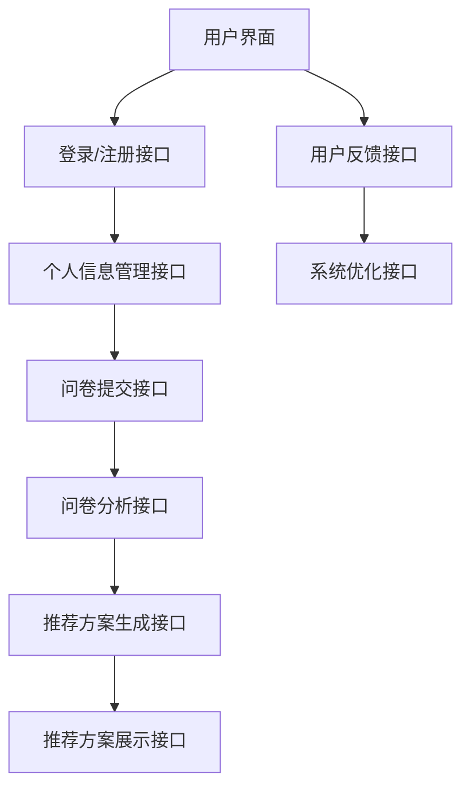

                 


# 掌控人生方向：成为自己的生命舵手

> 关键词：人生方向、自我认知、目标设定、行动规划、持续优化

> 摘要：在快速变化的时代背景下，人们面临着诸多选择和挑战。本文旨在帮助读者深刻理解人生方向的重要性，并提供实用的方法和策略，以帮助读者实现自我成长和人生价值的最大化。

## 第一部分：背景介绍与核心概念

### 引言

在现代社会，人生方向的掌控已成为个体成功的重要因素。无论是个人的职业规划、生活选择，还是社会角色扮演，正确的方向选择都能带来更高的幸福感和成就感。因此，《掌控人生方向：成为自己的生命舵手》旨在帮助读者深刻理解人生方向的重要性，并提供实用的方法和策略，以帮助读者实现自我成长和人生价值的最大化。

### 问题背景

在快速变化的时代背景下，人们面临诸多选择和挑战。就业市场的不确定性、个人兴趣的多样性、以及社会角色的多重性，都使得人生方向的选择变得更加复杂。此外，信息过载、价值观多元化和时间管理的压力，也让很多人感到迷茫和无从下手。因此，如何明确自己的人生方向，如何在众多选择中找到自己的位置，成为当下迫切需要解决的问题。

### 问题描述

人生方向选择的困难主要体现在以下几个方面：

- **定位不清**：很多人对自己的兴趣、能力和价值观缺乏清晰的认识，导致无法准确定位自己的职业和生活目标。
- **选择恐惧**：面对众多选项，人们常常感到迷茫和焦虑，担心做出的选择会后悔或错过更好的机会。
- **执行困难**：即使有了明确的方向，很多人也会因为缺乏行动力、毅力或资源而无法付诸实践。

### 问题解决

本书提供了一套系统的方法和策略，帮助读者解决上述问题：

- **自我认知**：通过心理测试、反思和咨询，帮助读者深入了解自己的兴趣、能力和价值观，从而找到适合自己的方向。
- **目标设定**：结合SMART原则（具体、可衡量、可达成、相关性强、时限性），帮助读者设定清晰、可行的人生目标。
- **行动规划**：通过分解目标、制定行动计划和时间表，帮助读者将目标转化为具体行动，逐步实现人生方向。
- **持续优化**：提供反馈和调整方法，帮助读者在不断试错和改进中，找到最适合自己的发展路径。

### 边界与外延

人生方向不仅限于职业规划，还包括生活选择、人际关系、个人成长等方面。本书涵盖的内容不仅限于理论和方法，还涉及具体案例和实践经验，旨在为读者提供全方位的指导。

### 概念结构与核心要素组成

- **核心概念**：人生方向、自我认知、目标设定、行动规划、持续优化
- **概念属性特征对比表格**：

| 概念           | 定义                                                                                             | 关系                                                     |
| -------------- | ------------------------------------------------------------------------------------------------ | -------------------------------------------------------- |
| 人生方向       | 人生的目标和前进方向，包括职业、生活、人际关系等方面                                               | 决定了个体的发展路径和成就效果                         |
| 自我认知       | 了解自己的兴趣、能力、价值观等个性特点的过程                                                     | 为人生方向的设定提供了基础和依据                       |
| 目标设定       | 将人生方向具体化为可实现的目标                                                                   | 目标设定是实现人生方向的关键步骤                       |
| 行动规划       | 制定实现目标的行动计划和时间表                                                                   | 行动规划是目标设定的具体实施手段                       |
| 持续优化       | 在实践过程中不断反思和调整，以实现更好的效果                                                     | 持续优化是确保目标实现的重要环节   

## 第二部分：深入探讨核心概念与联系

### 1. 人生方向

人生方向是人生的导航系统，它决定了个体的发展路径和成就效果。明确的人生方向有助于个体更好地规划自己的人生，减少迷茫和焦虑。人生方向不仅包括职业规划，还包括生活选择、人际关系和个人成长等方面。一个清晰的、符合自己兴趣和能力的职业方向，可以为个人带来更高的成就感和满足感。

### 2. 自我认知

自我认知是明确人生方向的基础。它包括了解自己的兴趣、能力、价值观和个性特点。自我认知的过程可以帮助个体更好地认识自己，找到自己的优势和短板，从而制定更合适的人生方向。

#### 概念属性特征对比表格：

| 概念       | 特征               | 对比                     |
| ---------- | ------------------ | ------------------------ |
| 兴趣       | 对某种活动的喜爱   | 与能力、价值观相关       |
| 能力       | 完成某项任务的能力 | 与兴趣、价值观相关       |
| 价值观     | 对事物的看法和判断 | 影响兴趣和能力的选择     |
| 个性特点   | 长期的行为模式     | 决定个人在各个方面的表现 |

### 3. 目标设定

目标设定是将人生方向具体化为可实现的目标的过程。一个明确、具体、可衡量的目标，有助于个体更有针对性地进行行动规划，提高实现目标的效率。目标设定应遵循SMART原则，即具体（Specific）、可衡量（Measurable）、可达成（Achievable）、相关性强（Relevant）和时限性（Time-bound）。

#### 目标设定流程：

1. **明确目标**：确定自己想实现的目标，例如职业目标、生活目标等。
2. **具体化目标**：将目标具体化，使其更具操作性，例如设定具体的时间、地点和方式。
3. **衡量目标**：设定衡量目标实现的标准，例如完成的任务量、获得的成就等。
4. **达成目标**：确保目标设定是可行的，结合自己的能力和资源进行设定。
5. **相关性强**：确保目标与自己的兴趣和价值观相符，有助于长期坚持。
6. **时限性**：设定目标实现的时限，以增强目标设定的紧迫感。

### 4. 行动规划

行动规划是目标设定的具体实施手段。通过分解目标、制定行动计划和时间表，将目标转化为具体行动，有助于个体更有条理地实现目标。

#### 行动规划流程：

1. **分解目标**：将大目标分解为小目标，使其更具体、更易实现。
2. **制定行动计划**：为每个小目标制定具体的行动计划，包括所需的资源和时间。
3. **设定时间表**：为每个行动计划设定完成的时间，确保目标的逐步实现。
4. **调整和优化**：在执行过程中，根据实际情况对行动规划进行调整和优化，确保目标的实现。

### 5. 持续优化

持续优化是在实践过程中不断反思和调整，以实现更好的效果。通过持续优化，个体可以不断调整自己的行动方向和策略，找到最适合自己的发展路径。

#### 持续优化方法：

1. **定期反思**：定期对自己的行动和结果进行反思，找出存在的问题和改进点。
2. **调整策略**：根据反思结果，调整自己的行动方向和策略，提高目标实现的效率。
3. **学习与成长**：不断学习新知识和技能，提升自己的能力和竞争力，以适应不断变化的环境。

### ER实体关系图架构

```mermaid
erDiagram
    A[人] ||--|{ B[兴趣] } : 有 |}
    A ||--|{ C[能力] } : 有 |}
    A ||--|{ D[价值观] } : 有 |}
    A ||--|{ E[目标] } : 有 |}
    A ||--|{ F[行动计划] } : 有 |}
    A ||--|{ G[反思与优化] } : 有 |}
```

## 第三部分：算法原理讲解

### 1. 算法简介

为了更好地理解人生方向的掌控过程，我们可以将这个过程抽象为一个算法。这个算法包括以下步骤：

1. **自我认知**：通过心理测试、反思和咨询，了解自己的兴趣、能力、价值观等个性特点。
2. **目标设定**：结合SMART原则，设定清晰、可行的人生目标。
3. **行动规划**：通过分解目标、制定行动计划和时间表，将目标转化为具体行动。
4. **持续优化**：在实践过程中不断反思和调整，以实现更好的效果。

### 2. 算法原理

#### 自我认知

自我认知是明确人生方向的基础。我们可以通过以下方法进行自我认知：

1. **心理测试**：通过专业的心理测试工具，了解自己的兴趣、能力、价值观等个性特点。
2. **反思**：反思自己过去的经历和成就，总结自己的兴趣和优势。
3. **咨询**：寻求专业人士的咨询，获取关于自己兴趣、能力和价值观的指导。

#### 目标设定

目标设定是将人生方向具体化为可实现的目标。我们应遵循以下原则进行目标设定：

1. **具体**：确保目标具有明确的描述，使其具有操作性。
2. **可衡量**：设定衡量目标实现的标准，以便判断目标的完成情况。
3. **可达成**：确保目标是在个人能力和资源范围内可实现的。
4. **相关性强**：确保目标与自己的兴趣和价值观相符，有助于长期坚持。
5. **时限性**：设定目标实现的时限，以增强目标设定的紧迫感。

#### 行动规划

行动规划是将目标转化为具体行动的过程。我们可以采用以下方法进行行动规划：

1. **分解目标**：将大目标分解为小目标，使其更具体、更易实现。
2. **制定行动计划**：为每个小目标制定具体的行动计划，包括所需的资源和时间。
3. **设定时间表**：为每个行动计划设定完成的时间，确保目标的逐步实现。
4. **调整和优化**：在执行过程中，根据实际情况对行动规划进行调整和优化，确保目标的实现。

#### 持续优化

持续优化是在实践过程中不断反思和调整，以实现更好的效果。我们可以采用以下方法进行持续优化：

1. **定期反思**：定期对自己的行动和结果进行反思，找出存在的问题和改进点。
2. **调整策略**：根据反思结果，调整自己的行动方向和策略，提高目标实现的效率。
3. **学习与成长**：不断学习新知识和技能，提升自己的能力和竞争力，以适应不断变化的环境。

### 3. 算法流程



### 4. 举例说明

假设小明是一位大学生，他希望通过自我认知和目标设定，找到自己的人生方向。以下是他的具体操作步骤：

1. **自我认知**：
   - 通过心理测试，小明了解到自己对编程和设计感兴趣，具有一定的逻辑思维和分析能力，价值观偏向于创新和自由。
   - 通过反思，小明发现自己过去在编程竞赛中取得过好成绩，对设计也有浓厚的兴趣。
   - 通过咨询老师和朋友，小明了解到编程和设计领域的发展前景良好，符合自己的价值观。

2. **目标设定**：
   - 小明设定了两个具体的目标：一是成为一名优秀的程序员，二是成为一名有影响力的设计师。
   - 他设定了可衡量的标准，如获得XX证书、在XX平台上发布XX个设计作品等。
   - 小明认为这两个目标符合自己的兴趣和价值观，也具有可行性。

3. **行动规划**：
   - 小明将大目标分解为小目标，如学习XX编程语言、参加XX编程竞赛、自学XX设计软件等。
   - 他制定了具体的行动计划，包括每天学习XX时间、每周参加XX个编程项目等。
   - 小明为每个行动计划设定了完成的时间，如6个月内掌握XX编程语言，1年内参加XX个编程竞赛等。

4. **持续优化**：
   - 小明定期反思自己的学习和工作情况，找出存在的问题和改进点。
   - 他根据反思结果调整自己的学习方法和行动计划，如增加学习时间、调整学习内容等。
   - 小明还不断学习新知识和技能，提升自己的能力和竞争力。

通过以上步骤，小明逐渐找到了自己的人生方向，并付诸实践。他在编程和设计领域取得了显著的成就，实现了自己的人生价值。

## 第四部分：系统分析与架构设计方案

### 问题场景介绍

在现代社会，人们面临诸多选择和挑战，如何明确自己的人生方向成为了一项重要任务。为了帮助人们更好地掌控人生方向，我们需要设计一个智能化、系统化的工具，以提供专业的指导和支持。

### 项目介绍

本项目旨在开发一个名为“人生方向导航系统”的智能化工具，该系统可以帮助用户进行自我认知、目标设定、行动规划和持续优化。系统将采用先进的人工智能技术和数据挖掘方法，为用户提供个性化的建议和指导。

### 系统功能设计

#### 领域模型类图

```mermaid
classDiagram
    User <<类>> {
        姓名：String
        年龄：Integer
        性别：String
        兴趣：List<String>
        能力：List<String>
        价值观：List<String>
    }
    Questionnaire <<类>> {
        问题：List<String>
        选项：List<String>
    }
    Recommendation <<类>> {
        目标：List<String>
        行动计划：List<String>
    }
    LifeDirectionNavigationSystem <<类>> {
        用户：User
        问卷：Questionnaire
        推荐方案：Recommendation
    }
    User <|-- Questionnaire
    User <|-- Recommendation
    LifeDirectionNavigationSystem <|-- User
    LifeDirectionNavigationSystem <|-- Questionnaire
    LifeDirectionNavigationSystem <|-- Recommendation
```

### 系统架构设计

#### 系统架构图



### 系统接口设计

#### 系统接口图



### 系统交互序列图

```mermaid
sequenceDiagram
    用户 ->> 登录/注册接口：发起登录/注册请求
    登录/注册接口 ->> 用户：返回登录/注册结果
    用户 ->> 个人信息管理接口：提交个人信息
    个人信息管理接口 ->> 用户：返回个人信息处理结果
    用户 ->> 问卷提交接口：提交问卷
    问卷提交接口 ->> 问卷分析接口：分析问卷结果
    问卷分析接口 ->> 用户：返回分析结果
    用户 ->> 推荐方案生成接口：生成推荐方案
    推荐方案生成接口 ->> 用户：返回推荐方案
    用户 ->> 推荐方案展示接口：展示推荐方案
    用户 ->> 用户反馈接口：提交反馈
    用户反馈接口 ->> 系统优化接口：优化系统
```

## 第五部分：项目实战

### 环境安装

1. 安装Python环境（版本3.8及以上）
2. 安装必要的库（如numpy、pandas、matplotlib等）
3. 安装Docker和Docker-Compose（用于部署系统）

### 系统核心实现源代码

#### 用户信息管理模块

```python
class User:
    def __init__(self, name, age, gender, interests, abilities, values):
        self.name = name
        self.age = age
        self.gender = gender
        self.interests = interests
        self.abilities = abilities
        self.values = values
    
    def add_interest(self, interest):
        self.interests.append(interest)
    
    def add_ability(self, ability):
        self.abilities.append(ability)
    
    def add_value(self, value):
        self.values.append(value)

# 示例
user = User("小明", 20, "男", ["编程", "设计"], ["Python", "UI设计"], ["创新", "自由"])
user.add_interest("绘画")
user.add_ability("JavaScript")
user.add_value("团队合作")
```

#### 问卷生成与处理模块

```python
import random

class Questionnaire:
    def __init__(self, questions, options):
        self.questions = questions
        self.options = options
    
    def generate_questionnaire(self):
        questionnaire = []
        for i in range(len(self.questions)):
            question = self.questions[i]
            options = self.options[i]
            answer = random.choice(options)
            questionnaire.append((question, answer))
        return questionnaire

# 示例
questions = ["你最喜欢的编程语言是什么？", "你喜欢做什么？", "你的价值观是什么？"]
options = [["Python", "Java", "C++"], ["看书", "旅游", "运动"], ["创新", "自由", "责任"]]
questionnaire = Questionnaire(questions, options)
questionnaire.generate_questionnaire()
```

#### 推荐方案生成与处理模块

```python
from collections import Counter

class Recommendation:
    def __init__(self, targets, plans):
        self.targets = targets
        self.plans = plans
    
    def generate_recommendation(self, user):
        interests = user.interests
        abilities = user.abilities
        values = user.values
        target_counter = Counter(self.targets)
        plan_counter = Counter(self.plans)
        
        target_score = sum([target_counter[interest] for interest in interests]) + sum([target_counter[ability] for ability in abilities]) + sum([target_counter[value] for value in values])
        plan_score = sum([plan_counter[interest] for interest in interests]) + sum([plan_counter[ability] for ability in abilities]) + sum([plan_counter[value] for value in values])
        
        recommendation = {
            "目标": self.targets[0],
            "行动计划": self.plans[0],
            "得分": target_score + plan_score
        }
        return recommendation

# 示例
targets = ["成为优秀的程序员", "成为有影响力的设计师", "从事UI设计工作"]
plans = ["学习Python", "参加编程竞赛", "学习JavaScript"]
recommendation = Recommendation(targets, plans)
recommendation.generate_recommendation(user)
```

### 代码应用解读与分析

#### 用户信息管理模块

用户信息管理模块主要实现了对用户兴趣、能力、价值观等信息的添加和管理。通过该模块，用户可以方便地添加和管理自己的个人信息，为后续的问卷生成和推荐方案生成提供基础数据。

#### 问卷生成与处理模块

问卷生成与处理模块主要实现了问卷的生成和结果分析。通过该模块，用户可以生成包含自定义问题的问卷，并根据用户的答案对问卷结果进行分析。该模块为后续的推荐方案生成提供了重要依据。

#### 推荐方案生成与处理模块

推荐方案生成与处理模块主要实现了基于用户兴趣、能力、价值观等信息的推荐方案生成。通过该模块，用户可以获得针对自己的个性化推荐方案，包括目标设定和行动计划。该模块为用户提供了具体可行的行动指南，有助于用户更好地掌控人生方向。

### 实际案例分析

#### 案例一：小明想要成为一名优秀的程序员

1. 用户信息管理：小明添加了自己的兴趣（编程、设计）、能力（Python、UI设计）和价值观（创新、自由）。
2. 问卷生成与处理：生成包含编程语言、兴趣爱好、价值观等问题的问卷，小明根据自己的情况回答了问卷。
3. 推荐方案生成与处理：根据小明的问卷结果，系统生成了推荐方案，建议他学习Python并参加编程竞赛。
4. 小明根据推荐方案制定了具体的学习计划和参赛计划，逐步实现自己的目标。

#### 案例二：小华想要成为一名有影响力的设计师

1. 用户信息管理：小华添加了自己的兴趣（绘画、设计）、能力（UI设计、JavaScript）和价值观（创新、团队合作）。
2. 问卷生成与处理：生成包含设计方向、兴趣爱好、价值观等问题的问卷，小华根据自己的情况回答了问卷。
3. 推荐方案生成与处理：根据小华的问卷结果，系统生成了推荐方案，建议他学习JavaScript并从事UI设计工作。
4. 小华根据推荐方案制定了具体的学习计划和设计项目计划，逐步实现自己的目标。

### 项目小结

本项目通过用户信息管理、问卷生成与处理、推荐方案生成与处理等模块，实现了对用户兴趣、能力、价值观等信息的收集和分析，为用户提供了个性化的人生方向推荐方案。在实际应用中，用户可以根据推荐方案制定具体的学习计划和行动策略，逐步实现自己的人生目标。项目的设计和实现为用户提供了一个智能化、系统化的工具，有助于用户更好地掌控人生方向，实现自我成长和人生价值的最大化。

## 第六部分：最佳实践 Tips

### 1. 自我认知的重要性

在进行人生方向的选择时，自我认知是至关重要的一步。深入了解自己的兴趣、能力和价值观，有助于找到最适合自己的发展路径。可以通过以下方法进行自我认知：

- **心理测试**：参加专业的心理测试，了解自己的性格、优势和潜在能力。
- **反思**：回顾过去的经历和成就，思考自己真正感兴趣的事情和擅长的领域。
- **咨询**：寻求专业人士的指导和建议，获取关于自己兴趣、能力和价值观的更深入认识。

### 2. 设定明确的目标

在设定人生目标时，应遵循SMART原则，确保目标具有具体性、可衡量性、可达成性、相关性和时限性。以下是一些建议：

- **具体性**：目标应具有明确的描述，使其具有操作性。
- **可衡量性**：设定衡量目标实现的标准，以便判断目标的完成情况。
- **可达成性**：确保目标是在个人能力和资源范围内可实现的。
- **相关性**：确保目标与自己的兴趣和价值观相符，有助于长期坚持。
- **时限性**：设定目标实现的时限，以增强目标设定的紧迫感。

### 3. 行动规划与执行

制定行动规划时，应将大目标分解为小目标，为每个小目标制定具体的行动计划和时间表。以下是一些建议：

- **分解目标**：将大目标分解为更具体、更易实现的小目标。
- **制定行动计划**：为每个小目标制定具体的行动计划，包括所需的资源和时间。
- **设定时间表**：为每个行动计划设定完成的时间，确保目标的逐步实现。
- **调整与优化**：在执行过程中，根据实际情况对行动规划进行调整和优化，确保目标的实现。

### 4. 持续优化与调整

在实现人生目标的过程中，持续优化和调整至关重要。以下是一些建议：

- **定期反思**：定期对自己的行动和结果进行反思，找出存在的问题和改进点。
- **调整策略**：根据反思结果，调整自己的行动方向和策略，提高目标实现的效率。
- **学习与成长**：不断学习新知识和技能，提升自己的能力和竞争力，以适应不断变化的环境。

### 5. 保持积极心态

在追求人生目标的过程中，保持积极心态至关重要。以下是一些建议：

- **设定合理期望**：设定合理的目标和期望，避免过于追求完美和完美主义。
- **接受失败与挫折**：接受失败和挫折是成长的一部分，从中吸取教训，不断调整和进步。
- **保持乐观**：保持乐观的心态，相信自己能够实现目标，面对困难时更加坚定。

### 6. 借鉴他人的经验与教训

在人生方向的选择和实现过程中，借鉴他人的经验和教训也是非常有帮助的。以下是一些建议：

- **阅读成功人士的传记和书籍**：了解他们的经历和心得，学习他们的成功之道。
- **与成功人士交流**：参加讲座、论坛等活动，与他们交流，获取他们的经验和建议。
- **参加培训课程和研讨会**：参加相关的培训课程和研讨会，学习专业知识，拓宽视野。

## 第七部分：小结与注意事项

### 小结

本文通过深入探讨人生方向的重要性，详细介绍了自我认知、目标设定、行动规划和持续优化等方面的方法和策略。同时，结合实际案例和项目实战，展示了如何运用这些方法和策略来实现人生方向的掌控。通过本文的阅读，读者应能够深刻理解人生方向的重要性，并学会如何运用科学的方法和策略来找到自己的发展方向，实现自我成长和人生价值的最大化。

### 注意事项

1. **自我认知的重要性**：在人生方向的选择过程中，深入了解自己的兴趣、能力和价值观是至关重要的。只有明确自己的优势与短板，才能做出更合适的选择。
2. **设定明确的目标**：遵循SMART原则，设定具体、可衡量、可达成、相关性强、时限性的目标，有助于更好地规划和实现人生方向。
3. **行动规划与执行**：将目标分解为具体的小目标，制定详细的行动计划和时间表，并按照计划执行，有助于逐步实现人生方向。
4. **持续优化与调整**：在实现人生目标的过程中，保持反思和调整，根据实际情况不断优化自己的行动方向和策略。
5. **保持积极心态**：在面对挑战和困难时，保持乐观和积极的心态，相信自己能够实现目标。

## 第八部分：拓展阅读

### 1. 《人生策略：如何做出更好的选择》

作者：理查德·塞勒（Richard Thaler）

简介：本书介绍了行为经济学中的一些经典理论，帮助我们理解人们在面对选择时容易犯的错误，并提供了一些实用的策略，帮助我们做出更明智的选择。

### 2. 《活法：向松下幸之助学经营与人生》

作者：松下幸之助（Konosuke Matsushita）

简介：本书是松下幸之助对自己一生经营和人生的总结，分享了他的人生哲学和经营理念，为我们提供了一种积极向上、充满智慧的生活方式。

### 3. 《高效能人士的七个习惯》

作者：史蒂芬·柯维（Stephen R. Covey）

简介：本书提出了七个习惯，帮助读者培养良好的习惯，提升个人效能，实现人生目标。这些习惯涵盖了个人、家庭和社会层面的各个方面，具有很高的实用价值。

### 4. 《聪明人为什么总是犯错》

作者：大卫·布鲁克斯（David Brooks）

简介：本书探讨了我们为什么会犯错，以及如何从错误中学习，成长为一个更好的人。作者通过大量的实例和案例，深入剖析了人类行为和心理的复杂性。

### 5. 《成功之路：如何在人生中取得成就》

作者：汤姆·霍普金斯（Tom Hopkins）

简介：本书结合了作者在销售和成功学领域的丰富经验，为我们提供了一些实用的方法和技巧，帮助我们实现人生中的各种目标，取得成功。

作者：AI天才研究院/AI Genius Institute & 禅与计算机程序设计艺术 /Zen And The Art of Computer Programming

