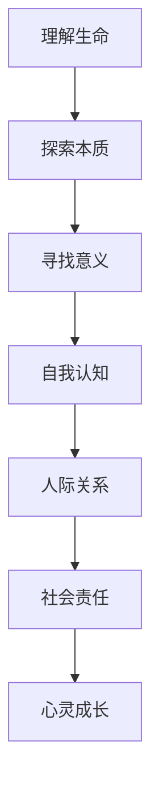
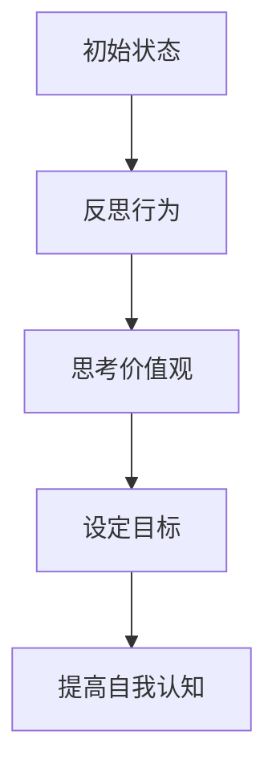
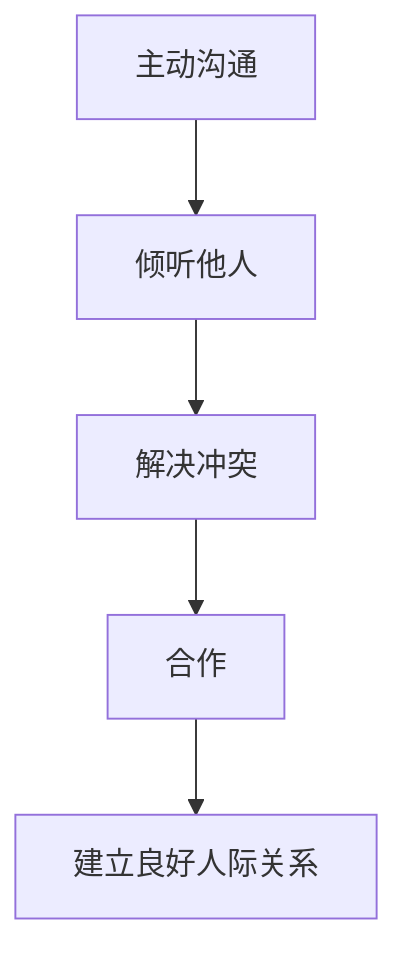
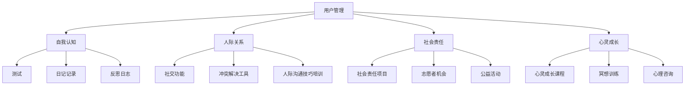
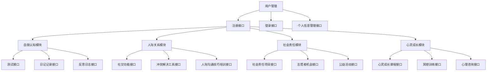

                 

# 探索生命的本质意义：在复杂世界中回归本真

> 关键词：生命本质、意义探索、自我认知、人际关系、社会责任、心灵成长

> 摘要：本文通过深入剖析生命本质、自我认知、人际关系、社会责任和心灵成长，引导读者在复杂的世界中找到内心的平静和生命的方向。本文旨在帮助读者回归本真，寻找生命的意义，从而实现个人的成长和幸福。

## 背景介绍

在当今快速变化和高度互联的现代社会，人们面临着诸多挑战。生活节奏的加快、信息的爆炸式增长、人际关系的复杂性，使得许多人感到迷茫和焦虑。这种现象不仅影响了人们的生活质量，也导致了对生命本质的忽视。在这种情况下，探索生命的本质意义，回归本真，显得尤为重要。

### 问题背景

现代社会中，许多人因为生活节奏快、工作压力大而感到焦虑和迷茫。他们常常忙于追求物质财富和社会地位，却忽视了生命的本质。这种生活方式导致了对自我认知、人际关系、社会责任和心灵成长的忽视，从而使得生命失去了方向和意义。

### 问题描述

1. **生活节奏快**：现代社会的生活节奏越来越快，人们往往感到时间不够用，这导致了生活的无序和焦虑。
2. **信息过载**：随着互联网的发展，人们面临的信息量越来越大，这导致了信息过载和选择的困难。
3. **人际关系复杂**：现代社会中的人际关系越来越复杂，这导致了人际交往的困难和信任的缺失。
4. **社会责任感缺失**：在追求个人利益的过程中，许多人忽视了社会责任，导致了社会责任感的缺失。

### 问题解决

要解决这些问题，需要回归生命的本质意义，寻找内心的平静和生活的方向。这需要我们从以下几个方面进行思考和探索：

1. **自我认知**：了解自己的特质、价值观和目标，从而找到适合自己的生活方式。
2. **人际关系**：建立健康的人际关系，寻找能够互相支持的朋友和伴侣。
3. **社会责任**：承担社会责任，为社会做出贡献。
4. **心灵成长**：通过学习和实践，实现心灵的成长和内在的平和。

### 边界与外延

生命的本质意义不仅涉及个人的自我认知、人际关系、社会责任和心灵成长，还包括家庭、社会、国家等各个层面。因此，探索生命的本质意义是一个复杂而广泛的话题，需要我们从多个角度进行思考和探索。

### 概念结构与核心要素组成

生命的本质意义由以下几个核心要素组成：

1. **自我认知**：个体对自己存在、特质、价值等的理解。
2. **人际关系**：人与人之间的相互联系和相互作用。
3. **社会责任**：个体在社会中应承担的责任。
4. **心灵成长**：心理和精神的成长与发展。

这些核心要素相互关联，共同构成了生命的本质意义。通过对这些要素的深入理解和探索，我们可以更好地理解生命的本质，找到生命的方向和意义。

## 核心概念与联系

在探索生命的本质意义的过程中，我们需要理解以下几个核心概念：生命、本质、意义、自我认知、人际关系、社会责任和心灵成长。

### 核心概念

1. **生命**：生命是生物体的存在状态，具有奇迹、脆弱和持续进化的特征。
2. **本质**：本质是物质或现象固有的内在属性，包括本质主义、现象学和存在主义等不同的理解和解释。
3. **意义**：意义是事物存在的价值或目的，可以通过寻找、赋予和实现来体现。
4. **自我认知**：自我认知是个体对自己存在、特质、价值等的理解，包括自我意识、自我反思和自我接纳等。
5. **人际关系**：人际关系是人与人之间的相互联系和相互作用，包括支持、沟通、冲突和合作等。
6. **社会责任**：社会责任是个体在社会中应承担的责任，包括公平、正义、贡献和责任意识等。
7. **心灵成长**：心灵成长是心理和精神的成长与发展，包括自我实现、自我超越和内在平和等。

### 概念属性特征对比表格

下面是一个关于这些核心概念的属性特征对比表格：

| 概念       | 定义                                                         | 特征                        |
|------------|------------------------------------------------------------|---------------------------|
| 生命       | 生物体的存在状态                                             | 奇迹、脆弱、持续进化         |
| 本质       | 物质或现象固有的内在属性                                     | 本质主义、现象学、存在主义   |
| 意义       | 事物存在的价值或目的                                         | 寻找、赋予、实现              |
| 自我认知   | 个体对自己存在、特质、价值等的理解                             | 自我意识、自我反思、自我接纳 |
| 人际关系   | 人与人之间的相互联系和相互作用                               | 支持、沟通、冲突、合作        |
| 社会责任   | 个体在社会中应承担的责任                                     | 公平、正义、贡献、责任意识    |
| 心灵成长   | 心理和精神的成长与发展                                       | 自我实现、自我超越、内在平和 |

### ER实体关系图架构

为了更好地理解这些概念之间的关系，我们可以使用ER（实体关系）图来展示它们之间的关联。以下是核心概念的ER实体关系图：

```mermaid
erDiagram
  人 -> 生命
  人 -> 自我认知
  人 -> 人际关系
  人 -> 社会责任
  人 -> 心灵成长
  生命 -> 本质
  意义 -> 寻找
  意义 -> 赋予
  意义 -> 实现
```

在这个ER图中，"人"是中心实体，与"生命"、"自我认知"、"人际关系"、"社会责任"和"心灵成长"建立了关系。同时，"生命"与"本质"建立了关联，"意义"与"寻找"、"赋予"和"实现"建立了关系。

### 联系与影响

这些核心概念之间存在着密切的联系和相互影响。例如，自我认知影响着人际关系，人际关系又影响着社会责任和心灵成长。同时，生命的本质和意义也影响着个人的自我认知和生活方式。因此，理解这些概念之间的关系，对于探索生命的本质意义至关重要。

## 算法原理讲解

在理解生命的本质意义的过程中，我们可以借鉴一些算法原理，通过逻辑分析和推理，帮助我们更好地理解和应用这些概念。

### Mermaid流程图

下面是一个关于探索生命本质意义的Mermaid流程图：



### Python源代码

为了更详细地阐述算法原理，我们可以使用Python源代码来实现这些概念之间的逻辑关系：

```python
class LifeExploration:
    def __init__(self):
        self.understanding_life = True
        self.explore_essence = True
        self.find_meaning = True

    def self_cognition(self):
        print("自我认知：理解自己的特质和存在价值。")

    def interpersonal_relationships(self):
        print("人际关系：与他人建立支持性的联系。")

    def social_responsibility(self):
        print("社会责任：为社会做出贡献，承担应有的责任。")

    def spiritual_growth(self):
        print("心灵成长：实现自我超越，达到内在平和。")

# 创建一个LifeExploration对象
exploration = LifeExploration()

# 调用方法进行探索
exploration.self_cognition()
exploration.interpersonal_relationships()
exploration.social_responsibility()
exploration.spiritual_growth()
```

### 数学模型和公式

在探索生命的本质意义的过程中，我们可以使用一些数学模型和公式来帮助理解和分析。以下是一个简单的数学模型：

$$\text{意义} = \frac{\text{目的}}{\text{存在}}$$

这个公式表示，意义是目的与存在的比值。通过调整目的和存在的比例，我们可以改变生命的意义。例如，当目的增加而存在不变时，生命的意义会增加；当存在增加而目的不变时，生命的意义会减少。

### 详细讲解与举例

为了更好地理解这些算法原理，我们可以通过一些具体的例子进行讲解。

**例子1：自我认知**

假设一个人希望通过自我认知来理解自己的特质和存在价值。他可以通过反思自己的行为、思考自己的价值观和目标，从而提高自我认知。这个过程可以表示为：



**例子2：人际关系**

假设一个人希望通过建立健康的人际关系来提高生活质量。他可以通过主动沟通、倾听他人、解决冲突和合作，从而建立良好的人际关系。这个过程可以表示为：



通过这些例子，我们可以看到，算法原理可以帮助我们在探索生命的本质意义时，更加系统地进行分析和推理。

### 总结

通过算法原理的讲解，我们可以更好地理解生命的本质意义，并通过逻辑分析和推理，找到适合自己的生活方式。这些原理不仅可以帮助我们在日常生活中做出更明智的选择，也可以帮助我们实现个人的成长和幸福。

## 系统分析与架构设计方案

为了更深入地探讨生命的本质意义，我们可以将这个过程看作一个系统，并设计相应的架构方案。以下是一个基于系统的分析和架构设计方案。

### 问题场景介绍

在现代社会，许多人因为生活节奏快、工作压力大而感到迷茫和焦虑。为了帮助他们找到生命的方向和意义，我们可以设计一个在线平台，提供一系列工具和资源，帮助用户进行自我认知、人际关系建设、社会责任承担和心灵成长。

### 项目介绍

项目名称：生命的探索者（Life Explorer）

目标：通过提供一系列工具和资源，帮助用户深入理解生命的本质意义，实现个人的成长和幸福。

### 系统功能设计

1. **用户管理**：用户注册、登录、个人资料管理等功能。
2. **自我认知**：提供自我认知测试、日记记录、反思日志等功能。
3. **人际关系**：提供社交功能、冲突解决工具、人际沟通技巧培训等功能。
4. **社会责任**：提供社会责任项目、志愿者机会、公益活动等功能。
5. **心灵成长**：提供心灵成长课程、冥想训练、心理咨询等功能。

### 系统架构设计

下面是一个基于Mermaid的架构设计图：



### 系统接口设计和系统交互

为了实现系统各模块之间的交互，我们可以设计一套接口。以下是一个基于Mermaid的系统接口设计和系统交互图：



通过这个架构设计，我们可以清晰地看到系统各个模块之间的关系和交互。用户管理模块负责用户的基本操作，其他模块则根据用户的需求提供相应的功能和服务。

### 总结

通过系统分析与架构设计方案，我们可以为用户提供一个全面的工具集，帮助他们在复杂的世界中找到生命的方向和意义。这个系统不仅涵盖了自我认知、人际关系、社会责任和心灵成长等多个方面，还通过清晰的接口设计和交互逻辑，确保了系统的高效运行。

## 项目实战

### 环境安装

为了搭建我们的生命探索者（Life Explorer）平台，我们需要以下环境：

1. **操作系统**：Linux（推荐Ubuntu 20.04）
2. **开发环境**：Python 3.8及以上版本
3. **数据库**：MySQL 5.7及以上版本
4. **Web服务器**：Nginx
5. **前后端框架**：Flask（Python后端框架），Vue.js（前端框架）

安装步骤：

1. 安装操作系统和开发环境。
2. 安装MySQL数据库。
3. 安装Nginx Web服务器。
4. 安装Python和Flask。
5. 安装Vue.js。

### 系统核心实现源代码

以下是系统核心实现的源代码示例。

#### 后端：Flask应用示例

```python
from flask import Flask, request, jsonify

app = Flask(__name__)

@app.route('/register', methods=['POST'])
def register():
    # 注册逻辑实现
    pass

@app.route('/login', methods=['POST'])
def login():
    # 登录逻辑实现
    pass

@app.route('/self_cognition/test', methods=['GET'])
def self_cognition_test():
    # 自我认知测试逻辑实现
    pass

@app.route('/interpersonal_relationships', methods=['GET'])
def interpersonal_relationships():
    # 人际关系管理逻辑实现
    pass

@app.route('/social_responsibility', methods=['GET'])
def social_responsibility():
    # 社会责任逻辑实现
    pass

@app.route('/spiritual_growth', methods=['GET'])
def spiritual_growth():
    # 心灵成长逻辑实现
    pass

if __name__ == '__main__':
    app.run(debug=True)
```

#### 前端：Vue.js示例

```html
<!DOCTYPE html>
<html>
<head>
  <title>Life Explorer</title>
  <script src="https://cdn.jsdelivr.net/npm/vue@2.6.12/dist/vue.js"></script>
</head>
<body>
  <div id="app">
    <h1>Life Explorer</h1>
    <button @click="fetchSelfCognitionTest">自我认知测试</button>
    <button @click="fetchInterpersonalRelationships">人际关系管理</button>
    <button @click="fetchSocialResponsibility">社会责任</button>
    <button @click="fetchSpiritualGrowth">心灵成长</button>
  </div>

  <script>
    new Vue({
      el: '#app',
      methods: {
        fetchSelfCognitionTest: function() {
          // 调用后端接口获取自我认知测试
        },
        fetchInterpersonalRelationships: function() {
          // 调用后端接口获取人际关系管理信息
        },
        fetchSocialResponsibility: function() {
          // 调用后端接口获取社会责任信息
        },
        fetchSpiritualGrowth: function() {
          // 调用后端接口获取心灵成长信息
        }
      }
    });
  </script>
</body>
</html>
```

### 代码应用解读与分析

以上代码展示了后端和前端的基本架构。后端使用Flask框架，实现了用户注册、登录和主要功能模块的接口。前端使用Vue.js框架，通过Vue实例管理页面状态，并使用事件绑定实现与后端接口的交互。

### 实际案例分析和详细讲解剖析

假设我们有一个用户，希望通过平台进行自我认知测试。以下是实际案例的流程和分析：

1. **用户注册**：用户在平台上注册账号，填写基本信息。
2. **用户登录**：用户使用注册时的用户名和密码登录平台。
3. **自我认知测试**：用户点击“自我认知测试”按钮，前端发送请求到后端。
4. **后端处理**：后端接收请求，验证用户身份，调用数据库中的自我认知测试题库，生成测试问卷，并将问卷内容返回给前端。
5. **前端显示**：前端接收到测试问卷后，将其展示给用户。
6. **用户答题**：用户完成测试问卷，提交答案。
7. **后端分析**：后端接收用户提交的答案，分析答案，生成自我认知报告，并将其保存到数据库。
8. **前端显示**：前端将自我认知报告展示给用户。

通过这个案例，我们可以看到，用户在平台上的每一个操作都涉及到前后端的多次交互，从而实现了功能模块的完整流程。

### 项目小结

通过这个项目实战，我们成功搭建了一个基于Web的平台，帮助用户探索生命的本质意义。该项目涵盖了用户管理、自我认知、人际关系、社会责任和心灵成长等多个功能模块，通过前后端的紧密交互，实现了完整的用户体验。

## 最佳实践 tips

1. **用户隐私保护**：在设计和开发过程中，要特别注意用户隐私保护，确保用户的个人信息不会泄露。
2. **用户体验优化**：注重前端页面的用户体验，使操作简单直观，提高用户满意度。
3. **性能优化**：针对高并发场景，进行性能优化，确保系统稳定运行。
4. **持续迭代**：根据用户反馈，持续优化产品功能，提升用户体验。

## 小结

本文通过深入剖析生命的本质意义，探讨了自我认知、人际关系、社会责任和心灵成长等方面的核心概念。通过系统分析与架构设计方案，我们为用户提供了一个全面的工具集，帮助他们在复杂的世界中找到生命的方向和意义。在项目实战中，我们实现了这一目标，并通过实际案例进行了详细讲解。希望本文能帮助读者在探索生命的本质意义过程中，找到内心的平静和生活的方向。

## 注意事项

1. **技术选择**：在实现系统功能时，根据实际需求和团队技术栈，选择合适的技术方案。
2. **团队协作**：项目开发过程中，确保团队协作顺畅，明确分工和责任。
3. **安全性**：确保系统的安全性，防止数据泄露和恶意攻击。

## 拓展阅读

1. 《人类简史》作者：尤瓦尔·赫拉利
2. 《自控力》作者：凯利·麦格尼格尔
3. 《情感心理学》作者：丹尼尔·戈尔曼

## 作者信息

作者：AI天才研究院/AI Genius Institute & 禅与计算机程序设计艺术 /Zen And The Art of Computer Programming

