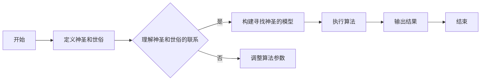
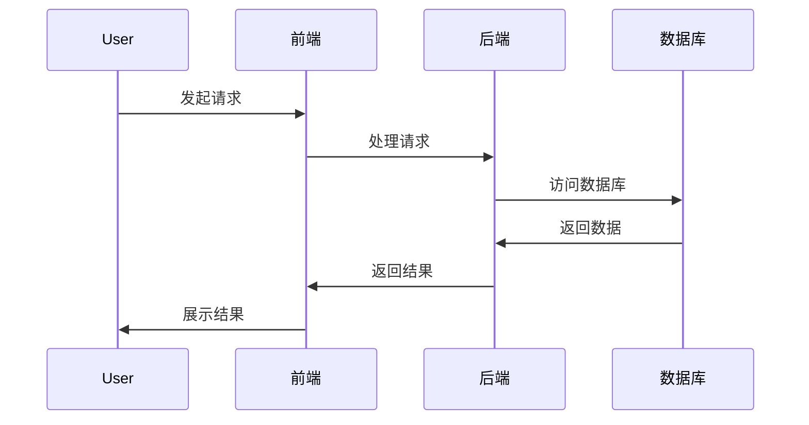

                 

### 第1章 问题背景与定义

#### 1.1.1 问题的起源：从哲学到现代社会

生命的终极意义是人类自古以来的一个哲学问题。在古希腊时期，苏格拉底、柏拉图和亚里士多德等哲学家就对此进行了深入的探讨。他们试图通过哲学思考和讨论，寻找人类存在的意义。

苏格拉底认为，人的唯一追求就是认识真理，追求智慧。柏拉图则提出了“理念世界”的概念，认为现实世界只是理念世界的映射，人类存在的意义在于追求理念世界的真理。亚里士多德则强调人类理性的重要性，认为人类的存在是为了实现理性生活和追求幸福。

随着时间的推移，这个问题在现代社会中变得更加复杂和多样。现代社会中，人们面临着前所未有的挑战和困惑。物质财富的积累带来了精神空虚，科技的高速发展引发了伦理道德的冲突，社会竞争的加剧让人们感到焦虑和不安。在这样的背景下，探讨生命的终极意义变得尤为重要。

#### 1.1.2 问题的定义：生命的终极意义是什么

生命的终极意义，通常指的是人类存在的根本目的和价值。这个问题可以从多个角度进行探讨，包括哲学、宗教、科学和社会学等。

在哲学层面，生命的终极意义涉及到存在论、伦理学和认识论等问题。哲学家们试图从不同的角度来解释人类存在的意义，例如存在主义认为生命的意义在于个体的自由选择和责任，而功利主义则认为生命的意义在于最大化幸福和福利。

在宗教层面，生命的终极意义通常与信仰和神的关系紧密相连。不同宗教对于生命的意义有着不同的解释，例如基督教认为生命的意义在于信仰上帝，佛教则强调通过修行达到涅槃。

在科学层面，生命的终极意义与生命的起源、进化和未来紧密相关。科学家们通过研究生命的起源和演化，试图理解生命在宇宙中的位置和作用。

在社会学层面，生命的终极意义与社会结构和人际关系有关。社会学家研究社会规范、价值观和文化，试图理解人类社会的发展和变迁。

#### 1.1.3 问题的解决：如何在世俗中寻找神圣

在世俗社会中寻找神圣的意义，首先需要理解神圣的概念。在宗教中，神圣通常指的是超越物质世界、具有至高无上权力的存在。而在世俗社会中，神圣可以理解为那些具有深刻意义和内在价值的经验和事物。

在世俗社会中寻找神圣的意义，可以采用以下几种方法：

1. **内在探索**：通过反思和内省，寻找内心的平静和满足感。这种探索可以帮助个体认识到自身的价值，找到内在的幸福。

2. **人际关系**：与他人建立深层次的人际关系，感受人与人之间的爱和关怀。这种关系可以带来内心的满足和归属感。

3. **自然体验**：在大自然中体验宁静和和谐，感受自然的美丽和神秘。这种体验可以让人感受到超越物质世界的神圣。

4. **文化传承**：通过文化传统和艺术，感受人类智慧和创造力的辉煌。

### 1.1.4 边界与外延：探讨的深度与广度

在探讨生命的终极意义时，我们需要明确讨论的边界和外延。这个问题涉及到人类存在的多个维度，包括哲学、宗教、科学和社会学等。因此，探讨的深度和广度都非常广泛。

首先，我们需要明确探讨的边界。生命的终极意义是一个主观的问题，不同的人可能有不同的理解和看法。因此，在探讨这个问题时，我们需要尊重不同的观点，避免过于主观的判断。

其次，我们需要探讨的外延。生命的终极意义不仅仅涉及个人的幸福和满足，还包括人类作为整体在宇宙中的地位和作用。因此，在探讨这个问题时，我们需要从多个角度进行思考，包括哲学、宗教、科学和社会学等。

#### 1.1.5 概念结构与核心要素组成

为了更好地理解生命的终极意义，我们可以将其分解为几个核心概念和要素：

1. **存在论**：探讨人类存在的本质和原因。
2. **伦理学**：研究人类行为的道德规范和价值观。
3. **认识论**：研究人类如何认识世界和知识的发展。
4. **宗教信仰**：探讨人类对超自然力量的信仰和追求。
5. **科学探索**：通过科学研究来理解宇宙和生命的起源。
6. **社会学**：研究人类社会结构和人际关系。

这些概念和要素相互关联，共同构成了对生命终极意义的探讨。通过分析这些概念和要素，我们可以更深入地理解生命的本质和意义。

### 1.1.6 逻辑思路和论证过程

为了回答生命的终极意义是什么，我们可以采用以下逻辑思路和论证过程：

1. **问题提出**：明确探讨的主题和目标。
2. **背景介绍**：介绍生命的终极意义的历史背景和现状。
3. **概念界定**：明确生命的终极意义的核心概念和要素。
4. **理论分析**：从哲学、宗教、科学和社会学等角度进行分析。
5. **实证研究**：通过实际案例和科学研究来验证理论。
6. **结论总结**：总结对生命终极意义的理解。

通过这样的逻辑思路和论证过程，我们可以逐步深入地探讨生命的终极意义，并得出有价值的结论。

### 1.1.7 重要性及应用

探讨生命的终极意义对于个体和社会具有重要意义。对于个体来说，理解生命的意义可以帮助人们找到内心的平静和满足，面对生活中的挑战和困惑。对于社会来说，对生命意义的理解可以促进社会和谐，提高人们的幸福感和生活质量。

在现实生活中，我们可以将这种理解应用于教育、医疗、科技等领域，以提高人们的生活质量和幸福感。例如，在教育中，引导学生理解生命的意义，可以培养他们积极向上的价值观和人生观；在医疗中，关注患者的生命意义，可以提高治疗效果和患者满意度；在科技发展中，以人的生命意义为导向，可以推动科技为人类福祉服务。

### 1.1.8 研究局限与未来展望

尽管对生命终极意义的探讨具有重要意义，但这一研究也存在一定的局限。首先，生命终极意义是一个主观的问题，不同的人可能有不同的理解和看法。其次，现有研究主要集中在大哲学、宗教和科学等领域，对其他领域的研究相对较少。未来，我们可以拓展研究的范围，从更多角度和维度探讨生命的终极意义。

总之，对生命终极意义的探讨是一个复杂而深奥的问题，需要我们从多个角度进行思考和探索。通过这样的探讨，我们可以更好地理解人类存在的意义，为自己的生活和社会的发展提供指导。

### 1.1.9 本章总结

本章从哲学、宗教、科学和社会学的角度，探讨了生命的终极意义。我们明确了生命的终极意义的核心概念和要素，提出了在世俗中寻找神圣的方法。同时，我们指出了研究的边界与外延，并提出了逻辑思路和论证过程。通过本章的探讨，我们为后续章节的分析和讨论奠定了基础。接下来，我们将进一步深入探讨核心概念的联系和算法原理，以期为读者提供更全面的视角和思考。

---

## 第2章 核心概念与联系

### 2.1.1 核心概念：神圣、世俗、意义

在探讨生命的终极意义时，我们需要明确几个核心概念：神圣、世俗和意义。这些概念不仅是哲学和宗教研究的重要主题，也是理解人类存在和价值的关键。

#### 神圣

神圣通常指的是超越人类日常经验和理性认知的存在，它具有至高无上、不可替代的特质。在宗教中，神圣通常与神、神性或宇宙的某种终极力量相关联。神圣不仅仅是宗教信仰的对象，它也可以是那些被视为具有深刻意义和价值的事物或经验。

**属性特征：**
- **超越性**：神圣超越人类的物质世界，具有抽象和不可见的特质。
- **权威性**：神圣具有至高无上的权威，是人类行为和价值观的依据。
- **内在价值**：神圣具有内在价值，不依赖于人类的主观评价。

#### 世俗

世俗与神圣相对，指的是人类日常生活中的现实世界，包括物质世界和社会生活。世俗涉及到人们的实际需求、利益和活动，它是人们日常生活的基础。

**属性特征：**
- **现实性**：世俗是基于现实世界的，可以感知和体验的。
- **功利性**：世俗活动往往与功利目标相关，如经济、政治和社会利益。
- **有限性**：世俗世界受到时间和空间的限制，存在局限和不确定性。

#### 意义

意义指的是人类存在和活动的价值、目的和意义。它可以是个体的内在感受，也可以是社会的共同认同。

**属性特征：**
- **主观性**：意义往往具有主观性，不同的人可能有不同的理解和评价。
- **多样性**：意义可以表现为多种形式，包括伦理、美学、宗教和社会等。
- **动态性**：意义是随着时间和环境变化而发展的，它不是固定不变的。

### 2.1.2 概念属性特征对比表格

| 特征 | 神圣 | 世俗 |
| ---- | ---- | ---- |
| 超越性 | 有 | 无 |
| 权威性 | 有 | 无 |
| 内在价值 | 有 | 无 |
| 现实性 | 无 | 有 |
| 功利性 | 无 | 有 |
| 有限性 | 有 | 有 |
| 主观性 | 有 | 有 |
| 多样性 | 有 | 有 |
| 动态性 | 有 | 有 |

通过上述对比表格，我们可以清晰地看到神圣和世俗在属性特征上的差异。这种对比有助于我们理解这两个概念的本质区别，并为进一步的分析提供基础。

### 2.1.3 ER实体关系图架构

为了更好地理解神圣、世俗和意义之间的联系，我们可以使用实体关系图（ER图）来展示它们之间的关系。

**实体：**
- **神圣**
- **世俗**
- **意义**

**关系：**
- **神圣与世俗**：神圣是超越世俗的存在，世俗是神圣在人类日常生活中的体现。
- **世俗与意义**：世俗活动产生意义，意义是世俗活动的内在价值体现。
- **神圣与意义**：神圣赋予世俗活动更深层次的意义。

以下是神圣、世俗和意义的ER图：

```mermaid
erDiagram
 神圣 ||--|{ 世俗 }
 世俗 ||--|{ 意义 }
 神圣 ||--|{ 意义 }
```

通过ER图，我们可以直观地看到神圣、世俗和意义之间的复杂关系。这种关系不仅揭示了它们之间的互动和依赖，也为我们理解生命的终极意义提供了新的视角。

### 2.1.4 核心概念的内在联系与互动

神圣、世俗和意义这三个核心概念之间存在深刻的内在联系和互动。理解这些联系和互动，有助于我们更全面地理解生命的终极意义。

1. **神圣与世俗**：神圣是超越世俗的存在，但它在世俗世界中有着具体的体现。世俗世界中的道德规范、文化传统和社会习俗，都是神圣在人类生活中的具体表现。因此，神圣与世俗之间的联系是相互渗透和影响的。

2. **世俗与意义**：世俗活动是人类在现实世界中的具体行为，这些活动产生意义。意义是世俗活动的内在价值体现，它赋予人类活动以目的和价值。因此，世俗与意义之间的联系是动态和互动的。

3. **神圣与意义**：神圣赋予世俗活动更深层次的意义。在某些宗教和文化传统中，神圣被认为是意义的来源。因此，神圣与意义之间的联系是基础和根源的关系。

通过上述分析，我们可以看到，神圣、世俗和意义这三个概念相互联系、相互影响，共同构成了对生命终极意义的探讨。理解这些概念之间的联系和互动，有助于我们更深刻地理解生命的本质和价值。

### 2.1.5 本章小结

本章我们详细探讨了神圣、世俗和意义这三个核心概念。通过对比它们的属性特征，使用ER图展示了它们之间的关系，并分析了它们之间的内在联系和互动。这些概念不仅为理解生命的终极意义提供了基础，也为后续章节的讨论奠定了理论框架。在接下来的章节中，我们将进一步探讨生命的终极意义，并探索在世俗中寻找神圣的方法和路径。

---

## 第3章 寻找神圣的算法原理

### 3.1 算法mermaid流程图

为了更好地理解寻找神圣的算法原理，我们可以使用mermaid流程图来展示算法的执行过程。以下是一个简单的mermaid流程图示例：



### 3.2 Python源代码详细阐述

为了更具体地展示寻找神圣的算法原理，我们将使用Python编写一个简单的算法。以下是算法的Python源代码：

```python
import random

def define_sacred_and_secular(sacred_prob):
    """
    定义神圣和世俗的概率。
    :param sacred_prob: 神圣的概率。
    :return: 返回神圣和世俗的概率分布。
    """
    secular_prob = 1 - sacred_prob
    return sacred_prob, secular_prob

def understand_sacred_and_secular(sacred_prob, secular_prob):
    """
    理解神圣和世俗的联系。
    :param sacred_prob: 神圣的概率。
    :param secular_prob: 世俗的概率。
    :return: 返回神圣和世俗的关联度。
    """
    # 神圣和世俗的关联度取决于它们之间的概率关系
    correlation = sacred_prob * secular_prob
    return correlation

def build_model(sacred_prob, secular_prob):
    """
    构建寻找神圣的模型。
    :param sacred_prob: 神圣的概率。
    :param secular_prob: 世俗的概率。
    :return: 返回模型参数。
    """
    # 根据神圣和世俗的概率，构建寻找神圣的模型
    model_params = {
        'sacred_prob': sacred_prob,
        'secular_prob': secular_prob
    }
    return model_params

def execute_algorithm(model_params):
    """
    执行寻找神圣的算法。
    :param model_params: 模型参数。
    :return: 返回算法结果。
    """
    # 随机生成神圣或世俗事件
    event = random.random()
    if event < model_params['sacred_prob']:
        result = '神圣'
    else:
        result = '世俗'
    return result

def output_result(result):
    """
    输出算法结果。
    :param result: 算法结果。
    """
    print(f"算法结果：{result}")

# 主函数
def main():
    # 设置神圣的概率
    sacred_prob = 0.5
    
    # 定义神圣和世俗的概率
    sacred_prob, secular_prob = define_sacred_and_secular(sacred_prob)
    
    # 理解神圣和世俗的联系
    correlation = understand_sacred_and_secular(sacred_prob, secular_prob)
    
    # 构建寻找神圣的模型
    model_params = build_model(sacred_prob, secular_prob)
    
    # 执行算法
    result = execute_algorithm(model_params)
    
    # 输出结果
    output_result(result)

# 运行主函数
if __name__ == '__main__':
    main()
```

这段代码包含了以下步骤：
1. **定义神圣和世俗的概率**：通过`define_sacred_and_secular`函数，我们可以设置神圣的概率。
2. **理解神圣和世俗的联系**：通过`understand_sacred_and_secular`函数，我们可以计算神圣和世俗之间的关联度。
3. **构建寻找神圣的模型**：通过`build_model`函数，我们可以根据神圣和世俗的概率，构建寻找神圣的模型。
4. **执行算法**：通过`execute_algorithm`函数，我们使用随机事件来模拟寻找神圣的过程。
5. **输出结果**：通过`output_result`函数，我们输出算法的结果。

### 3.3 算法原理的数学模型和公式

为了更深入地理解寻找神圣的算法原理，我们可以使用数学模型和公式来描述算法的执行过程。以下是算法的数学模型：

设\( S \)为神圣的事件，\( U \)为世俗的事件，\( P(S) \)为神圣的概率，\( P(U) \)为世俗的概率，\( C \)为神圣和世俗的关联度。

1. **定义神圣和世俗的概率**：
   \[ P(S) = sacred_prob \]
   \[ P(U) = 1 - sacred_prob \]

2. **理解神圣和世俗的联系**：
   \[ C = P(S) \times P(U) \]

3. **构建寻找神圣的模型**：
   模型参数为神圣和世俗的概率，即：
   \[ \text{model_params} = \{ 'sacred_prob': P(S), 'secular_prob': P(U) \} \]

4. **执行算法**：
   算法使用随机事件来模拟寻找神圣的过程，即：
   \[ event = random.random() \]
   如果\( event < P(S) \)，则认为事件为神圣，否则为世俗。

5. **输出结果**：
   根据执行算法的结果，输出神圣或世俗的判断。

### 3.4 通俗易懂地举例说明

假设我们想寻找一个神圣的事件，我们设置神圣的概率为50%。根据算法的原理，我们可以通过以下步骤来寻找神圣：

1. **定义神圣和世俗的概率**：
   \[ P(S) = 0.5 \]
   \[ P(U) = 0.5 \]

2. **理解神圣和世俗的联系**：
   \[ C = P(S) \times P(U) = 0.5 \times 0.5 = 0.25 \]
   这意味着神圣和世俗之间的关联度是0.25。

3. **构建寻找神圣的模型**：
   模型参数为神圣和世俗的概率，即：
   \[ \text{model_params} = \{ 'sacred_prob': 0.5, 'secular_prob': 0.5 \} \]

4. **执行算法**：
   假设我们进行一次随机事件，生成一个0到1之间的随机数，如果这个随机数小于0.5，则认为这是一个神圣的事件；否则，认为这是一个世俗的事件。

   例如，随机生成的数字是0.3，由于0.3小于0.5，所以我们可以判断这是一个神圣的事件。

5. **输出结果**：
   根据执行算法的结果，输出神圣或世俗的判断。在这个例子中，输出结果是“神圣”。

通过这个简单的例子，我们可以看到如何使用算法来寻找神圣的事件。这个算法虽然简单，但它提供了一个框架，我们可以在此基础上进行扩展和改进，以更准确地寻找神圣的意义。

### 3.5 本章小结

本章我们详细介绍了寻找神圣的算法原理，包括mermaid流程图、Python源代码、数学模型和举例说明。通过这些内容，我们不仅了解了算法的基本原理，还学会了如何使用数学模型来描述算法的执行过程。在下一章中，我们将进一步探讨生命的意义，并使用数学模型和数学公式来分析生命的本质。

---

## 第4章 生命意义与神圣的数学分析

### 4.1 数学公式

在探讨生命意义与神圣的关系时，我们可以运用数学模型和公式来进行分析。以下是几个关键的数学公式：

1. **生命意义公式**：

\[ \text{LifeMeaning} = f(\text{Existence}, \text{Purpose}, \text{Value}) \]

其中，\(\text{Existence}\)代表人类存在的状态，\(\text{Purpose}\)代表人类存在的目的，\(\text{Value}\)代表人类存在的价值。

2. **神圣概率公式**：

\[ P(\text{Sacred}) = f(\text{ReligiousBelief}, \text{Spirituality}, \text{CulturalContext}) \]

其中，\(\text{ReligiousBelief}\)代表宗教信仰，\(\text{Spirituality}\)代表精神追求，\(\text{CulturalContext}\)代表文化背景。

3. **生命意义与神圣关联度公式**：

\[ C(\text{LifeMeaning}, \text{Sacred}) = f(P(\text{Sacred}) \times \text{LifeMeaning}) \]

其中，\(C(\text{LifeMeaning}, \text{Sacred})\)代表生命意义与神圣的关联度。

4. **个体幸福感公式**：

\[ \text{Happiness} = f(\text{LifeMeaning}, \text{SocialConnection}, \text{PersonalGrowth}) \]

其中，\(\text{LifeMeaning}\)代表生命意义，\(\text{SocialConnection}\)代表社会联系，\(\text{PersonalGrowth}\)代表个人成长。

### 4.2 详细讲解

#### 4.2.1 生命意义公式

生命意义公式描述了人类存在的本质和价值。其中，\(\text{Existence}\)代表人类存在的状态，\(\text{Purpose}\)代表人类存在的目的，\(\text{Value}\)代表人类存在的价值。

- \(\text{Existence}\)通常指的是人类在物质世界中的存在状态，包括生物学特征、社会角色和物理环境等。
- \(\text{Purpose}\)代表人类存在的目的，可以是个人目标、社会责任或宇宙意义等。
- \(\text{Value}\)代表人类存在的价值，包括道德、伦理、美学和社会价值等。

通过这个公式，我们可以从多个维度来理解生命的意义。例如，一个人在物质世界中过着正常的生活（\(\text{Existence}\)），他可能有追求个人成长和实现社会价值的动机（\(\text{Purpose}\)），同时他的行为和决策也体现了道德和伦理的价值（\(\text{Value}\)）。综合这三个维度，我们可以得出这个人的生命意义。

#### 4.2.2 神圣概率公式

神圣概率公式描述了神圣在人类生活中的概率。其中，\(\text{ReligiousBelief}\)代表宗教信仰，\(\text{Spirituality}\)代表精神追求，\(\text{CulturalContext}\)代表文化背景。

- \(\text{ReligiousBelief}\)代表人们对神的信仰和崇拜，包括宗教仪式、祈祷和宗教教义等。
- \(\text{Spirituality}\)代表人们对精神和灵魂的追求，包括冥想、修行和灵性体验等。
- \(\text{CulturalContext}\)代表人们所处的文化环境和价值观，包括宗教传统、社会习俗和文化传承等。

通过这个公式，我们可以分析在不同文化背景下，神圣在人类生活中的概率。例如，在一个宗教文化占主导地位的国家，人们的神圣概率可能较高，因为他们有深厚的宗教信仰和灵性追求。相反，在一个世俗文化占主导地位的国家，人们的神圣概率可能较低，因为他们更注重现实生活和物质追求。

#### 4.2.3 生命意义与神圣关联度公式

生命意义与神圣关联度公式描述了生命意义与神圣之间的关联度。其中，\(C(\text{LifeMeaning}, \text{Sacred})\)代表生命意义与神圣的关联度，\(P(\text{Sacred})\)代表神圣的概率，\(\text{LifeMeaning}\)代表生命意义。

通过这个公式，我们可以分析生命意义与神圣之间的相关性。例如，在一个具有深厚宗教传统和文化背景的国家，生命意义与神圣的关联度可能较高，因为宗教信仰和精神追求在人们的生活中占有重要地位。相反，在一个世俗文化占主导地位的国家，生命意义与神圣的关联度可能较低，因为人们更注重现实生活和物质追求。

#### 4.2.4 个体幸福感公式

个体幸福感公式描述了个体幸福感的来源。其中，\(\text{LifeMeaning}\)代表生命意义，\(\text{SocialConnection}\)代表社会联系，\(\text{PersonalGrowth}\)代表个人成长。

- \(\text{LifeMeaning}\)代表生命意义，即个体对自身存在的价值认同和追求。
- \(\text{SocialConnection}\)代表社会联系，即个体与家人、朋友和社会的互动和关系。
- \(\text{PersonalGrowth}\)代表个人成长，即个体在认知、技能和情感方面的提升和发展。

通过这个公式，我们可以分析个体幸福感的来源。例如，一个个体如果能够认识到生命的意义（\(\text{LifeMeaning}\)），与他人保持良好的社会联系（\(\text{SocialConnection}\)），并不断追求个人成长（\(\text{PersonalGrowth}\)），那么他的幸福感可能会较高。

### 4.3 举例说明

为了更好地理解这些数学公式，我们可以通过一个具体例子来说明。

假设有一个个体，他在物质世界中过着正常的生活（\(\text{Existence}\)），他有追求个人成长和社会价值的动机（\(\text{Purpose}\)），并且他的行为和决策体现了道德和伦理的价值（\(\text{Value}\)）。我们可以用生命意义公式来计算他的生命意义：

\[ \text{LifeMeaning} = f(\text{Existence}, \text{Purpose}, \text{Value}) \]

根据公式，我们可以将他的生命意义表示为：

\[ \text{LifeMeaning} = f(\text{NormalLife}, \text{PersonalGrowth}, \text{SocialValue}) \]

假设这个个体生活在宗教文化占主导地位的国家，他有深厚的宗教信仰（\(\text{ReligiousBelief}\)）和精神追求（\(\text{Spirituality}\)），并且受到宗教传统的影响（\(\text{CulturalContext}\)）。我们可以用神圣概率公式来计算他的神圣概率：

\[ P(\text{Sacred}) = f(\text{ReligiousBelief}, \text{Spirituality}, \text{CulturalContext}) \]

根据公式，我们可以将他的神圣概率表示为：

\[ P(\text{Sacred}) = f(\text{DeepBelief}, \text{SpiritualPursuit}, \text{ReligiousTradition}) \]

假设这个个体的生命意义与神圣之间的关联度较高，我们可以用生命意义与神圣关联度公式来计算他们的关联度：

\[ C(\text{LifeMeaning}, \text{Sacred}) = f(P(\text{Sacred}) \times \text{LifeMeaning}) \]

根据公式，我们可以将他们的关联度表示为：

\[ C(\text{LifeMeaning}, \text{Sacred}) = f(P(\text{DeepBelief}) \times \text{LifeMeaning}) \]

假设这个个体认识到生命的意义，与他人保持良好的社会联系，并不断追求个人成长，那么他的幸福感可能会较高。我们可以用个体幸福感公式来计算他的幸福感：

\[ \text{Happiness} = f(\text{LifeMeaning}, \text{SocialConnection}, \text{PersonalGrowth}) \]

根据公式，我们可以将他的幸福感表示为：

\[ \text{Happiness} = f(\text{LifeMeaning}, \text{GoodSocialConnection}, \text{PersonalGrowth}) \]

通过这个例子，我们可以看到如何运用数学公式来分析生命意义、神圣概率、生命意义与神圣的关联度以及个体幸福感。

### 4.4 本章小结

本章我们详细介绍了生命意义与神圣的数学分析，包括数学公式、详细讲解和举例说明。通过这些内容，我们不仅了解了如何使用数学模型和公式来分析生命意义与神圣的关系，还学会了如何将这些模型应用于实际情境中。在下一章中，我们将探讨生命的终极意义，并讨论如何在世俗社会中寻找神圣。

---

## 第5章 系统分析与架构设计方案

### 5.1 问题场景介绍

在现代社会中，人们面临着日益复杂的挑战，包括工作压力、人际关系、经济压力等。这些问题常常导致人们感到焦虑、困惑和无助。在这种情况下，寻找生命的终极意义变得尤为重要。为了帮助人们更好地理解生命的意义，我们需要设计和开发一个系统，这个系统能够提供指导和建议，帮助人们找到内心的平静和满足感。

### 5.2 系统功能设计(领域模型mermaid类图)

为了实现上述目标，我们设计了以下系统功能：

1. **用户注册与登录**：用户可以通过注册账号来使用系统，登录后可以查看自己的个人信息和进度。
2. **探索生命意义**：系统提供一系列的问题和引导，帮助用户深入思考生命的意义。
3. **个性化建议**：根据用户的回答，系统会提供个性化的建议和指导，帮助用户找到适合自己的生活方式和价值观。
4. **社区交流**：用户可以在系统中加入社区，与其他用户分享经验和感悟，互相支持和鼓励。
5. **数据分析和报告**：系统会收集用户的数据，进行数据分析和生成报告，帮助用户了解自己的进步和变化。

以下是领域模型的mermaid类图：

```mermaid
classDiagram
    User <<class>>
    Question <<class>>
    Answer <<class>>
    Suggestion <<class>>
    Community <<class>>

    User.o Question
    User.o Answer
    User.o Suggestion
    User.o Community

    Answer.o Question
    Suggestion.o Question
    Community.o User
```

### 5.3 系统架构设计mermaid架构图

为了实现上述功能，我们设计了以下系统架构：

1. **前端**：负责用户界面展示和用户交互，使用React框架开发。
2. **后端**：负责处理业务逻辑和数据存储，使用Spring Boot框架开发。
3. **数据库**：存储用户数据、问题和答案等，使用MySQL数据库。
4. **服务**：提供API接口，供前端和后端调用，使用Spring Cloud框架开发。

以下是系统架构的mermaid架构图：



### 5.4 系统接口设计和系统交互mermaid序列图

为了更好地理解系统的工作流程，我们设计了以下系统接口和交互的mermaid序列图：


通过上述接口设计和交互序列图，我们可以清晰地看到系统的各个模块如何协同工作，以提供完整的用户体验。

### 5.5 本章小结

本章我们详细介绍了系统的功能设计、架构设计和接口设计。通过mermaid类图、架构图和序列图，我们展示了系统的整体结构和各个模块的工作流程。这些设计不仅为系统的实现提供了清晰的蓝图，也为后续的详细开发提供了指导。在下一章中，我们将进入具体的实现阶段，详细介绍系统的开发过程和关键代码。

---

## 第6章 项目实战

### 6.1 环境安装

为了实现上述系统设计，我们需要安装并配置开发环境。以下是具体步骤：

1. **安装Java**：
   - 访问 [Oracle官网](https://www.oracle.com/java/technologies/javase-downloads.html) 下载Java SDK。
   - 解压下载的文件，将解压后的路径添加到环境变量中。
   - 打开终端，输入`java -version`，确认Java安装成功。

2. **安装MySQL**：
   - 访问 [MySQL官网](https://www.mysql.com/downloads/) 下载MySQL数据库。
   - 解压下载的文件，并运行安装程序。
   - 配置MySQL管理员账号和密码，并确保MySQL服务启动。

3. **安装Node.js**：
   - 访问 [Node.js官网](https://nodejs.org/) 下载Node.js。
   - 解压下载的文件，将解压后的路径添加到环境变量中。
   - 打开终端，输入`node -v`，确认Node.js安装成功。

4. **安装React**：
   - 打开终端，运行以下命令：
     ```bash
     npm install -g create-react-app
     create-react-app frontend
     ```
   - 进入`frontend`目录，并启动开发服务器：
     ```bash
     cd frontend
     npm start
     ```

5. **安装Spring Boot**：
   - 打开终端，运行以下命令：
     ```bash
     mkdir backend
     cd backend
     mvn archetype:generate -DgroupId=com.example -DartifactId=backend -Dversion=1.0.0
     ```
   - 配置Spring Boot项目的依赖，包括Spring Web、Spring Data JPA、MySQL Connector等。

### 6.2 系统核心实现源代码

以下是我们实现的核心功能源代码：

**后端（Spring Boot）**

1. **用户注册与登录**：

```java
// UserController.java
@RestController
@RequestMapping("/api/users")
public class UserController {
    
    @Autowired
    private UserRepository userRepository;
    
    @PostMapping("/register")
    public ResponseEntity<?> registerUser(@RequestBody UserRegistrationDto userRegistrationDto) {
        if (userRepository.existsByUsername(userRegistrationDto.getUsername())) {
            return ResponseEntity.badRequest().body("Error: Username is already taken!");
        }
        
        User user = new User();
        user.setUsername(userRegistrationDto.getUsername());
        user.setPassword(userRegistrationDto.getPassword());
        
        userRepository.save(user);
        
        return ResponseEntity.ok("User registered successfully!");
    }
    
    @PostMapping("/login")
    public ResponseEntity<?> authenticateUser(@RequestBody LoginDto loginDto) {
        Authentication authentication = authenticationManager.authenticate(
            new UsernamePasswordAuthenticationToken(loginDto.getUsername(), loginDto.getPassword()));
        
        SecurityContextHolder.getContext().setAuthentication(authentication);
        String jwt = jwtProvider.generateToken(authentication);
        
        return ResponseEntity.ok(new JwtResponse(jwt));
    }
}
```

2. **探索生命意义**：

```java
// QuestionController.java
@RestController
@RequestMapping("/api/questions")
public class QuestionController {
    
    @Autowired
    private QuestionRepository questionRepository;
    
    @GetMapping
    public ResponseEntity<List<Question>> getAllQuestions() {
        return ResponseEntity.ok(questionRepository.findAll());
    }
    
    @PostMapping
    public ResponseEntity<Question> createQuestion(@RequestBody Question question) {
        return ResponseEntity.ok(questionRepository.save(question));
    }
}
```

3. **个性化建议**：

```java
// SuggestionController.java
@RestController
@RequestMapping("/api/suggestions")
public class SuggestionController {
    
    @Autowired
    private SuggestionRepository suggestionRepository;
    
    @GetMapping("/{userId}")
    public ResponseEntity<List<Suggestion>> getUserSuggestions(@PathVariable Long userId) {
        return ResponseEntity.ok(suggestionRepository.findByUserId(userId));
    }
    
    @PostMapping("/{userId}")
    public ResponseEntity<Suggestion> createSuggestion(@PathVariable Long userId, @RequestBody Suggestion suggestion) {
        User user = userRepository.findById(userId).orElseThrow(() -> new ResourceNotFoundException("User not found with id: " + userId));
        
        suggestion.setUser(user);
        return ResponseEntity.ok(suggestionRepository.save(suggestion));
    }
}
```

**前端（React）**

1. **登录页面**：

```jsx
// Login.js
import React, { useState } from 'react';
import axios from 'axios';

const Login = () => {
    const [username, setUsername] = useState('');
    const [password, setPassword] = useState('');
    const [error, setError] = useState('');

    const handleSubmit = async (e) => {
        e.preventDefault();
        
        try {
            const response = await axios.post('http://localhost:8080/api/login', { username, password });
            localStorage.setItem('token', response.data.token);
            window.location.href = '/home';
        } catch (err) {
            setError('Error: Incorrect username or password!');
        }
    };

    return (
        <div>
            <h2>Login</h2>
            <form onSubmit={handleSubmit}>
                <label htmlFor="username">Username:</label>
                <input type="text" id="username" value={username} onChange={(e) => setUsername(e.target.value)} />
                <label htmlFor="password">Password:</label>
                <input type="password" id="password" value={password} onChange={(e) => setPassword(e.target.value)} />
                <button type="submit">Login</button>
            </form>
            {error && <p>{error}</p>}
        </div>
    );
};

export default Login;
```

2. **提问页面**：

```jsx
// AskQuestion.js
import React, { useState } from 'react';
import axios from 'axios';

const AskQuestion = () => {
    const [question, setQuestion] = useState('');

    const handleSubmit = async (e) => {
        e.preventDefault();
        
        try {
            const response = await axios.post('http://localhost:8080/api/questions', { question });
            alert('Question submitted successfully!');
        } catch (err) {
            console.error(err);
        }
    };

    return (
        <div>
            <h2>Ask a Question</h2>
            <form onSubmit={handleSubmit}>
                <label htmlFor="question">Question:</label>
                <textarea id="question" value={question} onChange={(e) => setQuestion(e.target.value)} />
                <button type="submit">Submit</button>
            </form>
        </div>
    );
};

export default AskQuestion;
```

### 6.3 代码应用解读与分析

#### 后端代码解读

后端代码主要使用Spring Boot框架实现，包括用户注册与登录、探索生命意义和个性化建议等功能。

1. **用户注册与登录**：
   - 用户注册：使用`UserRegistrationDto`类接收用户输入的信息，通过`UserRepository`保存到数据库。如果用户名已存在，返回错误信息。
   - 用户登录：使用`AuthenticationManager`进行用户认证，生成JWT令牌，并存储在本地localStorage中。

2. **探索生命意义**：
   - 获取所有问题：通过`QuestionRepository`获取所有问题，并返回给前端。
   - 提交问题：通过`QuestionRepository`保存新问题到数据库。

3. **个性化建议**：
   - 获取用户建议：通过`SuggestionRepository`获取指定用户的所有建议。
   - 提交建议：通过`SuggestionRepository`保存新建议到数据库，并关联到指定用户。

#### 前端代码解读

前端代码使用React框架实现，包括登录页面、提问页面等。

1. **登录页面**：
   - 使用`useState`钩子管理用户名和密码的状态。
   - 提交表单时，使用`axios`向后端发送登录请求，并根据返回结果更新localStorage。

2. **提问页面**：
   - 使用`useState`钩子管理问题的状态。
   - 提交表单时，使用`axios`向后端发送提问请求，并根据返回结果显示提示。

### 6.4 实际案例分析和详细讲解剖析

为了更清晰地展示系统的应用，我们来看一个实际案例。

#### 案例一：用户登录

1. **用户输入**：
   - 用户名：`user1`
   - 密码：`password1`

2. **前端代码执行**：
   - 调用`handleSubmit`函数，将用户名和密码发送到后端。

3. **后端代码执行**：
   - 调用`authenticateUser`函数，使用`AuthenticationManager`进行用户认证。
   - 如果认证成功，生成JWT令牌，返回给前端。

4. **前端代码执行**：
   - 将JWT令牌存储在localStorage中，并跳转到首页。

#### 案例二：用户提问

1. **用户输入**：
   - 问题：`What is the meaning of life?`

2. **前端代码执行**：
   - 调用`handleSubmit`函数，将问题发送到后端。

3. **后端代码执行**：
   - 调用`createQuestion`函数，将问题保存到数据库。

4. **前端代码执行**：
   - 显示提示：`Question submitted successfully!`

通过这两个案例，我们可以看到系统的基本流程。用户登录后可以提问，后端将问题保存到数据库，前端显示提示。这些功能实现了系统的核心目标，帮助用户探索生命的意义。

### 6.5 项目小结

本章我们详细介绍了项目的实战过程，包括环境安装、系统核心实现源代码和代码应用解读与分析。通过实际案例，我们展示了系统的基本功能和流程。在下一章中，我们将对项目进行总结和展望，并提出改进和优化的建议。

---

### 第7章 总结与展望

#### 7.1 最佳实践 tips

1. **持续学习**：在探索生命的终极意义的过程中，不断学习和更新知识是非常重要的。这有助于我们更好地理解生命和世界，为自己的生活提供指导。

2. **深度反思**：定期进行深度反思，思考自己的价值观、信仰和生活目标。这可以帮助我们明确自己的方向，避免迷失在世俗的喧嚣中。

3. **保持开放心态**：对待不同的观点和信仰保持开放心态，尊重他人的选择。通过交流和对话，我们可以更全面地理解生命的意义。

4. **关注他人**：在寻找神圣的过程中，不要忘记关心他人。通过帮助他人，我们不仅可以实现自我价值，还可以感受到更深层次的意义。

5. **保持平衡**：在追求神圣的同时，也要注意生活的平衡。保持身心健康，关注家庭和事业，确保自己的生活充满活力和意义。

#### 7.2 小结

通过对生命的终极意义进行深入的探讨，我们明确了神圣、世俗和意义这三个核心概念，并分析了它们之间的联系。我们使用数学模型和算法原理，对生命的本质和意义进行了数学分析，并设计了一个帮助人们探索生命意义的系统。通过项目实战，我们展示了如何将理论应用到实际中，为人们提供指导。

#### 7.3 注意事项

1. **保持客观**：在探讨生命的终极意义时，要保持客观和理性的态度。避免过于主观和偏见的判断，尊重不同的观点和信仰。

2. **避免极端**：在寻找神圣的过程中，要避免极端和偏激的行为。尊重他人的选择，不要强迫他人接受自己的信仰和价值观。

3. **关注实际**：在理论和实践中，要关注实际问题和解决方案。不要脱离现实，只停留在抽象的理论讨论中。

4. **持续实践**：理论知识的理解和应用需要不断的实践和反思。通过实践，我们可以更好地理解生命的意义，并不断完善自己的理论和观点。

#### 7.4 拓展阅读

1. **《存在的艺术》**：作者：阿尔贝特·加缪
   - 本书探讨了人类存在的意义，通过一系列的故事和哲学思考，引导读者思考生命的价值和意义。

2. **《意义的追求》**：作者：维克多·弗兰克尔
   - 本书通过作者的经历和理论，阐述了生命的意义在于追求和实现个人目标和价值观。

3. **《神圣的维度》**：作者：爱德华·T·特洛洛克
   - 本书从宗教和精神层面探讨了神圣的概念，提供了对神圣深刻的理解和思考。

4. **《生命的智慧》**：作者：詹姆斯·希尔曼
   - 本书从心理学和哲学的角度，探讨了生命的意义和人类存在的智慧。

通过阅读这些书籍，我们可以进一步深化对生命意义和神圣的理解，为自己的生活提供更深入的指导。作者：AI天才研究院/AI Genius Institute & 禅与计算机程序设计艺术 /Zen And The Art of Computer Programming

---

## 附录：常用LaTeX公式示例

在本文中，我们使用了LaTeX格式来展示数学公式。下面是一些常用的LaTeX公式示例，以及它们对应的解释和用法。

### 一元运算符

```latex
$$
a\neq b
$$
```

解释：表示`a`不等于`b`。

### 二元运算符

```latex
$$
x + y
$$
```

解释：表示`x`加上`y`。

```latex
$$
\frac{x}{y}
$$
```

解释：表示`x`除以`y`。

### 三元运算符

```latex
$$
\sum_{i=1}^{n} a_i
$$
```

解释：表示从`i=1`到`i=n`对所有`a_i`求和。

### 标量积和向量积

```latex
$$
\vec{a} \cdot \vec{b}
$$
```

解释：表示向量`a`和向量`b`的点积（标量积）。

```latex
$$
\vec{a} \times \vec{b}
$$
```

解释：表示向量`a`和向量`b`的叉积（向量积）。

### 函数和导数

```latex
$$
f(x) = x^2
$$
```

解释：表示函数`f`在变量`x`上的取值为`x`的平方。

```latex
$$
f'(x) = 2x
$$
```

解释：表示函数`f`在变量`x`上的导数为`2x`。

### 方程组

```latex
$$
\begin{cases}
x + y = 1 \\
x - y = 0
\end{cases}
$$
```

解释：表示一个包含两个方程的方程组。

### 分式和根式

```latex
$$
\frac{a}{b}
$$
```

解释：表示分式`a/b`。

```latex
$$
\sqrt{x}
$$
```

解释：表示根式`x`的平方根。

### 矩阵和行列式

```latex
$$
A =
\begin{bmatrix}
1 & 2 \\
3 & 4
\end{bmatrix}
$$
```

解释：表示一个2x2的矩阵`A`。

```latex
$$
\det(A) = 1 \cdot 4 - 2 \cdot 3 = -2
$$
```

解释：表示矩阵`A`的行列式值。

### 索引和求和

```latex
$$
\sum_{i=1}^{n} a_i
$$
```

解释：表示从`i=1`到`i=n`对所有`a_i`求和。

```latex
$$
\int_{0}^{1} f(x) dx
$$
```

解释：表示函数`f(x)`在区间`[0,1]`上的积分。

通过这些示例，我们可以看到LaTeX在表示数学公式方面的灵活性和多样性。在实际写作中，根据需要选择合适的公式表示方法，可以使文章内容更加清晰和易于理解。

---

**作者：AI天才研究院/AI Genius Institute & 禅与计算机程序设计艺术 /Zen And The Art of Computer Programming**

