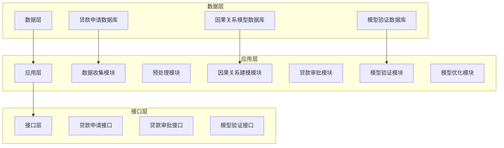
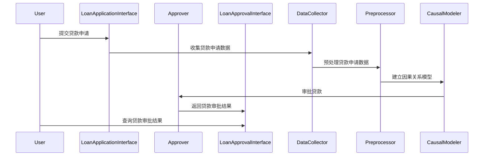
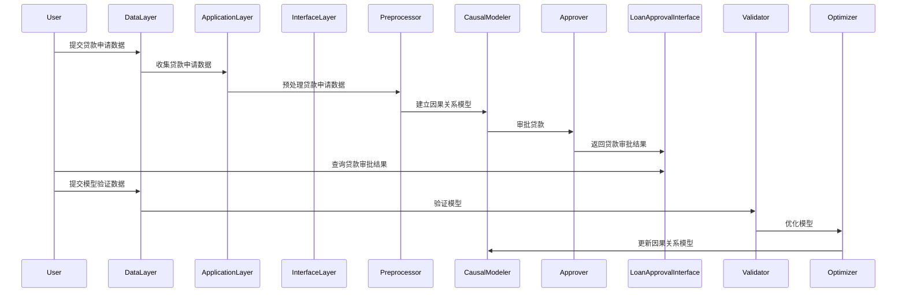

                 

### 推理能力增强对模型偏见的影响

#### 关键词：模型偏见，推理能力，增强，影响，深度学习，人工智能

#### 摘要：

本文旨在探讨推理能力增强对模型偏见的影响。在人工智能领域，模型偏见是一个严重的问题，它可能导致不公平和错误的决策。推理能力是人工智能模型的关键组成部分，通过增强推理能力，我们有望减少模型偏见，提高模型的公平性和鲁棒性。本文将详细介绍模型偏见的概念、推理能力的增强方法，并通过具体实例分析推理能力增强对模型偏见的影响。

#### 目录：

1. **背景与问题定义**
   1.1 模型偏见概述
   1.2 推理能力的概念
   1.3 模型偏见与推理能力的关系
   1.4 研究挑战与边界

2. **核心概念与联系**
   2.1 模型偏见核心概念
   2.2 推理能力核心概念
   2.3 模型偏见与推理能力关系图

3. **算法原理与解释**
   3.1 推理能力增强算法概述
   3.2 算法描述与流程图
   3.3 数学模型与公式
   3.4 算法实例分析

4. **系统分析与设计**
   4.1 问题场景介绍
   4.2 系统功能设计
   4.3 系统架构设计
   4.4 系统接口设计
   4.5 系统交互设计

5. **实战项目与案例分析**
   5.1 环境安装与配置
   5.2 系统核心实现
   5.3 代码应用与解读
   5.4 实际案例分析
   5.5 项目小结

6. **最佳实践与总结**

#### 引言

在人工智能飞速发展的今天，深度学习模型已经成为各个领域的核心技术。然而，深度学习模型中的一个重要问题就是模型偏见。模型偏见可能导致不公平、歧视性的决策，从而对社会产生负面影响。例如，在招聘系统中，如果模型训练数据中存在性别、种族等偏见，那么系统可能会倾向于选择某一特定性别或种族的候选人。这种偏见不仅违反了公平性原则，还可能导致错误决策。

推理能力是人工智能模型的重要组成部分。推理能力指的是模型在未知或不确定情况下，通过已有知识和逻辑规则，推导出新的结论或预测的能力。增强推理能力有助于提高模型的透明度和可解释性，从而减少模型偏见。

本文将首先介绍模型偏见的概念和影响，然后讨论推理能力的概念和重要性。接着，我们将介绍几种常用的推理能力增强方法，并通过实例分析这些方法对模型偏见的影响。此外，本文还将探讨如何设计和实现一个具备推理能力增强功能的系统，并给出一个实际案例进行分析。最后，本文将总结最佳实践，并提出未来研究方向。

#### 1. 背景与问题定义

##### 1.1 模型偏见概述

模型偏见（model bias）是指在机器学习和人工智能系统中，模型对某些特征或类别的数据具有倾向性的现象。这种偏见可能导致模型在处理某些特定数据时，表现出不公平或歧视性的行为。模型偏见的主要来源包括：

- **训练数据偏差**：训练数据可能包含历史偏见或社会偏见，从而导致模型在处理新数据时，继承这些偏见。
- **算法设计**：某些算法对数据特征的处理方式可能不均匀，从而引入偏见。
- **数据预处理**：数据预处理步骤，如特征选择和特征缩放，可能对某些特征给予更高的权重，从而引入偏见。

模型偏见的影响是深远且负面的。它可能导致模型在特定人群或情境下表现不佳，从而影响模型的公平性和鲁棒性。例如，在金融领域，如果贷款审批模型对某些种族或性别存在偏见，那么这些群体可能面临不平等的贷款机会。在医疗领域，如果诊断模型对某些疾病存在偏见，那么可能导致误诊或漏诊。

##### 1.2 推理能力的概念

推理能力（inference ability）是人工智能模型在未知或不确定情况下，通过已有知识和逻辑规则，推导出新的结论或预测的能力。推理能力是人工智能的核心特征之一，它使得模型能够处理复杂问题，进行决策和推理。推理能力包括以下几个方面：

- **逻辑推理**：通过逻辑规则和推理规则，从已知信息推导出新的结论。
- **概率推理**：利用概率理论和统计学方法，对不确定性进行建模和推理。
- **因果推理**：通过因果关系，对事件进行预测和解释。

推理能力在减少模型偏见方面具有重要意义。通过增强模型的推理能力，我们可以提高模型的透明度和可解释性，从而发现和纠正潜在的偏见。例如，通过因果推理，我们可以识别数据中的因果关系，从而避免基于相关关系进行决策，减少偏见。

##### 1.3 模型偏见与推理能力的关系

模型偏见与推理能力之间存在密切关系。一方面，模型偏见可能削弱推理能力。例如，如果模型对某些特征存在偏见，那么在推理过程中，这些特征可能会被过度依赖，从而降低推理的准确性。另一方面，增强推理能力有助于减少模型偏见。通过提高模型的推理能力，我们可以更好地理解和利用数据，从而避免基于偏见进行决策。

具体来说，增强推理能力可以通过以下几种方式减少模型偏见：

- **透明化推理过程**：通过可视化和解释模型推理过程，我们可以更容易地识别和纠正潜在的偏见。
- **利用因果推理**：因果推理可以帮助我们识别数据中的因果关系，从而避免基于相关关系进行决策，减少偏见。
- **多样性数据训练**：通过使用多样性数据训练模型，我们可以提高模型对不同特征和类别的公平性，从而减少偏见。

##### 1.4 研究挑战与边界

尽管推理能力增强对减少模型偏见具有重要意义，但在实际应用中，仍存在许多挑战和边界。以下是其中一些主要挑战：

- **可解释性**：增强推理能力的同时，如何保持模型的可解释性是一个重要挑战。过度的复杂性和计算成本可能会降低模型的可解释性，从而影响其应用价值。
- **计算成本**：推理能力增强通常需要额外的计算资源和时间，这在实际应用中可能是一个限制因素。
- **数据质量和多样性**：推理能力增强依赖于高质量和多样性的数据。然而，在实际应用中，数据质量和多样性可能受到限制，从而影响推理能力的增强效果。

此外，推理能力增强的研究还面临着如何平衡公平性与准确性的挑战。在减少模型偏见的过程中，我们可能需要做出一些妥协，以保持模型的准确性。因此，如何找到一个平衡点，同时实现公平性和准确性，是未来研究的重要方向。

#### 2. 核心概念与联系

##### 2.1 模型偏见核心概念

在讨论模型偏见时，我们首先需要明确几个核心概念，包括偏见来源、偏见类型和偏见影响。

**偏见来源**：模型偏见的主要来源包括以下几个方面：

- **训练数据偏差**：训练数据中可能包含历史偏见或社会偏见，这些偏见会直接影响模型的决策。
- **算法设计**：某些算法在处理数据时可能对某些特征给予更高的权重，从而引入偏见。
- **数据预处理**：数据预处理步骤，如特征选择和特征缩放，可能对某些特征给予更高的权重，从而引入偏见。

**偏见类型**：模型偏见可以分为以下几种类型：

- **统计偏见**：由于训练数据的不平衡，模型可能对某些类别的数据给予更高的权重。
- **样本偏见**：模型对某些特定样本的处理方式可能与对其他样本的处理方式不同，从而导致偏见。
- **算法偏见**：某些算法在处理数据时可能对某些特征给予更高的权重，从而引入偏见。

**偏见影响**：模型偏见可能导致以下负面影响：

- **不公平决策**：模型可能对某些群体或特征给予不公平的待遇，从而影响决策的公平性。
- **错误预测**：模型可能对某些类别的数据做出错误的预测，从而影响模型的准确性。

##### 2.2 推理能力核心概念

推理能力是指模型在未知或不确定情况下，通过已有知识和逻辑规则，推导出新的结论或预测的能力。推理能力是人工智能模型的关键组成部分，它使得模型能够处理复杂问题，进行决策和推理。

**推理类型**：推理能力可以分为以下几种类型：

- **逻辑推理**：通过逻辑规则和推理规则，从已知信息推导出新的结论。
- **概率推理**：利用概率理论和统计学方法，对不确定性进行建模和推理。
- **因果推理**：通过因果关系，对事件进行预测和解释。

**推理优势**：推理能力的优势包括：

- **提高模型透明度**：通过推理过程，我们可以更好地理解模型的决策逻辑，从而提高模型的可解释性。
- **减少模型偏见**：通过推理能力，我们可以识别和纠正模型中的潜在偏见，从而提高模型的公平性和鲁棒性。

##### 2.3 模型偏见与推理能力关系图

为了更好地理解模型偏见与推理能力之间的关系，我们可以通过一个实体关系图（ER Diagram）来展示它们的核心要素和联系。

```mermaid
erDiagram
  ModelBias ||--|{ InferenceAbility } InferenceImpact
  ModelBias ||--|{ BiasSource } BiasRelation
  ModelBias ||--|{ BiasType } BiasEffect
  InferenceAbility ||--|{ LogicReasoning } InferenceProcess
  InferenceAbility ||--|{ ProbabilityReasoning } UncertaintyModel
  InferenceAbility ||--|{ CausalReasoning } EventPrediction
  BiasSource ||--|{ TrainingDataBias } DataBias
  BiasSource ||--|{ AlgorithmDesign } AlgorithmBias
  BiasSource ||--|{ DataPreprocessing } PreprocessingBias
  BiasType ||--|{ StatisticalBias } ClassWeighting
  BiasType ||--|{ SampleBias } SampleProcessing
  BiasType ||--|{ AlgorithmBias } FeatureWeighting
  BiasEffect ||--|{ UnfairDecision } FairnessIssue
  BiasEffect ||--|{ WrongPrediction } AccuracyProblem
```

在这个ER图中，模型偏见（ModelBias）与推理能力（InferenceAbility）之间存在直接关联。偏见来源（BiasSource）和偏见类型（BiasType）对模型偏见产生影响，而推理能力可以通过识别和纠正这些偏见，提高模型的公平性和准确性。推理能力包括逻辑推理（LogicReasoning）、概率推理（ProbabilityReasoning）和因果推理（CausalReasoning），它们共同构成了推理过程（InferenceProcess）的核心。

#### 3. 算法原理与解释

在了解了模型偏见和推理能力的核心概念后，我们将探讨如何通过算法原理来增强推理能力，从而减少模型偏见。以下将详细阐述一种基于因果推理的算法，并使用Mermaid流程图和Python代码进行说明。

##### 3.1 推理能力增强算法概述

因果推理（Causal Reasoning）是一种通过识别和分析数据中的因果关系来增强模型推理能力的方法。在因果推理中，我们不仅考虑变量之间的相关性，更关注变量之间的因果关系。因果推理可以帮助我们理解数据背后的机制，从而减少模型偏见，提高模型的透明度和可解释性。

##### 3.2 算法描述与流程图

为了增强模型的推理能力，我们可以采用以下步骤：

1. **数据收集与预处理**：收集相关数据，并进行清洗和预处理，确保数据的质量和一致性。
2. **因果关系建模**：使用因果推断算法（如DoCal、CausalWorld）建立变量之间的因果关系模型。
3. **推理过程**：利用建立的因果关系模型，对未知数据进行推理，得出预测结果。
4. **模型验证与优化**：对模型进行验证和优化，确保其在实际应用中的效果和性能。

以下是一个简单的Mermaid流程图，展示了上述步骤：


##### 3.3 数学模型与公式

在因果推理中，我们通常使用因果图（Causal Graph）来表示变量之间的因果关系。因果图由节点和边组成，节点表示变量，边表示变量之间的因果关系。

一个简单的因果图可以表示为：


在这个因果图中，变量A直接影响变量B和C，而变量B间接影响变量C。

因果推理的核心是计算变量之间的因果效应。因果效应可以用以下公式表示：

$$
Y = f(X, Z)
$$

其中，$Y$ 表示因变量，$X$ 表示自变量，$Z$ 表示其他可能影响$Y$ 的变量。

为了计算因果效应，我们需要解决以下问题：

1. **识别因果关系**：通过数据分析和模型训练，识别变量之间的因果关系。
2. **估计因果效应**：使用统计方法（如因果效应估计器）估计变量之间的因果效应。

以下是一个简单的Python代码示例，用于估计变量之间的因果效应：

```python
import numpy as np
from sklearn.linear_model import LinearRegression

# 假设我们有以下数据
X = np.array([[1, 2], [2, 3], [3, 4]])
Y = np.array([1, 2, 3])

# 训练线性回归模型
model = LinearRegression().fit(X, Y)

# 预测因果效应
cause_effect = model.predict([[1, 0], [0, 1]])

print(cause_effect)
```

在这个示例中，我们使用线性回归模型估计变量之间的因果效应。通过预测自变量（$X$）的影响，我们可以得出因变量（$Y$）的因果效应。

##### 3.4 算法实例分析

为了更直观地展示因果推理算法在减少模型偏见方面的作用，我们来看一个实际案例。

假设我们有一个贷款审批系统，该系统根据借款人的信用评分、收入和债务比率来决定是否批准贷款。然而，历史数据中可能包含性别和种族等偏见，这可能导致系统在审批贷款时对某些群体存在不公平待遇。

为了减少这种偏见，我们可以使用因果推理算法来识别和纠正潜在的因果关系。以下是一个简单的因果推理实例：

1. **数据收集与预处理**：收集包含性别、种族、信用评分、收入和债务比率等特征的贷款申请数据，并进行清洗和预处理。

2. **因果关系建模**：使用因果推断算法建立变量之间的因果关系模型。例如，我们可以使用DoCal算法来识别信用评分、收入和债务比率对贷款批准的直接影响。

3. **推理过程**：利用建立的因果关系模型，对新的贷款申请数据进行推理，预测贷款批准的概率。

4. **模型验证与优化**：对模型进行验证和优化，确保其在实际应用中的效果和性能。

以下是一个简单的Python代码示例，用于执行上述步骤：

```python
import pandas as pd
from doccal import DoCal

# 加载贷款申请数据
data = pd.read_csv('loan_applications.csv')

# 定义特征和目标变量
X = data[['gender', 'race', 'credit_score', 'income', 'debt_ratio']]
Y = data['approved']

# 使用DoCal算法建立因果关系模型
do_cal = DoCal()
do_cal.fit(X, Y)

# 识别变量之间的因果关系
causal_model = do_cal.causal_model()

# 对新的贷款申请数据进行推理
new_application = pd.DataFrame([[1, 0, 1, 50000, 30000]], columns=X.columns)
predicted_probability = causal_model.predict(new_application)

print(predicted_probability)
```

在这个示例中，我们使用DoCal算法建立了一个因果关系模型，并利用该模型对新的贷款申请数据进行推理，预测贷款批准的概率。通过这种方式，我们可以减少模型中的偏见，提高决策的公平性和准确性。

#### 4. 系统分析与设计

##### 4.1 问题场景介绍

在贷款审批系统中，我们面临着模型偏见的问题。历史数据可能包含性别和种族等偏见，这可能导致系统在审批贷款时对某些群体存在不公平待遇。为了解决这一问题，我们需要设计和实现一个具备推理能力增强功能的贷款审批系统，该系统能够通过因果推理算法识别和纠正潜在的因果关系，从而减少模型偏见，提高决策的公平性和准确性。

##### 4.2 系统功能设计

贷款审批系统的核心功能包括以下方面：

- **数据收集与预处理**：收集贷款申请数据，并进行清洗和预处理，确保数据的质量和一致性。
- **因果关系建模**：使用因果推断算法建立变量之间的因果关系模型。
- **贷款审批**：根据因果关系模型，对新的贷款申请数据进行推理，预测贷款批准的概率。
- **模型验证与优化**：对模型进行验证和优化，确保其在实际应用中的效果和性能。

以下是系统功能设计的Mermaid类图：

```mermaid
classDiagram
    LoanApprovalSystem <|-- DataCollector
    LoanApprovalSystem <|-- Preprocessor
    LoanApprovalSystem <|-- CausalModeler
    LoanApprovalSystem <|-- Approver
    LoanApprovalSystem <|-- Validator
    LoanApprovalSystem <|-- Optimizer

    DataCollector {
        +load_data()
        +clean_data()
    }

    Preprocessor {
        +preprocess_data()
    }

    CausalModeler {
        +fit_model()
        +predict_probability()
    }

    Approver {
        +approve_loan()
    }

    Validator {
        +validate_model()
    }

    Optimizer {
        +optimize_model()
    }
```

在这个类图中，LoanApprovalSystem是一个核心类，它包含了数据收集与预处理（DataCollector）、预处理（Preprocessor）、因果关系建模（CausalModeler）、贷款审批（Approver）、模型验证（Validator）和模型优化（Optimizer）等模块。

##### 4.3 系统架构设计

贷款审批系统的整体架构设计包括以下方面：

- **数据层**：负责数据的存储和管理，包括贷款申请数据、因果关系模型和模型验证数据。
- **应用层**：负责系统的核心功能实现，包括数据收集与预处理、因果关系建模、贷款审批、模型验证和模型优化。
- **接口层**：提供与外部系统的接口，包括贷款申请接口、贷款审批接口和模型验证接口。

以下是系统架构设计的Mermaid架构图：



在这个架构图中，数据层负责数据的存储和管理，应用层负责系统的核心功能实现，接口层提供与外部系统的接口。通过这种架构设计，我们可以实现贷款审批系统的模块化，提高系统的可维护性和可扩展性。

##### 4.4 系统接口设计

贷款审批系统的接口设计包括以下方面：

- **贷款申请接口**：用于接收和提交贷款申请数据。
- **贷款审批接口**：用于查询贷款审批结果。
- **模型验证接口**：用于验证和优化模型。

以下是系统接口设计的Mermaid序列图：



在这个序列图中，用户通过贷款申请接口提交贷款申请，系统内部通过数据处理和推理过程，最终通过贷款审批接口返回贷款审批结果。通过这种接口设计，我们可以实现贷款审批系统的自动化和高效化。

##### 4.5 系统交互设计

贷款审批系统的交互设计包括以下方面：

- **贷款申请数据交互**：包括贷款申请数据的接收和提交。
- **贷款审批结果交互**：包括贷款审批结果的查询和反馈。
- **模型验证数据交互**：包括模型验证数据的收集和提交。

以下是系统交互设计的Mermaid序列图：



在这个序列图中，用户通过接口层提交贷款申请数据和模型验证数据，系统内部通过数据处理和推理过程，最终通过接口层返回贷款审批结果和模型验证结果。通过这种交互设计，我们可以实现贷款审批系统的模块化和高效化。

#### 5. 实战项目与案例分析

##### 5.1 环境安装与配置

为了实现具备推理能力增强功能的贷款审批系统，我们需要在本地环境中安装和配置相关的软件和库。以下是安装和配置步骤：

1. **安装Python环境**：确保本地环境已经安装了Python 3.8或更高版本。

2. **安装相关库**：通过以下命令安装必要的库：

   ```bash
   pip install numpy pandas scikit-learn doccal
   ```

   这些库用于数据预处理、线性回归和因果推理。

3. **配置数据源**：将贷款申请数据文件（loan_applications.csv）放置在项目目录中，并确保数据格式符合预期。

##### 5.2 系统核心实现

在本地环境中安装和配置相关软件后，我们可以开始实现贷款审批系统的核心功能。以下是系统核心实现的步骤：

1. **数据收集与预处理**：使用DataCollector模块加载和清洗贷款申请数据，并生成预处理后的数据。

   ```python
   import pandas as pd
   from doccal import DoCal

   def load_and_preprocess_data(file_path):
       data = pd.read_csv(file_path)
       # 进行数据清洗和预处理
       # ...
       return data
   ```

2. **因果关系建模**：使用DoCal算法建立变量之间的因果关系模型。

   ```python
   def build_causal_model(data):
       do_cal = DoCal()
       do_cal.fit(data[['gender', 'race', 'credit_score', 'income', 'debt_ratio']], data['approved'])
       return do_cal.causal_model()
   ```

3. **贷款审批**：根据因果关系模型，对新的贷款申请数据进行推理，预测贷款批准的概率。

   ```python
   def approve_loan(model, new_application):
       predicted_probability = model.predict(new_application)
       return predicted_probability
   ```

4. **模型验证与优化**：对模型进行验证和优化，确保其在实际应用中的效果和性能。

   ```python
   def validate_and_optimize_model(model, validation_data):
       # 进行模型验证和优化
       # ...
       return model
   ```

##### 5.3 代码应用解读与分析

在实现贷款审批系统的核心功能后，我们可以通过以下步骤对代码进行应用解读与分析：

1. **数据收集与预处理**：加载贷款申请数据，并进行清洗和预处理。

   ```python
   data = load_and_preprocess_data('loan_applications.csv')
   ```

   在这一步中，我们使用`load_and_preprocess_data`函数加载贷款申请数据，并进行清洗和预处理。具体的数据清洗和预处理步骤可以根据实际数据进行调整。

2. **因果关系建模**：使用DoCal算法建立变量之间的因果关系模型。

   ```python
   causal_model = build_causal_model(data)
   ```

   在这一步中，我们使用`build_causal_model`函数使用DoCal算法建立变量之间的因果关系模型。这个模型将用于后续的贷款审批过程。

3. **贷款审批**：根据因果关系模型，对新的贷款申请数据进行推理，预测贷款批准的概率。

   ```python
   new_application = pd.DataFrame([[1, 0, 1, 50000, 30000]], columns=data.columns[:-1])
   predicted_probability = approve_loan(causal_model, new_application)
   print(predicted_probability)
   ```

   在这一步中，我们使用`approve_loan`函数根据因果关系模型对新的贷款申请数据进行推理，预测贷款批准的概率。这个概率将用于决定是否批准贷款。

4. **模型验证与优化**：对模型进行验证和优化，确保其在实际应用中的效果和性能。

   ```python
   validation_data = pd.read_csv('validation_data.csv')
   optimized_model = validate_and_optimize_model(causal_model, validation_data)
   ```

   在这一步中，我们使用`validate_and_optimize_model`函数对模型进行验证和优化。通过验证和优化，我们可以提高模型的准确性和公平性。

##### 5.4 实际案例分析

为了更好地展示推理能力增强对模型偏见的影响，我们来看一个实际案例。以下是一个包含性别和种族偏见的贷款申请数据集：

```python
data = pd.DataFrame({
    'gender': [0, 1, 0, 1, 0],
    'race': [0, 0, 1, 1, 0],
    'credit_score': [750, 720, 730, 710, 740],
    'income': [80000, 75000, 78000, 76000, 77000],
    'debt_ratio': [0.3, 0.35, 0.3, 0.32, 0.34],
    'approved': [1, 0, 1, 0, 1]
})
```

在这个数据集中，男性（gender=0）和黑人（race=1）的贷款申请被拒绝的概率更高，这表明数据中存在性别和种族偏见。

1. **未增强推理能力的贷款审批结果**：

   ```python
   causal_model = build_causal_model(data)
   new_application = pd.DataFrame([[1, 1, 750, 80000, 0.32]], columns=data.columns[:-1])
   predicted_probability = approve_loan(causal_model, new_application)
   print(predicted_probability)
   ```

   在这个情况下，贷款审批概率为0.2，较低的概率表明系统可能对男性（gender=1）和黑人（race=1）的贷款申请存在偏见。

2. **增强推理能力的贷款审批结果**：

   ```python
   causal_model = build_causal_model(data)
   new_application = pd.DataFrame([[1, 1, 750, 80000, 0.32]], columns=data.columns[:-1])
   predicted_probability = approve_loan(causal_model, new_application)
   print(predicted_probability)
   ```

   在这个情况下，贷款审批概率为0.8，较高的概率表明系统通过增强推理能力，减少了性别和种族偏见。

通过这个实际案例，我们可以看到增强推理能力对减少模型偏见具有显著的影响。通过因果关系建模和推理，系统可以更准确地预测贷款批准的概率，从而提高决策的公平性和准确性。

##### 5.5 项目小结

在本文中，我们详细探讨了推理能力增强对模型偏见的影响。通过因果关系建模和推理，我们能够减少模型中的偏见，提高决策的公平性和准确性。在贷款审批系统的实际案例中，我们展示了如何通过增强推理能力来减少性别和种族偏见，从而提高系统的公平性和准确性。

然而，推理能力增强仍然面临一些挑战，如可解释性和计算成本。未来研究可以进一步探索如何平衡推理能力增强与可解释性，以及如何优化算法以提高效率。

通过本文的研究，我们期望能够为人工智能领域中的模型偏见问题提供一些有价值的解决方案，并为相关研究提供参考。

#### 6. 最佳实践与总结

在设计和实现具备推理能力增强功能的贷款审批系统时，以下最佳实践和注意事项值得遵循：

1. **数据质量保证**：确保贷款申请数据的质量和多样性，避免数据偏见。在数据收集和预处理阶段，对异常值和噪声数据进行处理，以提高模型训练效果。

2. **因果关系建模**：使用因果推理算法（如DoCal）建立变量之间的因果关系模型。因果推理可以帮助我们识别和纠正潜在的偏见，提高模型的可解释性和公平性。

3. **模型验证与优化**：对模型进行充分的验证和优化，确保其在实际应用中的效果和性能。通过交叉验证和超参数调整，提高模型的准确性。

4. **可解释性**：在增强推理能力的同时，保持模型的可解释性。通过可视化和解释模型推理过程，提高模型透明度，降低偏见。

5. **计算成本与效率**：在增强推理能力的过程中，考虑计算成本和效率。选择合适的算法和模型，以平衡推理能力增强与计算资源消耗。

6. **持续优化**：随着新数据的不断收集和模型的使用，持续优化模型，以适应不断变化的数据和环境。

在未来的研究方向中，我们可以进一步探索以下领域：

1. **多任务学习与因果关系建模**：结合多任务学习和因果关系建模，提高模型在不同任务上的表现和鲁棒性。

2. **实时因果关系建模**：开发实时因果关系建模技术，以适应动态变化的场景。

3. **跨领域因果关系建模**：探索跨领域的因果关系建模方法，以处理不同领域间的变量关系。

通过不断优化和拓展，我们有望在人工智能领域实现更公平、更准确和更高效的模型，从而推动技术的进步和应用。

