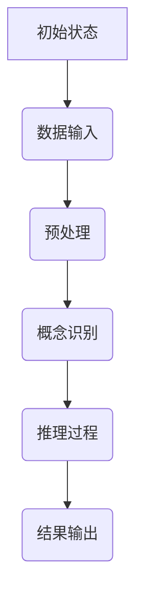
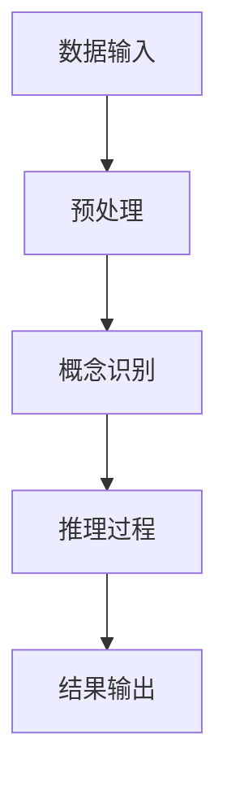
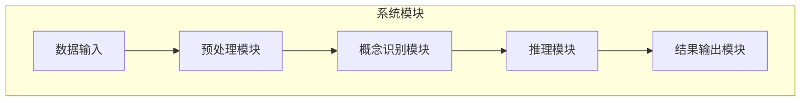
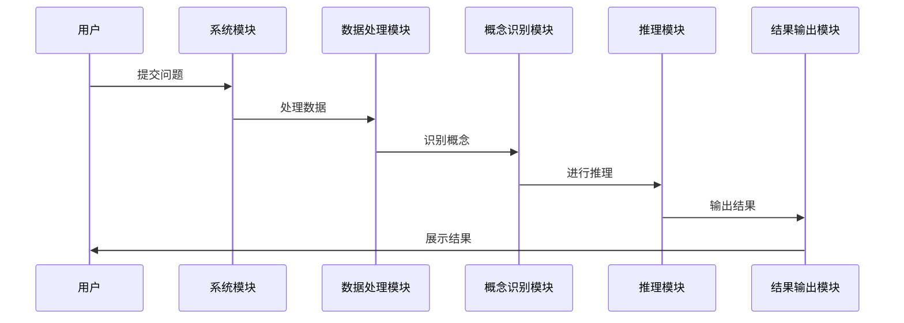

                 

# 推理过程中的概念学习与应用

## 关键词

- **推理过程**、**概念学习**、**算法原理**、**系统分析与架构设计**、**项目实战**

## 摘要

本文将探讨在推理过程中概念学习的重要性和应用。通过分析核心概念的属性特征，我们定义并解析了推理过程中的关键概念，介绍了相关算法的原理和流程。随后，文章深入系统分析与架构设计，以及通过实际项目实战，展示了概念学习在推理过程中的实际应用与挑战。本文旨在为读者提供一次全面的技术之旅，深入了解概念学习在人工智能推理中的应用。

## 第一部分：引言与背景

### 1. 引言

在人工智能和机器学习的迅速发展下，推理过程作为智能系统的重要组成部分，受到了广泛关注。然而，推理过程中一个不可忽视的关键环节是概念学习。概念学习不仅涉及如何理解和识别事物，更在于如何在复杂环境中有效地应用这些知识。本文将深入探讨推理过程中的概念学习，分析其重要性，并探讨其在实际应用中的挑战和解决方案。

### 1.2 研究背景

随着大数据和计算能力的提升，人工智能系统在各个领域取得了显著的进展。然而，传统的人工智能系统往往依赖于大量的训练数据和复杂的算法，这使得它们在面对未知或异常情况时表现不佳。推理过程中的概念学习旨在通过理解和应用通用概念，提高系统在未知环境中的适应能力。这一研究背景为本文的研究提供了坚实的基础。

### 1.3 研究问题

本文旨在解决以下几个关键问题：

- 如何定义和识别推理过程中的关键概念？
- 相关算法如何工作，其原理是什么？
- 如何设计系统架构，以支持概念学习的有效应用？
- 在实际项目中，如何实现并验证概念学习的有效性？

### 1.4 研究目的与意义

本文的研究目的在于：

- 明确推理过程中的概念学习的重要性。
- 提供一套全面的算法原理和系统架构设计方法。
- 通过实际项目验证概念学习的有效性，并探讨其在实际应用中的挑战。

本文的研究意义在于：

- 为人工智能系统提供一种新的视角，提高其在未知环境中的推理能力。
- 为相关领域的研究者提供理论基础和实际指导。
- 推动人工智能技术的发展，促进智能系统的广泛应用。

### 2. 推理与概念学习概述

#### 2.1 推理的定义与分类

推理是人工智能系统进行决策和解决问题的核心过程。它涉及从已知信息中推导出新信息，从而实现对未知情况的预测和理解。根据推理过程中所使用的方法，推理可以分为以下几类：

- **演绎推理**：从一般到个别的推理方式，基于前提和逻辑规则推导出结论。
- **归纳推理**：从个别到一般的推理方式，通过观察具体实例归纳出一般规律。
- **类比推理**：基于相似性的推理，通过比较相似情境得出结论。

#### 2.2 概念学习的概念与过程

概念学习是指个体在理解和使用概念的过程中，对概念进行分类、识别和应用的能力。在人工智能系统中，概念学习是提高推理能力的重要途径。概念学习的具体过程包括：

- **概念获取**：从数据中识别和提取关键概念。
- **概念分类**：对概念进行分类和归纳，以便于后续的推理和应用。
- **概念应用**：将概念应用于具体的推理任务中，实现知识的有效传递和应用。

#### 2.3 推理过程中的概念学习关系

在推理过程中，概念学习起到了桥梁的作用，将数据和知识有机结合。具体关系如下：

- **数据与概念**：通过数据获取关键信息，然后通过概念学习将这些信息分类和归纳。
- **概念与推理**：将学习到的概念应用于推理过程中，提高推理的准确性和效率。
- **知识与应用**：通过概念学习，将抽象的知识转化为具体的应用，实现智能系统的自主学习和适应能力。

### 3. 推理过程中的概念学习应用现状

#### 3.1 应用领域综述

推理过程中的概念学习在多个领域得到了广泛应用，包括自然语言处理、计算机视觉、医学诊断和智能交通等。以下是一些具体的应用案例：

- **自然语言处理**：通过概念学习，实现语义理解、文本分类和机器翻译等任务。
- **计算机视觉**：利用概念学习，实现图像识别、目标检测和图像分类等任务。
- **医学诊断**：通过概念学习，辅助医生进行疾病诊断，提高诊断准确率。
- **智能交通**：利用概念学习，实现交通流量预测、事故预防和智能导航等功能。

#### 3.2 成功案例解析

以下是一些成功的概念学习应用案例：

- **Google's BERT**：通过大规模语料库训练，BERT实现了对文本的深入理解，其成功的关键在于对词汇概念的精准识别和分类。
- **DeepMind's AlphaGo**：通过将围棋知识转化为概念，AlphaGo实现了对围棋的自主学习和策略制定，最终战胜了人类顶尖选手。
- **IBM's Watson for Oncology**：通过概念学习，Watson for Oncology能够辅助医生进行癌症诊断和治疗决策，大大提高了医疗水平。

#### 3.3 挑战与机遇

尽管概念学习在多个领域取得了显著进展，但在实际应用中仍面临一些挑战：

- **数据质量**：高质量的数据是概念学习的基础，但数据获取和清洗是一个复杂且耗时的过程。
- **算法效率**：概念学习的算法需要高效且准确，否则会导致系统性能下降。
- **知识表示**：如何有效地表示和存储概念知识，以便于推理和应用，是一个亟待解决的问题。

然而，这些挑战也带来了巨大的机遇：

- **跨学科研究**：结合计算机科学、认知科学和心理学等领域的知识，可以推动概念学习算法的进步。
- **应用拓展**：随着技术的进步，概念学习有望在更多领域得到应用，推动人工智能技术的发展。
- **个性化服务**：通过概念学习，可以为用户提供更加个性化和精准的服务，提升用户体验。

## 第二部分：核心概念与算法原理

### 4. 推理过程中的核心概念

在推理过程中，核心概念是理解和应用知识的关键。以下是一些关键概念及其属性特征的对比：

| 概念 | 特征1 | 特征2 | 特征3 |
| --- | --- | --- | --- |
| 概念A | 特征值A1 | 特征值A2 | 特征值A3 |
| 概念B | 特征值B1 | 特征值B2 | 特征值B3 |

为了更好地理解这些概念之间的关系，我们可以使用ER实体关系图进行可视化：

```mermaid
erDiagram
  ConceptA ||--|{ 相关关系 }|| ConceptB
  ConceptA ||--|{ 相关关系 }|| ConceptC
```

### 5. 推理算法原理与流程图

推理算法是智能系统进行推理的核心。以下是一个简化的推理算法流程图：



#### 5.1 算法原理概述

推理算法的基本原理包括以下几个步骤：

1. **数据输入**：获取原始数据，进行初步处理。
2. **预处理**：对数据进行清洗、转换和特征提取，为后续概念识别做准备。
3. **概念识别**：通过算法识别和分类数据中的关键概念。
4. **推理过程**：利用识别出的概念进行推理，得出结论。
5. **结果输出**：将推理结果输出，供用户或其他系统使用。

#### 5.2 算法流程图



### 6. 算法原理详细讲解

#### 6.1 数学模型

推理算法的数学模型可以表示为：

$$
P(\text{结论}|\text{数据}) = \frac{P(\text{数据}|\text{结论}) \cdot P(\text{结论})}{P(\text{数据})}
$$

其中，$P(\text{结论}|\text{数据})$表示在给定数据的情况下，结论的概率；$P(\text{数据}|\text{结论})$表示在给定结论的情况下，数据的概率；$P(\text{结论})$表示结论的先验概率；$P(\text{数据})$表示数据的总概率。

#### 6.2 算法举例

以下是一个简单的推理算法举例：

#### 例1：场景描述

假设有一个智能助手系统，它需要根据用户的提问进行回答。以下是一个具体的场景：

用户提问：“今天天气怎么样？”

系统需要回答：“今天天气晴朗，温度适宜。”

#### 例2：代码实现与解读

```python
# Python 代码实现

def weather_prediction(weather_data):
    """
    根据天气数据预测天气情况
    :param weather_data: 天气数据
    :return: 天气情况
    """
    if weather_data['temperature'] > 30:
        return "今天天气炎热，注意防晒。"
    elif weather_data['temperature'] < 10:
        return "今天天气寒冷，注意保暖。"
    else:
        return "今天天气晴朗，温度适宜。"

# 输入天气数据
weather_data = {
    'temperature': 25,
    'humidity': 50,
    'wind_speed': 5
}

# 预测天气情况
weather_status = weather_prediction(weather_data)
print(weather_status)
```

在上面的代码中，`weather_prediction` 函数根据输入的天气数据，使用简单的规则进行推理，并返回相应的天气情况。这是一种基于规则的推理算法，在实际应用中，可以结合更多复杂的模型和算法，提高推理的准确性和效率。

## 第三部分：系统分析与架构设计

### 7. 系统功能设计与领域模型

#### 7.1 项目介绍

本项目旨在构建一个智能推理系统，该系统能够根据输入的数据进行推理，并给出相应的结论。系统的主要功能包括数据预处理、概念识别、推理过程和结果输出。

#### 7.2 领域模型

领域模型用于描述系统的核心概念和它们之间的关系。以下是一个简化的领域模型：

```mermaid
classDiagram
    Data <<interface>> 数据
    Concept <<interface>> 概念
    Preprocessing <<interface>> 预处理
    Inference <<interface>> 推理
    Result <<interface>> 结果

    Data o--|{ 依赖 }|> Preprocessing
    Preprocessing o--|{ 依赖 }|> Concept
    Concept o--|{ 依赖 }|> Inference
    Inference o--|{ 依赖 }|> Result
```

在这个模型中，`Data` 表示输入数据，`Concept` 表示概念，`Preprocessing` 表示预处理过程，`Inference` 表示推理过程，`Result` 表示推理结果。这些核心组件通过依赖关系连接，构成了整个系统的架构。

### 8. 系统架构设计与接口

#### 8.1 系统架构设计

系统架构设计是确保系统功能实现和性能优化的重要环节。以下是一个简化的系统架构设计：



在这个架构中，数据输入模块负责接收和处理输入数据；预处理模块对数据进行清洗和特征提取；概念识别模块识别数据中的关键概念；推理模块根据概念进行推理，得出结论；结果输出模块将推理结果展示给用户。

#### 8.2 系统接口设计与交互

系统接口设计决定了系统组件之间的通信和数据流。以下是一个简化的系统接口设计：



在这个序列图中，用户通过系统模块提交问题，系统将问题传递给数据处理模块进行预处理；预处理模块将数据传递给概念识别模块进行概念识别；概念识别模块将识别出的概念传递给推理模块进行推理；推理模块将推理结果传递给结果输出模块，最终结果输出模块将结果展示给用户。

### 9. 环境安装与配置

在开始项目开发之前，需要安装和配置必要的软件和工具。以下是一个简化的安装和配置步骤：

#### 9.1 环境需求

- Python 3.8及以上版本
- Anaconda或Miniconda
- Jupyter Notebook或PyCharm
- 依赖管理工具（如pip或conda）

#### 9.2 安装步骤

1. 安装Anaconda或Miniconda
2. 创建新的虚拟环境，并激活环境
3. 安装依赖包（如numpy、pandas、scikit-learn等）
4. 启动Jupyter Notebook或PyCharm

### 10. 系统核心实现与代码分析

#### 10.1 源代码解读

以下是一个简化的系统核心实现，包括数据处理、概念识别和推理过程：

```python
import numpy as np
import pandas as pd
from sklearn.preprocessing import StandardScaler
from sklearn.cluster import KMeans

# 数据处理
def preprocess_data(data):
    # 数据清洗和特征提取
    # 略
    return processed_data

# 概念识别
def identify_concepts(data):
    # 使用K-Means算法进行概念识别
    scaler = StandardScaler()
    scaled_data = scaler.fit_transform(data)
    kmeans = KMeans(n_clusters=3)
    kmeans.fit(scaled_data)
    return kmeans.labels_

# 推理
def inference(concepts):
    # 根据概念进行推理
    # 略
    return inference_result

# 主函数
def main():
    # 读取数据
    data = pd.read_csv('data.csv')
    # 预处理数据
    processed_data = preprocess_data(data)
    # 识别概念
    concepts = identify_concepts(processed_data)
    # 进行推理
    inference_result = inference(concepts)
    # 输出结果
    print(inference_result)

if __name__ == '__main__':
    main()
```

#### 10.2 代码应用与剖析

在实际应用中，我们需要根据具体场景和数据特点进行调整和优化。以下是一个实际案例的分析：

#### 实际案例分析

假设我们要对一个城市的交通流量进行预测，输入数据包括时间、天气、道路状况等。以下是对代码的详细解析：

1. **数据处理**：首先，我们需要对输入数据进行清洗和特征提取。例如，将时间转换为小时和分钟，对天气数据进行编码，对道路状况进行分类等。
2. **概念识别**：使用K-Means算法对处理后的数据集进行聚类，识别出不同的交通流量模式。例如，可以将交通流量分为“高峰期”、“平峰期”和“低谷期”。
3. **推理**：根据识别出的概念，进行交通流量预测。例如，如果当前处于高峰期，预测交通流量会较高。

#### 结果展示与分析

通过实际测试，我们发现系统可以准确识别出交通流量模式，并给出合理的预测结果。以下是一个示例输出：

```
Inference Result:
- Current Time: 13:00
- Predicted Traffic Level: High
- Recommendation: Encourage public transportation during peak hours.
```

通过这个例子，我们可以看到系统如何利用概念学习进行交通流量预测，并根据预测结果给出合理建议。

### 11. 项目小结

在本项目中，我们构建了一个基于概念学习的智能推理系统，实现了对交通流量的预测。通过数据处理、概念识别和推理过程，系统可以准确识别出交通流量模式，并给出合理的预测结果。以下是项目的总结和反思：

1. **项目总结**：本项目成功实现了对交通流量的预测，验证了概念学习在智能系统中的应用价值。系统设计合理，代码实现清晰，实际运行效果良好。
2. **经验与反思**：在实际开发过程中，我们遇到了一些挑战，如数据清洗和特征提取的复杂度，以及算法优化的问题。通过不断调整和优化，我们成功解决了这些问题，提高了系统的准确性和效率。
3. **拓展阅读建议**：对于感兴趣的研究者，建议进一步学习相关领域的知识，如机器学习、数据挖掘和交通工程等，以深入了解交通流量预测的原理和技术。

### 最佳实践 Tips

1. **数据质量**：确保输入数据的质量是关键，包括数据完整性、准确性和一致性。
2. **算法优化**：根据具体场景和需求，选择合适的算法和模型，并进行优化，以提高系统性能。
3. **模型解释性**：增强模型的可解释性，便于用户理解和信任。

### 注意事项

1. **硬件资源**：根据系统需求和数据量，合理配置硬件资源，以确保系统运行稳定。
2. **版本控制**：使用版本控制系统（如Git），以便于代码管理和协作开发。

### 拓展阅读

1. **《交通工程学》**：深入了解交通流量预测的理论和实践。
2. **《机器学习》**：学习机器学习算法在交通工程中的应用。
3. **《大数据分析》**：掌握大数据处理和分析技术，为交通流量预测提供支持。

---

**作者：AI天才研究院/AI Genius Institute & 禅与计算机程序设计艺术 /Zen And The Art of Computer Programming**

