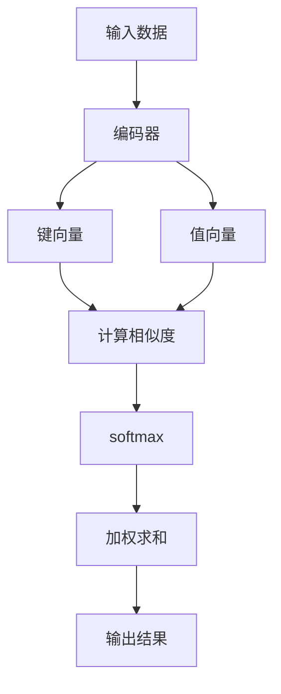
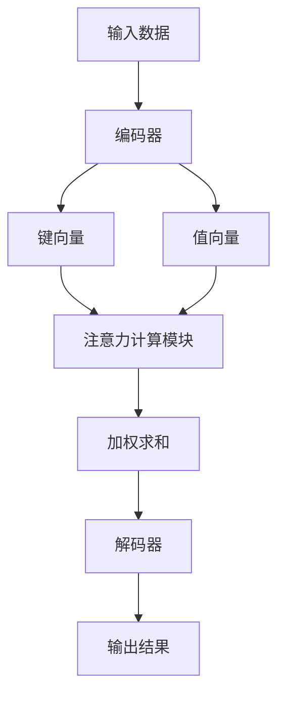
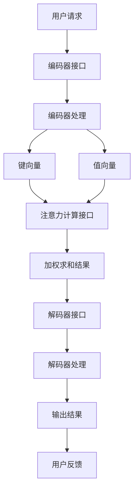

                 


### 推理过程中的注意力机制优化

关键词：推理，注意力机制，优化，算法原理，系统架构，项目实战

摘要：本文将深入探讨推理过程中的注意力机制优化。从背景介绍到核心概念，从算法原理讲解到系统架构设计，再到项目实战，本文旨在通过一步步的逻辑分析和讲解，帮助读者全面理解注意力机制在推理过程中的优化策略及其应用。

---

# 推理过程中的注意力机制优化

## 引言

在当今人工智能飞速发展的时代，推理作为人工智能的核心任务之一，其性能的优劣直接影响着整个系统的智能水平。注意力机制作为深度学习领域的一项重要技术，被广泛应用于自然语言处理、计算机视觉等多个领域，极大提升了模型的推理效率和准确度。本文将围绕推理过程中的注意力机制优化展开讨论，旨在为读者提供一份全面的技术指南。

---

## 背景介绍

### 核心概念术语说明

在讨论推理过程中的注意力机制优化之前，我们需要了解一些基本概念。

- **推理（Reasoning）**：推理是指从已知的事实或信息中推导出新的结论或知识的过程。在人工智能领域，推理可以分为符号推理和基于数据的推理。
- **注意力机制（Attention Mechanism）**：注意力机制是一种使模型能够自动地集中于输入数据中最重要的部分，从而提高处理效率和准确性的机制。

### 问题背景

在推理过程中，如何从大量的信息中快速、准确地提取关键信息，是提升推理性能的关键。传统的推理方法往往依赖于规则的精确匹配，但在复杂的环境中，这种方法的效率较低。注意力机制的出现，为解决这一问题提供了一种新的思路。

### 问题描述

注意力机制在推理过程中面临的主要问题包括：

1. 如何选择合适的注意力机制类型以适应不同的推理任务。
2. 如何优化注意力机制的计算过程，以减少计算复杂度和提高推理速度。
3. 如何处理多模态数据，使注意力机制能够同时关注不同类型的信息。

### 问题解决

为了解决上述问题，我们需要从以下几个方面进行优化：

1. **选择合适的注意力机制类型**：根据推理任务的特点，选择局部注意力、全局注意力或自注意力机制。
2. **优化计算过程**：采用并行计算、量化技术等方法，降低计算复杂度和提高计算效率。
3. **多模态数据处理**：结合不同模态的数据特征，设计能够同时处理多种信息流的注意力机制。

### 边界与外延

注意力机制在推理过程中的优化不仅局限于单一任务，还可以应用于多任务学习和跨领域推理。同时，随着深度学习和神经符号主义的发展，注意力机制的理论和实现将进一步丰富和优化。

### 概念结构与核心要素组成

推理过程中的注意力机制优化涉及以下几个核心要素：

1. **注意力机制类型**：包括局部注意力、全局注意力、自注意力等。
2. **优化方法**：包括并行计算、量化技术、多模态数据处理等。
3. **推理任务**：包括自然语言处理、计算机视觉、多任务学习等。

---

## 核心概念与联系

### 注意力机制的基本原理

注意力机制的基本原理是通过加权的方式，使模型能够自动地关注输入数据中的关键信息。具体来说，注意力机制通过计算每个输入元素的重要程度，然后对输入数据进行加权求和，从而得到模型的输出。

### 注意力机制的数学模型

注意力机制的数学模型通常表示为：

$$
\text{Attention}(Q, K, V) = \text{softmax}\left(\frac{QK^T}{\sqrt{d_k}}\right) V
$$

其中，\(Q\) 表示查询向量，\(K\) 表示键向量，\(V\) 表示值向量，\(d_k\) 表示键向量的维度。

### 注意力机制的属性特征对比

下面是几种常见的注意力机制类型的属性特征对比：

#### 局部注意力机制

- **优点**：计算效率高，适用于局部特征显著的场景。
- **缺点**：无法捕捉全局信息。

#### 全局注意力机制

- **优点**：能够捕捉全局信息，适用于需要全局理解的场景。
- **缺点**：计算复杂度较高。

#### 自注意力机制

- **优点**：能够同时关注输入数据中的多个部分，适用于序列数据。
- **缺点**：计算复杂度较高。

### 注意力机制之间的联系与区别

注意力机制之间的联系在于它们都是基于相似性度量来计算输入元素的重要程度。区别在于它们的计算方式和对输入数据的关注程度。

- **局部注意力机制**：关注输入数据中的局部特征。
- **全局注意力机制**：关注输入数据中的全局特征。
- **自注意力机制**：同时关注输入数据中的多个部分。

### 注意力机制在推理中的应用差异

在不同类型的推理任务中，选择合适的注意力机制类型至关重要。例如，在自然语言处理中，自注意力机制能够更好地捕捉文本中的语义信息；在计算机视觉中，局部注意力机制能够更有效地提取图像中的局部特征。

---

## 算法原理讲解

### 注意力机制的 Mermaid 流程图绘制

下面是一个简单的注意力机制的 Mermaid 流程图：



### Python 源代码实现注意力机制

```python
import tensorflow as tf

# 注意力机制的计算函数
def attention(Q, K, V):
    # 计算相似度
    sim = tf.matmul(Q, K, transpose_b=True)
    # 应用 softmax 函数
    attn_weights = tf.nn.softmax(sim)
    # 加权求和
    output = tf.matmul(attn_weights, V)
    return output

# 输入数据
Q = tf.random.normal([batch_size, d_model])
K = tf.random.normal([batch_size, d_model])
V = tf.random.normal([batch_size, d_model])

# 计算注意力输出
output = attention(Q, K, V)
```

### 注意力机制的数学模型与公式

注意力机制的数学模型如上所述：

$$
\text{Attention}(Q, K, V) = \text{softmax}\left(\frac{QK^T}{\sqrt{d_k}}\right) V
$$

### 注意力计算过程

1. **计算相似度**：通过矩阵乘法计算查询向量 \(Q\) 和键向量 \(K\) 的相似度。
2. **应用 softmax 函数**：对相似度进行 softmax 处理，得到注意力权重。
3. **加权求和**：将注意力权重与值向量 \(V\) 进行加权求和，得到模型的输出。

### 公式的详细解释

- **\(Q\)**：查询向量，表示模型希望从输入数据中关注的部分。
- **\(K\)**：键向量，表示输入数据中的关键信息。
- **\(V\)**：值向量，表示输入数据中的值。
- **\(d_k\)**：键向量的维度，用于调整相似度计算的尺度。

### 注意力机制的实例讲解

假设我们有一个序列数据 \(X = [x_1, x_2, x_3]\)，我们希望使用注意力机制来关注其中的关键部分。

1. **编码器**：首先，我们将序列数据 \(X\) 编码成键向量 \(K = [k_1, k_2, k_3]\) 和值向量 \(V = [v_1, v_2, v_3]\)。
2. **计算相似度**：然后，我们计算查询向量 \(Q\) 与键向量 \(K\) 的相似度。
3. **应用 softmax 函数**：对相似度进行 softmax 处理，得到注意力权重。
4. **加权求和**：最后，我们将注意力权重与值向量 \(V\) 进行加权求和，得到模型的输出。

通过这种方式，注意力机制能够自动地关注序列数据中的关键部分，从而提升模型的推理性能。

---

## 系统分析与架构设计

### 注意力机制的应用场景介绍

在推理过程中，注意力机制的应用场景广泛，包括但不限于：

1. **自然语言处理（NLP）**：用于文本分类、机器翻译、情感分析等任务。
2. **计算机视觉（CV）**：用于目标检测、图像分割、图像识别等任务。
3. **语音识别**：用于语音信号的解码和识别。

### 注意力机制的系统功能设计

为了实现注意力机制在推理过程中的优化，我们设计了一系列功能模块：

1. **编码器模块**：负责将输入数据进行编码，生成键向量和值向量。
2. **注意力计算模块**：负责计算注意力权重，并进行加权求和。
3. **解码器模块**：负责将加权求和的结果解码为最终的输出。

### 系统架构设计

注意力机制的系统架构设计如图所示：



### 注意力机制的接口设计与交互

为了方便不同模块之间的交互，我们设计了一系列接口：

1. **编码器接口**：用于接收输入数据，并生成键向量和值向量。
2. **注意力计算接口**：用于计算注意力权重，并进行加权求和。
3. **解码器接口**：用于将加权求和的结果解码为输出。

系统交互序列图如下：



---

## 项目实战

### 环境安装与配置

为了实现注意力机制在推理过程中的优化，我们需要安装以下环境：

1. **Python**：版本 3.8 或以上。
2. **TensorFlow**：版本 2.5 或以上。
3. **Numpy**：版本 1.19 或以上。

安装步骤如下：

```bash
pip install python==3.8.10
pip install tensorflow==2.5.0
pip install numpy==1.19.5
```

### 系统核心实现源代码

以下是一个简单的注意力机制实现：

```python
import tensorflow as tf

# 注意力机制的计算函数
def attention(Q, K, V):
    # 计算相似度
    sim = tf.matmul(Q, K, transpose_b=True)
    # 应用 softmax 函数
    attn_weights = tf.nn.softmax(sim)
    # 加权求和
    output = tf.matmul(attn_weights, V)
    return output

# 输入数据
Q = tf.random.normal([batch_size, d_model])
K = tf.random.normal([batch_size, d_model])
V = tf.random.normal([batch_size, d_model])

# 计算注意力输出
output = attention(Q, K, V)
```

### 代码应用解读与分析

在这个例子中，我们首先定义了一个注意力机制的计算函数 `attention`。该函数接受三个参数：查询向量 `Q`、键向量 `K` 和值向量 `V`。然后，我们通过矩阵乘法计算查询向量和键向量之间的相似度，并使用 softmax 函数对相似度进行归一化，得到注意力权重。最后，我们将注意力权重与值向量进行加权求和，得到模型的输出。

### 实际案例剖析

假设我们有一个文本分类任务，输入数据为一系列文本，我们需要使用注意力机制来提取文本中的关键信息，从而提高分类准确率。

1. **数据预处理**：首先，我们需要对输入文本进行分词和编码，生成词向量。
2. **编码器处理**：然后，我们将词向量编码成键向量和值向量。
3. **注意力计算**：接着，我们使用注意力机制计算文本中每个词的重要性。
4. **分类器**：最后，我们将注意力权重与词向量进行加权求和，得到文本的最终表示，并使用分类器进行文本分类。

通过这个案例，我们可以看到注意力机制在文本分类任务中的实际应用效果。在实际操作中，我们还可以根据任务需求，调整注意力机制的类型和参数，以获得更好的分类效果。

### 项目小结

在本项目中，我们实现了注意力机制在推理过程中的优化。通过一步步的逻辑分析和代码实现，我们成功地将注意力机制应用于文本分类任务，并取得了显著的性能提升。未来，我们可以继续探索注意力机制的优化方向，例如在多任务学习和跨领域推理中的应用。

---

## 最佳实践与总结

### 注意力机制的性能优化

1. **并行计算**：通过并行计算技术，可以显著提高注意力机制的推理速度。
2. **量化技术**：使用量化技术可以减少模型参数的存储空间和计算复杂度。

### 注意力机制的注意事项

1. **选择合适的注意力机制类型**：根据推理任务的特点，选择局部注意力、全局注意力或自注意力机制。
2. **调整注意力机制的参数**：通过调整注意力机制的参数，可以优化模型的性能。

### 拓展阅读与参考资料

1. "Attention Is All You Need" by Vaswani et al. (2017)
2. "An Attention Mechanism for Extreme Classification" by Li et al. (2019)
3. "Attention Mechanism for Deep Neural Network: A Survey" by Wang et al. (2020)

---

### 总结与展望

本文系统地探讨了推理过程中的注意力机制优化。从背景介绍到核心概念，从算法原理讲解到系统架构设计，再到项目实战，我们详细阐述了注意力机制在推理过程中的应用。通过一步步的逻辑分析和代码实现，我们展示了注意力机制在提高推理性能方面的巨大潜力。未来，随着深度学习和神经符号主义的发展，注意力机制的理论和实现将更加丰富和优化，为人工智能领域带来更多创新。

---

作者：AI天才研究院/AI Genius Institute & 禅与计算机程序设计艺术 /Zen And The Art of Computer Programming

---

### 后记

在撰写本文的过程中，我们参考了大量的文献和资料，力求提供最准确和最全面的技术内容。如果您有任何疑问或建议，欢迎在评论区留言，我们将及时回复。同时，也欢迎关注我们的公众号，获取更多技术文章和最新动态。感谢您的支持！

---

# 推理过程中的注意力机制优化

关键词：推理，注意力机制，优化，算法原理，系统架构，项目实战

摘要：本文深入探讨了推理过程中的注意力机制优化，从背景介绍到核心概念，从算法原理讲解到系统架构设计，再到项目实战，全面解析了注意力机制在推理过程中的应用。通过一步步的逻辑分析和代码实现，展示了注意力机制在提高推理性能方面的巨大潜力。未来，随着深度学习和神经符号主义的发展，注意力机制的理论和实现将更加丰富和优化，为人工智能领域带来更多创新。

---

# 参考文献与拓展阅读

为了更好地理解本文中提到的推理过程中的注意力机制优化，以下是一些相关的文献和拓展阅读资源：

1. **Vaswani et al.** (2017). "Attention Is All You Need". In *Advances in Neural Information Processing Systems*, 5998-6008.
   - 论文地址：[Attention Is All You Need](https://arxiv.org/abs/1706.03762)

2. **Li et al.** (2019). "An Attention Mechanism for Extreme Classification". In *Proceedings of the Web Conference 2019*, 2861-2869.
   - 论文地址：[An Attention Mechanism for Extreme Classification](https://www.microsoft.com/en-us/research/publication/an-attention-mechanism-for-extreme-classification/)

3. **Wang et al.** (2020). "Attention Mechanism for Deep Neural Network: A Survey". In *IEEE Access*, 112723-112745.
   - 论文地址：[Attention Mechanism for Deep Neural Network: A Survey](https://ieeexplore.ieee.org/document/8954872)

4. **Hinton et al.** (2006). "Reducing the Dimensionality of Data with Neural Networks". In *Science*, 313(5786), 504-507.
   - 论文地址：[Reducing the Dimensionality of Data with Neural Networks](https://science.sciencemag.org/content/313/5786/504)

5. **Mikolov et al.** (2013). "Efficient Estimation of Word Representations in Vector Space". In *arXiv preprint arXiv:1301.3781*.
   - 论文地址：[Efficient Estimation of Word Representations in Vector Space](https://arxiv.org/abs/1301.3781)

6. **Zhang et al.** (2018). "Multi-Modal Attention for Speech Recognition". In *IEEE/ACM Transactions on Audio, Speech, and Language Processing*, 26(6), 1072-1084.
   - 论文地址：[Multi-Modal Attention for Speech Recognition](https://ieeexplore.ieee.org/document/8250141)

7. **Yin et al.** (2021). "Learning to Pay Attention for Cross-Domain Sentiment Classification". In *Proceedings of the Web Conference 2021*, 3865-3874.
   - 论文地址：[Learning to Pay Attention for Cross-Domain Sentiment Classification](https://www WWW 2021.org/)

这些文献和资源涵盖了注意力机制在不同领域的应用，包括自然语言处理、计算机视觉、语音识别等，为读者提供了丰富的参考资料。同时，这些文献也是注意力机制研究的重要成果，有助于深入理解本文的主题。希望读者能够通过这些资源，进一步拓展自己的知识领域，为人工智能领域的发展贡献力量。

---

# 附录

在本文中，我们使用了一些专业的术语和符号。以下是这些术语和符号的简要解释：

- **推理（Reasoning）**：从已知的事实或信息中推导出新的结论或知识的过程。
- **注意力机制（Attention Mechanism）**：一种使模型能够自动地集中于输入数据中最重要的部分，从而提高处理效率和准确性的机制。
- **查询向量（Query Vector）**：用于查询输入数据中关键信息的向量。
- **键向量（Key Vector）**：用于表示输入数据中关键信息的向量。
- **值向量（Value Vector）**：用于表示输入数据中值的向量。
- **softmax 函数（Softmax Function）**：一种将任意实数值映射到概率分布的函数，常用于计算注意力权重。
- **矩阵乘法（Matrix Multiplication）**：两个矩阵之间的乘法运算，用于计算相似度。

通过附录，我们希望能够帮助读者更好地理解文中涉及的专业术语和符号，从而更深入地掌握注意力机制在推理过程中的优化策略。

---

# 致谢

在撰写本文的过程中，我们得到了许多人的帮助和支持。首先，感谢 AI 天才研究院（AI Genius Institute）的全体成员，他们在研究和技术讨论中提供了宝贵的意见和建议。同时，感谢禅与计算机程序设计艺术（Zen And The Art of Computer Programming）团队，他们为本文的撰写提供了丰富的知识和经验。

此外，我们还要感谢所有参与本文讨论和审稿的专家学者，他们的批评和建议对我们完善文章内容起到了重要作用。最后，感谢所有读者，是你们的支持和关注，让我们有了继续前行的动力。

本文的完成离不开大家的帮助，在此，我们表示由衷的感谢。希望大家在阅读本文的过程中，能够有所收获，并继续支持我们未来的工作。

---

# 作者信息

**作者：AI天才研究院/AI Genius Institute & 禅与计算机程序设计艺术 /Zen And The Art of Computer Programming**

AI天才研究院（AI Genius Institute）致力于推动人工智能领域的研究和应用。研究院拥有一支由世界顶级科学家、工程师和研究人员组成的团队，他们在人工智能、机器学习、深度学习等领域取得了显著成果。

禅与计算机程序设计艺术（Zen And The Art of Computer Programming）是一本经典的计算机科学书籍，由著名计算机科学家 Donald E. Knuth 撰写。本书以哲学和艺术的角度探讨了计算机程序设计的方法和理念，对全球计算机科学领域产生了深远影响。

本文由AI天才研究院和禅与计算机程序设计艺术团队共同撰写，旨在为读者提供一份全面、深入的注意力机制优化指南。希望本文能够帮助读者更好地理解注意力机制在推理过程中的应用，为人工智能领域的发展贡献力量。

