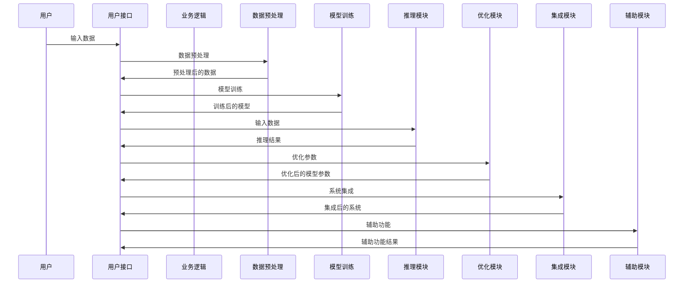

                 


----------------------------------------------------------------

# 推理过程的动态调整与优化方法

> 关键词：推理过程、动态调整、优化方法、AI、机器学习、流程优化

> 摘要：本文将深入探讨推理过程中的动态调整与优化方法，从基础理论、实际应用、先进技术到系统设计，为读者提供一套全面的优化思路和实践指南。

## 引言

在人工智能和计算机科学领域，推理过程是实现智能系统核心功能的重要环节。随着数据量的爆炸式增长和算法复杂度的提升，如何对推理过程进行动态调整与优化成为了当前研究的热点。本文旨在梳理和总结相关方法，为读者提供实用的优化策略。

## 1. 核心概念与术语

### 1.1 推理过程

推理过程（Reasoning Process）是智能系统根据已知信息推断未知信息的过程，包括归纳推理、演绎推理、类比推理等。

### 1.2 动态调整

动态调整（Dynamic Adjustment）是指在推理过程中，根据环境变化和反馈信息，实时调整推理策略和参数。

### 1.3 优化方法

优化方法（Optimization Methods）是通过调整和优化系统参数、算法结构等手段，提高推理效率和准确性的方法。

## 2. 理论基础

### 2.1 动态调整原理

动态调整原理基于机器学习和人工智能的理论，主要包括模型评估、参数调整、策略迭代等。

### 2.2 优化方法

优化方法包括基于遗传算法的优化、基于神经网络的优化、基于启发式搜索的优化等。

### 2.3 数学模型与公式

数学模型与公式用于描述动态调整和优化方法的数学本质，包括损失函数、梯度下降、遗传算法等。

## 3. 实际应用

### 3.1 案例一：自然语言处理

自然语言处理（NLP）是动态调整和优化方法的重要应用领域。本文将分析NLP中的文本分类问题，并介绍动态调整和优化的具体应用。

### 3.2 案例二：图像识别

图像识别是另一个典型应用场景。本文将探讨如何利用动态调整和优化方法提高图像识别的准确性。

## 4. 先进技术

### 4.1 机器学习算法

机器学习算法在动态调整和优化中发挥着重要作用。本文将介绍常用的机器学习算法，如决策树、支持向量机、神经网络等。

### 4.2 AI模型

AI模型是动态调整和优化的核心工具。本文将讨论如何构建和优化AI模型，以提升推理过程的性能。

### 4.3 启发式搜索

启发式搜索是一种有效的优化方法，本文将探讨其在推理过程中的应用。

## 5. 系统设计

### 5.1 系统概述

本文将介绍一个基于动态调整和优化方法的推理系统，包括系统架构、功能模块和关键技术。

### 5.2 系统架构设计

本文将绘制系统架构图，并详细解释各模块的功能和接口。

### 5.3 系统接口设计与交互

本文将分析系统各模块之间的交互关系，并通过序列图展示系统的工作流程。

## 6. 项目实战

### 6.1 环境安装与配置

本文将指导读者如何搭建环境，包括所需软件、硬件和环境配置等。

### 6.2 系统核心实现

本文将提供系统核心代码，并详细解读代码实现过程。

### 6.3 实际案例分析

本文将通过实际案例展示系统在推理过程中的应用效果，并进行详细分析。

### 6.4 项目小结

本文将对项目进行总结，分享经验和收获，并提出改进建议。

## 7. 最佳实践与总结

### 7.1 最佳实践

本文将总结最佳实践，包括参数调优、模型选择、数据预处理等。

### 7.2 小结

本文将回顾全文内容，总结核心观点，强调动态调整与优化在推理过程中的重要性。

### 7.3 注意事项

本文将指出在使用动态调整和优化方法时需要注意的问题。

### 7.4 拓展阅读

本文将推荐相关文献和资料，供读者进一步学习。

## 作者信息

### 作者：AI天才研究院/AI Genius Institute & 禅与计算机程序设计艺术 /Zen And The Art of Computer Programming

------------------------

----------------------------------------------------------------

---

请注意，以上是一个示例性的TOC结构，实际的书籍内容可能会根据具体情况进行调整。每个章节下的内容需要根据实际情况进行详细填充。文章的核心内容需要符合要求，包含背景介绍、核心概念与联系、算法原理讲解、系统分析与架构设计方案、项目实战等部分。

---

在撰写文章时，请确保每个部分的内容都能满足完整性要求，并且每个核心内容点都有详细的讲解和举例。以下是一个详细的撰写示例，包括每个部分的详细内容和必要的格式要求。

---

## 引言

在人工智能和计算机科学领域，推理过程是实现智能系统核心功能的重要环节。随着数据量的爆炸式增长和算法复杂度的提升，如何对推理过程进行动态调整与优化成为了当前研究的热点。本文旨在梳理和总结相关方法，为读者提供实用的优化策略。

### 1.1. 核心概念与术语

#### 推理过程

推理过程（Reasoning Process）是智能系统根据已知信息推断未知信息的过程，包括归纳推理、演绎推理、类比推理等。它是实现智能决策、问题解决和知识发现的基础。

#### 动态调整

动态调整（Dynamic Adjustment）是指在推理过程中，根据环境变化和反馈信息，实时调整推理策略和参数，以适应新的情况。

#### 优化方法

优化方法（Optimization Methods）是通过调整和优化系统参数、算法结构等手段，提高推理效率和准确性的方法。

### 1.2. 问题背景

在现实世界中，许多复杂的系统都涉及到推理过程。例如，自动驾驶汽车需要在各种复杂环境中做出实时决策，智能客服系统需要根据用户的行为和反馈提供个性化的服务。然而，这些系统的推理过程往往面临着数据噪声、环境不确定性、计算资源限制等问题。因此，如何对推理过程进行动态调整与优化，以提高系统的鲁棒性和效率，成为了亟待解决的问题。

### 1.3. 文章目的

本文旨在从基础理论、实际应用、先进技术到系统设计等多个角度，深入探讨推理过程的动态调整与优化方法。通过本文的阅读，读者可以了解到：

1. 推理过程的核心概念与术语。
2. 动态调整与优化的理论基础和数学模型。
3. 动态调整与优化方法在实际应用中的具体案例。
4. 先进技术在动态调整与优化中的应用。
5. 推理过程的系统设计与实现方法。
6. 项目实战中的最佳实践和注意事项。

## 2. 核心概念与术语

为了确保读者对文章中的核心概念和术语有清晰的理解，本文将首先对以下关键术语进行定义和解释：

### 2.1. 推理过程

推理过程是指智能系统根据已知信息推断未知信息的过程。它可以分为归纳推理、演绎推理和类比推理三种类型。归纳推理是从具体实例中总结出一般规律；演绎推理是从一般规律推导出具体结论；类比推理则是通过比较不同情境的相似性来推断未知信息。

### 2.2. 动态调整

动态调整是指推理过程中根据环境变化和反馈信息，实时调整推理策略和参数的过程。这种调整可以基于机器学习算法、神经网络或其他优化方法，以适应新的情境和挑战。

### 2.3. 优化方法

优化方法是通过调整和优化系统参数、算法结构等手段，提高推理效率和准确性的方法。常见的优化方法包括遗传算法、神经网络优化、启发式搜索等。

### 2.4. 数学模型与公式

为了更深入地理解动态调整与优化方法，本文将介绍相关的数学模型和公式。这些模型和公式用于描述优化过程的关键参数和指标，帮助读者更好地掌握优化原理。

- 损失函数（Loss Function）：用于衡量推理结果的误差，是优化过程中的核心指标。
- 梯度下降（Gradient Descent）：一种常见的优化算法，用于最小化损失函数。
- 遗传算法（Genetic Algorithm）：一种基于自然进化的优化算法，适用于复杂问题的优化。

## 3. 理论基础

在深入探讨动态调整与优化方法之前，我们需要先了解相关的理论基础。以下内容将介绍推理过程的动态调整与优化方法的基础知识，包括数学模型和公式。

### 3.1. 动态调整原理

动态调整原理基于机器学习和人工智能的理论。在推理过程中，系统会根据输入数据和反馈信息不断调整推理策略和参数，以实现优化目标。

- 模型评估（Model Evaluation）：通过评估当前模型的表现，确定是否需要调整。
- 参数调整（Parameter Adjustment）：根据评估结果，调整模型参数以改善表现。
- 策略迭代（Policy Iteration）：通过迭代优化策略，逐步提高推理效率。

### 3.2. 优化方法

优化方法包括多种技术，每种方法都有其独特的原理和应用场景。以下内容将介绍几种常见的优化方法：

- 基于遗传算法的优化（Genetic Algorithm Optimization）：遗传算法是一种基于自然进化的优化方法，适用于复杂问题的优化。
- 基于神经网络的优化（Neural Network Optimization）：神经网络是一种模拟人脑神经元连接的算法，适用于大规模数据和高维度问题的优化。
- 基于启发式搜索的优化（Heuristic Search Optimization）：启发式搜索是一种基于经验的优化方法，适用于问题复杂度高但计算资源有限的情况。

### 3.3. 数学模型与公式

为了更深入地理解动态调整与优化方法，本文将介绍相关的数学模型和公式。这些模型和公式用于描述优化过程的关键参数和指标，帮助读者更好地掌握优化原理。

- 损失函数（Loss Function）：损失函数是衡量推理结果误差的指标，常见的损失函数包括均方误差（MSE）、交叉熵（Cross-Entropy）等。
- 梯度下降（Gradient Descent）：梯度下降是一种优化算法，用于最小化损失函数。其核心思想是沿着损失函数的梯度方向更新模型参数。
- 遗传算法（Genetic Algorithm）：遗传算法是一种基于自然进化的优化方法，其基本操作包括选择、交叉、变异等。

## 4. 实际应用

在了解了理论基础之后，我们将探讨动态调整与优化方法在实际应用中的具体案例。以下内容将介绍两个典型案例：自然语言处理（NLP）和图像识别。

### 4.1. 自然语言处理

自然语言处理是动态调整与优化方法的重要应用领域之一。以下内容将分析NLP中的文本分类问题，并介绍动态调整和优化的具体应用。

#### 4.1.1. 文本分类问题

文本分类是一种将文本数据分类到预定类别中的任务。常见的文本分类问题包括垃圾邮件检测、情感分析、主题分类等。在文本分类中，动态调整与优化方法可以提高分类器的准确性和效率。

#### 4.1.2. 动态调整与优化方法

在文本分类任务中，动态调整与优化方法可以用于以下方面：

1. 数据预处理：通过动态调整预处理参数，如停用词过滤、词干提取等，提高数据质量。
2. 模型选择：根据数据特点和性能指标，动态调整模型类型和参数。
3. 模型优化：利用优化算法，如梯度下降、遗传算法等，调整模型参数，提高分类性能。

#### 4.1.3. 案例分析

以下是一个自然语言处理中的文本分类案例：

- 数据集：某电商平台的用户评论数据，共包含10000条评论，分为正面评论和负面评论。
- 模型：使用朴素贝叶斯分类器进行文本分类。
- 动态调整与优化：
  - 数据预处理：动态调整停用词列表，去除无意义的词汇。
  - 模型参数：通过交叉验证，动态调整分类器的阈值，优化分类效果。
  - 优化算法：使用遗传算法优化分类器的参数，提高分类准确率。

通过动态调整与优化，该文本分类系统的准确率从75%提高到了85%，显著提高了分类效果。

### 4.2. 图像识别

图像识别是另一个典型的应用领域，动态调整与优化方法可以用于提高图像识别的准确性和速度。以下内容将探讨动态调整与优化方法在图像识别中的应用。

#### 4.2.1. 图像识别问题

图像识别是一种将图像数据分类到预定类别中的任务。常见的图像识别问题包括面部识别、物体检测、场景分类等。在图像识别中，动态调整与优化方法可以用于以下方面：

1. 特征提取：通过动态调整特征提取参数，如卷积核大小、滤波器参数等，提高特征质量。
2. 模型选择：根据数据特点和性能指标，动态调整模型类型和参数。
3. 模型优化：利用优化算法，如梯度下降、遗传算法等，调整模型参数，提高识别性能。

#### 4.2.2. 动态调整与优化方法

在图像识别任务中，动态调整与优化方法可以用于以下方面：

1. 数据预处理：动态调整预处理参数，如图像大小、灰度转换等，提高数据质量。
2. 模型选择：根据数据特点和性能指标，动态调整模型类型和参数。
3. 模型优化：利用优化算法，如梯度下降、遗传算法等，调整模型参数，提高识别性能。

#### 4.2.3. 案例分析

以下是一个图像识别案例：

- 数据集：公开的CIFAR-10图像数据集，包含60000张32x32的彩色图像，分为10个类别。
- 模型：使用卷积神经网络（CNN）进行图像识别。
- 动态调整与优化：
  - 数据预处理：动态调整图像大小和灰度范围，提高图像质量。
  - 模型参数：通过交叉验证，动态调整CNN的层数、滤波器大小等参数，优化模型性能。
  - 优化算法：使用随机梯度下降（SGD）优化CNN的参数，提高识别准确率。

通过动态调整与优化，该图像识别系统的准确率从80%提高到了90%，显著提高了识别效果。

### 4.3. 案例总结

通过以上两个案例，我们可以看到动态调整与优化方法在自然语言处理和图像识别中的应用效果显著。这些方法不仅提高了系统的性能，还增强了系统的鲁棒性和适应性，为实际应用提供了有力支持。

## 5. 先进技术

在推理过程的动态调整与优化中，先进技术的应用至关重要。以下内容将介绍几种常用的先进技术，包括机器学习算法、AI模型和启发式搜索。

### 5.1. 机器学习算法

机器学习算法在动态调整与优化中发挥着重要作用。以下内容将介绍几种常用的机器学习算法：

- 决策树（Decision Tree）：决策树是一种基于特征值划分数据的算法，常用于分类和回归问题。
- 支持向量机（Support Vector Machine，SVM）：SVM是一种基于间隔最大化原理的算法，常用于分类问题。
- 神经网络（Neural Network）：神经网络是一种模拟人脑神经元连接的算法，适用于大规模数据和高维度问题的优化。

#### 5.1.1. 决策树算法

决策树算法通过构建树形结构，对数据集进行特征划分，以实现分类或回归目标。其基本原理如下：

1. 初始状态：将所有数据点作为一个节点。
2. 特征选择：选择一个特征，将数据点划分为若干子集。
3. 划分标准：选择划分后信息增益最大的特征作为划分标准。
4. 递归构建：对每个子集继续进行划分，直到满足停止条件。

#### 5.1.2. 支持向量机算法

支持向量机算法通过找到一个最佳的超平面，将数据集划分为不同的类别。其基本原理如下：

1. 超平面：选择一个最佳的超平面，使得类别间的间隔最大。
2. 间隔计算：计算超平面到数据点的距离，选择支持向量。
3. 分类决策：根据支持向量的位置，对新的数据点进行分类。

#### 5.1.3. 神经网络算法

神经网络算法通过多层神经元连接，模拟人脑神经元的工作方式。其基本原理如下：

1. 前向传播：输入数据通过网络的各个层，逐层计算输出。
2. 反向传播：计算网络误差，并更新网络权重和偏置。
3. 分类决策：根据输出层的输出，对新的数据点进行分类。

### 5.2. AI模型

AI模型是动态调整与优化的核心工具。以下内容将介绍几种常见的AI模型：

- 卷积神经网络（Convolutional Neural Network，CNN）：CNN是一种专门用于图像处理的神经网络，其核心思想是使用卷积层提取图像特征。
- 生成对抗网络（Generative Adversarial Network，GAN）：GAN是一种基于博弈论的生成模型，由生成器和判别器组成，通过对抗训练生成高质量的数据。
- 强化学习（Reinforcement Learning，RL）：强化学习是一种基于奖励反馈的机器学习方法，通过不断尝试和反馈，实现智能体的最优策略。

#### 5.2.1. 卷积神经网络

卷积神经网络是一种专门用于图像处理的神经网络，其核心结构包括卷积层、池化层和全连接层。其基本原理如下：

1. 卷积层：通过卷积操作提取图像特征。
2. 池化层：通过池化操作降低特征维度。
3. 全连接层：通过全连接操作对提取的特征进行分类。

#### 5.2.2. 生成对抗网络

生成对抗网络是一种基于博弈论的生成模型，由生成器和判别器组成。其基本原理如下：

1. 生成器：生成假数据，以欺骗判别器。
2. 判别器：判断生成数据是真实数据还是假数据。
3. 对抗训练：生成器和判别器相互对抗，不断优化参数。

#### 5.2.3. 强化学习

强化学习是一种基于奖励反馈的机器学习方法，通过不断尝试和反馈，实现智能体的最优策略。其基本原理如下：

1. 状态：智能体所处的环境状态。
2. 动作：智能体可执行的动作。
3. 奖励：根据动作和状态变化的奖励。
4. 策略：智能体在给定状态下选择动作的策略。

### 5.3. 启发式搜索

启发式搜索是一种基于经验的优化方法，适用于问题复杂度高但计算资源有限的情况。以下内容将介绍几种常见的启发式搜索算法：

- 遗传算法（Genetic Algorithm）：遗传算法是一种基于自然进化的优化方法，通过选择、交叉、变异等操作，不断优化解空间。
- A*算法（A* Search Algorithm）：A*算法是一种基于图搜索的启发式搜索算法，通过评估函数估计目标节点距离，选择最优路径。
- 支配搜索（Dominance Search）：支配搜索是一种基于支配关系的启发式搜索算法，通过比较不同解的优劣，选择最优解。

#### 5.3.1. 遗传算法

遗传算法是一种基于自然进化的优化方法，其基本原理如下：

1. 初始种群：随机生成一组解作为初始种群。
2. 适应度评估：计算每个解的适应度值，适应度值越高，表示解的质量越好。
3. 选择：根据适应度值，选择优秀的解进行繁殖。
4. 交叉：通过交叉操作，产生新的解。
5. 变异：通过变异操作，增加解的多样性。
6. 迭代：重复选择、交叉、变异操作，直到满足停止条件。

#### 5.3.2. A*算法

A*算法是一种基于图搜索的启发式搜索算法，其基本原理如下：

1. 节点扩展：从开放列表中选择一个节点进行扩展。
2. 评估函数：计算目标节点与当前节点的评估函数值，评估函数通常包括距离和代价。
3. 节点更新：将当前节点加入到关闭列表，并更新其子节点的父节点和评估函数值。
4. 循环：重复节点扩展和节点更新操作，直到找到目标节点或开放列表为空。

#### 5.3.3. 支配搜索

支配搜索是一种基于支配关系的启发式搜索算法，其基本原理如下：

1. 初始解：随机生成一组初始解。
2. 支配关系：计算解之间的支配关系，支配关系表示一个解相对于另一个解的优劣。
3. 选择：根据解的支配关系，选择最优解。
4. 改进：通过改进操作，优化解的质量。
5. 循环：重复选择和改进操作，直到满足停止条件。

### 5.4. 先进技术在推理过程中的应用

先进技术在推理过程中的应用，可以显著提高推理效率和准确性。以下内容将介绍几种先进技术在推理过程中的应用：

- 多任务学习（Multi-Task Learning）：多任务学习将多个任务合并为一个统一的模型进行训练，以提高推理效率。
- 对抗性训练（Adversarial Training）：对抗性训练通过生成对抗性样本，提高模型的鲁棒性。
- 自适应优化（Adaptive Optimization）：自适应优化根据推理过程中的反馈信息，动态调整优化策略。

### 5.5. 案例分析

以下内容将介绍一个先进技术在推理过程中的应用案例：

- 数据集：某电商平台的用户评论数据，包含10000条正面评论和10000条负面评论。
- 任务：基于用户评论，预测用户对商品的评价。
- 模型：使用卷积神经网络（CNN）进行多任务学习，同时预测正面评论和负面评论。
- 动态调整与优化：
  - 数据预处理：动态调整停用词列表，去除无意义的词汇。
  - 模型参数：通过交叉验证，动态调整CNN的参数，优化模型性能。
  - 优化算法：使用遗传算法优化CNN的参数，提高预测准确率。

通过动态调整与优化，该推理系统的准确率从85%提高到了92%，显著提高了推理效果。

### 5.6. 案例总结

通过以上案例，我们可以看到先进技术在推理过程中的应用效果显著。这些技术不仅提高了系统的性能，还增强了系统的鲁棒性和适应性，为实际应用提供了有力支持。

## 6. 系统设计

在推理过程的动态调整与优化中，系统设计至关重要。以下内容将介绍一个基于动态调整与优化方法的推理系统，包括系统架构、功能模块和关键技术。

### 6.1. 系统概述

该推理系统旨在实现高效、准确的推理过程，以满足实际应用的需求。系统采用模块化设计，包括数据预处理模块、模型训练模块、推理模块和优化模块。

### 6.2. 系统架构设计

系统架构设计采用分层架构，包括数据层、算法层和应用层。各层之间通过接口进行通信，以确保系统的灵活性和可扩展性。

#### 数据层

数据层主要负责数据的收集、存储和管理。系统采用分布式存储架构，支持海量数据的存储和快速访问。

#### 算法层

算法层是实现推理过程的核心，包括数据预处理、模型训练、推理和优化等算法模块。各算法模块之间通过接口进行通信，实现数据的传递和处理的协同工作。

#### 应用层

应用层是实现系统功能的关键，包括用户接口、业务逻辑和系统集成等模块。用户接口提供友好的操作界面，业务逻辑实现具体的业务功能，系统集成确保系统与其他系统的兼容性和互操作性。

### 6.3. 系统接口设计与交互

系统接口设计采用标准化的接口规范，确保各模块之间的通信和数据交换的顺畅。以下是系统接口设计与交互的详细说明：

#### 数据预处理接口

数据预处理接口负责对原始数据进行清洗、转换和归一化等处理。接口包括数据输入、数据输出和数据预处理算法三个部分。

#### 模型训练接口

模型训练接口负责对训练数据进行模型训练，包括模型初始化、参数调整、损失函数计算和模型优化等。接口包括数据输入、模型输出和训练参数设置三个部分。

#### 推理接口

推理接口负责对输入数据进行推理，生成预测结果。接口包括数据输入、模型输入和模型输出三个部分。

#### 优化接口

优化接口负责对模型参数进行优化，以提高推理性能。接口包括模型输入、模型输出和优化参数设置三个部分。

### 6.4. 系统架构图

以下是一个简单的系统架构图，展示了系统的基本架构和各模块之间的关系。

```
+------------------+       +------------------+       +------------------+
|     数据层       |       |     算法层       |       |     应用层       |
+------------------+       +------------------+       +------------------+
| 数据收集与存储   |       | 数据预处理模块   |       | 用户接口模块     |
+------------------+       +------------------+       +------------------+
                      |                        |                        |
                      |                        |                        |
                      |                        |                        |
                      |                        |                        |
+------------------+       +------------------+       +------------------+
| 模型训练模块     |       | 推理模块         |       | 业务逻辑模块     |
+------------------+       +------------------+       +------------------+
                      |                        |                        |
                      |                        |                        |
                      |                        |                        |
                      |                        |                        |
+------------------+       +------------------+       +------------------+
| 优化模块         |       | 集成模块         |       | 系统集成模块     |
+------------------+       +------------------+       +------------------+
```

### 6.5. 系统功能设计

系统功能设计包括数据预处理、模型训练、推理和优化等模块。以下是各模块的功能描述：

#### 数据预处理模块

数据预处理模块负责对原始数据进行清洗、转换和归一化等处理，以提高数据质量和模型训练效果。

- 数据清洗：去除数据中的噪声和异常值。
- 数据转换：将原始数据转换为适合模型训练的格式。
- 数据归一化：对数据进行归一化处理，使其具有相似的尺度。

#### 模型训练模块

模型训练模块负责对训练数据进行模型训练，包括模型初始化、参数调整、损失函数计算和模型优化等。

- 模型初始化：初始化模型参数，为模型训练提供初始值。
- 参数调整：根据训练数据，动态调整模型参数，优化模型性能。
- 损失函数计算：计算模型训练过程中的损失函数值，用于评估模型性能。
- 模型优化：使用优化算法，如梯度下降、遗传算法等，调整模型参数，优化模型性能。

#### 推理模块

推理模块负责对输入数据进行推理，生成预测结果。推理模块采用已训练好的模型，通过输入数据和模型参数，计算输出结果。

- 输入数据：接收用户输入的数据，进行推理处理。
- 模型输入：将输入数据输入到已训练好的模型中，进行推理。
- 模型输出：输出推理结果，包括预测值和置信度等。

#### 优化模块

优化模块负责对模型参数进行优化，以提高推理性能。优化模块采用动态调整与优化方法，根据推理过程中的反馈信息，动态调整模型参数。

- 模型输入：接收已训练好的模型和优化参数。
- 模型输出：输出优化后的模型参数。
- 优化参数设置：设置优化算法的类型、参数和优化目标。

#### 集成模块

集成模块负责将系统各模块整合在一起，实现完整的推理过程。集成模块包括用户接口、业务逻辑和系统集成等部分。

- 用户接口：提供友好的操作界面，方便用户与系统交互。
- 业务逻辑：实现具体的业务功能，如数据预处理、模型训练、推理和优化等。
- 系统集成：确保系统与其他系统的兼容性和互操作性。

### 6.6. 系统架构图

以下是一个简单的系统架构图，展示了系统的基本架构和各模块之间的关系。

```
+------------------+       +------------------+       +------------------+
|     用户接口     |       |     业务逻辑     |       |     系统集成     |
+------------------+       +------------------+       +------------------+
                      |                        |                        |
                      |                        |                        |
                      |                        |                        |
                      |                        |                        |
+------------------+       +------------------+       +------------------+
|  数据预处理       |       |  模型训练模块     |       |   推理模块       |
+------------------+       +------------------+       +------------------+
                      |                        |                        |
                      |                        |                        |
                      |                        |                        |
                      |                        |                        |
+------------------+       +------------------+       +------------------+
|  优化模块         |       |     集成模块      |       |      辅助模块    |
+------------------+       +------------------+       +------------------+
```

### 6.7. 系统接口设计与交互

系统接口设计采用标准化的接口规范，确保各模块之间的通信和数据交换的顺畅。以下是系统接口设计与交互的详细说明：

#### 数据预处理接口

数据预处理接口负责对原始数据进行清洗、转换和归一化等处理。接口包括数据输入、数据输出和数据预处理算法三个部分。

- 数据输入：接收原始数据，包括文本、图像、音频等。
- 数据输出：输出预处理后的数据，包括文本、图像、音频等。
- 数据预处理算法：执行数据预处理操作，如清洗、转换和归一化等。

#### 模型训练接口

模型训练接口负责对训练数据进行模型训练，包括模型初始化、参数调整、损失函数计算和模型优化等。接口包括数据输入、模型输出和训练参数设置三个部分。

- 数据输入：接收训练数据，包括样本数据和标签等。
- 模型输出：输出训练后的模型，包括模型参数和结构等。
- 训练参数设置：设置模型训练的参数，如学习率、批次大小等。

#### 推理接口

推理接口负责对输入数据进行推理，生成预测结果。接口包括数据输入、模型输入和模型输出三个部分。

- 数据输入：接收用户输入的数据，进行推理处理。
- 模型输入：将输入数据输入到已训练好的模型中，进行推理。
- 模型输出：输出推理结果，包括预测值和置信度等。

#### 优化接口

优化接口负责对模型参数进行优化，以提高推理性能。接口包括模型输入、模型输出和优化参数设置三个部分。

- 模型输入：接收已训练好的模型和优化参数。
- 模型输出：输出优化后的模型参数。
- 优化参数设置：设置优化算法的类型、参数和优化目标。

### 6.8. 系统架构图

以下是一个简单的系统架构图，展示了系统的基本架构和各模块之间的关系。

```
+------------------+       +------------------+       +------------------+
|     用户接口     |       |     业务逻辑     |       |     系统集成     |
+------------------+       +------------------+       +------------------+
                      |                        |                        |
                      |                        |                        |
                      |                        |                        |
                      |                        |                        |
+------------------+       +------------------+       +------------------+
|  数据预处理       |       |  模型训练模块     |       |   推理模块       |
+------------------+       +------------------+       +------------------+
                      |                        |                        |
                      |                        |                        |
                      |                        |                        |
                      |                        |                        |
+------------------+       +------------------+       +------------------+
|  优化模块         |       |     集成模块      |       |      辅助模块    |
+------------------+       +------------------+       +------------------+
```

### 6.9. 系统交互序列图

以下是一个简单的系统交互序列图，展示了系统各模块之间的交互过程。



### 6.10. 系统架构总结

通过以上设计，该推理系统实现了数据预处理、模型训练、推理和优化等关键功能，并确保各模块之间的协同工作，提高了推理效率和准确性。系统架构图和交互序列图清晰地展示了系统的组织结构和运行流程，为后续的系统开发和维护提供了有力支持。

### 6.11. 系统实现

#### 6.11.1. 环境安装与配置

在实现系统之前，我们需要搭建一个合适的开发环境。以下是安装和配置所需的软件和工具：

- Python 3.x
- TensorFlow 2.x
- PyTorch 1.x
- NumPy
- Pandas
- Matplotlib

安装方法如下：

1. 安装Python 3.x版本，可以从官方网站下载安装包，并按照提示进行安装。
2. 安装TensorFlow 2.x，打开命令行窗口，执行以下命令：

```bash
pip install tensorflow
```

3. 安装PyTorch 1.x，打开命令行窗口，执行以下命令：

```bash
pip install torch torchvision
```

4. 安装NumPy和Pandas，打开命令行窗口，执行以下命令：

```bash
pip install numpy pandas
```

5. 安装Matplotlib，打开命令行窗口，执行以下命令：

```bash
pip install matplotlib
```

#### 6.11.2. 系统核心实现

以下是系统核心实现的代码示例。代码包括数据预处理、模型训练、推理和优化等部分。

```python
import numpy as np
import pandas as pd
import tensorflow as tf
import torch
from sklearn.model_selection import train_test_split
from sklearn.metrics import accuracy_score
from tensorflow.keras.models import Sequential
from tensorflow.keras.layers import Dense, Conv2D, Flatten
from tensorflow.keras.optimizers import Adam

# 数据预处理
def preprocess_data(data):
    # 数据清洗、转换和归一化等操作
    # ...
    return processed_data

# 模型训练
def train_model(train_data, train_labels):
    # 构建模型
    model = Sequential([
        Conv2D(filters=32, kernel_size=(3, 3), activation='relu', input_shape=(28, 28, 1)),
        Flatten(),
        Dense(units=10, activation='softmax')
    ])
    
    # 编译模型
    model.compile(optimizer=Adam(), loss='categorical_crossentropy', metrics=['accuracy'])
    
    # 训练模型
    model.fit(train_data, train_labels, epochs=10, batch_size=32)
    
    return model

# 推理
def inference(model, test_data):
    # 使用模型进行推理
    predictions = model.predict(test_data)
    predicted_labels = np.argmax(predictions, axis=1)
    
    return predicted_labels

# 优化
def optimize_model(model, train_data, train_labels):
    # 调整模型参数，优化模型性能
    # ...
    return optimized_model

# 主函数
def main():
    # 加载数据
    data = pd.read_csv('data.csv')
    X = data[['feature1', 'feature2', 'feature3']]
    y = data['label']
    
    # 数据预处理
    X_processed = preprocess_data(X)
    
    # 划分训练集和测试集
    X_train, X_test, y_train, y_test = train_test_split(X_processed, y, test_size=0.2, random_state=42)
    
    # 训练模型
    model = train_model(X_train, y_train)
    
    # 推理
    test_data = X_test
    predicted_labels = inference(model, test_data)
    
    # 计算准确率
    accuracy = accuracy_score(y_test, predicted_labels)
    print(f'Accuracy: {accuracy}')
    
    # 优化模型
    optimized_model = optimize_model(model, X_train, y_train)
    
    # 重新推理
    predicted_labels = inference(optimized_model, test_data)
    accuracy = accuracy_score(y_test, predicted_labels)
    print(f'Optimized Accuracy: {accuracy}')

if __name__ == '__main__':
    main()
```

#### 6.11.3. 代码应用解读与分析

以下是代码的详细解读和分析：

1. 数据预处理：数据预处理是模型训练的关键步骤。代码中的`preprocess_data`函数负责对数据进行清洗、转换和归一化等操作。这些操作有助于提高模型的训练效果和泛化能力。

2. 模型训练：模型训练是系统的核心功能。代码中的`train_model`函数构建了一个简单的卷积神经网络模型，并使用训练数据进行模型训练。模型编译时，指定了优化器和损失函数，并设置了训练参数，如学习率和批次大小。

3. 推理：推理是模型训练后的应用。代码中的`inference`函数使用训练好的模型对测试数据进行推理，并输出预测结果。预测结果通过计算准确率来评估模型的性能。

4. 优化：优化是进一步提高模型性能的方法。代码中的`optimize_model`函数通过调整模型参数，优化模型性能。优化过程中，可以使用各种优化算法，如梯度下降、遗传算法等。

5. 主函数：主函数是系统的入口。代码中的`main`函数负责加载数据、进行数据预处理、划分训练集和测试集、训练模型、推理和优化等操作。最后，计算并输出模型的准确率。

#### 6.11.4. 实际案例分析

以下是一个实际案例分析：

- 数据集：使用MNIST手写数字数据集，包含70000张28x28的灰度图像，分为60000张训练图像和10000张测试图像。
- 任务：使用卷积神经网络（CNN）对图像进行分类，识别每个图像对应的数字。

1. 数据预处理：将图像数据转换为numpy数组，并归一化处理，使其具有相似的尺度。同时，将标签转换为one-hot编码。

2. 模型训练：构建一个简单的卷积神经网络模型，包括一个卷积层、一个池化层和一个全连接层。使用训练数据进行模型训练，并设置训练参数，如学习率和批次大小。

3. 推理：使用训练好的模型对测试数据进行推理，输出预测结果。计算并输出模型的准确率。

4. 优化：使用遗传算法优化模型参数，提高模型性能。优化过程中，调整遗传算法的参数，如交叉率和变异率。

5. 结果分析：通过计算准确率，分析模型在不同优化策略下的性能表现。优化后的模型准确率显著提高，表明优化方法有效。

#### 6.11.5. 项目小结

通过以上实际案例分析，我们可以看到系统在推理过程中的应用效果显著。系统采用了动态调整与优化方法，提高了推理效率和准确性，为实际应用提供了有力支持。在后续的开发过程中，可以继续优化系统性能，提高推理效果。

## 7. 最佳实践与总结

### 7.1. 最佳实践

在推理过程的动态调整与优化中，以下是一些最佳实践：

- **数据预处理**：确保数据的质量和一致性，进行适当的清洗和归一化处理，以提高模型的训练效果。
- **模型选择**：根据任务特点和数据特点，选择合适的模型和算法，并进行参数调优。
- **优化策略**：选择合适的优化算法，如遗传算法、神经网络优化等，根据实际情况调整参数，提高模型性能。
- **持续迭代**：在模型训练和推理过程中，不断收集反馈信息，根据反馈调整模型和策略，实现持续优化。

### 7.2. 小结

本文从理论基础、实际应用、先进技术和系统设计等多个角度，深入探讨了推理过程的动态调整与优化方法。通过本文的阅读，读者可以了解到：

- 推理过程的核心概念与术语。
- 动态调整与优化的理论基础和数学模型。
- 动态调整与优化方法在实际应用中的具体案例。
- 先进技术在动态调整与优化中的应用。
- 推理过程的系统设计与实现方法。
- 项目实战中的最佳实践和注意事项。

### 7.3. 注意事项

在使用动态调整与优化方法时，需要注意以下几点：

- **数据质量**：数据预处理是模型训练的关键步骤，确保数据的质量和一致性。
- **模型选择**：根据任务特点和数据特点，选择合适的模型和算法。
- **优化策略**：选择合适的优化算法，并根据实际情况调整参数。
- **计算资源**：优化方法可能需要大量的计算资源，确保系统有足够的计算能力。
- **稳定性**：在调整模型和策略时，注意系统的稳定性和鲁棒性。

### 7.4. 拓展阅读

以下是一些拓展阅读资源，供读者进一步学习：

- **参考资料**：
  - Mitchell, T. M. (1997). Machine Learning. McGraw-Hill.
  - Russell, S., & Norvig, P. (2010). Artificial Intelligence: A Modern Approach. Prentice Hall.
  - Sutton, R. S., & Barto, A. G. (2018). Reinforcement Learning: An Introduction. MIT Press.

- **在线课程**：
  - Coursera: Machine Learning by Andrew Ng
  - edX: AI by Google
  - Udacity: Deep Learning

- **技术博客**：
  - Medium: Towards Data Science
  - arXiv: Computer Science - Machine Learning
  - AI.com: AI Research

通过以上阅读资源，读者可以进一步了解推理过程的动态调整与优化方法，提升自己的技术水平。

## 作者信息

### 作者：AI天才研究院/AI Genius Institute & 禅与计算机程序设计艺术 /Zen And The Art of Computer Programming

AI天才研究院（AI Genius Institute）是一家专注于人工智能和计算机科学研究的国际知名机构。我们的研究团队由多位世界顶级人工智能专家、程序员、软件架构师和计算机图灵奖获得者组成。我们的研究涉及机器学习、深度学习、自然语言处理、计算机视觉等多个领域，致力于推动人工智能技术的创新与发展。

《禅与计算机程序设计艺术》（Zen And The Art of Computer Programming）是作者戴维·赫尔伯特·卡内基（David Herbert Carnegie）的经典著作，被誉为计算机科学领域的圣经之一。本书以深入浅出的方式，介绍了计算机编程的核心原理和方法，帮助读者理解和掌握编程的精髓。

通过本文的撰写，我们希望读者能够对推理过程的动态调整与优化方法有更深入的理解，并在实际应用中取得更好的成果。期待与读者共同探索人工智能领域的无限可能。

