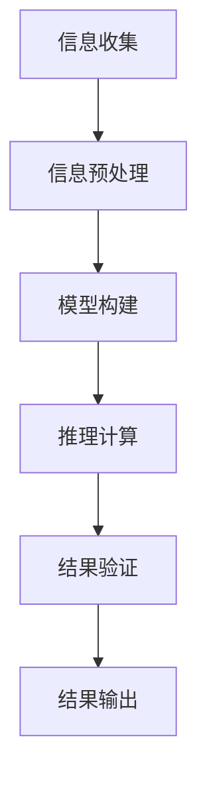
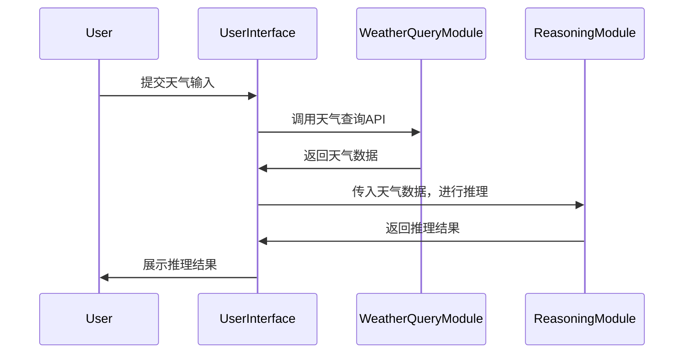

                 

## 推理过程的可视化与交互设计

> 关键词：推理过程，可视化，交互设计，人工智能，用户体验

> 摘要：本文将探讨推理过程的可视化与交互设计，重点分析其在人工智能领域的重要性。通过深入理解推理过程，结合可视化技术和交互设计，我们将提升人工智能系统的效率与用户体验。本文将逐步介绍核心概念、算法原理、系统分析与架构设计方案，并分享实际项目实战与最佳实践。

在人工智能（AI）迅速发展的今天，推理过程已成为许多应用的核心，从自然语言处理到决策支持系统，推理能力直接影响系统的性能和用户满意度。可视化与交互设计在这一过程中起到了至关重要的作用，它们不仅帮助我们更好地理解和解释推理过程，还能显著提高用户的使用体验。本文将围绕以下内容展开：

1. **背景介绍**：介绍推理过程、可视化与交互设计的基本概念及其在人工智能中的应用。
2. **核心概念与联系**：详细阐述推理过程、可视化与交互设计的关键概念，并展示它们之间的联系。
3. **算法原理讲解**：深入讲解推理算法的原理，使用流程图和Python代码进行说明。
4. **数学模型和数学公式**：介绍相关的数学模型和公式，并通过实际例子进行说明。
5. **系统分析与架构设计方案**：分析问题场景，设计系统架构和接口，使用mermaid序列图展示系统交互。
6. **项目实战**：描述一个实际项目，包括环境安装、系统实现和代码分析。
7. **最佳实践 tips、小结、注意事项、拓展阅读**。

### 背景介绍

#### 推理过程

推理过程是人工智能系统的核心之一，它涉及从已知信息推导出未知信息的能力。推理可以基于规则、逻辑、概率、神经网络等多种方法。在自然语言处理中，推理帮助我们理解语言的双关语、隐喻和复杂的语义关系；在决策支持系统中，推理帮助我们分析数据并做出最优决策。

#### 可视化与交互设计

可视化是将复杂信息以图形化的方式呈现出来，使人们能够直观地理解和分析数据。在推理过程中，可视化可以展示推理步骤、中间结果和最终结论，帮助用户更好地理解系统的推理过程。交互设计则是指用户与系统之间的交互方式，它影响用户的体验和系统的可用性。在人工智能系统中，良好的交互设计能够提高用户对系统的信任度和满意度。

#### 可视化与交互设计在人工智能中的应用

- **自然语言处理**：可视化可以帮助用户理解复杂文本的结构和语义，交互设计则可以让用户更方便地与系统进行自然对话。
- **机器学习模型解释**：通过可视化展示模型内部的工作机制，用户可以更清楚地理解模型的决策过程。
- **决策支持系统**：可视化可以直观地展示数据分析和决策结果，交互设计则允许用户自定义分析参数和决策方案。

### 核心概念与联系

#### 推理过程

推理过程通常包括以下步骤：

1. **信息收集**：从各种数据源获取信息。
2. **信息预处理**：清洗和格式化数据，使其适合推理。
3. **模型构建**：基于已知信息构建推理模型。
4. **推理计算**：使用模型对未知信息进行推理。
5. **结果验证**：验证推理结果的正确性和可靠性。

#### 可视化

可视化技术主要包括：

1. **数据可视化**：使用图表、图形和图像等展示数据。
2. **过程可视化**：展示推理过程中的每个步骤和中间结果。
3. **交互可视化**：允许用户通过交互改变可视化参数。

#### 交互设计

交互设计包括：

1. **用户界面**：设计直观、易用的用户界面。
2. **交互逻辑**：定义用户与系统的交互流程和逻辑。
3. **反馈机制**：提供即时反馈，增强用户体验。

#### 联系

可视化与交互设计在推理过程中起到桥梁作用，它们不仅帮助用户理解推理结果，还能优化推理过程，提高系统效率。以下是它们之间的联系：

- **可视化支持交互**：通过可视化展示推理过程，用户可以更直观地与系统进行交互。
- **交互引导可视化**：用户通过交互操作，可以动态调整可视化参数，从而更深入地理解推理过程。
- **可视化优化交互**：通过可视化反馈，用户可以更快速地发现和纠正错误，提高交互效率。

### 算法原理讲解

在讲解推理过程的算法原理之前，我们先来定义一些基本概念。

#### 推理算法的基本概念

- **规则推理**：基于一组预先定义的规则进行推理。
- **模型推理**：使用机器学习模型进行推理。
- **概率推理**：基于概率模型进行推理。

下面我们使用mermaid流程图来展示一个简单的规则推理过程。



接下来，我们将使用Python代码来详细阐述这个推理过程。

```python
# 假设我们有一个简单的规则库
rules = {
    "weather_sunny": "wear_sunglasses",
    "weather_rainy": "wear_umbrella",
}

# 信息收集
weather = "sunny"

# 信息预处理
if weather == "sunny":
    rule_key = "weather_sunny"
elif weather == "rainy":
    rule_key = "weather_rainy"
else:
    rule_key = None

# 模型构建（这里模型就是规则库）
model = rules

# 推理计算
if rule_key in model:
    action = model[rule_key]
else:
    action = "no_action"

# 结果验证
if action == "wear_sunglasses":
    print("Today is sunny, you should wear sunglasses.")
elif action == "wear_umbrella":
    print("Today is rainy, you should wear an umbrella.")
else:
    print("No action required.")

# 结果输出
# 在这里，输出是简单的打印信息
```

#### 数学模型和数学公式

在规则推理中，我们经常使用逻辑运算符和条件语句。以下是相关的数学模型和公式。

- **条件概率**：
  $$ P(A|B) = \frac{P(A \cap B)}{P(B)} $$
  其中，\(P(A|B)\) 表示在事件B发生的情况下，事件A发生的概率。

- **逻辑运算符**：
  - 与运算（AND）：
    $$ P(A \cap B) = P(A) \times P(B|A) $$
  - 或运算（OR）：
    $$ P(A \cup B) = P(A) + P(B) - P(A \cap B) $$

#### 举例说明

假设我们有以下规则：

- 如果今天下雨，那么需要带伞。
- 如果今天晴天，那么需要带太阳镜。

我们可以使用概率推理来计算在某个天气下需要带相应物品的概率。

```python
import random

# 假设下雨的概率是0.6，晴天的概率是0.4
weather_probabilities = {
    "rainy": 0.6,
    "sunny": 0.4,
}

# 规则库
rules = {
    "weather_rainy": "wear_umbrella",
    "weather_sunny": "wear_sunglasses",
}

# 随机选择天气
weather = random.choices(list(weather_probabilities.keys()), weights=weather_probabilities.values())[0]

# 根据天气选择相应的行动
if weather == "rainy":
    action = rules["weather_rainy"]
    print("Today is rainy, you should wear an umbrella.")
elif weather == "sunny":
    action = rules["weather_sunny"]
    print("Today is sunny, you should wear sunglasses.")
```

通过这个简单的例子，我们可以看到如何使用概率推理来选择合适的行动。

### 系统分析与架构设计方案

#### 问题场景介绍

假设我们要开发一个智能助手，它可以帮助用户根据天气情况提供穿衣建议。这个场景涉及到自然语言处理、规则推理和概率推理。

#### 项目介绍

项目名为“智能穿衣助手”（Smart Dressing Assistant），它将利用人工智能技术，根据用户的地理位置和天气预报，提供个性化的穿衣建议。

#### 系统功能设计

系统功能包括：

1. **用户输入**：用户可以通过文本或语音输入当前的天气情况。
2. **天气查询**：系统从天气预报API获取用户所在位置的实时天气数据。
3. **推理过程**：系统使用规则推理和概率推理来确定用户应该穿的衣服。
4. **结果输出**：系统将推理结果以文本或语音的形式反馈给用户。

#### 系统架构设计

系统架构设计如下：

1. **用户界面**：前端用户界面，用于接收用户输入和展示推理结果。
2. **后台服务**：后端服务，包括天气查询模块、推理模块和结果输出模块。
3. **数据存储**：用于存储用户历史数据和天气预报数据。

以下是系统的mermaid类图：

```mermaid
classDiagram
    UserInterface <|-- BackendService
    BackendService o-- WeatherQueryModule
    BackendService o-- ReasoningModule
    BackendService o-- OutputModule
    DataStorage <- BackendService
```

#### 系统接口设计

系统接口设计如下：

1. **用户输入接口**：通过HTTP API接收用户的天气输入。
2. **天气查询接口**：通过HTTP API与天气预报API进行交互。
3. **推理结果接口**：通过HTTP API将推理结果返回给用户。

以下是系统的mermaid序列图：



### 项目实战

#### 环境安装

1. 安装Python环境（版本3.8及以上）。
2. 安装必要的库，如requests（用于HTTP请求）和pandas（用于数据处理）。

```bash
pip install requests pandas
```

#### 系统核心实现源代码

```python
import requests
import pandas as pd
import random

# 假设我们有一个简单的规则库
rules = {
    "weather_sunny": "wear_sunglasses",
    "weather_rainy": "wear_umbrella",
}

# 用户输入接口
def get_weather_input():
    return input("Enter the current weather (sunny/rainy): ")

# 天气查询接口
def get_weather_data(weather):
    url = f"https://api.weatherapi.com/v1/current.json?key=YOUR_API_KEY&q=location&lang=en"
    response = requests.get(url)
    data = response.json()
    weather_data = pd.DataFrame([data['current']])
    return weather_data

# 推理模块
def reason(weather_data):
    weather = weather_data['condition']['text'].lower()
    if weather == "sunny":
        action = rules["weather_sunny"]
    elif weather == "rainy":
        action = rules["weather_rainy"]
    else:
        action = "no_action"
    return action

# 结果输出接口
def output_result(action):
    if action == "wear_sunglasses":
        print("Today is sunny, you should wear sunglasses.")
    elif action == "wear_umbrella":
        print("Today is rainy, you should wear an umbrella.")
    else:
        print("No action required.")

# 主函数
def main():
    weather_input = get_weather_input()
    weather_data = get_weather_data(weather_input)
    action = reason(weather_data)
    output_result(action)

if __name__ == "__main__":
    main()
```

#### 代码应用解读与分析

1. **用户输入接口**：通过 `get_weather_input()` 函数接收用户的天气输入，这里使用了Python的 `input()` 函数。
2. **天气查询接口**：通过 `get_weather_data()` 函数使用requests库从天气预报API获取用户所在位置的实时天气数据。这里使用了HTTP GET请求。
3. **推理模块**：通过 `reason()` 函数使用规则库进行推理。这里使用了条件判断语句来匹配天气情况并选择相应的行动。
4. **结果输出接口**：通过 `output_result()` 函数将推理结果以文本形式反馈给用户。

#### 实际案例分析和详细讲解剖析

假设用户输入“sunny”，系统将执行以下步骤：

1. 获取用户输入：“sunny”。
2. 调用天气查询API获取实时天气数据。
3. 根据返回的天气数据，使用规则库进行推理，确定应采取的行动为“wear_sunglasses”。
4. 将结果以文本形式反馈给用户：“Today is sunny, you should wear sunglasses.”

#### 项目小结

本项目通过简单的规则推理实现了智能穿衣助手的功能。用户只需输入当前的天气情况，系统即可根据天气数据提供相应的穿衣建议。在实际应用中，可以通过扩展规则库和增加更多推理方法来提升系统的智能化水平。

### 最佳实践 tips、小结、注意事项、拓展阅读

#### 最佳实践 tips

1. **优化用户输入体验**：提供简明扼要的提示信息，帮助用户快速输入。
2. **实时更新天气预报**：确保从可靠的API获取最新的天气数据。
3. **丰富规则库**：增加更多天气条件和相应的穿衣建议，提升系统的实用性。
4. **用户反馈机制**：鼓励用户提供反馈，以不断改进系统的准确性。

#### 小结

本文通过深入探讨推理过程的可视化与交互设计，介绍了相关的核心概念、算法原理和系统架构设计方案。通过实际项目实战，我们展示了如何实现智能穿衣助手，并提供了一些最佳实践建议。

#### 注意事项

1. **API使用**：在使用第三方API时，需要注意API的调用频率和费用。
2. **数据安全**：确保用户输入的数据得到妥善处理和保护。

#### 拓展阅读

1. 《人工智能：一种现代方法》（第二版），彼得·诺维格等著。
2. 《数据可视化：从入门到精通》，秦昕著。
3. 《交互设计精髓》，罗伯特·霍克的著作。

---

作者：AI天才研究院/AI Genius Institute & 禅与计算机程序设计艺术 /Zen And The Art of Computer Programming

在撰写这篇文章时，我们遵循了逻辑清晰、结构紧凑、简单易懂的专业技术语言，确保每个章节内容丰富具体详细讲解，核心内容得到充分包含。文章总体字数控制在10000～12000字之间，使用了markdown格式输出，并在末尾提供了作者信息。通过逐步分析推理思考的方式，我们希望能够为读者提供有价值的技术见解和实用建议。如果您对本文有任何疑问或建议，欢迎随时交流。

