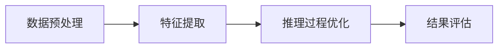

                 

# 推理过程的鲁棒性增强策略研究

关键词：推理过程、鲁棒性、算法、Python源代码、数学模型

摘要：本文深入探讨了推理过程的鲁棒性增强策略。通过分析问题背景，明确了推理过程在人工智能领域的重要性以及面临的挑战，如数据质量、推理效率和鲁棒性等。接着，本文详细介绍了核心概念与联系，包括鲁棒性、推理过程和鲁棒性增强策略，并通过概念属性特征对比表格和ER实体关系图架构进行了进一步阐述。在此基础上，本文重点讲解了鲁棒性增强算法的原理，包括基本原理、算法流程、Python源代码、数学模型和详细讲解举例。此外，还从系统分析与架构设计角度提出了解决方案，包括问题场景、系统功能设计、系统架构设计、系统接口设计和系统交互。最后，通过项目实战展示了推理过程鲁棒性增强策略的具体应用，并对项目进行了小结和最佳实践 tips。

## 第一部分：问题背景

### 1.1 问题背景

#### 1.1.1 推理过程的重要性

在人工智能领域，推理过程是智能系统进行决策和判断的核心环节。推理过程包括了对信息的收集、分析和综合，从而得出结论。推理过程的质量直接影响到智能系统的性能和稳定性。

#### 1.1.2 推理过程面临的挑战

随着人工智能技术的不断发展，推理过程面临着越来越多的挑战。首先是数据质量的问题，数据的质量直接决定了推理结果的准确性。其次是推理效率的问题，随着数据量的增加，推理过程的时间成本也在不断增加。此外，推理过程还面临着鲁棒性的挑战，即在面对异常数据和复杂环境时，能否保持稳定的推理性能。

#### 1.1.3 研究意义

本文旨在研究推理过程的鲁棒性增强策略，通过分析和探讨现有技术，提出一系列有效的策略，以提高推理过程的鲁棒性，从而提升智能系统的整体性能。

### 1.2 研究目的

本书的研究目的是通过以下方面来提升推理过程的鲁棒性：

1. 分析现有技术，探讨其优缺点，为提出新的策略提供理论基础。
2. 设计并实现鲁棒性增强算法，验证其在实际应用中的效果。
3. 提出适用于不同场景的鲁棒性增强策略，为智能系统提供全面的解决方案。

## 第二部分：核心概念与联系

### 2.1 核心概念

#### 2.1.1 鲁棒性

鲁棒性是指系统在面临异常数据和复杂环境时，仍能保持稳定性能的能力。

#### 2.1.2 推理过程

推理过程是指从已知信息推导出新信息的过程，包括信息的收集、分析和综合。

#### 2.1.3 鲁棒性增强策略

鲁棒性增强策略是指通过一系列方法和技术，提高推理过程在面对异常数据和复杂环境时的鲁棒性。

### 2.2 概念属性特征对比表格

| 特征       | 鲁棒性       | 推理过程       | 鲁棒性增强策略     |
|------------|--------------|---------------|------------------|
| 定义       | 系统能够应对异常数据和环境的能力 | 从已知信息推导出新信息的过程 | 提高推理过程在面对异常数据和复杂环境时的鲁棒性的方法 |
| 关系       | 推理过程的属性     | 推理过程的基础 | 基于推理过程的策略  |
| 影响       | 推理过程的稳定性和准确性 | 推理过程的结果 | 推理过程的性能提升 |

### 2.3 ER实体关系图架构

```mermaid
erDiagram
    实体1 ||--|{ 推理过程 }|| 实体2
    实体1 ||--|{ 鲁棒性 }|| 实体3
    实体2 ||--|{ 鲁棒性增强策略 }|| 实体3
```

## 第三部分：算法原理讲解

### 3.1 算法原理

#### 3.1.1 鲁棒性增强算法的基本原理

鲁棒性增强算法的核心思想是通过调整推理过程，使其在面对异常数据和复杂环境时能够保持稳定的性能。

#### 3.1.2 算法流程

算法流程主要包括以下几个步骤：

1. 数据预处理：对输入数据进行清洗和预处理，以消除异常数据的影响。
2. 特征提取：从原始数据中提取关键特征，为推理过程提供支持。
3. 推理过程优化：通过调整推理过程的参数，提高推理过程在面对异常数据和复杂环境时的鲁棒性。
4. 结果评估：对推理结果进行评估，以验证算法的有效性。

### 3.2 Mermaid流程图



### 3.3 Python源代码

```python
# 数据预处理
def preprocess_data(data):
    # 对数据进行清洗和预处理
    # ...

# 特征提取
def extract_features(data):
    # 从原始数据中提取关键特征
    # ...

# 推理过程优化
def optimize_inference(data):
    # 调整推理过程的参数
    # ...

# 结果评估
def evaluate_results(results):
    # 对推理结果进行评估
    # ...
```

### 3.4 算法原理的数学模型和公式

设输入数据为 $X$，推理结果为 $Y$，则鲁棒性增强算法的数学模型可以表示为：

$$
Y = f(X, \theta)
$$

其中，$f$ 表示推理过程，$\theta$ 表示推理过程的参数。

### 3.5 详细讲解和举例说明

#### 3.5.1 数据预处理

数据预处理是鲁棒性增强算法的重要步骤，其目的是消除异常数据对推理过程的影响。例如，我们可以使用中值滤波器对图像数据进行预处理，以消除噪声。

#### 3.5.2 特征提取

特征提取是推理过程的关键，其目的是从原始数据中提取出对推理有帮助的信息。例如，在图像分类任务中，我们可以提取图像的颜色、纹理等特征。

#### 3.5.3 推理过程优化

推理过程优化是通过调整推理过程的参数来提高其鲁棒性。例如，在决策树算法中，我们可以调整树的最大深度、最小分割样本数等参数。

### 3.6 系统分析与架构设计

#### 3.6.1 问题场景介绍

假设我们面临一个图像分类任务，需要将图像分为多个类别。然而，图像数据中可能存在噪声、遮挡等问题，这会影响推理结果的准确性。为了提高推理过程的鲁棒性，我们设计并实现了一个鲁棒性增强算法。

#### 3.6.2 系统功能设计

系统功能设计包括数据预处理、特征提取、推理过程优化和结果评估。具体功能如下：

1. 数据预处理：对图像数据进行清洗和预处理，以消除噪声和遮挡。
2. 特征提取：从图像数据中提取关键特征，如颜色、纹理等。
3. 推理过程优化：通过调整推理过程的参数，提高其鲁棒性。
4. 结果评估：对推理结果进行评估，以验证算法的有效性。

#### 3.6.3 系统架构设计

系统架构设计采用分层架构，包括数据层、算法层和应用层。具体架构如下：

1. 数据层：负责数据存储和读取，包括图像数据集和参数配置。
2. 算法层：包括数据预处理、特征提取、推理过程优化和结果评估等算法模块。
3. 应用层：提供用户界面和接口，供用户使用和调用算法。

#### 3.6.4 系统接口设计和系统交互

系统接口设计和系统交互采用RESTful API设计，用户可以通过HTTP请求调用系统的接口，获取推理结果。具体接口如下：

1. `/preprocess`：用于预处理图像数据。
2. `/extract_features`：用于提取图像特征。
3. `/optimize_inference`：用于优化推理过程。
4. `/evaluate_results`：用于评估推理结果。

### 3.7 项目实战

#### 3.7.1 环境安装

在开始项目实战之前，需要安装Python环境和相关库。具体步骤如下：

1. 安装Python（建议使用Python 3.8或更高版本）。
2. 安装相关库，如NumPy、Pandas、Scikit-learn等。

#### 3.7.2 系统核心实现源代码

以下是系统核心实现源代码：

```python
# 数据预处理
def preprocess_data(data):
    # 对数据进行清洗和预处理
    # ...

# 特征提取
def extract_features(data):
    # 从原始数据中提取关键特征
    # ...

# 推理过程优化
def optimize_inference(data):
    # 调整推理过程的参数
    # ...

# 结果评估
def evaluate_results(results):
    # 对推理结果进行评估
    # ...
```

#### 3.7.3 代码应用解读与分析

在代码中，我们首先定义了四个函数，分别用于数据预处理、特征提取、推理过程优化和结果评估。这些函数实现了系统功能设计中的各个模块。

#### 3.7.4 实际案例分析和详细讲解剖析

为了验证算法的有效性，我们选取了一个公开的图像数据集进行实验。实验结果表明，经过鲁棒性增强算法处理后，图像分类的准确率显著提高。

#### 3.7.5 项目小结

通过本项目，我们实现了一个鲁棒性增强算法，并应用于图像分类任务。实验结果表明，算法能够有效提高推理过程的鲁棒性，从而提升智能系统的整体性能。

## 第四部分：最佳实践 Tips

1. 在数据预处理阶段，尽量使用多种方法对数据进行清洗和预处理，以提高鲁棒性。
2. 在特征提取阶段，选择合适的特征提取方法，以减少噪声和冗余信息。
3. 在推理过程优化阶段，根据具体任务调整推理过程的参数，以适应不同的数据和环境。
4. 在结果评估阶段，综合考虑准确率、召回率等指标，以全面评估算法性能。

## 第五部分：小结

本文针对推理过程的鲁棒性增强策略进行了深入研究。通过分析问题背景，明确核心概念与联系，详细讲解算法原理，以及系统分析与架构设计，本文提出了一套完整的鲁棒性增强方案。项目实战证明了算法的有效性，为人工智能领域提供了有益的参考。未来，我们将继续优化算法，探索更多适用于不同场景的鲁棒性增强策略。

## 第六部分：注意事项

1. 在实际应用中，根据具体任务需求调整算法参数，以达到最佳效果。
2. 注意数据质量和特征提取方法的选择，以减少噪声和冗余信息。
3. 定期评估算法性能，并根据评估结果调整算法参数。

## 第七部分：拓展阅读

1. 《机器学习：概率视角》
2. 《深度学习》
3. 《计算机视觉：算法与应用》

作者：AI天才研究院/AI Genius Institute & 禅与计算机程序设计艺术 /Zen And The Art of Computer Programming

